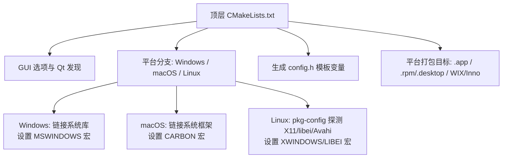
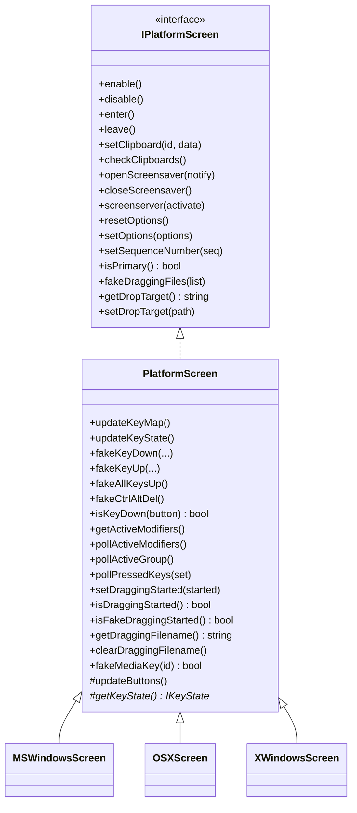
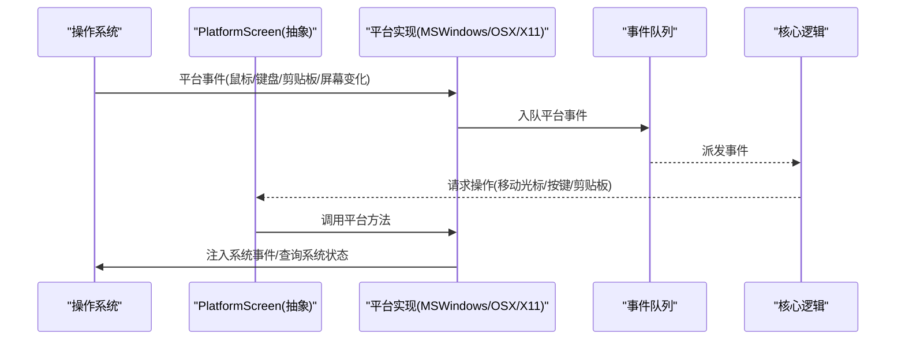
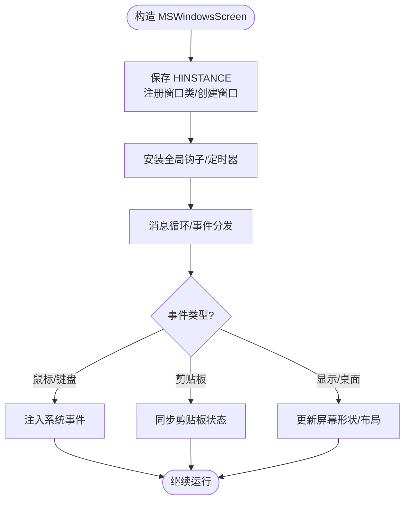
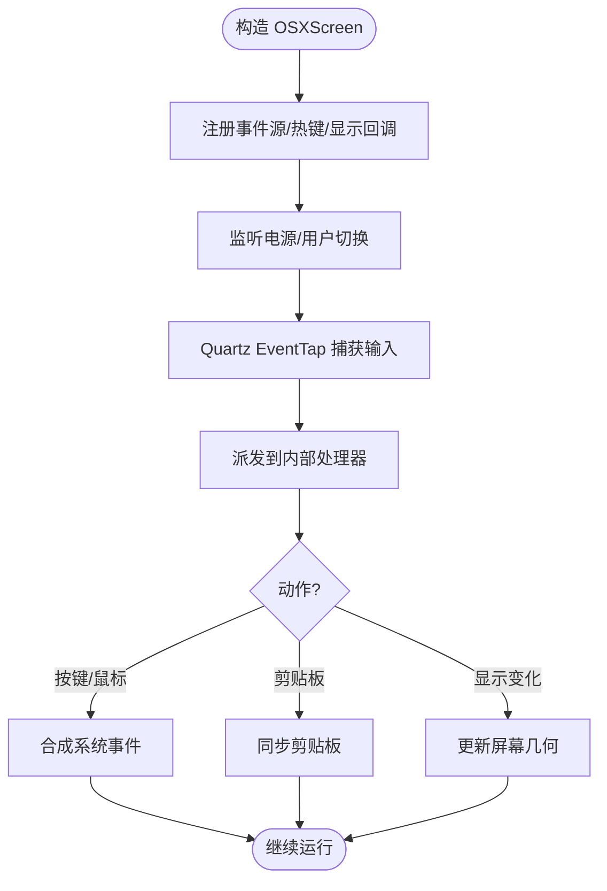
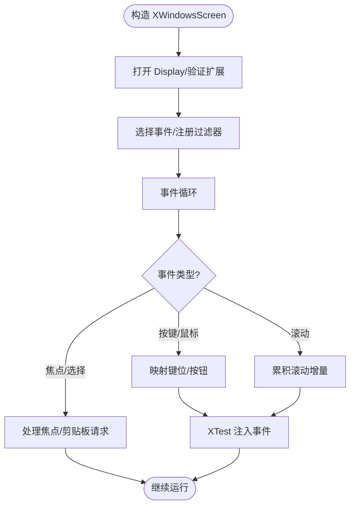

# 跨平台编译

<cite>
**本文引用的文件**   
- [CMakeLists.txt](file://CMakeLists.txt)
- [config.h.in](file://src/lib/config.h.in)
- [README.md](file://README.md)
- [PlatformScreen.h](file://src/lib/inputleap/PlatformScreen.h)
- [MSWindowsScreen.h](file://src/lib/platform/MSWindowsScreen.h)
- [OSXScreen.h](file://src/lib/platform/OSXScreen.h)
- [XWindowsScreen.h](file://src/lib/platform/XWindowsScreen.h)
- [MSWindowsScreen.cpp](file://src/lib/platform/MSWindowsScreen.cpp)
- [XWindowsScreen.cpp](file://src/lib/platform/XWindowsScreen.cpp)
- [clean_build.ps1](file://clean_build.ps1)
- [clean_build.sh](file://clean_build.sh)
</cite>

## 目录
1. [简介](#简介)
2. [项目结构](#项目结构)
3. [核心组件](#核心组件)
4. [架构总览](#架构总览)
5. [详细组件分析](#详细组件分析)
6. [依赖与构建差异](#依赖与构建差异)
7. [交叉编译指南](#交叉编译指南)
8. [性能与打包](#性能与打包)
9. [故障排查](#故障排查)
10. [结论](#结论)
11. [附录](#附录)

## 简介
本技术文档聚焦于 Input Leap 在 Windows、macOS、Linux 三大平台的跨平台编译要求与配置差异，解释平台抽象层的设计与实现（MSWindowsScreen、OSXScreen、XWindowsScreen），并说明各平台依赖库、系统 API 调用与打包格式。同时提供交叉编译方法与常见问题排查建议，涵盖 ARM64 等架构支持与移植注意事项。

## 项目结构
Input Leap 使用 CMake 作为统一构建系统，顶层 CMakeLists.txt 负责：
- 选择 Qt 版本与 GUI 开关
- 检测平台并启用相应宏定义（如 SYSAPI_WIN32/SYSAPI_UNIX）
- 查找并链接平台相关依赖（OpenSSL、X11、libei、Avahi、系统框架等）
- 生成平台特定产物（macOS Bundle、Linux man/appdata/desktop、Windows Installer）

图表来源
- [CMakeLists.txt:71-89](file://CMakeLists.txt#L71-L89)
- [CMakeLists.txt:117-202](file://CMakeLists.txt#L117-L202)
- [CMakeLists.txt:230-247](file://CMakeLists.txt#L230-L247)
- [CMakeLists.txt:289-322](file://CMakeLists.txt#L289-L322)

章节来源
- [CMakeLists.txt:18-46](file://CMakeLists.txt#L18-L46)
- [CMakeLists.txt:71-89](file://CMakeLists.txt#L71-L89)
- [CMakeLists.txt:117-202](file://CMakeLists.txt#L117-L202)
- [CMakeLists.txt:230-247](file://CMakeLists.txt#L230-L247)
- [CMakeLists.txt:289-322](file://CMakeLists.txt#L289-L322)

## 核心组件
平台抽象层通过统一的接口将不同操作系统的具体实现解耦：
- PlatformScreen：平台无关的基类，封装通用能力（按键状态、拖拽、媒体键等），并要求子类实现更新按钮映射与获取 KeyState 等关键方法。
- 平台实现：
  - MSWindowsScreen：基于 Win32 API、全局钩子、热键、剪贴板链、桌面切换等。
  - OSXScreen：基于 Carbon/Quartz/IOKit 等系统框架，处理事件、电源管理、屏幕变化等。
  - XWindowsScreen：基于 X11/XKB/XTest/XRandR/XInput2，支持 Wayland 下 XWayland 的检测与适配。

图表来源
- [PlatformScreen.h:34-94](file://src/lib/inputleap/PlatformScreen.h#L34-L94)
- [MSWindowsScreen.h:42-126](file://src/lib/platform/MSWindowsScreen.h#L42-L126)
- [OSXScreen.h:53-104](file://src/lib/platform/OSXScreen.h#L53-L104)
- [XWindowsScreen.h:39-89](file://src/lib/platform/XWindowsScreen.h#L39-L89)

章节来源
- [PlatformScreen.h:34-94](file://src/lib/inputleap/PlatformScreen.h#L34-L94)
- [MSWindowsScreen.h:42-126](file://src/lib/platform/MSWindowsScreen.h#L42-L126)
- [OSXScreen.h:53-104](file://src/lib/platform/OSXScreen.h#L53-L104)
- [XWindowsScreen.h:39-89](file://src/lib/platform/XWindowsScreen.h#L39-L89)

## 架构总览
输入事件从平台驱动进入具体 Screen 实现，经事件队列分发到上层逻辑；输出事件由 Screen 通过平台 API 注入系统。

图表来源
- [MSWindowsScreen.cpp:156-186](file://src/lib/platform/MSWindowsScreen.cpp#L156-L186)
- [XWindowsScreen.cpp:154-194](file://src/lib/platform/XWindowsScreen.cpp#L154-L194)

## 详细组件分析

### Windows 平台（MSWindowsScreen）
- 初始化与资源管理：保存 HINSTANCE，注册窗口类，创建隐藏窗口用于剪贴板监听与消息循环，安装全局钩子与定时器。
- 事件处理：通过预分发与消息处理器捕获鼠标、键盘、热键、屏幕变化、剪贴板变更等。
- 输入模拟：使用 Win32 输入 API 进行按键/鼠标模拟，支持多显示器与桌面切换。
- 错误处理：窗口创建失败抛出异常；OleUninitialize 清理 COM；确保线程与句柄释放。

图表来源
- [MSWindowsScreen.h:42-126](file://src/lib/platform/MSWindowsScreen.h#L42-L126)
- [MSWindowsScreen.cpp:156-210](file://src/lib/platform/MSWindowsScreen.cpp#L156-L210)

章节来源
- [MSWindowsScreen.h:42-126](file://src/lib/platform/MSWindowsScreen.h#L42-L126)
- [MSWindowsScreen.cpp:156-210](file://src/lib/platform/MSWindowsScreen.cpp#L156-L210)

### macOS 平台（OSXScreen）
- 系统框架：使用 Carbon/Quartz/IOKit 等框架，处理 Quartz 事件、显示重配置回调、用户快速切换、电源管理。
- 事件与热键：通过 EventTap 捕获输入，Carbon 热键机制注册全局快捷键。
- 剪贴板与拖放：维护 Pasteboard 序列号，后台线程获取拖放目标路径。
- 电源与休眠：监听 IOKit 电源消息，防止系统休眠或唤醒后状态不一致。

图表来源
- [OSXScreen.h:53-104](file://src/lib/platform/OSXScreen.h#L53-L104)

章节来源
- [OSXScreen.h:53-104](file://src/lib/platform/OSXScreen.h#L53-L104)

### Linux 平台（XWindowsScreen）
- X11 连接与扩展：打开 Display，检查 XTest、XKB、XRandR、XInput2 可用性，必要时回退策略。
- 事件与输入法：选择根窗口事件，处理按键/鼠标/滚动，集成 XIM/XIC 以支持 IME。
- 剪贴板与焦点：维护 Selection 与焦点恢复，避免某些前端（如 MythTV）丢失焦点。
- Wayland 兼容：检测 XWayland，调整行为以确保兼容性。

图表来源
- [XWindowsScreen.h:39-89](file://src/lib/platform/XWindowsScreen.h#L39-L89)
- [XWindowsScreen.cpp:154-194](file://src/lib/platform/XWindowsScreen.cpp#L154-L194)

章节来源
- [XWindowsScreen.h:39-89](file://src/lib/platform/XWindowsScreen.h#L39-L89)
- [XWindowsScreen.cpp:154-194](file://src/lib/platform/XWindowsScreen.cpp#L154-L194)

## 依赖与构建差异

### 公共依赖
- OpenSSL：在所有平台上均需要，macOS 与 Windows 默认静态链接。
- Qt：GUI 构建需要 Qt5 或 Qt6（默认 Qt6），包含 Core 模块；部署工具 windeployqt/macdeployqt 在对应平台可用。

章节来源
- [CMakeLists.txt:71-89](file://CMakeLists.txt#L71-L89)
- [CMakeLists.txt:254-258](file://CMakeLists.txt#L254-L258)

### Windows 特定
- 编译器与标准：启用并行编译与调试信息，Release 优化；C++ 标准根据 Qt 版本选择 14/17。
- 系统库：Wtsapi32、Userenv、Wininet、comsuppw、Shlwapi 等。
- 宏定义：SYSAPI_WIN32、WINAPI_MSWINDOWS、BUILD_MSWINDOWS。
- 打包：生成 WIX 与 Inno 安装包。

章节来源
- [CMakeLists.txt:230-247](file://CMakeLists.txt#L230-L247)
- [CMakeLists.txt:316-322](file://CMakeLists.txt#L316-L322)

### macOS 特定
- 系统框架：ScreenSaver、IOKit、ApplicationServices、Foundation、Carbon。
- 宏定义：WINAPI_CARBON、BUILD_CARBON、THREAD_SAFE。
- 打包：生成 .app Bundle，设置 RPATH 指向应用内 Libraries/Frameworks。

章节来源
- [CMakeLists.txt:117-132](file://CMakeLists.txt#L117-L132)
- [CMakeLists.txt:213-216](file://CMakeLists.txt#L213-L216)
- [CMakeLists.txt:289-302](file://CMakeLists.txt#L289-L302)

### Linux 特定
- 构建选项：INPUTLEAP_BUILD_X11（默认开启）、INPUTLEAP_BUILD_LIBEI（可选）。
- 依赖探测：pkg-config 必需；X11 相关库 x11/xext/xrandr/xinerama/xtst/xi；ICE/SM；可选 libei、xkbcommon、glib/gio、libportal。
- 宏定义：SYSAPI_UNIX、WINAPI_XWINDOWS/BUILD_XWINDOWS 或 WINAPI_LIBEI/BUILD_LIBEI；至少启用 X11 或 libei 之一。
- 元数据：安装 man 页、appdata.xml、图标与 desktop 文件。

章节来源
- [CMakeLists.txt:156-202](file://CMakeLists.txt#L156-L202)
- [CMakeLists.txt:217-228](file://CMakeLists.txt#L217-L228)
- [CMakeLists.txt:303-311](file://CMakeLists.txt#L303-L311)

### 配置头生成
- config.h.in 中定义了平台与功能探测结果（如 HAVE_SYS_SOCKET_H、HAVE_GETPWUID_R、HAVE_LIBPORTAL_*、HAVE_LIBEI_SEQUENCE_NUMBER 等），供源码条件编译使用。

章节来源
- [config.h.in:1-42](file://src/lib/config.h.in#L1-L42)

## 交叉编译指南

### Windows 交叉编译（例如从 Linux 构建 Windows 目标）
- 工具链：安装 mingw-w64 工具链与 Windows SDK 头文件。
- 依赖：准备 OpenSSL 的 Windows 静态库（或动态库及运行时），Qt for Windows。
- CMake 参数示例：
  - -DCMAKE_TOOLCHAIN_FILE=<mingw-w64 工具链文件>
  - -DQT_DEFAULT_MAJOR_VERSION=6（或 5）
  - -DINPUTLEAP_BUILD_GUI=ON/OFF
  - -DOPENSSL_ROOT_DIR=<OpenSSL Windows 安装路径>
- 打包：生成后可使用 windeployqt 收集依赖 DLL。

注意：需确保 CMake 能正确找到 Qt 与 OpenSSL 的 Windows 版本。

### macOS 交叉编译（Intel → Apple Silicon 或反之）
- 工具链：Xcode 命令行工具与对应的 SDK。
- 环境变量：
  - CMAKE_OSX_ARCHITECTURES="arm64;x86_64"（双架构 Universal Binary）
  - CMAKE_OSX_DEPLOYMENT_TARGET=10.12+（依据需求）
  - CMAKE_OSX_SYSROOT 指向合适的 SDK（顶层 CMake 已使用）
- 依赖：OpenSSL 静态库（Apple 平台默认静态链接），Qt for macOS。
- 打包：构建完成后使用 macdeployqt 部署插件与依赖。

章节来源
- [CMakeLists.txt:117-118](file://CMakeLists.txt#L117-L118)
- [CMakeLists.txt:289-302](file://CMakeLists.txt#L289-L302)

### Linux 交叉编译（x86_64 → ARM64）
- 工具链：aarch64-linux-gnu-gcc/g++ 及相关开发包。
- 依赖：为 ARM64 目标安装 X11、libei、xkbcommon、glib/gio、libportal 等库与头文件。
- CMake 参数示例：
  - -DCMAKE_TOOLCHAIN_FILE=<aarch64 工具链文件>
  - -DINPUTLEAP_BUILD_X11=ON 或 -DINPUTLEAP_BUILD_LIBEI=ON
  - -DPKG_CONFIG_PATH=/usr/aarch64-linux-gnu/lib/pkgconfig
- 打包：生成可执行文件与共享库，按发行版规范安装 man 页与 desktop 文件。

章节来源
- [CMakeLists.txt:156-202](file://CMakeLists.txt#L156-L202)
- [CMakeLists.txt:303-311](file://CMakeLists.txt#L303-L311)

## 性能与打包

### 性能考虑
- Windows：减少不必要的轮询与消息刷新；合理设置定时器间隔；避免频繁剪贴板同步。
- macOS：节流 EventTap 事件处理；合并滚动事件；谨慎使用全局热键以避免系统冲突。
- Linux：利用 XI2 原始运动事件提升精度；累积滚动增量以减少事件风暴；在 XWayland 环境下避免过度抓取。

### 打包格式
- Windows：WIX 与 Inno 安装包；运行时依赖通过 windeployqt 收集。
- macOS：.app Bundle，RPATH 指向应用内 Libraries/Frameworks；使用 macdeployqt 部署插件。
- Linux：man 页、appdata.xml、图标与 desktop 文件安装至标准位置；按需生成 RPM/DEB 包。

章节来源
- [CMakeLists.txt:289-322](file://CMakeLists.txt#L289-L322)
- [CMakeLists.txt:303-311](file://CMakeLists.txt#L303-L311)

## 故障排查

### 常见构建问题
- pkg-config 缺失（Linux）：需安装 pkg-config 并确保 X11/libei 等库的 .pc 文件可用。
- 缺少 dns_sd.h（Linux GUI）：需安装 Avahi 兼容库或禁用 GUI。
- X11 或 libei 未启用（Linux）：必须至少启用其一，否则构建失败。
- OpenSSL 版本不满足：需 1.1.1 或以上版本。

章节来源
- [CMakeLists.txt:135-137](file://CMakeLists.txt#L135-L137)
- [CMakeLists.txt:198-201](file://CMakeLists.txt#L198-L201)
- [CMakeLists.txt:225-227](file://CMakeLists.txt#L225-L227)
- [CMakeLists.txt:258](file://CMakeLists.txt#L258)

### 运行时问题
- Windows：窗口类注册失败或 COM 初始化异常；检查 HINSTANCE 是否正确传递与 OleUninitialize 是否调用。
- macOS：EventTap 权限不足或电源管理回调未生效；确认权限与 IOKit 连接。
- Linux：XTest 扩展不可用或 XWayland 行为异常；检查 DISPLAY 环境变量与扩展可用性。

章节来源
- [MSWindowsScreen.cpp:156-186](file://src/lib/platform/MSWindowsScreen.cpp#L156-L186)
- [XWindowsScreen.cpp:154-194](file://src/lib/platform/XWindowsScreen.cpp#L154-L194)

## 结论
Input Leap 通过统一的平台抽象层与 CMake 构建系统，实现了在 Windows、macOS、Linux 上的跨平台编译与运行。各平台依赖与系统 API 差异通过条件编译与平台特定实现隔离，便于维护与扩展。遵循本文的依赖与交叉编译指南，可有效降低构建与移植成本。

## 附录

### 支持的操作系统与版本
- Windows 10/11（不支持 32 位）
- macOS 10.12 及以上
- Linux（主流发行版）
- FreeBSD/OpenBSD（部分支持）

章节来源
- [README.md:114-123](file://README.md#L114-L123)
- [README.md:124-131](file://README.md#L124-L131)

### 清理与重建脚本
- clean_build.ps1：Windows 环境下的清理与重建脚本。
- clean_build.sh：Unix 环境下的清理与重建脚本。

章节来源
- [clean_build.ps1](file://clean_build.ps1)
- [clean_build.sh](file://clean_build.sh)