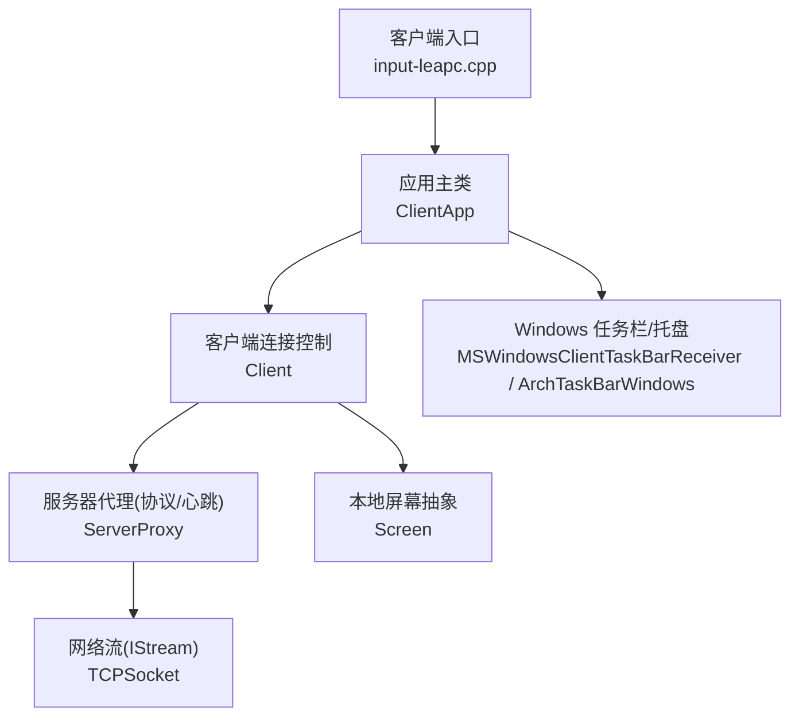
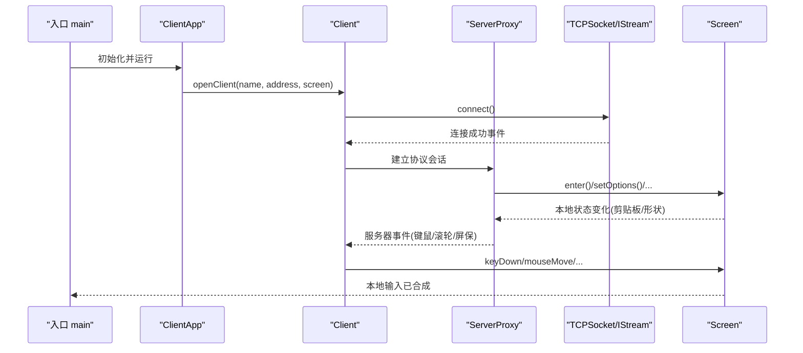
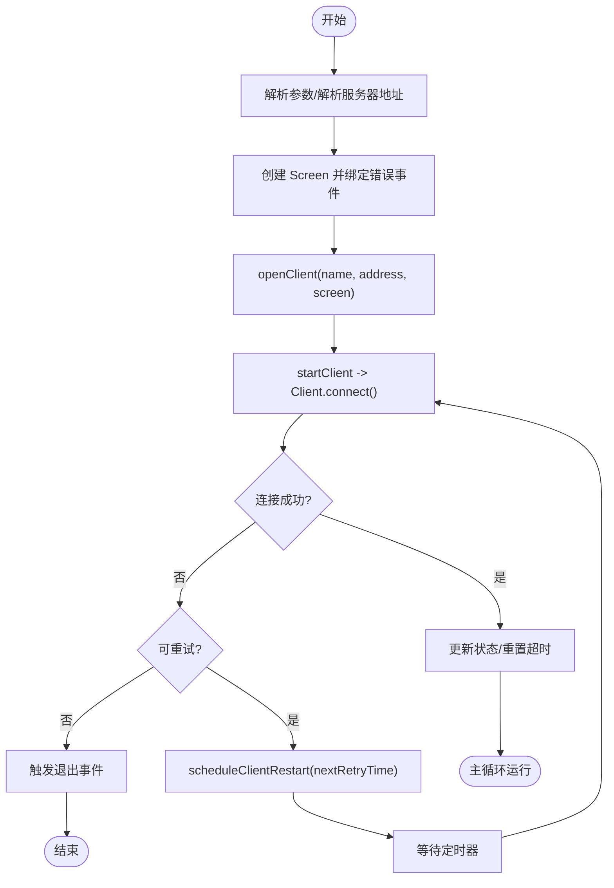
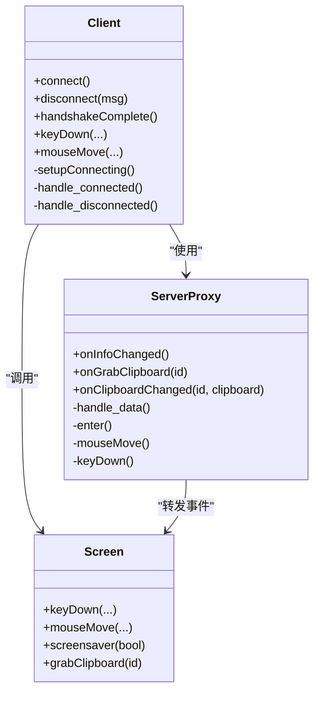
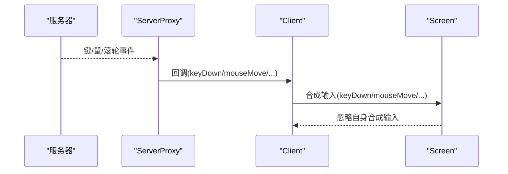
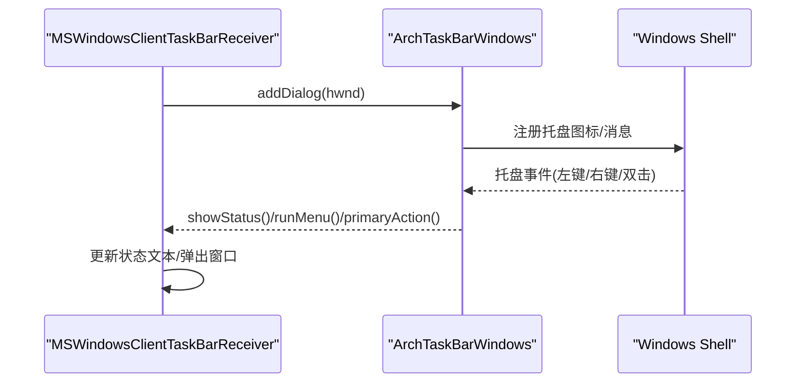
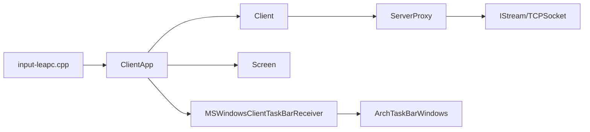

# 客户端模块

<cite>
**本文引用的文件**   
- [src/client/input-leapc.cpp](file://src/client/input-leapc.cpp)
- [src/lib/inputleap/ClientApp.h](file://src/lib/inputleap/ClientApp.h)
- [src/lib/inputleap/ClientApp.cpp](file://src/lib/inputleap/ClientApp.cpp)
- [src/lib/client/Client.h](file://src/lib/client/Client.h)
- [src/lib/client/ServerProxy.h](file://src/lib/client/ServerProxy.h)
- [src/lib/client/ServerProxy.cpp](file://src/lib/client/ServerProxy.cpp)
- [src/lib/inputleap/Screen.h](file://src/lib/inputleap/Screen.h)
- [src/client/MSWindowsClientTaskBarReceiver.cpp](file://src/client/MSWindowsClientTaskBarReceiver.cpp)
- [src/lib/arch/win32/ArchTaskBarWindows.cpp](file://src/lib/arch/win32/ArchTaskBarWindows.cpp)
- [src/lib/net/TCPSocket.cpp](file://src/lib/net/TCPSocket.cpp)
</cite>

## 目录
1. [简介](#简介)
2. [项目结构](#项目结构)
3. [核心组件](#核心组件)
4. [架构总览](#架构总览)
5. [详细组件分析](#详细组件分析)
6. [依赖关系分析](#依赖关系分析)
7. [性能考虑](#性能考虑)
8. [故障诊断指南](#故障诊断指南)
9. [结论](#结论)
10. [附录](#附录)

## 简介
本技术文档聚焦 Input Leap 的客户端模块，系统性阐述客户端应用的连接建立、维护机制与输入事件转发逻辑。重点解析 ClientApp 类的职责边界：包括连接管理、重连策略、错误处理与资源清理；说明客户端如何接收来自服务器的输入事件并在本地模拟用户操作；并介绍平台特定的任务栏集成与系统托盘功能（以 Windows 为例）。文末提供网络连接优化与故障诊断指导，帮助读者快速定位问题并进行调优。

## 项目结构
客户端入口位于 src/client/input-leapc.cpp，负责初始化平台抽象层、日志与事件队列，并启动 ClientApp。核心业务逻辑集中在 lib/inputleap/ClientApp.*，网络协议与事件转发由 lib/client/Client 与 ServerProxy 协作完成，屏幕事件合成由 lib/inputleap/Screen 驱动。Windows 平台的任务栏与托盘集成通过 MSWindowsClientTaskBarReceiver 与 ArchTaskBarWindows 实现。

图表来源
- [src/client/input-leapc.cpp:34-56](file://src/client/input-leapc.cpp#L34-L56)
- [src/lib/inputleap/ClientApp.cpp:69-75](file://src/lib/inputleap/ClientApp.cpp#L69-L75)
- [src/lib/client/Client.h:40-80](file://src/lib/client/Client.h#L40-L80)
- [src/lib/client/ServerProxy.h:39-66](file://src/lib/client/ServerProxy.h#L39-L66)
- [src/lib/net/TCPSocket.cpp:39-69](file://src/lib/net/TCPSocket.cpp#L39-L69)
- [src/client/MSWindowsClientTaskBarReceiver.cpp:80-100](file://src/client/MSWindowsClientTaskBarReceiver.cpp#L80-L100)
- [src/lib/arch/win32/ArchTaskBarWindows.cpp:87-120](file://src/lib/arch/win32/ArchTaskBarWindows.cpp#L87-L120)

章节来源
- [src/client/input-leapc.cpp:34-56](file://src/client/input-leapc.cpp#L34-L56)
- [src/lib/inputleap/ClientApp.h:31-85](file://src/lib/inputleap/ClientApp.h#L31-L85)

## 核心组件
- ClientApp：客户端应用主控制器，负责参数解析、屏幕创建、连接生命周期管理、状态更新与重连调度。
- Client：客户端连接主体，封装与远端服务器的握手、事件收发、剪贴板同步、拖拽传输等。
- ServerProxy：协议编解码与消息分发，将服务器指令转换为对 Client 和 Screen 的调用，并维护心跳。
- Screen：本地屏幕抽象，负责将远程事件转化为本地操作系统输入（键鼠、滚轮、屏保等），并提供热键注册、拖放支持。
- Windows 任务栏/托盘：MSWindowsClientTaskBarReceiver 与 ArchTaskBarWindows 协作，提供状态提示、菜单与交互窗口。

章节来源
- [src/lib/inputleap/ClientApp.h:31-85](file://src/lib/inputleap/ClientApp.h#L31-L85)
- [src/lib/client/Client.h:40-156](file://src/lib/client/Client.h#L40-L156)
- [src/lib/client/ServerProxy.h:39-133](file://src/lib/client/ServerProxy.h#L39-L133)
- [src/lib/inputleap/Screen.h:39-229](file://src/lib/inputleap/Screen.h#L39-L229)
- [src/client/MSWindowsClientTaskBarReceiver.cpp:80-100](file://src/client/MSWindowsClientTaskBarReceiver.cpp#L80-L100)
- [src/lib/arch/win32/ArchTaskBarWindows.cpp:87-120](file://src/lib/arch/win32/ArchTaskBarWindows.cpp#L87-L120)

## 架构总览
下图展示客户端从启动到建立连接、接收事件并合成到本地的整体流程。

图表来源
- [src/client/input-leapc.cpp:34-56](file://src/client/input-leapc.cpp#L34-L56)
- [src/lib/inputleap/ClientApp.cpp:312-337](file://src/lib/inputleap/ClientApp.cpp#L312-L337)
- [src/lib/client/Client.h:55-80](file://src/lib/client/Client.h#L55-L80)
- [src/lib/client/ServerProxy.cpp:40-71](file://src/lib/client/ServerProxy.cpp#L40-L71)
- [src/lib/net/TCPSocket.cpp:39-69](file://src/lib/net/TCPSocket.cpp#L39-L69)
- [src/lib/inputleap/Screen.h:114-173](file://src/lib/inputleap/Screen.h#L114-L173)

## 详细组件分析

### ClientApp 类分析
职责概览
- 参数解析与地址解析：解析命令行参数，构建并解析服务器地址，支持可重启模式下的延迟解析。
- 屏幕创建与错误绑定：创建平台无关的 Screen，并订阅屏幕错误事件以触发退出。
- 连接管理：openClient/closeClient/startClient/stopClient 管理 Client 实例的生命周期。
- 重连策略：scheduleClientRestart + nextRestartTimeout 基于定时器进行指数退避或固定间隔重试。
- 状态更新：updateStatus 与任务栏接收器联动，显示连接状态。
- 事件处理：handle_client_connected/failed/disconnected 统一处理连接状态变更。

关键流程
- 连接建立：openClient 构造 Client，注册 CLIENT_CONNECTED/CLIENT_CONNECTION_FAILED/CLIENT_DISCONNECTED 事件处理器，随后 startClient 发起连接。
- 失败与断开：根据是否允许自动重启决定是否安排重连或退出。
- 资源清理：closeClient 移除事件监听、释放对象，避免悬挂引用。

图表来源
- [src/lib/inputleap/ClientApp.cpp:82-110](file://src/lib/inputleap/ClientApp.cpp#L82-L110)
- [src/lib/inputleap/ClientApp.cpp:237-247](file://src/lib/inputleap/ClientApp.cpp#L237-L247)
- [src/lib/inputleap/ClientApp.cpp:312-337](file://src/lib/inputleap/ClientApp.cpp#L312-L337)
- [src/lib/inputleap/ClientApp.cpp:262-269](file://src/lib/inputleap/ClientApp.cpp#L262-L269)
- [src/lib/inputleap/ClientApp.cpp:272-310](file://src/lib/inputleap/ClientApp.cpp#L272-L310)

章节来源
- [src/lib/inputleap/ClientApp.h:31-85](file://src/lib/inputleap/ClientApp.h#L31-L85)
- [src/lib/inputleap/ClientApp.cpp:69-75](file://src/lib/inputleap/ClientApp.cpp#L69-L75)
- [src/lib/inputleap/ClientApp.cpp:82-110](file://src/lib/inputleap/ClientApp.cpp#L82-L110)
- [src/lib/inputleap/ClientApp.cpp:237-247](file://src/lib/inputleap/ClientApp.cpp#L237-L247)
- [src/lib/inputleap/ClientApp.cpp:262-269](file://src/lib/inputleap/ClientApp.cpp#L262-L269)
- [src/lib/inputleap/ClientApp.cpp:272-310](file://src/lib/inputleap/ClientApp.cpp#L272-L310)
- [src/lib/inputleap/ClientApp.cpp:312-337](file://src/lib/inputleap/ClientApp.cpp#L312-L337)

### Client 与 ServerProxy 协作
- Client 负责连接生命周期、事件派发、剪贴板与拖拽数据流转，并通过 ServerProxy 与服务器进行协议级通信。
- ServerProxy 维护心跳、压缩鼠标移动、按键修饰符映射，并将服务器消息分派为对 Client 与 Screen 的调用。

图表来源
- [src/lib/client/Client.h:40-156](file://src/lib/client/Client.h#L40-L156)
- [src/lib/client/ServerProxy.h:39-133](file://src/lib/client/ServerProxy.h#L39-L133)
- [src/lib/inputleap/Screen.h:114-173](file://src/lib/inputleap/Screen.h#L114-L173)

章节来源
- [src/lib/client/Client.h:40-156](file://src/lib/client/Client.h#L40-L156)
- [src/lib/client/ServerProxy.h:39-133](file://src/lib/client/ServerProxy.h#L39-L133)
- [src/lib/client/ServerProxy.cpp:40-71](file://src/lib/client/ServerProxy.cpp#L40-L71)
- [src/lib/inputleap/Screen.h:114-173](file://src/lib/inputleap/Screen.h#L114-L173)

### 输入事件转发与本地模拟
- 服务器侧发送键鼠事件后，ServerProxy 解析并调用 Client 对应方法，再由 Client 调用 Screen 的合成接口在本地生成输入。
- Screen 屏蔽自身合成的输入以避免回环，同时支持热键注册与拖放。

图表来源
- [src/lib/client/ServerProxy.h:86-109](file://src/lib/client/ServerProxy.h#L86-L109)
- [src/lib/client/Client.h:138-156](file://src/lib/client/Client.h#L138-L156)
- [src/lib/inputleap/Screen.h:114-173](file://src/lib/inputleap/Screen.h#L114-L173)

章节来源
- [src/lib/client/ServerProxy.h:86-109](file://src/lib/client/ServerProxy.h#L86-L109)
- [src/lib/client/Client.h:138-156](file://src/lib/client/Client.h#L138-L156)
- [src/lib/inputleap/Screen.h:114-173](file://src/lib/inputleap/Screen.h#L114-L173)

### Windows 任务栏与系统托盘集成
- MSWindowsClientTaskBarReceiver 负责创建状态对话框、更新工具提示、响应托盘图标点击与右键菜单。
- ArchTaskBarWindows 作为底层桥接，管理托盘图标注册、消息分发与窗口置顶等。

图表来源
- [src/client/MSWindowsClientTaskBarReceiver.cpp:80-100](file://src/client/MSWindowsClientTaskBarReceiver.cpp#L80-L100)
- [src/client/MSWindowsClientTaskBarReceiver.cpp:273-306](file://src/client/MSWindowsClientTaskBarReceiver.cpp#L273-L306)
- [src/lib/arch/win32/ArchTaskBarWindows.cpp:87-120](file://src/lib/arch/win32/ArchTaskBarWindows.cpp#L87-L120)
- [src/lib/arch/win32/ArchTaskBarWindows.cpp:277-305](file://src/lib/arch/win32/ArchTaskBarWindows.cpp#L277-L305)

章节来源
- [src/client/MSWindowsClientTaskBarReceiver.cpp:80-100](file://src/client/MSWindowsClientTaskBarReceiver.cpp#L80-L100)
- [src/client/MSWindowsClientTaskBarReceiver.cpp:273-306](file://src/client/MSWindowsClientTaskBarReceiver.cpp#L273-L306)
- [src/lib/arch/win32/ArchTaskBarWindows.cpp:87-120](file://src/lib/arch/win32/ArchTaskBarWindows.cpp#L87-L120)
- [src/lib/arch/win32/ArchTaskBarWindows.cpp:277-305](file://src/lib/arch/win32/ArchTaskBarWindows.cpp#L277-L305)

## 依赖关系分析
- 入口依赖 ClientApp，ClientApp 依赖 Client 与 Screen，Client 依赖 ServerProxy 与 IStream（TCP 套接字）。
- Windows 平台下，ClientApp 通过任务栏接收器与 ArchTaskBarWindows 交互。

图表来源
- [src/client/input-leapc.cpp:34-56](file://src/client/input-leapc.cpp#L34-L56)
- [src/lib/inputleap/ClientApp.cpp:312-337](file://src/lib/inputleap/ClientApp.cpp#L312-L337)
- [src/lib/client/ServerProxy.cpp:40-71](file://src/lib/client/ServerProxy.cpp#L40-L71)
- [src/lib/net/TCPSocket.cpp:39-69](file://src/lib/net/TCPSocket.cpp#L39-L69)
- [src/client/MSWindowsClientTaskBarReceiver.cpp:80-100](file://src/client/MSWindowsClientTaskBarReceiver.cpp#L80-L100)
- [src/lib/arch/win32/ArchTaskBarWindows.cpp:87-120](file://src/lib/arch/win32/ArchTaskBarWindows.cpp#L87-L120)

章节来源
- [src/client/input-leapc.cpp:34-56](file://src/client/input-leapc.cpp#L34-L56)
- [src/lib/inputleap/ClientApp.cpp:312-337](file://src/lib/inputleap/ClientApp.cpp#L312-L337)
- [src/lib/client/ServerProxy.cpp:40-71](file://src/lib/client/ServerProxy.cpp#L40-L71)
- [src/lib/net/TCPSocket.cpp:39-69](file://src/lib/net/TCPSocket.cpp#L39-L69)

## 性能考虑
- 鼠标移动压缩：ServerProxy 内部维护压缩标志与坐标增量，减少高频移动事件的带宽占用。
- 心跳机制：ServerProxy 维护 keepAliveAlarm 与定时器，确保连接活跃性检测与及时断线恢复。
- 事件队列与多路复用：基于 EventQueue 与 SocketMultiplexer 的事件驱动模型，降低线程切换开销。
- 剪贴板同步：按需抓取与脏标记，避免频繁全量复制。

[本节为通用性能建议，不直接分析具体文件]

## 故障诊断指南
常见问题与定位要点
- 无法解析服务器地址：检查命令行参数中的主机名与端口格式，确认 DNS 可达性与防火墙规则。
- 连接失败且不可重试：查看客户端日志中“连接失败”的具体原因，必要时启用更高日志级别。
- 频繁断线重连：关注心跳与网络丢包情况，调整网络质量或服务器配置。
- 屏幕错误导致退出：Screen 错误会触发退出事件，检查平台屏幕后端异常。
- Windows 托盘无响应：确认任务栏窗口创建与消息分发是否正常，必要时重建托盘图标。

参考路径
- 参数解析与地址解析：[src/lib/inputleap/ClientApp.cpp:82-110](file://src/lib/inputleap/ClientApp.cpp#L82-L110)
- 连接失败处理与重连调度：[src/lib/inputleap/ClientApp.cpp:282-310](file://src/lib/inputleap/ClientApp.cpp#L282-L310)
- 屏幕错误处理：[src/lib/inputleap/ClientApp.cpp:230-234](file://src/lib/inputleap/ClientApp.cpp#L230-L234)
- 心跳与数据读取：[src/lib/client/ServerProxy.cpp:40-71](file://src/lib/client/ServerProxy.cpp#L40-L71)
- 托盘窗口创建与消息处理：[src/client/MSWindowsClientTaskBarReceiver.cpp:273-306](file://src/client/MSWindowsClientTaskBarReceiver.cpp#L273-L306), [src/lib/arch/win32/ArchTaskBarWindows.cpp:277-305](file://src/lib/arch/win32/ArchTaskBarWindows.cpp#L277-L305)

章节来源
- [src/lib/inputleap/ClientApp.cpp:82-110](file://src/lib/inputleap/ClientApp.cpp#L82-L110)
- [src/lib/inputleap/ClientApp.cpp:230-234](file://src/lib/inputleap/ClientApp.cpp#L230-L234)
- [src/lib/inputleap/ClientApp.cpp:282-310](file://src/lib/inputleap/ClientApp.cpp#L282-L310)
- [src/lib/client/ServerProxy.cpp:40-71](file://src/lib/client/ServerProxy.cpp#L40-L71)
- [src/client/MSWindowsClientTaskBarReceiver.cpp:273-306](file://src/client/MSWindowsClientTaskBarReceiver.cpp#L273-L306)
- [src/lib/arch/win32/ArchTaskBarWindows.cpp:277-305](file://src/lib/arch/win32/ArchTaskBarWindows.cpp#L277-L305)

## 结论
Input Leap 客户端模块以 ClientApp 为核心，结合 Client、ServerProxy 与 Screen 形成清晰的分层架构：应用层负责生命周期与状态，协议层负责消息编解码与心跳，平台层负责输入合成与系统集成。其事件驱动与多路复用设计具备良好的可扩展性与性能表现。Windows 平台的任务栏/托盘集成提供了直观的状态反馈与交互入口。通过合理的重连策略与错误处理，客户端能够在不稳定网络环境下保持稳健运行。

## 附录
- 示例路径（非代码内容）
  - 连接建立过程：[src/lib/inputleap/ClientApp.cpp:312-337](file://src/lib/inputleap/ClientApp.cpp#L312-L337)
  - 事件处理流程：[src/lib/client/ServerProxy.h:86-109](file://src/lib/client/ServerProxy.h#L86-L109)
  - 异常恢复机制：[src/lib/inputleap/ClientApp.cpp:262-269](file://src/lib/inputleap/ClientApp.cpp#L262-L269), [src/lib/inputleap/ClientApp.cpp:282-310](file://src/lib/inputleap/ClientApp.cpp#L282-L310)
  - 网络连接优化：[src/lib/client/ServerProxy.h:119-129](file://src/lib/client/ServerProxy.h#L119-L129)