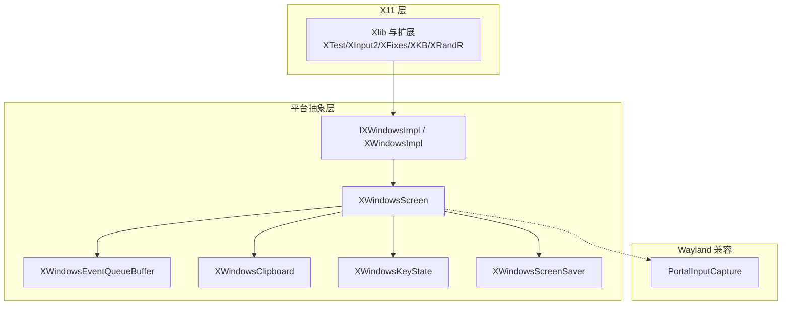
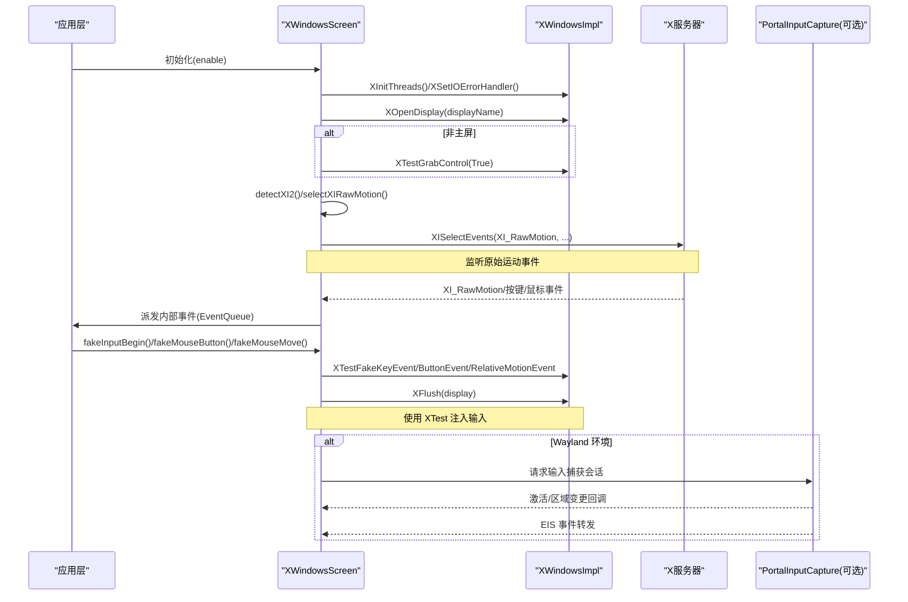
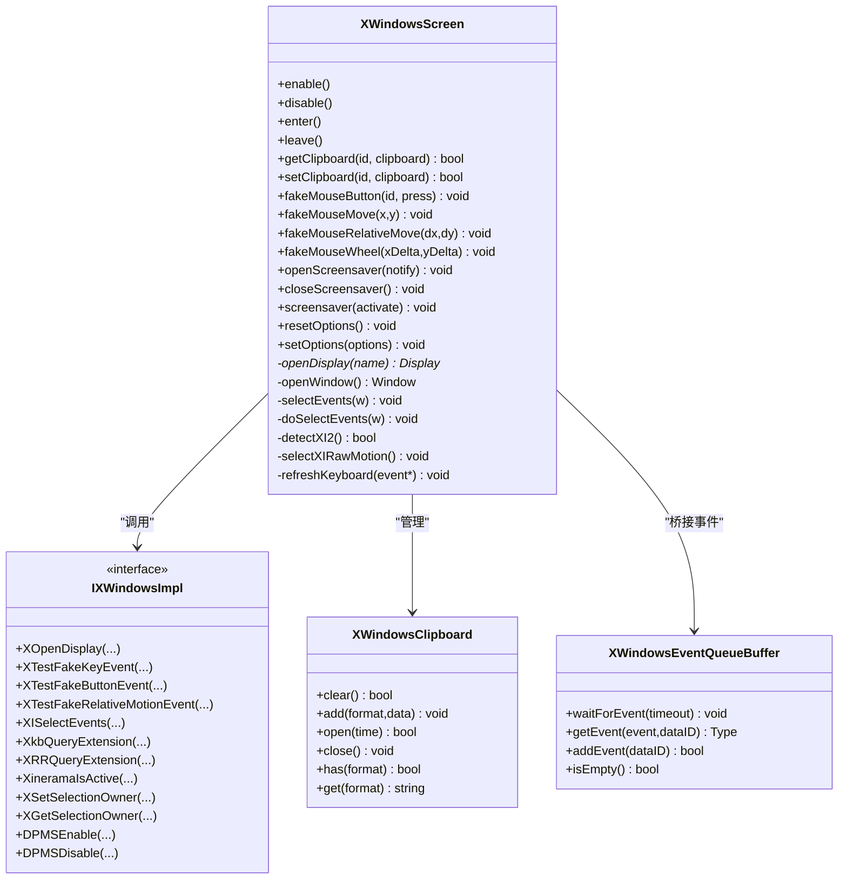
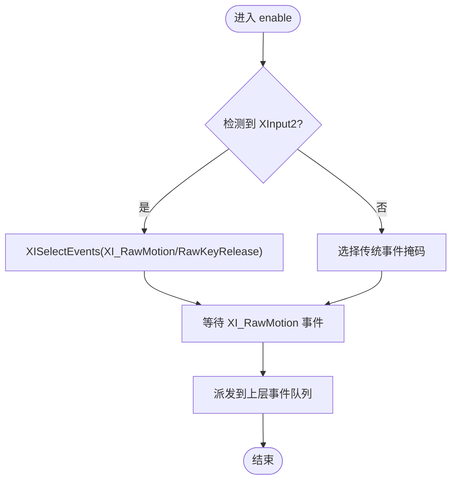
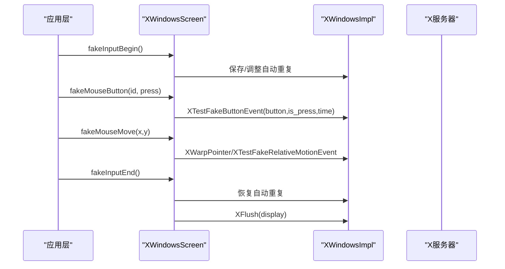
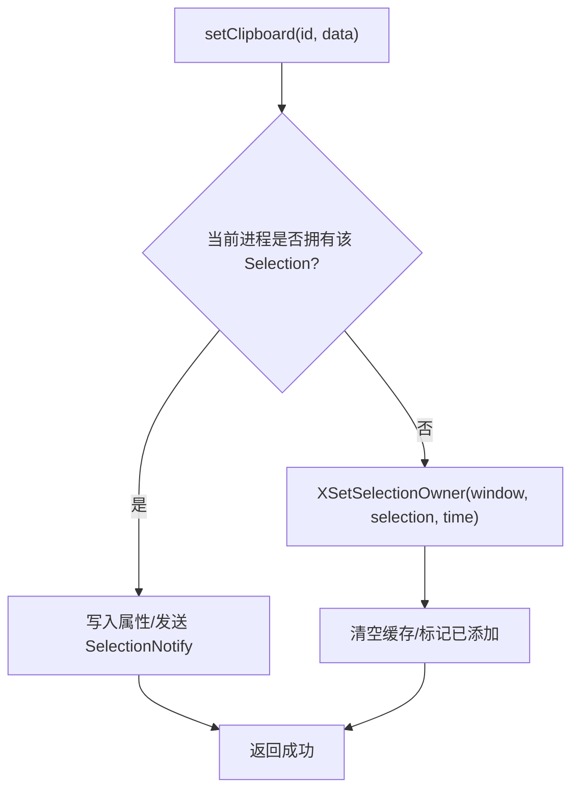
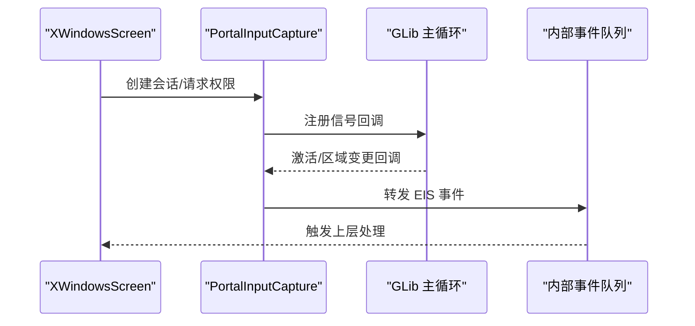
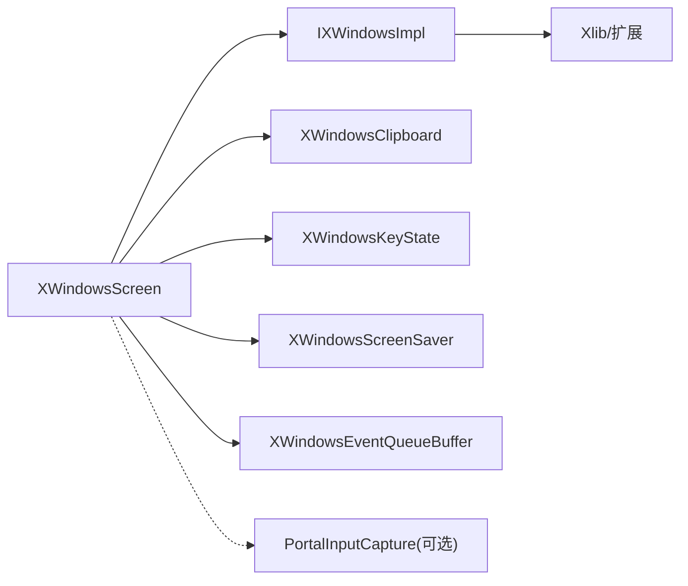

# Linux 平台实现

<cite>
**本文引用的文件**   
- [XWindowsScreen.h](file://src/lib/platform/XWindowsScreen.h)
- [XWindowsScreen.cpp](file://src/lib/platform/XWindowsScreen.cpp)
- [IXWindowsImpl.h](file://src/lib/platform/IXWindowsImpl.h)
- [XWindowsImpl.cpp](file://src/lib/platform/XWindowsImpl.cpp)
- [XWindowsEventQueueBuffer.h](file://src/lib/platform/XWindowsEventQueueBuffer.h)
- [XWindowsClipboard.h](file://src/lib/platform/XWindowsClipboard.h)
- [PortalInputCapture.h](file://src/lib/platform/PortalInputCapture.h)
</cite>

## 目录
1. [简介](#简介)
2. [项目结构](#项目结构)
3. [核心组件](#核心组件)
4. [架构总览](#架构总览)
5. [详细组件分析](#详细组件分析)
6. [依赖关系分析](#依赖关系分析)
7. [性能考虑](#性能考虑)
8. [故障排查指南](#故障排查指南)
9. [结论](#结论)
10. [附录：开发指南与配置说明](#附录开发指南与配置说明)

## 简介
本文件面向 Input Leap 在 Linux 平台的实现，重点围绕 XWindowsScreen 类的设计与 X11 协议集成，系统阐述以下方面：
- XInput2 扩展的事件捕获与原始运动事件处理
- XTest 扩展的输入模拟（按键、鼠标、相对移动）
- XFixes 与 ICCCM/EWMH 剪贴板交互模式
- Wayland 兼容性考量（Xwayland 检测与 Portal 输入捕获）
- 多显示器与桌面环境差异处理（Xinerama、XRandR、DPMS）
- Xlib 编程模式、事件循环优化与资源清理机制
- Linux 平台适配的开发指南、依赖库安装方法与常见桌面环境的配置建议

## 项目结构
Linux 平台相关代码集中在 src/lib/platform 目录，核心由以下模块组成：
- XWindowsScreen：屏幕抽象实现，负责显示连接、窗口管理、事件分发、剪贴板、键盘状态、屏保控制等
- IXWindowsImpl / XWindowsImpl：对 Xlib 及扩展 API 的薄封装接口与实现，便于测试与替换
- XWindowsEventQueueBuffer：将 X11 事件桥接到内部事件队列，提供等待与投递能力
- XWindowsClipboard：基于 ICCCM/Motif 的剪贴板实现，支持多种格式转换
- PortalInputCapture：Wayland 下通过 xdg-desktop-portal 进行输入捕获的可选后端

图表来源
- [XWindowsScreen.h:39-271](file://src/lib/platform/XWindowsScreen.h#L39-L271)
- [IXWindowsImpl.h:20-218](file://src/lib/platform/IXWindowsImpl.h#L20-L218)
- [XWindowsEventQueueBuffer.h:39-67](file://src/lib/platform/XWindowsEventQueueBuffer.h#L39-L67)
- [XWindowsClipboard.h:36-328](file://src/lib/platform/XWindowsClipboard.h#L36-L328)
- [PortalInputCapture.h:67-105](file://src/lib/platform/PortalInputCapture.h#L67-L105)

章节来源
- [XWindowsScreen.h:39-271](file://src/lib/platform/XWindowsScreen.h#L39-L271)
- [IXWindowsImpl.h:20-218](file://src/lib/platform/IXWindowsImpl.h#L20-L218)

## 核心组件
- XWindowsScreen
  - 职责：维护 Display/Window、选择事件、处理键鼠事件、热键注册、光标定位、剪贴板、屏保、XKB/XInput2/XRandR 探测与启用
  - 关键流程：构造时初始化线程安全、设置 IO 错误处理器、打开 Display、创建透明窗口、初始化剪贴板与键盘状态、按主/从角色差异化初始化
- IXWindowsImpl / XWindowsImpl
  - 职责：对 Xlib 及其扩展函数进行统一抽象，屏蔽底层调用细节，便于测试与替换
  - 覆盖范围：Display 生命周期、XTest 模拟、XInput2 选择、XKB 查询与刷新、XRandR/Xinerama 查询、Selection 操作、DPMS 控制等
- XWindowsEventQueueBuffer
  - 职责：将 X11 事件拉取并转换为内部事件类型，提供 waitForEvent/getEvent/addEvent 等接口，保证事件顺序与线程安全
- XWindowsClipboard
  - 职责：遵循 ICCCM/Motif 规范读写剪贴板，支持文本、HTML、图片等多种格式转换器，处理 INCR 分块传输与 MULTIPLE 批量请求
- PortalInputCapture
  - 职责：在 Wayland 环境下通过 xdg-desktop-portal 获取输入捕获会话，回调到内部事件系统

章节来源
- [XWindowsScreen.cpp:64-163](file://src/lib/platform/XWindowsScreen.cpp#L64-L163)
- [XWindowsScreen.cpp:165-194](file://src/lib/platform/XWindowsScreen.cpp#L165-L194)
- [XWindowsEventQueueBuffer.h:39-67](file://src/lib/platform/XWindowsEventQueueBuffer.h#L39-L67)
- [XWindowsClipboard.h:36-328](file://src/lib/platform/XWindowsClipboard.h#L36-L328)
- [PortalInputCapture.h:67-105](file://src/lib/platform/PortalInputCapture.h#L67-L105)

## 架构总览
下图展示了 X11 事件流与输入模拟路径，以及 Wayland 兼容路径。

图表来源
- [XWindowsScreen.cpp:111-163](file://src/lib/platform/XWindowsScreen.cpp#L111-L163)
- [XWindowsScreen.cpp:196-200](file://src/lib/platform/XWindowsScreen.cpp#L196-L200)
- [XWindowsScreen.cpp:2023-2054](file://src/lib/platform/XWindowsScreen.cpp#L2023-L2054)
- [XWindowsImpl.h:64-76](file://src/lib/platform/IXWindowsImpl.h#L64-L76)
- [PortalInputCapture.h:67-105](file://src/lib/platform/PortalInputCapture.h#L67-L105)

## 详细组件分析

### XWindowsScreen 设计与 X11 集成
- 显示与窗口
  - openDisplay：读取 DISPLAY 环境变量或默认值，建立 Display 连接；校验 XTest 扩展可用性（非主屏）
  - openWindow：创建不可见窗口用于 Selection 拥有者、输入法上下文绑定等
- 事件选择与分发
  - selectEvents/doSelectEvents：为根窗口选择子结构通知与指针运动事件，确保全局捕获
  - XInput2：detectXI2/selectXIRawMotion 启用 XI_RawMotion 与 RawKeyRelease，避免被其他程序拦截
  - XKB：XkbQueryExtension 与 XkbSelectEvents 监听映射变化，刷新键位映射
  - XRandR/Xinerama：查询扩展与活动状态，辅助多显示器布局感知
- 输入模拟
  - fakeInputBegin/fakeInputEnd：包裹 XTest 注入，必要时禁用自动重复
  - fakeMouseButton/fakeMouseMove/fakeMouseWheel：通过 XTestFakeButtonEvent/XTestFakeRelativeMotionEvent 等注入
- 剪贴板
  - setClipboard/getClipboard：委托 XWindowsClipboard 完成 ICCCM/Motif 协议交互
- 屏保与电源管理
  - openScreensaver/closeScreensaver/screensaver：结合 DPMS 与 XGet/SetScreenSaver 控制
- 资源清理
  - 析构中关闭 IM/IC、销毁窗口、关闭 Display、重置 IO 错误处理器，防止 X 断开后访问非法句柄

图表来源
- [XWindowsScreen.h:39-271](file://src/lib/platform/XWindowsScreen.h#L39-L271)
- [IXWindowsImpl.h:20-218](file://src/lib/platform/IXWindowsImpl.h#L20-L218)
- [XWindowsClipboard.h:36-328](file://src/lib/platform/XWindowsClipboard.h#L36-L328)
- [XWindowsEventQueueBuffer.h:39-67](file://src/lib/platform/XWindowsEventQueueBuffer.h#L39-L67)

章节来源
- [XWindowsScreen.cpp:111-163](file://src/lib/platform/XWindowsScreen.cpp#L111-L163)
- [XWindowsScreen.cpp:165-194](file://src/lib/platform/XWindowsScreen.cpp#L165-L194)
- [XWindowsScreen.cpp:1987-2001](file://src/lib/platform/XWindowsScreen.cpp#L1987-L2001)
- [XWindowsScreen.cpp:2023-2054](file://src/lib/platform/XWindowsScreen.cpp#L2023-L2054)

### XInput2 扩展的事件捕获
- 检测与启用
  - detectXI2：查询 XInputExtension 是否可用
  - selectXIRawMotion：为所有主设备选择 XI_RawMotion 与 XI_RawKeyRelease，绕过窗口焦点限制
- 事件处理
  - 收到 XI_RawMotion 时直接上报，避免被窗口管理器节流或过滤
  - 与标准 MotionNotify 并存时优先使用原始事件，提升低延迟与稳定性

图表来源
- [XWindowsScreen.cpp:2023-2054](file://src/lib/platform/XWindowsScreen.cpp#L2023-L2054)

章节来源
- [XWindowsScreen.cpp:2023-2054](file://src/lib/platform/XWindowsScreen.cpp#L2023-L2054)

### XTest 扩展的输入模拟
- 非主屏模式
  - 构造阶段调用 XTestGrabControl(True) 以忽略服务器抓握，确保注入不受影响
- 注入流程
  - fakeInputBegin/fakeInputEnd：包裹注入过程，必要时临时关闭自动重复
  - fakeMouseButton/fakeMouseMove/fakeMouseWheel：分别调用 XTestFakeButtonEvent/XTestFakeRelativeMotionEvent 等
  - 每次注入后调用 XFlush 确保命令尽快到达服务器

图表来源
- [XWindowsScreen.cpp:196-200](file://src/lib/platform/XWindowsScreen.cpp#L196-L200)
- [IXWindowsImpl.h:64-76](file://src/lib/platform/IXWindowsImpl.h#L64-L76)

章节来源
- [XWindowsScreen.cpp:196-200](file://src/lib/platform/XWindowsScreen.cpp#L196-L200)
- [IXWindowsImpl.h:64-76](file://src/lib/platform/IXWindowsImpl.h#L64-L76)

### XFixes 与 ICCCM/EWMH 剪贴板操作
- 协议遵循
  - 采用 ICCCM 选择协议，支持 MULTIPLE 批量请求与 INCR 分块传输
  - 兼容 Motif 剪贴头结构，提高与旧式应用的互操作性
- 数据转换
  - 通过 IXWindowsClipboardConverter 系列转换器支持文本、HTML、PNG/JPG/TIF/BMP/WEBP/UCS2 等格式
- 所有权与时间戳
  - 使用 XSetSelectionOwner/XGetSelectionOwner 管理拥有权，严格遵循 CurrentTime 规则

图表来源
- [XWindowsClipboard.h:139-180](file://src/lib/platform/XWindowsClipboard.h#L139-L180)
- [XWindowsClipboard.h:254-328](file://src/lib/platform/XWindowsClipboard.h#L254-L328)

章节来源
- [XWindowsClipboard.h:36-328](file://src/lib/platform/XWindowsClipboard.h#L36-L328)

### Wayland 兼容性考虑
- Xwayland 检测
  - detectXwayland：查询 “XWAYLAND” 扩展，若存在则记录警告，提示行为可能不符合预期
- Portal 输入捕获
  - 通过 xdg-desktop-portal 的 Input Capture 接口申请会话，接收激活/区域变更回调，并将事件转发至内部事件系统
  - 适用于不支持 X11 或仅运行于纯 Wayland 的环境

图表来源
- [PortalInputCapture.h:67-105](file://src/lib/platform/PortalInputCapture.h#L67-L105)
- [XWindowsScreen.cpp:2030-2036](file://src/lib/platform/XWindowsScreen.cpp#L2030-L2036)

章节来源
- [XWindowsScreen.cpp:2030-2036](file://src/lib/platform/XWindowsScreen.cpp#L2030-L2036)
- [PortalInputCapture.h:67-105](file://src/lib/platform/PortalInputCapture.h#L67-L105)

### 多显示器配置与桌面环境差异
- Xinerama/XRandR
  - 查询 XineramaIsActive 与 XineramaQueryScreens 获取物理屏幕布局
  - 使用 XRRQueryExtension/XRRSelectInput 监听分辨率/布局变化
- DPMS 与屏保
  - 通过 DPMSQueryExtension/DPMSCapable/DPMSInfo/DPMSForceLevel 控制显示器电源状态
  - 结合 XGet/SetScreenSaver 与 XForceScreenSaver 控制屏保
- 焦点保持与 XTest 局限
  - 针对某些前端（如 MythTV）保留焦点策略，减少焦点丢失问题
  - 当 XTest 对 Xinerama 不敏感时，采取额外补偿逻辑

章节来源
- [XWindowsImpl.cpp:250-269](file://src/lib/platform/XWindowsImpl.cpp#L250-L269)
- [XWindowsImpl.cpp:485-504](file://src/lib/platform/XWindowsImpl.cpp#L485-L504)
- [XWindowsScreen.cpp:416-435](file://src/lib/platform/XWindowsScreen.cpp#L416-L435)

## 依赖关系分析
- 组件耦合
  - XWindowsScreen 强依赖 IXWindowsImpl 提供的 X11 抽象，松耦合便于替换与测试
  - 剪贴板、键盘状态、屏保作为独立对象，降低单点复杂度
- 外部依赖
  - Xlib 与扩展：XTest、XInput2、XKB、XRandR、Xinerama、DPMS
  - Wayland 兼容：xdg-desktop-portal（可选）
- 潜在环依赖
  - 无直接环依赖；事件缓冲与屏幕对象通过 IEventQueue 解耦

图表来源
- [XWindowsScreen.h:39-271](file://src/lib/platform/XWindowsScreen.h#L39-L271)
- [IXWindowsImpl.h:20-218](file://src/lib/platform/IXWindowsImpl.h#L20-L218)

章节来源
- [XWindowsScreen.h:39-271](file://src/lib/platform/XWindowsScreen.h#L39-L271)
- [IXWindowsImpl.h:20-218](file://src/lib/platform/IXWindowsImpl.h#L20-L218)

## 性能考虑
- 事件循环优化
  - 使用 XWindowsEventQueueBuffer 聚合 X11 事件，减少频繁阻塞与上下文切换
  - 优先使用 XI_RawMotion 降低延迟与抖动
- 批处理与合并
  - 滚动事件累积阈值，避免过多微小滚动事件
  - 剪贴板缓存与按需填充，减少不必要的属性读取
- 资源释放
  - 析构顺序明确，先移除事件缓冲与处理器，再关闭 IM/IC、窗口与 Display，避免 X 断开后的非法访问

[本节为通用指导，无需具体文件引用]

## 故障排查指南
- X 显示意外断开
  - 现象：IO 错误回调触发，日志记录严重级别消息
  - 处理：停止访问 Display，清理资源，等待重建
- XTest 扩展不可用
  - 现象：非主屏模式下无法注入输入
  - 处理：检查 Xorg 是否加载 XTest 扩展，或以主屏模式运行
- Xwayland 环境
  - 现象：运行在 Xwayland 下，功能受限
  - 处理：尽量使用原生 Wayland 后端或 Portal 输入捕获
- 剪贴板无响应
  - 现象：无法获得/设置 Selection
  - 处理：确认 ICCCM 兼容性与时间戳正确性，检查是否有 Motif 锁占用

章节来源
- [XWindowsScreen.cpp:1714-1724](file://src/lib/platform/XWindowsScreen.cpp#L1714-L1724)
- [XWindowsScreen.cpp:877-886](file://src/lib/platform/XWindowsScreen.cpp#L877-L886)
- [XWindowsScreen.cpp:2030-2036](file://src/lib/platform/XWindowsScreen.cpp#L2030-L2036)

## 结论
XWindowsScreen 通过清晰的抽象与模块化设计，将 X11 复杂特性（XInput2、XTest、XKB、XRandR、DPMS、Selection）整合到统一的平台接口中，并提供 Wayland 兼容路径。配合事件缓冲与资源管理策略，能够在多显示器与不同桌面环境下稳定工作。

[本节为总结，无需具体文件引用]

## 附录：开发指南与配置说明

- 构建与依赖
  - 必需：Xlib 开发包、XTest/XInput2/XKB/XRandR/Xinerama/DPMS 扩展头文件
  - 可选：xdg-desktop-portal 开发包（启用 Portal 输入捕获）
  - 工具链：CMake、Qt（GUI 组件）、Google Test（测试）
- 常见桌面环境配置
  - GNOME/KDE/XFCE：确保 Xorg 启用 XTest 与 XInput2；如需 Wayland，安装并启用 xdg-desktop-portal 相应后端
  - 多显示器：合理配置 XRandR 布局，必要时启用 Xinerama 兼容模式
- 调试技巧
  - 开启详细日志，关注 Xwayland 警告与 XTest 可用性
  - 使用 xev/xinput 验证事件源与设备状态
  - 剪贴板问题可通过 xclip/xsel 对比行为

[本节为通用指导，无需具体文件引用]