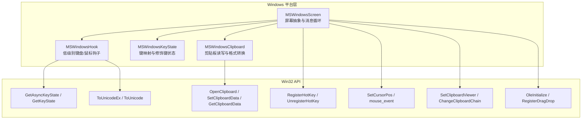
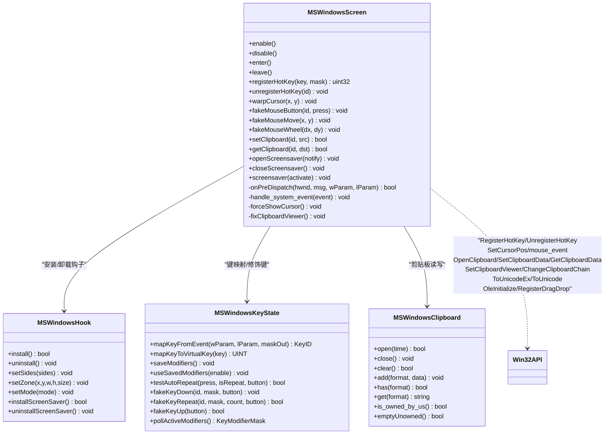
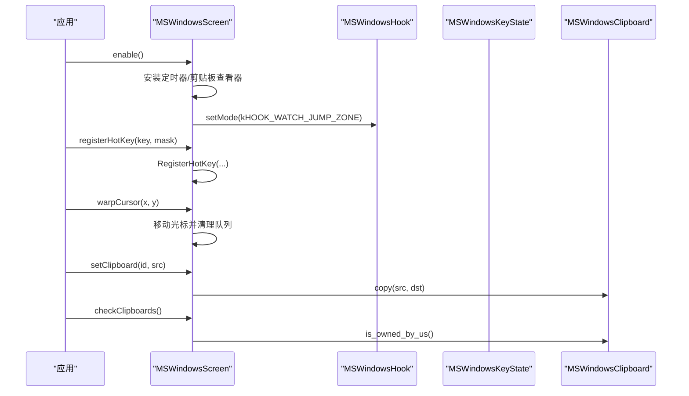
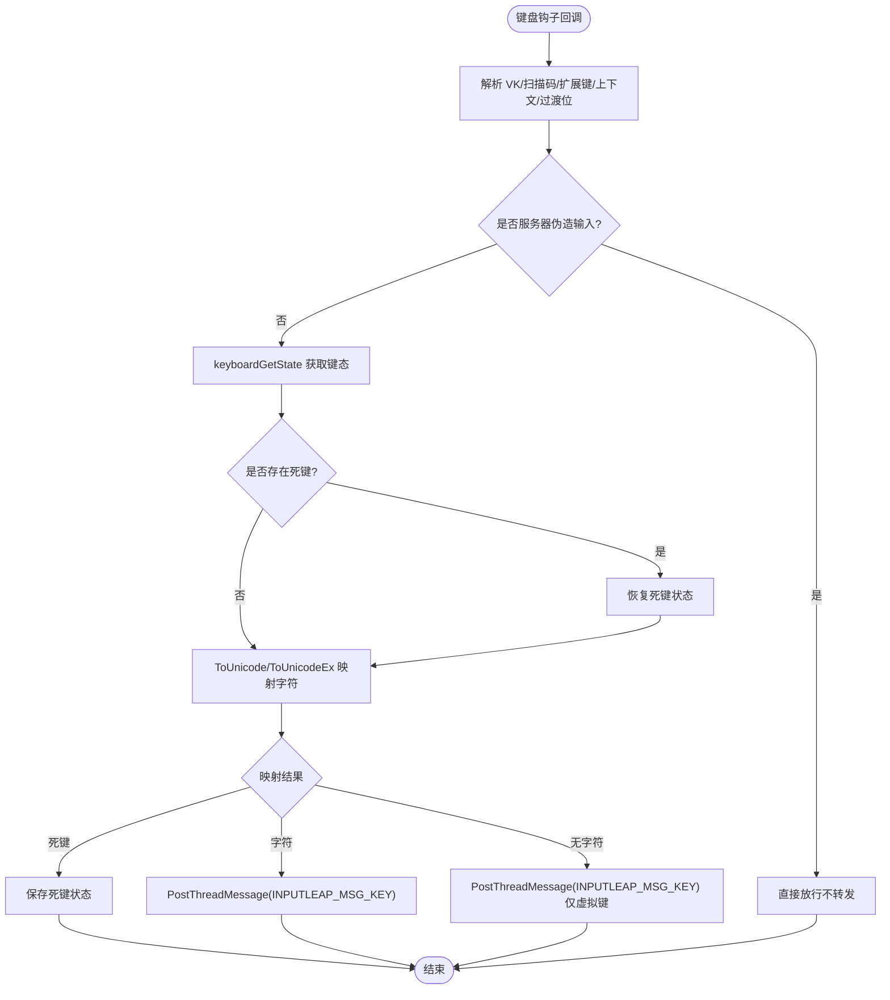
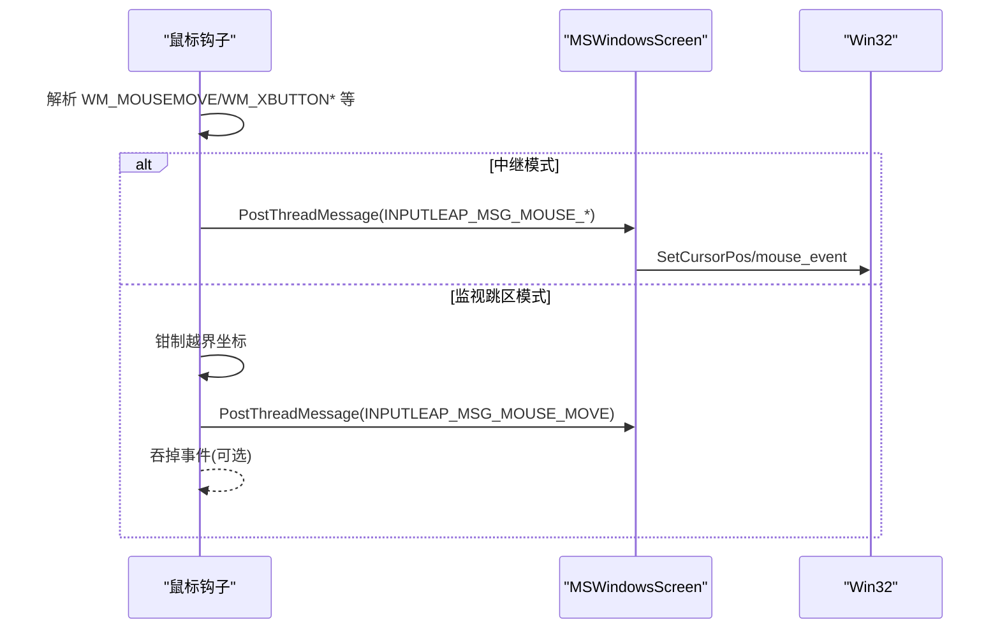
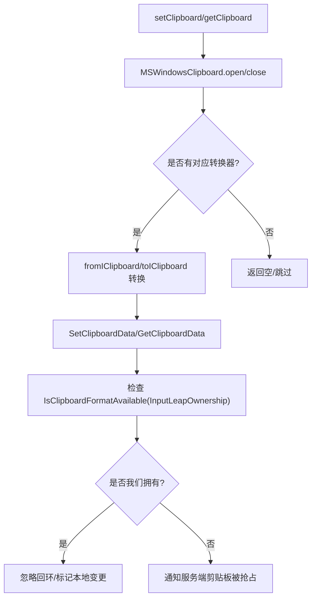
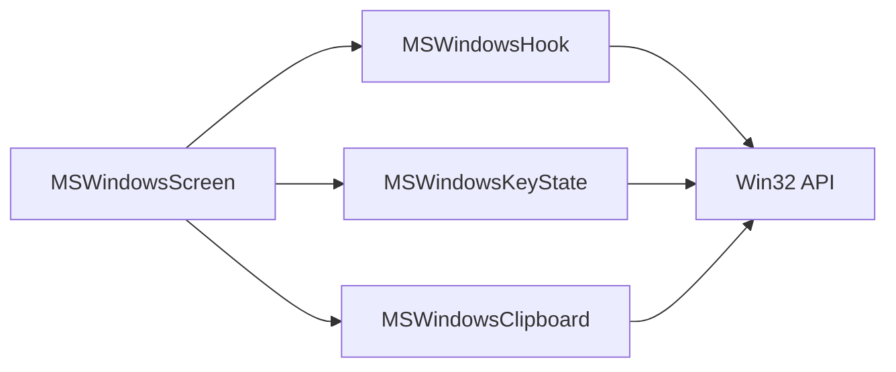

# Windows 平台实现

<cite>
**本文引用的文件**   
- [MSWindowsScreen.h](file://src/lib/platform/MSWindowsScreen.h)
- [MSWindowsScreen.cpp](file://src/lib/platform/MSWindowsScreen.cpp)
- [MSWindowsKeyState.h](file://src/lib/platform/MSWindowsKeyState.h)
- [MSWindowsKeyState.cpp](file://src/lib/platform/MSWindowsKeyState.cpp)
- [MSWindowsHook.h](file://src/lib/platform/MSWindowsHook.h)
- [MSWindowsHook.cpp](file://src/lib/platform/MSWindowsHook.cpp)
- [MSWindowsClipboard.h](file://src/lib/platform/MSWindowsClipboard.h)
- [MSWindowsClipboard.cpp](file://src/lib/platform/MSWindowsClipboard.cpp)
</cite>

## 目录
1. [简介](#简介)
2. [项目结构](#项目结构)
3. [核心组件](#核心组件)
4. [架构总览](#架构总览)
5. [详细组件分析](#详细组件分析)
6. [依赖关系分析](#依赖关系分析)
7. [性能与优化](#性能与优化)
8. [故障排查指南](#故障排查指南)
9. [结论](#结论)
10. [附录：开发指南与常见问题](#附录开发指南与常见问题)

## 简介
本文件面向在 Windows 平台上开发与维护 Input Leap 的工程师，聚焦 MSWindowsScreen 类的设计与 Win32 API 集成方式。内容覆盖键盘事件捕获（GetAsyncKeyState、RegisterHotKey）、鼠标事件处理（SetCursorPos/mouse_event 等）、剪贴板操作、窗口管理、无障碍访问（MouseKeys）处理、全局热键注册、系统托盘集成的思路与注意事项，并提供调试方法与常见问题的解决方案。

## 项目结构
Input Leap 的 Windows 平台相关代码主要位于 src/lib/platform 下，围绕屏幕抽象、输入钩子、键状态映射、剪贴板适配等模块组织。MSWindowsScreen 作为 Windows 平台的屏幕抽象实现，负责协调钩子、剪贴板、桌面切换、屏保、拖放等功能；MSWindowsHook 封装低级别键盘/鼠标钩子；MSWindowsKeyState 负责虚拟键到逻辑键的映射与修饰键状态；MSWindowsClipboard 提供剪贴板读写与格式转换。

图表来源
- [MSWindowsScreen.cpp:204-269](file://src/lib/platform/MSWindowsScreen.cpp#L204-L269)
- [MSWindowsHook.cpp:566-643](file://src/lib/platform/MSWindowsHook.cpp#L566-L643)
- [MSWindowsKeyState.cpp:612-618](file://src/lib/platform/MSWindowsKeyState.cpp#L612-L618)
- [MSWindowsClipboard.cpp:118-142](file://src/lib/platform/MSWindowsClipboard.cpp#L118-L142)

章节来源
- [MSWindowsScreen.h:42-126](file://src/lib/platform/MSWindowsScreen.h#L42-L126)
- [MSWindowsScreen.cpp:89-165](file://src/lib/platform/MSWindowsScreen.cpp#L89-L165)

## 核心组件
- MSWindowsScreen：Windows 平台屏幕抽象，负责窗口创建、消息分发、热键注册、剪贴板监听、拖放目标、屏保控制、光标强制显示、多显示器与桌面切换等。
- MSWindowsHook：封装 WH_KEYBOARD_LL、WH_MOUSE_LL、WH_GETMESSAGE 钩子，将底层事件转换为内部消息并投递至主线程消息队列。
- MSWindowsKeyState：维护当前键盘布局、修饰键状态、自动重复检测、Ctrl+Alt+Del 模拟等。
- MSWindowsClipboard：基于 OpenClipboard/SetClipboardData/GetClipboardData 实现跨格式剪贴板读写，并通过自定义“拥有者”格式判断所有权。

章节来源
- [MSWindowsScreen.h:42-126](file://src/lib/platform/MSWindowsScreen.h#L42-L126)
- [MSWindowsHook.h:29-42](file://src/lib/platform/MSWindowsHook.h#L29-L42)
- [MSWindowsKeyState.h:37-154](file://src/lib/platform/MSWindowsKeyState.h#L37-L154)
- [MSWindowsClipboard.h:35-88](file://src/lib/platform/MSWindowsClipboard.h#L35-L88)

## 架构总览
下图展示 MSWindowsScreen 与钩子系统、键状态、剪贴板的交互关系以及关键 Win32 API 的使用点。

图表来源
- [MSWindowsScreen.h:42-126](file://src/lib/platform/MSWindowsScreen.h#L42-L126)
- [MSWindowsHook.h:29-42](file://src/lib/platform/MSWindowsHook.h#L29-L42)
- [MSWindowsKeyState.h:37-154](file://src/lib/platform/MSWindowsKeyState.h#L37-L154)
- [MSWindowsClipboard.h:35-88](file://src/lib/platform/MSWindowsClipboard.h#L35-L88)

## 详细组件分析

### MSWindowsScreen 设计与实现
- 生命周期与初始化
  - 构造时创建屏保对象、桌面管理器、键状态对象，更新屏幕形状，注册窗口类与窗口，初始化 OLE 与拖放目标，安装系统事件处理器与平台事件缓冲。
  - enable/disable 中设置定时器修复、剪贴板查看器链、钩子模式、电源状态阻止等。
  - enter/leave 中处理进入/离开屏幕时的钩子模式切换、特殊键序列启用/禁用、光标位置重置、修饰键保存恢复等。
- 全局热键
  - registerHotKey/unregisterHotKey 使用 RegisterHotKey/UnregisterHotKey 注册/注销全局热键，支持 Shift/Ctrl/Alt/Super 组合，失败时记录旧 ID 以便复用。
- 鼠标与光标
  - warpCursor 调用底层移动后清理已排队的相关输入事件，并保存当前位置用于计算下一次相对位移。
  - forceShowCursor/updateForceShowCursor 结合 MouseKeys 与系统计数确保光标可见性。
- 剪贴板
  - setClipboard/getClipboard 通过 MSWindowsClipboard 完成数据拷贝；checkClipboards 定期校验所有权，避免剪贴板查看器链异常导致的状态不一致。
  - fixClipboardViewer 修复剪贴板查看器链，防止 WM_DRAWCLIPBOARD 丢失。
- 屏保与电源
  - openScreensaver/closeScreensaver/screensaver 控制屏保激活/停用，并在进入次屏时唤醒显示。
- 拖放
  - 构造时 OleInitialize 并注册拖放目标，离开屏幕时异步发送拖拽文件信息。

图表来源
- [MSWindowsScreen.cpp:204-269](file://src/lib/platform/MSWindowsScreen.cpp#L204-L269)
- [MSWindowsScreen.cpp:550-653](file://src/lib/platform/MSWindowsScreen.cpp#L550-L653)
- [MSWindowsScreen.cpp:527-548](file://src/lib/platform/MSWindowsScreen.cpp#L527-L548)
- [MSWindowsScreen.cpp:384-423](file://src/lib/platform/MSWindowsScreen.cpp#L384-L423)

章节来源
- [MSWindowsScreen.cpp:89-165](file://src/lib/platform/MSWindowsScreen.cpp#L89-L165)
- [MSWindowsScreen.cpp:204-269](file://src/lib/platform/MSWindowsScreen.cpp#L204-L269)
- [MSWindowsScreen.cpp:272-364](file://src/lib/platform/MSWindowsScreen.cpp#L272-L364)
- [MSWindowsScreen.cpp:550-653](file://src/lib/platform/MSWindowsScreen.cpp#L550-L653)
- [MSWindowsScreen.cpp:527-548](file://src/lib/platform/MSWindowsScreen.cpp#L527-L548)
- [MSWindowsScreen.cpp:384-423](file://src/lib/platform/MSWindowsScreen.cpp#L384-L423)

### 键盘事件捕获与映射（GetAsyncKeyState、RegisterHotKey）
- 低级别键盘钩子
  - MSWindowsHook 安装 WH_KEYBOARD_LL，回调中将按键信息编码为内部消息投递至主线程，使用 ToUnicode/ToUnicodeEx 进行字符映射，处理死键组合与 AltGr 情况。
  - keyboardGetState 使用 GetAsyncKeyState 同步键态，修正大小写锁定位，保证后续 ToUnicode 正确。
- 全局热键
  - MSWindowsScreen::registerHotKey 将逻辑键与修饰键映射为 Win32 虚拟键与 MOD_* 掩码，调用 RegisterHotKey 注册；失败时记录旧 ID 以复用。
- 修饰键与自动重复
  - MSWindowsKeyState 维护修饰键状态，支持 save/useSavedModifiers 在跨屏合成按键时保持修饰键一致性；testAutoRepeat 根据最后按下键推断重复。

图表来源
- [MSWindowsHook.cpp:103-143](file://src/lib/platform/MSWindowsHook.cpp#L103-L143)
- [MSWindowsHook.cpp:154-403](file://src/lib/platform/MSWindowsHook.cpp#L154-L403)
- [MSWindowsKeyState.cpp:644-677](file://src/lib/platform/MSWindowsKeyState.cpp#L644-L677)
- [MSWindowsScreen.cpp:550-653](file://src/lib/platform/MSWindowsScreen.cpp#L550-L653)

章节来源
- [MSWindowsHook.cpp:103-143](file://src/lib/platform/MSWindowsHook.cpp#L103-L143)
- [MSWindowsHook.cpp:154-403](file://src/lib/platform/MSWindowsHook.cpp#L154-L403)
- [MSWindowsKeyState.cpp:644-677](file://src/lib/platform/MSWindowsKeyState.cpp#L644-L677)
- [MSWindowsScreen.cpp:550-653](file://src/lib/platform/MSWindowsScreen.cpp#L550-L653)

### 鼠标事件处理（SetCursorPos、mouse_event）
- 低级别鼠标钩子
  - MSWindowsHook 安装 WH_MOUSE_LL，统一处理按钮、滚轮、移动事件，按模式决定是否拦截或转发。
  - 监视跳区模式时对越界坐标进行钳制，减少抖动与误判。
- 光标移动与相对移动
  - MSWindowsScreen::warpCursor 调用底层移动并清理队列；fakeMouseRelativeMove/fakeMouseWheel 委托到底层设备模拟。
- 鼠标可见性与 MouseKeys
  - forceShowCursor/updateForceShowCursor 考虑系统 MouseKeys 对可见计数的影响，确保进入次屏时能显示光标。

图表来源
- [MSWindowsHook.cpp:440-563](file://src/lib/platform/MSWindowsHook.cpp#L440-L563)
- [MSWindowsScreen.cpp:527-548](file://src/lib/platform/MSWindowsScreen.cpp#L527-L548)
- [MSWindowsScreen.cpp:727-743](file://src/lib/platform/MSWindowsScreen.cpp#L727-L743)

章节来源
- [MSWindowsHook.cpp:440-563](file://src/lib/platform/MSWindowsHook.cpp#L440-L563)
- [MSWindowsScreen.cpp:527-548](file://src/lib/platform/MSWindowsScreen.cpp#L527-L548)
- [MSWindowsScreen.cpp:727-743](file://src/lib/platform/MSWindowsScreen.cpp#L727-L743)

### 剪贴板操作与所有权判定
- 打开/关闭与读写
  - MSWindowsClipboard::open/close 包装 OpenClipboard/CloseClipboard；add/get 遍历转换器选择合适格式写入/读取。
- 所有权判定
  - 通过自定义 Clipboard Format “InputLeapOwnership” 标记是否由 Input Leap 持有，避免回环复制。
- 查看器链修复
  - MSWindowsScreen 在 enable/disable 中安装/移除剪贴板查看器链，checkClipboards 定期校验所有权，修复 NT 系可能丢失 WM_DRAWCLIPBOARD 的问题。

图表来源
- [MSWindowsClipboard.cpp:118-142](file://src/lib/platform/MSWindowsClipboard.cpp#L118-L142)
- [MSWindowsClipboard.cpp:205-224](file://src/lib/platform/MSWindowsClipboard.cpp#L205-L224)
- [MSWindowsScreen.cpp:384-423](file://src/lib/platform/MSWindowsScreen.cpp#L384-L423)

章节来源
- [MSWindowsClipboard.cpp:118-142](file://src/lib/platform/MSWindowsClipboard.cpp#L118-L142)
- [MSWindowsClipboard.cpp:205-224](file://src/lib/platform/MSWindowsClipboard.cpp#L205-L224)
- [MSWindowsScreen.cpp:384-423](file://src/lib/platform/MSWindowsScreen.cpp#L384-L423)

### 窗口管理与拖放
- 窗口类与窗口
  - MSWindowsScreen 创建窗口类与窗口，用作剪贴板所有者与消息接收端。
- 拖放目标
  - 构造时 OleInitialize 并 RegisterDragDrop，离开屏幕时异步发送拖拽文件信息给服务端。

章节来源
- [MSWindowsScreen.cpp:126-165](file://src/lib/platform/MSWindowsScreen.cpp#L126-L165)
- [MSWindowsScreen.cpp:366-382](file://src/lib/platform/MSWindowsScreen.cpp#L366-L382)

### 无障碍访问权限与全局热键
- 无障碍（MouseKeys）
  - forceShowCursor/updateForceShowCursor 考虑系统 MouseKeys 对可见计数影响，必要时强制显示光标。
- 全局热键
  - registerHotKey/unregisterHotKey 使用 RegisterHotKey/UnregisterHotKey，支持多种修饰键组合，失败时记录旧 ID 复用。

章节来源
- [MSWindowsScreen.h:210-214](file://src/lib/platform/MSWindowsScreen.h#L210-L214)
- [MSWindowsScreen.cpp:550-653](file://src/lib/platform/MSWindowsScreen.cpp#L550-L653)

### 系统托盘集成
- 说明：仓库中与系统托盘相关的实现位于客户端与服务端任务栏接收器文件中（例如 client/server 下的 TaskBarReceiver）。这些文件不在本次分析的范围内，但通常用于最小化到托盘、右键菜单、图标状态等。

[本节未直接分析具体源文件]

## 依赖关系分析
- 耦合与内聚
  - MSWindowsScreen 聚合 MSWindowsHook、MSWindowsKeyState、MSWindowsClipboard，职责清晰，内聚度高。
  - MSWindowsHook 独立封装低级别钩子，降低上层复杂度。
- 外部依赖
  - 大量使用 Win32 API：RegisterHotKey、GetAsyncKeyState、ToUnicodeEx、OpenClipboard、SetClipboardViewer、OleInitialize、RegisterDragDrop 等。
- 潜在循环依赖
  - 当前结构未见明显循环依赖；各模块通过接口与消息解耦。

图表来源
- [MSWindowsScreen.h:42-126](file://src/lib/platform/MSWindowsScreen.h#L42-L126)
- [MSWindowsHook.h:29-42](file://src/lib/platform/MSWindowsHook.h#L29-L42)
- [MSWindowsKeyState.h:37-154](file://src/lib/platform/MSWindowsKeyState.h#L37-L154)
- [MSWindowsClipboard.h:35-88](file://src/lib/platform/MSWindowsClipboard.h#L35-L88)

章节来源
- [MSWindowsScreen.cpp:89-165](file://src/lib/platform/MSWindowsScreen.cpp#L89-L165)

## 性能与优化
- 钩子路径尽量轻量
  - 低级别钩子回调中只做必要解析与消息投递，避免阻塞 UI 线程。
- 键态同步策略
  - 使用 GetAsyncKeyState 校正键态表，减少 ToUnicode 映射错误导致的额外重试。
- 剪贴板批量操作
  - 仅在必要时打开/关闭剪贴板，利用转换器顺序优先常用格式，减少多次查询。
- 定时器修复
  - 使用周期性定时器修复剪贴板查看器链、键态、光标可见性等，避免频繁系统调用。

[本节提供一般性指导，无需特定文件引用]

## 故障排查指南
- 全局热键注册失败
  - 现象：registerHotKey 返回 0 并记录警告日志。
  - 排查：确认修饰键组合是否合法、虚拟键映射是否有效；检查是否与其他程序冲突；查看旧 ID 回收列表。
  - 参考路径：[MSWindowsScreen.cpp:550-653](file://src/lib/platform/MSWindowsScreen.cpp#L550-L653)
- 剪贴板不同步或丢失
  - 现象：剪贴板内容不更新或回环复制。
  - 排查：检查 checkClipboards 是否检测到所有权丢失；确认剪贴板查看器链是否正确；验证自定义拥有者格式是否可用。
  - 参考路径：[MSWindowsScreen.cpp:384-423](file://src/lib/platform/MSWindowsScreen.cpp#L384-L423)、[MSWindowsClipboard.cpp:205-224](file://src/lib/platform/MSWindowsClipboard.cpp#L205-L224)
- 死键与 AltGr 组合异常
  - 现象：某些语言输入组合无效或死键未正确恢复。
  - 排查：检查 keyboardGetState 与 ToUnicode/ToUnicodeEx 调用路径；确认死键状态保存与恢复逻辑。
  - 参考路径：[MSWindowsHook.cpp:154-403](file://src/lib/platform/MSWindowsHook.cpp#L154-L403)
- 光标不可见或跳动
  - 现象：进入次屏后光标隐藏或边缘抖动。
  - 排查：确认 forceShowCursor/updateForceShowCursor 是否执行；检查钩子模式下坐标钳制逻辑。
  - 参考路径：[MSWindowsScreen.cpp:272-364](file://src/lib/platform/MSWindowsScreen.cpp#L272-L364)、[MSWindowsHook.cpp:440-563](file://src/lib/platform/MSWindowsHook.cpp#L440-L563)

章节来源
- [MSWindowsScreen.cpp:550-653](file://src/lib/platform/MSWindowsScreen.cpp#L550-L653)
- [MSWindowsScreen.cpp:384-423](file://src/lib/platform/MSWindowsScreen.cpp#L384-L423)
- [MSWindowsClipboard.cpp:205-224](file://src/lib/platform/MSWindowsClipboard.cpp#L205-L224)
- [MSWindowsHook.cpp:154-403](file://src/lib/platform/MSWindowsHook.cpp#L154-L403)
- [MSWindowsScreen.cpp:272-364](file://src/lib/platform/MSWindowsScreen.cpp#L272-L364)
- [MSWindowsHook.cpp:440-563](file://src/lib/platform/MSWindowsHook.cpp#L440-L563)

## 结论
MSWindowsScreen 作为 Windows 平台的核心抽象，整合了钩子系统、键状态映射、剪贴板与拖放、屏保与电源管理等能力，通过合理的消息分发与状态维护，实现了稳定可靠的跨屏输入共享。配合 MSWindowsHook、MSWindowsKeyState、MSWindowsClipboard 的模块化设计，系统在复杂 Windows 环境下具备良好可维护性与可扩展性。

[本节为总结，无需特定文件引用]

## 附录：开发指南与常见问题
- 开发要点
  - 钩子回调务必轻量，避免长时间阻塞；所有重逻辑应投递到主线程处理。
  - 键态同步优先使用 GetAsyncKeyState 校正，再调用 ToUnicode/ToUnicodeEx 进行字符映射。
  - 剪贴板操作注意打开/关闭配对与拥有者格式标记，避免回环复制。
  - 全局热键注册失败时记录旧 ID 复用，提升用户体验。
- 常见问题
  - 输入法与死键：确保死键状态保存与恢复，必要时二次调用 ToUnicode 恢复。
  - 多显示器与跳区：对越界坐标进行钳制，减少抖动与误判。
  - 无障碍 MouseKeys：进入次屏时强制显示光标，避免用户困惑。
  - 系统托盘：如需集成托盘功能，请参考客户端/服务端任务栏接收器文件（不在本次分析范围）。

[本节为通用指导，无需特定文件引用]