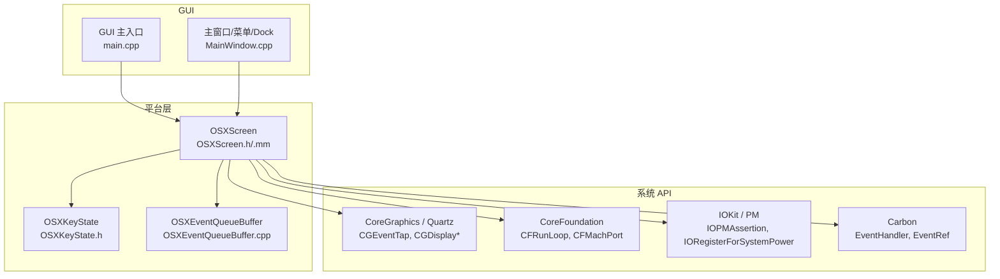
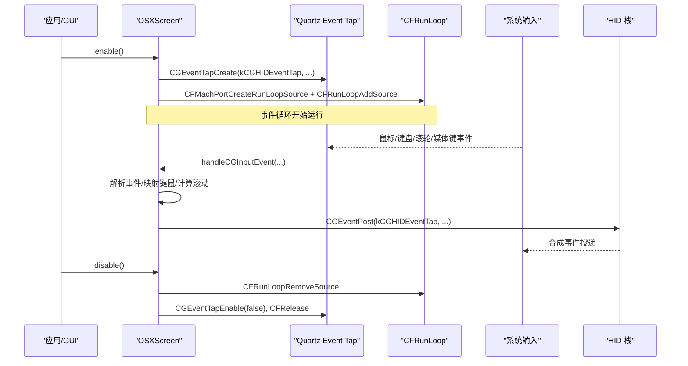
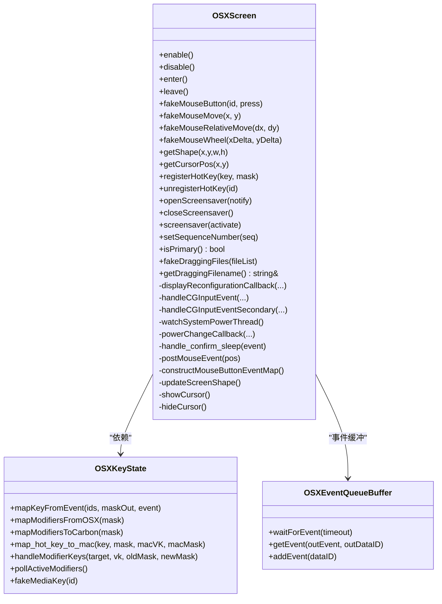
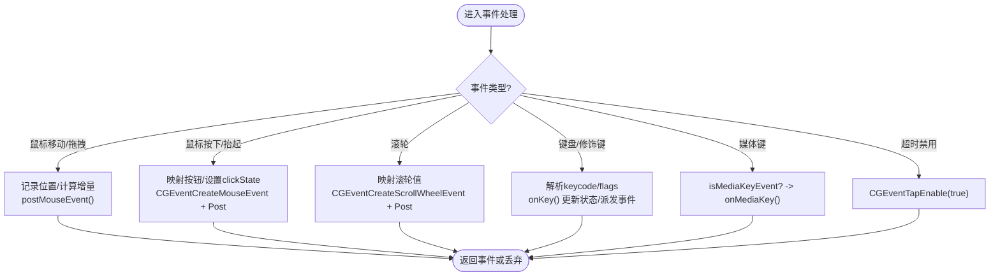
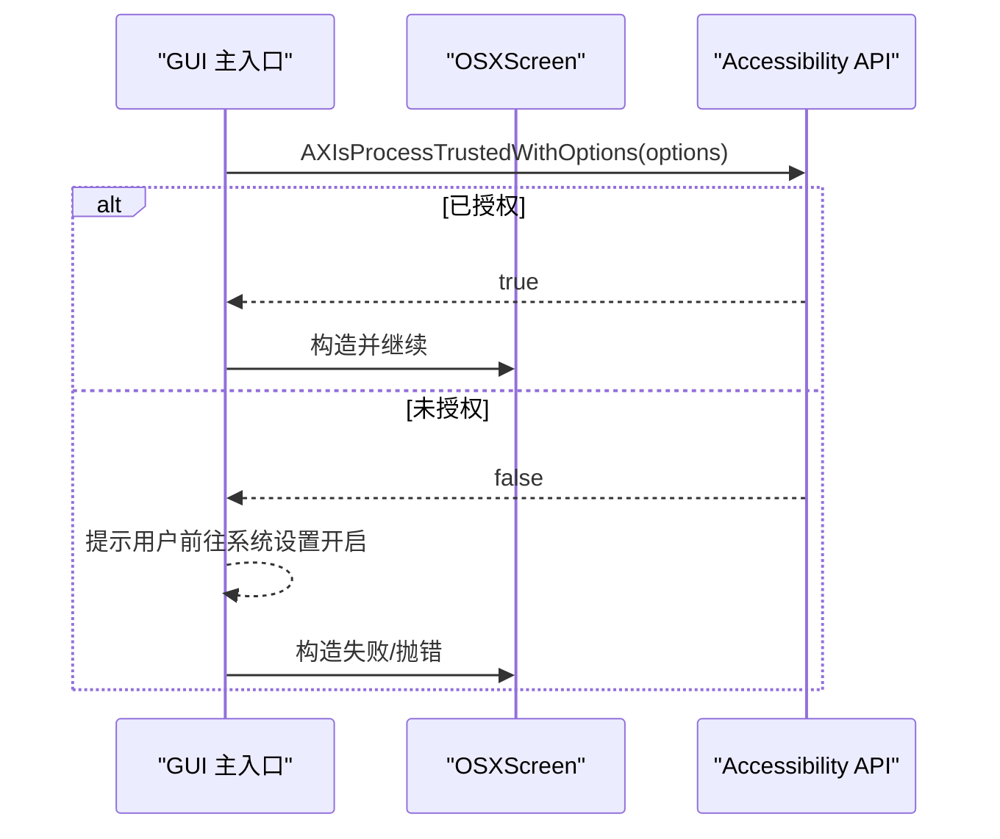
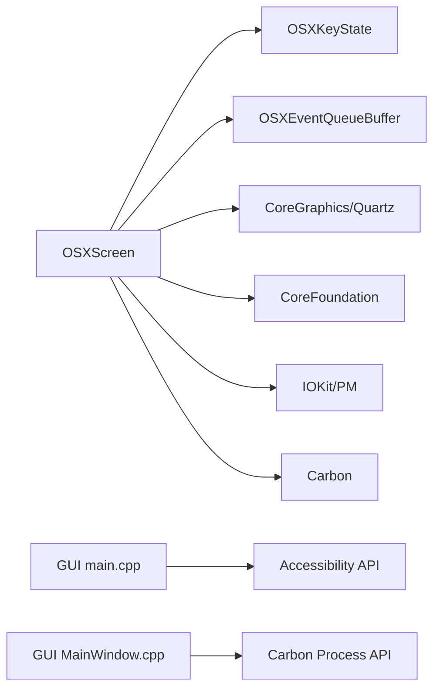

# macOS 平台实现

<cite>
**本文引用的文件**   
- [OSXScreen.h](file://src/lib/platform/OSXScreen.h)
- [OSXScreen.mm](file://src/lib/platform/OSXScreen.mm)
- [OSXKeyState.h](file://src/lib/platform/OSXKeyState.h)
- [OSXEventQueueBuffer.cpp](file://src/lib/platform/OSXEventQueueBuffer.cpp)
- [main.cpp](file://src/gui/src/main.cpp)
- [MainWindow.cpp](file://src/gui/src/MainWindow.cpp)
</cite>

## 目录
1. [简介](#简介)
2. [项目结构](#项目结构)
3. [核心组件](#核心组件)
4. [架构总览](#架构总览)
5. [详细组件分析](#详细组件分析)
6. [依赖关系分析](#依赖关系分析)
7. [性能考量](#性能考量)
8. [故障排除指南](#故障排除指南)
9. [结论](#结论)
10. [附录](#附录)

## 简介
本文件面向 Input Leap 在 macOS 平台的实现，重点解析 OSXScreen 类的设计与 Carbon/Core Graphics API 的集成方式，深入说明 CGEvent 事件系统、辅助功能权限处理、菜单栏/Dock 集成、多显示器支持、Retina 适配以及 macOS 特定输入事件的转换机制。文档同时提供 Core Foundation 对象管理、内存泄漏防护与性能优化技巧，并给出平台适配开发指南、权限配置方法与排障步骤。

## 项目结构
macOS 平台相关代码主要位于 src/lib/platform 下，GUI 侧对 macOS 特性的适配位于 src/gui/src。关键文件包括：
- OSXScreen.h/.mm：屏幕抽象、事件捕获与合成、剪贴板、电源管理等
- OSXKeyState.h：键位映射、修饰键状态、媒体键等
- OSXEventQueueBuffer.cpp：Carbon EventLoop 桥接
- main.cpp（GUI）：辅助功能权限检查与提示
- MainWindow.cpp（GUI）：Dock 图标与菜单栏行为

图表来源
- [OSXScreen.h:1-120](file://src/lib/platform/OSXScreen.h#L1-L120)
- [OSXScreen.mm:1-170](file://src/lib/platform/OSXScreen.mm#L1-L170)
- [OSXEventQueueBuffer.cpp:46-96](file://src/lib/platform/OSXEventQueueBuffer.cpp#L46-L96)
- [main.cpp:175-213](file://src/gui/src/main.cpp#L175-L213)
- [MainWindow.cpp:956-972](file://src/gui/src/MainWindow.cpp#L956-L972)

章节来源
- [OSXScreen.h:1-120](file://src/lib/platform/OSXScreen.h#L1-L120)
- [OSXScreen.mm:1-170](file://src/lib/platform/OSXScreen.mm#L1-L170)
- [OSXEventQueueBuffer.cpp:46-96](file://src/lib/platform/OSXEventQueueBuffer.cpp#L46-L96)
- [main.cpp:175-213](file://src/gui/src/main.cpp#L175-L213)
- [MainWindow.cpp:956-972](file://src/gui/src/MainWindow.cpp#L956-L972)

## 核心组件
- OSXScreen：实现跨屏鼠标键盘共享的核心平台抽象，负责事件捕获（Quartz Event Tap）、事件合成（CGEventPost）、显示重配置回调、剪贴板同步、电源管理与休眠唤醒、热键注册、拖放目标获取等。
- OSXKeyState：维护按键状态、修饰键变化、键盘布局组切换、媒体键识别与发送、虚拟键到 KeyID 的映射。
- OSXEventQueueBuffer：将 Carbon EventLoop 事件桥接到 InputLeap 的事件队列，保证 UI 与平台事件在主线程中统一调度。

章节来源
- [OSXScreen.h:52-120](file://src/lib/platform/OSXScreen.h#L52-L120)
- [OSXScreen.mm:70-170](file://src/lib/platform/OSXScreen.mm#L70-L170)
- [OSXKeyState.h:38-102](file://src/lib/platform/OSXKeyState.h#L38-L102)
- [OSXEventQueueBuffer.cpp:46-96](file://src/lib/platform/OSXEventQueueBuffer.cpp#L46-L96)

## 架构总览
OSXScreen 通过 Quartz Event Tap 拦截全局输入事件，将其转换为内部事件类型；同时使用 CGEventPost 向 HID 注入合成事件。显示变更通过 CGDisplayReconfigurationCallback 更新虚拟桌面边界与中心点。电源管理通过 IOKit 通知与 IOPMAssertion 控制休眠/唤醒流程。辅助功能权限在启动时校验，未授权则抛出异常或引导用户开启。

图表来源
- [OSXScreen.mm:706-752](file://src/lib/platform/OSXScreen.mm#L706-L752)
- [OSXScreen.mm:1844-1918](file://src/lib/platform/OSXScreen.mm#L1844-L1918)
- [OSXScreen.mm:404-473](file://src/lib/platform/OSXScreen.mm#L404-L473)

## 详细组件分析

### OSXScreen 设计与实现
- 初始化与权限校验
  - 构造时获取主显示器 ID，计算屏幕形状与中心点，创建屏幕保护与键态对象。
  - 作为主屏时检查辅助功能信任状态（AXIsProcessTrusted/AXAPIEnabled），未授权抛错。
- 事件捕获与合成
  - enable() 创建 kCGHIDEventTap 事件监听，注册到当前 CFRunLoop；disable() 移除源并释放资源。
  - handleCGInputEvent/handleCGInputEventSecondary 分别处理主屏与次屏事件，包含鼠标移动/点击/拖拽、滚轮、键盘、媒体键、超时禁用恢复等。
  - postMouseEvent/fakeMouseButton/fakeMouseMove/fakeMouseWheel 使用 CGEventCreate* 与 CGEventPost 合成事件，设置 clickState、delta、modifiers 等字段。
- 显示重配置与多显示器
  - displayReconfigurationCallback 响应显示器添加/移除/模式变更/镜像等，updateScreenShape 计算所有显示器最小包围矩形，更新 m_x/m_y/m_w/m_h 与主屏中心点，并广播 SCREEN_SHAPE_CHANGED。
- 剪贴板与拖放
  - 定时器周期性 checkClipboards，调用 OSXClipboard::synchronize 检测变化并派发 CLIPBOARD_GRABBED。
  - 拖放目标获取在左键释放后异步读取 Cocoa Drop Target，必要时模拟 ESC 与左键释放以取消系统拖放。
- 电源管理与休眠唤醒
  - watchSystemPowerThread 使用 IOKit 注册系统电源通知，CFRunLoop 驱动；收到 kIOMessageSystemWillSleep 时在主线线程确认并派发 SCREEN_SUSPEND，kIOMessageSystemHasPoweredOn 派发 SCREEN_RESUME。
  - enter()/leave() 使用 IOPMAssertionDeclareUserActivity 与 IORegistryEntrySetCFProperty 防止休眠/唤醒逻辑。
- 光标与抑制策略
  - showCursor/hideCursor 使用私有 CGS 属性 SetsCursorInBackground 配合 CGDisplayShow/HideCursor，并调用 CGAssociateMouseAndMouseCursorPosition 修复显示问题。
  - setZeroSuppressionInterval/avoidSupression/avoidHesitatingCursor 调整本地事件抑制策略，避免远程拖动或跨屏切换时的卡顿。
- 热键与修饰键
  - registerHotKey/unregisterHotKey 基于 Carbon RegisterEventHotKey 注册全局热键；onKey 处理 kCGEventFlagsChanged 以跟踪修饰键组合，支持仅修饰键热键。
- 双缓冲与事件队列
  - 构造函数中为 IEventQueue 设置 OSXEventQueueBuffer，确保 Carbon 事件在主线程安全消费。

图表来源
- [OSXScreen.h:52-205](file://src/lib/platform/OSXScreen.h#L52-L205)
- [OSXScreen.mm:706-752](file://src/lib/platform/OSXScreen.mm#L706-L752)
- [OSXScreen.mm:1844-1918](file://src/lib/platform/OSXScreen.mm#L1844-L1918)
- [OSXScreen.mm:1466-1522](file://src/lib/platform/OSXScreen.mm#L1466-L1522)
- [OSXScreen.mm:1664-1687](file://src/lib/platform/OSXScreen.mm#L1664-L1687)
- [OSXKeyState.h:38-102](file://src/lib/platform/OSXKeyState.h#L38-L102)
- [OSXEventQueueBuffer.cpp:46-96](file://src/lib/platform/OSXEventQueueBuffer.cpp#L46-L96)

章节来源
- [OSXScreen.h:52-205](file://src/lib/platform/OSXScreen.h#L52-L205)
- [OSXScreen.mm:70-170](file://src/lib/platform/OSXScreen.mm#L70-L170)
- [OSXScreen.mm:706-752](file://src/lib/platform/OSXScreen.mm#L706-L752)
- [OSXScreen.mm:1844-1918](file://src/lib/platform/OSXScreen.mm#L1844-L1918)
- [OSXScreen.mm:1466-1522](file://src/lib/platform/OSXScreen.mm#L1466-L1522)
- [OSXScreen.mm:1664-1687](file://src/lib/platform/OSXScreen.mm#L1664-L1687)
- [OSXKeyState.h:38-102](file://src/lib/platform/OSXKeyState.h#L38-L102)
- [OSXEventQueueBuffer.cpp:46-96](file://src/lib/platform/OSXEventQueueBuffer.cpp#L46-L96)

### CGEvent 事件系统与输入转换
- 事件捕获
  - 主屏：handleCGInputEvent 处理鼠标按下/抬起/拖拽/移动、滚轮、键盘上下、修饰键变化、媒体键、超时禁用恢复等。
  - 次屏：handleCGInputEventSecondary 用于在隐藏光标场景下根据本地鼠标移动恢复可见性。
- 事件合成
  - fakeMouseButton/fakeMouseMove/fakeMouseWheel 使用 CGEventCreateMouseEvent/CGEventCreateScrollWheelEvent 创建事件，设置 clickState、delta、flags 后通过 CGEventPost 投递到 kCGHIDEventTap。
- 滚轮映射
  - map_scroll_wheel_from_osx/map_scroll_wheel_to_osx 考虑系统加速与步长差异，进行线性缩放与单位换算。
- 修饰键与粘滞键修复
  - 合成事件前从 OSXKeyState 获取当前修饰键状态并写入 CGEventFlags，避免“粘滞键”导致的修饰键不一致。

图表来源
- [OSXScreen.mm:1844-1918](file://src/lib/platform/OSXScreen.mm#L1844-L1918)
- [OSXScreen.mm:404-473](file://src/lib/platform/OSXScreen.mm#L404-L473)
- [OSXScreen.mm:633-650](file://src/lib/platform/OSXScreen.mm#L633-L650)
- [OSXScreen.mm:1188-1291](file://src/lib/platform/OSXScreen.mm#L1188-L1291)

章节来源
- [OSXScreen.mm:1844-1918](file://src/lib/platform/OSXScreen.mm#L1844-L1918)
- [OSXScreen.mm:404-473](file://src/lib/platform/OSXScreen.mm#L404-L473)
- [OSXScreen.mm:633-650](file://src/lib/platform/OSXScreen.mm#L633-L650)
- [OSXScreen.mm:1188-1291](file://src/lib/platform/OSXScreen.mm#L1188-L1291)

### 辅助功能权限处理
- 主屏模式下构造阶段检查 AXIsProcessTrusted（10.9+）或 AXAPIEnabled（旧版），未授权抛出运行时错误，要求用户在系统设置中允许。
- GUI 启动时提供交互式提示与选项，调用 AXIsProcessTrustedWithOptions 弹出权限对话框。

图表来源
- [OSXScreen.mm:108-122](file://src/lib/platform/OSXScreen.mm#L108-L122)
- [main.cpp:175-213](file://src/gui/src/main.cpp#L175-L213)

章节来源
- [OSXScreen.mm:108-122](file://src/lib/platform/OSXScreen.mm#L108-L122)
- [main.cpp:175-213](file://src/gui/src/main.cpp#L175-L213)

### 菜单栏集成与 Dock 图标管理
- 菜单栏标题在不同平台下动态翻译，macOS 上采用“窗口/帮助”等菜单项。
- 通过 TransformProcessType 将进程在前台/后台之间切换，影响 Dock 图标显示与激活状态。

章节来源
- [MainWindow.cpp:277-287](file://src/gui/src/MainWindow.cpp#L277-L287)
- [MainWindow.cpp:956-972](file://src/gui/src/MainWindow.cpp#L956-L972)

### 多显示器支持与 Retina 适配
- updateScreenShape 遍历所有活动显示器，计算最小包围矩形作为虚拟桌面，并记录主屏中心点。
- 显示重配置回调在显示器增删/移动/模式改变时触发，及时刷新尺寸与中心点，并广播形状变更事件。
- 坐标与事件合成使用 CoreGraphics 的 CGPoint/CGRect，自动适配 Retina 像素密度。

章节来源
- [OSXScreen.mm:1466-1522](file://src/lib/platform/OSXScreen.mm#L1466-L1522)
- [OSXScreen.mm:1167-1186](file://src/lib/platform/OSXScreen.mm#L1167-L1186)

### macOS 特定输入事件转换
- 媒体键：在 NX_SYSDEFINED 事件中判断 isMediaKeyEvent，解析 keyID/down/repeat 并通过 OSXKeyState 发送。
- 修饰键：kCGEventFlagsChanged 时对比新旧修饰键掩码，更新内部状态并派发仅修饰键热键事件。
- 滚轮：将固定点增量转换为行级步进，结合系统加速参数进行线性缩放。

章节来源
- [OSXScreen.mm:1899-1908](file://src/lib/platform/OSXScreen.mm#L1899-L1908)
- [OSXScreen.mm:1188-1291](file://src/lib/platform/OSXScreen.mm#L1188-L1291)
- [OSXScreen.mm:1371-1416](file://src/lib/platform/OSXScreen.mm#L1371-L1416)

## 依赖关系分析
- OSXScreen 依赖：
  - OSXKeyState：键位映射、修饰键状态、媒体键发送
  - OSXEventQueueBuffer：Carbon 事件循环桥接
  - CoreGraphics/Quartz：事件捕获与合成、显示信息
  - CoreFoundation：Runloop/MachPort/字符串转换
  - IOKit：电源管理通知与断言
  - Carbon：热键注册、事件类分发
- GUI 依赖：
  - Accessibility API：权限检查与提示
  - Carbon Process API：前台/后台切换（Dock 行为）

图表来源
- [OSXScreen.h:27-33](file://src/lib/platform/OSXScreen.h#L27-L33)
- [OSXScreen.mm:1-46](file://src/lib/platform/OSXScreen.mm#L1-L46)
- [OSXEventQueueBuffer.cpp:46-96](file://src/lib/platform/OSXEventQueueBuffer.cpp#L46-L96)
- [main.cpp:175-213](file://src/gui/src/main.cpp#L175-L213)
- [MainWindow.cpp:956-972](file://src/gui/src/MainWindow.cpp#L956-L972)

章节来源
- [OSXScreen.h:27-33](file://src/lib/platform/OSXScreen.h#L27-L33)
- [OSXScreen.mm:1-46](file://src/lib/platform/OSXScreen.mm#L1-L46)
- [OSXEventQueueBuffer.cpp:46-96](file://src/lib/platform/OSXEventQueueBuffer.cpp#L46-L96)
- [main.cpp:175-213](file://src/gui/src/main.cpp#L175-L213)
- [MainWindow.cpp:956-972](file://src/gui/src/MainWindow.cpp#L956-L972)

## 性能考量
- 事件节流与去抖
  - 二次屏移动事件过滤“虚假运动”，避免无意义网络传输。
  - 拖拽计时器以 10ms 间隔采样鼠标位置，减少高频事件开销。
- 滚动加速与步长
  - 依据系统偏好 com.apple.scrollwheel.scaling 计算缩放因子，保持与其他平台一致的滚动体验。
- 光标抑制策略
  - 设置零抑制间隔与过滤器，避免远程拖动或跨屏切换时出现卡顿。
- 资源生命周期
  - enable/disable 成对管理 EventTap 与 RunLoopSource，避免泄漏；析构中停止电源监控线程的 Runloop 并等待退出。

章节来源
- [OSXScreen.mm:1055-1094](file://src/lib/platform/OSXScreen.mm#L1055-L1094)
- [OSXScreen.mm:1419-1449](file://src/lib/platform/OSXScreen.mm#L1419-L1449)
- [OSXScreen.mm:1371-1416](file://src/lib/platform/OSXScreen.mm#L1371-L1416)
- [OSXScreen.mm:2045-2080](file://src/lib/platform/OSXScreen.mm#L2045-L2080)
- [OSXScreen.mm:171-201](file://src/lib/platform/OSXScreen.mm#L171-L201)

## 故障排除指南
- 辅助功能权限未授予
  - 现象：主屏模式构造时抛错或 GUI 提示无法启用。
  - 解决：在系统设置中打开“隐私与安全 > 辅助功能”，勾选 InputLeap；或使用 AXIsProcessTrustedWithOptions 弹窗引导。
- Quartz Event Tap 被禁用
  - 现象：日志输出“event tap was disabled by timeout/user input”。
  - 解决：重新启用 EventTap（代码已自动重试），并确保未被系统或第三方工具禁用。
- 光标不显示/随机消失
  - 现象：隐藏后无法恢复或跨屏切换卡顿。
  - 解决：检查 showCursor/hideCursor 中的 CGS 属性设置与 CGAssociateMouseAndMouseCursorPosition 调用；确认 avoidSupression/avoidHesitatingCursor 生效。
- 滚轮方向/速度异常
  - 现象：滚轮方向相反或速度过快/过慢。
  - 解决：核对 map_scroll_wheel_from_osx/to_osx 的符号与缩放系数；检查系统滚动加速偏好。
- 多显示器布局变化后坐标错位
  - 现象：外接显示器插拔后虚拟桌面尺寸未更新。
  - 解决：确认 displayReconfigurationCallback 触发并调用 updateScreenShape；检查 SCREEN_SHAPE_CHANGED 是否被上层处理。
- 电源管理导致意外休眠
  - 现象：进入客户端屏幕后系统休眠。
  - 解决：检查 enter() 中 IOPMAssertionDeclareUserActivity 与 IORequestIdle 设置；确认电源回调正确处理。

章节来源
- [OSXScreen.mm:108-122](file://src/lib/platform/OSXScreen.mm#L108-L122)
- [OSXScreen.mm:1888-1895](file://src/lib/platform/OSXScreen.mm#L1888-L1895)
- [OSXScreen.mm:653-704](file://src/lib/platform/OSXScreen.mm#L653-L704)
- [OSXScreen.mm:1371-1416](file://src/lib/platform/OSXScreen.mm#L1371-L1416)
- [OSXScreen.mm:1167-1186](file://src/lib/platform/OSXScreen.mm#L1167-L1186)
- [OSXScreen.mm:791-823](file://src/lib/platform/OSXScreen.mm#L791-L823)

## 结论
OSXScreen 通过 Quartz Event Tap 与 CoreGraphics 实现了高效、稳定的输入捕获与合成，结合 Carbon 热键与 IOKit 电源管理，完整覆盖 macOS 平台特性。配合 GUI 的权限引导与 Dock/菜单集成，提供了良好的用户体验。在多显示器与 Retina 环境下，通过统一的虚拟桌面模型与坐标归一化，确保了跨屏操作的连贯性与一致性。

## 附录
- 开发建议
  - 始终在 enable/disable 中对称管理 EventTap 与 RunLoopSource，避免泄漏。
  - 使用 CFStringRefToUTF8String 时注意 malloc 分配与后续释放。
  - 在合成事件前同步修饰键状态，避免粘滞键问题。
  - 对滚轮与移动事件进行合理的节流与去抖，降低 CPU 与网络负载。
- 权限配置方法
  - 命令行/脚本可引导用户前往“系统设置 > 隐私与安全 > 辅助功能”手动授权。
  - 使用 AXIsProcessTrustedWithOptions 弹出系统对话框，提升易用性。
- 调试技巧
  - 关注日志中关于 EventTap 禁用、光标可见性、屏幕形状变更与电源回调的信息。
  - 使用 Xcode Instruments 分析 RunLoop 与事件处理热点，定位性能瓶颈。