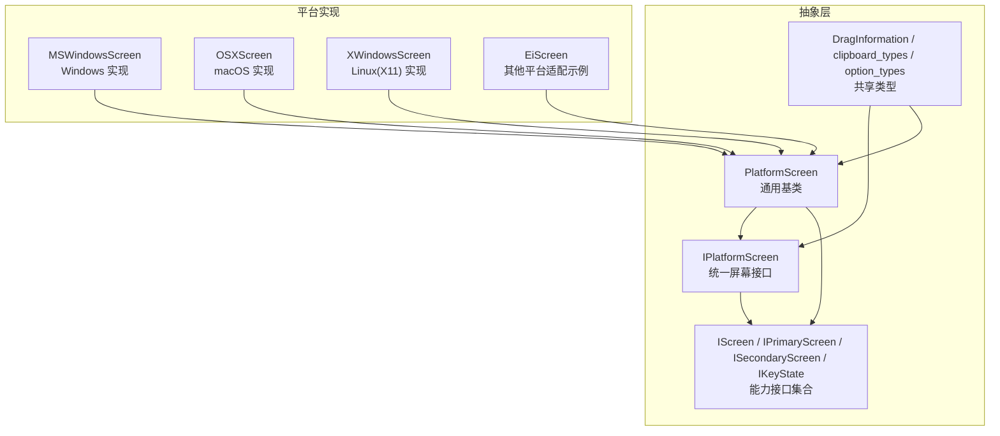
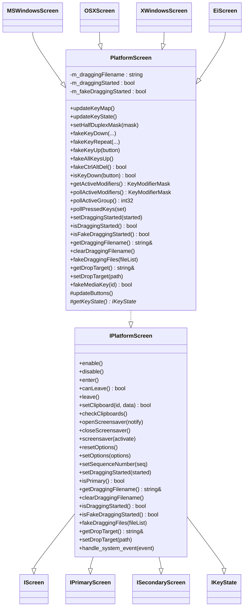
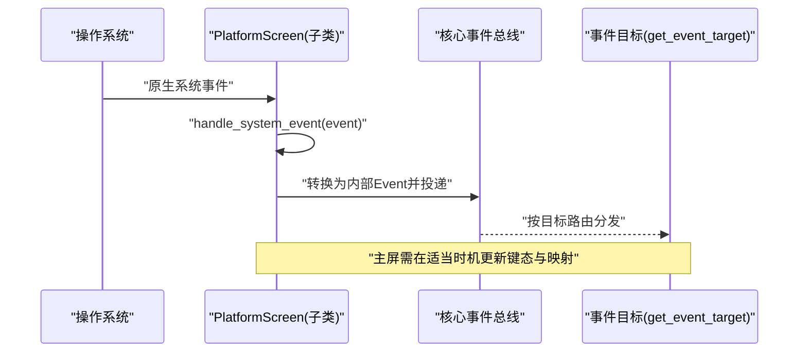
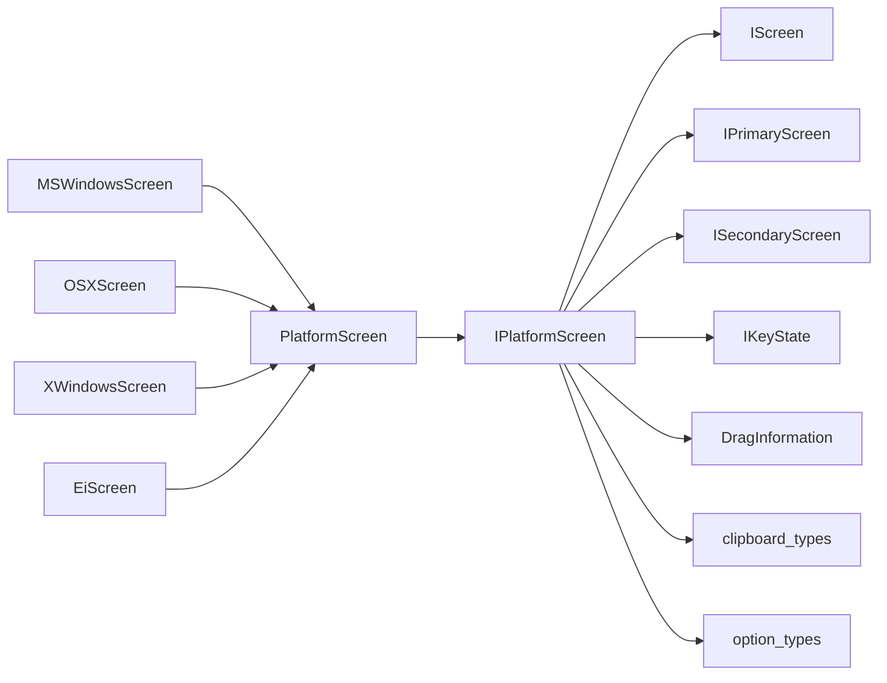
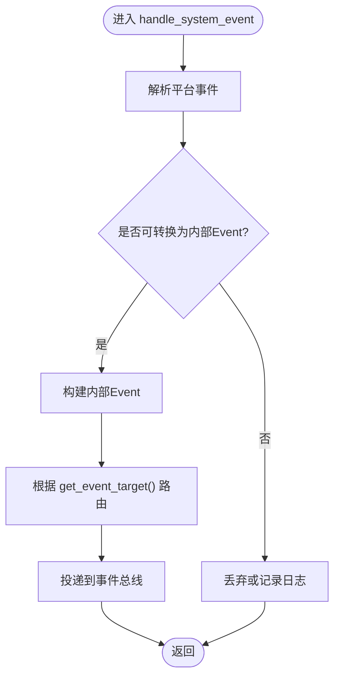

# 平台抽象层

<cite>
**本文引用的文件**   
- [IPlatformScreen.h](file://src/lib/inputleap/IPlatformScreen.h)
- [PlatformScreen.h](file://src/lib/inputleap/PlatformScreen.h)
- [MSWindowsScreen.h](file://src/lib/platform/MSWindowsScreen.h)
- [OSXScreen.h](file://src/lib/platform/OSXScreen.h)
- [XWindowsScreen.h](file://src/lib/platform/XWindowsScreen.h)
- [EiScreen.h](file://src/lib/platform/EiScreen.h)
- [IScreen.h](file://src/lib/inputleap/IScreen.h)
- [IPrimaryScreen.h](file://src/lib/inputleap/IPrimaryScreen.h)
- [ISecondaryScreen.h](file://src/lib/inputleap/ISecondaryScreen.h)
- [IKeyState.h](file://src/lib/inputleap/IKeyState.h)
- [DragInformation.h](file://src/lib/inputleap/DragInformation.h)
- [clipboard_types.h](file://src/lib/inputleap/clipboard_types.h)
- [option_types.h](file://src/lib/inputleap/option_types.h)
</cite>

## 目录
1. [简介](#简介)
2. [项目结构](#项目结构)
3. [核心组件](#核心组件)
4. [架构总览](#架构总览)
5. [详细组件分析](#详细组件分析)
6. [依赖关系分析](#依赖关系分析)
7. [性能与内存管理](#性能与内存管理)
8. [故障排查指南](#故障排查指南)
9. [结论](#结论)
10. [附录：新平台接入与事件转换示例](#附录新平台接入与事件转换示例)

## 简介
本文件面向 Input Leap 的平台抽象层，聚焦于跨平台输入处理的统一接口设计与平台特定实现的解耦机制。文档围绕 IPlatformScreen 接口定义、各平台具体实现（Windows、macOS、Linux）以及输入事件捕获、鼠标移动、键盘按键与剪贴板操作的差异进行系统化说明，并给出架构优化与内存管理策略、新平台接入步骤、事件转换机制与调试方法等实践指导。

## 项目结构
Input Leap 将“平台无关的屏幕抽象”与“平台相关的具体实现”分层组织：
- 抽象层位于 src/lib/inputleap，提供统一的屏幕与输入能力接口及基础实现。
- 平台实现位于 src/lib/platform，针对 Windows、macOS、Linux（X11）分别提供具体类。
- 辅助类型与数据模型（如拖拽信息、剪贴板类型、选项类型）集中在 inputleap 命名空间下，供抽象层与平台层共同使用。

图表来源
- [IPlatformScreen.h:1-188](file://src/lib/inputleap/IPlatformScreen.h#L1-L188)
- [PlatformScreen.h:1-94](file://src/lib/inputleap/PlatformScreen.h#L1-L94)
- [MSWindowsScreen.h:1-120](file://src/lib/platform/MSWindowsScreen.h#L1-L120)
- [OSXScreen.h:1-120](file://src/lib/platform/OSXScreen.h#L1-L120)
- [XWindowsScreen.h:1-120](file://src/lib/platform/XWindowsScreen.h#L1-L120)
- [EiScreen.h:1-120](file://src/lib/platform/EiScreen.h#L1-L120)

章节来源
- [IPlatformScreen.h:1-188](file://src/lib/inputleap/IPlatformScreen.h#L1-L188)
- [PlatformScreen.h:1-94](file://src/lib/inputleap/PlatformScreen.h#L1-L94)

## 核心组件
- IPlatformScreen：定义所有平台相关屏幕实现的公共接口，继承自 IScreen、IPrimaryScreen、ISecondaryScreen、IKeyState，覆盖屏幕生命周期、剪贴板、屏保、选项、拖拽、系统事件处理等能力。
- PlatformScreen：为 IPlatformScreen 提供通用实现与默认行为，封装键鼠状态轮询、拖拽状态等通用逻辑，并要求子类实现 updateButtons() 与 getKeyState() 等平台相关细节。
- 平台实现类：MSWindowsScreen、OSXScreen、XWindowsScreen、EiScreen 等，均继承自 PlatformScreen，负责对接各自平台的输入子系统与系统 API。

章节来源
- [IPlatformScreen.h:31-185](file://src/lib/inputleap/IPlatformScreen.h#L31-L185)
- [PlatformScreen.h:28-91](file://src/lib/inputleap/PlatformScreen.h#L28-L91)
- [MSWindowsScreen.h:41-120](file://src/lib/platform/MSWindowsScreen.h#L41-L120)
- [OSXScreen.h:52-120](file://src/lib/platform/OSXScreen.h#L52-L120)
- [XWindowsScreen.h:38-120](file://src/lib/platform/XWindowsScreen.h#L38-L120)
- [EiScreen.h:43-120](file://src/lib/platform/EiScreen.h#L43-L120)

## 架构总览
IPlatformScreen 作为统一入口，屏蔽了底层平台差异；上层业务通过该接口与屏幕交互，而具体平台由对应 Screen 类完成。PlatformScreen 在中间层提供可复用的通用逻辑，降低平台实现复杂度。

图表来源
- [IPlatformScreen.h:31-185](file://src/lib/inputleap/IPlatformScreen.h#L31-L185)
- [PlatformScreen.h:34-91](file://src/lib/inputleap/PlatformScreen.h#L34-L91)
- [MSWindowsScreen.h:41-120](file://src/lib/platform/MSWindowsScreen.h#L41-L120)
- [OSXScreen.h:52-120](file://src/lib/platform/OSXScreen.h#L52-L120)
- [XWindowsScreen.h:38-120](file://src/lib/platform/XWindowsScreen.h#L38-L120)
- [EiScreen.h:43-120](file://src/lib/platform/EiScreen.h#L43-L120)

## 详细组件分析

### IPlatformScreen 接口设计
- 职责边界
  - 屏幕生命周期：enable/disable/enter/canLeave/leave
  - 剪贴板：setClipboard/checkClipboards
  - 屏保：openScreensaver/closeScreensaver/screensaver
  - 选项：resetOptions/setOptions
  - 序列号：setSequenceNumber
  - 拖拽：setDraggingStarted/isDraggingStarted/isFakeDraggingStarted/getDraggingFilename/clearDraggingFilename/fakeDraggingFiles/getDropTarget/setDropTarget
  - 系统事件：handle_system_event
- 设计要点
  - 通过组合多个能力接口（IScreen、IPrimaryScreen、ISecondaryScreen、IKeyState）形成统一入口，避免上层对多接口的分散调用。
  - 将“平台相关”的系统事件处理集中到 handle_system_event，便于统一分发与日志记录。
  - 剪贴板与拖拽采用 ID 与路径字符串等轻量数据结构，降低耦合度。

章节来源
- [IPlatformScreen.h:31-185](file://src/lib/inputleap/IPlatformScreen.h#L31-L185)

### PlatformScreen 通用基类
- 通用功能
  - 键鼠状态：updateKeyMap/updateKeyState/pollActiveModifiers/pollPressedKeys 等
  - 模拟输入：fakeKeyDown/fakeKeyRepeat/fakeKeyUp/fakeAllKeysUp/fakeCtrlAltDel/fakeMediaKey
  - 拖拽状态：m_draggingFilename/m_draggingStarted/m_fakeDraggingStarted 及相关访问器
- 扩展点
  - updateButtons()：子类需实现以更新内部按钮映射与状态
  - getKeyState()：返回平台特定的 IKeyState 实例
- 默认行为
  - fakeDraggingFiles/getDropTarget/setDropTarget 抛出运行时异常，提示子类必须实现

章节来源
- [PlatformScreen.h:34-91](file://src/lib/inputleap/PlatformScreen.h#L34-L91)

### 平台实现概览
- MSWindowsScreen（Windows）
  - 继承 PlatformScreen，实现 Windows 特有的输入捕获、鼠标/键盘合成、剪贴板监听与屏保控制。
- OSXScreen（macOS）
  - 继承 PlatformScreen，基于 macOS 输入框架实现事件捕获与合成。
- XWindowsScreen（Linux/X11）
  - 继承 PlatformScreen，利用 X11 扩展（如 XTest、XInput）完成事件注入与读取。
- EiScreen（其他平台示例）
  - 展示如何基于 PlatformScreen 快速适配新平台。

章节来源
- [MSWindowsScreen.h:41-120](file://src/lib/platform/MSWindowsScreen.h#L41-L120)
- [OSXScreen.h:52-120](file://src/lib/platform/OSXScreen.h#L52-L120)
- [XWindowsScreen.h:38-120](file://src/lib/platform/XWindowsScreen.h#L38-L120)
- [EiScreen.h:43-120](file://src/lib/platform/EiScreen.h#L43-L120)

### 输入事件捕获与转换流程
- 系统事件入口
  - 平台实现应在构造时注册系统事件处理器，并在析构时移除；在 handle_system_event 中解析平台事件并转换为内部 Event 后投递给目标。
- 主屏职责
  - 除转发事件外，还需在按键按下/释放时调用 onKey，并在键盘映射变化时调用 updateKeyMap。
- 事件目标
  - 所有事件的目标应为 get_event_target() 返回值，确保路由正确。

图表来源
- [IPlatformScreen.h:162-184](file://src/lib/inputleap/IPlatformScreen.h#L162-L184)

### 剪贴板操作跨平台差异
- 统一接口
  - setClipboard(ClipboardID, IClipboard*)：设置指定 ID 的剪贴板内容
  - checkClipboards()：轮询所有权变化并派发抓取事件
- 平台差异
  - Windows/macOS/Linux 的剪贴板 API 与格式不同，平台实现需负责格式转换与权限处理。
  - 建议在 setClipboard 前进行幂等检查，避免重复写入造成抖动。

章节来源
- [IPlatformScreen.h:81-93](file://src/lib/inputleap/IPlatformScreen.h#L81-L93)
- [clipboard_types.h:1-200](file://src/lib/inputleap/clipboard_types.h#L1-L200)

### 屏保与选项管理
- 屏保
  - openScreensaver(notify)：可选择是否通知激活/停用事件；或禁用屏保并在 closeScreensaver 恢复。
  - screensaver(activate)：强制激活/停用屏保。
- 选项
  - resetOptions()/setOptions(options)：重置或增量更新平台相关选项。

章节来源
- [IPlatformScreen.h:95-131](file://src/lib/inputleap/IPlatformScreen.h#L95-L131)

## 依赖关系分析
- 抽象层依赖
  - IPlatformScreen 依赖 IScreen、IPrimaryScreen、ISecondaryScreen、IKeyState 等能力接口，以及 DragInformation、clipboard_types、option_types 等数据类型。
- 平台层依赖
  - 各平台 Screen 类仅依赖 PlatformScreen 提供的通用能力，并通过 getKeyState() 获取平台键态对象。
- 可能的循环依赖
  - 当前设计通过接口与虚函数解耦，未见直接循环依赖；新增平台时应遵循“只依赖抽象层”的原则。

图表来源
- [IPlatformScreen.h:1-188](file://src/lib/inputleap/IPlatformScreen.h#L1-L188)
- [PlatformScreen.h:1-94](file://src/lib/inputleap/PlatformScreen.h#L1-L94)
- [DragInformation.h:1-200](file://src/lib/inputleap/DragInformation.h#L1-L200)
- [clipboard_types.h:1-200](file://src/lib/inputleap/clipboard_types.h#L1-L200)
- [option_types.h:1-200](file://src/lib/inputleap/option_types.h#L1-L200)

章节来源
- [IPlatformScreen.h:1-188](file://src/lib/inputleap/IPlatformScreen.h#L1-L188)
- [PlatformScreen.h:1-94](file://src/lib/inputleap/PlatformScreen.h#L1-L94)

## 性能与内存管理
- 事件批处理与节流
  - 在高频率事件场景（如鼠标移动）建议合并或节流，减少跨进程/跨线程投递开销。
- 剪贴板变更去抖
  - 频繁写入会触发系统回调风暴，可在 setClipboard 前后增加时间窗口去抖。
- 键态轮询优化
  - pollActiveModifiers/pollPressedKeys 应仅在必要时触发，避免每帧轮询。
- 资源生命周期
  - 平台实现应在 enable/leave 阶段按需安装钩子，在 disable/enter 阶段及时卸载，防止泄漏与僵尸回调。
- 内存拷贝最小化
  - 剪贴板与拖拽路径传递尽量使用引用或移动语义，避免不必要的深拷贝。

[本节为通用性能建议，不直接分析具体文件]

## 故障排查指南
- 常见问题定位
  - 事件未到达：检查 handle_system_event 是否正确注册与投递，确认 get_event_target 返回值是否符合预期。
  - 剪贴板不同步：验证 setClipboard 与 checkClipboards 的调用时机，关注 ClipboardID 一致性。
  - 屏保异常：核对 openScreensaver/closeScreensaver 成对调用，确认 notify 模式下的回调链路。
- 日志与断点
  - 在关键入口（enable/leave/handle_system_event/setClipboard）添加日志，观察平台差异导致的分支路径。
- 回归测试
  - 针对主屏/副屏切换、跨屏拖拽、快捷键组合等场景编写用例，确保新平台实现行为一致。

[本节为通用排障建议，不直接分析具体文件]

## 结论
IPlatformScreen 提供了稳定、清晰的跨平台输入抽象，PlatformScreen 进一步收敛通用逻辑，使各平台实现专注于系统 API 对接。通过合理的事件转换、剪贴板同步与屏保管理，可实现一致的跨屏体验。新增平台只需继承 PlatformScreen 并实现必要虚函数，即可快速接入。

[本节为总结性内容，不直接分析具体文件]

## 附录：新平台接入与事件转换示例

### 接入步骤清单
- 新建平台 Screen 类，继承 PlatformScreen
- 实现必需虚函数
  - updateButtons()：维护平台鼠标按钮映射与状态
  - getKeyState()：返回平台 IKeyState 实例
- 实现 IPlatformScreen 要求的方法
  - enable/disable/enter/canLeave/leave
  - setClipboard/checkClipboards
  - openScreensaver/closeScreensaver/screensaver
  - resetOptions/setOptions
  - setSequenceNumber
  - 拖拽相关：getDraggingFilename/clearDraggingFilename/isDraggingStarted/isFakeDraggingStarted/fakeDraggingFiles/getDropTarget/setDropTarget
  - handle_system_event：注册系统事件处理器，转换并投递内部事件
- 在主屏场景中
  - 按键按下/释放时调用 onKey
  - 键盘映射变化时调用 updateKeyMap

章节来源
- [IPlatformScreen.h:44-184](file://src/lib/inputleap/IPlatformScreen.h#L44-L184)
- [PlatformScreen.h:72-91](file://src/lib/inputleap/PlatformScreen.h#L72-L91)

### 事件转换流程图（概念）

[此图为概念流程，不直接映射具体源码文件]

### 性能优化技巧
- 事件合并：对高频事件（鼠标移动）做批量合并
- 剪贴板去抖：限制单位时间内 setClipboard 调用次数
- 键态缓存：缓存最近一次 pollActiveModifiers 结果，避免重复查询
- 延迟初始化：仅在首次需要时加载平台库或建立连接

[本节为通用优化建议，不直接分析具体文件]