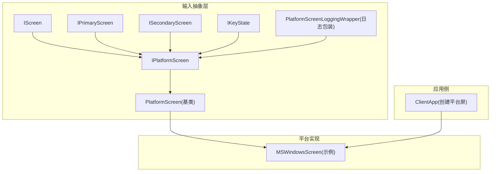
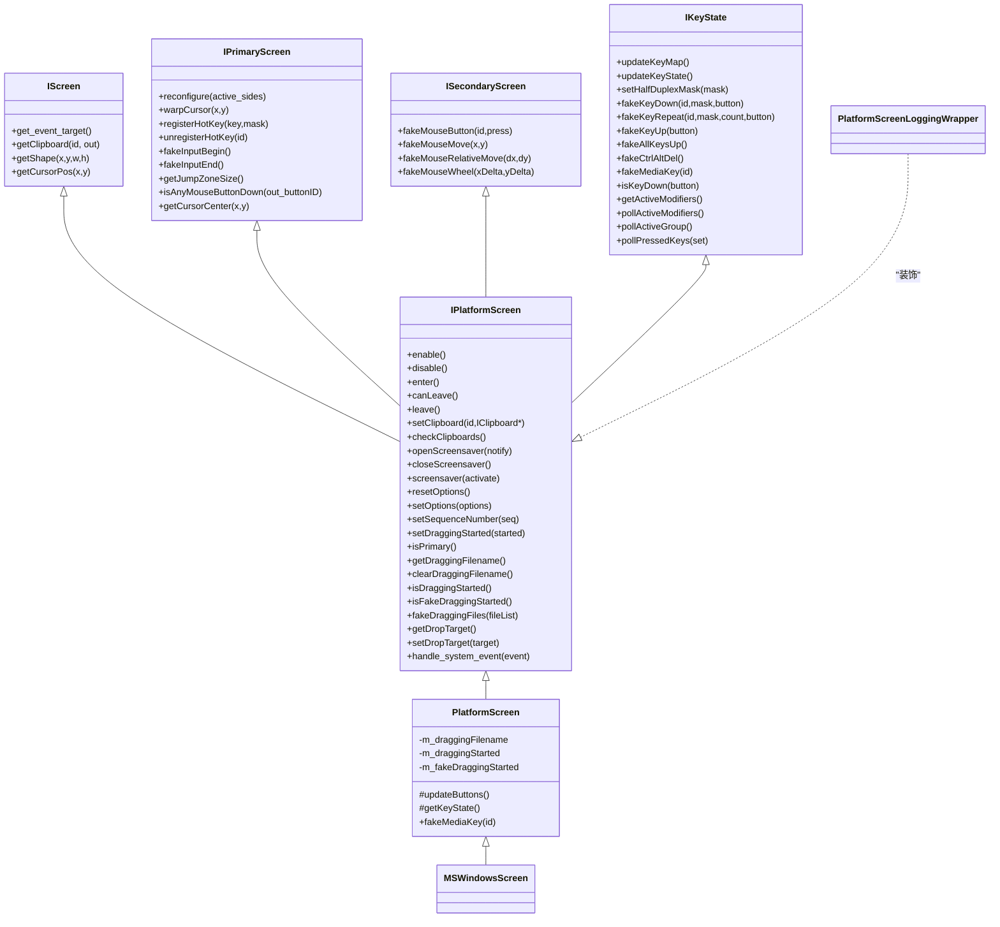
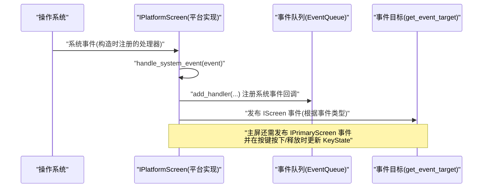
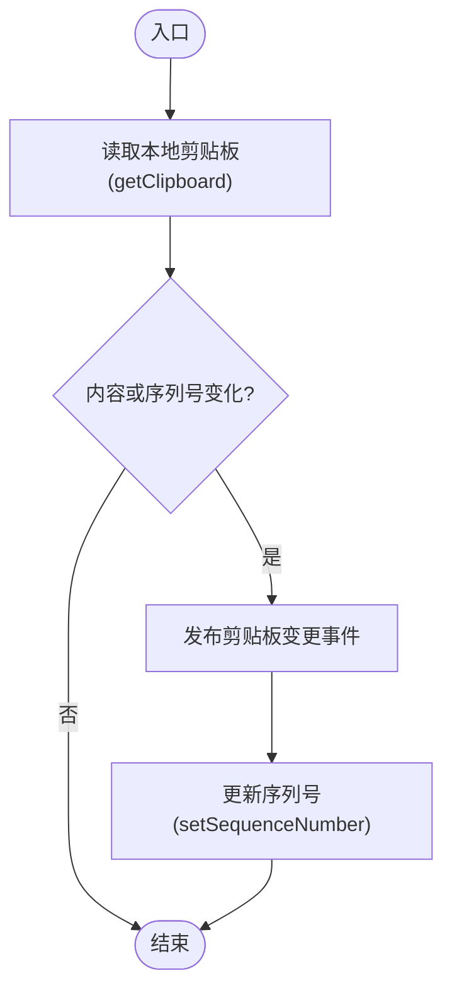
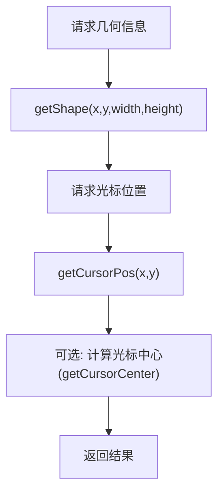
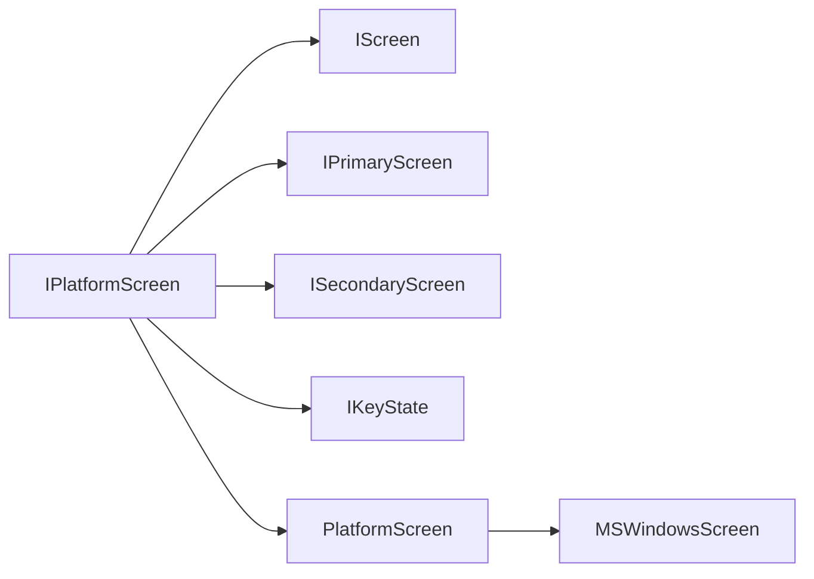

# 平台接口定义

<cite>
**本文引用的文件**   
- [IPlatformScreen.h](file://src/lib/inputleap/IPlatformScreen.h)
- [PlatformScreen.h](file://src/lib/inputleap/PlatformScreen.h)
- [PlatformScreenLoggingWrapper.h](file://src/lib/inputleap/PlatformScreenLoggingWrapper.h)
- [IScreen.h](file://src/lib/inputleap/IScreen.h)
- [IPrimaryScreen.h](file://src/lib/inputleap/IPrimaryScreen.h)
- [ISecondaryScreen.h](file://src/lib/inputleap/ISecondaryScreen.h)
- [IKeyState.h](file://src/lib/inputleap/IKeyState.h)
- [MSWindowsScreen.h](file://src/lib/platform/MSWindowsScreen.h)
- [MSWindowsScreen.cpp](file://src/lib/platform/MSWindowsScreen.cpp)
- [ClientApp.cpp](file://src/lib/inputleap/ClientApp.cpp)
</cite>

## 目录
1. [简介](#简介)
2. [项目结构](#项目结构)
3. [核心组件](#核心组件)
4. [架构总览](#架构总览)
5. [详细组件分析](#详细组件分析)
6. [依赖关系分析](#依赖关系分析)
7. [性能考虑](#性能考虑)
8. [故障排查指南](#故障排查指南)
9. [结论](#结论)
10. [附录](#附录)

## 简介
本文件围绕 Input Leap 的平台抽象层，系统化阐述 IPlatformScreen 接口的设计目标、职责边界与扩展方式。重点覆盖：
- 抽象层次与职责划分：IScreen、IPrimaryScreen、ISecondaryScreen、IKeyState 与 IPlatformScreen 的关系
- 方法契约：参数规范、返回值约定、错误处理策略
- 输入事件生命周期：enable/disable、enter/leave、系统事件处理
- 屏幕几何与光标：形状获取、光标位置与中心点
- 剪贴板：读取、写入、所有权变更检测
- 拖放与文件传输：拖拽状态、目标接收端、虚拟拖放
- 屏幕保护控制：打开/关闭、强制激活/停用
- 选项管理：重置与增量更新
- 自定义平台适配器实现指南：事件转换、错误处理、性能优化
- 日志包装器与可观测性

## 项目结构
Input Leap 将“平台无关的屏幕抽象”与“具体平台实现”解耦。核心接口位于 inputleap 子模块，具体平台实现位于 platform 子模块；GUI 与客户端/服务端应用通过工厂或条件编译选择具体实现。

图表来源
- [IPlatformScreen.h:37-39](file://src/lib/inputleap/IPlatformScreen.h#L37-L39)
- [PlatformScreen.h:34-35](file://src/lib/inputleap/PlatformScreen.h#L34-L35)
- [MSWindowsScreen.h:42-48](file://src/lib/platform/MSWindowsScreen.h#L42-L48)
- [ClientApp.cpp:533-554](file://src/lib/inputleap/ClientApp.cpp#L533-L554)

章节来源
- [IPlatformScreen.h:37-39](file://src/lib/inputleap/IPlatformScreen.h#L37-L39)
- [PlatformScreen.h:34-35](file://src/lib/inputleap/PlatformScreen.h#L34-L35)
- [MSWindowsScreen.h:42-48](file://src/lib/platform/MSWindowsScreen.h#L42-L48)
- [ClientApp.cpp:533-554](file://src/lib/inputleap/ClientApp.cpp#L533-L554)

## 核心组件
本节聚焦 IPlatformScreen 及其相关接口的职责与方法契约。

- IPlatformScreen
  - 统一了主屏与副屏的公共能力，并组合了键盘状态访问能力
  - 负责屏幕启用/禁用、进入/离开、剪贴板读写与所有权检查、屏幕保护控制、选项重置与设置、序列号同步、拖拽状态等
  - 要求子类在构造时安装系统事件处理器，并在析构中移除；同时提供 handle_system_event 以处理系统事件并向上层发布 IScreen 事件
  - 主屏还需按 IPrimaryScreen 的职责发布事件，并在按键按下/释放时调用 KeyState::onKey（由上层集成），在键盘映射变化时调用 updateKeyMap

- IScreen
  - 提供事件目标、剪贴板读取、屏幕形状与光标位置等基础访问能力

- IPrimaryScreen
  - 主屏特有：重配置联动边、光标瞬移、全局热键注册/注销、合成输入开始/结束、跳区大小、任意鼠标键是否按下、光标中心点

- ISecondaryScreen
  - 副屏特有：模拟鼠标按键、绝对/相对移动、滚轮

- IKeyState
  - 键盘状态：更新映射/物理状态、半双工掩码、模拟按键/重复/抬起、Ctrl+Alt+Del、媒体键、查询按键状态与修饰键、轮询布局与已按键集合

- PlatformScreen
  - 为 IPlatformScreen 提供通用默认实现与受保护钩子（如 updateButtons、getKeyState），以及拖拽状态字段与部分未实现方法的异常抛出

- PlatformScreenLoggingWrapper
  - 对 IPlatformScreen 的装饰器，转发所有调用并可用于记录日志与诊断

章节来源
- [IPlatformScreen.h:37-185](file://src/lib/inputleap/IPlatformScreen.h#L37-L185)
- [IScreen.h:32-73](file://src/lib/inputleap/IScreen.h#L32-L73)
- [IPrimaryScreen.h:33-176](file://src/lib/inputleap/IPrimaryScreen.h#L33-L176)
- [ISecondaryScreen.h:32-66](file://src/lib/inputleap/ISecondaryScreen.h#L32-L66)
- [IKeyState.h:34-185](file://src/lib/inputleap/IKeyState.h#L34-L185)
- [PlatformScreen.h:34-91](file://src/lib/inputleap/PlatformScreen.h#L34-L91)
- [PlatformScreenLoggingWrapper.h:24-103](file://src/lib/inputleap/PlatformScreenLoggingWrapper.h#L24-L103)

## 架构总览
下图展示 IPlatformScreen 与其父接口、基类与典型平台实现的继承与组合关系。

图表来源
- [IScreen.h:32-73](file://src/lib/inputleap/IScreen.h#L32-L73)
- [IPrimaryScreen.h:33-176](file://src/lib/inputleap/IPrimaryScreen.h#L33-L176)
- [ISecondaryScreen.h:32-66](file://src/lib/inputleap/ISecondaryScreen.h#L32-L66)
- [IKeyState.h:34-185](file://src/lib/inputleap/IKeyState.h#L34-L185)
- [IPlatformScreen.h:37-185](file://src/lib/inputleap/IPlatformScreen.h#L37-L185)
- [PlatformScreen.h:34-91](file://src/lib/inputleap/PlatformScreen.h#L34-L91)
- [MSWindowsScreen.h:42-86](file://src/lib/platform/MSWindowsScreen.h#L42-L86)
- [PlatformScreenLoggingWrapper.h:24-103](file://src/lib/inputleap/PlatformScreenLoggingWrapper.h#L24-L103)

## 详细组件分析

### IPlatformScreen 接口契约与语义
- 生命周期
  - enable/disable：准备/撤销系统事件监听与合成输入能力；副屏需隐藏光标
  - enter/canLeave/leave：用户焦点进入/离开当前屏幕；canLeave 用于主屏安装钩子失败时的回退
- 剪贴板
  - setClipboard：写入指定 id 的剪贴板内容
  - checkClipboards：轮询各剪贴板所有者变化并发布抓取事件
- 屏幕保护
  - openScreensaver/closeScreensaver/screensaver：支持通知模式与强制激活/停用
- 选项
  - resetOptions/setOptions：重置为默认或增量更新
- 序列号
  - setSequenceNumber：设定后续剪贴板事件的序列号
- 拖拽
  - setDraggingStarted/isDraggingStarted/isFakeDraggingStarted/getDraggingFilename/clearDraggingFilename/fakeDraggingFiles/getDropTarget/setDropTarget：管理拖拽状态、文件名与目标接收端
- 系统事件
  - handle_system_event：平台应在构造中注册系统事件处理器，在析构中移除；在此方法内将平台事件转换为 IScreen 事件并投递到 get_event_target()

章节来源
- [IPlatformScreen.h:44-185](file://src/lib/inputleap/IPlatformScreen.h#L44-L185)

### PlatformScreen 基类与扩展点
- 提供拖拽状态字段与默认抛异常的占位实现（如 fakeDraggingFiles/getDropTarget/setDropTarget）
- 暴露 protected 钩子：
  - updateButtons：子类必须实现以维护内部鼠标按钮映射与状态
  - getKeyState：返回平台特定的 IKeyState 实例
- 提供 media key 合成的默认实现路径

章节来源
- [PlatformScreen.h:55-91](file://src/lib/inputleap/PlatformScreen.h#L55-L91)

### 日志包装器 PlatformScreenLoggingWrapper
- 作为 IPlatformScreen 的装饰器，透明转发所有调用，便于插入日志、指标与诊断逻辑
- 适用于生产环境的可观测性与问题定位

章节来源
- [PlatformScreenLoggingWrapper.h:24-103](file://src/lib/inputleap/PlatformScreenLoggingWrapper.h#L24-L103)

### 平台示例：MSWindowsScreen
- 继承自 PlatformScreen，实现 Windows 平台的窗口类注册、窗口创建、事件分发等细节
- 提供 IScreen/IPrimaryScreen 等方法的具体实现（如 getShape、warpCursor、registerHotKey 等）

章节来源
- [MSWindowsScreen.h:42-86](file://src/lib/platform/MSWindowsScreen.h#L42-L86)
- [MSWindowsScreen.cpp:809-847](file://src/lib/platform/MSWindowsScreen.cpp#L809-L847)

### 事件处理生命周期（序列图）

图表来源
- [IPlatformScreen.h:162-185](file://src/lib/inputleap/IPlatformScreen.h#L162-L185)

### 剪贴板操作流程（流程图）

图表来源
- [IScreen.h:51-56](file://src/lib/inputleap/IScreen.h#L51-L56)
- [IPlatformScreen.h:81-93](file://src/lib/inputleap/IPlatformScreen.h#L81-L93)
- [IPlatformScreen.h:132-136](file://src/lib/inputleap/IPlatformScreen.h#L132-L136)

### 屏幕几何与光标（流程图）

图表来源
- [IScreen.h:58-70](file://src/lib/inputleap/IScreen.h#L58-L70)
- [IPrimaryScreen.h:167-173](file://src/lib/inputleap/IPrimaryScreen.h#L167-L173)

### 自定义平台适配器实现指南
- 继承链
  - 推荐从 PlatformScreen 派生，复用通用状态与默认行为
  - 实现 updateButtons 与 getKeyState 两个关键钩子
- 系统事件
  - 在构造函数中注册系统事件处理器，在析构中移除
  - 在 handle_system_event 中将平台事件转换为 IScreen 事件并投递至 get_event_target()
- 主屏职责
  - 正确发布 IPrimaryScreen 相关事件
  - 在按键按下/释放时更新 KeyState（非重复事件）
  - 键盘映射变化时调用 updateKeyMap
- 副屏职责
  - 实现 ISecondaryScreen 的模拟输入方法
- 错误处理
  - 对于尚未实现的方法，遵循基类抛出的运行时异常约定（例如 fakeDraggingFiles/getDropTarget/setDropTarget）
  - canLeave 在主屏钩子安装失败时应返回 false，避免进入非法状态
- 性能优化
  - 批量更新：合并多次鼠标/键盘状态变更后再发布事件
  - 节流：对高频事件（如鼠标移动）进行采样或限流
  - 零拷贝：剪贴板数据尽量使用共享内存或引用传递
  - 避免阻塞：系统事件处理保持轻量，耗时任务异步化
- 可观测性
  - 使用 PlatformScreenLoggingWrapper 包裹实现，记录关键方法与异常路径

章节来源
- [PlatformScreen.h:72-91](file://src/lib/inputleap/PlatformScreen.h#L72-L91)
- [IPlatformScreen.h:162-185](file://src/lib/inputleap/IPlatformScreen.h#L162-L185)
- [PlatformScreen.h:63-68](file://src/lib/inputleap/PlatformScreen.h#L63-L68)

### 应用侧创建平台屏（示例路径）
- ClientApp 根据平台宏与运行参数创建具体 IPlatformScreen 实现（如 MSWindowsScreen、XWindowsScreen、OSXScreen 等）
- 该工厂方法展示了如何注入事件队列与平台特定参数

章节来源
- [ClientApp.cpp:533-554](file://src/lib/inputleap/ClientApp.cpp#L533-L554)

## 依赖关系分析
- 耦合与内聚
  - IPlatformScreen 聚合多个独立职责接口，提升内聚的同时也增加了实现复杂度
  - PlatformScreen 将通用状态与默认行为下沉，降低平台实现重复代码
- 外部依赖
  - 事件系统与 EventTarget：所有事件应投递到 get_event_target()
  - 平台 API：不同平台通过各自实现对接系统能力（如 Windows 窗口类注册与消息循环）

图表来源
- [IPlatformScreen.h:37-39](file://src/lib/inputleap/IPlatformScreen.h#L37-L39)
- [PlatformScreen.h:34-35](file://src/lib/inputleap/PlatformScreen.h#L34-L35)
- [MSWindowsScreen.h:42-48](file://src/lib/platform/MSWindowsScreen.h#L42-L48)

章节来源
- [IPlatformScreen.h:37-39](file://src/lib/inputleap/IPlatformScreen.h#L37-L39)
- [PlatformScreen.h:34-35](file://src/lib/inputleap/PlatformScreen.h#L34-L35)

## 性能考虑
- 事件批处理与去抖：合并短时间内的高频事件，减少跨线程/进程开销
- 剪贴板差异检测：基于内容与序列号快速判断是否需要上报
- 鼠标移动节流：在高 DPI 场景下限制上报频率
- 避免阻塞 UI 线程：系统事件处理仅做必要转换，复杂逻辑异步执行
- 资源管理：确保 enable/disable 成对调用，防止钩子泄漏

[本节为通用指导，不直接分析具体文件]

## 故障排查指南
- 常见问题
  - 无法离开屏幕：检查 canLeave 的实现，确认主屏钩子安装成功
  - 剪贴板不同步：核对 setSequenceNumber 的使用与 checkClipboards 的轮询策略
  - 系统事件丢失：确认构造/析构中对系统事件处理器的注册与移除
  - 未实现方法异常：若调用 fakeDraggingFiles/getDropTarget/setDropTarget 抛出运行时异常，说明平台未实现对应功能
- 建议的诊断手段
  - 使用 PlatformScreenLoggingWrapper 包裹实现，记录关键方法入参与异常堆栈
  - 打印 get_event_target 与事件投递路径，验证事件流向

章节来源
- [IPlatformScreen.h:66-79](file://src/lib/inputleap/IPlatformScreen.h#L66-L79)
- [IPlatformScreen.h:81-93](file://src/lib/inputleap/IPlatformScreen.h#L81-L93)
- [IPlatformScreen.h:162-185](file://src/lib/inputleap/IPlatformScreen.h#L162-L185)
- [PlatformScreen.h:63-68](file://src/lib/inputleap/PlatformScreen.h#L63-L68)
- [PlatformScreenLoggingWrapper.h:24-103](file://src/lib/inputleap/PlatformScreenLoggingWrapper.h#L24-L103)

## 结论
IPlatformScreen 作为平台适配的核心抽象，清晰分离了屏幕生命周期、输入合成、剪贴板、屏幕保护与选项管理等职责。通过 PlatformScreen 基类与日志包装器，开发者可以快速构建稳定、可观测且高性能的自定义平台适配器。遵循本文的契约与最佳实践，有助于在不同平台上保持一致的用户体验与系统行为。

[本节为总结性内容，不直接分析具体文件]

## 附录
- 术语
  - 主屏：本地真实屏幕，负责捕获用户输入并可能合成输入
  - 副屏：远程屏幕，主要接收并合成来自主屏的输入
  - 跳区：屏幕边缘区域，触发光标跳转到相邻屏幕
  - 序列号：剪贴板事件版本标识，用于去重与一致性
- 参考实现路径
  - Windows 平台：MSWindowsScreen
  - 客户端创建：ClientApp::create_platform_screen

章节来源
- [MSWindowsScreen.h:42-86](file://src/lib/platform/MSWindowsScreen.h#L42-L86)
- [ClientApp.cpp:533-554](file://src/lib/inputleap/ClientApp.cpp#L533-L554)