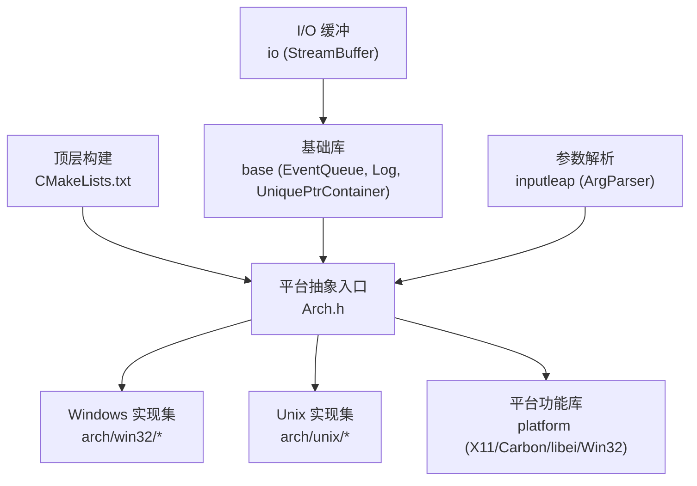
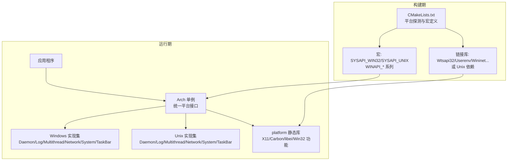
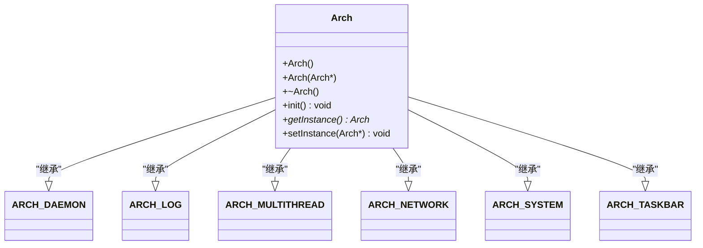
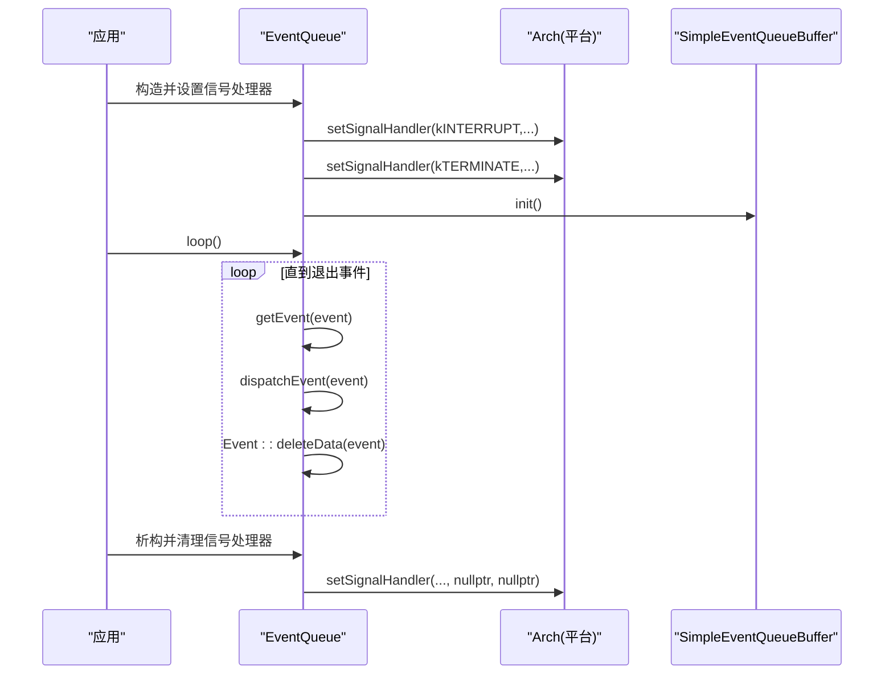
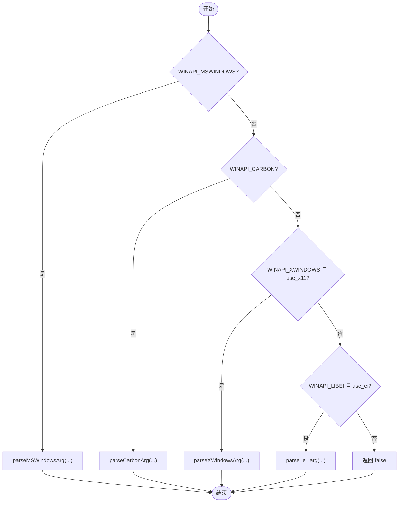
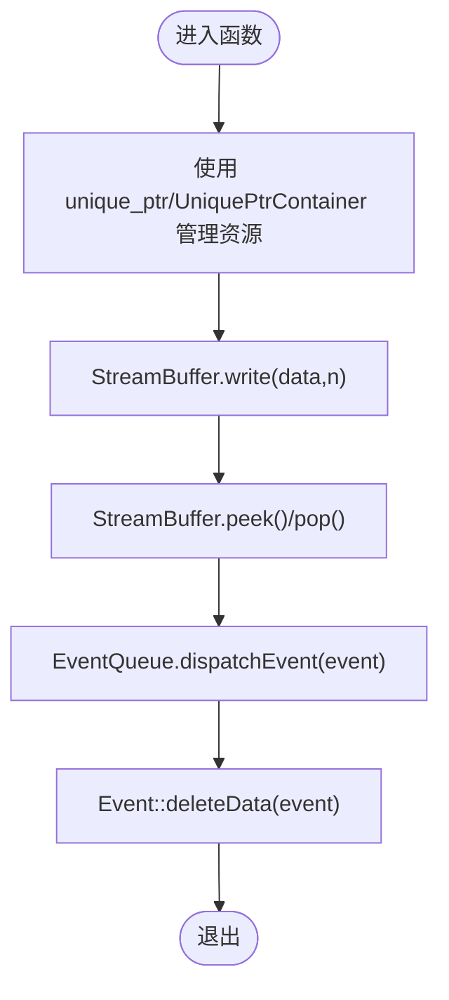
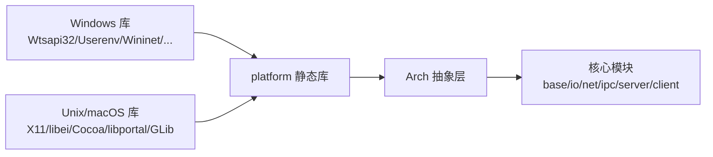

# 架构优化与内存管理

<cite>
**本文引用的文件**   
- [README.md](file://README.md)
- [CMakeLists.txt](file://CMakeLists.txt)
- [src/lib/arch/Arch.h](file://src/lib/arch/Arch.h)
- [src/lib/common/common.h](file://src/lib/common/common.h)
- [src/lib/base/EventQueue.cpp](file://src/lib/base/EventQueue.cpp)
- [src/lib/io/StreamBuffer.h](file://src/lib/io/StreamBuffer.h)
- [src/lib/base/UniquePtrContainer.h](file://src/lib/base/UniquePtrContainer.h)
- [src/lib/base/Log.h](file://src/lib/base/Log.h)
- [src/lib/inputleap/ArgParser.cpp](file://src/lib/inputleap/ArgParser.cpp)
- [src/test/integtests/Main.cpp](file://src/test/integtests/Main.cpp)
- [src/lib/platform/CMakeLists.txt](file://src/lib/platform/CMakeLists.txt)
</cite>

## 目录
1. [简介](#简介)
2. [项目结构](#项目结构)
3. [核心组件](#核心组件)
4. [架构总览](#架构总览)
5. [详细组件分析](#详细组件分析)
6. [依赖关系分析](#依赖关系分析)
7. [性能考虑](#性能考虑)
8. [故障排查指南](#故障排查指南)
9. [结论](#结论)
10. [附录](#附录)

## 简介
本技术文档聚焦 Input Leap 的跨平台抽象层（Arch）与内存管理，旨在为开发者提供：
- 跨平台抽象层的设计模式与架构决策说明
- 不同平台的性能特征分析与针对性优化策略
- 内存管理最佳实践、资源泄漏防护与兼容性处理
- 平台检测机制、条件编译与运行时特性探测示例路径
- 性能分析工具使用、基准测试框架与内存调试技巧
- 新平台适配的架构指导原则与开发流程

Input Leap 是一个跨平台的键盘鼠标共享工具，支持 Windows、macOS、Linux、FreeBSD、OpenBSD 等系统。其通过统一的抽象层屏蔽平台差异，并在构建期与运行期进行能力探测与选择。

**章节来源**
- [README.md:114-123](file://README.md#L114-L123)

## 项目结构
本项目采用分层模块化组织，关键目录与职责如下：
- src/lib/arch：平台抽象入口与多实现聚合（Windows/Unix）
- src/lib/platform：平台相关功能的具体实现（X11、Carbon、libei、Win32 等）
- src/lib/base：基础库（事件队列、日志、通用容器等）
- src/lib/io：I/O 缓冲与流式处理
- src/lib/inputleap：应用参数解析与配置
- src/test：单元测试与集成测试
- CMakeLists.txt：顶层构建配置，负责平台探测、宏定义与依赖链接

**图示来源**
- [CMakeLists.txt:210-248](file://CMakeLists.txt#L210-L248)
- [src/lib/arch/Arch.h:40-55](file://src/lib/arch/Arch.h#L40-L55)
- [src/lib/platform/CMakeLists.txt:32-73](file://src/lib/platform/CMakeLists.txt#L32-L73)

**章节来源**
- [CMakeLists.txt:210-248](file://CMakeLists.txt#L210-L248)
- [src/lib/platform/CMakeLists.txt:32-73](file://src/lib/platform/CMakeLists.txt#L32-L73)

## 核心组件
本节概述跨平台抽象层与内存管理相关的核心组件及其职责。

- 平台抽象入口 Arch
  - 统一访问点，组合多个平台接口（守护进程、日志、多线程、网络、系统、任务栏）。
  - 通过宏在编译期选择具体实现（Windows/Unix），并提供单例访问。
- 事件队列 EventQueue
  - 基于平台信号/中断机制的事件循环，负责事件分发与生命周期管理。
- I/O 缓冲 StreamBuffer
  - 分块缓冲区，减少频繁分配与拷贝，提升吞吐。
- 智能指针容器 UniquePtrContainer
  - 封装 unique_ptr 集合，简化资源清理与所有权转移。
- 日志 Log
  - 可配置的日志输出，支持构建期开关与级别控制。
- 参数解析 ArgParser
  - 根据平台宏分支解析平台特定参数，驱动运行时行为。

**章节来源**
- [src/lib/arch/Arch.h:67-112](file://src/lib/arch/Arch.h#L67-L112)
- [src/lib/base/EventQueue.cpp:41-81](file://src/lib/base/EventQueue.cpp#L41-L81)
- [src/lib/io/StreamBuffer.h:41-79](file://src/lib/io/StreamBuffer.h#L41-L79)
- [src/lib/base/UniquePtrContainer.h:25-61](file://src/lib/base/UniquePtrContainer.h#L25-L61)
- [src/lib/base/Log.h:155-188](file://src/lib/base/Log.h#L155-L188)
- [src/lib/inputleap/ArgParser.cpp:324-343](file://src/lib/inputleap/ArgParser.cpp#L324-L343)

## 架构总览
下图展示从顶层构建到平台抽象与实现的总体关系，以及关键宏与库依赖。

**图示来源**
- [CMakeLists.txt:210-248](file://CMakeLists.txt#L210-L248)
- [src/lib/arch/Arch.h:40-55](file://src/lib/arch/Arch.h#L40-L55)
- [src/lib/platform/CMakeLists.txt:63-73](file://src/lib/platform/CMakeLists.txt#L63-L73)

## 详细组件分析

### 平台抽象层 Arch 类图
Arch 作为多接口的委托者，将调用转发至具体平台实现。

**图示来源**
- [src/lib/arch/Arch.h:77-112](file://src/lib/arch/Arch.h#L77-L112)

**章节来源**
- [src/lib/arch/Arch.h:67-112](file://src/lib/arch/Arch.h#L67-L112)

### 事件循环序列图（EventQueue）
展示事件队列初始化、注册信号处理器、主循环与事件分发过程。

**图示来源**
- [src/lib/base/EventQueue.cpp:41-81](file://src/lib/base/EventQueue.cpp#L41-L81)

**章节来源**
- [src/lib/base/EventQueue.cpp:41-81](file://src/lib/base/EventQueue.cpp#L41-L81)

### 参数解析流程图（ArgParser）
根据平台宏与用户选项，路由到对应平台参数解析器。

**图示来源**
- [src/lib/inputleap/ArgParser.cpp:324-343](file://src/lib/inputleap/ArgParser.cpp#L324-L343)

**章节来源**
- [src/lib/inputleap/ArgParser.cpp:324-343](file://src/lib/inputleap/ArgParser.cpp#L324-L343)

### 内存管理与资源安全
- 智能指针与容器
  - 使用 std::unique_ptr 与 UniquePtrContainer 管理对象生命周期，避免手动释放导致的泄漏。
- 事件数据清理
  - 事件分发后显式调用删除数据的逻辑，确保动态分配的 event 数据被正确释放。
- I/O 缓冲优化
  - StreamBuffer 以分块方式存储数据，降低频繁分配开销；提供 peek/pop/write 接口，便于高效读写。

**图示来源**
- [src/lib/base/UniquePtrContainer.h:25-61](file://src/lib/base/UniquePtrContainer.h#L25-L61)
- [src/lib/io/StreamBuffer.h:41-79](file://src/lib/io/StreamBuffer.h#L41-L79)
- [src/lib/base/EventQueue.cpp:74-81](file://src/lib/base/EventQueue.cpp#L74-L81)

**章节来源**
- [src/lib/base/UniquePtrContainer.h:25-61](file://src/lib/base/UniquePtrContainer.h#L25-L61)
- [src/lib/io/StreamBuffer.h:41-79](file://src/lib/io/StreamBuffer.h#L41-L79)
- [src/lib/base/EventQueue.cpp:74-81](file://src/lib/base/EventQueue.cpp#L74-L81)

### 平台检测与条件编译
- 构建期宏
  - SYSAPI_WIN32/SYSAPI_UNIX 用于区分 Windows 与 Unix 家族。
  - WINAPI_MSWINDOWS/WINAPI_CARBON/WINAPI_XWINDOWS/WINAPI_LIBEI 用于选择具体平台后端。
- 运行时特性探测
  - 通过 CMake 的 check_* 模块探测头文件、符号与枚举可用性，生成 config.h 供代码使用。
- 示例路径
  - 平台宏定义与链接库选择：[CMakeLists.txt:210-248](file://CMakeLists.txt#L210-L248)
  - 运行时特性探测（libportal、dns_sd 等）：[CMakeLists.txt:186-202](file://CMakeLists.txt#L186-L202)

**章节来源**
- [CMakeLists.txt:210-248](file://CMakeLists.txt#L210-L248)
- [CMakeLists.txt:186-202](file://CMakeLists.txt#L186-L202)

### 平台后端构建与链接
- platform 静态库
  - 按平台收集源文件（MSWindows、Carbon、XWindows、libei、XKB），并链接必要系统库（如 Cocoa）。
- Unity Build 注意事项
  - .mm 文件需跳过 Unity 构建以避免编译器问题。

**章节来源**
- [src/lib/platform/CMakeLists.txt:32-73](file://src/lib/platform/CMakeLists.txt#L32-L73)

## 依赖关系分析
- 构建期依赖
  - Windows：Wtsapi32、Userenv、Wininet、comsuppw、Shlwapi 等。
  - Unix/macOS：根据启用项链接 X11、libei、Cocoa、libportal、GLib 等。
- 运行期依赖
  - Arch 组合多个平台接口，EventQueue 依赖平台信号/线程能力，platform 库提供图形/输入子系统能力。

**图示来源**
- [CMakeLists.txt:230-248](file://CMakeLists.txt#L230-L248)
- [src/lib/platform/CMakeLists.txt:63-73](file://src/lib/platform/CMakeLists.txt#L63-L73)

**章节来源**
- [CMakeLists.txt:230-248](file://CMakeLists.txt#L230-L248)
- [src/lib/platform/CMakeLists.txt:63-73](file://src/lib/platform/CMakeLists.txt#L63-L73)

## 性能考虑
- 事件循环与调度
  - 事件队列在主循环中持续获取与分发事件，注意避免阻塞操作，必要时拆分任务或使用异步机制。
- I/O 缓冲
  - 使用 StreamBuffer 的分块写入与读取，减少系统调用次数与内存拷贝。
- 日志开销
  - 构建期可通过 NOLOGGING/NDEBUG 控制日志宏展开，发布版本建议关闭高开销日志。
- 平台差异
  - Windows 与 Unix 的网络/线程/图形 API 性能特征不同，应针对目标平台调整并发度与缓冲区大小。

[本节为通用性能讨论，不直接分析具体文件]

## 故障排查指南
- 事件循环异常
  - 检查信号处理器是否正确注册与清理，确认退出事件类型与循环终止条件。
- 资源泄漏
  - 审查所有动态分配的数据是否在事件处理后被释放；优先使用智能指针与 RAII 容器。
- 平台兼容性问题
  - 核对构建宏与运行时特性探测结果，确认所需头文件与符号可用。
- 日志定位
  - 使用 LOG_* 宏输出分级日志，结合平台后端日志实现定位问题。

**章节来源**
- [src/lib/base/EventQueue.cpp:41-81](file://src/lib/base/EventQueue.cpp#L41-L81)
- [src/lib/base/Log.h:155-188](file://src/lib/base/Log.h#L155-L188)

## 结论
Input Leap 的跨平台抽象层通过编译期宏与运行期特性探测，实现了良好的平台隔离与扩展性。配合智能指针与分块缓冲等内存管理策略，可有效降低资源泄漏风险并提升性能。建议在新增平台时遵循现有 Arch 组合模式与 CMake 探测流程，保持接口一致性与构建稳定性。

[本节为总结性内容，不直接分析具体文件]

## 附录
- 集成测试入口示例
  - 初始化 Arch 与日志，执行测试套件，演示平台抽象层的启动流程。

**章节来源**
- [src/test/integtests/Main.cpp:44-76](file://src/test/integtests/Main.cpp#L44-L76)