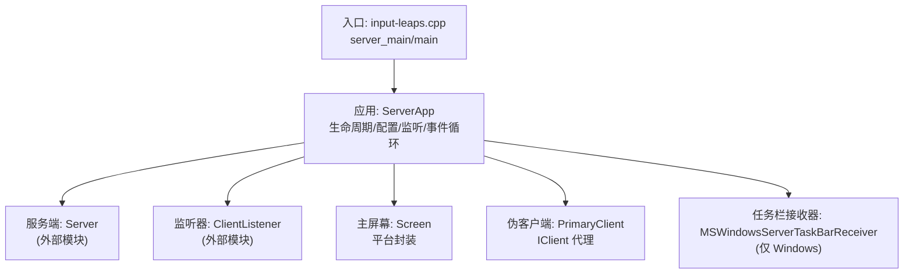
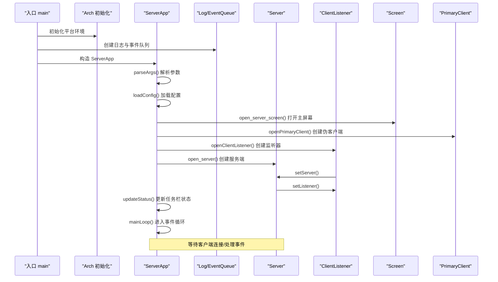
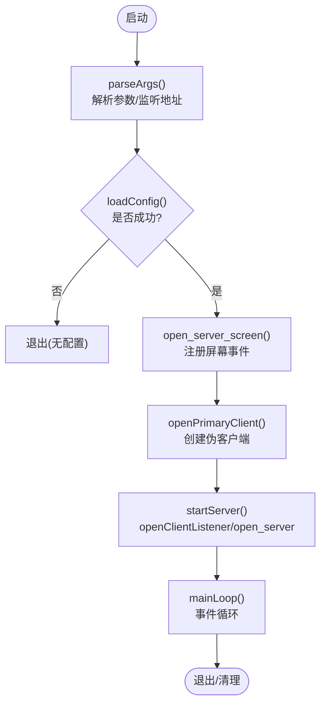
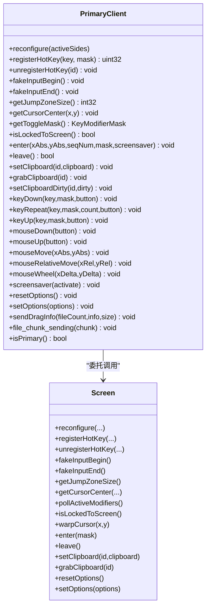
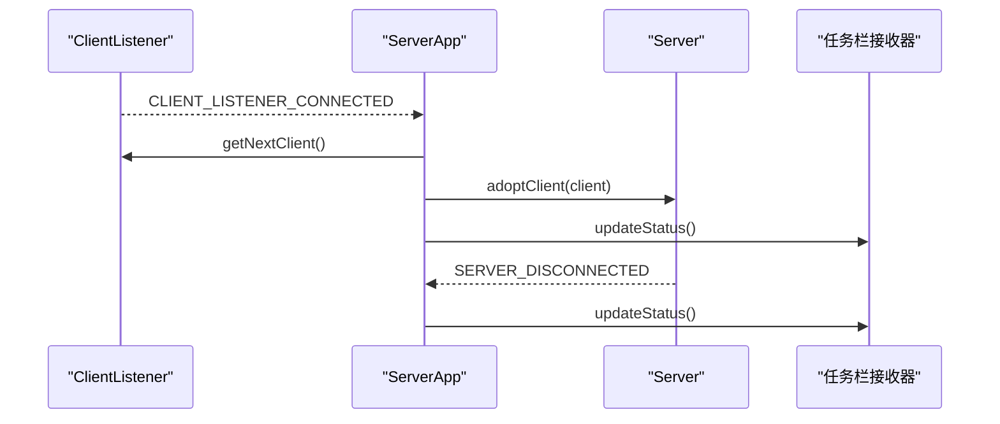
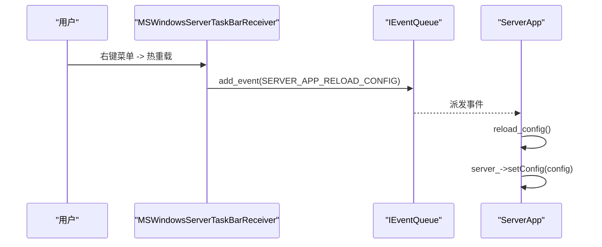
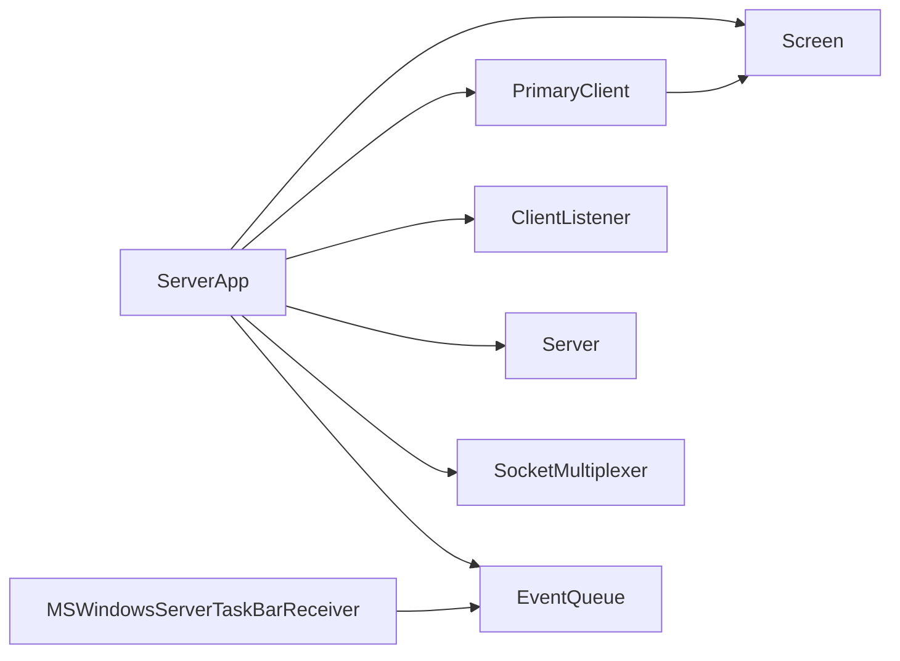

# 服务器模块

<cite>
**本文引用的文件**   
- [src/server/input-leaps.cpp](file://src/server/input-leaps.cpp)
- [src/lib/inputleap/ServerApp.h](file://src/lib/inputleap/ServerApp.h)
- [src/lib/inputleap/ServerApp.cpp](file://src/lib/inputleap/ServerApp.cpp)
- [src/lib/server/PrimaryClient.h](file://src/lib/server/PrimaryClient.h)
- [src/lib/server/PrimaryClient.cpp](file://src/lib/server/PrimaryClient.cpp)
- [src/server/MSWindowsServerTaskBarReceiver.h](file://src/server/MSWindowsServerTaskBarReceiver.h)
- [src/server/MSWindowsServerTaskBarReceiver.cpp](file://src/server/MSWindowsServerTaskBarReceiver.cpp)
</cite>

## 目录
1. [简介](#简介)
2. [项目结构](#项目结构)
3. [核心组件](#核心组件)
4. [架构总览](#架构总览)
5. [详细组件分析](#详细组件分析)
6. [依赖关系分析](#依赖关系分析)
7. [性能考虑](#性能考虑)
8. [故障排除指南](#故障排除指南)
9. [结论](#结论)
10. [附录](#附录)

## 简介
本技术文档聚焦于 Input Leap 的服务器模块，系统性阐述服务器应用的生命周期管理、客户端连接处理、输入事件分发机制与屏幕共享逻辑。重点解析 ServerApp 类的核心职责（初始化、配置加载、网络监听、事件循环），说明 PrimaryClient 如何作为“伪客户端”桥接主屏幕并管理与数据同步，同时介绍平台特定的任务栏集成实现（以 Windows 为例）。文档包含流程图与时序图，帮助读者理解启动流程、连接建立与事件转发路径，并提供性能调优建议与常见问题排查方法。

## 项目结构
服务器模块由入口程序、应用层控制器、核心服务与平台适配组成：
- 入口程序负责进程初始化、平台相关设置、日志与事件队列创建，并启动 ServerApp。
- ServerApp 承担参数解析、配置加载、屏幕与主客户端创建、服务端与监听器生命周期管理、事件循环与状态更新。
- PrimaryClient 作为“伪客户端”，将系统主屏幕抽象为 IClient 接口，供上层协议与服务使用。
- 平台任务栏接收器提供托盘图标、菜单与状态展示（Windows 示例）。

图示来源
- [src/server/input-leaps.cpp:34-63](file://src/server/input-leaps.cpp#L34-L63)
- [src/lib/inputleap/ServerApp.cpp:707-795](file://src/lib/inputleap/ServerApp.cpp#L707-L795)
- [src/lib/inputleap/ServerApp.cpp:640-673](file://src/lib/inputleap/ServerApp.cpp#L640-L673)
- [src/lib/server/PrimaryClient.cpp:27-41](file://src/lib/server/PrimaryClient.cpp#L27-L41)
- [src/server/MSWindowsServerTaskBarReceiver.cpp:43-63](file://src/server/MSWindowsServerTaskBarReceiver.cpp#L43-L63)

章节来源
- [src/server/input-leaps.cpp:34-63](file://src/server/input-leaps.cpp#L34-L63)
- [src/lib/inputleap/ServerApp.cpp:707-795](file://src/lib/inputleap/ServerApp.cpp#L707-L795)

## 核心组件
- ServerApp
  - 负责服务器应用的全生命周期：参数解析、配置加载、主屏幕与主客户端创建、监听器与服务端实例化、事件循环、状态更新与重试机制。
  - 关键能力包括：
    - 解析命令行参数与监听地址；
    - 按优先级加载配置文件；
    - 打开主屏幕并注册错误/挂起/恢复等事件；
    - 创建 PrimaryClient 作为本地主屏的 IClient 代理；
    - 创建 ClientListener 监听客户端连接；
    - 创建 Server 并绑定监听器；
    - 维护 EServerState 状态机，支持可重启模式下的定时重试；
    - 主事件循环中注入 IPC、热重载、强制重连、重置服务等事件处理。
- PrimaryClient
  - 继承自 BaseClientProxy，实现 IClient 接口，将系统主屏幕抽象为“伪客户端”。
  - 主要职责：
    - 转发鼠标移动到主屏幕光标定位；
    - 剪贴板脏标记与同步；
    - 热键注册/注销、跳区大小与光标中心查询；
    - fakeInputBegin/fakeInputEnd 嵌套计数，避免合成输入被误认为用户输入。
- MSWindowsServerTaskBarReceiver
  - Windows 平台任务栏集成，提供托盘图标、弹出菜单、状态对话框、日志复制、动态日志级别切换、热重载/强制重连/重置服务器等快捷操作。

章节来源
- [src/lib/inputleap/ServerApp.h:48-117](file://src/lib/inputleap/ServerApp.h#L48-L117)
- [src/lib/inputleap/ServerApp.cpp:88-110](file://src/lib/inputleap/ServerApp.cpp#L88-L110)
- [src/lib/inputleap/ServerApp.cpp:196-282](file://src/lib/inputleap/ServerApp.cpp#L196-L282)
- [src/lib/inputleap/ServerApp.cpp:454-504](file://src/lib/inputleap/ServerApp.cpp#L454-L504)
- [src/lib/inputleap/ServerApp.cpp:532-598](file://src/lib/inputleap/ServerApp.cpp#L532-L598)
- [src/lib/inputleap/ServerApp.cpp:640-673](file://src/lib/inputleap/ServerApp.cpp#L640-L673)
- [src/lib/inputleap/ServerApp.cpp:707-795](file://src/lib/inputleap/ServerApp.cpp#L707-L795)
- [src/lib/server/PrimaryClient.h:35-159](file://src/lib/server/PrimaryClient.h#L35-L159)
- [src/lib/server/PrimaryClient.cpp:27-41](file://src/lib/server/PrimaryClient.cpp#L27-L41)
- [src/lib/server/PrimaryClient.cpp:146-173](file://src/lib/server/PrimaryClient.cpp#L146-L173)
- [src/server/MSWindowsServerTaskBarReceiver.h:28-67](file://src/server/MSWindowsServerTaskBarReceiver.h#L28-L67)
- [src/server/MSWindowsServerTaskBarReceiver.cpp:43-63](file://src/server/MSWindowsServerTaskBarReceiver.cpp#L43-L63)

## 架构总览
下图展示了服务器启动与运行时的关键交互：入口程序初始化后，ServerApp 完成配置加载、屏幕与主客户端创建、监听器与服务端启动，随后进入事件循环处理客户端连接、屏幕事件与系统信号。

图示来源
- [src/server/input-leaps.cpp:34-63](file://src/server/input-leaps.cpp#L34-L63)
- [src/lib/inputleap/ServerApp.cpp:88-110](file://src/lib/inputleap/ServerApp.cpp#L88-L110)
- [src/lib/inputleap/ServerApp.cpp:196-282](file://src/lib/inputleap/ServerApp.cpp#L196-L282)
- [src/lib/inputleap/ServerApp.cpp:506-520](file://src/lib/inputleap/ServerApp.cpp#L506-L520)
- [src/lib/inputleap/ServerApp.cpp:609-614](file://src/lib/inputleap/ServerApp.cpp#L609-L614)
- [src/lib/inputleap/ServerApp.cpp:640-673](file://src/lib/inputleap/ServerApp.cpp#L640-L673)
- [src/lib/inputleap/ServerApp.cpp:707-795](file://src/lib/inputleap/ServerApp.cpp#L707-L795)

## 详细组件分析

### ServerApp 类分析
ServerApp 是服务器应用的核心控制器，贯穿从启动到关闭的完整生命周期。其关键流程如下：

- 参数解析与监听地址解析
  - 解析命令行参数，若指定监听地址则解析并 resolve；失败时退出。
- 配置加载
  - 优先使用显式配置文件路径；否则按用户配置目录与系统配置目录顺序尝试加载；未找到则退出。
- 主屏幕与主客户端
  - 打开主屏幕并注册错误、挂起、恢复事件；创建 PrimaryClient 作为本地主屏的 IClient 代理。
- 监听器与服务端
  - 根据配置的安全级别创建 TCP 监听器；创建 Server 并绑定监听器；记录启动信息并进入运行态。
- 事件循环
  - 初始化 SocketMultiplexer；确保至少有一个屏幕；设置默认监听地址；注册热重载、强制重连、重置服务器等事件；在 macOS 下与 Cocoa 事件循环协作；最终清理资源。

图示来源
- [src/lib/inputleap/ServerApp.cpp:88-110](file://src/lib/inputleap/ServerApp.cpp#L88-L110)
- [src/lib/inputleap/ServerApp.cpp:196-282](file://src/lib/inputleap/ServerApp.cpp#L196-L282)
- [src/lib/inputleap/ServerApp.cpp:506-520](file://src/lib/inputleap/ServerApp.cpp#L506-L520)
- [src/lib/inputleap/ServerApp.cpp:532-598](file://src/lib/inputleap/ServerApp.cpp#L532-L598)
- [src/lib/inputleap/ServerApp.cpp:707-795](file://src/lib/inputleap/ServerApp.cpp#L707-L795)

章节来源
- [src/lib/inputleap/ServerApp.cpp:88-110](file://src/lib/inputleap/ServerApp.cpp#L88-L110)
- [src/lib/inputleap/ServerApp.cpp:196-282](file://src/lib/inputleap/ServerApp.cpp#L196-L282)
- [src/lib/inputleap/ServerApp.cpp:454-504](file://src/lib/inputleap/ServerApp.cpp#L454-L504)
- [src/lib/inputleap/ServerApp.cpp:532-598](file://src/lib/inputleap/ServerApp.cpp#L532-L598)
- [src/lib/inputleap/ServerApp.cpp:640-673](file://src/lib/inputleap/ServerApp.cpp#L640-L673)
- [src/lib/inputleap/ServerApp.cpp:707-795](file://src/lib/inputleap/ServerApp.cpp#L707-L795)

### PrimaryClient 类分析
PrimaryClient 作为“伪客户端”，屏蔽了本地主屏幕与 IClient 接口之间的差异，使上层协议无需区分本地与远端。

- 剪贴板同步
  - 通过 m_clipboardDirty 数组跟踪各剪贴板槽位是否“脏”，仅在需要时写入主屏幕，避免重复写与冲突。
- 输入事件转发
  - 鼠标移动直接映射为主屏幕的光标位置；键盘/滚轮在 fakeInputBegin/fakeInputEnd 保护下忽略或按需转发。
- 屏幕属性访问
  - 暴露跳区大小、光标中心、当前修饰键状态、锁定状态等，便于上层决策。

图示来源
- [src/lib/server/PrimaryClient.h:35-159](file://src/lib/server/PrimaryClient.h#L35-L159)
- [src/lib/server/PrimaryClient.cpp:27-41](file://src/lib/server/PrimaryClient.cpp#L27-L41)
- [src/lib/server/PrimaryClient.cpp:146-173](file://src/lib/server/PrimaryClient.cpp#L146-L173)
- [src/lib/server/PrimaryClient.cpp:216-219](file://src/lib/server/PrimaryClient.cpp#L216-L219)

章节来源
- [src/lib/server/PrimaryClient.h:35-159](file://src/lib/server/PrimaryClient.h#L35-L159)
- [src/lib/server/PrimaryClient.cpp:27-41](file://src/lib/server/PrimaryClient.cpp#L27-L41)
- [src/lib/server/PrimaryClient.cpp:146-173](file://src/lib/server/PrimaryClient.cpp#L146-L173)
- [src/lib/server/PrimaryClient.cpp:216-219](file://src/lib/server/PrimaryClient.cpp#L216-L219)

### 客户端连接处理与事件分发
- 监听器连接回调
  - 当有新客户端连接时，监听器触发 CLIENT_LISTENER_CONNECTED 事件，ServerApp 获取下一个 ClientProxy 并交由 Server 接管，随后更新任务栏状态。
- 服务端断开回调
  - SERVER_DISCONNECTED 事件用于清理状态或提示无客户端。
- 屏幕事件
  - SCREEN_ERROR 导致退出；SCREEN_SUSPEND/SCREEN_RESUME 控制 stop/start 服务器。
- 屏幕切换脚本（X11）
  - SERVER_SCREEN_SWITCHED 事件触发执行外部脚本（如 X11 后端），传递新屏幕名称。

图示来源
- [src/lib/inputleap/ServerApp.cpp:291-298](file://src/lib/inputleap/ServerApp.cpp#L291-L298)
- [src/lib/inputleap/ServerApp.cpp:675-678](file://src/lib/inputleap/ServerApp.cpp#L675-L678)
- [src/lib/inputleap/ServerApp.cpp:616-620](file://src/lib/inputleap/ServerApp.cpp#L616-L620)
- [src/lib/inputleap/ServerApp.cpp:622-638](file://src/lib/inputleap/ServerApp.cpp#L622-L638)
- [src/lib/inputleap/ServerApp.cpp:680-705](file://src/lib/inputleap/ServerApp.cpp#L680-L705)

章节来源
- [src/lib/inputleap/ServerApp.cpp:291-298](file://src/lib/inputleap/ServerApp.cpp#L291-L298)
- [src/lib/inputleap/ServerApp.cpp:675-678](file://src/lib/inputleap/ServerApp.cpp#L675-L678)
- [src/lib/inputleap/ServerApp.cpp:616-620](file://src/lib/inputleap/ServerApp.cpp#L616-L620)
- [src/lib/inputleap/ServerApp.cpp:622-638](file://src/lib/inputleap/ServerApp.cpp#L622-L638)
- [src/lib/inputleap/ServerApp.cpp:680-705](file://src/lib/inputleap/ServerApp.cpp#L680-L705)

### 平台特定任务栏集成（Windows）
- 托盘图标与菜单
  - 根据服务器状态选择不同图标；右键菜单支持显示状态、复制日志、调整日志级别、热重载、强制重连、重置服务器、退出等。
- 状态窗口
  - 点击状态项弹出对话框，显示当前状态与已连接客户端列表；自动定位到鼠标附近。
- 事件联动
  - 菜单动作通过事件队列向 ServerApp 发送 SERVER_APP_RELOAD_CONFIG、SERVER_APP_FORCE_RECONNECT、SERVER_APP_RESET_SERVER 等事件，统一由 ServerApp 处理。

图示来源
- [src/server/MSWindowsServerTaskBarReceiver.cpp:158-237](file://src/server/MSWindowsServerTaskBarReceiver.cpp#L158-L237)
- [src/lib/inputleap/ServerApp.cpp:179-194](file://src/lib/inputleap/ServerApp.cpp#L179-L194)

章节来源
- [src/server/MSWindowsServerTaskBarReceiver.h:28-67](file://src/server/MSWindowsServerTaskBarReceiver.h#L28-L67)
- [src/server/MSWindowsServerTaskBarReceiver.cpp:43-63](file://src/server/MSWindowsServerTaskBarReceiver.cpp#L43-L63)
- [src/server/MSWindowsServerTaskBarReceiver.cpp:158-237](file://src/server/MSWindowsServerTaskBarReceiver.cpp#L158-L237)
- [src/lib/inputleap/ServerApp.cpp:179-194](file://src/lib/inputleap/ServerApp.cpp#L179-L194)

## 依赖关系分析
- 组件耦合
  - ServerApp 依赖 PlatformScreen、PrimaryClient、ClientListener、Server、SocketMultiplexer、EventQueue 等。
  - PrimaryClient 依赖 Screen 提供的底层平台能力。
  - Windows 任务栏接收器依赖 Win32 API 与事件队列。
- 外部依赖
  - 网络栈：TCPSocketFactory、SocketMultiplexer、NetworkAddress。
  - 平台：MSWindowsScreen/XWindowsScreen/OSXScreen/EiScreen（条件编译）。
  - 日志与事件：Log、BufferedLogOutputter、EventType。

图示来源
- [src/lib/inputleap/ServerApp.cpp:640-673](file://src/lib/inputleap/ServerApp.cpp#L640-L673)
- [src/lib/server/PrimaryClient.cpp:27-41](file://src/lib/server/PrimaryClient.cpp#L27-L41)
- [src/server/MSWindowsServerTaskBarReceiver.cpp:43-63](file://src/server/MSWindowsServerTaskBarReceiver.cpp#L43-L63)

章节来源
- [src/lib/inputleap/ServerApp.cpp:640-673](file://src/lib/inputleap/ServerApp.cpp#L640-L673)
- [src/lib/server/PrimaryClient.cpp:27-41](file://src/lib/server/PrimaryClient.cpp#L27-L41)
- [src/server/MSWindowsServerTaskBarReceiver.cpp:43-63](file://src/server/MSWindowsServerTaskBarReceiver.cpp#L43-L63)

## 性能考虑
- 事件循环与多路复用
  - 使用 SocketMultiplexer 统一管理套接字事件，减少线程上下文切换开销。
- 重试与退避
  - 在屏幕不可用或端口占用等情况下采用定时器重试，避免忙轮询；合理设置重试间隔以降低 CPU 占用。
- 日志级别
  - 生产环境建议降低日志级别，避免频繁 IO；调试时可开启 DEBUG2 以启用平台屏幕日志包装器进行细粒度追踪。
- 剪贴板同步
  - PrimaryClient 通过脏标记避免重复写入剪贴板，减少不必要的系统调用。
- 屏幕事件处理
  - 对 SCREEN_ERROR 快速退出，避免无效工作；对 SUSPEND/RESUME 及时停止/重启服务器，节省资源。

[本节为通用性能指导，不直接分析具体文件]

## 故障排除指南
- 无法监听端口
  - 现象：启动时报“cannot listen for clients”。
  - 排查：检查端口占用、防火墙规则、IPv4/IPv6 地址族配置；确认监听地址解析正确。
- 主屏幕不可用
  - 现象：启动时报“primary screen unavailable”。
  - 排查：确认图形会话可用、权限足够；若可重启模式，观察定时器重试是否生效。
- 配置加载失败
  - 现象：启动时报“no configuration available”。
  - 排查：检查配置文件路径与权限；确认用户目录与系统目录中的配置文件存在且格式正确。
- 屏幕错误导致退出
  - 现象：运行中突然退出。
  - 排查：查看 SCREEN_ERROR 事件触发原因；必要时提升日志级别至 DEBUG2 以捕获更多细节。
- 任务栏菜单无效
  - 现象：热重载/强制重连/重置服务器无响应。
  - 排查：确认事件是否正确投递到 ServerApp；检查对应事件处理器是否注册。

章节来源
- [src/lib/inputleap/ServerApp.cpp:572-582](file://src/lib/inputleap/ServerApp.cpp#L572-L582)
- [src/lib/inputleap/ServerApp.cpp:473-488](file://src/lib/inputleap/ServerApp.cpp#L473-L488)
- [src/lib/inputleap/ServerApp.cpp:252-256](file://src/lib/inputleap/ServerApp.cpp#L252-L256)
- [src/lib/inputleap/ServerApp.cpp:616-620](file://src/lib/inputleap/ServerApp.cpp#L616-L620)
- [src/server/MSWindowsServerTaskBarReceiver.cpp:158-237](file://src/server/MSWindowsServerTaskBarReceiver.cpp#L158-L237)

## 结论
ServerApp 作为服务器模块的核心，串联了配置、屏幕、网络与事件子系统，提供了健壮的生命周期管理与可观测性。PrimaryClient 将本地主屏抽象为 IClient，简化了协议层的实现。Windows 任务栏接收器增强了用户体验与运维便捷性。通过合理的性能优化与故障排除策略，可在多平台环境下稳定高效地共享输入设备。

[本节为总结性内容，不直接分析具体文件]

## 附录
- 代码片段路径参考（不含代码内容）
  - 服务器启动流程
    - [入口与初始化:34-63](file://src/server/input-leaps.cpp#L34-L63)
    - [参数解析与监听地址:88-110](file://src/lib/inputleap/ServerApp.cpp#L88-L110)
    - [配置加载:196-282](file://src/lib/inputleap/ServerApp.cpp#L196-L282)
    - [主屏幕与主客户端:506-520](file://src/lib/inputleap/ServerApp.cpp#L506-L520), [file://src/lib/inputleap/ServerApp.cpp#L609-L614]
    - [监听器与服务端:640-673](file://src/lib/inputleap/ServerApp.cpp#L640-L673)
    - [事件循环:707-795](file://src/lib/inputleap/ServerApp.cpp#L707-L795)
  - 客户端连接处理
    - [连接回调:291-298](file://src/lib/inputleap/ServerApp.cpp#L291-L298)
    - [断开回调:675-678](file://src/lib/inputleap/ServerApp.cpp#L675-L678)
  - 事件分发机制
    - [屏幕错误/挂起/恢复:616-638](file://src/lib/inputleap/ServerApp.cpp#L616-L638)
    - [屏幕切换脚本:680-705](file://src/lib/inputleap/ServerApp.cpp#L680-L705)
  - 任务栏集成（Windows）
    - [构造函数与注册:43-63](file://src/server/MSWindowsServerTaskBarReceiver.cpp#L43-L63)
    - [菜单与事件派发:158-237](file://src/server/MSWindowsServerTaskBarReceiver.cpp#L158-L237)