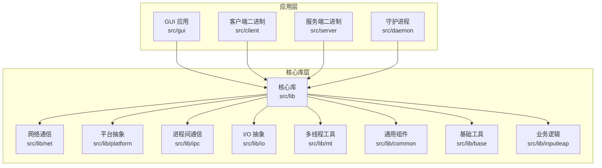
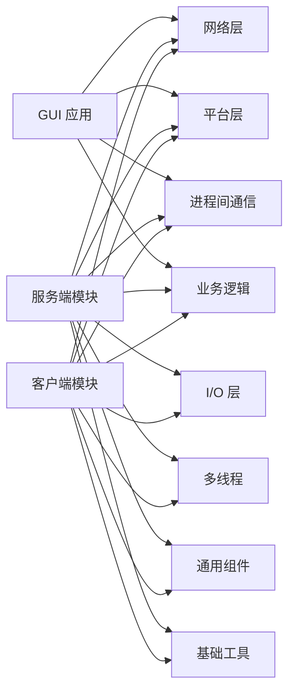
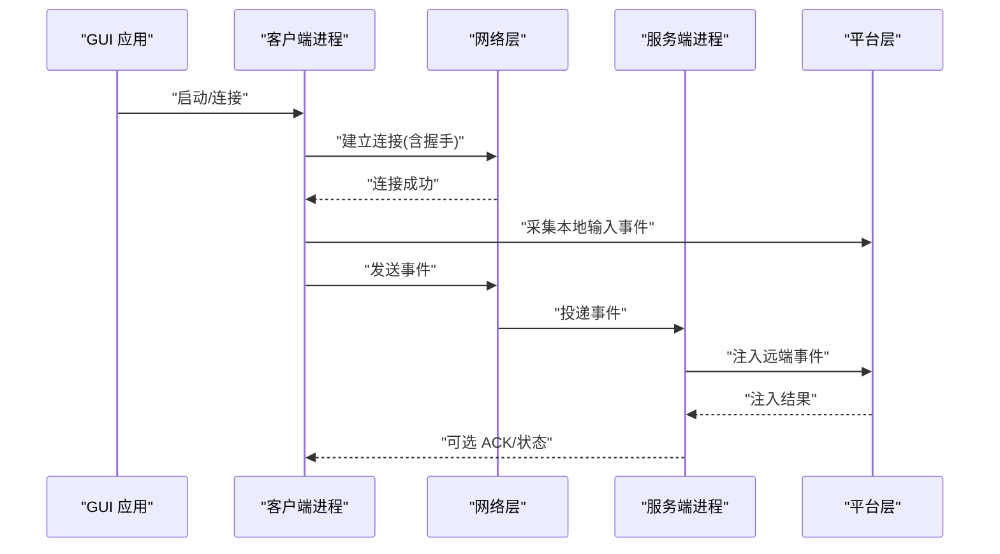

# 核心模块

<cite>
**本文引用的文件**   
- [README.md](file://README.md)
- [CMakeLists.txt](file://CMakeLists.txt)
- [src/CMakeLists.txt](file://src/CMakeLists.txt)
- [src/lib/CMakeLists.txt](file://src/lib/CMakeLists.txt)
- [src/client/input-leapc.cpp](file://src/client/input-leapc.cpp)
- [src/server/input-leaps.cpp](file://src/server/input-leaps.cpp)
- [src/daemon/input-leapd.cpp](file://src/daemon/input-leapd.cpp)
- [src/gui/src/main.cpp](file://src/gui/src/main.cpp)
- [src/gui/src/AppConfig.h](file://src/gui/src/AppConfig.h)
- [src/gui/src/BaseConfig.h](file://src/gui/src/BaseConfig.h)
- [src/gui/src/ServerConfig.h](file://src/gui/src/ServerConfig.h)
- [src/gui/src/Ipc.h](file://src/gui/src/Ipc.h)
- [src/gui/src/IpcClient.h](file://src/gui/src/IpcClient.h)
- [src/gui/src/ZeroconfBrowser.h](file://src/gui/src/ZeroconfBrowser.h)
- [src/gui/src/ZeroconfRegister.h](file://src/gui/src/ZeroconfRegister.h)
- [src/gui/src/ZeroconfService.h](file://src/gui/src/ZeroconfService.h)
- [doc/input-leap.conf.example](file://doc/input-leap.conf.example)
</cite>

## 目录
1. [简介](#简介)
2. [项目结构](#项目结构)
3. [核心组件](#核心组件)
4. [架构总览](#架构总览)
5. [详细组件分析](#详细组件分析)
6. [依赖关系分析](#依赖关系分析)
7. [性能考虑](#性能考虑)
8. [故障排查指南](#故障排查指南)
9. [结论](#结论)
10. [附录](#附录)

## 简介
Input Leap 是一款跨平台的“KVM 切换器”软件，允许用户通过单一键盘和鼠标控制多台计算机。其核心能力包括：
- 将输入事件（键盘、鼠标）从服务器端转发到客户端
- 可选的剪贴板共享（Linux/Wayland 下受限）
- 基于网络的多机协作与自动发现（Bonjour/Zeroconf）
- 图形化配置与管理界面

本技术文档聚焦于 Input Leap 的核心模块：服务器模块、客户端模块、平台抽象层、网络通信层与配置管理系统，解释职责边界、接口定义、内部工作机制、依赖关系与通信协议，并提供性能调优建议与最佳实践。

章节来源
- [README.md:10-60](file://README.md#L10-L60)

## 项目结构
仓库采用分层与按功能域组织相结合的结构：
- src/client：客户端可执行入口与平台相关集成（如 Windows 任务栏接收器）
- src/server：服务端可执行入口与平台相关集成
- src/daemon：守护进程入口（用于系统服务场景）
- src/gui：Qt 图形界面，负责配置、连接管理、零配置发现等
- src/lib：核心库（包含 client、server、net、platform、ipc、io、mt、base、common、inputleap 等子模块）
- doc：示例配置文件与手册页
- ext：第三方依赖（gtest、filesystem）

图表来源
- [CMakeLists.txt:1-200](file://CMakeLists.txt#L1-L200)
- [src/CMakeLists.txt:1-200](file://src/CMakeLists.txt#L1-L200)
- [src/lib/CMakeLists.txt:1-200](file://src/lib/CMakeLists.txt#L1-L200)

章节来源
- [CMakeLists.txt:1-200](file://CMakeLists.txt#L1-L200)
- [src/CMakeLists.txt:1-200](file://src/CMakeLists.txt#L1-L200)
- [src/lib/CMakeLists.txt:1-200](file://src/lib/CMakeLists.txt#L1-L200)

## 核心组件
本节概述各核心模块的职责与边界：
- 服务器模块（server）：监听输入事件，维护屏幕布局与焦点策略，向客户端转发输入事件；可选提供剪贴板共享。
- 客户端模块（client）：连接至服务器，上报本地输入事件，接收并注入远端输入事件；可选同步剪贴板。
- 平台抽象层（platform）：屏蔽操作系统差异，统一暴露输入采集、事件注入、剪贴板访问、屏幕几何等能力。
- 网络通信层（net）：实现跨主机传输，处理连接建立、消息编解码、安全握手（可选）、重连与心跳。
- 配置管理系统（config）：解析与持久化配置（文件名、屏幕布局、选项），支持命令行参数与 GUI 编辑。

章节来源
- [README.md:48-60](file://README.md#L48-L60)
- [doc/input-leap.conf.example:1-200](file://doc/input-leap.conf.example#L1-L200)

## 架构总览
下图展示了从 GUI 到核心库、再到平台与网络的调用路径，以及客户端与服务端的交互流程。

```mermaid
graph TB
subgraph "GUI"
GMain["主程序<br/>src/gui/src/main.cpp"]
GAppCfg["应用配置<br/>src/gui/src/AppConfig.h"]
GBaseCfg["基础配置<br/>src/gui/src/BaseConfig.h"]
GServerCfg["服务器配置<br/>src/gui/src/ServerConfig.h"]
GIpc["IPC 接口<br/>src/gui/src/Ipc.h"]
GIpcCli["IPC 客户端<br/>src/gui/src/IpcClient.h"]
GZeroB["零配置浏览器<br/>src/gui/src/ZeroconfBrowser.h"]
GZeroR["零配置注册<br/>src/gui/src/ZeroconfRegister.h"]
GZeroS["零配置服务<br/>src/gui/src/ZeroconfService.h"]
end
subgraph "核心库"
LNet["网络层<br/>src/lib/net"]
LPlat["平台层<br/>src/lib/platform"]
LIPC["进程间通信<br/>src/lib/ipc"]
LIO["I/O 层<br/>src/lib/io"]
LMT["多线程<br/>src/lib/mt"]
LCommon["通用<br/>src/lib/common"]
LBase["基础<br/>src/lib/base"]
LIL["业务逻辑<br/>src/lib/inputleap"]
end
subgraph "进程"
CBin["客户端进程<br/>src/client/input-leapc.cpp"]
SBin["服务端进程<br/>src/server/input-leaps.cpp"]
DBin["守护进程<br/>src/daemon/input-leapd.cpp"]
end
GMain --> GAppCfg
GMain --> GBaseCfg
GMain --> GServerCfg
GMain --> GIpc
GMain --> GIpcCli
GMain --> GZeroB
GMain --> GZeroR
GMain --> GZeroS
GIpc --> LIPC
GIpcCli --> LIPC
CBin --> LNet
CBin --> LPlat
CBin --> LIO
CBin --> LMT
CBin --> LCommon
CBin --> LBase
CBin --> LIL
SBin --> LNet
SBin --> LPlat
SBin --> LIO
SBin --> LMT
SBin --> LCommon
SBin --> LBase
SBin --> LIL
DBin --> LNet
DBin --> LPlat
DBin --> LIO
DBin --> LMT
DBin --> LCommon
DBin --> LBase
DBin --> LIL
```

图表来源
- [src/gui/src/main.cpp:1-200](file://src/gui/src/main.cpp#L1-L200)
- [src/gui/src/AppConfig.h:1-200](file://src/gui/src/AppConfig.h#L1-L200)
- [src/gui/src/BaseConfig.h:1-200](file://src/gui/src/BaseConfig.h#L1-L200)
- [src/gui/src/ServerConfig.h:1-200](file://src/gui/src/ServerConfig.h#L1-L200)
- [src/gui/src/Ipc.h:1-200](file://src/gui/src/Ipc.h#L1-L200)
- [src/gui/src/IpcClient.h:1-200](file://src/gui/src/IpcClient.h#L1-L200)
- [src/gui/src/ZeroconfBrowser.h:1-200](file://src/gui/src/ZeroconfBrowser.h#L1-L200)
- [src/gui/src/ZeroconfRegister.h:1-200](file://src/gui/src/ZeroconfRegister.h#L1-L200)
- [src/gui/src/ZeroconfService.h:1-200](file://src/gui/src/ZeroconfService.h#L1-L200)
- [src/client/input-leapc.cpp:1-200](file://src/client/input-leapc.cpp#L1-L200)
- [src/server/input-leaps.cpp:1-200](file://src/server/input-leaps.cpp#L1-L200)
- [src/daemon/input-leapd.cpp:1-200](file://src/daemon/input-leapd.cpp#L1-L200)

## 详细组件分析

### 服务器模块（Server）
职责边界
- 监听并收集本地输入事件（键盘、鼠标、剪贴板）
- 根据屏幕布局与焦点策略决定目标客户端
- 通过网络将输入事件序列化后发送给对应客户端
- 可选地接收客户端剪贴板数据并写入本地剪贴板

关键机制
- 事件队列与调度：使用线程池或事件循环对输入事件进行去抖、合并与顺序保证
- 屏幕布局与焦点：维护虚拟屏幕拓扑，计算光标跨越边界的切换逻辑
- 连接管理：多客户端并发连接、断线重连、资源清理
- 安全通道：可选 TLS 握手与证书校验（由网络层封装）

扩展点
- 自定义输入过滤规则（例如忽略特定组合键）
- 自定义焦点策略（例如延迟切换、阈值调整）

章节来源
- [src/server/input-leaps.cpp:1-200](file://src/server/input-leaps.cpp#L1-L200)
- [src/lib/CMakeLists.txt:1-200](file://src/lib/CMakeLists.txt#L1-L200)

### 客户端模块（Client）
职责边界
- 连接至服务器，认证与保活
- 上报本地输入事件
- 接收并注入远端输入事件到本地系统
- 可选同步剪贴板内容

关键机制
- 连接生命周期：DNS 解析、TCP/TLS 握手、心跳检测、指数退避重连
- 事件注入：平台抽象层将网络事件转换为原生输入事件
- 剪贴板同步：增量比较与编码压缩，避免重复传输

扩展点
- 自定义注入策略（例如延迟注入、事件过滤）
- 自定义认证方式（在安全握手阶段扩展）

章节来源
- [src/client/input-leapc.cpp:1-200](file://src/client/input-leapc.cpp#L1-L200)
- [src/lib/CMakeLists.txt:1-200](file://src/lib/CMakeLists.txt#L1-L200)

### 平台抽象层（Platform）
职责边界
- 屏蔽操作系统差异，统一暴露以下能力：
  - 输入采集（键盘、鼠标）
  - 事件注入（键盘、鼠标、滚轮）
  - 剪贴板读写
  - 屏幕几何与 DPI 信息
  - 系统服务/权限提升（Windows UAC、macOS 辅助功能）

关键机制
- 条件编译与运行时探测：根据目标平台选择具体实现
- 资源管理：句柄、回调、线程安全的事件队列
- 错误传播：统一的错误码与异常包装

扩展点
- 新增平台支持需实现统一接口
- 针对特定平台优化事件注入路径

章节来源
- [src/lib/CMakeLists.txt:1-200](file://src/lib/CMakeLists.txt#L1-L200)

### 网络通信层（Network）
职责边界
- 连接建立与销毁
- 消息编解码（输入事件、剪贴板数据、控制命令）
- 安全握手（TLS、指纹校验）
- 心跳与超时、重连策略
- 流量控制与背压

关键机制
- 异步 I/O：非阻塞 socket、事件驱动模型
- 序列化格式：紧凑二进制或 JSON（视版本与配置而定）
- 可靠性：序列号、ACK/NACK、丢包重传（可选）

扩展点
- 替换底层传输（例如 QUIC）
- 增加新的消息类型（如远程显示帧）

章节来源
- [src/lib/CMakeLists.txt:1-200](file://src/lib/CMakeLists.txt#L1-L200)

### 配置管理系统（Configuration）
职责边界
- 解析配置文件（INI 风格）
- 提供默认值与校验
- 持久化保存与热重载（可选）
- 与 GUI 双向绑定

关键机制
- 配置项分组：options、screens、actions 等
- 环境变量与命令行覆盖优先级
- 模板与示例配置（doc 目录下）

扩展点
- 新增配置项需更新解析器与校验逻辑
- 支持动态加载外部配置源（如远程配置中心）

章节来源
- [doc/input-leap.conf.example:1-200](file://doc/input-leap.conf.example#L1-L200)
- [src/gui/src/AppConfig.h:1-200](file://src/gui/src/AppConfig.h#L1-L200)
- [src/gui/src/BaseConfig.h:1-200](file://src/gui/src/BaseConfig.h#L1-L200)
- [src/gui/src/ServerConfig.h:1-200](file://src/gui/src/ServerConfig.h#L1-L200)

### GUI 与零配置发现（Zeroconf/Bonjour）
职责边界
- 提供可视化配置界面
- 管理本地进程状态（启动/停止/重启）
- 自动发现局域网中的服务器/客户端
- 通过 IPC 与后台进程通信

关键机制
- Zeroconf 广播与订阅：服务注册、服务浏览、记录解析
- IPC 通道：本地套接字或命名管道，发送控制指令与日志
- 配置导出/导入：生成标准配置文件

章节来源
- [src/gui/src/main.cpp:1-200](file://src/gui/src/main.cpp#L1-L200)
- [src/gui/src/Ipc.h:1-200](file://src/gui/src/Ipc.h#L1-L200)
- [src/gui/src/IpcClient.h:1-200](file://src/gui/src/IpcClient.h#L1-L200)
- [src/gui/src/ZeroconfBrowser.h:1-200](file://src/gui/src/ZeroconfBrowser.h#L1-L200)
- [src/gui/src/ZeroconfRegister.h:1-200](file://src/gui/src/ZeroconfRegister.h#L1-L200)
- [src/gui/src/ZeroconfService.h:1-200](file://src/gui/src/ZeroconfService.h#L1-L200)

### 进程入口与运行模式
- 客户端进程：初始化网络与平台层，加载配置，连接服务器，进入事件循环
- 服务端进程：初始化平台层，加载配置，监听端口，接受客户端连接，进入事件循环
- 守护进程：以系统服务形式运行，具备自启动、日志输出、信号处理等能力

章节来源
- [src/client/input-leapc.cpp:1-200](file://src/client/input-leapc.cpp#L1-L200)
- [src/server/input-leaps.cpp:1-200](file://src/server/input-leaps.cpp#L1-L200)
- [src/daemon/input-leapd.cpp:1-200](file://src/daemon/input-leapd.cpp#L1-L200)

## 依赖关系分析
核心库与各模块之间的依赖关系如下：

图表来源
- [src/lib/CMakeLists.txt:1-200](file://src/lib/CMakeLists.txt#L1-L200)
- [src/client/input-leapc.cpp:1-200](file://src/client/input-leapc.cpp#L1-L200)
- [src/server/input-leaps.cpp:1-200](file://src/server/input-leaps.cpp#L1-L200)
- [src/gui/src/main.cpp:1-200](file://src/gui/src/main.cpp#L1-L200)

章节来源
- [src/lib/CMakeLists.txt:1-200](file://src/lib/CMakeLists.txt#L1-L200)

## 性能考虑
- 事件批处理与去抖：在高频率输入场景下合并相邻事件，降低网络与注入开销
- 非阻塞 I/O 与事件循环：避免阻塞主线程，提高吞吐与响应性
- 内存与缓冲区：合理设置收发缓冲区大小，避免频繁分配与拷贝
- 压缩与编码：对剪贴板大对象启用压缩，减少带宽占用
- 重连与心跳：指数退避与最大重试次数，防止雪崩效应
- 平台注入优化：批量注入、最小化系统调用次数

[本节为通用指导，不直接分析具体文件]

## 故障排查指南
常见问题与定位思路：
- 无法连接服务器：检查防火墙、端口占用、TLS 证书与主机名匹配
- 输入无响应：确认平台注入权限（辅助功能/管理员权限），查看事件队列是否堵塞
- 剪贴板不同步：确认两端均启用剪贴板共享，检查编码与大小限制
- 自动发现失败：验证 Bonjour/Zeroconf 服务是否可用，检查组播/广播策略

章节来源
- [README.md:132-157](file://README.md#L132-L157)

## 结论
Input Leap 的核心模块围绕“输入事件采集—网络传输—平台注入”的主链路构建，辅以配置管理与 GUI 工具链，形成跨平台、可扩展的 KVM 切换方案。通过清晰的职责划分与模块化设计，开发者可在平台抽象层、网络层与业务逻辑层分别进行扩展与优化，以满足不同部署环境与性能需求。

[本节为总结性内容，不直接分析具体文件]

## 附录

### 配置选项速览（节选）
以下为常见配置项类别与用途说明（完整示例见 doc 目录）：
- options：全局选项（如服务器主机名、端口、剪贴板开关、调试级别）
- screens：屏幕名称与布局（用于焦点切换）
- actions：按键动作映射（可选）

章节来源
- [doc/input-leap.conf.example:1-200](file://doc/input-leap.conf.example#L1-L200)

### 典型交互时序（客户端连接与事件转发）

图表来源
- [src/client/input-leapc.cpp:1-200](file://src/client/input-leapc.cpp#L1-L200)
- [src/server/input-leaps.cpp:1-200](file://src/server/input-leaps.cpp#L1-L200)
- [src/gui/src/main.cpp:1-200](file://src/gui/src/main.cpp#L1-L200)