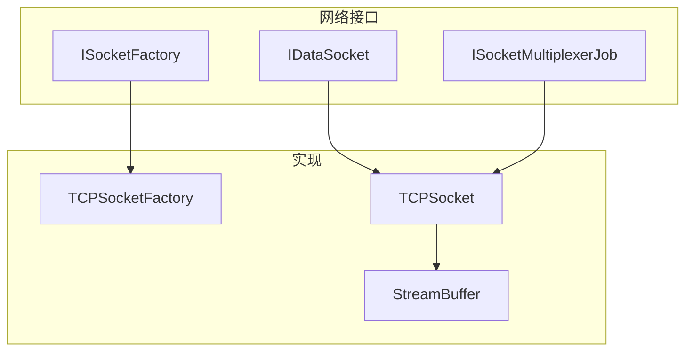
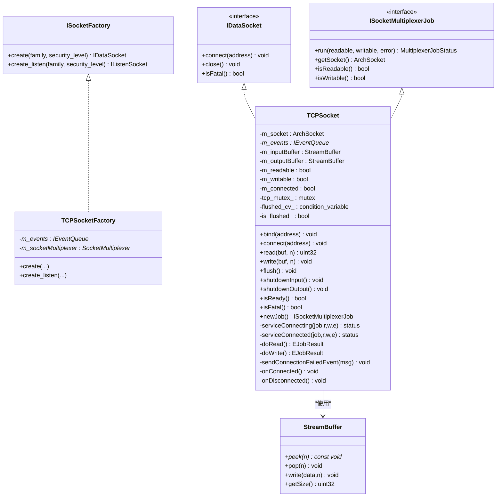
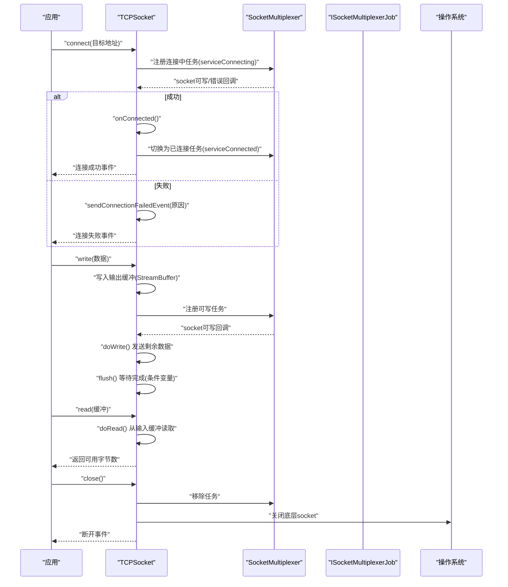
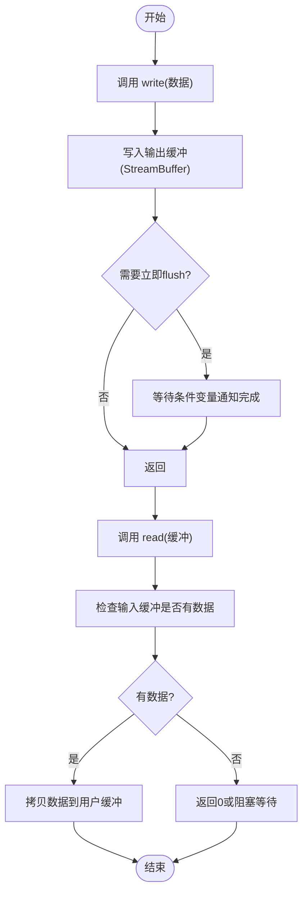
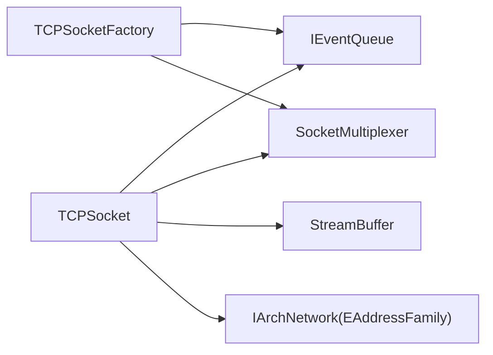

# TCP连接管理

<cite>
**本文引用的文件**   
- [TCPSocket.h](file://src/lib/net/TCPSocket.h)
- [TCPSocketFactory.h](file://src/lib/net/TCPSocketFactory.h)
- [IDataSocket.h](file://src/lib/net/IDataSocket.h)
- [ISocketFactory.h](file://src/lib/net/ISocketFactory.h)
- [ISocketMultiplexerJob.h](file://src/lib/net/ISocketMultiplexerJob.h)
- [StreamBuffer.h](file://src/lib/io/StreamBuffer.h)
</cite>

## 目录
1. [简介](#简介)
2. [项目结构](#项目结构)
3. [核心组件](#核心组件)
4. [架构总览](#架构总览)
5. [详细组件分析](#详细组件分析)
6. [依赖关系分析](#依赖关系分析)
7. [性能考虑](#性能考虑)
8. [故障排查指南](#故障排查指南)
9. [结论](#结论)
10. [附录](#附录)

## 简介
本技术文档聚焦 Input Leap 的 TCP 连接管理组件，围绕 TCPSocket 类展开，系统阐述其网络连接建立、维护与断开流程；说明网络地址解析、端口绑定与事件驱动模型；解释异步 I/O、事件循环与超时处理策略；并提供客户端连接、服务器监听、数据收发与连接清理的使用要点。同时给出异常处理、重连机制与连接状态管理的建议，以及缓冲区大小调优、并发连接限制和网络资源管理等性能优化实践。

## 项目结构
TCP 连接管理相关代码位于 src/lib/net 与 src/lib/io 目录中，采用接口抽象与多路复用任务模式组织：
- 接口层：定义数据流套接字、工厂与多路复用任务的统一契约
- 实现层：TCPSocket 提供基于平台 ArchSocket 的 TCP 能力
- 缓冲层：StreamBuffer 提供高效 FIFO 字节缓冲

图表来源
- [ISocketFactory.h:1-49](file://src/lib/net/ISocketFactory.h#L1-L49)
- [IDataSocket.h:1-70](file://src/lib/net/IDataSocket.h#L1-L70)
- [ISocketMultiplexerJob.h:1-95](file://src/lib/net/ISocketMultiplexerJob.h#L1-L95)
- [TCPSocketFactory.h:1-49](file://src/lib/net/TCPSocketFactory.h#L1-L49)
- [TCPSocket.h:1-117](file://src/lib/net/TCPSocket.h#L1-L117)
- [StreamBuffer.h:1-80](file://src/lib/io/StreamBuffer.h#L1-L80)

章节来源
- [TCPSocket.h:1-117](file://src/lib/net/TCPSocket.h#L1-L117)
- [TCPSocketFactory.h:1-49](file://src/lib/net/TCPSocketFactory.h#L1-L49)
- [IDataSocket.h:1-70](file://src/lib/net/IDataSocket.h#L1-L70)
- [ISocketFactory.h:1-49](file://src/lib/net/ISocketFactory.h#L1-L49)
- [ISocketMultiplexerJob.h:1-95](file://src/lib/net/ISocketMultiplexerJob.h#L1-L95)
- [StreamBuffer.h:1-80](file://src/lib/io/StreamBuffer.h#L1-L80)

## 核心组件
- TCPSocket：实现 IDataSocket 与 EventTarget，封装底层 ArchSocket，负责连接建立、读写、关闭、事件派发与多路复用任务切换。内部维护输入输出 StreamBuffer，并通过条件变量协调 flush 完成通知。
- TCPSocketFactory：实现 ISocketFactory，用于创建数据套接字与监听套接字实例，注入事件队列与 SocketMultiplexer。
- ISocketMultiplexerJob：多路复用任务接口，由 SocketMultiplexer 在可读/可写/错误时调度 run()，返回是否继续服务及是否需要替换为新任务。
- StreamBuffer：高效的 FIFO 字节缓冲，支持 peek/pop/write/getSize，作为读写缓冲的核心数据结构。

章节来源
- [TCPSocket.h:39-114](file://src/lib/net/TCPSocket.h#L39-L114)
- [TCPSocketFactory.h:28-46](file://src/lib/net/TCPSocketFactory.h#L28-L46)
- [ISocketMultiplexerJob.h:28-92](file://src/lib/net/ISocketMultiplexerJob.h#L28-L92)
- [StreamBuffer.h:29-79](file://src/lib/io/StreamBuffer.h#L29-L79)

## 架构总览
TCPSocket 通过 ISocketMultiplexerJob 接入 SocketMultiplexer 的事件循环，以非阻塞方式处理连接生命周期与数据 I/O。工厂模式解耦了具体套接字类型的创建过程，便于扩展与安全级别控制。

图表来源
- [ISocketFactory.h:1-49](file://src/lib/net/ISocketFactory.h#L1-L49)
- [TCPSocketFactory.h:1-49](file://src/lib/net/TCPSocketFactory.h#L1-L49)
- [ISocketMultiplexerJob.h:1-95](file://src/lib/net/ISocketMultiplexerJob.h#L1-L95)
- [IDataSocket.h:1-70](file://src/lib/net/IDataSocket.h#L1-L70)
- [TCPSocket.h:1-117](file://src/lib/net/TCPSocket.h#L1-L117)
- [StreamBuffer.h:1-80](file://src/lib/io/StreamBuffer.h#L1-L80)

## 详细组件分析

### TCPSocket 连接生命周期与事件模型
- 连接建立
  - 调用 connect(address) 发起非阻塞连接，注册为“连接中”任务（serviceConnecting）。
  - 当 SocketMultiplexer 报告可写或错误时，进入 onConnected 或 sendConnectionFailedEvent。
  - 成功后切换到“已连接”任务（serviceConnected），并触发连接成功事件。
- 数据收发
  - doRead/doWrite 分别处理读/写，结合 isReadable/isWritable 兴趣位，将实际 I/O 结果写入/弹出 StreamBuffer。
  - write 追加到输出缓冲，flush 等待所有数据落盘后通过条件变量通知。
- 关闭与清理
  - close 释放 socket、移除任务、清空缓冲、重置状态。
  - shutdownInput/shutdownOutput 分别关闭单向通道。
- 事件派发
  - 继承 EventTarget，发送连接失败、连接成功、断开等事件给上层。

图表来源
- [TCPSocket.h:61-99](file://src/lib/net/TCPSocket.h#L61-L99)
- [ISocketMultiplexerJob.h:42-92](file://src/lib/net/ISocketMultiplexerJob.h#L42-L92)

章节来源
- [TCPSocket.h:39-114](file://src/lib/net/TCPSocket.h#L39-L114)
- [ISocketMultiplexerJob.h:28-92](file://src/lib/net/ISocketMultiplexerJob.h#L28-L92)

### 异步 I/O、事件循环与超时处理
- 异步 I/O：TCPSocket 通过 newJob 生成 ISocketMultiplexerJob 任务，交由 SocketMultiplexer 在多路复用事件循环中调度。
- 事件循环：SocketMultiplexer 根据可读/可写/错误信号调用 job.run()，TCPSocket 据此执行 serviceConnecting/serviceConnected。
- 超时处理：当前头文件中未直接暴露超时配置字段；建议在更高层（如业务逻辑或包装器）设置定时器，在连接建立阶段检测长时间未完成的状态并触发重试或失败回调。

章节来源
- [TCPSocket.h:64-99](file://src/lib/net/TCPSocket.h#L64-L99)
- [ISocketMultiplexerJob.h:42-92](file://src/lib/net/ISocketMultiplexerJob.h#L42-L92)

### 网络地址解析、端口绑定与监听
- 地址族选择：构造函数接受 EAddressFamily，决定 IPv4/IPv6。
- 端口绑定：bind(NetworkAddress) 用于服务端监听前的本地地址绑定。
- 监听套接字：通过 TCPSocketFactory::create_listen 创建监听套接字，配合 SocketMultiplexer 接受新连接。

章节来源
- [TCPSocket.h:41-46](file://src/lib/net/TCPSocket.h#L41-L46)
- [TCPSocketFactory.h:39-41](file://src/lib/net/TCPSocketFactory.h#L39-L41)

### 连接池管理机制
- 当前接口未内置连接池；可在上层维护一组 TCPSocket 实例，按负载策略分配与回收。
- 建议：
  - 使用工厂批量创建并缓存空闲连接
  - 记录连接状态与最后使用时间，定期清理闲置连接
  - 对高并发场景引入限流与背压，避免过多活跃连接导致资源耗尽

[本节为概念性内容，不直接分析具体文件]

### 数据发送与接收流程
- 发送：write 将数据追加至输出缓冲；当 socket 可写时，doWrite 尝试发送剩余数据；flush 等待全部写出并通知调用者。
- 接收：read 从输入缓冲取出可用数据；当 socket 可读时，doRead 填充输入缓冲。

图表来源
- [TCPSocket.h:51-58](file://src/lib/net/TCPSocket.h#L51-L58)
- [StreamBuffer.h:43-66](file://src/lib/io/StreamBuffer.h#L43-L66)

章节来源
- [TCPSocket.h:51-58](file://src/lib/net/TCPSocket.h#L51-L58)
- [StreamBuffer.h:29-79](file://src/lib/io/StreamBuffer.h#L29-L79)

### 连接状态管理与异常处理
- 状态字段：m_readable/m_writable/m_connected 反映当前就绪性与连接状态。
- 异常路径：连接失败通过 sendConnectionFailedEvent 上报；断开通过 onDisconnected 清理资源。
- 致命错误：isFatal 标识不可恢复的错误，上层应据此进行重连或告警。

章节来源
- [TCPSocket.h:101-114](file://src/lib/net/TCPSocket.h#L101-L114)
- [IDataSocket.h:35-67](file://src/lib/net/IDataSocket.h#L35-L67)

### 重连机制建议
- 在应用层维护重连策略：指数退避、最大重试次数、健康检查。
- 监听连接失败事件，触发自动重连；在重连前清理旧资源，避免句柄泄漏。
- 对关键业务增加心跳与超时检测，快速发现半开连接。

[本节为概念性内容，不直接分析具体文件]

## 依赖关系分析
- 耦合关系
  - TCPSocket 依赖 IEventQueue 进行事件派发，依赖 SocketMultiplexer 进行事件调度，依赖 StreamBuffer 进行缓冲管理。
  - TCPSocketFactory 依赖 IEventQueue 与 SocketMultiplexer 以构造正确的上下文。
- 外部依赖
  - 平台网络抽象 IArchNetwork::EAddressFamily 与 ArchSocket，屏蔽跨平台差异。
- 潜在循环依赖
  - 通过 ISocketMultiplexerJob 接口解耦，避免直接与 SocketMultiplexer 强耦合。

图表来源
- [TCPSocket.h:41-42](file://src/lib/net/TCPSocket.h#L41-L42)
- [TCPSocketFactory.h:31-32](file://src/lib/net/TCPSocketFactory.h#L31-L32)
- [ISocketMultiplexerJob.h:74-88](file://src/lib/net/ISocketMultiplexerJob.h#L74-L88)

章节来源
- [TCPSocket.h:41-42](file://src/lib/net/TCPSocket.h#L41-L42)
- [TCPSocketFactory.h:31-32](file://src/lib/net/TCPSocketFactory.h#L31-L32)
- [ISocketMultiplexerJob.h:74-88](file://src/lib/net/ISocketMultiplexerJob.h#L74-L88)

## 性能考虑
- 缓冲区大小调优
  - 合理设置 StreamBuffer 块大小与初始容量，减少内存碎片与拷贝次数。
  - 针对大消息场景，增大单次发送量以降低系统调用开销。
- 并发连接限制
  - 在上层实现连接池与并发上限，避免过多活跃连接导致文件描述符耗尽。
  - 结合 SocketMultiplexer 的负载情况动态调整新建连接速率。
- 网络资源管理
  - 及时 close 与 removeJob，确保资源释放。
  - 使用 shutdownInput/shutdownOutput 精细控制半关闭，提升吞吐。
- I/O 合并与零拷贝
  - 尽量批量写入，减少多次小写调用。
  - 利用 StreamBuffer 的 peek 能力，避免不必要的复制。

[本节为通用性能指导，不直接分析具体文件]

## 故障排查指南
- 常见问题定位
  - 连接失败：检查 sendConnectionFailedEvent 的原因信息，确认地址解析与端口可达性。
  - 读写卡住：确认 isReady 与 isFatal 状态，检查输入/输出缓冲是否为空或过大。
  - 资源泄漏：验证 close 是否被调用，removeJob 是否执行。
- 调试建议
  - 在 serviceConnecting/serviceConnected 入口打印状态转换日志。
  - 监控 flush 等待时间，识别慢网络或远端无消费导致的积压。
  - 对异常路径添加断点，观察条件变量唤醒时机。

章节来源
- [TCPSocket.h:91-99](file://src/lib/net/TCPSocket.h#L91-L99)
- [TCPSocket.h:101-114](file://src/lib/net/TCPSocket.h#L101-L114)

## 结论
TCPSocket 通过接口抽象与多路复用任务模式，实现了高性能、可扩展的 TCP 连接管理。结合工厂模式与事件驱动模型，能够灵活适配不同安全级别与平台特性。上层可通过连接池、重连策略与超时检测进一步提升鲁棒性与可用性。在性能方面，重点在于缓冲大小调优、并发限制与资源管理。

## 附录
- 使用要点示例（路径引用）
  - 客户端连接建立：参考 connect 方法与连接事件处理
    - [TCPSocket.h:61-99](file://src/lib/net/TCPSocket.h#L61-L99)
  - 服务器监听与接受：参考 bind 与 create_listen
    - [TCPSocket.h:46-47](file://src/lib/net/TCPSocket.h#L46-L47)
    - [TCPSocketFactory.h:39-41](file://src/lib/net/TCPSocketFactory.h#L39-L41)
  - 数据发送与接收：参考 write/read/flush 与 doRead/doWrite
    - [TCPSocket.h:51-58](file://src/lib/net/TCPSocket.h#L51-L58)
  - 连接清理：参考 close/shutdownInput/shutdownOutput
    - [TCPSocket.h:47-55](file://src/lib/net/TCPSocket.h#L47-L55)