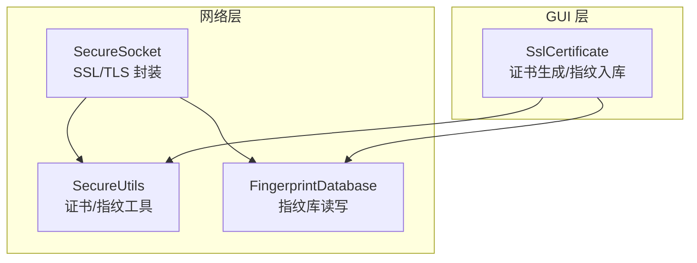
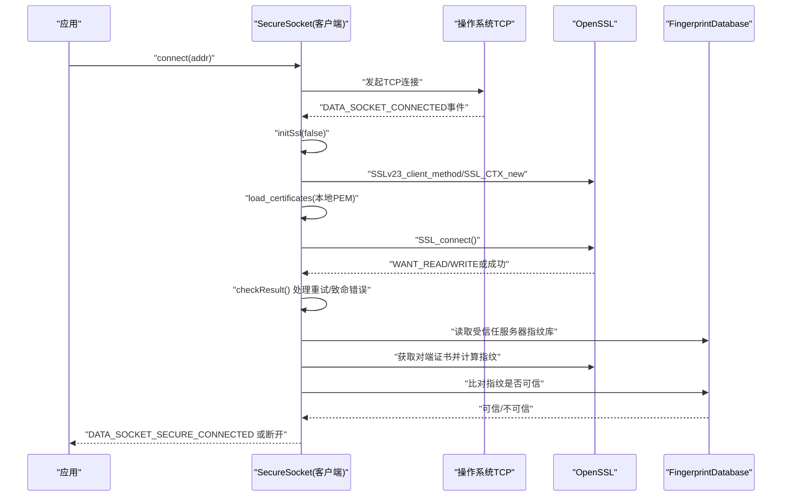
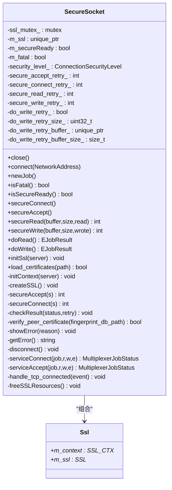
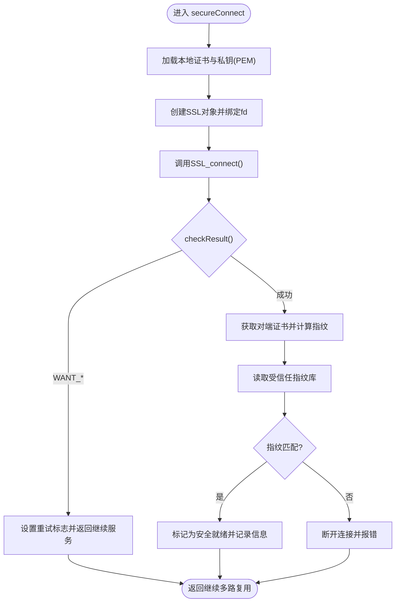
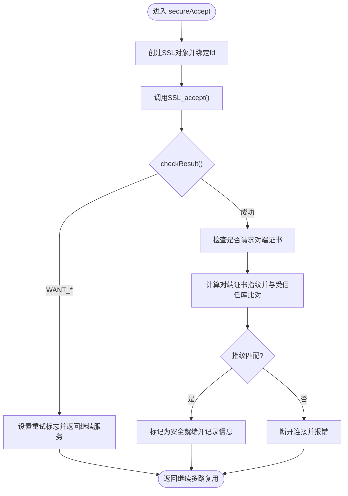
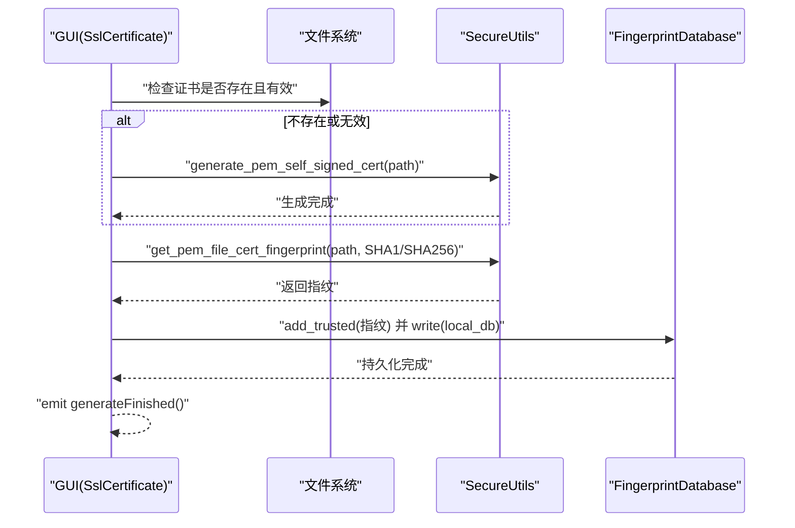
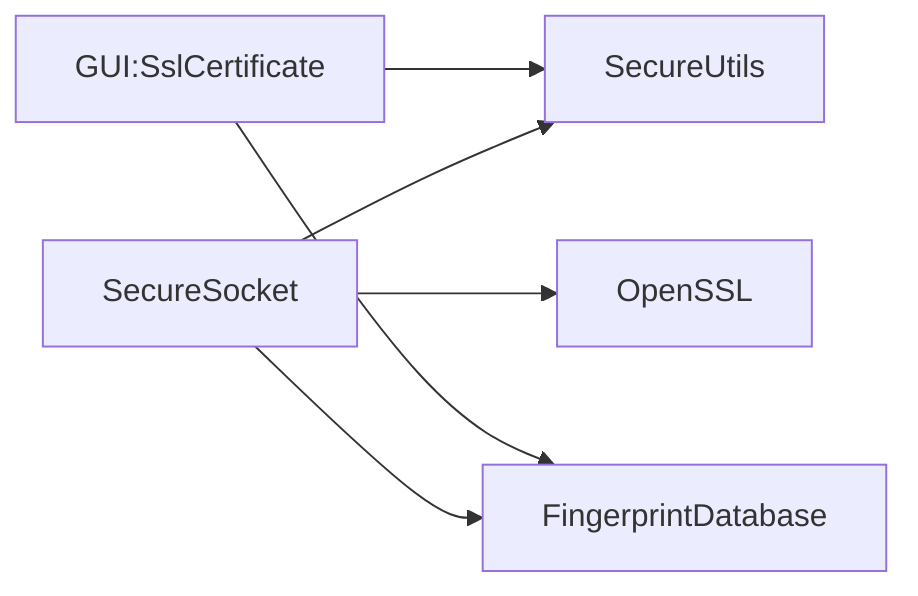

# 安全套接字连接

<cite>
**本文引用的文件**   
- [SecureSocket.h](file://src/lib/net/SecureSocket.h)
- [SecureSocket.cpp](file://src/lib/net/SecureSocket.cpp)
- [SecureUtils.h](file://src/lib/net/SecureUtils.h)
- [SecureUtils.cpp](file://src/lib/net/SecureUtils.cpp)
- [FingerprintDatabase.h](file://src/lib/net/FingerprintDatabase.h)
- [FingerprintDatabase.cpp](file://src/lib/net/FingerprintDatabase.cpp)
- [SslCertificate.h](file://src/gui/src/SslCertificate.h)
- [SslCertificate.cpp](file://src/gui/src/SslCertificate.cpp)
</cite>

## 目录
1. [简介](#简介)
2. [项目结构](#项目结构)
3. [核心组件](#核心组件)
4. [架构总览](#架构总览)
5. [详细组件分析](#详细组件分析)
6. [依赖关系分析](#依赖关系分析)
7. [性能考虑](#性能考虑)
8. [故障排查指南](#故障排查指南)
9. [结论](#结论)
10. [附录](#附录)

## 简介
本文件面向 Input Leap 的安全套接字连接组件，聚焦 SecureSocket 类的 SSL/TLS 加密实现。内容涵盖：
- OpenSSL 集成方式、上下文与会话生命周期管理
- 证书加载（PEM）、指纹计算与信任库校验
- 握手流程（客户端与服务端）及错误处理
- 自签名证书生成与 GUI 集成
- 密码套件与协议版本策略、连接复用与池化建议
- 网络安全最佳实践

## 项目结构
与安全套接字相关的代码主要分布在网络层与 GUI 层：
- 网络层：SecureSocket（TLS 封装）、SecureUtils（证书与指纹工具）、FingerprintDatabase（指纹数据库读写）
- GUI 层：SslCertificate（证书生成与指纹入库）

图表来源
- [SecureSocket.cpp:311-406](file://src/lib/net/SecureSocket.cpp#L311-L406)
- [SecureUtils.cpp:155-212](file://src/lib/net/SecureUtils.cpp#L155-L212)
- [FingerprintDatabase.cpp:26-38](file://src/lib/net/FingerprintDatabase.cpp#L26-L38)
- [SslCertificate.cpp:39-84](file://src/gui/src/SslCertificate.cpp#L39-L84)

章节来源
- [SecureSocket.h:35-111](file://src/lib/net/SecureSocket.h#L35-L111)
- [SecureSocket.cpp:1-116](file://src/lib/net/SecureSocket.cpp#L1-L116)

## 核心组件
- SecureSocket：基于 TCPSocket 的 TLS 封装，负责 SSL_CTX/SSL 对象创建、握手、I/O 重试、错误处理、证书加载与指纹验证。
- SecureUtils：提供 PEM 证书解析、指纹计算（SHA1/SHA256）、随机图生成、自签名证书生成等工具函数。
- FingerprintDatabase：以 v2 格式存储算法名与十六进制指纹数据，支持读取、写入、去重与匹配。
- SslCertificate（GUI）：在用户界面中触发证书生成、校验与指纹入库，便于非技术用户完成初始配置。

章节来源
- [SecureSocket.h:35-111](file://src/lib/net/SecureSocket.h#L35-L111)
- [SecureSocket.cpp:311-406](file://src/lib/net/SecureSocket.cpp#L311-L406)
- [SecureUtils.h:28-38](file://src/lib/net/SecureUtils.h#L28-L38)
- [SecureUtils.cpp:117-153](file://src/lib/net/SecureUtils.cpp#L117-L153)
- [FingerprintDatabase.h:28-48](file://src/lib/net/FingerprintDatabase.h#L28-L48)
- [FingerprintDatabase.cpp:77-89](file://src/lib/net/FingerprintDatabase.cpp#L77-L89)
- [SslCertificate.h:24-43](file://src/gui/src/SslCertificate.h#L24-L43)
- [SslCertificate.cpp:39-84](file://src/gui/src/SslCertificate.cpp#L39-L84)

## 架构总览
下图展示了客户端与服务端建立安全连接的端到端流程，包括 TCP 连接、TLS 初始化、握手、证书加载与指纹校验。

图表来源
- [SecureSocket.cpp:110-116](file://src/lib/net/SecureSocket.cpp#L110-L116)
- [SecureSocket.cpp:311-406](file://src/lib/net/SecureSocket.cpp#L311-L406)
- [SecureSocket.cpp:484-536](file://src/lib/net/SecureSocket.cpp#L484-L536)
- [SecureSocket.cpp:656-709](file://src/lib/net/SecureSocket.cpp#L656-L709)
- [FingerprintDatabase.cpp:26-38](file://src/lib/net/FingerprintDatabase.cpp#L26-L38)

## 详细组件分析

### SecureSocket 类设计
- 继承自 TCPSocket，扩展了 TLS 能力；内部持有 SSL_CTX 与 SSL 指针，使用互斥锁保护并发访问。
- 关键职责：
  - 初始化 OpenSSL 库与上下文（禁用 SSLv3，选择兼容方法）
  - 加载本地证书与私钥（PEM），校验一致性
  - 执行握手（客户端 connect / 服务端 accept）
  - 统一错误处理与重试（WANT_READ/WRITE/CONNECT/ACCEPT）
  - 证书指纹校验（对比受信任指纹库）
  - I/O 循环中的安全读/写封装

图表来源
- [SecureSocket.h:35-111](file://src/lib/net/SecureSocket.h#L35-L111)
- [SecureSocket.cpp:51-54](file://src/lib/net/SecureSocket.cpp#L51-L54)

章节来源
- [SecureSocket.h:35-111](file://src/lib/net/SecureSocket.h#L35-L111)
- [SecureSocket.cpp:93-107](file://src/lib/net/SecureSocket.cpp#L93-L107)
- [SecureSocket.cpp:539-620](file://src/lib/net/SecureSocket.cpp#L539-L620)

#### 握手与连接建立流程（客户端）

图表来源
- [SecureSocket.cpp:484-536](file://src/lib/net/SecureSocket.cpp#L484-L536)
- [SecureSocket.cpp:539-620](file://src/lib/net/SecureSocket.cpp#L539-L620)
- [SecureSocket.cpp:656-709](file://src/lib/net/SecureSocket.cpp#L656-L709)

章节来源
- [SecureSocket.cpp:484-536](file://src/lib/net/SecureSocket.cpp#L484-L536)
- [SecureSocket.cpp:539-620](file://src/lib/net/SecureSocket.cpp#L539-L620)

#### 握手与连接建立流程（服务端）

图表来源
- [SecureSocket.cpp:422-481](file://src/lib/net/SecureSocket.cpp#L422-L481)
- [SecureSocket.cpp:539-620](file://src/lib/net/SecureSocket.cpp#L539-L620)
- [SecureSocket.cpp:656-709](file://src/lib/net/SecureSocket.cpp#L656-L709)

章节来源
- [SecureSocket.cpp:422-481](file://src/lib/net/SecureSocket.cpp#L422-L481)
- [SecureSocket.cpp:539-620](file://src/lib/net/SecureSocket.cpp#L539-L620)

#### 证书加载与校验
- 加载过程：从指定路径加载 PEM 格式的证书与私钥，并进行私钥一致性校验。
- 失败处理：若任一步骤失败，记录错误并返回失败状态。
- 注意：该过程会获取互斥锁，避免与握手/IO并发冲突。

章节来源
- [SecureSocket.cpp:319-354](file://src/lib/net/SecureSocket.cpp#L319-L354)

#### 指纹计算与信任库比对
- 指纹算法：支持 SHA1 与 SHA256。
- 数据来源：从对端证书计算指纹，或从本地 PEM 文件计算指纹。
- 信任库：FingerprintDatabase 以 v2 格式存储“算法:十六进制数据”，支持读取、写入与去重匹配。

章节来源
- [SecureUtils.cpp:117-153](file://src/lib/net/SecureUtils.cpp#L117-L153)
- [FingerprintDatabase.cpp:91-133](file://src/lib/net/FingerprintDatabase.cpp#L91-L133)
- [SecureSocket.cpp:656-709](file://src/lib/net/SecureSocket.cpp#L656-L709)

#### OpenSSL 集成与协议/密码套件策略
- 协议版本：通过 SSLv23_method 启用 TLS 兼容模式，显式禁用 SSLv3。
- 密码套件：未显式限制，采用 OpenSSL 默认套件；可通过日志输出当前协商套件与双方候选列表用于诊断。
- 会话复用：代码未显式启用会话缓存/重用；如需提升性能可结合 OpenSSL 会话缓存机制进行扩展。

章节来源
- [SecureSocket.cpp:362-406](file://src/lib/net/SecureSocket.cpp#L362-L406)
- [SecureSocket.cpp:804-834](file://src/lib/net/SecureSocket.cpp#L804-L834)

#### 错误处理与重试
- checkResult 统一处理 SSL_ERROR_WANT_* 等非致命情况，设置重试标志；对零返回、系统调用错误、通用 SSL 错误等标记致命并断开。
- doRead/doWrite 根据 isSecureReady 与返回值决定重试、新数据或中断。

章节来源
- [SecureSocket.cpp:539-620](file://src/lib/net/SecureSocket.cpp#L539-L620)
- [SecureSocket.cpp:145-249](file://src/lib/net/SecureSocket.cpp#L145-L249)

### GUI 证书管理集成
- 功能：在 GUI 中一键生成自签名证书（RSA 2048，有效期一年），并自动计算指纹写入本地受信任库。
- 校验：生成前尝试读取现有证书并校验公钥类型与长度，不满足则重新生成。
- 交互：通过信号槽上报错误、信息与完成事件。

图表来源
- [SslCertificate.cpp:39-84](file://src/gui/src/SslCertificate.cpp#L39-L84)
- [SecureUtils.cpp:155-212](file://src/lib/net/SecureUtils.cpp#L155-L212)
- [FingerprintDatabase.cpp:26-38](file://src/lib/net/FingerprintDatabase.cpp#L26-L38)

章节来源
- [SslCertificate.cpp:39-84](file://src/gui/src/SslCertificate.cpp#L39-L84)
- [SslCertificate.cpp:86-126](file://src/gui/src/SslCertificate.cpp#L86-L126)

## 依赖关系分析
- SecureSocket 依赖：
  - OpenSSL（SSL_CTX/SSL/X509/EVP 等）
  - SecureUtils（证书指纹计算、自签名生成）
  - FingerprintDatabase（指纹库读写与匹配）
  - 平台网络抽象（ArchSocket/TCPSocket）
- GUI 依赖：
  - SecureUtils（生成证书、计算指纹）
  - FingerprintDatabase（写入本地受信任库）

图表来源
- [SecureSocket.cpp:18-31](file://src/lib/net/SecureSocket.cpp#L18-L31)
- [SecureUtils.cpp:46-58](file://src/lib/net/SecureUtils.cpp#L46-L58)
- [FingerprintDatabase.cpp:18-23](file://src/lib/net/FingerprintDatabase.cpp#L18-L23)
- [SslCertificate.cpp:18-29](file://src/gui/src/SslCertificate.cpp#L18-L29)

章节来源
- [SecureSocket.cpp:18-31](file://src/lib/net/SecureSocket.cpp#L18-L31)
- [SecureUtils.cpp:46-58](file://src/lib/net/SecureUtils.cpp#L46-L58)
- [FingerprintDatabase.cpp:18-23](file://src/lib/net/FingerprintDatabase.cpp#L18-L23)
- [SslCertificate.cpp:18-29](file://src/gui/src/SslCertificate.cpp#L18-L29)

## 性能考虑
- 握手阶段：
  - 当前实现未显式启用会话缓存/重用，可在服务端启用 SSL_CTX_set_session_cache_mode 与相关缓存 API 以提升重复连接性能。
- I/O 缓冲：
  - doRead/doWrite 使用固定大小缓冲区与输入上限，避免内存膨胀；可按业务调整 MAX_INPUT_BUFFER_SIZE。
- 日志开销：
  - 调试级别日志包含密码套件与库信息，生产环境应降低日志级别以减少开销。
- 线程模型：
  - 所有 SSL 操作均受 ssl_mutex_ 保护，确保多线程安全；在高并发场景下需评估锁粒度与上下文复用。

[本节为通用指导，无需特定文件引用]

## 故障排查指南
- 常见错误分类与定位：
  - WANT_READ/WRITE/CONNECT/ACCEPT：握手未完成，属于正常重试分支，检查网络与对端状态。
  - ZERO_RETURN：对端关闭连接，检查远端进程健康。
  - SYSCALL/SSL：底层系统错误或通用 SSL 错误，查看 getError() 输出的具体错误码与原因。
- 证书相关问题：
  - 无法加载证书/私钥：确认路径存在、权限正确、PEM 格式有效。
  - 私钥不一致：load_certificates 会校验私钥与证书匹配性。
  - 指纹不匹配：核对受信任指纹库内容与对端实际证书指纹一致。
- 日志线索：
  - showSecureLibInfo/showSecureCipherInfo/showSecureConnectInfo 可用于诊断 OpenSSL 版本、可用套件与最终协商结果。

章节来源
- [SecureSocket.cpp:539-620](file://src/lib/net/SecureSocket.cpp#L539-L620)
- [SecureSocket.cpp:319-354](file://src/lib/net/SecureSocket.cpp#L319-L354)
- [SecureSocket.cpp:804-860](file://src/lib/net/SecureSocket.cpp#L804-L860)

## 结论
SecureSocket 将 OpenSSL 的复杂握手与错误处理封装为易用接口，并通过指纹校验替代传统 CA 链验证，适合内网或点对点场景快速部署。配合 GUI 的证书生成与指纹入库，显著降低了运维门槛。在生产环境中，建议结合会话复用、严格的密码套件策略与完善的监控告警，进一步提升安全性与性能。

[本节为总结性内容，无需特定文件引用]

## 附录

### 安全连接建立示例（路径指引）
- 客户端连接与握手：
  - [SecureSocket.cpp:110-116](file://src/lib/net/SecureSocket.cpp#L110-L116)
  - [SecureSocket.cpp:484-536](file://src/lib/net/SecureSocket.cpp#L484-L536)
- 服务端接受与握手：
  - [SecureSocket.cpp:422-481](file://src/lib/net/SecureSocket.cpp#L422-L481)
- 证书加载与校验：
  - [SecureSocket.cpp:319-354](file://src/lib/net/SecureSocket.cpp#L319-L354)
- 指纹计算与信任库比对：
  - [SecureUtils.cpp:117-153](file://src/lib/net/SecureUtils.cpp#L117-L153)
  - [FingerprintDatabase.cpp:77-89](file://src/lib/net/FingerprintDatabase.cpp#L77-L89)
- GUI 生成证书与指纹入库：
  - [SslCertificate.cpp:39-84](file://src/gui/src/SslCertificate.cpp#L39-L84)

### 网络安全最佳实践
- 密码套件与协议版本：
  - 明确禁用过时协议（如 SSLv3），在服务端显式限制允许的密码套件集合，优先选择 AEAD 套件与现代椭圆曲线算法。
- 会话复用：
  - 启用会话缓存/会话票证，减少握手开销；注意密钥轮换时的失效策略。
- 连接池管理：
  - 复用已握手的 SSL 连接，控制最大空闲时间与最大连接数，避免资源泄露。
- 证书与指纹：
  - 定期轮换证书与指纹，最小化受信任库范围；对指纹变更进行人工确认与审计。
- 监控与告警：
  - 记录握手失败、证书不匹配、密码套件降级等关键事件，纳入集中日志与告警体系。

[本节为通用指导，无需特定文件引用]