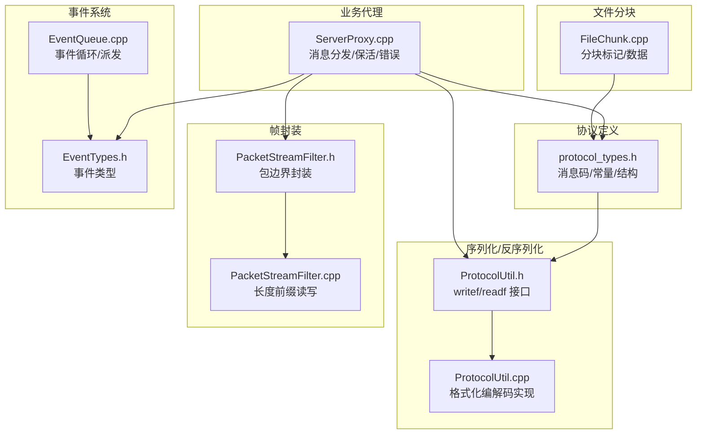
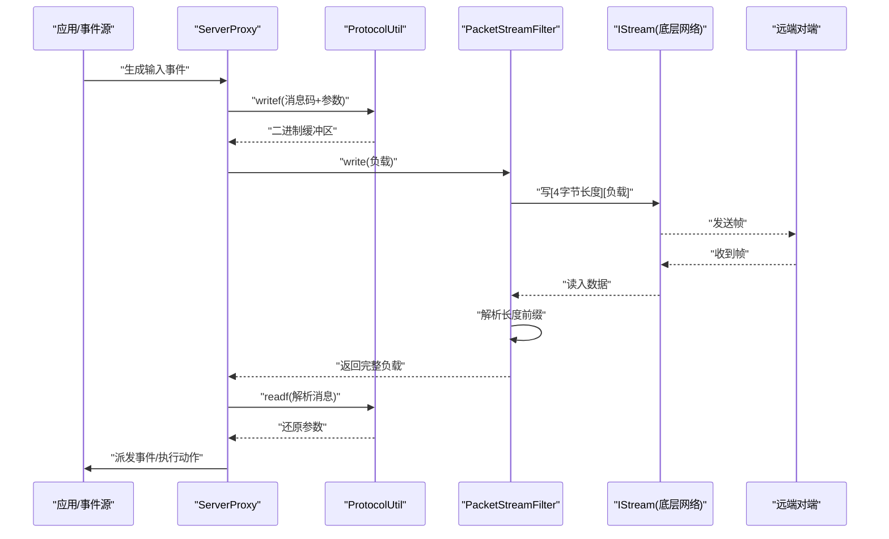
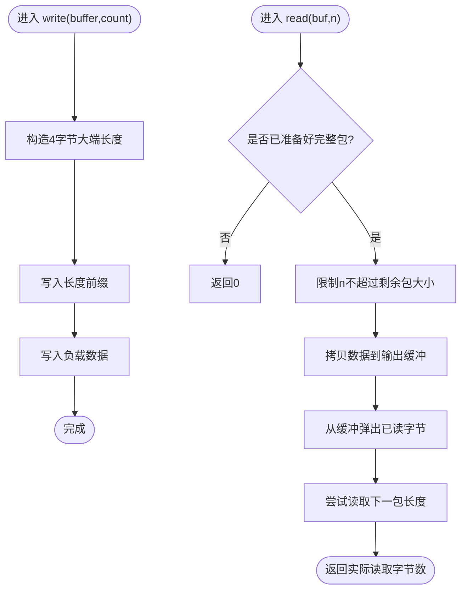
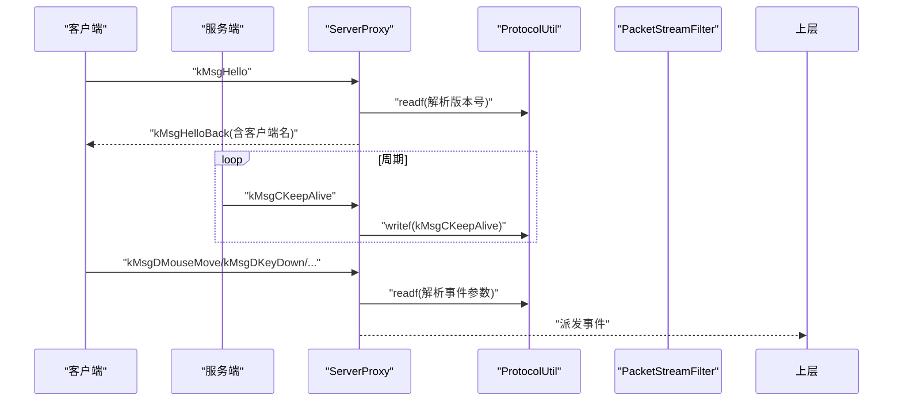
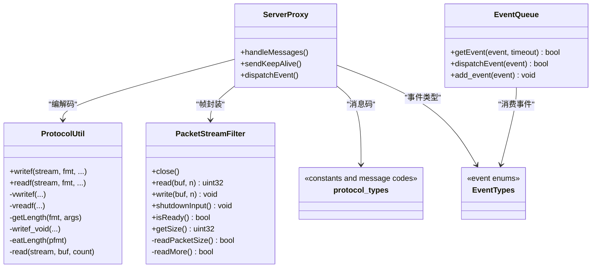

# 数据传输协议

<cite>
**本文引用的文件**
- [protocol_types.h](file://src/lib/inputleap/protocol_types.h)
- [ProtocolUtil.h](file://src/lib/inputleap/ProtocolUtil.h)
- [ProtocolUtil.cpp](file://src/lib/inputleap/ProtocolUtil.cpp)
- [PacketStreamFilter.h](file://src/lib/inputleap/PacketStreamFilter.h)
- [PacketStreamFilter.cpp](file://src/lib/inputleap/PacketStreamFilter.cpp)
- [FileChunk.cpp](file://src/lib/inputleap/FileChunk.cpp)
- [ServerProxy.cpp](file://src/lib/client/ServerProxy.cpp)
- [EventTypes.h](file://src/lib/base/EventTypes.h)
- [EventQueue.cpp](file://src/lib/base/EventQueue.cpp)
</cite>

## 目录
1. [简介](#简介)
2. [项目结构](#项目结构)
3. [核心组件](#核心组件)
4. [架构总览](#架构总览)
5. [详细组件分析](#详细组件分析)
6. [依赖关系分析](#依赖关系分析)
7. [性能与流量控制](#性能与流量控制)
8. [故障排查指南](#故障排查指南)
9. [结论](#结论)
10. [附录：协议扩展与兼容性](#附录协议扩展与兼容性)

## 简介
本文件面向 Input Leap 的数据传输协议组件，聚焦输入事件在客户端与服务端之间的二进制序列化、数据包结构与帧协议设计。文档覆盖以下要点：
- 事件类型定义、字段编码与长度前缀格式
- 流式数据传输、分块传输（文件）与保活机制
- 流量控制与错误处理
- 协议版本与向后兼容策略
- 协议扩展指南与演进最佳实践

## 项目结构
与数据传输协议直接相关的代码主要位于 lib/inputleap 与 client/server 侧的代理层，配合基础事件队列与网络过滤层实现端到端的数据面。

图示来源
- [protocol_types.h:1-350](file://src/lib/inputleap/protocol_types.h#L1-L350)
- [ProtocolUtil.h:1-95](file://src/lib/inputleap/ProtocolUtil.h#L1-L95)
- [ProtocolUtil.cpp:1-568](file://src/lib/inputleap/ProtocolUtil.cpp#L1-L568)
- [PacketStreamFilter.h:32-62](file://src/lib/inputleap/PacketStreamFilter.h#L32-L62)
- [PacketStreamFilter.cpp:42-138](file://src/lib/inputleap/PacketStreamFilter.cpp#L42-L138)
- [ServerProxy.cpp:137-261](file://src/lib/client/ServerProxy.cpp#L137-L261)
- [EventTypes.h:74-111](file://src/lib/base/EventTypes.h#L74-L111)
- [EventQueue.cpp:88-231](file://src/lib/base/EventQueue.cpp#L88-L231)
- [FileChunk.cpp:1-46](file://src/lib/inputleap/FileChunk.cpp#L1-L46)

章节来源
- [protocol_types.h:1-350](file://src/lib/inputleap/protocol_types.h#L1-L350)
- [ProtocolUtil.h:1-95](file://src/lib/inputleap/ProtocolUtil.h#L1-L95)
- [PacketStreamFilter.h:32-62](file://src/lib/inputleap/PacketStreamFilter.h#L32-L62)
- [PacketStreamFilter.cpp:42-138](file://src/lib/inputleap/PacketStreamFilter.cpp#L42-L138)
- [ServerProxy.cpp:137-261](file://src/lib/client/ServerProxy.cpp#L137-L261)
- [EventTypes.h:74-111](file://src/lib/base/EventTypes.h#L74-L111)
- [EventQueue.cpp:88-231](file://src/lib/base/EventQueue.cpp#L88-L231)
- [FileChunk.cpp:1-46](file://src/lib/inputleap/FileChunk.cpp#L1-L46)

## 核心组件
- 协议常量与消息码：集中定义协议版本、默认端口、最大长度限制、方向枚举、数据转移标记、命令/数据/查询/错误消息码等。
- 格式化编解码器：提供 writef/readf 系列函数，支持定长整数、变长向量、字符串与原始字节流的序列化和反序列化。
- 包边界过滤器：为底层 IStream 增加“长度前缀”的帧封装，确保上层按完整报文读取。
- 服务器代理：负责握手、消息分发、保活、错误处理以及与事件系统的集成。
- 事件系统：统一的事件类型与队列，用于驱动连接状态、I/O 事件与用户事件。
- 文件分块：基于固定标记的分块传输框架，用于大对象（如文件）的可靠传输。

章节来源
- [protocol_types.h:27-350](file://src/lib/inputleap/protocol_types.h#L27-L350)
- [ProtocolUtil.h:33-81](file://src/lib/inputleap/ProtocolUtil.h#L33-L81)
- [PacketStreamFilter.h:32-62](file://src/lib/inputleap/PacketStreamFilter.h#L32-L62)
- [ServerProxy.cpp:137-261](file://src/lib/client/ServerProxy.cpp#L137-L261)
- [EventTypes.h:74-111](file://src/lib/base/EventTypes.h#L74-L111)
- [FileChunk.cpp:29-46](file://src/lib/inputleap/FileChunk.cpp#L29-L46)

## 架构总览
下图展示了从应用事件到网络帧的端到端路径，以及反向解析流程。

图示来源
- [ServerProxy.cpp:137-261](file://src/lib/client/ServerProxy.cpp#L137-L261)
- [ProtocolUtil.h:33-81](file://src/lib/inputleap/ProtocolUtil.h#L33-L81)
- [ProtocolUtil.cpp:161-292](file://src/lib/inputleap/ProtocolUtil.cpp#L161-L292)
- [PacketStreamFilter.cpp:87-138](file://src/lib/inputleap/PacketStreamFilter.cpp#L87-L138)

## 详细组件分析

### 协议常量与消息模型
- 协议版本：主版本与次版本常量，用于握手协商与兼容性判断。
- 长度上限：消息、列表、字符串的最大长度，防止恶意或异常报文导致资源耗尽。
- 方向与数据转移标记：用于屏幕切换方向与文件分块的起始/数据/结束标记。
- 消息分类：
  - 握手：Hello/HelloBack
  - 命令：Noop/Close/Enter/Leave/Clipboard/ScreenSaver/ResetOptions/InfoAck/KeepAlive
  - 数据：KeyDown/KeyRepeat/KeyUp/MouseDown/MouseUp/MouseMove/MouseRelMove/MouseWheel/DragInfo/Info/SetOptions/FileTransfer
  - 查询：QInfo
  - 错误：Incompatible/Busy/Unknown/Bad

这些常量定义了协议的语义骨架，是后续编解码与路由的基础。

章节来源
- [protocol_types.h:27-350](file://src/lib/inputleap/protocol_types.h#L27-L350)

### 二进制序列化与反序列化（ProtocolUtil）
- 格式化写入 writef：
  - 支持字面量字符与格式说明符
  - 整型：1/2/4 字节，2/4 字节为大端序（NBO）
  - 变长向量：1/2/4 字节数组
  - 字符串：先写 4 字节长度，再写内容
  - 原始字节：指定长度与指针
- 格式化读取 readf：
  - 与 writef 对称，逐字段解析并填充目标变量/容器
  - 遇到不匹配抛出 XIOReadMismatch
  - 内部使用 read() 循环保证完整读取
- 长度计算 getLength/eatLength：
  - 根据格式串与参数计算序列化后长度，便于上层分配缓冲或校验

示例用法（以路径代替代码片段）：
- 键盘按下事件序列化：参考 [ProtocolUtil.h:33-81](file://src/lib/inputleap/ProtocolUtil.h#L33-L81) 中 writef 的说明与 [protocol_types.h:189-217](file://src/lib/inputleap/protocol_types.h#L189-L217) 中的消息码定义
- 鼠标移动事件反序列化：参考 [ProtocolUtil.cpp:161-292](file://src/lib/inputleap/ProtocolUtil.cpp#L161-L292) 中 readf 的实现分支

章节来源
- [ProtocolUtil.h:33-81](file://src/lib/inputleap/ProtocolUtil.h#L33-L81)
- [ProtocolUtil.cpp:161-292](file://src/lib/inputleap/ProtocolUtil.cpp#L161-L292)
- [ProtocolUtil.cpp:294-362](file://src/lib/inputleap/ProtocolUtil.cpp#L294-L362)
- [ProtocolUtil.cpp:364-510](file://src/lib/inputleap/ProtocolUtil.cpp#L364-L510)
- [ProtocolUtil.cpp:512-528](file://src/lib/inputleap/ProtocolUtil.cpp#L512-L528)
- [protocol_types.h:189-243](file://src/lib/inputleap/protocol_types.h#L189-L243)

### 帧协议与包边界（PacketStreamFilter）
- 帧格式：每个负载前附加 4 字节大端长度前缀
- 写入流程：先写长度，再写负载
- 读取流程：若当前包未就绪则返回 0；当缓冲中有足够数据时，按剩余长度拷贝并推进缓冲；完成后尝试读取下一个包的长度
- 线程安全：读写均加锁，避免并发竞争
- 关闭与半关闭：支持 shutdownInput 并在输入关闭且无剩余数据时发出 STREAM_INPUT_SHUTDOWN 事件

图示来源
- [PacketStreamFilter.cpp:87-99](file://src/lib/inputleap/PacketStreamFilter.cpp#L87-L99)
- [PacketStreamFilter.cpp:51-85](file://src/lib/inputleap/PacketStreamFilter.cpp#L51-L85)
- [PacketStreamFilter.cpp:129-138](file://src/lib/inputleap/PacketStreamFilter.cpp#L129-L138)

章节来源
- [PacketStreamFilter.h:32-62](file://src/lib/inputleap/PacketStreamFilter.h#L32-L62)
- [PacketStreamFilter.cpp:42-138](file://src/lib/inputleap/PacketStreamFilter.cpp#L42-L138)

### 服务器代理与消息分发（ServerProxy）
- 握手与错误：处理 Hello/HelloBack、Incompatible/Busy/Unknown/Bad 等
- 保活：周期性发送 KeepAlive，收到对端 KeepAlive 需回显
- 数据分发：根据消息码将事件转发给上层处理（如鼠标/键盘/剪贴板/信息同步等）
- 选项与配置：SetOptions/ResetOptions 的处理

图示来源
- [ServerProxy.cpp:137-261](file://src/lib/client/ServerProxy.cpp#L137-L261)
- [ProtocolUtil.h:33-81](file://src/lib/inputleap/ProtocolUtil.h#L33-L81)
- [PacketStreamFilter.cpp:87-99](file://src/lib/inputleap/PacketStreamFilter.cpp#L87-L99)

章节来源
- [ServerProxy.cpp:137-261](file://src/lib/client/ServerProxy.cpp#L137-L261)

### 文件分块传输（FileChunk）
- 分块标记：start/data/end 三种标记，分别表示文件大小、数据块与结束
- 数据载荷：start 携带总大小，data 携带二进制块，end 表示完成
- 适用场景：大对象（如文件）的可靠传输，结合协议的消息码 kMsgDFileTransfer 使用

章节来源
- [FileChunk.cpp:29-46](file://src/lib/inputleap/FileChunk.cpp#L29-L46)
- [protocol_types.h:273-278](file://src/lib/inputleap/protocol_types.h#L273-L278)

### 事件系统与流事件
- 事件类型：包括连接建立、消息接收、断开、输入格式错误等
- 事件队列：支持超时等待、定时器、立即投递与缓冲队列
- 流事件：PacketStreamFilter 在输入关闭且无剩余数据时发出 STREAM_INPUT_SHUTDOWN

章节来源
- [EventTypes.h:74-111](file://src/lib/base/EventTypes.h#L74-L111)
- [EventQueue.cpp:88-231](file://src/lib/base/EventQueue.cpp#L88-L231)
- [PacketStreamFilter.cpp:80-85](file://src/lib/inputleap/PacketStreamFilter.cpp#L80-L85)

## 依赖关系分析
- 协议常量与消息码被 ProtocolUtil 与 ServerProxy 共同引用
- PacketStreamFilter 作为 IStream 的装饰器，为上层提供包边界语义
- ServerProxy 组合 ProtocolUtil 与 PacketStreamFilter，完成编解码与帧封装
- EventTypes 与 EventQueue 为异步事件驱动提供基础设施

图示来源
- [ProtocolUtil.h:33-81](file://src/lib/inputleap/ProtocolUtil.h#L33-L81)
- [PacketStreamFilter.h:32-62](file://src/lib/inputleap/PacketStreamFilter.h#L32-L62)
- [ServerProxy.cpp:137-261](file://src/lib/client/ServerProxy.cpp#L137-L261)
- [protocol_types.h:27-350](file://src/lib/inputleap/protocol_types.h#L27-L350)
- [EventTypes.h:74-111](file://src/lib/base/EventTypes.h#L74-L111)
- [EventQueue.cpp:88-231](file://src/lib/base/EventQueue.cpp#L88-L231)

章节来源
- [ProtocolUtil.h:33-81](file://src/lib/inputleap/ProtocolUtil.h#L33-L81)
- [PacketStreamFilter.h:32-62](file://src/lib/inputleap/PacketStreamFilter.h#L32-L62)
- [ServerProxy.cpp:137-261](file://src/lib/client/ServerProxy.cpp#L137-L261)
- [protocol_types.h:27-350](file://src/lib/inputleap/protocol_types.h#L27-L350)
- [EventTypes.h:74-111](file://src/lib/base/EventTypes.h#L74-L111)
- [EventQueue.cpp:88-231](file://src/lib/base/EventQueue.cpp#L88-L231)

## 性能与流量控制
- 长度前缀帧：通过 4 字节长度前缀避免粘包/拆包问题，减少上层解析复杂度
- 最大长度保护：协议层设置消息、列表、字符串最大长度，防止超大报文导致内存压力
- 保活机制：周期性 KeepAlive 检测链路健康，超时未响应则断开，降低僵尸连接风险
- 批量与缓冲：PacketStreamFilter 内部缓冲与按需读取，有助于提高吞吐与降低系统调用次数
- 压缩策略：当前实现未引入通用压缩算法；如需压缩可在上层对负载进行选择性压缩（注意 CPU 与延迟权衡）

章节来源
- [protocol_types.h:58-62](file://src/lib/inputleap/protocol_types.h#L58-L62)
- [PacketStreamFilter.cpp:51-85](file://src/lib/inputleap/PacketStreamFilter.cpp#L51-L85)
- [protocol_types.h:46-56](file://src/lib/inputleap/protocol_types.h#L46-L56)

## 故障排查指南
- 读取不匹配：ProtocolUtil::readf 在数据与格式不一致时抛出 XIOReadMismatch，检查消息码与参数顺序
- 超长报文：超过 PROTOCOL_MAX_* 限制将被拒绝，确认发送端是否正确截断或分块
- 连接中断：STREAM_INPUT_FORMAT_ERROR 或 STREAM_INPUT_SHUTDOWN 事件提示 I/O 异常或正常关闭
- 保活失败：长时间未收到 KeepAlive 或对端未回复，可能触发重连或断开逻辑
- 版本不兼容：收到 Incompatible 错误，检查双方协议主/次版本是否满足兼容范围

章节来源
- [ProtocolUtil.cpp:563-568](file://src/lib/inputleap/ProtocolUtil.cpp#L563-L568)
- [protocol_types.h:58-62](file://src/lib/inputleap/protocol_types.h#L58-L62)
- [EventTypes.h:74-76](file://src/lib/base/EventTypes.h#L74-L76)
- [PacketStreamFilter.cpp:80-85](file://src/lib/inputleap/PacketStreamFilter.cpp#L80-L85)
- [ServerProxy.cpp:188-209](file://src/lib/client/ServerProxy.cpp#L188-L209)

## 结论
Input Leap 的数据传输协议采用“消息码 + 格式化编解码 + 长度前缀帧”的组合方式，兼顾了可读性、可扩展性与工程实现效率。通过严格的长度上限与保活机制，系统在稳定性与安全性方面具备良好保障。对于未来扩展，建议遵循向后兼容原则，优先采用可选字段与版本协商策略。

## 附录：协议扩展与兼容性

### 版本与兼容性
- 版本常量：主版本与次版本用于握手协商，建议在新增破坏性变更时提升主版本
- 兼容策略：
  - 新增可选字段：保持旧客户端可忽略未知字段
  - 新消息码：保留旧消息码不变，避免冲突
  - 弃用字段：以注释标注，逐步迁移

章节来源
- [protocol_types.h:27-38](file://src/lib/inputleap/protocol_types.h#L27-L38)

### 添加新事件类型的步骤
- 定义消息码：在协议常量文件中新增消息码常量，明确方向与参数
- 更新编解码：在 ProtocolUtil 的 writef/readf 中使用相应格式说明符描述新字段
- 更新分发：在 ServerProxy 中增加对新消息码的识别与处理分支
- 测试验证：编写单元测试与集成测试，覆盖正常路径与异常路径（如超长、缺失字段）

章节来源
- [protocol_types.h:189-284](file://src/lib/inputleap/protocol_types.h#L189-L284)
- [ProtocolUtil.h:33-81](file://src/lib/inputleap/ProtocolUtil.h#L33-L81)
- [ServerProxy.cpp:137-261](file://src/lib/client/ServerProxy.cpp#L137-L261)

### 分块与流式传输最佳实践
- 大对象传输：使用 FileChunk 的 start/data/end 标记，结合 kMsgDFileTransfer 消息码
- 流式事件：对高频事件（如鼠标移动）尽量精简字段，必要时考虑相对移动以减少带宽
- 流量控制：利用长度前缀帧与最大长度限制，避免拥塞；必要时在上层实现背压

章节来源
- [FileChunk.cpp:29-46](file://src/lib/inputleap/FileChunk.cpp#L29-L46)
- [protocol_types.h:273-284](file://src/lib/inputleap/protocol_types.h#L273-L284)
- [PacketStreamFilter.cpp:87-99](file://src/lib/inputleap/PacketStreamFilter.cpp#L87-L99)