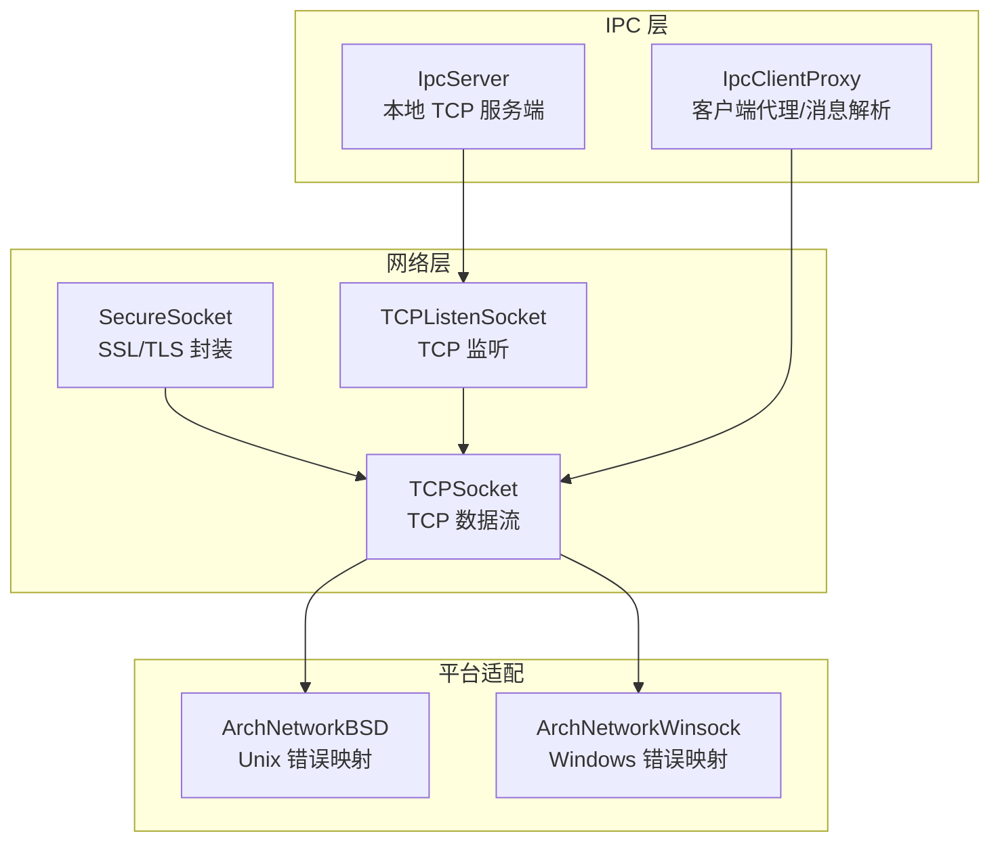
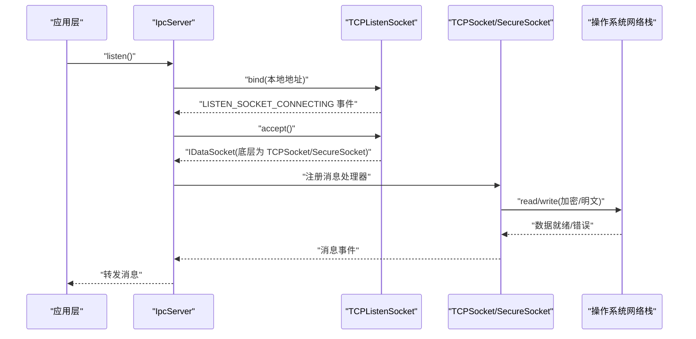
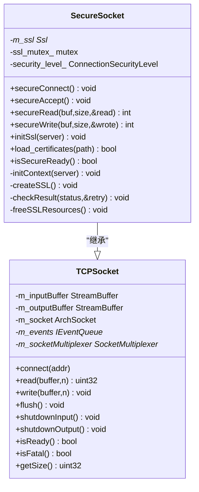
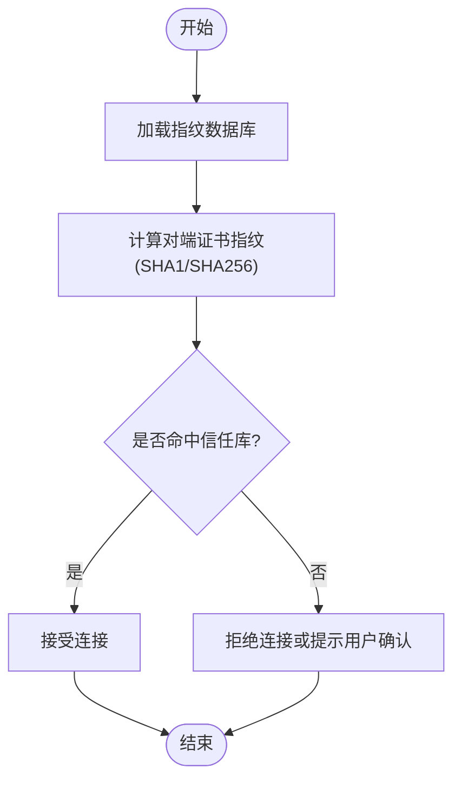
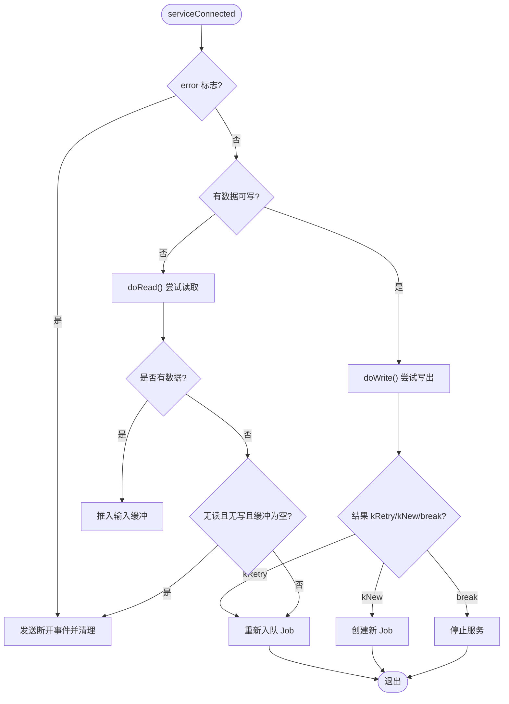
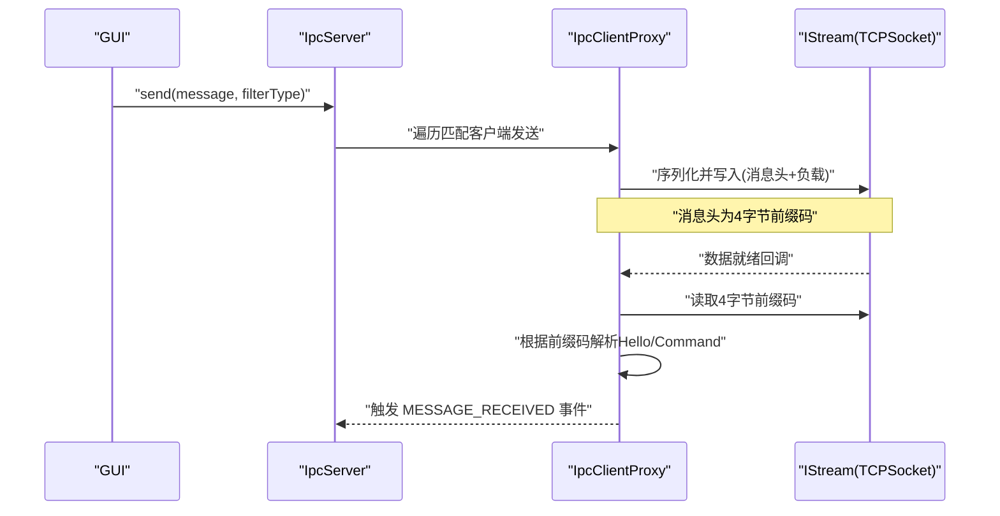
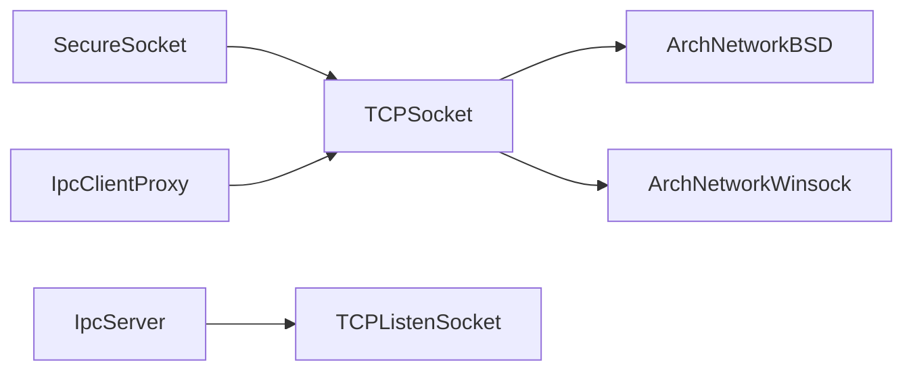

# 网络通信层

<cite>
**本文引用的文件**   
- [SecureSocket.h](file://src/lib/net/SecureSocket.h)
- [SecureSocket.cpp](file://src/lib/net/SecureSocket.cpp)
- [TCPSocket.h](file://src/lib/net/TCPSocket.h)
- [TCPSocket.cpp](file://src/lib/net/TCPSocket.cpp)
- [TCPListenSocket.h](file://src/lib/net/TCPListenSocket.h)
- [TCPListenSocket.cpp](file://src/lib/net/TCPListenSocket.cpp)
- [IpcServer.h](file://src/lib/ipc/IpcServer.h)
- [IpcServer.cpp](file://src/lib/ipc/IpcServer.cpp)
- [IpcClientProxy.h](file://src/lib/ipc/IpcClientProxy.h)
- [IpcClientProxy.cpp](file://src/lib/ipc/IpcClientProxy.cpp)
- [FingerprintDatabase.cpp](file://src/lib/net/FingerprintDatabase.cpp)
- [SslCertificate.cpp](file://src/gui/src/SslCertificate.cpp)
- [ArchNetworkBSD.cpp](file://src/lib/arch/unix/ArchNetworkBSD.cpp)
- [ArchNetworkWinsock.cpp](file://src/lib/arch/win32/ArchNetworkWinsock.cpp)
</cite>

## 目录
1. [简介](#简介)
2. [项目结构](#项目结构)
3. [核心组件](#核心组件)
4. [架构总览](#架构总览)
5. [详细组件分析](#详细组件分析)
6. [依赖关系分析](#依赖关系分析)
7. [性能考量](#性能考量)
8. [故障排查指南](#故障排查指南)
9. [结论](#结论)
10. [附录](#附录)

## 简介
本技术文档聚焦 Input Leap 的网络通信层，围绕安全套接字连接管理、数据传输协议与网络性能优化展开。重点解析 SecureSocket 类的 SSL/TLS 加密实现、证书验证与连接生命周期管理；说明 TCP 连接的建立、维护与断开流程；阐述 IPC 进程间通信机制与消息传递协议；并提供错误处理与重试机制的要点说明。文末给出网络安全最佳实践与性能调优建议。

## 项目结构
Input Leap 的网络通信相关代码主要位于 src/lib/net 与 src/lib/ipc 两个子系统中：
- net 子系统提供底层网络抽象（TCP 监听/数据套接字）与安全传输封装（SSL/TLS）。
- ipc 子系统基于本地 TCP 端口提供守护进程与 GUI 之间的进程间通信。

图表来源
- [SecureSocket.h:35-111](file://src/lib/net/SecureSocket.h#L35-L111)
- [TCPSocket.h:39-114](file://src/lib/net/TCPSocket.h#L39-L114)
- [TCPListenSocket.h:38-62](file://src/lib/net/TCPListenSocket.h#L38-L62)
- [IpcServer.h:42-91](file://src/lib/ipc/IpcServer.h#L42-L91)
- [IpcClientProxy.h:37-60](file://src/lib/ipc/IpcClientProxy.h#L37-L60)
- [ArchNetworkBSD.cpp:757-845](file://src/lib/arch/unix/ArchNetworkBSD.cpp#L757-L845)
- [ArchNetworkWinsock.cpp:894-936](file://src/lib/arch/win32/ArchNetworkWinsock.cpp#L894-L936)

章节来源
- [SecureSocket.h:35-111](file://src/lib/net/SecureSocket.h#L35-L111)
- [TCPSocket.h:39-114](file://src/lib/net/TCPSocket.h#L39-L114)
- [TCPListenSocket.h:38-62](file://src/lib/net/TCPListenSocket.h#L38-L62)
- [IpcServer.h:42-91](file://src/lib/ipc/IpcServer.h#L42-L91)
- [IpcClientProxy.h:37-60](file://src/lib/ipc/IpcClientProxy.h#L37-L60)

## 核心组件
- TCPSocket：封装 TCP 数据流读写、事件驱动 I/O 复用、连接状态管理与缓冲队列。
- SecureSocket：在 TCPSocket 之上叠加 OpenSSL 的 SSL/TLS 握手、读写加密、证书指纹校验与资源释放。
- TCPListenSocket：监听本地或远程端口，接受新连接并返回 IDataSocket 供上层使用。
- IpcServer/IpcClientProxy：基于本地 TCP 端口的 IPC 服务，负责消息编解码与分发。

章节来源
- [TCPSocket.cpp:39-123](file://src/lib/net/TCPSocket.cpp#L39-L123)
- [SecureSocket.cpp:56-107](file://src/lib/net/SecureSocket.cpp#L56-L107)
- [TCPListenSocket.cpp:36-89](file://src/lib/net/TCPListenSocket.cpp#L36-L89)
- [IpcServer.cpp:41-130](file://src/lib/ipc/IpcServer.cpp#L41-L130)
- [IpcClientProxy.cpp:62-109](file://src/lib/ipc/IpcClientProxy.cpp#L62-L109)

## 架构总览
下图展示从应用层到平台网络层的调用链与职责划分：

图表来源
- [IpcServer.cpp:81-128](file://src/lib/ipc/IpcServer.cpp#L81-L128)
- [TCPListenSocket.cpp:58-89](file://src/lib/net/TCPListenSocket.cpp#L58-L89)
- [TCPSocket.cpp:539-563](file://src/lib/net/TCPSocket.cpp#L539-L563)
- [SecureSocket.cpp:277-302](file://src/lib/net/SecureSocket.cpp#L277-L302)

## 详细组件分析

### SecureSocket：SSL/TLS 安全传输
- 继承自 TCPSocket，在 TCP 连接成功后进行 SSL/TLS 握手，随后所有读写均通过 OpenSSL API 完成。
- 支持两种安全级别：仅加密与加密+认证（基于证书指纹数据库）。
- 关键流程：
  - 初始化 OpenSSL 上下文与算法库。
  - 根据角色选择服务器/客户端方法，禁用不安全协议版本。
  - 握手完成后记录对端证书信息并计算指纹（SHA1/SHA256），可选比对信任库。
  - 读写时处理 WANT_READ/WANT_WRITE 等“需要重试”的状态，避免阻塞。
  - 析构与 close 时确保 SSL_CTX/SSL 对象正确释放，防止资源泄漏。

图表来源
- [SecureSocket.h:35-111](file://src/lib/net/SecureSocket.h#L35-L111)
- [TCPSocket.h:39-114](file://src/lib/net/TCPSocket.h#L39-L114)

章节来源
- [SecureSocket.cpp:311-406](file://src/lib/net/SecureSocket.cpp#L311-L406)
- [SecureSocket.cpp:539-575](file://src/lib/net/SecureSocket.cpp#L539-L575)
- [SecureSocket.cpp:277-302](file://src/lib/net/SecureSocket.cpp#L277-L302)
- [SecureSocket.cpp:93-107](file://src/lib/net/SecureSocket.cpp#L93-L107)

#### 证书验证与指纹数据库
- 当安全级别为“加密+认证”时，会请求对端证书并计算指纹，加载指纹数据库进行匹配。
- 指纹数据库支持读取/写入，包含 SHA1/SHA256 格式，GUI 可生成并持久化指纹。

图表来源
- [SecureSocket.cpp:668-697](file://src/lib/net/SecureSocket.cpp#L668-L697)
- [FingerprintDatabase.cpp:41-97](file://src/lib/net/FingerprintDatabase.cpp#L41-L97)
- [SslCertificate.cpp:75-109](file://src/gui/src/SslCertificate.cpp#L75-L109)

章节来源
- [SecureSocket.cpp:668-697](file://src/lib/net/SecureSocket.cpp#L668-L697)
- [FingerprintDatabase.cpp:41-97](file://src/lib/net/FingerprintDatabase.cpp#L41-L97)
- [SslCertificate.cpp:75-109](file://src/gui/src/SslCertificate.cpp#L75-L109)

### TCPSocket：TCP 连接与事件驱动 I/O
- 负责创建/绑定/关闭 socket，维护输入输出缓冲区，并通过 SocketMultiplexer 进行非阻塞 I/O。
- 连接建立后进入 serviceConnected 循环，按可读/可写状态执行 doRead/doWrite。
- 异常路径包括远端关闭、写错误、资源不足等，统一转换为高层事件或异常类型。

图表来源
- [TCPSocket.cpp:539-563](file://src/lib/net/TCPSocket.cpp#L539-L563)
- [TCPSocket.cpp:407-434](file://src/lib/net/TCPSocket.cpp#L407-L434)

章节来源
- [TCPSocket.cpp:39-123](file://src/lib/net/TCPSocket.cpp#L39-L123)
- [TCPSocket.cpp:539-563](file://src/lib/net/TCPSocket.cpp#L539-L563)
- [TCPSocket.cpp:407-434](file://src/lib/net/TCPSocket.cpp#L407-L434)

### TCPListenSocket：监听与接受连接
- 绑定端口并启用监听，注册监听 Job，收到连接后 accept 并返回 IDataSocket。
- 支持 SO_REUSEADDR，便于快速重启服务。

章节来源
- [TCPListenSocket.cpp:58-89](file://src/lib/net/TCPListenSocket.cpp#L58-L89)
- [TCPListenSocket.h:38-62](file://src/lib/net/TCPListenSocket.h#L38-L62)

### IPC：进程间通信机制与消息协议
- IpcServer 监听本地 TCP 端口，接受连接后创建 IpcClientProxy 实例，注册消息接收与断开事件。
- IpcClientProxy 负责读取固定长度的消息头，根据前缀码解析 Hello/Command 消息，并派发事件。
- 该机制用于 GUI 与守护进程之间的配置变更与日志上报。

图表来源
- [IpcServer.cpp:86-128](file://src/lib/ipc/IpcServer.cpp#L86-L128)
- [IpcClientProxy.cpp:72-109](file://src/lib/ipc/IpcClientProxy.cpp#L72-L109)

章节来源
- [IpcServer.cpp:41-130](file://src/lib/ipc/IpcServer.cpp#L41-L130)
- [IpcClientProxy.cpp:62-109](file://src/lib/ipc/IpcClientProxy.cpp#L62-L109)
- [IpcServer.h:42-91](file://src/lib/ipc/IpcServer.h#L42-L91)
- [IpcClientProxy.h:37-60](file://src/lib/ipc/IpcClientProxy.h#L37-L60)

## 依赖关系分析
- SecureSocket 强依赖 TCPSocket 提供的 TCP 能力与事件模型。
- IpcServer 依赖 TCPListenSocket 进行本地监听，依赖 IpcClientProxy 进行消息处理。
- 平台网络错误通过 ArchNetworkBSD/ArchNetworkWinsock 映射为统一的异常类型，便于上层捕获与处理。

图表来源
- [SecureSocket.h:35-111](file://src/lib/net/SecureSocket.h#L35-L111)
- [TCPSocket.h:39-114](file://src/lib/net/TCPSocket.h#L39-L114)
- [IpcServer.h:42-91](file://src/lib/ipc/IpcServer.h#L42-L91)
- [IpcClientProxy.h:37-60](file://src/lib/ipc/IpcClientProxy.h#L37-L60)
- [ArchNetworkBSD.cpp:757-845](file://src/lib/arch/unix/ArchNetworkBSD.cpp#L757-L845)
- [ArchNetworkWinsock.cpp:894-936](file://src/lib/arch/win32/ArchNetworkWinsock.cpp#L894-L936)

章节来源
- [SecureSocket.h:35-111](file://src/lib/net/SecureSocket.h#L35-L111)
- [TCPSocket.h:39-114](file://src/lib/net/TCPSocket.h#L39-L114)
- [IpcServer.h:42-91](file://src/lib/ipc/IpcServer.h#L42-L91)
- [IpcClientProxy.h:37-60](file://src/lib/ipc/IpcClientProxy.h#L37-L60)
- [ArchNetworkBSD.cpp:757-845](file://src/lib/arch/unix/ArchNetworkBSD.cpp#L757-L845)
- [ArchNetworkWinsock.cpp:894-936](file://src/lib/arch/win32/ArchNetworkWinsock.cpp#L894-L936)

## 性能考量
- 非阻塞 I/O 与事件驱动：TCPSocket 通过 SocketMultiplexer 将读写操作以 Job 形式调度，避免线程阻塞，提高并发吞吐。
- 缓冲策略：输入/输出使用 StreamBuffer 管理，减少系统调用次数；SecureSocket 在 WANT_READ/WANT_WRITE 场景下采用重试计数，避免忙等。
- 资源释放：SecureSocket 在 close/析构中显式释放 SSL_CTX/SSL，避免内存与句柄泄漏。
- 连接池：当前代码未实现显式的连接池；若需提升高并发下的连接复用，可在上层引入连接池与空闲回收策略，并结合 keep-alive 与超时控制。

[本节为通用性能讨论，不直接分析具体文件]

## 故障排查指南
- 常见网络错误分类：
  - 资源不足：EMFILE/ENOBUFS/WSAENOBUFS 等，通常意味着文件描述符耗尽或内核缓冲区不足。
  - 地址冲突：EADDRINUSE/WSAEADDRINUSE，检查端口占用或设置 SO_REUSEADDR。
  - 连接被拒/重置：ECONNREFUSED/ECONNRESET/WSAECONNREFUSED/WSAECONNRESET，检查对端状态与防火墙规则。
  - 超时与不可达：ETIMEDOUT/WSAETIMEDOUT、EHOSTUNREACH/WSAEHOSTUNREACH，检查路由与 DNS。
- 调试建议：
  - 开启更详细的日志级别，观察握手阶段与证书指纹输出。
  - 核对指纹数据库路径与内容，确保对端证书指纹已加入信任库。
  - 对于 WANT_READ/WANT_WRITE 频繁出现的情况，检查对端是否半关闭或存在慢消费。

章节来源
- [ArchNetworkBSD.cpp:757-845](file://src/lib/arch/unix/ArchNetworkBSD.cpp#L757-L845)
- [ArchNetworkWinsock.cpp:894-936](file://src/lib/arch/win32/ArchNetworkWinsock.cpp#L894-L936)
- [SecureSocket.cpp:539-575](file://src/lib/net/SecureSocket.cpp#L539-L575)
- [SecureSocket.cpp:668-697](file://src/lib/net/SecureSocket.cpp#L668-L697)

## 结论
Input Leap 的网络通信层以 TCPSocket 为基础，SecureSocket 在其上实现了完整的 SSL/TLS 安全通道，结合指纹数据库提供可选的对端身份认证。IPC 子系统基于本地 TCP 端口实现轻量级进程间通信，满足 GUI 与守护进程间的配置与日志交互需求。整体设计遵循事件驱动与非阻塞 I/O，具备良好的可扩展性与跨平台兼容性。针对生产环境，建议完善连接池与重试退避策略，并持续监控证书指纹与网络错误分布，以提升稳定性与安全性。

[本节为总结性内容，不直接分析具体文件]

## 附录

### 安全连接建立步骤（参考路径）
- 创建并绑定监听套接字：[TCPListenSocket.cpp:58-89](file://src/lib/net/TCPListenSocket.cpp#L58-L89)
- 接受连接并构造数据套接字：[IpcServer.cpp:86-109](file://src/lib/ipc/IpcServer.cpp#L86-L109)
- 初始化 SSL 上下文与算法库：[SecureSocket.cpp:311-406](file://src/lib/net/SecureSocket.cpp#L311-L406)
- 执行握手并记录证书信息：[SecureSocket.cpp:539-575](file://src/lib/net/SecureSocket.cpp#L539-L575)
- 可选：加载指纹数据库并比对：[SecureSocket.cpp:668-697](file://src/lib/net/SecureSocket.cpp#L668-L697)

### 数据序列化与反序列化（参考路径）
- IPC 消息头读取与解析：[IpcClientProxy.cpp:72-109](file://src/lib/ipc/IpcClientProxy.cpp#L72-L109)
- 消息发送入口（由上层调用）：[IpcServer.cpp:123-128](file://src/lib/ipc/IpcServer.cpp#L123-L128)

### 错误处理与重试机制（参考路径）
- SSL 读写错误分类与重试计数：[SecureSocket.cpp:539-575](file://src/lib/net/SecureSocket.cpp#L539-L575)
- TCP 连接失败事件与断开处理：[TCPSocket.cpp:539-563](file://src/lib/net/TCPSocket.cpp#L539-L563)
- 平台错误映射（Unix/Windows）：[ArchNetworkBSD.cpp:757-845](file://src/lib/arch/unix/ArchNetworkBSD.cpp#L757-L845), [ArchNetworkWinsock.cpp:894-936](file://src/lib/arch/win32/ArchNetworkWinsock.cpp#L894-L936)

### 网络安全最佳实践
- 强制启用 TLS 并禁用旧版协议：[SecureSocket.cpp:392-394](file://src/lib/net/SecureSocket.cpp#L392-L394)
- 启用对端证书请求与指纹校验：[SecureSocket.cpp:399-406](file://src/lib/net/SecureSocket.cpp#L399-L406), [SecureSocket.cpp:668-697](file://src/lib/net/SecureSocket.cpp#L668-L697)
- 定期更新指纹数据库与证书轮换：[SslCertificate.cpp:75-109](file://src/gui/src/SslCertificate.cpp#L75-L109)

### 性能调优建议
- 合理设置 I/O 缓冲大小与批量写入，降低系统调用开销。
- 在高并发场景引入连接池与空闲回收，结合 Keep-Alive 与超时策略。
- 监控 WANT_READ/WANT_WRITE 比例，识别慢消费者与拥塞点。
- 使用非阻塞 I/O 与事件驱动模型，避免线程阻塞导致的吞吐下降。

[本节为通用指导，不直接分析具体文件]