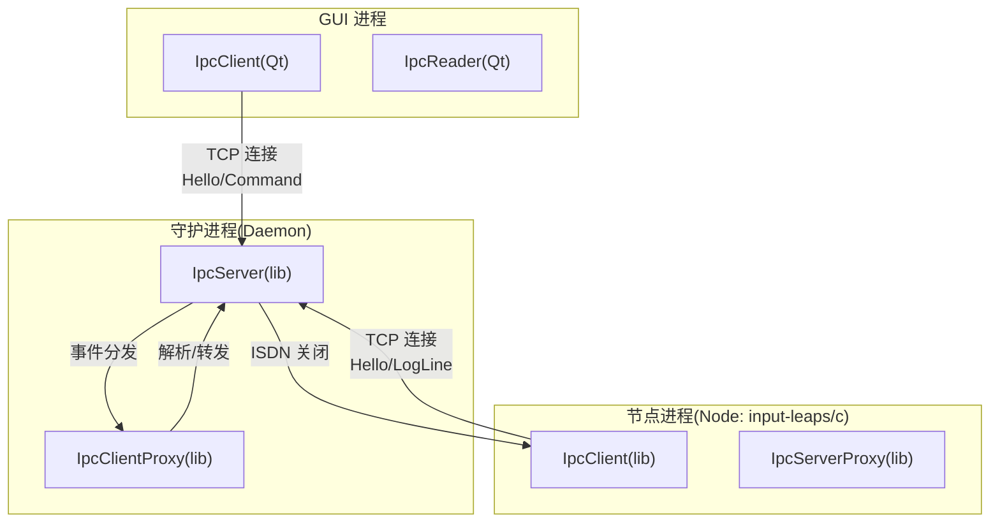
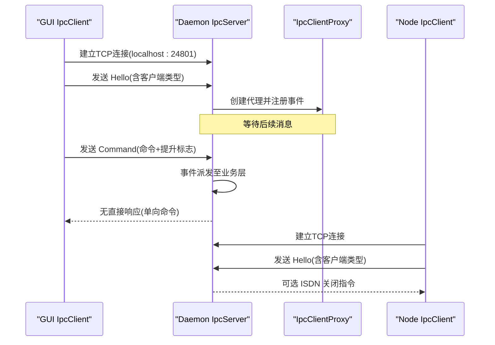
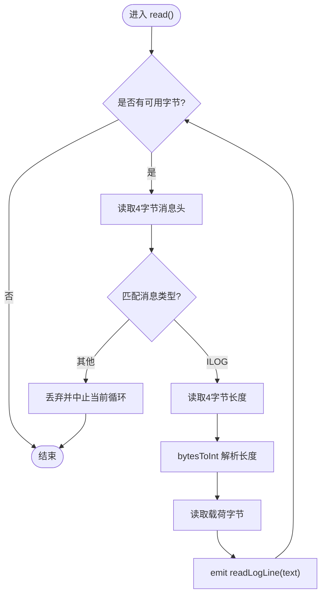
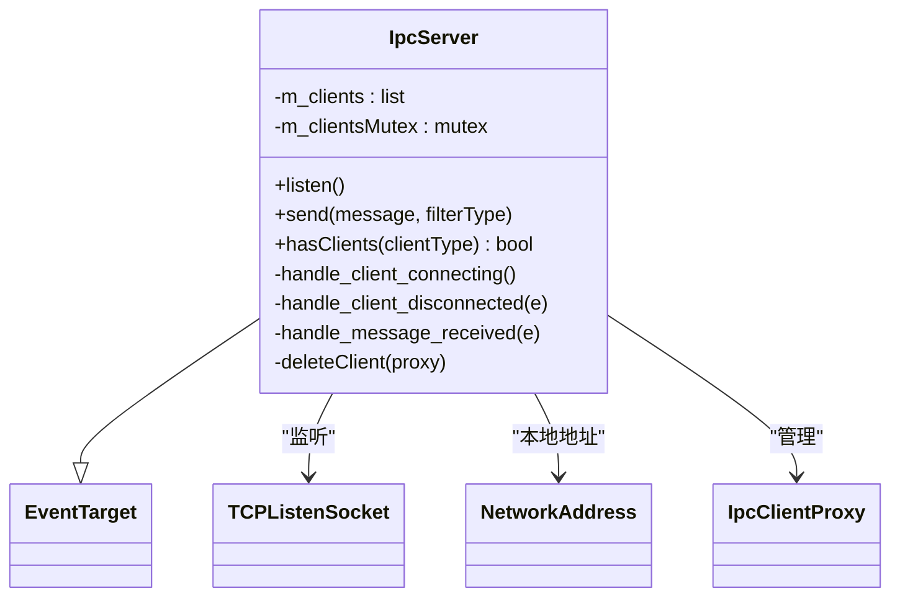
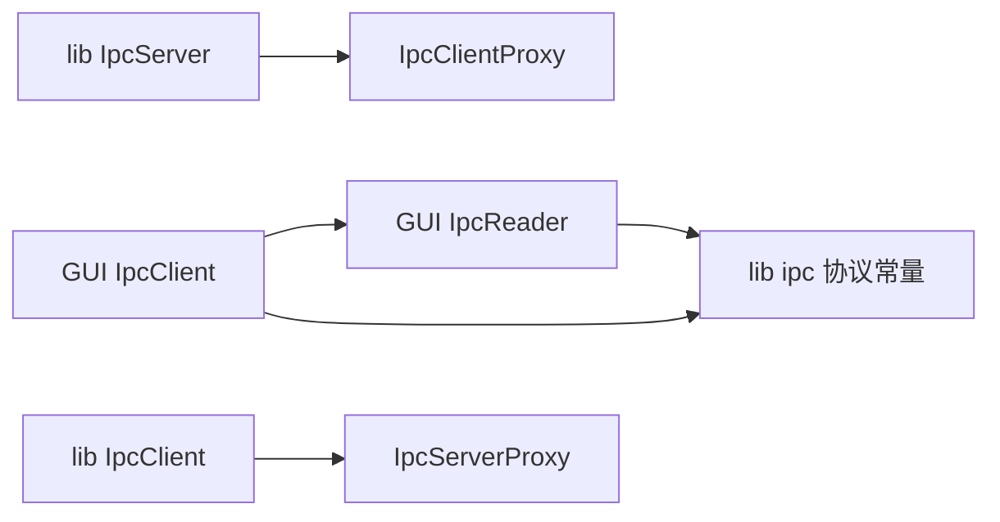

# 进程间通信

<cite>
**本文引用的文件**   
- [src/lib/ipc/Ipc.h](file://src/lib/ipc/Ipc.h)
- [src/lib/ipc/Ipc.cpp](file://src/lib/ipc/Ipc.cpp)
- [src/lib/ipc/IpcServer.h](file://src/lib/ipc/IpcServer.h)
- [src/lib/ipc/IpcServer.cpp](file://src/lib/ipc/IpcServer.cpp)
- [src/lib/ipc/IpcClient.h](file://src/lib/ipc/IpcClient.h)
- [src/gui/src/Ipc.h](file://src/gui/src/Ipc.h)
- [src/gui/src/Ipc.cpp](file://src/gui/src/Ipc.cpp)
- [src/gui/src/IpcClient.h](file://src/gui/src/IpcClient.h)
- [src/gui/src/IpcClient.cpp](file://src/gui/src/IpcClient.cpp)
- [src/gui/src/IpcReader.h](file://src/gui/src/IpcReader.h)
- [src/gui/src/IpcReader.cpp](file://src/gui/src/IpcReader.cpp)
</cite>

## 目录
1. [简介](#简介)
2. [项目结构](#项目结构)
3. [核心组件](#核心组件)
4. [架构总览](#架构总览)
5. [详细组件分析](#详细组件分析)
6. [依赖关系分析](#依赖关系分析)
7. [性能考虑](#性能考虑)
8. [故障排除指南](#故障排除指南)
9. [结论](#结论)
10. [附录](#附录)

## 简介
本技术文档聚焦于 Input Leap 的进程间通信（IPC）子系统，围绕 IpcServer、IpcClient 与 IpcReader 三类核心对象展开，系统阐述 IPC 消息协议、序列化格式、事件驱动模型与跨平台抽象。文档同时覆盖 GUI 侧基于 Qt 的 TCP 实现与库侧基于输入输出/网络抽象的统一接口，提供命令路由、响应处理、安全性与调试排障建议。

## 项目结构
IPC 相关代码分布在两个层次：
- 库层（lib/ipc）：面向 daemon 与 node 的通用 IPC 能力，使用事件队列与 SocketMultiplexer 进行异步 I/O，屏蔽底层平台差异。
- GUI 层（gui/src）：基于 Qt 的轻量客户端与读取器，用于本地回环地址上的日志推送与命令下发。

图表来源
- [src/gui/src/IpcClient.cpp:28-124](file://src/gui/src/IpcClient.cpp#L28-L124)
- [src/gui/src/IpcReader.cpp:44-88](file://src/gui/src/IpcReader.cpp#L44-L88)
- [src/lib/ipc/IpcServer.cpp:80-128](file://src/lib/ipc/IpcServer.cpp#L80-L128)
- [src/lib/ipc/IpcClient.h:37-67](file://src/lib/ipc/IpcClient.h#L37-L67)

章节来源
- [src/lib/ipc/Ipc.h:21-53](file://src/lib/ipc/Ipc.h#L21-L53)
- [src/gui/src/Ipc.h:21-43](file://src/gui/src/Ipc.h#L21-L43)

## 核心组件
- IpcServer（库层）：在本地监听端口，接受来自 GUI 与 Node 的连接；维护客户端代理列表；将接收到的消息以事件形式向上游派发；支持按客户端类型过滤发送。
- IpcClient（库层）：作为 Node 或 Daemon 的客户端，连接到守护进程的 IPC 服务器，完成握手并收发消息。
- IpcReader（GUI 层）：独立于主线程的读取器，订阅 socket 可读事件，按协议解析服务端推送的日志行，并通过信号回调上层。
- IpcClient（GUI 层）：Qt 实现的轻量客户端，负责建立连接、发送 Hello/Command，以及触发重连逻辑。

章节来源
- [src/lib/ipc/IpcServer.h:41-94](file://src/lib/ipc/IpcServer.h#L41-L94)
- [src/lib/ipc/IpcServer.cpp:32-84](file://src/lib/ipc/IpcServer.cpp#L32-L84)
- [src/lib/ipc/IpcClient.h:37-67](file://src/lib/ipc/IpcClient.h#L37-L67)
- [src/gui/src/IpcReader.h:26-49](file://src/gui/src/IpcReader.h#L26-L49)
- [src/gui/src/IpcReader.cpp:44-88](file://src/gui/src/IpcReader.cpp#L44-L88)
- [src/gui/src/IpcClient.h:29-63](file://src/gui/src/IpcClient.h#L29-L63)
- [src/gui/src/IpcClient.cpp:28-124](file://src/gui/src/IpcClient.cpp#L28-L124)

## 架构总览
IPC 采用“守护进程集中式”架构：
- 守护进程运行 IpcServer，仅允许本地回环地址连接，降低暴露面。
- GUI 通过 IpcClient 发送配置变更与启动命令；Node 进程通过 IpcClient 上报日志与接收关闭指令。
- 所有传输基于 TCP 明文帧，帧头为固定长度标识符，随后携带长度与载荷。

图表来源
- [src/gui/src/IpcClient.cpp:95-124](file://src/gui/src/IpcClient.cpp#L95-L124)
- [src/lib/ipc/IpcServer.cpp:86-128](file://src/lib/ipc/IpcServer.cpp#L86-L128)
- [src/lib/ipc/Ipc.h:37-53](file://src/lib/ipc/Ipc.h#L37-L53)

## 详细组件分析

### 协议与序列化格式
- 消息标识符
  - Hello: 客户端向守护进程自我介绍，包含客户端类型（GUI/Node）。
  - LogLine: 守护进程向 GUI 推送聚合日志行。
  - Command: GUI 向守护进程下发命令，附带是否需提权的标志。
  - Shutdown: 守护进程通知 Node 优雅退出。
- 帧格式
  - 头部：固定长度的 ASCII 标识符（如 IHEL、ILOG、ICMD、ISDN）。
  - 负载：变长数据，先写 4 字节大端长度，再写载荷字节流。
  - 整数编码：自定义 int-to-bytes 与 bytes-to-int，遵循大端序。
- 字符集：日志文本以 UTF-8 编码传输。

章节来源
- [src/lib/ipc/Ipc.h:24-53](file://src/lib/ipc/Ipc.h#L24-L53)
- [src/lib/ipc/Ipc.cpp:21-25](file://src/lib/ipc/Ipc.cpp#L21-L25)
- [src/gui/src/Ipc.h:26-43](file://src/gui/src/Ipc.h#L26-L43)
- [src/gui/src/Ipc.cpp:23-27](file://src/gui/src/Ipc.cpp#L23-L27)
- [src/gui/src/IpcClient.cpp:132-150](file://src/gui/src/IpcClient.cpp#L132-L150)
- [src/gui/src/IpcReader.cpp:120-140](file://src/gui/src/IpcReader.cpp#L120-L140)

#### 协议流程图

图表来源
- [src/gui/src/IpcReader.cpp:54-88](file://src/gui/src/IpcReader.cpp#L54-L88)
- [src/gui/src/IpcReader.cpp:90-118](file://src/gui/src/IpcReader.cpp#L90-L118)
- [src/gui/src/IpcReader.cpp:120-140](file://src/gui/src/IpcReader.cpp#L120-L140)

### IpcServer（守护进程侧）
- 职责
  - 绑定本地监听套接字，接受新连接。
  - 为每个连接创建 IpcClientProxy，注册断开与消息事件。
  - 将收到的消息封装为事件派发给上层。
  - 按客户端类型过滤广播消息。
- 并发与同步
  - 使用互斥量保护客户端列表读写。
  - 事件驱动模型避免阻塞 I/O。
- 生命周期
  - 析构时移除事件处理器、释放资源并清理所有代理。

图表来源
- [src/lib/ipc/IpcServer.h:41-94](file://src/lib/ipc/IpcServer.h#L41-L94)
- [src/lib/ipc/IpcServer.cpp:80-128](file://src/lib/ipc/IpcServer.cpp#L80-L128)

章节来源
- [src/lib/ipc/IpcServer.h:41-94](file://src/lib/ipc/IpcServer.h#L41-L94)
- [src/lib/ipc/IpcServer.cpp:32-84](file://src/lib/ipc/IpcServer.cpp#L32-L84)
- [src/lib/ipc/IpcServer.cpp:138-172](file://src/lib/ipc/IpcServer.cpp#L138-L172)

### IpcClient（库层，Node/Daemon 侧）
- 职责
  - 连接守护进程 IPC 服务器。
  - 发送 Hello 完成握手。
  - 发送/接收 IpcMessage。
- 设计要点
  - 基于 TCPSocket 与 SocketMultiplexer 的异步 I/O。
  - 通过 IpcServerProxy 解析远端帧并转换为内部消息。

章节来源
- [src/lib/ipc/IpcClient.h:37-67](file://src/lib/ipc/IpcClient.h#L37-L67)

### IpcClient（GUI 层，Qt 实现）
- 职责
  - 连接守护进程（默认 localhost:24801）。
  - 发送 Hello（携带 GUI 类型）。
  - 发送 Command（命令字符串 + 提权标志）。
  - 错误重试机制。
- 序列化细节
  - 使用 QDataStream 写入原始字节。
  - 自定义 intToBytes 实现大端序写入。

章节来源
- [src/gui/src/IpcClient.h:29-63](file://src/gui/src/IpcClient.h#L29-L63)
- [src/gui/src/IpcClient.cpp:28-124](file://src/gui/src/IpcClient.cpp#L28-L124)
- [src/gui/src/IpcClient.cpp:132-150](file://src/gui/src/IpcClient.cpp#L132-L150)

### IpcReader（GUI 层，Qt 实现）
- 职责
  - 订阅 socket 可读事件。
  - 解析 ILOG 帧，提取日志文本并上抛。
- 同步策略
  - 使用互斥量保护读缓冲区访问。
  - 使用 waitForReadyRead 等待更多数据。

章节来源
- [src/gui/src/IpcReader.h:26-49](file://src/gui/src/IpcReader.h#L26-L49)
- [src/gui/src/IpcReader.cpp:44-88](file://src/gui/src/IpcReader.cpp#L44-L88)
- [src/gui/src/IpcReader.cpp:90-118](file://src/gui/src/IpcReader.cpp#L90-L118)
- [src/gui/src/IpcReader.cpp:120-140](file://src/gui/src/IpcReader.cpp#L120-L140)

### 命令路由与响应处理
- 命令路由
  - GUI 通过 Command 消息将完整命令行与提权标志发送给守护进程。
  - 守护进程收到后派发事件，由上层业务决定如何执行。
- 响应处理
  - 当前协议未定义显式请求-响应模式；日志上行采用单向推送。
  - 若需要响应，可在现有框架上扩展新的消息类型与序列。

章节来源
- [src/gui/src/IpcClient.cpp:105-124](file://src/gui/src/IpcClient.cpp#L105-L124)
- [src/lib/ipc/Ipc.h:45-53](file://src/lib/ipc/Ipc.h#L45-L53)
- [src/lib/ipc/IpcServer.cpp:123-128](file://src/lib/ipc/IpcServer.cpp#L123-L128)

## 依赖关系分析
- GUI 层依赖 Qt 网络与事件循环；库层依赖输入输出与网络抽象。
- 两者共享同一套消息标识与序列化约定，确保互通。

图表来源
- [src/gui/src/IpcClient.cpp:19-26](file://src/gui/src/IpcClient.cpp#L19-L26)
- [src/gui/src/IpcReader.cpp:22-26](file://src/gui/src/IpcReader.cpp#L22-L26)
- [src/lib/ipc/IpcServer.cpp:19-28](file://src/lib/ipc/IpcServer.cpp#L19-L28)
- [src/lib/ipc/IpcClient.h:21-26](file://src/lib/ipc/IpcClient.h#L21-L26)

章节来源
- [src/gui/src/Ipc.h:21-43](file://src/gui/src/Ipc.h#L21-L43)
- [src/lib/ipc/Ipc.h:21-53](file://src/lib/ipc/Ipc.h#L21-L53)

## 性能考虑
- 事件驱动与多路复用：库层使用 SocketMultiplexer 与事件队列，避免阻塞。
- 批量日志推送：守护进程可聚合日志行以减少频繁小帧开销。
- 零拷贝优化：在可能的情况下尽量使用缓冲池与内存映射（当前实现为逐块读取）。
- 背压控制：当接收端处理慢时，应限制上游推送速率，防止内存增长。

[本节为通用指导，不直接分析具体文件]

## 故障排除指南
- 连接失败
  - 检查守护进程是否在本地端口监听。
  - 确认防火墙未拦截本地回环地址。
- 协议不匹配
  - 核对消息头标识符与长度字段顺序。
  - 确认大小端序一致。
- 日志缺失
  - 启用 verbose 宏以便打印详细读取过程。
  - 检查 ILOG 帧长度与实际载荷是否一致。
- 死锁检测
  - 关注互斥量持有范围，避免在持有锁时进行阻塞 I/O。
  - 使用线程分析工具定位长时间持锁路径。

章节来源
- [src/gui/src/IpcReader.cpp:19-33](file://src/gui/src/IpcReader.cpp#L19-L33)
- [src/gui/src/IpcReader.cpp:54-88](file://src/gui/src/IpcReader.cpp#L54-L88)
- [src/gui/src/IpcClient.cpp:74-93](file://src/gui/src/IpcClient.cpp#L74-L93)

## 结论
Input Leap 的 IPC 子系统以守护进程为中心，采用简单可靠的 TCP 帧协议，结合事件驱动模型实现了 GUI 与 Node 之间的稳定通信。库层提供了跨平台的抽象，GUI 层则基于 Qt 快速落地。通过明确的协议定义与良好的同步策略，系统在易用性与可维护性之间取得平衡。未来可扩展更丰富的消息类型与鉴权机制，以满足更高安全需求。

## 附录

### 示例：进程间消息发送与接收（步骤说明）
- GUI 启动后调用 connectToHost 建立到守护进程的 TCP 连接。
- 连接成功后发送 Hello，携带客户端类型为 GUI。
- 守护进程接受连接并创建代理，等待后续消息。
- GUI 发送 Command，包含命令字符串与提权标志。
- 守护进程派发事件，上层业务执行命令。
- 守护进程通过 ILOG 帧推送日志行，GUI 的 IpcReader 解析并回调上层。

章节来源
- [src/gui/src/IpcClient.cpp:54-65](file://src/gui/src/IpcClient.cpp#L54-L65)
- [src/gui/src/IpcClient.cpp:95-103](file://src/gui/src/IpcClient.cpp#L95-L103)
- [src/gui/src/IpcClient.cpp:105-124](file://src/gui/src/IpcClient.cpp#L105-L124)
- [src/gui/src/IpcReader.cpp:54-88](file://src/gui/src/IpcReader.cpp#L54-L88)

### 安全性与权限控制
- 本地回环绑定：仅允许本机连接，减少远程攻击面。
- 提权标志：Command 消息携带提权指示，便于在 Windows 等平台上按需提升权限。
- 身份识别：Hello 消息中的客户端类型可用于策略控制（例如仅允许 GUI 发送命令）。
- 建议增强
  - 引入认证令牌或证书校验。
  - 对敏感命令进行白名单校验与审计日志。
  - 增加消息签名与完整性校验。

章节来源
- [src/lib/ipc/Ipc.h:21-22](file://src/lib/ipc/Ipc.h#L21-L22)
- [src/lib/ipc/Ipc.h:31-35](file://src/lib/ipc/Ipc.h#L31-L35)
- [src/gui/src/IpcClient.cpp:105-124](file://src/gui/src/IpcClient.cpp#L105-L124)

### 跨平台 IPC 抽象层说明
- 当前实现基于 TCP 套接字，通过统一的 SocketMultiplexer 与 IEventQueue 抽象，屏蔽平台差异。
- 命名管道、共享内存与信号量未在现有代码中直接使用；如需高性能场景，可在库层扩展对应后端，保持协议不变。

章节来源
- [src/lib/ipc/IpcServer.cpp:32-59](file://src/lib/ipc/IpcServer.cpp#L32-L59)
- [src/lib/ipc/IpcClient.h:21-26](file://src/lib/ipc/IpcClient.h#L21-L26)