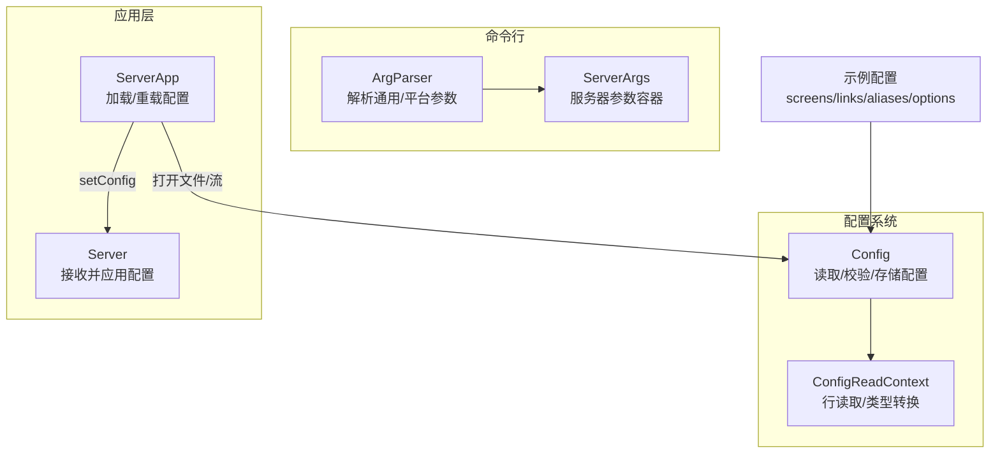
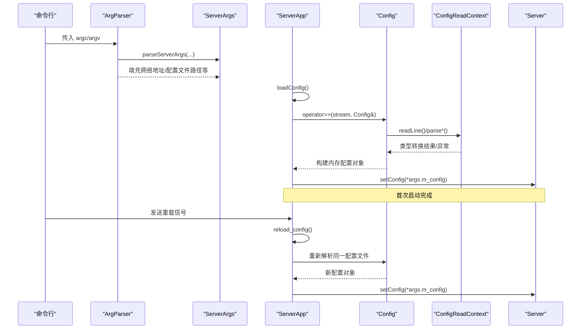
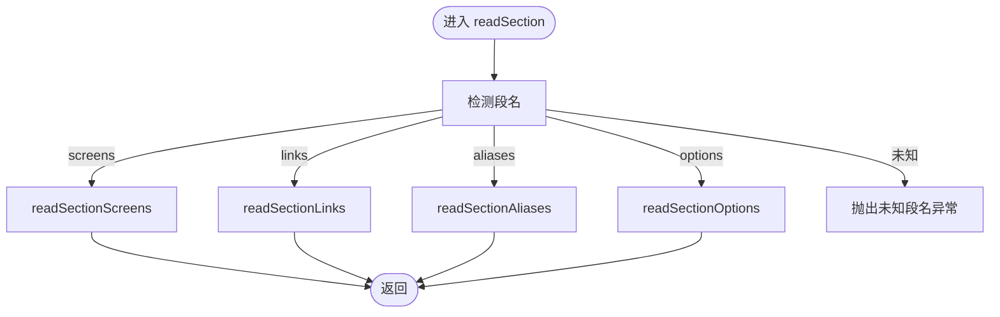
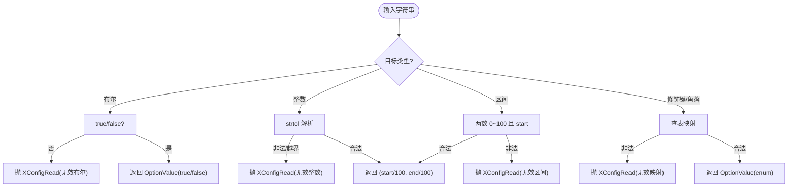
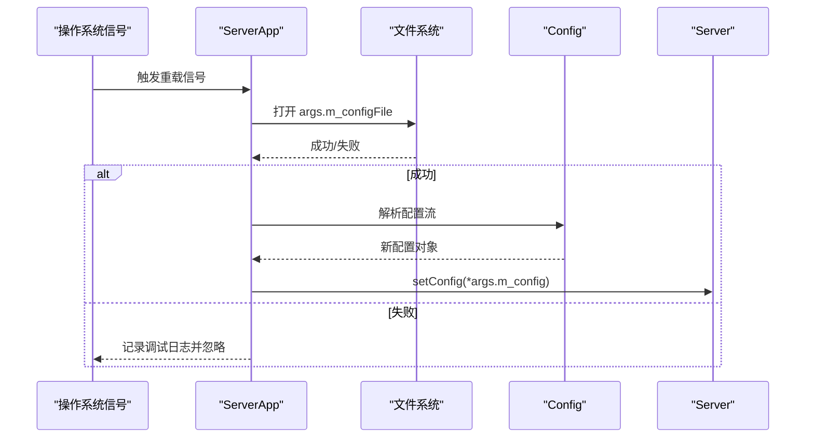
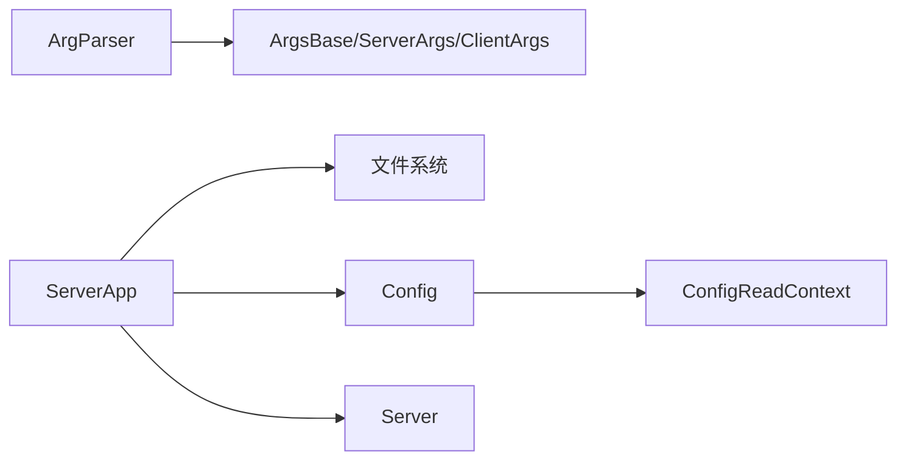

# 配置管理系统

<cite>
**本文引用的文件**   
- [ArgParser.h](file://src/lib/inputleap/ArgParser.h)
- [ArgParser.cpp](file://src/lib/inputleap/ArgParser.cpp)
- [Config.h](file://src/lib/server/Config.h)
- [Config.cpp](file://src/lib/server/Config.cpp)
- [ServerApp.cpp](file://src/lib/inputleap/ServerApp.cpp)
- [ServerArgs.h](file://src/lib/inputleap/ServerArgs.h)
- [input-leap.conf.example](file://doc/input-leap.conf.example)
- [input-leap.conf.example-basic](file://doc/input-leap.conf.example-basic)
- [input-leap.conf.example-advanced](file://doc/input-leap.conf.example-advanced)
</cite>

## 目录
1. [简介](#简介)
2. [项目结构](#项目结构)
3. [核心组件](#核心组件)
4. [架构总览](#架构总览)
5. [详细组件分析](#详细组件分析)
6. [依赖关系分析](#依赖关系分析)
7. [性能考虑](#性能考虑)
8. [故障排除指南](#故障排除指南)
9. [结论](#结论)
10. [附录](#附录)

## 简介
本技术文档聚焦于 Input Leap 的配置管理系统，围绕配置文件解析、参数验证与动态重载机制展开。重点覆盖：
- ArgParser 类的命令行参数处理流程与平台差异
- 配置文件格式规范（section: screens/links/aliases/options）及类型转换逻辑
- 配置项定义、默认值设置与验证规则
- 配置文件的层次结构与继承机制（全局选项与屏幕级选项）
- 运行时动态重载流程与错误处理
- 扩展指南：如何添加新配置项、实现自定义验证器、处理配置变更
- 最佳实践与常见问题排查

## 项目结构
与配置管理相关的核心代码分布在以下模块：
- 命令行参数解析：ArgParser（通用与平台相关参数）、ServerArgs/ClientArgs（参数容器）
- 配置文件解析：Config（段解析、类型转换、链接与别名、输入过滤规则等）
- 应用集成：ServerApp（加载配置、信号触发重载、将配置注入服务器）
- 示例配置：doc 下的多个 .conf.example 展示基础到高级的用法

图示来源
- [ArgParser.h:68-104](file://src/lib/inputleap/ArgParser.h#L68-L104)
- [ArgParser.cpp:106-156](file://src/lib/inputleap/ArgParser.cpp#L106-L156)
- [Config.h:62-180](file://src/lib/server/Config.h#L62-L180)
- [Config.cpp:629-657](file://src/lib/server/Config.cpp#L629-L657)
- [ServerApp.cpp:196-272](file://src/lib/inputleap/ServerApp.cpp#L196-L272)
- [input-leap.conf.example:1-38](file://doc/input-leap.conf.example#L1-L38)

章节来源
- [ArgParser.h:68-104](file://src/lib/inputleap/ArgParser.h#L68-L104)
- [ArgParser.cpp:106-156](file://src/lib/inputleap/ArgParser.cpp#L106-L156)
- [Config.h:62-180](file://src/lib/server/Config.h#L62-L180)
- [Config.cpp:629-657](file://src/lib/server/Config.cpp#L629-L657)
- [ServerApp.cpp:196-272](file://src/lib/inputleap/ServerApp.cpp#L196-L272)
- [input-leap.conf.example:1-38](file://doc/input-leap.conf.example#L1-L38)

## 核心组件
- ArgParser：负责解析通用与平台特定的命令行参数，封装 Argv 迭代器，提供 parseServerArgs/parseClientArgs 入口。
- Config：负责解析配置文件中的 section: screens/links/aliases/options，维护屏幕拓扑、别名映射、监听地址、全局与屏幕级选项、输入过滤规则等。
- ConfigReadContext：逐行读取配置，提供布尔、整数、修饰键、角落、区间、按键/鼠标事件等类型转换方法，统一抛出 XConfigRead 异常。
- ServerApp：根据命令行或默认路径加载配置文件，支持通过信号触发 reload_config，并将新配置注入运行中的服务器。

章节来源
- [ArgParser.h:68-104](file://src/lib/inputleap/ArgParser.h#L68-L104)
- [ArgParser.cpp:345-454](file://src/lib/inputleap/ArgParser.cpp#L345-L454)
- [Config.h:468-533](file://src/lib/server/Config.h#L468-L533)
- [Config.cpp:1875-2040](file://src/lib/server/Config.cpp#L1875-L2040)
- [ServerApp.cpp:178-272](file://src/lib/inputleap/ServerApp.cpp#L178-L272)

## 架构总览
下图展示了从命令行启动到配置生效的关键调用链，包括动态重载路径。

图示来源
- [ArgParser.cpp:106-156](file://src/lib/inputleap/ArgParser.cpp#L106-L156)
- [ServerApp.cpp:178-272](file://src/lib/inputleap/ServerApp.cpp#L178-L272)
- [Config.cpp:629-657](file://src/lib/server/Config.cpp#L629-L657)
- [Config.cpp:1875-2040](file://src/lib/server/Config.cpp#L1875-L2040)

## 详细组件分析

### ArgParser 类与命令行参数处理
- 设计要点
  - 使用 Argv 包装 argc/argv，提供 shift/peek/contains 等便捷接口。
  - 区分通用参数与平台特定参数，避免跨平台耦合。
  - 对未知参数抛出 XArgvParserError，便于上层捕获并输出友好提示。
- 关键流程
  - parseServerArgs：先更新通用上下文，再循环匹配平台参数、通用参数、服务器专属参数（如 --address/--config）。
  - parseGenericArgs：处理日志、守护进程、名称、重启策略、拖放、加密、插件目录等。
  - 平台分支：Windows/Carbon/X11/LibEI 各自解析其特有开关。
- 典型行为
  - --config 指定配置文件路径；未指定时由 ServerApp 按优先级查找默认路径。
  - --address 指定监听地址；客户端模式要求至少一个位置参数为服务器地址。

图示来源
- [ArgParser.cpp:106-156](file://src/lib/inputleap/ArgParser.cpp#L106-L156)
- [ArgParser.cpp:345-454](file://src/lib/inputleap/ArgParser.cpp#L345-L454)

章节来源
- [ArgParser.h:68-104](file://src/lib/inputleap/ArgParser.h#L68-L104)
- [ArgParser.cpp:106-156](file://src/lib/inputleap/ArgParser.cpp#L106-L156)
- [ArgParser.cpp:345-454](file://src/lib/inputleap/ArgParser.cpp#L345-L454)
- [ServerArgs.h:26-35](file://src/lib/inputleap/ServerArgs.h#L26-L35)

### 配置文件格式与解析流程
- 支持的段
  - section: screens — 声明逻辑屏幕名
  - section: links — 定义屏幕间连接（方向与可选区间）
  - section: aliases — 别名映射（真实主机名 -> 逻辑名）
  - section: options — 全局或屏幕级选项（name[(arg[,...])]=value[,value...]）
- 语法要点
  - 注释以 # 开头至行尾
  - nameWithArgs 支持括号内参数列表，逗号分隔
  - 区间值采用百分比形式，内部转换为 [0,1] 浮点区间
- 解析流程
  - Config::readSection 识别段名并分发到对应处理器
  - ConfigReadContext 负责逐行读取与类型转换，失败抛 XConfigRead

图示来源
- [Config.cpp:629-657](file://src/lib/server/Config.cpp#L629-L657)

章节来源
- [Config.h:442-466](file://src/lib/server/Config.h#L442-L466)
- [Config.cpp:629-657](file://src/lib/server/Config.cpp#L629-L657)
- [input-leap.conf.example:1-38](file://doc/input-leap.conf.example#L1-L38)
- [input-leap.conf.example-basic:1-40](file://doc/input-leap.conf.example-basic#L1-L40)
- [input-leap.conf.example-advanced:1-50](file://doc/input-leap.conf.example-advanced#L1-L50)

### 类型转换与验证规则
- 布尔型：仅接受 true/false（大小写不敏感），否则抛错
- 整型：十进制解析，越界或非法字符抛错
- 修饰键/角落：字符串到枚举的映射，非法值抛错
- 区间：两个 0~100 的数值，且 start < end，最终归一化为 [0,1] 浮点对
- 键盘/鼠标事件：字符串到平台无关描述的结构体，非法格式抛错
- 行号追踪：所有错误均附带行号信息，便于定位

图示来源
- [Config.cpp:1875-2040](file://src/lib/server/Config.cpp#L1875-L2040)

章节来源
- [Config.h:472-513](file://src/lib/server/Config.h#L472-L513)
- [Config.cpp:1875-2040](file://src/lib/server/Config.cpp#L1875-L2040)

### 配置项定义、默认值与继承机制
- 全局选项与屏幕级选项
  - 全局选项在空屏幕名上下文中访问，屏幕级选项绑定到具体屏幕
  - getOptions(name) 当 name 为空时返回全局选项集合
- 继承语义
  - 若某选项未在屏幕级设置，则回退到全局选项
  - 该机制通过 ScreenOptions 与 m_globalOptions 共同实现
- 监听地址
  - 必须显式设置才能作为服务器运行（无默认监听地址）

章节来源
- [Config.h:285-306](file://src/lib/server/Config.h#L285-L306)
- [Config.cpp:504-520](file://src/lib/server/Config.cpp#L504-L520)

### 动态重载机制
- 触发方式
  - 通过信号事件触发 reload_config，内部再次调用 loadConfig
- 重载流程
  - 使用 args().m_configFile 指定的路径重新打开并解析
  - 成功后将新配置对象注入 server_->setConfig
- 注意事项
  - 若未找到配置文件，会记录调试日志并返回 false
  - 首次启动若无可用配置，程序退出

图示来源
- [ServerApp.cpp:178-272](file://src/lib/inputleap/ServerApp.cpp#L178-L272)

章节来源
- [ServerApp.cpp:178-272](file://src/lib/inputleap/ServerApp.cpp#L178-L272)

### 扩展指南：添加新配置项与自定义验证器
- 新增命令行参数（示例思路）
  - 在 parseServerArgs/parseClientArgs 中添加新的 a.shift("...") 分支，写入 ServerArgs/ClientArgs 字段
  - 如需通用参数，可在 parseGenericArgs 中增加处理
- 新增配置文件选项
  - 在 readSectionOptions 中识别新选项名，调用 ConfigReadContext 的类型转换方法获取值
  - 若需要复杂参数，利用 parseNameWithArgs 解析 name(args...) 形式
- 自定义验证器
  - 在 ConfigReadContext 中新增 parseXxx 方法，进行范围/格式校验，失败抛 XConfigRead
  - 在相应段解析处调用新方法完成赋值
- 处理配置变更
  - 在 setConfig 后，确保下游子系统（如网络、输入过滤）能响应新配置
  - 对于热重载，注意资源清理与重建顺序，避免竞态

章节来源
- [ArgParser.cpp:106-156](file://src/lib/inputleap/ArgParser.cpp#L106-L156)
- [ArgParser.cpp:345-454](file://src/lib/inputleap/ArgParser.cpp#L345-L454)
- [Config.cpp:629-657](file://src/lib/server/Config.cpp#L629-L657)
- [Config.cpp:2041-2084](file://src/lib/server/Config.cpp#L2041-L2084)
- [Config.cpp:1875-2040](file://src/lib/server/Config.cpp#L1875-L2040)

## 依赖关系分析
- 低耦合高内聚
  - ArgParser 仅依赖 ArgsBase/ServerArgs/ClientArgs 与平台宏，不直接操作配置对象
  - Config 独立于命令行，专注配置解析与数据模型
  - ServerApp 作为编排者，串联参数解析、文件加载与配置注入
- 外部依赖
  - 文件系统用于打开配置文件
  - 日志系统用于诊断与用户提示
  - 平台抽象用于选择输入后端（X11/LibEI）

图示来源
- [ArgParser.cpp:106-156](file://src/lib/inputleap/ArgParser.cpp#L106-L156)
- [ServerApp.cpp:196-272](file://src/lib/inputleap/ServerApp.cpp#L196-L272)
- [Config.cpp:629-657](file://src/lib/server/Config.cpp#L629-L657)

章节来源
- [ArgParser.cpp:106-156](file://src/lib/inputleap/ArgParser.cpp#L106-L156)
- [ServerApp.cpp:196-272](file://src/lib/inputleap/ServerApp.cpp#L196-L272)
- [Config.cpp:629-657](file://src/lib/server/Config.cpp#L629-L657)

## 性能考虑
- 配置解析开销较小，主要成本在于 I/O 与可能的网络/输入子系统重建
- 建议
  - 避免频繁重载，必要时合并多次变更后再触发一次重载
  - 大配置文件中减少冗余与重复定义，提升解析速度
  - 合理划分全局与屏幕级选项，降低运行时查找复杂度

## 故障排除指南
- 常见错误与定位
  - 未知段名：检查 section: 后的名称是否为 screens/links/aliases/options
  - 缺少必需分隔符：确认 =、(、)、, 等符号齐全
  - 无效布尔/整数/区间：核对取值范围与格式
  - 无法打开配置文件：确认路径正确、权限足够
- 调试技巧
  - 使用 -d/--debug 调整日志级别，观察解析过程
  - 使用 --log 指定日志文件，集中查看错误堆栈
  - 使用 --no-daemon 在前台运行，便于交互式调试
- 重载失败
  - 检查 args.m_configFile 指向的文件是否存在
  - 关注“cannot open configuration”的调试日志

章节来源
- [Config.cpp:1875-2040](file://src/lib/server/Config.cpp#L1875-L2040)
- [ServerApp.cpp:258-272](file://src/lib/inputleap/ServerApp.cpp#L258-L272)
- [ArgParser.cpp:345-454](file://src/lib/inputleap/ArgParser.cpp#L345-L454)

## 结论
Input Leap 的配置管理系统通过清晰的职责分离与严格的类型转换，实现了稳定可靠的命令行参数与配置文件解析。配合动态重载机制，能够在不中断服务的前提下平滑切换配置。遵循本文的最佳实践与排障建议，可显著提升配置管理的可维护性与可用性。

## 附录
- 示例配置参考
  - 基础拓扑：[input-leap.conf.example-basic](file://doc/input-leap.conf.example-basic)
  - 标准示例：[input-leap.conf.example](file://doc/input-leap.conf.example)
  - 高级区间连接：[input-leap.conf.example-advanced](file://doc/input-leap.conf.example-advanced)