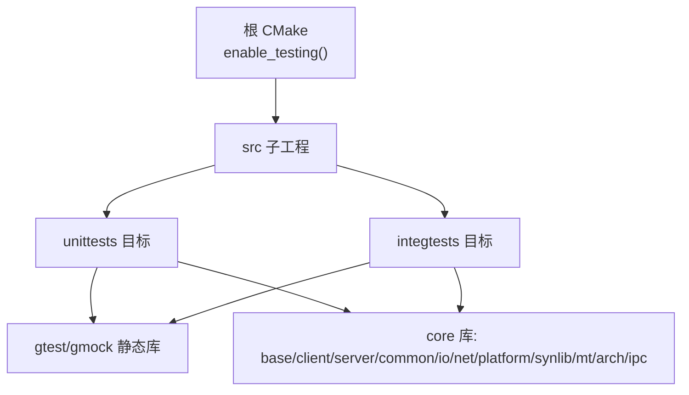
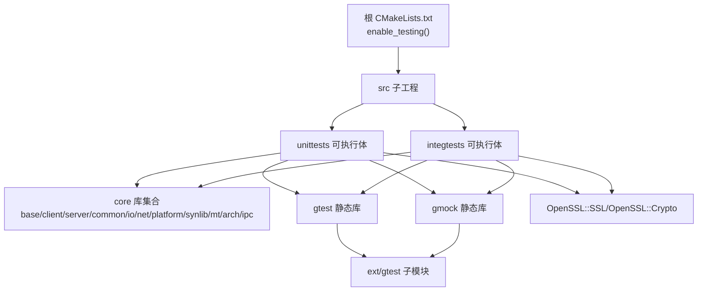
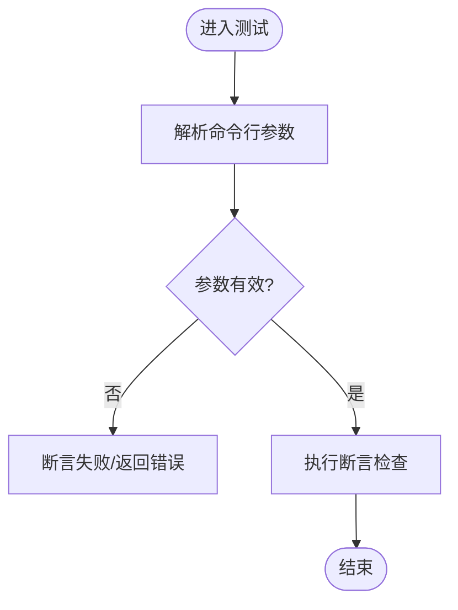
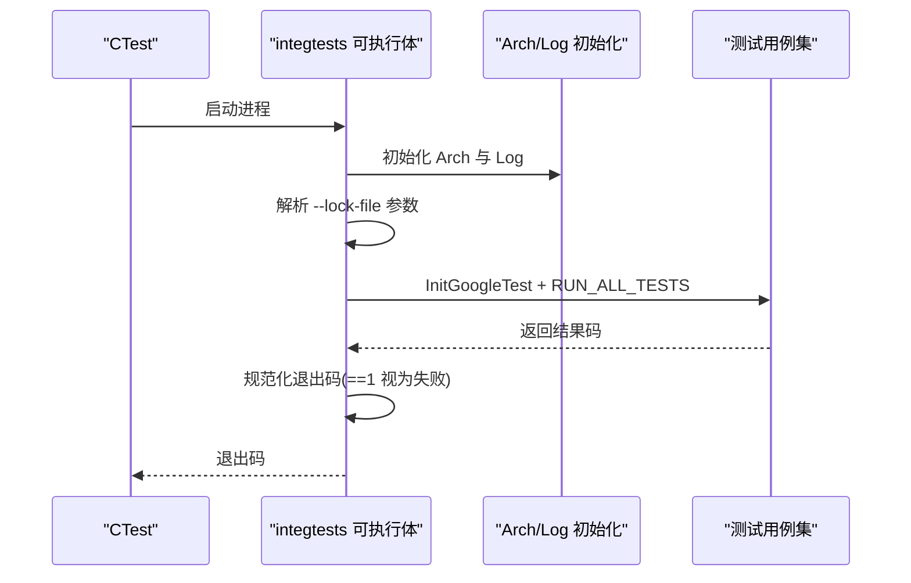
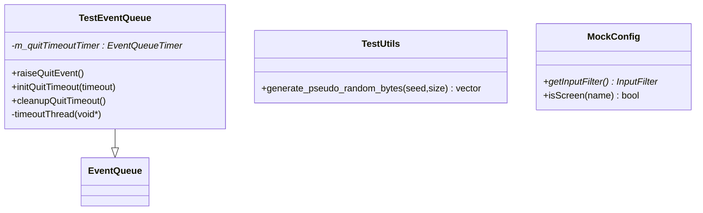
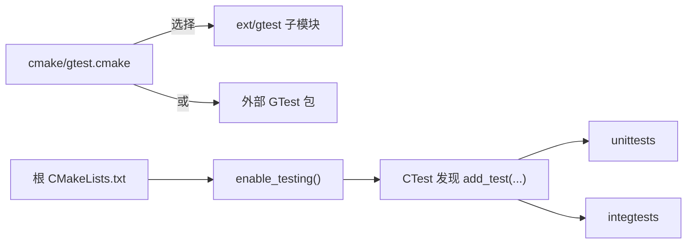

# 测试策略

<cite>
**本文引用的文件**   
- [CMakeLists.txt](file://CMakeLists.txt)
- [cmake/gtest.cmake](file://cmake/gtest.cmake)
- [.gitmodules](file://.gitmodules)
- [src/test/unittests/CMakeLists.txt](file://src/test/unittests/CMakeLists.txt)
- [src/test/integtests/CMakeLists.txt](file://src/test/integtests/CMakeLists.txt)
- [src/test/integtests/Main.cpp](file://src/test/integtests/Main.cpp)
- [src/test/global/TestEventQueue.h](file://src/test/global/TestEventQueue.h)
- [src/test/global/TestUtils.h](file://src/test/global/TestUtils.h)
- [src/test/mock/server/MockConfig.h](file://src/test/mock/server/MockConfig.h)
- [src/test/unittests/inputleap/GenericArgsParsingTests.cpp](file://src/test/unittests/inputleap/GenericArgsParsingTests.cpp)
- [src/test/unittests/inputleap/ServerArgsParsingTests.cpp](file://src/test/unittests/inputleap/ServerArgsParsingTests.cpp)
- [src/test/unittests/base/StringTests.cpp](file://src/test/unittests/base/StringTests.cpp)
</cite>

## 目录
1. [简介](#简介)
2. [项目结构](#项目结构)
3. [核心组件](#核心组件)
4. [架构总览](#架构总览)
5. [详细组件分析](#详细组件分析)
6. [依赖分析](#依赖分析)
7. [性能考虑](#性能考虑)
8. [故障排查指南](#故障排查指南)
9. [结论](#结论)
10. [附录](#附录)

## 简介
本文件为 Input Leap 的测试策略与实现文档，覆盖单元测试、集成测试与端到端测试的架构与组织方式；说明测试框架选择（Google Test + Google Mock）、测试用例组织、测试数据准备策略；给出覆盖率建议、持续集成与自动化流程建议；并提供编写新测试的指导原则与最佳实践。同时包含性能测试、压力测试与兼容性测试的实施方法，帮助贡献者快速上手并高质量地扩展测试套件。

## 项目结构
仓库采用 CMake 构建系统，测试代码集中在 src/test 下，分为：
- unittests：纯单元测试，聚焦库层与业务逻辑，使用 gtest/gmock，链接到 core 库。
- integtests：集成测试，覆盖 IPC、网络、平台相关能力，同样基于 gtest/gmock。
- global：跨测试共享工具与基础设施（事件队列、随机数生成等）。
- mock：针对核心接口的 Mock 实现，用于隔离外部依赖。

顶层 CMake 启用 enable_testing() 并将子目录 src 纳入构建，各测试目标通过 add_test 注册到 CTest。

图示来源
- [CMakeLists.txt:339-342](file://CMakeLists.txt#L339-L342)
- [src/test/unittests/CMakeLists.txt:68-74](file://src/test/unittests/CMakeLists.txt#L68-L74)
- [src/test/integtests/CMakeLists.txt:80-86](file://src/test/integtests/CMakeLists.txt#L80-L86)

章节来源
- [CMakeLists.txt:339-342](file://CMakeLists.txt#L339-L342)
- [src/test/unittests/CMakeLists.txt:1-75](file://src/test/unittests/CMakeLists.txt#L1-L75)
- [src/test/integtests/CMakeLists.txt:1-87](file://src/test/integtests/CMakeLists.txt#L1-L87)

## 核心组件
- 测试框架与依赖
  - Google Test 与 Google Mock：支持内置或外部安装两种模式，默认使用 ext/gtest 子模块提供的源码编译为静态库。
  - OpenSSL：测试可执行体链接 OpenSSL::SSL 与 OpenSSL::Crypto。
- 测试入口与运行
  - 集成测试入口 Main.cpp 负责初始化 Arch、Log，解析可选锁文件参数，调用 InitGoogleTest 与 RUN_ALL_TESTS，并对退出码进行规范化处理。
- 共享工具
  - TestEventQueue：提供可控的事件循环与超时机制，便于异步场景的可重复测试。
  - TestUtils：提供伪随机字节生成器，用于构造稳定且可复现的测试数据。
- Mock 设施
  - 针对 server.Config 等关键接口提供 Mock 实现，以隔离外部配置与平台差异。

章节来源
- [cmake/gtest.cmake:17-44](file://cmake/gtest.cmake#L17-L44)
- [.gitmodules:1-6](file://.gitmodules#L1-L6)
- [src/test/integtests/Main.cpp:44-76](file://src/test/integtests/Main.cpp#L44-L76)
- [src/test/global/TestEventQueue.h:24-39](file://src/test/global/TestEventQueue.h#L24-L39)
- [src/test/global/TestUtils.h:25-26](file://src/test/global/TestUtils.h#L25-L26)
- [src/test/mock/server/MockConfig.h:28-34](file://src/test/mock/server/MockConfig.h#L28-L34)

## 架构总览
下图展示了从顶层 CMake 到具体测试目标的依赖关系与链接库，以及 gtest/gmock 的来源与构建方式。

图示来源
- [CMakeLists.txt:339-342](file://CMakeLists.txt#L339-L342)
- [src/test/unittests/CMakeLists.txt:68-74](file://src/test/unittests/CMakeLists.txt#L68-L74)
- [src/test/integtests/CMakeLists.txt:80-86](file://src/test/integtests/CMakeLists.txt#L80-L86)
- [cmake/gtest.cmake:25-44](file://cmake/gtest.cmake#L25-L44)
- [.gitmodules:1-6](file://.gitmodules#L1-L6)

## 详细组件分析

### 单元测试（unittests）
- 目标与范围
  - 验证基础库与输入解析等核心逻辑，如字符串工具、通用参数解析、服务器参数解析等。
- 组织方式
  - 按功能域分目录：base、inputleap、ipc、net、platform 等。
  - 通过 CMake 自动收集 *.h/*.cpp，并按平台条件追加特定平台测试源。
- 示例用例
  - 通用参数解析：日志级别、日志文件路径、后端开关、无钩子选项、帮助与版本输出等。
  - 服务器参数解析：地址、配置文件路径等。
  - 字符串工具：十六进制转换、大小写转换、字符移除、整型与字符串互转、分割等。
- 构建与注册
  - 定义可执行体 unittests，链接 core 库与 gtest/gmock、OpenSSL。
  - 通过 add_test(NAME unittests ...) 注册至 CTest。

图示来源
- [src/test/unittests/inputleap/GenericArgsParsingTests.cpp:47-94](file://src/test/unittests/inputleap/GenericArgsParsingTests.cpp#L47-L94)
- [src/test/unittests/inputleap/ServerArgsParsingTests.cpp:43-70](file://src/test/unittests/inputleap/ServerArgsParsingTests.cpp#L43-L70)
- [src/test/unittests/base/StringTests.cpp:83-138](file://src/test/unittests/base/StringTests.cpp#L83-L138)

章节来源
- [src/test/unittests/CMakeLists.txt:17-74](file://src/test/unittests/CMakeLists.txt#L17-L74)
- [src/test/unittests/inputleap/GenericArgsParsingTests.cpp:47-94](file://src/test/unittests/inputleap/GenericArgsParsingTests.cpp#L47-L94)
- [src/test/unittests/inputleap/ServerArgsParsingTests.cpp:43-70](file://src/test/unittests/inputleap/ServerArgsParsingTests.cpp#L43-L70)
- [src/test/unittests/base/StringTests.cpp:83-138](file://src/test/unittests/base/StringTests.cpp#L83-L138)

### 集成测试（integtests）
- 目标与范围
  - 覆盖 IPC、网络、平台相关能力（剪贴板、键态、屏幕、屏保等），在更接近真实环境的前提下验证子系统协作。
- 组织方式
  - 按能力域划分：ipc、net、platform 等；平台相关测试按 BUILD_MSWINDOWS/BUILD_CARBON/BUILD_XWINDOWS 条件加入。
- 启动与资源管理
  - 入口 Main.cpp 初始化 Arch 与 Log，支持 --lock-file 参数以避免并发冲突；调用 InitGoogleTest 与 RUN_ALL_TESTS，并对退出码做规范化处理。
- 构建与注册
  - 定义可执行体 integtests，链接 core 库与 gtest/gmock、OpenSSL。
  - 通过 add_test(NAME integrationtests ...) 注册至 CTest。

图示来源
- [src/test/integtests/CMakeLists.txt:80-86](file://src/test/integtests/CMakeLists.txt#L80-L86)
- [src/test/integtests/Main.cpp:44-76](file://src/test/integtests/Main.cpp#L44-L76)

章节来源
- [src/test/integtests/CMakeLists.txt:17-86](file://src/test/integtests/CMakeLists.txt#L17-L86)
- [src/test/integtests/Main.cpp:44-76](file://src/test/integtests/Main.cpp#L44-L76)

### 共享工具与 Mock
- TestEventQueue
  - 继承自 EventQueue，暴露 raiseQuitEvent、initQuitTimeout、cleanupQuitTimeout 等方法，便于控制事件循环生命周期与超时行为。
- TestUtils
  - 提供 generate_pseudo_random_bytes(seed, size)，用于生成可复现的随机数据，避免测试抖动。
- MockConfig
  - 对 server.Config 的关键方法进行 MOCK_METHOD 声明，便于在测试中替换真实配置访问。

图示来源
- [src/test/global/TestEventQueue.h:24-39](file://src/test/global/TestEventQueue.h#L24-L39)
- [src/test/global/TestUtils.h:25-26](file://src/test/global/TestUtils.h#L25-L26)
- [src/test/mock/server/MockConfig.h:28-34](file://src/test/mock/server/MockConfig.h#L28-L34)

章节来源
- [src/test/global/TestEventQueue.h:24-39](file://src/test/global/TestEventQueue.h#L24-L39)
- [src/test/global/TestUtils.h:25-26](file://src/test/global/TestUtils.h#L25-L26)
- [src/test/mock/server/MockConfig.h:28-34](file://src/test/mock/server/MockConfig.h#L28-L34)

## 依赖分析
- 测试框架来源
  - 可通过 cmake/gtest.cmake 选择外部安装或内置 ext/gtest 子模块。默认使用内置，将 googletest 与 googlemock 编译为静态库，并在 UNIX 上忽略其警告。
- 子模块
  - .gitmodules 定义了 ext/gtest 与 ext/gulrak-filesystem 两个子模块。
- 链接依赖
  - 测试可执行体链接 core 库集合与 OpenSSL，确保加密与安全相关功能可用。

图示来源
- [cmake/gtest.cmake:17-44](file://cmake/gtest.cmake#L17-L44)
- [.gitmodules:1-6](file://.gitmodules#L1-L6)
- [CMakeLists.txt:339-342](file://CMakeLists.txt#L339-L342)
- [src/test/unittests/CMakeLists.txt:72-74](file://src/test/unittests/CMakeLists.txt#L72-L74)
- [src/test/integtests/CMakeLists.txt:84-86](file://src/test/integtests/CMakeLists.txt#L84-L86)

章节来源
- [cmake/gtest.cmake:17-44](file://cmake/gtest.cmake#L17-L44)
- [.gitmodules:1-6](file://.gitmodules#L1-L6)
- [CMakeLists.txt:339-342](file://CMakeLists.txt#L339-L342)

## 性能考虑
- 测试粒度与并行
  - 单元测试应尽可能小且独立，利于并行执行与快速反馈。
  - 集成测试涉及平台与外部资源，建议在 CI 中串行或限制并发，避免资源竞争。
- 数据准备
  - 使用伪随机生成器时固定 seed，保证可重复性；避免在热路径上进行昂贵 I/O。
- 超时与等待
  - 利用 TestEventQueue 的超时控制，避免测试挂起；合理设置 LOCK_TIMEOUT 等阈值。
- 覆盖率与回归
  - 建议引入覆盖率统计（例如 gcov/lcov 或 clang coverage），设定最低覆盖率门槛，作为合并前检查项。

[本节为通用指导，不直接分析具体文件]

## 故障排查指南
- 退出码异常
  - 集成测试入口对 gtest 的异常退出码进行了规范化处理，仅当结果为 1 时视为失败，其余情况视为成功，以减少误报。
- 锁文件冲突
  - 通过 --lock-file 参数配合轮询等待，避免多个实例同时访问共享资源导致竞态。
- 平台相关依赖缺失
  - 若出现 X11、Avahi、OpenSSL 等依赖未找到，需根据平台要求安装对应开发包后再构建。

章节来源
- [src/test/integtests/Main.cpp:70-76](file://src/test/integtests/Main.cpp#L70-L76)
- [src/test/integtests/Main.cpp:78-105](file://src/test/integtests/Main.cpp#L78-L105)

## 结论
Input Leap 的测试体系以 Google Test/Google Mock 为核心，结合 CMake 与 CTest 完成构建与执行。单元测试聚焦核心逻辑，集成测试覆盖 IPC、网络与平台能力，并通过共享工具与 Mock 提升稳定性与可维护性。建议在 CI 中引入覆盖率门禁与多平台矩阵，进一步完善性能与兼容性测试，形成完整的测试闭环。

[本节为总结性内容，不直接分析具体文件]

## 附录

### 测试框架选择与配置
- 选择理由
  - gtest/gmock 生态成熟、断言丰富、Mock 能力强，适合 C++ 项目。
- 配置要点
  - 通过 cmake/gtest.cmake 切换外部安装或内置子模块；UNIX 下忽略第三方库警告以提升可读性。
  - 根 CMake 启用 enable_testing()，各测试目标通过 add_test 注册。

章节来源
- [cmake/gtest.cmake:17-44](file://cmake/gtest.cmake#L17-L44)
- [CMakeLists.txt:339-342](file://CMakeLists.txt#L339-L342)

### 测试用例组织与命名约定
- 目录组织
  - 按功能域划分：base、inputleap、ipc、net、platform 等。
- 命名约定
  - 文件名以 Tests.cpp 结尾；测试类名以功能域+Tests 命名；TEST 宏描述清晰表达“输入-期望”。

章节来源
- [src/test/unittests/CMakeLists.txt:17-51](file://src/test/unittests/CMakeLists.txt#L17-L51)
- [src/test/integtests/CMakeLists.txt:17-52](file://src/test/integtests/CMakeLists.txt#L17-L52)

### 测试数据准备策略
- 伪随机数据
  - 使用 TestUtils::generate_pseudo_random_bytes(seed, size) 生成可复现数据。
- 平台无关数据
  - 尽量使用 ASCII 与标准编码，避免平台差异导致的不可重现问题。

章节来源
- [src/test/global/TestUtils.h:25-26](file://src/test/global/TestUtils.h#L25-L26)

### 覆盖率要求与报告
- 建议指标
  - 行覆盖率≥80%，分支覆盖率≥70%（可按模块调整）。
- 报告生成
  - 在 Debug 构建下启用覆盖率采集，CI 阶段汇总并上传报告。

[本节为通用指导，不直接分析具体文件]

### 持续集成与自动化流程
- 本地执行
  - 使用 CTest 运行：ctest -jN（N 为并行度，按需调整）。
- CI 建议
  - 多平台矩阵（Windows/macOS/Linux），分别构建并运行 unittests 与 integrationtests。
  - 失败即阻断合并；成功后生成覆盖率报告并归档。

[本节为通用指导，不直接分析具体文件]

### 编写新测试用例的指导原则与最佳实践
- 单一职责
  - 每个 TEST 只验证一个明确的行为；避免耦合过多状态。
- 可重复性
  - 固定种子、避免时间相关逻辑；必要时使用 TestEventQueue 控制时序。
- 隔离外部依赖
  - 使用 Mock 替代网络、文件系统、平台 API 等不稳定依赖。
- 断言清晰
  - 断言消息包含上下文信息，便于定位失败原因。
- 平台适配
  - 使用 BUILD_* 条件编译包含平台专属测试；避免在非目标平台编译失败。

章节来源
- [src/test/unittests/CMakeLists.txt:36-51](file://src/test/unittests/CMakeLists.txt#L36-L51)
- [src/test/integtests/CMakeLists.txt:25-52](file://src/test/integtests/CMakeLists.txt#L25-L52)

### 性能测试、压力测试与兼容性测试实施方法
- 性能测试
  - 针对热点路径（如事件分发、编解码）设计基准用例，记录耗时与吞吐，设置回归阈值。
- 压力测试
  - 模拟高并发连接与大量事件注入，观察内存泄漏与崩溃；结合锁文件与超时控制。
- 兼容性测试
  - 在多 OS 版本与不同桌面环境（X11/Wayland）下运行集成测试，捕获平台差异问题。

[本节为通用指导，不直接分析具体文件]