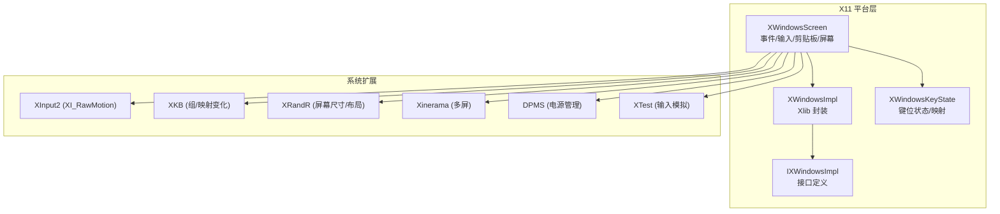
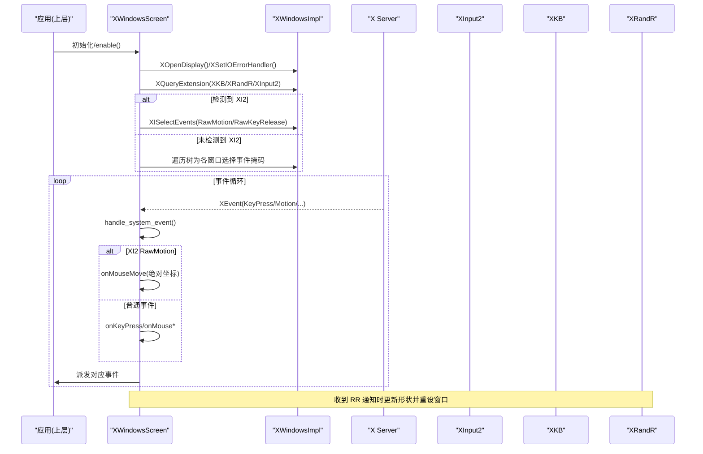
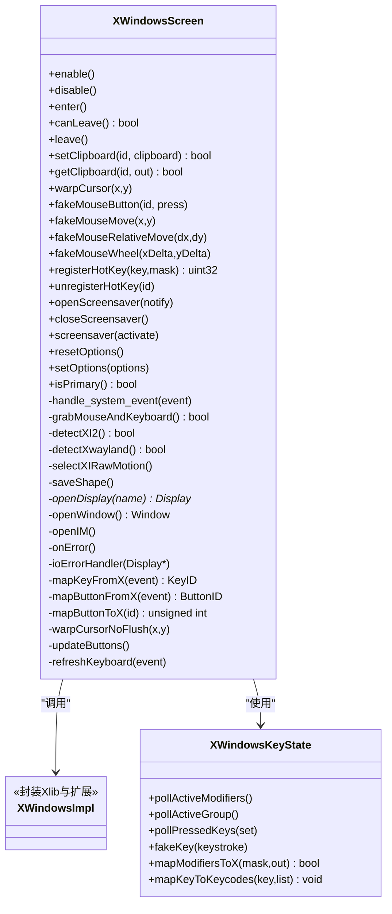
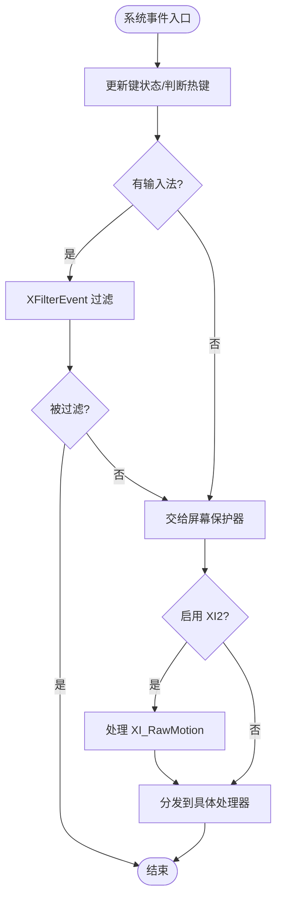
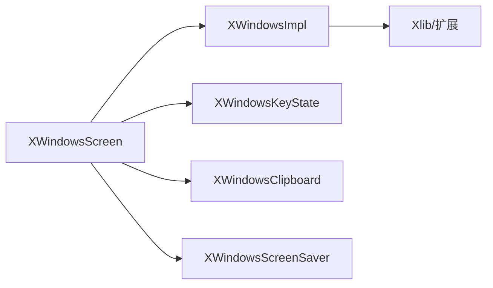

# Linux 平台实现

<cite>
**本文引用的文件**   
- [XWindowsScreen.h](file://src/lib/platform/XWindowsScreen.h)
- [XWindowsScreen.cpp](file://src/lib/platform/XWindowsScreen.cpp)
- [XWindowsImpl.h](file://src/lib/platform/XWindowsImpl.h)
- [XWindowsImpl.cpp](file://src/lib/platform/XWindowsImpl.cpp)
- [IXWindowsImpl.h](file://src/lib/platform/IXWindowsImpl.h)
- [XWindowsKeyState.h](file://src/lib/platform/XWindowsKeyState.h)
- [ArgParser.cpp](file://src/lib/inputleap/ArgParser.cpp)
- [CMakeLists.txt](file://CMakeLists.txt)
</cite>

## 目录
1. [简介](#简介)
2. [项目结构](#项目结构)
3. [核心组件](#核心组件)
4. [架构总览](#架构总览)
5. [详细组件分析](#详细组件分析)
6. [依赖关系分析](#依赖关系分析)
7. [性能考量](#性能考量)
8. [故障排查指南](#故障排查指南)
9. [结论](#结论)
10. [附录](#附录)

## 简介
本文件面向 Input Leap 在 Linux 平台的 X11 实现，重点解析 XWindowsScreen 类如何基于 Xlib、XInput2、XKB、XRandR、Xinerama、DPMS、XTest 等扩展完成输入事件采集、模拟、多显示器管理、剪贴板同步与屏幕保护控制。文档同时涵盖 Wayland 兼容性与现代桌面环境集成考虑（Xwayland 检测、libei/Portal 路径），以及 X11 权限要求、XServer 连接管理与错误处理机制，并提供发行版适配与常见问题解决方案。

## 项目结构
Linux 平台相关代码集中在 src/lib/platform 下，围绕 XWindowsScreen 组织：
- XWindowsScreen：X11 屏幕抽象的核心实现，负责窗口创建、事件循环、输入抓取、热键注册、鼠标/键盘模拟、剪贴板、屏幕保护、多显示器与布局变更监听等。
- XWindowsImpl / IXWindowsImpl：对 Xlib 及扩展 API 的薄封装接口，便于测试与替换。
- XWindowsKeyState：键位状态与映射（含 XKB 组切换）。
- ArgParser：决定使用 X11 还是 libei（Wayland）后端的选择逻辑。
- CMakeLists：X11 与 libei/Portal 构建选项与依赖探测。

图示来源
- [XWindowsScreen.h:39-268](file://src/lib/platform/XWindowsScreen.h#L39-L268)
- [XWindowsScreen.cpp:859-914](file://src/lib/platform/XWindowsScreen.cpp#L859-L914)
- [XWindowsImpl.h:10-149](file://src/lib/platform/XWindowsImpl.h#L10-L149)
- [IXWindowsImpl.h:20-39](file://src/lib/platform/IXWindowsImpl.h#L20-L39)
- [XWindowsKeyState.h:40-171](file://src/lib/platform/XWindowsKeyState.h#L40-L171)

章节来源
- [XWindowsScreen.h:39-268](file://src/lib/platform/XWindowsScreen.h#L39-L268)
- [XWindowsScreen.cpp:859-914](file://src/lib/platform/XWindowsScreen.cpp#L859-L914)
- [XWindowsImpl.h:10-149](file://src/lib/platform/XWindowsImpl.h#L10-L149)
- [IXWindowsImpl.h:20-39](file://src/lib/platform/IXWindowsImpl.h#L20-L39)
- [XWindowsKeyState.h:40-171](file://src/lib/platform/XWindowsKeyState.h#L40-L171)

## 核心组件
- XWindowsScreen：对外暴露 PlatformScreen/IScreen/IPrimaryScreen/ISecondaryScreen 能力；对内维护 Display/Window、XIM/XIC、剪贴板对象、屏幕保护器、XKB/XRandR/Xinerama 状态、热键表、滚动累积器等。
- XWindowsImpl：将 Xlib 调用集中到单一实现类，屏蔽线程安全与错误上下文细节，供上层以统一方式访问。
- XWindowsKeyState：维护 XKB 组、修饰键映射、按键到 KeyID 的转换，支持自动重复态跟踪。
- ArgParser：根据环境变量与命令行参数选择 X11 或 libei 后端。
- CMakeLists：启用 HAVE_X11、探测 X11/ICE/SM、可选 libei/Portal/xkbcommon/glib 等。

章节来源
- [XWindowsScreen.h:39-268](file://src/lib/platform/XWindowsScreen.h#L39-L268)
- [XWindowsImpl.h:10-149](file://src/lib/platform/XWindowsImpl.h#L10-L149)
- [XWindowsKeyState.h:40-171](file://src/lib/platform/XWindowsKeyState.h#L40-L171)
- [ArgParser.cpp:284-321](file://src/lib/inputleap/ArgParser.cpp#L284-L321)
- [CMakeLists.txt:164-186](file://CMakeLists.txt#L164-L186)

## 架构总览
XWindowsScreen 作为 X11 平台适配层，通过 XWindowsImpl 访问 Xlib 与扩展，结合内部组件完成：
- 事件模型：基于 X11 事件驱动，主线程消费事件并分发至上层事件队列。
- 输入设备管理：优先使用 XI2 RawMotion 获取原始指针运动；回退到传统 MotionNotify + 全局事件选择。
- 多显示器支持：利用 XRandR 监听屏幕尺寸/布局变化，必要时调整捕获窗口大小与位置；Xinerama 用于兼容旧式多屏。
- 剪贴板：基于 ICCCM Selection 协议，按类型分派到不同转换器。
- 屏幕保护：通过 DPMS 与 XScreenSaver 扩展控制。
- 热键：使用 XGrabKey 在全局范围拦截组合键。

图示来源
- [XWindowsScreen.cpp:1108-1376](file://src/lib/platform/XWindowsScreen.cpp#L1108-L1376)
- [XWindowsScreen.cpp:2023-2052](file://src/lib/platform/XWindowsScreen.cpp#L2023-L2052)
- [XWindowsScreen.cpp:1982-2001](file://src/lib/platform/XWindowsScreen.cpp#L1982-L2001)

## 详细组件分析

### XWindowsScreen 类设计
- 职责边界
  - 生命周期：构造时初始化 Xlib 线程安全、设置 IO 错误处理器、打开 Display、查询扩展、创建隐藏窗口、初始化剪贴板与屏幕保护器、安装系统事件处理器与平台事件缓冲。
  - 主/从屏差异：主屏负责抓取输入、监听全局事件、注册热键；从屏仅负责模拟输入与光标隐藏。
  - 事件分发：统一入口 handle_system_event 中区分 XI2 RawMotion 与普通事件，再路由到具体处理器。
- 关键成员
  - m_display/m_root/m_window：X11 显示、根窗口与输入捕获窗口。
  - m_keyState：键位状态与映射。
  - m_clipboard[]：剪贴板适配器数组。
  - m_screensaver：屏幕保护控制。
  - m_xkb/m_xrandr/m_xinerama：扩展开关与事件基号。
  - m_isOnScreen/m_xCursor/m_yCursor：光标进入/离开与位置追踪。
  - m_mouseScrollDelta/滚动累积器：将微小滚轮增量聚合为整数步长。
- 重要方法
  - openDisplay/openWindow/openIM：建立连接、创建窗口、初始化输入法上下文。
  - grabMouseAndKeyboard：尝试全局抓取键盘与鼠标，带超时与退避。
  - registerHotKey/unregisterHotKey：基于 XGrabKey 的全局热键注册/注销。
  - warpCursor/fakeMouseMove/fakeMouseButton/fakeMouseWheel：指针与按键模拟。
  - saveShape：读取默认屏幕尺寸，必要时取 Xinerama 首屏中心。
  - detectXI2/detectXwayland/selectXIRawMotion：扩展探测与 XI2 原始运动订阅。
  - onError/ioErrorHandler：X 连接断开时的清理与上报。

图示来源
- [XWindowsScreen.h:39-268](file://src/lib/platform/XWindowsScreen.h#L39-L268)
- [XWindowsScreen.cpp:1932-1979](file://src/lib/platform/XWindowsScreen.cpp#L1932-L1979)
- [XWindowsScreen.cpp:2023-2052](file://src/lib/platform/XWindowsScreen.cpp#L2023-L2052)
- [XWindowsKeyState.h:40-171](file://src/lib/platform/XWindowsKeyState.h#L40-L171)

章节来源
- [XWindowsScreen.h:39-268](file://src/lib/platform/XWindowsScreen.h#L39-L268)
- [XWindowsScreen.cpp:64-163](file://src/lib/platform/XWindowsScreen.cpp#L64-L163)
- [XWindowsScreen.cpp:1932-1979](file://src/lib/platform/XWindowsScreen.cpp#L1932-L1979)
- [XWindowsScreen.cpp:2023-2052](file://src/lib/platform/XWindowsScreen.cpp#L2023-L2052)
- [XWindowsKeyState.h:40-171](file://src/lib/platform/XWindowsKeyState.h#L40-L171)

### X11 事件模型与处理流程
- 事件源
  - 标准 X11 事件：KeyPress/KeyRelease/ButtonPress/ButtonRelease/MotionNotify/MappingNotify/PropertyNotify/SelectionRequest/SelectionClear/SelectionNotify 等。
  - XKB 事件：XkbMapNotify/XkbStateNotify（组切换、映射变化）。
  - XRandR 事件：RRScreenChangeNotify/RRNotify_CrtcChange（屏幕尺寸/布局变化）。
  - XInput2 事件：XI_RawMotion/XI_RawKeyRelease（原始输入）。
- 处理顺序
  - 先更新键状态与判断是否热键。
  - 交由输入法过滤（XFilterEvent），处理合成按键与释放匹配。
  - 交给屏幕保护器处理。
  - 若启用 XI2，则处理 RawMotion 并转换为 MotionNotify 语义。
  - 最后按类型分发到具体处理器。

图示来源
- [XWindowsScreen.cpp:1108-1376](file://src/lib/platform/XWindowsScreen.cpp#L1108-L1376)
- [XWindowsScreen.cpp:1982-2001](file://src/lib/platform/XWindowsScreen.cpp#L1982-L2001)

章节来源
- [XWindowsScreen.cpp:1108-1376](file://src/lib/platform/XWindowsScreen.cpp#L1108-L1376)
- [XWindowsScreen.cpp:1982-2001](file://src/lib/platform/XWindowsScreen.cpp#L1982-L2001)

### 输入设备管理与 XI2 原始运动
- 检测与选择
  - detectXI2 查询 XInputExtension；若可用，selectXIRawMotion 为主设备订阅 XI_RawMotion 与 XI_RawKeyRelease。
  - 否则回退到传统模式：递归为所有窗口选择 PointerMotionMask 与 SubstructureNotifyMask，以捕获全局移动与新窗口创建。
- 原始运动处理
  - 在 handle_system_event 中识别 GenericEventCookie，提取 XI_RawMotion，计算当前指针位置并触发 onMouseMove。
- 优势
  - 避免 WM 或应用对指针事件的干扰，获得更稳定、低延迟的运动数据。

章节来源
- [XWindowsScreen.cpp:2023-2052](file://src/lib/platform/XWindowsScreen.cpp#L2023-L2052)
- [XWindowsScreen.cpp:1195-1223](file://src/lib/platform/XWindowsScreen.cpp#L1195-L1223)
- [XWindowsScreen.cpp:1727-1781](file://src/lib/platform/XWindowsScreen.cpp#L1727-L1781)

### 多显示器支持与布局变更
- 初始形状
  - saveShape 读取默认屏幕宽高与中心；若启用 Xinerama 且存在多个物理屏，则以第一个物理屏中心作为“回弹”锚点。
- 动态变更
  - 监听 XRandR 事件，收到后调用 XRRUpdateConfiguration 更新 Xlib 内部状态，重新计算形状，必要时重设捕获窗口大小与位置，并派发 SCREEN_SHAPE_CHANGED 事件。
- 兼容性
  - 针对 Xinerama 与 XTest 的已知问题，提供配置项以调整行为（如 XTest 对 Xinerama 不敏感时的回退策略）。

章节来源
- [XWindowsScreen.cpp:917-961](file://src/lib/platform/XWindowsScreen.cpp#L917-L961)
- [XWindowsScreen.cpp:1350-1372](file://src/lib/platform/XWindowsScreen.cpp#L1350-L1372)
- [XWindowsScreen.cpp:422-435](file://src/lib/platform/XWindowsScreen.cpp#L422-L435)

### 剪贴板与 ICCCM 协议
- 所有权与请求
  - setClipboard/getClipboard 通过时间戳与 Clipboard::copy 进行数据拷贝；当无数据时通过 open/clear/close 断言所有权。
  - SelectionRequest/SelectionClear/PropertyNotify/DestoryNotify 等事件驱动剪贴板数据传递与清理。
- 类型转换
  - 由 XWindowsClipboard 及其各类转换器（文本、HTML、PNG/JPG/TIF/WEBP 等）完成格式转换与传输。

章节来源
- [XWindowsScreen.cpp:354-385](file://src/lib/platform/XWindowsScreen.cpp#L354-L385)
- [XWindowsScreen.cpp:1245-1301](file://src/lib/platform/XWindowsScreen.cpp#L1245-L1301)
- [XWindowsScreen.cpp:1667-1690](file://src/lib/platform/XWindowsScreen.cpp#L1667-L1690)

### 热键系统与全局抓取
- 注册流程
  - registerHotKey 将高层 KeyID+修饰键映射为 X keycode+modifiers，并对修饰键与非修饰键分别采用不同的抓取策略（覆盖所有可能的 Caps/Num/Scroll 组合）。
  - 失败时回滚已抓取的条目并记录旧 ID 以便复用。
- 事件分发
  - onHotKey 根据按下/释放生成 PRIMARY_SCREEN_HOTKEY_DOWN/UP 事件，忽略重复。

章节来源
- [XWindowsScreen.cpp:520-709](file://src/lib/platform/XWindowsScreen.cpp#L520-L709)
- [XWindowsScreen.cpp:711-739](file://src/lib/platform/XWindowsScreen.cpp#L711-L739)
- [XWindowsScreen.cpp:1459-1485](file://src/lib/platform/XWindowsScreen.cpp#L1459-L1485)

### 输入法与多字节输入
- 初始化
  - openIM 查询 XIM 支持的样式，选择 XIMPreeditNothing 且带 XIMStatusNothing/None 的组合，创建 XIC 并将窗口关联。
- 事件过滤
  - 在 handle_system_event 中优先调用 XFilterEvent，处理合成按键与释放匹配，确保客户端侧按键状态一致。

章节来源
- [XWindowsScreen.cpp:1016-1076](file://src/lib/platform/XWindowsScreen.cpp#L1016-L1076)
- [XWindowsScreen.cpp:1152-1187](file://src/lib/platform/XWindowsScreen.cpp#L1152-L1187)

### 屏幕保护与电源管理
- 控制
  - openScreensaver/closeScreensaver/sreensaver 委托给 XWindowsScreenSaver。
  - enter 中检查 DPMS 能力并在需要时强制唤醒屏幕。
- 事件
  - 屏幕保护器可拦截特定 X 事件以避免误触。

章节来源
- [XWindowsScreen.cpp:387-413](file://src/lib/platform/XWindowsScreen.cpp#L387-L413)
- [XWindowsScreen.cpp:253-264](file://src/lib/platform/XWindowsScreen.cpp#L253-L264)

### Wayland 兼容性与现代桌面集成
- Xwayland 检测
  - detectXwayland 查询 "XWAYLAND" 扩展，若运行于 Xwayland 上会发出警告，提示行为可能不符合预期。
- 后端选择
  - ArgParser.use_x11 依据 WAYLAND_DISPLAY/LIBEI_SOCKET 与命令行参数选择 X11 或 libei 后端；当两者均可用时优先 Wayland/libei。
- 构建支持
  - CMakeLists 探测 libei、xkbcommon、glib、portal 等依赖，编译条件分支决定是否启用 Wayland 路径。

章节来源
- [XWindowsScreen.cpp:2030-2036](file://src/lib/platform/XWindowsScreen.cpp#L2030-L2036)
- [ArgParser.cpp:284-321](file://src/lib/inputleap/ArgParser.cpp#L284-L321)
- [CMakeLists.txt:172-186](file://CMakeLists.txt#L172-L186)

### X11 权限要求与 XServer 连接管理
- 权限
  - 需要能连接到目标 DISPLAY，具备 XTest 扩展（从屏模拟输入）、XInput2（可选）、XKB、XRandR、DPMS 等扩展能力。
  - 全局抓取需满足 XGrabPointer/XGrabKeyboard 的可见性与独占性约束。
- 连接管理
  - 构造时设置 XSetIOErrorHandler，发生 I/O 错误时清理资源并上报 SCREEN_ERROR。
  - 非主屏在 enable 前调用 XTestGrabControl 使模拟不受服务器抓取影响。

章节来源
- [XWindowsScreen.cpp:108-130](file://src/lib/platform/XWindowsScreen.cpp#L108-L130)
- [XWindowsScreen.cpp:1693-1724](file://src/lib/platform/XWindowsScreen.cpp#L1693-L1724)
- [XWindowsScreen.cpp:146-149](file://src/lib/platform/XWindowsScreen.cpp#L146-L149)

## 依赖关系分析
- 组件耦合
  - XWindowsScreen 强依赖 XWindowsImpl 提供的 Xlib 封装；弱依赖 XWindowsKeyState、XWindowsClipboard、XWindowsScreenSaver。
  - XWindowsImpl 直接桥接 Xlib 与扩展头，保持上层与底层解耦。
- 外部依赖
  - X11 核心库与扩展：XTest、XKB、XRandR、Xinerama、DPMS、XInput2。
  - Wayland 路径：libei、xkbcommon、glib、portal（可选）。
- 潜在环依赖
  - 未见明显循环依赖；XWindowsImpl 为叶子实现。

图示来源
- [XWindowsScreen.h:39-268](file://src/lib/platform/XWindowsScreen.h#L39-L268)
- [XWindowsImpl.h:10-149](file://src/lib/platform/XWindowsImpl.h#L10-L149)

章节来源
- [XWindowsScreen.h:39-268](file://src/lib/platform/XWindowsScreen.h#L39-L268)
- [XWindowsImpl.h:10-149](file://src/lib/platform/XWindowsImpl.h#L10-L149)

## 性能考量
- XI2 RawMotion 优先：减少 WM/应用对指针事件的干预，降低抖动与丢帧风险。
- 滚动累积：将小于阈值的滚轮增量聚合，避免过多小事件造成拥塞。
- 事件丢弃优化：在 warpCursor 后主动丢弃匹配的 MotionNotify，避免重复处理。
- 抓取退避：grabMouseAndKeyboard 使用短睡眠与超时，避免忙等导致 CPU 飙升。
- 批量刷新：XFlush 仅在必要时调用，减少网络往返。

[本节为通用指导，无需源码引用]

## 故障排查指南
- 无法连接 X Server
  - 现象：启动时报 XScreenUnavailable 或 XScreenOpenFailure。
  - 排查：确认 DISPLAY 正确、Xserver 运行、XTest 扩展可用（从屏必需）。
- 热键无效
  - 现象：注册热键返回 0 或日志提示失败。
  - 排查：检查修饰键映射、Caps/Num/Scroll 组合是否冲突、其他程序是否抢占抓取。
- 鼠标移动异常或卡顿
  - 现象：在多屏或某些驱动下出现“二次 warp”。
  - 排查：启用/禁用 Xinerama 兼容选项；观察是否运行在 Xwayland 上。
- 输入法字符丢失或按键不匹配
  - 现象：KeyPress 与 KeyRelease keycode 不一致。
  - 排查：确认 XIC 过滤逻辑生效，关注 lastKeycode 匹配与 filtered 集合清理。
- 屏幕保护频繁唤醒
  - 现象：进入/离开屏幕时 DPMS 被强制开启。
  - 排查：检查 enter 中的 DPMSForceLevel 调用是否符合预期。

章节来源
- [XWindowsScreen.cpp:859-914](file://src/lib/platform/XWindowsScreen.cpp#L859-L914)
- [XWindowsScreen.cpp:520-709](file://src/lib/platform/XWindowsScreen.cpp#L520-L709)
- [XWindowsScreen.cpp:1152-1187](file://src/lib/platform/XWindowsScreen.cpp#L1152-L1187)
- [XWindowsScreen.cpp:253-264](file://src/lib/platform/XWindowsScreen.cpp#L253-L264)

## 结论
XWindowsScreen 以 Xlib 为核心，结合 XI2、XKB、XRandR、Xinerama、DPMS、XTest 等扩展，构建了稳健的 Linux 平台输入共享方案。其事件模型清晰、扩展探测灵活、错误处理完备，并通过 ArgParser/CMake 与 Wayland/libei 路径形成良好兼容。在生产环境中建议优先启用 XI2，合理配置热键与抓取策略，并根据发行版特性调整 Xinerama 与输入法行为。

[本节为总结，无需源码引用]

## 附录
- 常见环境变量与参数
  - DISPLAY：指定 X Server 地址。
  - WAYLAND_DISPLAY/LIBEI_SOCKET：用于选择 Wayland/libei 后端。
  - --use-x11/--use-ei/--disable-portal：命令行控制后端选择。
- 发行版适配要点
  - Debian/Ubuntu：安装 xorg-dev、libxkbcommon-dev、libxi-dev、libxrandr-dev、libxinerama-dev、libdpms-dev、libxtst-dev；按需安装 libei、libportal、glib-2.0。
  - Fedora/RHEL：安装对应的 -devel 包与 pkg-config 模块。
  - Arch：安装 xorg-server、xorg-xinput、xorg-xrandr、xorg-xinerama、xorg-libdmx、xorg-libxkbcommon、xorg-libxtst、libei、libportal、glib2。
- 构建与运行
  - 使用 CMake 配置并启用 HAVE_X11；如需 Wayland 路径，启用 INPUTLEAP_BUILD_LIBEI 并链接 portal/glib/xkbcommon。

章节来源
- [ArgParser.cpp:284-321](file://src/lib/inputleap/ArgParser.cpp#L284-L321)
- [CMakeLists.txt:164-186](file://CMakeLists.txt#L164-L186)