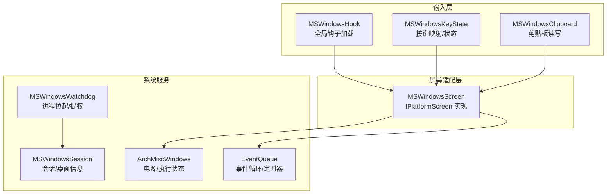
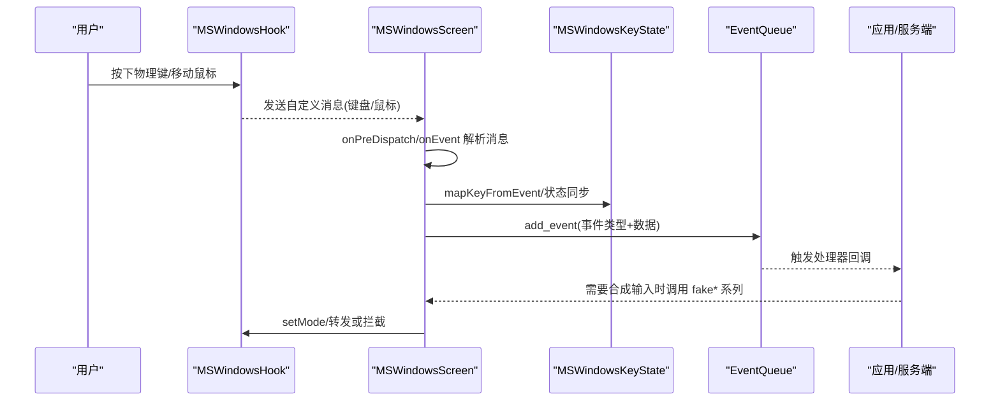
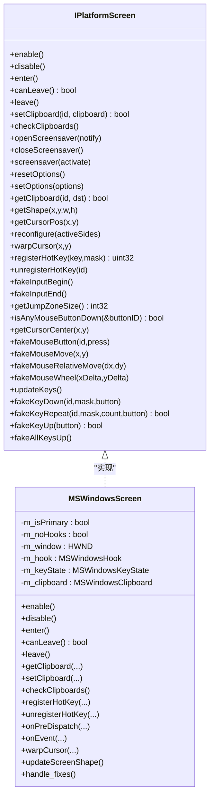
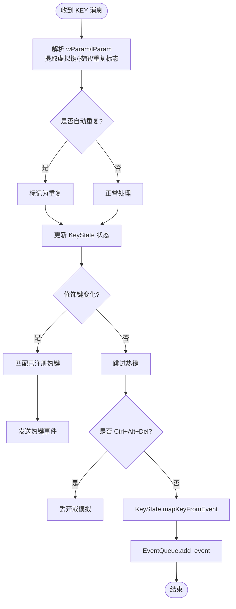
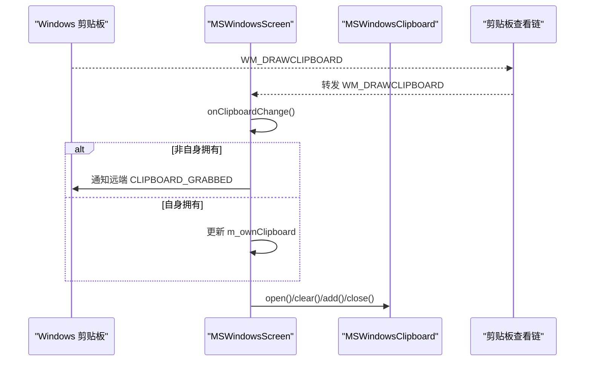
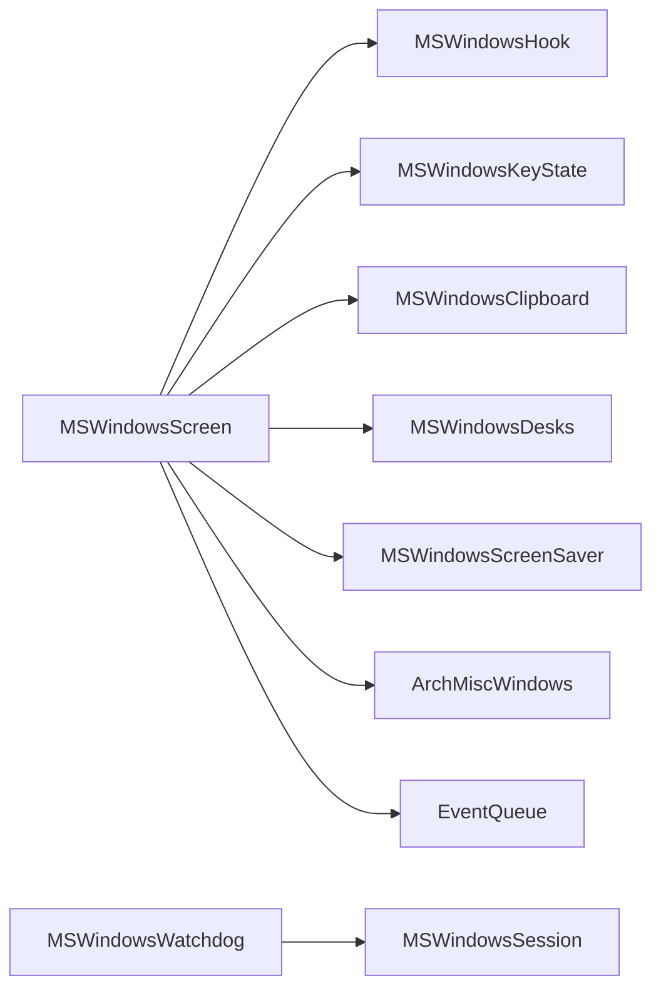

# Windows 平台实现

<cite>
**本文引用的文件**   
- [MSWindowsScreen.h](file://src/lib/platform/MSWindowsScreen.h)
- [MSWindowsScreen.cpp](file://src/lib/platform/MSWindowsScreen.cpp)
- [MSWindowsKeyState.h](file://src/lib/platform/MSWindowsKeyState.h)
- [MSWindowsClipboard.h](file://src/lib/platform/MSWindowsClipboard.h)
- [MSWindowsHook.h](file://src/lib/platform/MSWindowsHook.h)
- [MSWindowsSession.h](file://src/lib/platform/MSWindowsSession.h)
- [MSWindowsWatchdog.cpp](file://src/lib/platform/MSWindowsWatchdog.cpp)
- [IPlatformScreen.h](file://src/lib/inputleap/IPlatformScreen.h)
- [PlatformScreen.h](file://src/lib/inputleap/PlatformScreen.h)
- [ArchMiscWindows.cpp](file://src/lib/arch/win32/ArchMiscWindows.cpp)
- [EventQueue.cpp](file://src/lib/base/EventQueue.cpp)
</cite>

## 目录
1. [简介](#简介)
2. [项目结构](#项目结构)
3. [核心组件](#核心组件)
4. [架构总览](#架构总览)
5. [详细组件分析](#详细组件分析)
6. [依赖关系分析](#依赖关系分析)
7. [性能考虑](#性能考虑)
8. [故障排除指南](#故障排除指南)
9. [结论](#结论)

## 简介
本文件面向 Input Leap 在 Windows 平台的实现，重点阐述 MSWindowsScreen 类对 IPlatformScreen 接口的具体实现，包括 Win32 API 的使用方式、键盘与鼠标事件捕获、剪贴板操作、屏幕检测、系统权限处理、无障碍访问相关细节、热键注册、以及 Windows 版本兼容性与性能优化策略。文末提供 Windows 平台调试与故障排除指南，帮助快速定位问题并提升稳定性。

## 项目结构
Windows 平台相关代码主要位于 src/lib/platform 目录，围绕以下关键模块组织：
- 屏幕抽象与平台适配：MSWindowsScreen（主入口）
- 键盘状态与映射：MSWindowsKeyState
- 剪贴板封装：MSWindowsClipboard
- 全局钩子加载器：MSWindowsHook
- 会话与权限辅助：MSWindowsSession、MSWindowsWatchdog
- 系统杂项能力（电源管理、对话框分发等）：ArchMiscWindows
- 事件队列基础设施：EventQueue

图表来源
- [MSWindowsScreen.h:42-126](file://src/lib/platform/MSWindowsScreen.h#L42-L126)
- [MSWindowsScreen.cpp:800-880](file://src/lib/platform/MSWindowsScreen.cpp#L800-L880)
- [MSWindowsKeyState.h:37-148](file://src/lib/platform/MSWindowsKeyState.h#L37-L148)
- [MSWindowsClipboard.h:35-88](file://src/lib/platform/MSWindowsClipboard.h#L35-L88)
- [MSWindowsHook.h:30-42](file://src/lib/platform/MSWindowsHook.h#L30-L42)
- [MSWindowsSession.h:28-56](file://src/lib/platform/MSWindowsSession.h#L28-L56)
- [MSWindowsWatchdog.cpp:136-157](file://src/lib/platform/MSWindowsWatchdog.cpp#L136-L157)
- [ArchMiscWindows.cpp:357-399](file://src/lib/arch/win32/ArchMiscWindows.cpp#L357-L399)
- [EventQueue.cpp:228-261](file://src/lib/base/EventQueue.cpp#L228-L261)

章节来源
- [MSWindowsScreen.h:42-126](file://src/lib/platform/MSWindowsScreen.h#L42-L126)
- [MSWindowsScreen.cpp:800-880](file://src/lib/platform/MSWindowsScreen.cpp#L800-L880)

## 核心组件
- MSWindowsScreen：实现 IPlatformScreen，负责窗口创建、消息循环桥接、剪贴板监听、屏幕尺寸更新、热键注册、鼠标/键盘事件转发、屏保与电源管理、拖放目标等。
- MSWindowsKeyState：维护虚拟键到内部键 ID 的映射、自动重复检测、修饰键状态跟踪、Ctrl+Alt+Del 模拟等。
- MSWindowsClipboard：基于 Win32 剪贴板 API 的 IClipboard 实现，支持多种格式转换与所有权判断。
- MSWindowsHook：封装底层全局钩子的安装/卸载与模式切换（监视跳区、中继事件等）。
- MSWindowsSession / MSWindowsWatchdog：获取当前会话、用户令牌、进程复制与提权、UIAccess 设置等。
- ArchMiscWindows：SetThreadExecutionState 动态加载、忙状态控制、对话框消息分发。
- EventQueue：事件循环、定时器、缓冲机制，为平台层提供统一事件投递。

章节来源
- [IPlatformScreen.h:37-87](file://src/lib/inputleap/IPlatformScreen.h#L37-L87)
- [PlatformScreen.h:34-41](file://src/lib/inputleap/PlatformScreen.h#L34-L41)
- [MSWindowsScreen.h:42-126](file://src/lib/platform/MSWindowsScreen.h#L42-L126)
- [MSWindowsKeyState.h:37-148](file://src/lib/platform/MSWindowsKeyState.h#L37-L148)
- [MSWindowsClipboard.h:35-88](file://src/lib/platform/MSWindowsClipboard.h#L35-L88)
- [MSWindowsHook.h:30-42](file://src/lib/platform/MSWindowsHook.h#L30-L42)
- [MSWindowsSession.h:28-56](file://src/lib/platform/MSWindowsSession.h#L28-L56)
- [MSWindowsWatchdog.cpp:136-157](file://src/lib/platform/MSWindowsWatchdog.cpp#L136-L157)
- [ArchMiscWindows.cpp:357-399](file://src/lib/arch/win32/ArchMiscWindows.cpp#L357-L399)
- [EventQueue.cpp:228-261](file://src/lib/base/EventQueue.cpp#L228-L261)

## 架构总览
MSWindowsScreen 作为 Windows 平台的核心适配器，通过以下路径完成跨屏输入共享：
- 使用 MSWindowsHook 在全局级别捕获键盘/鼠标事件，按“主屏/副屏”模式分别处理。
- 将原始 Win32 消息转换为内部事件，经 EventQueue 投递给上层逻辑。
- 通过 MSWindowsKeyState 进行键码映射与修饰键状态同步。
- 通过 MSWindowsClipboard 监听剪贴板变化并同步到远端。
- 借助 ArchMiscWindows 控制系统休眠/显示关闭行为，确保连接稳定。
- 通过 MSWindowsSession/Watchdog 处理会话切换、UAC 弹窗、提权与 UIAccess。

图表来源
- [MSWindowsScreen.cpp:930-1005](file://src/lib/platform/MSWindowsScreen.cpp#L930-L1005)
- [MSWindowsScreen.cpp:1071-1198](file://src/lib/platform/MSWindowsScreen.cpp#L1071-L1198)
- [MSWindowsKeyState.h:103-148](file://src/lib/platform/MSWindowsKeyState.h#L103-L148)
- [EventQueue.cpp:228-261](file://src/lib/base/EventQueue.cpp#L228-L261)

## 详细组件分析

### MSWindowsScreen 类与 IPlatformScreen 接口实现
- 生命周期与初始化
  - init/getWindowInstance：保存 HINSTANCE，供后续窗口创建使用。
  - 构造函数中创建后台对象（屏保、桌面、键态）、计算屏幕形状、注册窗口类与窗口、初始化 OLE/DragDrop、安装系统事件处理器与平台事件缓冲。
- 启用/禁用与进入/离开
  - enable/disable：安装剪贴板查看链、启动修复定时器、根据主/副屏设置钩子模式与电源管理。
  - enter/leave：记录前台窗口键盘布局、保存/恢复修饰键状态、在主屏上跳转中心点、在副屏上唤醒显示并抑制屏保。
- 剪贴板
  - getClipboard/setClipboard/checkClipboards：通过 MSWindowsClipboard 读取/写入；检查所有权一致性，避免 NT 剪贴板通知丢失导致的不同步。
- 屏幕几何与光标
  - getShape/getCursorPos/warpCursor：使用 SM_CXVIRTUALSCREEN 等系统指标获取虚拟屏幕范围；warpCursor 会丢弃 warp 前后的本地事件以避免抖动。
- 热键
  - registerHotKey/unregisterHotKey：仅允许 Shift/Ctrl/Alt/Super 组合；失败时回退到内部监听；WM_HOTKEY 被忽略，实际由键盘事件路径识别。
- 鼠标/键盘伪造
  - fakeMouseButton/fakeMouseMove/fakeMouseRelativeMove/fakeMouseWheel/fakeKeyDown/fakeKeyUp/fakeAllKeysUp：委托到底层 desks 或直接注入。
- 消息处理
  - onPreDispatch/onPreDispatchPrimary：过滤系统消息、标记位、热键、鼠标滚轮、WARP 前后标记等。
  - onEvent：处理 WM_DRAWCLIPBOARD/WM_CHANGECBCHAIN/WM_DISPLAYCHANGE/WM_POWERBROADCAST/WM_DEVICECHANGE/WM_SETTINGCHANGE 等。
- 其他
  - updateScreenShape：响应分辨率变化，必要时重设钩子区域。
  - handle_fixes：周期性修复剪贴板链、检测键盘布局组变化。
  - forceShowCursor/updateForceShowCursor：结合 MouseKeys 与系统计数强制显示光标。

图表来源
- [IPlatformScreen.h:37-87](file://src/lib/inputleap/IPlatformScreen.h#L37-L87)
- [MSWindowsScreen.h:42-126](file://src/lib/platform/MSWindowsScreen.h#L42-L126)
- [MSWindowsScreen.cpp:204-269](file://src/lib/platform/MSWindowsScreen.cpp#L204-L269)
- [MSWindowsScreen.cpp:271-364](file://src/lib/platform/MSWindowsScreen.cpp#L271-L364)
- [MSWindowsScreen.cpp:519-541](file://src/lib/platform/MSWindowsScreen.cpp#L519-L541)
- [MSWindowsScreen.cpp:550-653](file://src/lib/platform/MSWindowsScreen.cpp#L550-L653)
- [MSWindowsScreen.cpp:1468-1520](file://src/lib/platform/MSWindowsScreen.cpp#L1468-L1520)
- [MSWindowsScreen.cpp:1539-1566](file://src/lib/platform/MSWindowsScreen.cpp#L1539-L1566)

章节来源
- [MSWindowsScreen.h:42-126](file://src/lib/platform/MSWindowsScreen.h#L42-L126)
- [MSWindowsScreen.cpp:86-186](file://src/lib/platform/MSWindowsScreen.cpp#L86-L186)
- [MSWindowsScreen.cpp:204-269](file://src/lib/platform/MSWindowsScreen.cpp#L204-L269)
- [MSWindowsScreen.cpp:271-364](file://src/lib/platform/MSWindowsScreen.cpp#L271-L364)
- [MSWindowsScreen.cpp:519-541](file://src/lib/platform/MSWindowsScreen.cpp#L519-L541)
- [MSWindowsScreen.cpp:550-653](file://src/lib/platform/MSWindowsScreen.cpp#L550-L653)
- [MSWindowsScreen.cpp:1468-1520](file://src/lib/platform/MSWindowsScreen.cpp#L1468-L1520)
- [MSWindowsScreen.cpp:1539-1566](file://src/lib/platform/MSWindowsScreen.cpp#L1539-L1566)

### 键盘与鼠标事件捕获（Win32 钩子与消息流）
- 钩子模式
  - kHOOK_WATCH_JUMP_ZONE：用于主屏边缘检测与跳转。
  - kHOOK_RELAY_EVENTS：在非主屏时中继事件。
- 消息预处理
  - onPreDispatchPrimary 处理 MARK、KEY、MOUSE_BUTTON、MOUSE_MOVE、MOUSE_WHEEL、PRE_WARP/POST_WARP 等自定义消息。
- 键盘处理
  - onKey：解析 lParam 中的按钮位、是否重复、是否为修饰键；处理 Ctrl+Alt+Del 屏蔽与模拟；调用 KeyState 映射为 KeyID 并发送事件。
- 鼠标处理
  - onMouseButton/onMouseMove/onMouseWheel：维护 m_buttons 状态、计算相对位移、区分主/副屏路径，必要时 warp 回中心并丢弃异常大位移。

图表来源
- [MSWindowsScreen.cpp:1071-1198](file://src/lib/platform/MSWindowsScreen.cpp#L1071-L1198)
- [MSWindowsKeyState.h:103-148](file://src/lib/platform/MSWindowsKeyState.h#L103-L148)
- [EventQueue.cpp:228-261](file://src/lib/base/EventQueue.cpp#L228-L261)

章节来源
- [MSWindowsScreen.cpp:930-1005](file://src/lib/platform/MSWindowsScreen.cpp#L930-L1005)
- [MSWindowsScreen.cpp:1071-1198](file://src/lib/platform/MSWindowsScreen.cpp#L1071-L1198)
- [MSWindowsScreen.cpp:1246-1371](file://src/lib/platform/MSWindowsScreen.cpp#L1246-L1371)
- [MSWindowsKeyState.h:103-148](file://src/lib/platform/MSWindowsKeyState.h#L103-L148)

### 剪贴板操作（Win32 剪贴板链与格式转换）
- 监听与所有权
  - SetClipboardViewer 加入查看链；WM_DRAWCLIPBOARD/WM_CHANGECBCHAIN 处理；定期 checkClipboards 校验所有权一致性。
- 读写流程
  - getClipboard/setClipboard 通过 MSWindowsClipboard 完成；emptyUnowned 可清空但不视为自身拥有。
- 格式转换
  - 通过 IMSWindowsClipboardConverter 扩展多格式支持（文本、HTML、位图等），内部以 GlobalAlloc 分配内存块。

图表来源
- [MSWindowsScreen.cpp:1447-1466](file://src/lib/platform/MSWindowsScreen.cpp#L1447-L1466)
- [MSWindowsScreen.cpp:384-423](file://src/lib/platform/MSWindowsScreen.cpp#L384-L423)
- [MSWindowsClipboard.h:35-88](file://src/lib/platform/MSWindowsClipboard.h#L35-L88)

章节来源
- [MSWindowsScreen.cpp:1447-1466](file://src/lib/platform/MSWindowsScreen.cpp#L1447-L1466)
- [MSWindowsScreen.cpp:384-423](file://src/lib/platform/MSWindowsScreen.cpp#L384-L423)
- [MSWindowsClipboard.h:35-88](file://src/lib/platform/MSWindowsClipboard.h#L35-L88)

### 屏幕检测与多显示器支持
- 使用 SM_CXVIRTUALSCREEN/SM_CYVIRTUALSCREEN 等获取虚拟屏幕边界与中心点。
- 响应 WM_DISPLAYCHANGE 更新形状，必要时重新设置钩子区域。
- 多显示器场景下，保持主屏居中 warp 与相对运动计算。

章节来源
- [MSWindowsScreen.cpp:1539-1555](file://src/lib/platform/MSWindowsScreen.cpp#L1539-L1555)
- [MSWindowsScreen.cpp:1413-1445](file://src/lib/platform/MSWindowsScreen.cpp#L1413-L1445)

### 系统权限、无障碍与热键注册
- 权限与会话
  - MSWindowsSession 获取活动会话 ID、桌面名称；MSWindowsWatchdog 在登录界面/UAC 场景下复制 winlogon.exe 令牌并提权，设置 TokenUIAccess 以改善 GUI 交互。
- 无障碍
  - Windows 侧通过全局钩子与 SetThreadExecutionState 等系统 API 工作，无需 macOS 式的“辅助功能”白名单；但需保证具备足够权限（如 UAC 弹窗期间可能需要提权）。
- 热键注册
  - registerHotKey 仅允许标准修饰键组合；若系统拒绝则降级为内部监听；WM_HOTKEY 消息被忽略，实际由键盘事件路径识别并生成 PRIMARY_SCREEN_HOTKEY_* 事件。

章节来源
- [MSWindowsSession.h:28-56](file://src/lib/platform/MSWindowsSession.h#L28-L56)
- [MSWindowsWatchdog.cpp:136-157](file://src/lib/platform/MSWindowsWatchdog.cpp#L136-L157)
- [MSWindowsScreen.cpp:550-653](file://src/lib/platform/MSWindowsScreen.cpp#L550-L653)
- [MSWindowsScreen.cpp:1200-1244](file://src/lib/platform/MSWindowsScreen.cpp#L1200-L1244)

### 电源管理与屏保
- 副屏进入时防止系统进入省电模式（addBusyState），退出后恢复。
- 监听 WM_POWERBROADCAST 与屏保消息，激活/停用屏保时调整显示电源状态。

章节来源
- [MSWindowsScreen.cpp:226-232](file://src/lib/platform/MSWindowsScreen.cpp#L226-L232)
- [MSWindowsScreen.cpp:1373-1411](file://src/lib/platform/MSWindowsScreen.cpp#L1373-L1411)
- [ArchMiscWindows.cpp:357-399](file://src/lib/arch/win32/ArchMiscWindows.cpp#L357-L399)

## 依赖关系分析
- MSWindowsScreen 依赖：
  - MSWindowsHook：全局钩子安装/模式切换。
  - MSWindowsKeyState：键码映射与修饰键状态。
  - MSWindowsClipboard：剪贴板读写。
  - MSWindowsDesks/MSWindowsScreenSaver：桌面与屏保管理。
  - ArchMiscWindows：电源/执行状态。
  - EventQueue：事件投递与定时器。
- MSWindowsWatchdog 依赖：
  - MSWindowsSession：会话/桌面信息。
  - Win32 安全 API：令牌复制、进程创建、TokenUIAccess 设置。

图表来源
- [MSWindowsScreen.h:42-126](file://src/lib/platform/MSWindowsScreen.h#L42-L126)
- [MSWindowsHook.h:30-42](file://src/lib/platform/MSWindowsHook.h#L30-L42)
- [MSWindowsKeyState.h:37-148](file://src/lib/platform/MSWindowsKeyState.h#L37-L148)
- [MSWindowsClipboard.h:35-88](file://src/lib/platform/MSWindowsClipboard.h#L35-L88)
- [MSWindowsSession.h:28-56](file://src/lib/platform/MSWindowsSession.h#L28-L56)
- [MSWindowsWatchdog.cpp:136-157](file://src/lib/platform/MSWindowsWatchdog.cpp#L136-L157)
- [ArchMiscWindows.cpp:357-399](file://src/lib/arch/win32/ArchMiscWindows.cpp#L357-L399)
- [EventQueue.cpp:228-261](file://src/lib/base/EventQueue.cpp#L228-L261)

章节来源
- [MSWindowsScreen.h:42-126](file://src/lib/platform/MSWindowsScreen.h#L42-L126)
- [MSWindowsHook.h:30-42](file://src/lib/platform/MSWindowsHook.h#L30-L42)
- [MSWindowsKeyState.h:37-148](file://src/lib/platform/MSWindowsKeyState.h#L37-L148)
- [MSWindowsClipboard.h:35-88](file://src/lib/platform/MSWindowsClipboard.h#L35-L88)
- [MSWindowsSession.h:28-56](file://src/lib/platform/MSWindowsSession.h#L28-L56)
- [MSWindowsWatchdog.cpp:136-157](file://src/lib/platform/MSWindowsWatchdog.cpp#L136-L157)
- [ArchMiscWindows.cpp:357-399](file://src/lib/arch/win32/ArchMiscWindows.cpp#L357-L399)
- [EventQueue.cpp:228-261](file://src/lib/base/EventQueue.cpp#L228-L261)

## 性能考虑
- 事件批处理与丢弃
  - warpCursorNoFlush 前后插入 PRE/POST 标记，配合 nextMark/ignore 丢弃过时事件，减少抖动与重复处理。
- 定时器修复
  - 每 1 秒触发 handle_fixes，修复剪贴板链、检测键盘布局组变化，避免长时间运行后的不一致。
- 线程与优先级
  - 使用 EventQueueTimer 驱动周期任务；必要时可通过线程优先级调整降低延迟（参考多线程实现）。
- 高 DPI 与登录屏兼容
  - 在客户端模式下检测到 SetCursorPos 失效时回退到 fakeMouseMove，避免死锁或错位。

章节来源
- [MSWindowsScreen.cpp:1468-1520](file://src/lib/platform/MSWindowsScreen.cpp#L1468-L1520)
- [MSWindowsScreen.cpp:1557-1566](file://src/lib/platform/MSWindowsScreen.cpp#L1557-L1566)
- [EventQueue.cpp:228-261](file://src/lib/base/EventQueue.cpp#L228-L261)

## 故障排除指南
- 无法离开屏幕/鼠标卡住
  - canLeave 中尝试 GetCursorPos 失败时会提示“Windows 安全禁用了关键函数”，此时应检查当前会话权限或是否处于登录/UAC 界面。
- 剪贴板不同步
  - 检查 WM_DRAWCLIPBOARD/WM_CHANGECBCHAIN 处理是否正确；必要时重启系统以重建查看链；确认 is_owned_by_us 与 m_ownClipboard 一致。
- 热键无效
  - 确认仅使用支持的修饰键组合；若 RegisterHotKey 失败，将降级为内部监听，但仍可能与其他程序冲突。
- 分辨率变化后行为异常
  - 确认 WM_DISPLAYCHANGE 触发了 updateScreenShape 并更新了钩子区域。
- 副屏无鼠标/无法返回
  - 检查 warpCursorNoFlush 的回退逻辑与 bogusZoneSize 阈值；在高 DPI 或登录屏环境下优先使用 fakeMouseMove。
- 进程立即退出
  - Watchdog 启动失败时会输出退出码与错误信息，检查令牌复制、UIAccess 设置与命令参数。

章节来源
- [MSWindowsScreen.cpp:304-314](file://src/lib/platform/MSWindowsScreen.cpp#L304-L314)
- [MSWindowsScreen.cpp:1447-1466](file://src/lib/platform/MSWindowsScreen.cpp#L1447-L1466)
- [MSWindowsScreen.cpp:550-653](file://src/lib/platform/MSWindowsScreen.cpp#L550-L653)
- [MSWindowsScreen.cpp:1413-1445](file://src/lib/platform/MSWindowsScreen.cpp#L1413-L1445)
- [MSWindowsScreen.cpp:1468-1520](file://src/lib/platform/MSWindowsScreen.cpp#L1468-L1520)
- [MSWindowsWatchdog.cpp:304-322](file://src/lib/platform/MSWindowsWatchdog.cpp#L304-L322)

## 结论
MSWindowsScreen 通过对 Win32 API 的系统化封装，实现了稳定的跨屏输入共享。其设计在事件捕获、剪贴板同步、屏幕几何管理、电源与屏保控制、热键注册等方面充分考虑了 Windows 的特性与兼容性。配合 MSWindowsKeyState、MSWindowsClipboard、MSWindowsHook、MSWindowsSession/Watchdog 等组件，形成了完整且健壮的 Windows 平台实现。建议在生产环境中关注权限与 UAC 场景、高 DPI 与登录屏兼容、以及剪贴板链稳定性，以获得最佳体验。