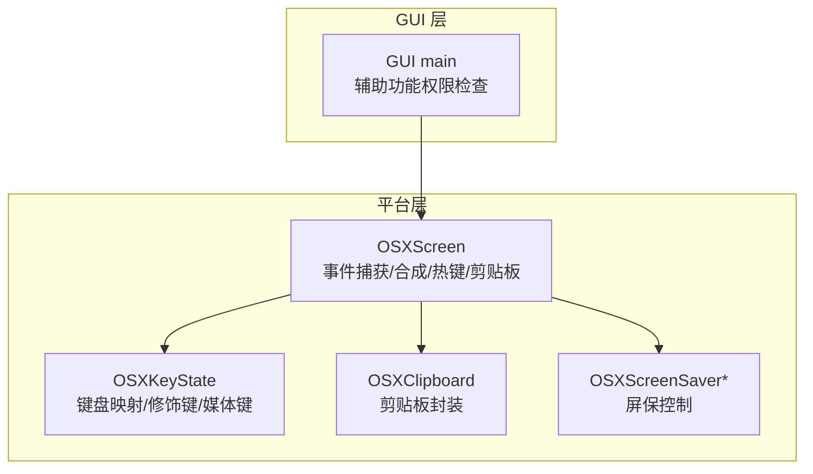
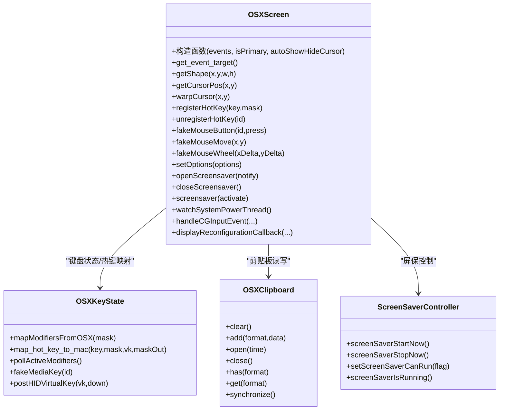
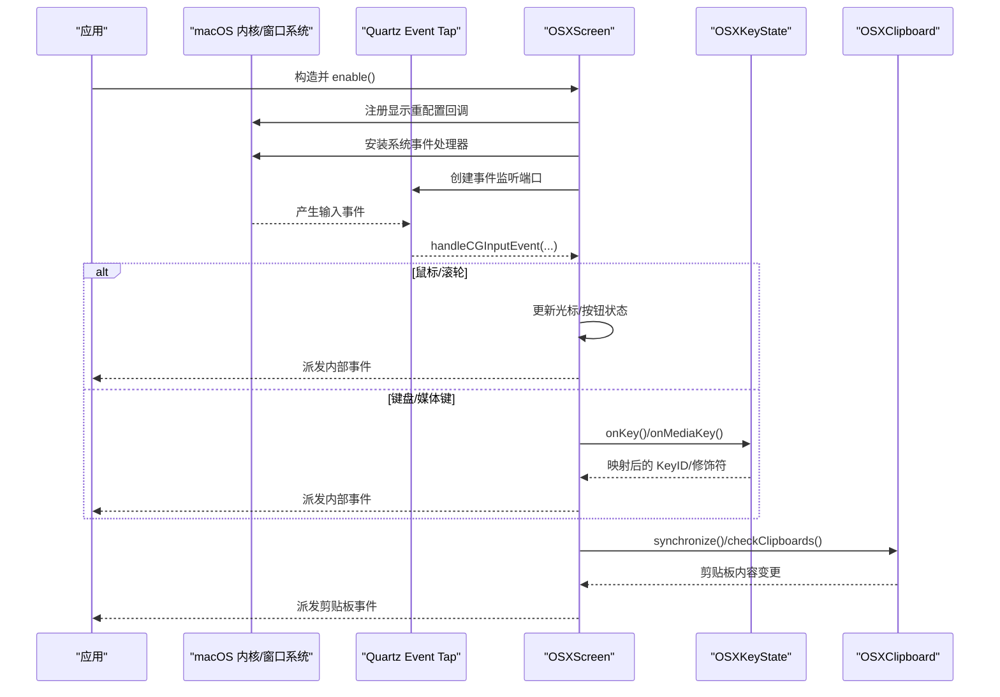
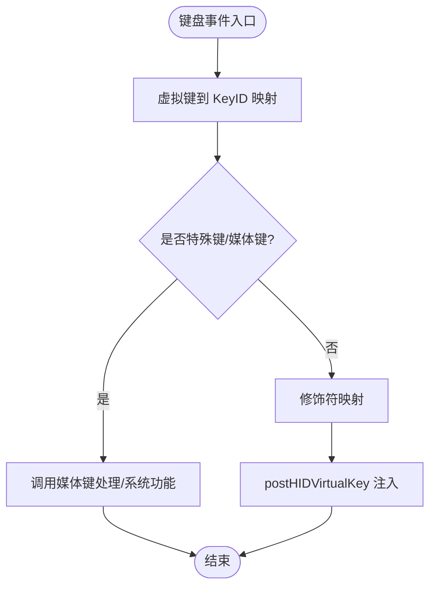
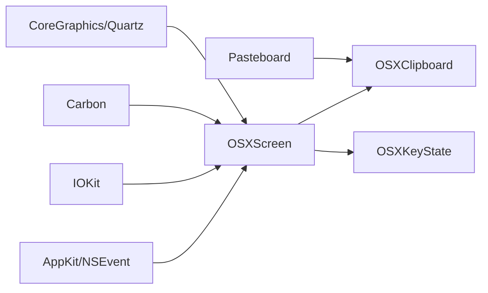

# macOS 平台实现

<cite>
**本文引用的文件**   
- [OSXScreen.h](file://src/lib/platform/OSXScreen.h)
- [OSXScreen.mm](file://src/lib/platform/OSXScreen.mm)
- [OSXKeyState.h](file://src/lib/platform/OSXKeyState.h)
- [OSXKeyState.cpp](file://src/lib/platform/OSXKeyState.cpp)
- [OSXClipboard.h](file://src/lib/platform/OSXClipboard.h)
- [OSXScreenSaverControl.h](file://src/lib/platform/OSXScreenSaverControl.h)
- [OSXScreenSaverUtil.mm](file://src/lib/platform/OSXScreenSaverUtil.mm)
- [main.cpp](file://src/gui/src/main.cpp)
</cite>

## 目录
1. [简介](#简介)
2. [项目结构](#项目结构)
3. [核心组件](#核心组件)
4. [架构总览](#架构总览)
5. [详细组件分析](#详细组件分析)
6. [依赖关系分析](#依赖关系分析)
7. [性能与行为特性](#性能与行为特性)
8. [故障诊断与排错](#故障诊断与排错)
9. [结论](#结论)
10. [附录：签名与分发注意事项](#附录签名与分发注意事项)

## 简介
本文件面向 Input Leap 在 macOS 平台的实现，重点围绕 OSXScreen 类及其相关子系统，系统阐述基于 Carbon、Cocoa、Core Graphics 与 Quartz Event Services 的输入事件模型、辅助功能权限、多显示器管理、电源管理与屏幕保护控制等关键能力。文档同时提供 Accessibility API 使用指南、权限请求流程、错误诊断方法，以及应用签名与分发的实践建议。

## 项目结构
macOS 平台相关代码主要位于 src/lib/platform 下，GUI 侧对辅助功能权限的检查逻辑位于 GUI 入口中。

图表来源
- [OSXScreen.h:53-100](file://src/lib/platform/OSXScreen.h#L53-L100)
- [OSXKeyState.h:38-100](file://src/lib/platform/OSXKeyState.h#L38-L100)
- [OSXClipboard.h:32-56](file://src/lib/platform/OSXClipboard.h#L32-L56)
- [OSXScreenSaverControl.h:24-53](file://src/lib/platform/OSXScreenSaverControl.h#L24-L53)
- [main.cpp:175-213](file://src/gui/src/main.cpp#L175-L213)

章节来源
- [OSXScreen.h:53-100](file://src/lib/platform/OSXScreen.h#L53-L100)
- [OSXKeyState.h:38-100](file://src/lib/platform/OSXKeyState.h#L38-L100)
- [OSXClipboard.h:32-56](file://src/lib/platform/OSXClipboard.h#L32-L56)
- [OSXScreenSaverControl.h:24-53](file://src/lib/platform/OSXScreenSaverControl.h#L24-L53)
- [main.cpp:175-213](file://src/gui/src/main.cpp#L175-L213)

## 核心组件
- OSXScreen：macOS 平台屏幕抽象的核心实现，负责鼠标/键盘事件注入、全局热键、显示重配置回调、电源状态监听、剪贴板同步、拖拽目标获取等。
- OSXKeyState：键盘状态与映射，处理修饰键变化、虚拟键到 KeyID 的转换、媒体键支持、HID 级按键注入。
- OSXClipboard：基于 Pasteboard 的剪贴板封装，提供格式转换器接口以适配文本/HTML/BMP/UTF16 等。
- 屏保控制：通过 ScreenSaverController 私有协议与工具函数启用/停止屏保。

章节来源
- [OSXScreen.h:53-100](file://src/lib/platform/OSXScreen.h#L53-L100)
- [OSXKeyState.h:38-100](file://src/lib/platform/OSXKeyState.h#L38-L100)
- [OSXClipboard.h:32-56](file://src/lib/platform/OSXClipboard.h#L32-L56)
- [OSXScreenSaverControl.h:24-53](file://src/lib/platform/OSXScreenSaverControl.h#L24-L53)

## 架构总览
下图展示了 OSXScreen 与其依赖组件之间的交互关系，包括事件源（Quartz Event Tap）、键盘状态、剪贴板与屏保控制器。

图表来源
- [OSXScreen.h:53-100](file://src/lib/platform/OSXScreen.h#L53-L100)
- [OSXKeyState.h:38-100](file://src/lib/platform/OSXKeyState.h#L38-L100)
- [OSXClipboard.h:32-56](file://src/lib/platform/OSXClipboard.h#L32-L56)
- [OSXScreenSaverControl.h:24-53](file://src/lib/platform/OSXScreenSaverControl.h#L24-L53)

## 详细组件分析

### OSXScreen 类：事件模型与系统集成
- 事件捕获与分发
  - 使用 Quartz Event Tap 拦截系统输入事件（鼠标移动、点击、滚轮、按键、媒体键等），并在回调中将事件转换为内部事件类型，交由上层处理。
  - 针对超时禁用或用户输入禁用的事件 tap，进行自动恢复与日志记录。
- 鼠标与滚轮
  - 维护按钮状态机，支持拖拽计时器与双击合并策略；将 CGEvent 坐标与滚动增量映射为内部值。
- 键盘与全局热键
  - 通过 Carbon Event HotKey 注册全局热键，并支持仅修饰键组合的特殊处理路径。
  - 与 OSXKeyState 协作完成 KeyID 到 Mac 虚拟键码及修饰符的映射。
- 多显示器管理
  - 注册 CGDisplayReconfigurationCallback，动态更新屏幕形状与中心点，响应分辨率/布局变更。
- 电源与睡眠
  - 启动独立线程监听 IOKit 电源消息，协调进入/唤醒生命周期，必要时立即投递挂起事件并允许电源变更。
- 剪贴板
  - 集成 OSXClipboard，周期性检测剪贴板变化并通过事件队列广播。
- 辅助功能权限
  - 作为主屏服务器时，初始化阶段检查 AXIsProcessTrusted（或旧版 AXAPIEnabled），未授权则抛出异常提示用户在系统设置中开启。

图表来源
- [OSXScreen.mm:102-169](file://src/lib/platform/OSXScreen.mm#L102-L169)
- [OSXScreen.mm:1872-1913](file://src/lib/platform/OSXScreen.mm#L1872-L1913)
- [OSXScreen.h:191-205](file://src/lib/platform/OSXScreen.h#L191-L205)
- [OSXKeyState.h:95-101](file://src/lib/platform/OSXKeyState.h#L95-L101)
- [OSXClipboard.h:32-56](file://src/lib/platform/OSXClipboard.h#L32-L56)

章节来源
- [OSXScreen.mm:102-169](file://src/lib/platform/OSXScreen.mm#L102-L169)
- [OSXScreen.mm:1872-1913](file://src/lib/platform/OSXScreen.mm#L1872-L1913)
- [OSXScreen.h:191-205](file://src/lib/platform/OSXScreen.h#L191-L205)

### OSXKeyState：键盘映射与 HID 注入
- 修饰键映射
  - 将 CGEvent 修饰符标志映射为内部 KeyModifierMask，并兼容旧式 Carbon 修饰符。
- 键码映射
  - 维护虚拟键到 KeyID 的映射表，包含方向键、功能键、数字小键盘、修饰键、媒体键等。
- 媒体键与特殊键
  - 支持亮度调节、Mission Control、Launchpad 等系统媒体键。
- HID 级注入
  - 通过 postHIDVirtualKey 向底层 HID 客户端发送按键事件，绕过窗口管理器层级，提高可靠性。

图表来源
- [OSXKeyState.cpp:148-165](file://src/lib/platform/OSXKeyState.cpp#L148-L165)
- [OSXKeyState.cpp:167-200](file://src/lib/platform/OSXKeyState.cpp#L167-L200)
- [OSXKeyState.h:95-101](file://src/lib/platform/OSXKeyState.h#L95-L101)

章节来源
- [OSXKeyState.cpp:148-165](file://src/lib/platform/OSXKeyState.cpp#L148-L165)
- [OSXKeyState.cpp:167-200](file://src/lib/platform/OSXKeyState.cpp#L167-L200)
- [OSXKeyState.h:95-101](file://src/lib/platform/OSXKeyState.h#L95-L101)

### 剪贴板与格式转换
- OSXClipboard 封装了 Pasteboard 的打开/关闭、数据写入/读取、时间戳与同步机制。
- 通过 IOSXClipboardConverter 接口扩展不同格式（文本、HTML、BMP、UTF16、任意位图/文本）的编解码。

章节来源
- [OSXClipboard.h:32-56](file://src/lib/platform/OSXClipboard.h#L32-L56)

### 屏保控制
- 通过 ScreenSaverController 私有协议暴露的方法控制屏保运行状态，工具函数封装了启用/禁用/启动/停止/查询等操作。

章节来源
- [OSXScreenSaverControl.h:24-53](file://src/lib/platform/OSXScreenSaverControl.h#L24-L53)
- [OSXScreenSaverUtil.mm:47-87](file://src/lib/platform/OSXScreenSaverUtil.mm#L47-L87)

### 辅助功能权限与 GUI 引导
- 运行时检查
  - 新版本（10.9+）使用 AXIsProcessTrusted，旧版本使用 AXAPIEnabled。
- GUI 引导
  - GUI 入口在 macOS 上调用 AXIsProcessTrustedWithOptions 弹出系统权限对话框，引导用户开启“辅助功能”访问。

章节来源
- [OSXScreen.mm:108-122](file://src/lib/platform/OSXScreen.mm#L108-L122)
- [main.cpp:175-213](file://src/gui/src/main.cpp#L175-L213)

## 依赖关系分析
- 直接依赖
  - CoreGraphics/Quartz：事件捕获与光标操作。
  - Carbon：全局热键、旧式修饰符兼容。
  - IOKit：电源管理与系统事件。
  - AppKit/NSEvent：部分 Cocoa 交互。
  - Pasteboard：剪贴板数据交换。
- 间接依赖
  - 事件队列与线程模型：用于缓冲与异步处理系统事件。
  - 日志与配置：用于调试与可观测性。

图表来源
- [OSXScreen.h:27-33](file://src/lib/platform/OSXScreen.h#L27-L33)
- [OSXScreen.mm:40-45](file://src/lib/platform/OSXScreen.mm#L40-L45)
- [OSXClipboard.h:23-26](file://src/lib/platform/OSXClipboard.h#L23-L26)

章节来源
- [OSXScreen.h:27-33](file://src/lib/platform/OSXScreen.h#L27-L33)
- [OSXScreen.mm:40-45](file://src/lib/platform/OSXScreen.mm#L40-L45)
- [OSXClipboard.h:23-26](file://src/lib/platform/OSXClipboard.h#L23-L26)

## 性能与行为特性
- 事件节流与合并
  - 双击合并与拖拽计时器减少高频事件风暴，提升跨屏体验。
- 事件 tap 健壮性
  - 自动恢复被超时或用户输入禁用的事件 tap，避免长时间无输入导致的事件丢失。
- 电源事件即时性
  - 在确认睡眠时立即投递挂起事件，确保资源清理及时。
- 剪贴板同步
  - 周期性检查与序列号机制降低重复处理开销。

[本节为通用性能讨论，不直接分析具体文件]

## 故障诊断与排错
- 辅助功能权限问题
  - 症状：作为主屏服务器时初始化失败，提示需开启辅助功能。
  - 排查：在 GUI 中触发权限检查并弹窗；或在系统设置中手动勾选应用。
- 事件 tap 被禁用
  - 症状：日志中出现“quartz event tap was disabled by timeout/user input”。
  - 处理：自动重新启用；若持续出现，检查是否有其他应用抢占输入监控。
- 热键注册失败
  - 症状：日志警告无法注册热键。
  - 处理：检查冲突快捷键、权限不足或系统限制。
- 屏保控制异常
  - 症状：无法启动/停止屏保。
  - 处理：确认私有 API 可用性与当前会话权限。

章节来源
- [OSXScreen.mm:108-122](file://src/lib/platform/OSXScreen.mm#L108-L122)
- [OSXScreen.mm:1872-1913](file://src/lib/platform/OSXScreen.mm#L1872-L1913)
- [OSXScreen.mm:287-339](file://src/lib/platform/OSXScreen.mm#L287-L339)
- [OSXScreenSaverUtil.mm:47-87](file://src/lib/platform/OSXScreenSaverUtil.mm#L47-L87)

## 结论
OSXScreen 通过 Quartz Event Tap、Carbon 热键、CoreGraphics 与 IOKit 的组合，实现了稳定高效的跨设备输入共享。配合 OSXKeyState 的键盘映射与 HID 注入、OSXClipboard 的多格式剪贴板支持，以及屏保与电源管理，整体架构清晰、职责分明。建议在部署时重点关注辅助功能权限与事件 tap 的健壮性，以获得最佳用户体验。

[本节为总结性内容，不直接分析具体文件]

## 附录：签名与分发注意事项
- 沙盒与辅助功能
  - 沙盒化应用默认无法访问辅助功能 API；如需使用，应遵循 Apple 的“辅助功能权限”流程，并在 Info.plist 中声明必要权限。
- 代码签名与公证
  - 使用有效开发者证书进行代码签名，并进行公证以提升用户信任度。
- 最小权限原则
  - 仅在需要时请求辅助功能权限；在 GUI 中提供清晰的引导与说明。
- 兼容性
  - 针对不同 macOS 版本采用条件编译与符号弱链接策略，保证在新旧 SDK 下的构建与运行稳定性。

[本节为通用指导，不直接分析具体文件]