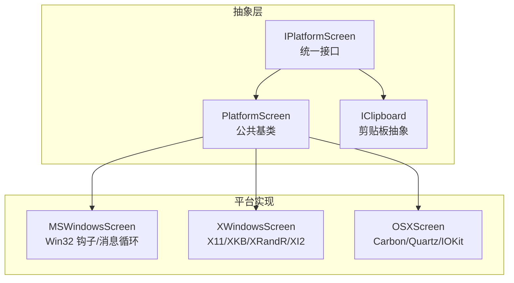
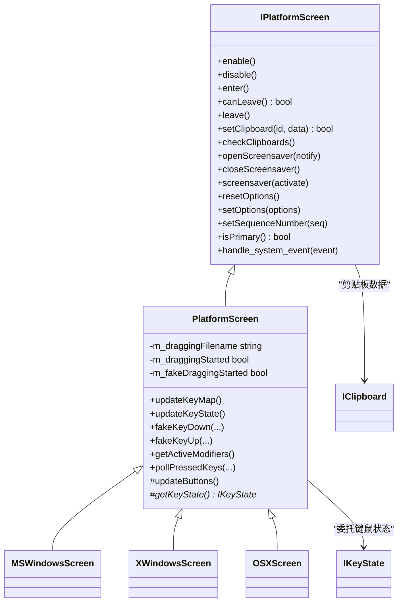
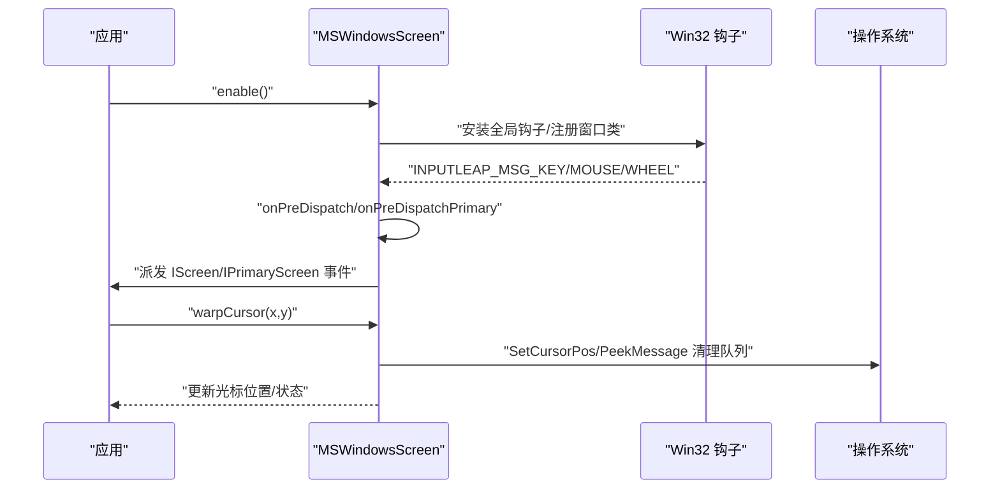
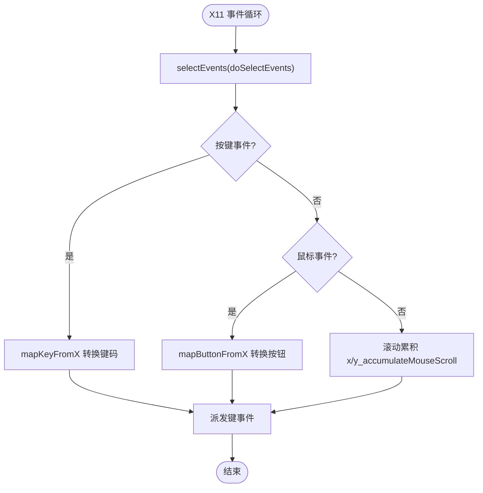
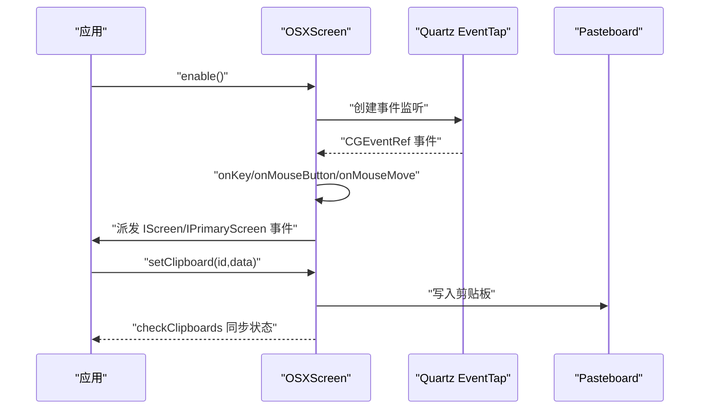
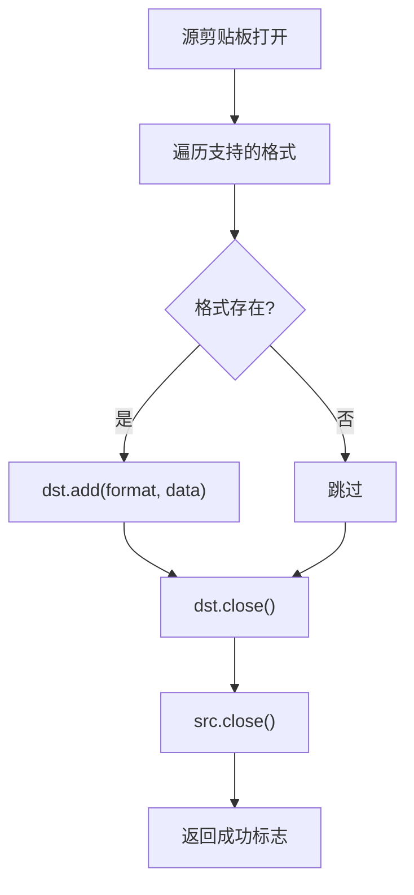
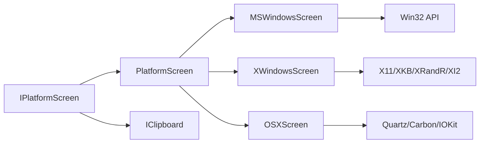

# 平台抽象层设计

<cite>
**本文引用的文件**   
- [IPlatformScreen.h](file://src/lib/inputleap/IPlatformScreen.h)
- [PlatformScreen.h](file://src/lib/inputleap/PlatformScreen.h)
- [PlatformScreen.cpp](file://src/lib/inputleap/PlatformScreen.cpp)
- [MSWindowsScreen.h](file://src/lib/platform/MSWindowsScreen.h)
- [XWindowsScreen.h](file://src/lib/platform/XWindowsScreen.h)
- [OSXScreen.h](file://src/lib/platform/OSXScreen.h)
- [IClipboard.h](file://src/lib/inputleap/IClipboard.h)
- [IClipboard.cpp](file://src/lib/inputleap/IClipboard.cpp)
</cite>

## 目录
1. [引言](#引言)
2. [项目结构](#项目结构)
3. [核心组件](#核心组件)
4. [架构总览](#架构总览)
5. [详细组件分析](#详细组件分析)
6. [依赖关系分析](#依赖关系分析)
7. [性能考量](#性能考量)
8. [故障排查指南](#故障排查指南)
9. [结论](#结论)
10. [附录](#附录)

## 引言
本文件面向 Input Leap 的平台抽象层，聚焦 IPlatformScreen 接口的设计与实现策略，解释跨平台输入处理的统一抽象方式。文档深入剖析 Windows、Linux（X11）和 macOS 三大平台的特定实现差异，涵盖 API 调用、权限处理与系统集成方式；并阐述屏幕检测、鼠标键盘事件捕获与剪贴板操作的跨平台实现路径。文末提供平台兼容性矩阵、移植指南与新平台支持开发指导，帮助读者快速理解并扩展平台能力。

## 项目结构
Input Leap 将平台相关代码集中在 src/lib/platform 下，通过统一的输入抽象层 inputleap 暴露稳定接口。核心层次如下：
- 抽象接口层：IPlatformScreen 定义跨平台屏幕的通用能力（启用/禁用、进入/离开、剪贴板、屏保、选项、系统事件等）。
- 基类实现：PlatformScreen 提供公共逻辑与默认行为，减少各平台重复实现。
- 平台实现：MSWindowsScreen、XWindowsScreen、OSXScreen 分别对接 Win32、X11、Carbon/Quartz 等平台 API。
- 剪贴板抽象：IClipboard 提供多格式数据读写与拷贝工具，屏蔽平台差异。

图表来源
- [IPlatformScreen.h:37-185](file://src/lib/inputleap/IPlatformScreen.h#L37-L185)
- [PlatformScreen.h:34-91](file://src/lib/inputleap/PlatformScreen.h#L34-L91)
- [MSWindowsScreen.h:42-131](file://src/lib/platform/MSWindowsScreen.h#L42-L131)
- [XWindowsScreen.h:39-94](file://src/lib/platform/XWindowsScreen.h#L39-L94)
- [OSXScreen.h:53-109](file://src/lib/platform/OSXScreen.h#L53-L109)
- [IClipboard.h:152-177](file://src/lib/inputleap/IClipboard.h#L152-L177)

章节来源
- [IPlatformScreen.h:37-185](file://src/lib/inputleap/IPlatformScreen.h#L37-L185)
- [PlatformScreen.h:34-91](file://src/lib/inputleap/PlatformScreen.h#L34-L91)
- [MSWindowsScreen.h:42-131](file://src/lib/platform/MSWindowsScreen.h#L42-L131)
- [XWindowsScreen.h:39-94](file://src/lib/platform/XWindowsScreen.h#L39-L94)
- [OSXScreen.h:53-109](file://src/lib/platform/OSXScreen.h#L53-L109)
- [IClipboard.h:152-177](file://src/lib/inputleap/IClipboard.h#L152-L177)

## 核心组件
- IPlatformScreen：定义所有平台必须实现的屏幕抽象，包括生命周期管理（enable/disable/enter/leave）、主从屏职责（IScreen/IPrimaryScreen/ISecondaryScreen）、键鼠状态（IKeyState）、剪贴板同步、屏保控制、选项重置与应用、序列号设置、拖拽状态与目标、系统事件处理等。
- PlatformScreen：为 IPlatformScreen 提供通用实现骨架，转发大部分 IKeyState 操作到具体 KeyState 对象，维护拖拽状态与媒体键模拟等默认行为，要求子类实现 updateButtons() 与 getKeyState()。
- 平台 Screen 实现：各自封装平台特定的输入捕获、事件分发、热键注册、光标移动、滚轮处理、剪贴板监听、屏保控制等。

章节来源
- [IPlatformScreen.h:37-185](file://src/lib/inputleap/IPlatformScreen.h#L37-L185)
- [PlatformScreen.h:34-91](file://src/lib/inputleap/PlatformScreen.h#L34-L91)
- [PlatformScreen.cpp:25-130](file://src/lib/inputleap/PlatformScreen.cpp#L25-L130)

## 架构总览
下图展示 IPlatformScreen 及其主要派生类的关系，以及它们如何组合 IKeyState 与剪贴板抽象完成跨平台输入与数据共享。

图表来源
- [IPlatformScreen.h:37-185](file://src/lib/inputleap/IPlatformScreen.h#L37-L185)
- [PlatformScreen.h:34-91](file://src/lib/inputleap/PlatformScreen.h#L34-L91)
- [MSWindowsScreen.h:42-131](file://src/lib/platform/MSWindowsScreen.h#L42-L131)
- [XWindowsScreen.h:39-94](file://src/lib/platform/XWindowsScreen.h#L39-L94)
- [OSXScreen.h:53-109](file://src/lib/platform/OSXScreen.h#L53-L109)
- [IClipboard.h:152-177](file://src/lib/inputleap/IClipboard.h#L152-L177)

## 详细组件分析

### IPlatformScreen 接口设计与职责
- 生命周期与焦点切换：enable/disable 负责初始化/释放平台资源；enter/canLeave/leave 用于屏幕间切换时的前置检查与清理。
- 主屏与从屏职责：主屏需安装全局钩子/监听器、上报系统事件、维护键鼠状态；从屏需合成输入事件并隐藏本地光标。
- 剪贴板：setClipboard/checkClipboards 配合序列号保证一致性；平台侧需监听系统剪贴板变化并上报。
- 屏保：open/close/screensaver 支持通知模式或强制开关，不同平台对权限与回调机制不同。
- 选项与序列号：resetOptions/setOptions 允许运行时调整行为；setSequenceNumber 用于剪贴板事件去重与顺序。
- 拖拽：dragging 状态与目标路径管理，便于跨屏文件传输。
- 系统事件：handle_system_event 作为统一入口，平台在构造时注册系统事件处理器并在析构中移除。

章节来源
- [IPlatformScreen.h:37-185](file://src/lib/inputleap/IPlatformScreen.h#L37-L185)

### PlatformScreen 基类实现要点
- 键鼠状态转发：updateKeyMap/updateKeyState 委托给 getKeyState() 返回的具体实现；updateButtons() 由子类更新内部按钮映射。
- 按键模拟：fakeKeyDown/fakeKeyRepeat/fakeKeyUp/fakeAllKeysUp/fakeCtrlAltDel 均转发至 KeyState。
- 拖拽状态：isDraggingStarted/isFakeDraggingStarted/getDraggingFilename 等提供基础状态访问。
- 媒体键：fakeMediaKey 默认返回 false，平台可覆盖以支持特殊功能键。

章节来源
- [PlatformScreen.h:34-91](file://src/lib/inputleap/PlatformScreen.h#L34-L91)
- [PlatformScreen.cpp:25-130](file://src/lib/inputleap/PlatformScreen.cpp#L25-L130)

### Windows 平台实现（MSWindowsScreen）
- 事件捕获：使用 Win32 钩子与窗口消息循环，预分派 onPreDispatch/onPreDispatchPrimary 拦截系统消息，再路由到 onKey/onMouseButton/onMouseMove/onMouseWheel 等处理函数。
- 热键：registerHotKey/unregisterHotKey 基于系统热键 API，维护 HotKeyMap 与旧 ID 回收。
- 光标与移动：warpCursor/warpCursorNoFlush 结合保存上次位置计算增量，必要时清空队列消息避免重复。
- 剪贴板：作为剪贴板查看链节点，监听变更并通过 sendClipboardEvent 上报。
- 屏保：封装于 MSWindowsScreenSaver，支持通知与强制激活/关闭。
- 权限与集成：需要提升权限以安装全局钩子；桌面切换场景通过 MSWindowsDesks 协调。

图表来源
- [MSWindowsScreen.h:80-131](file://src/lib/platform/MSWindowsScreen.h#L80-L131)
- [MSWindowsScreen.h:155-175](file://src/lib/platform/MSWindowsScreen.h#L155-L175)

章节来源
- [MSWindowsScreen.h:42-131](file://src/lib/platform/MSWindowsScreen.h#L42-L131)
- [MSWindowsScreen.h:155-175](file://src/lib/platform/MSWindowsScreen.h#L155-L175)

### Linux/X11 平台实现（XWindowsScreen）
- 事件捕获：基于 Xlib/XKB/XRandR/XI2，selectEvents/doSelectEvents 选择事件，onKeyPress/onKeyRelease/onMouseMove 等处理函数解析键鼠事件。
- 滚动累积：x_accumulateMouseScroll/y_accumulateMouseScroll 聚合小于最小阈值的滚动增量，达到阈值后派发滚动事件。
- 热键：registerHotKey/unregisterHotKey 使用 XGrabKey 等机制，维护 HotKeyMap 与旧 ID 列表。
- 剪贴板：通过 X Selection 与 XWindowsClipboard 协作，processClipboardRequest/destroyClipboardRequest 处理请求。
- 屏保：XWindowsScreenSaver 封装 X11 屏保控制。
- 兼容性与权限：可能需要 root 或 xinput 权限以抓取全局输入；检测 Xwayland 与 XI2 可用性。

图表来源
- [XWindowsScreen.h:134-156](file://src/lib/platform/XWindowsScreen.h#L134-L156)
- [XWindowsScreen.h:141-150](file://src/lib/platform/XWindowsScreen.h#L141-L150)

章节来源
- [XWindowsScreen.h:39-94](file://src/lib/platform/XWindowsScreen.h#L39-L94)
- [XWindowsScreen.h:134-156](file://src/lib/platform/XWindowsScreen.h#L134-L156)

### macOS 平台实现（OSXScreen）
- 事件捕获：使用 Quartz Event Tap 与 Carbon 事件处理，handleCGInputEvent/handleCGInputEventSecondary 接收全局事件，onKey/onMouseButton/onMouseMove 等处理。
- 热键：registerHotKey/unregisterHotKey 基于 Carbon EventHotKeyRef，支持全局热键操作模式。
- 光标与拖拽：showCursor/hideCursor 控制可见性；dragTimer 与 handle_drag 处理拖拽计时与坐标跟踪。
- 剪贴板：OSXClipboard 封装 Pasteboard 操作，handle_clipboard_check 定时检查剪贴板变化。
- 屏保与电源：OSXScreenSaver 与 IOKit 电源管理回调 watchSystemPowerThread/powerChangeCallback 协同工作。
- 权限与集成：需要辅助功能权限以注入全局事件；自动显示/隐藏光标可通过 autoShowHideCursor 控制。

图表来源
- [OSXScreen.h:120-134](file://src/lib/platform/OSXScreen.h#L120-L134)
- [OSXScreen.h:167-183](file://src/lib/platform/OSXScreen.h#L167-L183)

章节来源
- [OSXScreen.h:53-109](file://src/lib/platform/OSXScreen.h#L53-L109)
- [OSXScreen.h:120-134](file://src/lib/platform/OSXScreen.h#L120-L134)
- [OSXScreen.h:167-183](file://src/lib/platform/OSXScreen.h#L167-L183)

### 剪贴板跨平台实现（IClipboard）
- 统一接口：IClipboard 定义 open/close/add/get/has 等方法，支持多种格式（文本、HTML、位图等），平台侧通过转换器适配。
- 复制工具：copy(dst, src) 与 copy(dst, src, time) 提供跨剪贴板的数据迁移与时间戳同步。
- 平台差异：Windows 使用 CF_HTML/CF_DIB 等格式；X11 使用 UTF8_STRING/TEXT/PNG/JPG/TIF/WEBP 等；macOS 使用 NSPasteboard 类型。

图表来源
- [IClipboard.cpp:121-146](file://src/lib/inputleap/IClipboard.cpp#L121-L146)
- [IClipboard.h:152-177](file://src/lib/inputleap/IClipboard.h#L152-L177)

章节来源
- [IClipboard.h:152-177](file://src/lib/inputleap/IClipboard.h#L152-L177)
- [IClipboard.cpp:121-146](file://src/lib/inputleap/IClipboard.cpp#L121-L146)

## 依赖关系分析
- 耦合与内聚：PlatformScreen 将键鼠状态与按钮更新解耦到 getKeyState()/updateButtons()，提高内聚性；各平台 Screen 仅关注平台 API 细节。
- 直接依赖：MSWindowsScreen 依赖 Win32 钩子与消息循环；XWindowsScreen 依赖 X11 扩展；OSXScreen 依赖 Quartz/Carbon/IOKit。
- 间接依赖：剪贴板通过 IClipboard 与平台转换器间接耦合，降低平台间直接依赖。
- 外部集成点：系统热键、全局输入钩子、剪贴板监听、屏保与电源管理。

图表来源
- [IPlatformScreen.h:37-185](file://src/lib/inputleap/IPlatformScreen.h#L37-L185)
- [PlatformScreen.h:34-91](file://src/lib/inputleap/PlatformScreen.h#L34-L91)
- [MSWindowsScreen.h:42-131](file://src/lib/platform/MSWindowsScreen.h#L42-L131)
- [XWindowsScreen.h:39-94](file://src/lib/platform/XWindowsScreen.h#L39-L94)
- [OSXScreen.h:53-109](file://src/lib/platform/OSXScreen.h#L53-L109)
- [IClipboard.h:152-177](file://src/lib/inputleap/IClipboard.h#L152-L177)

章节来源
- [IPlatformScreen.h:37-185](file://src/lib/inputleap/IPlatformScreen.h#L37-L185)
- [PlatformScreen.h:34-91](file://src/lib/inputleap/PlatformScreen.h#L34-L91)
- [MSWindowsScreen.h:42-131](file://src/lib/platform/MSWindowsScreen.h#L42-L131)
- [XWindowsScreen.h:39-94](file://src/lib/platform/XWindowsScreen.h#L39-L94)
- [OSXScreen.h:53-109](file://src/lib/platform/OSXScreen.h#L53-L109)
- [IClipboard.h:152-177](file://src/lib/inputleap/IClipboard.h#L152-L177)

## 性能考量
- 事件批处理与节流：Windows 在 warpCursor 后清理队列消息以避免重复；X11 聚合滚动增量减少事件风暴；macOS 使用定时器合并拖拽与剪贴板检查。
- 钩子与监听开销：全局钩子/事件监听应仅在 enable 时安装，leave 时卸载，避免常驻高开销。
- 剪贴板同步：使用序列号与 checkClipboards 做增量同步，避免全量扫描。
- 内存与对象复用：HotKeyMap 与旧 ID 列表复用，减少频繁分配。

[本节为通用性能建议，不直接分析具体文件]

## 故障排查指南
- 无法安装全局钩子（Windows）：确认已提权且未与其他程序冲突；检查 registerHotKey 返回值与日志警告。
- 无输入事件（X11）：检查是否具备抓取权限；确认 XI2 与 XKB 扩展可用；验证 selectEvents 是否正确选择事件掩码。
- 剪贴板不同步（macOS）：确认辅助功能权限；检查 handle_clipboard_check 定时器是否运行；核对 setSequenceNumber 与 checkClipboards 调用时机。
- 屏保异常：确认 open/close/screensaver 调用配对；检查平台屏保封装是否返回错误。

章节来源
- [MSWindowsScreen.h:155-175](file://src/lib/platform/MSWindowsScreen.h#L155-L175)
- [XWindowsScreen.h:134-156](file://src/lib/platform/XWindowsScreen.h#L134-L156)
- [OSXScreen.h:167-183](file://src/lib/platform/OSXScreen.h#L167-L183)

## 结论
IPlatformScreen 通过稳定的接口与 PlatformScreen 基类，将跨平台输入处理的共性逻辑抽离，使 Windows、Linux（X11）与 macOS 的实现专注于平台 API 与系统集成细节。借助 IClipboard 的统一抽象，剪贴板在多格式与多平台间保持一致行为。该设计具备良好的可扩展性，为新平台接入提供了清晰的模板与最佳实践。

[本节为总结性内容，不直接分析具体文件]

## 附录

### 平台兼容性矩阵
- Windows
  - 输入捕获：Win32 钩子与消息循环
  - 热键：RegisterHotKey/UnregisterHotKey
  - 剪贴板：CF_* 格式与查看链
  - 屏保：MSWindowsScreenSaver
  - 权限：可能需要管理员权限安装全局钩子
- Linux/X11
  - 输入捕获：X11/XKB/XRandR/XI2
  - 热键：XGrabKey 等
  - 剪贴板：UTF8_STRING/TEXT/PNG/JPG/TIF/WEBP 等
  - 屏保：XWindowsScreenSaver
  - 权限：可能需要 root 或 xinput 权限
- macOS
  - 输入捕获：Quartz Event Tap/Carbon
  - 热键：EventHotKeyRef
  - 剪贴板：NSPasteboard
  - 屏保：OSXScreenSaver + IOKit 电源管理
  - 权限：辅助功能权限

[本节为概念性说明，不直接分析具体文件]

### 移植指南（为新平台提供支持）
- 新增类：新建 NewPlatformScreen 继承自 PlatformScreen，实现 IPlatformScreen 全部虚方法。
- 关键实现点：
  - enable/disable：安装/卸载全局输入监听与窗口资源。
  - enter/leave：处理焦点切换与前置检查（canLeave）。
  - 事件处理：在 handle_system_event 中注册系统事件处理器，并在析构中移除。
  - 键鼠状态：实现 getKeyState() 返回平台 KeyState 对象；实现 updateButtons() 更新内部按钮映射。
  - 剪贴板：实现 setClipboard/checkClipboards，使用 IClipboard 进行格式转换与同步。
  - 屏保：实现 open/close/screensaver，遵循平台权限模型。
  - 热键：实现 registerHotKey/unregisterHotKey，维护热键映射与旧 ID 回收。
  - 光标与移动：实现 warpCursor 与相对移动，注意事件队列清理与增量计算。
- 测试与调试：
  - 单元测试：覆盖键鼠状态、剪贴板拷贝、热键注册/注销。
  - 集成测试：验证跨屏输入、剪贴板同步、屏保控制。
  - 日志与断言：在关键路径添加日志，确保错误可追踪。

[本节为概念性指导，不直接分析具体文件]