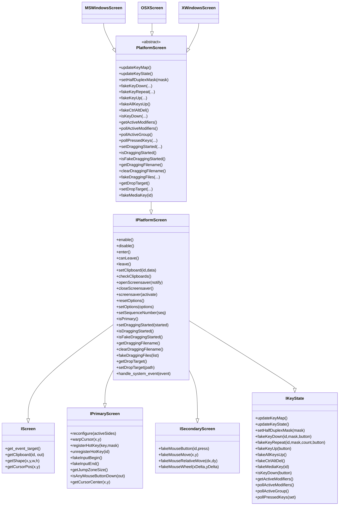
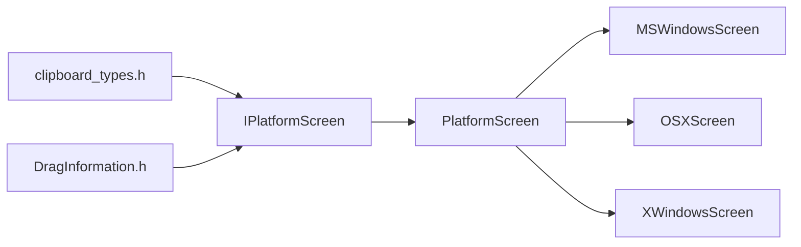

# 平台接口设计

<cite>
**本文引用的文件**   
- [IPlatformScreen.h](file://src/lib/inputleap/IPlatformScreen.h)
- [IScreen.h](file://src/lib/inputleap/IScreen.h)
- [IPrimaryScreen.h](file://src/lib/inputleap/IPrimaryScreen.h)
- [ISecondaryScreen.h](file://src/lib/inputleap/ISecondaryScreen.h)
- [IKeyState.h](file://src/lib/inputleap/IKeyState.h)
- [PlatformScreen.h](file://src/lib/inputleap/PlatformScreen.h)
- [MSWindowsScreen.h](file://src/lib/platform/MSWindowsScreen.h)
- [OSXScreen.h](file://src/lib/platform/OSXScreen.h)
- [XWindowsScreen.h](file://src/lib/platform/XWindowsScreen.h)
- [clipboard_types.h](file://src/lib/inputleap/clipboard_types.h)
- [DragInformation.h](file://src/lib/inputleap/DragInformation.h)
</cite>

## 目录
1. [简介](#简介)
2. [项目结构](#项目结构)
3. [核心组件](#核心组件)
4. [架构总览](#架构总览)
5. [详细组件分析](#详细组件分析)
6. [依赖关系分析](#依赖关系分析)
7. [性能考量](#性能考量)
8. [故障排查指南](#故障排查指南)
9. [结论](#结论)
10. [附录：新平台实现指南](#附录新平台实现指南)

## 简介
本文件面向 Input Leap 的平台抽象层，聚焦 IPlatformScreen 及其相关接口的设计与职责划分。目标是帮助读者理解如何通过统一接口屏蔽不同操作系统（Windows、macOS、X11）的屏幕与输入差异，并指导在新平台上实现这些接口。文档涵盖：
- 接口设计理念与职责分离
- 事件处理机制、剪贴板操作、屏幕保护程序控制
- 错误处理策略与扩展点
- 面向新平台的实现指南与最佳实践

## 项目结构
Input Leap 将平台无关的屏幕与输入能力抽象为一系列接口，并由各平台提供具体实现。关键位置如下：
- 接口定义位于 src/lib/inputleap 下（如 IScreen、IPrimaryScreen、ISecondaryScreen、IKeyState、IPlatformScreen）
- 公共基类 PlatformScreen 提供通用逻辑与默认行为
- 平台实现位于 src/lib/platform 下（MSWindowsScreen、OSXScreen、XWindowsScreen）

```mermaid
graph TB
subgraph "接口层"
IS["IScreen"]
IPS["IPrimaryScreen"]
ISS["ISecondaryScreen"]
IK["IKeyState"]
IPlat["IPlatformScreen"]
PS["PlatformScreen(基类)"]
end
subgraph "平台实现"
Win["MSWindowsScreen"]
Mac["OSXScreen"]
X11["XWindowsScreen"]
end
IPlat --> IS
IPlat --> IPS
IPlat --> ISS
IPlat --> IK
PS --> IPlat
Win --> PS
Mac --> PS
X11 --> PS
```

图表来源
- [IPlatformScreen.h:37-39](file://src/lib/inputleap/IPlatformScreen.h#L37-L39)
- [PlatformScreen.h:34-34](file://src/lib/inputleap/PlatformScreen.h#L34-L34)
- [MSWindowsScreen.h:42-42](file://src/lib/platform/MSWindowsScreen.h#L42-L42)
- [OSXScreen.h:53-53](file://src/lib/platform/OSXScreen.h#L53-L53)
- [XWindowsScreen.h:39-39](file://src/lib/platform/XWindowsScreen.h#L39-L39)

章节来源
- [IPlatformScreen.h:37-39](file://src/lib/inputleap/IPlatformScreen.h#L37-L39)
- [PlatformScreen.h:34-34](file://src/lib/inputleap/PlatformScreen.h#L34-L34)
- [MSWindowsScreen.h:42-42](file://src/lib/platform/MSWindowsScreen.h#L42-L42)
- [OSXScreen.h:53-53](file://src/lib/platform/OSXScreen.h#L53-L53)
- [XWindowsScreen.h:39-39](file://src/lib/platform/XWindowsScreen.h#L39-L39)

## 核心组件
本节从“职责分离”的角度梳理接口族，说明它们如何共同构成统一的屏幕抽象。

- IScreen：所有屏幕共有的基础能力
  - 获取事件目标、读取剪贴板内容、查询屏幕形状与光标位置
  - 作为所有屏幕实现的最低约束

- IPrimaryScreen：主屏专属能力
  - 配置跳转区域、绝对移动光标、注册/注销系统热键
  - 合成输入开始/结束、查询鼠标按键状态、获取光标中心
  - 用于捕获真实用户输入并转发到网络侧

- ISecondaryScreen：副屏专属能力
  - 模拟鼠标按下/释放、绝对/相对移动、滚轮滚动
  - 用于接收远端输入并在本地执行

- IKeyState：键盘状态与合成
  - 更新键映射与物理按键状态
  - 半双工修饰键掩码设置
  - 合成按键按下/重复/释放、批量释放、特殊组合键（如 Ctrl+Alt+Del）、媒体键
  - 查询当前修饰键、活动布局、已按下键集合

- IPlatformScreen：平台级综合接口
  - 生命周期：enable/disable/enter/canLeave/leave
  - 剪贴板：setClipboard/checkClipboards
  - 屏幕保护：openScreensaver/closeScreensaver/screensaver
  - 选项：resetOptions/setOptions
  - 拖拽：序列号、拖拽状态、拖拽文件列表、DropTarget
  - 系统事件：handle_system_event（平台需安装系统事件处理器并派发 IScreen/IPrimaryScreen 事件）

- PlatformScreen：公共基类
  - 对 IKeyState 的部分方法提供默认实现或转发
  - 提供拖拽相关字段与默认抛错占位（未实现时抛出运行时异常）
  - 要求子类实现 updateButtons 与 getKeyState

章节来源
- [IScreen.h:32-73](file://src/lib/inputleap/IScreen.h#L32-L73)
- [IPrimaryScreen.h:33-176](file://src/lib/inputleap/IPrimaryScreen.h#L33-L176)
- [ISecondaryScreen.h:32-64](file://src/lib/inputleap/ISecondaryScreen.h#L32-L64)
- [IKeyState.h:34-185](file://src/lib/inputleap/IKeyState.h#L34-L185)
- [IPlatformScreen.h:37-185](file://src/lib/inputleap/IPlatformScreen.h#L37-L185)
- [PlatformScreen.h:34-91](file://src/lib/inputleap/PlatformScreen.h#L34-L91)

## 架构总览
下图展示了接口继承关系与平台实现的关系，以及平台实现如何复用基类能力。

图表来源
- [IScreen.h:32-73](file://src/lib/inputleap/IScreen.h#L32-L73)
- [IPrimaryScreen.h:33-176](file://src/lib/inputleap/IPrimaryScreen.h#L33-L176)
- [ISecondaryScreen.h:32-64](file://src/lib/inputleap/ISecondaryScreen.h#L32-L64)
- [IKeyState.h:34-185](file://src/lib/inputleap/IKeyState.h#L34-L185)
- [IPlatformScreen.h:37-185](file://src/lib/inputleap/IPlatformScreen.h#L37-L185)
- [PlatformScreen.h:34-91](file://src/lib/inputleap/PlatformScreen.h#L34-L91)
- [MSWindowsScreen.h:42-42](file://src/lib/platform/MSWindowsScreen.h#L42-L42)
- [OSXScreen.h:53-53](file://src/lib/platform/OSXScreen.h#L53-L53)
- [XWindowsScreen.h:39-39](file://src/lib/platform/XWindowsScreen.h#L39-L39)

## 详细组件分析

### IPlatformScreen：平台级统一入口
- 设计理念
  - 通过多重继承聚合 IScreen/IPrimaryScreen/ISecondaryScreen/IKeyState，形成“平台屏幕”的统一视图
  - 将生命周期、剪贴板、屏幕保护、选项、拖拽等跨平台能力收敛到一个接口中
- 关键职责
  - 生命周期：enable/disable/enter/canLeave/leave
  - 剪贴板：读写与所有权检查
  - 屏幕保护：打开/关闭/强制激活
  - 选项：重置与增量设置
  - 拖拽：序列号、拖拽状态、文件列表、DropTarget
  - 系统事件：安装系统事件处理器并派发上层事件
- 错误处理
  - canLeave 返回布尔值以表达“是否允许离开”，典型失败场景为主屏无法安装钩子
  - 基类对未实现的拖拽方法抛出运行时异常，便于快速发现缺失实现

章节来源
- [IPlatformScreen.h:44-185](file://src/lib/inputleap/IPlatformScreen.h#L44-L185)
- [PlatformScreen.h:63-68](file://src/lib/inputleap/PlatformScreen.h#L63-L68)

### IScreen：屏幕共性
- 职责
  - 提供事件目标、剪贴板读取、屏幕几何与光标位置查询
- 复杂度
  - 均为 O(1) 访问或系统调用封装，无复杂算法
- 扩展点
  - 新增屏幕属性可通过派生接口或扩展 IScreen 的子集来引入

章节来源
- [IScreen.h:32-73](file://src/lib/inputleap/IScreen.h#L32-L73)

### IPrimaryScreen：主屏输入捕获与合成隔离
- 职责
  - 配置跳转区域、绝对移动光标、全局热键注册/注销
  - fakeInputBegin/End 用于在合成输入期间避免回环
  - 查询鼠标按键状态与光标中心
- 设计要点
  - 热键语义明确：仅当指定修饰键恰好处于按下态且目标键按下时才触发
  - 合成输入隔离：确保自身合成的输入不被当作用户输入再次上报

章节来源
- [IPrimaryScreen.h:84-176](file://src/lib/inputleap/IPrimaryScreen.h#L84-L176)

### ISecondaryScreen：副屏输入合成
- 职责
  - 模拟鼠标按钮、绝对/相对移动、滚轮
- 设计要点
  - 相对移动与绝对移动并存，满足不同平台特性
  - 滚轮支持 x/y 两个方向

章节来源
- [ISecondaryScreen.h:36-64](file://src/lib/inputleap/ISecondaryScreen.h#L36-L64)

### IKeyState：键盘状态与合成
- 职责
  - 维护键映射与物理按键状态
  - 合成按键事件（按下/重复/释放/全部释放）
  - 特殊组合键与媒体键
  - 查询修饰键、活动布局、已按下键集合
- 设计要点
  - 半双工修饰键掩码：解决某些平台修饰键切换不报告释放的问题
  - 区分“影子状态”和“系统状态”：getActiveModifiers 与 pollActiveModifiers 分别对应

章节来源
- [IKeyState.h:78-185](file://src/lib/inputleap/IKeyState.h#L78-L185)

### PlatformScreen：公共基类与默认行为
- 职责
  - 对 IKeyState 的方法提供默认实现或转发
  - 提供拖拽相关字段与默认抛错占位
  - 要求子类实现 updateButtons 与 getKeyState
- 错误处理
  - 未实现的拖拽方法直接抛出运行时异常，便于测试期暴露问题

章节来源
- [PlatformScreen.h:34-91](file://src/lib/inputleap/PlatformScreen.h#L34-L91)

### 平台实现概览
- Windows（MSWindowsScreen）
  - 基于 Windows API 与 Hook 机制捕获系统事件
  - 管理窗口类、消息循环、剪贴板查看器链、屏幕保护、热键等
  - 提供 handle_system_event 与各类消息处理器
- macOS（OSXScreen）
  - 基于 Carbon/Quartz 事件系统与 IOKit 电源管理
  - 管理隐藏窗口、全局热键、事件 Tap、屏幕保护等
- X11（XWindowsScreen）
  - 基于 Xlib/XKB/XRandR/XInput2 等扩展
  - 管理显示、窗口、选择与剪贴板、屏幕保护、热键等

章节来源
- [MSWindowsScreen.h:42-349](file://src/lib/platform/MSWindowsScreen.h#L42-L349)
- [OSXScreen.h:53-357](file://src/lib/platform/OSXScreen.h#L53-L357)
- [XWindowsScreen.h:39-271](file://src/lib/platform/XWindowsScreen.h#L39-L271)

## 依赖关系分析
- 类型依赖
  - 剪贴板标识符由 clipboard_types.h 定义，包含 kClipboardClipboard/kClipboardSelection/kClipboardEnd
  - 拖拽信息模型由 DragInformation.h 定义，提供文件列表与解析工具
- 模块耦合
  - IPlatformScreen 聚合多个接口，形成高内聚的平台抽象
  - 平台实现依赖各自系统的原生库（Win32、Carbon/Quartz、X11）
  - PlatformScreen 作为中间层降低平台实现重复代码

图表来源
- [clipboard_types.h:27-42](file://src/lib/inputleap/clipboard_types.h#L27-L42)
- [DragInformation.h:27-58](file://src/lib/inputleap/DragInformation.h#L27-L58)
- [IPlatformScreen.h:37-185](file://src/lib/inputleap/IPlatformScreen.h#L37-L185)
- [PlatformScreen.h:34-91](file://src/lib/inputleap/PlatformScreen.h#L34-L91)
- [MSWindowsScreen.h:42-42](file://src/lib/platform/MSWindowsScreen.h#L42-L42)
- [OSXScreen.h:53-53](file://src/lib/platform/OSXScreen.h#L53-L53)
- [XWindowsScreen.h:39-39](file://src/lib/platform/XWindowsScreen.h#L39-L39)

章节来源
- [clipboard_types.h:27-42](file://src/lib/inputleap/clipboard_types.h#L27-L42)
- [DragInformation.h:27-58](file://src/lib/inputleap/DragInformation.h#L27-L58)
- [IPlatformScreen.h:37-185](file://src/lib/inputleap/IPlatformScreen.h#L37-L185)
- [PlatformScreen.h:34-91](file://src/lib/inputleap/PlatformScreen.h#L34-L91)

## 性能考量
- 事件路径优化
  - 主屏应避免不必要的系统调用与队列刷新；使用 warpCursorNoFlush 等变体减少事件丢弃开销
- 剪贴板同步
  - 采用 checkClipboards 作为后备机制，避免频繁监听导致的系统负载
- 滚轮累积
  - X11 平台存在滚动累积策略，以减少小步长滚动事件的频率
- 合成输入隔离
  - fakeInputBegin/End 包裹合成输入，防止回环与重复处理

[本节为通用性能建议，不直接分析具体文件]

## 故障排查指南
- 常见问题定位
  - 离开屏幕失败：检查 canLeave 返回值与主屏钩子安装情况
  - 剪贴板不同步：确认 setClipboard/checkClipboards 调用时机与序列号一致性
  - 屏幕保护异常：核对 openScreensaver/closeScreensaver/screensaver 的配对调用
  - 拖拽未实现：若出现运行时异常，说明平台未实现相应方法
- 调试建议
  - 在主屏启用日志输出，记录热键注册/注销、合成输入边界、系统事件分发
  - 使用 isAnyMouseButtonDown/getCursorCenter 辅助验证鼠标状态一致性

章节来源
- [IPlatformScreen.h:72-79](file://src/lib/inputleap/IPlatformScreen.h#L72-L79)
- [PlatformScreen.h:63-68](file://src/lib/inputleap/PlatformScreen.h#L63-L68)

## 结论
IPlatformScreen 通过聚合 IScreen/IPrimaryScreen/ISecondaryScreen/IKeyState，为多平台提供了统一的屏幕与输入抽象。PlatformScreen 进一步收敛了通用逻辑与默认行为，使平台实现更聚焦于系统差异。遵循本文的职责划分、错误处理与扩展点设计，可高效地在新的操作系统上实现一致的用户体验。

[本节为总结性内容，不直接分析具体文件]

## 附录：新平台实现指南
- 步骤概览
  1. 新建平台类，继承自 PlatformScreen
  2. 实现 IScreen 方法：get_event_target、getClipboard、getShape、getCursorPos
  3. 实现 IPrimaryScreen 方法：reconfigure、warpCursor、registerHotKey/unregisterHotKey、fakeInputBegin/End、getJumpZoneSize、isAnyMouseButtonDown、getCursorCenter
  4. 实现 ISecondaryScreen 方法：fakeMouseButton、fakeMouseMove、fakeMouseRelativeMove、fakeMouseWheel
  5. 实现 IKeyState 方法：updateKeyMap/updateKeyState、setHalfDuplexMask、fakeKeyDown/fakeKeyRepeat/fakeKeyUp/fakeAllKeysUp、fakeCtrlAltDel、fakeMediaKey、isKeyDown、getActiveModifiers、pollActiveModifiers、pollActiveGroup、pollPressedKeys
  6. 实现 IPlatformScreen 方法：enable/disable/enter/canLeave/leave、setClipboard/checkClipboards、openScreensaver/closeScreensaver/screensaver、resetOptions/setOptions、setSequenceNumber、isPrimary、拖拽相关方法与 handle_system_event
  7. 在构造函数中安装系统事件处理器，并在析构函数中移除
  8. 实现 updateButtons 与 getKeyState 以满足基类要求
- 注意事项
  - 热键注册需保证唯一 ID 与正确注销
  - 合成输入必须被 fakeInputBegin/End 包围，避免回环
  - 剪贴板序列号需与上层保持一致，配合 checkClipboards 做一致性校验
  - 屏幕保护控制需成对调用，避免状态不一致
  - 未实现的拖拽方法会抛出运行时异常，应尽快补齐
- 参考实现
  - Windows：MSWindowsScreen
  - macOS：OSXScreen
  - X11：XWindowsScreen

章节来源
- [PlatformScreen.h:72-85](file://src/lib/inputleap/PlatformScreen.h#L72-L85)
- [MSWindowsScreen.h:73-131](file://src/lib/platform/MSWindowsScreen.h#L73-L131)
- [OSXScreen.h:60-109](file://src/lib/platform/OSXScreen.h#L60-L109)
- [XWindowsScreen.h:51-94](file://src/lib/platform/XWindowsScreen.h#L51-L94)