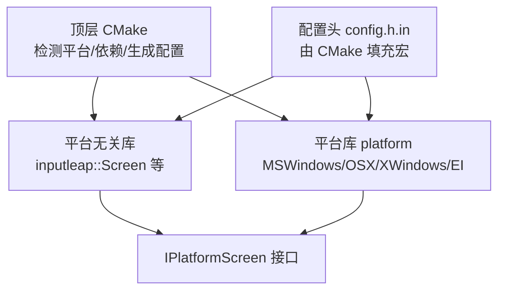
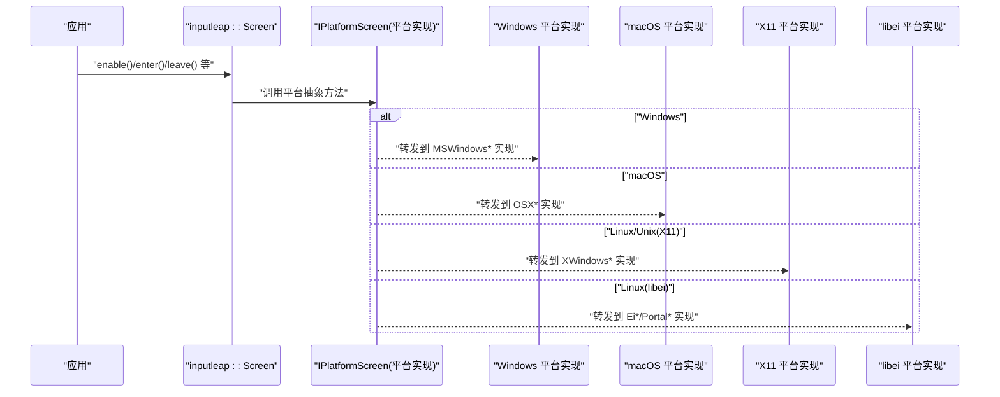
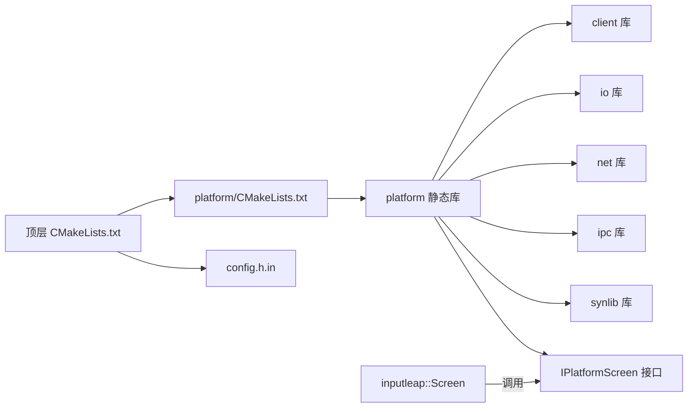
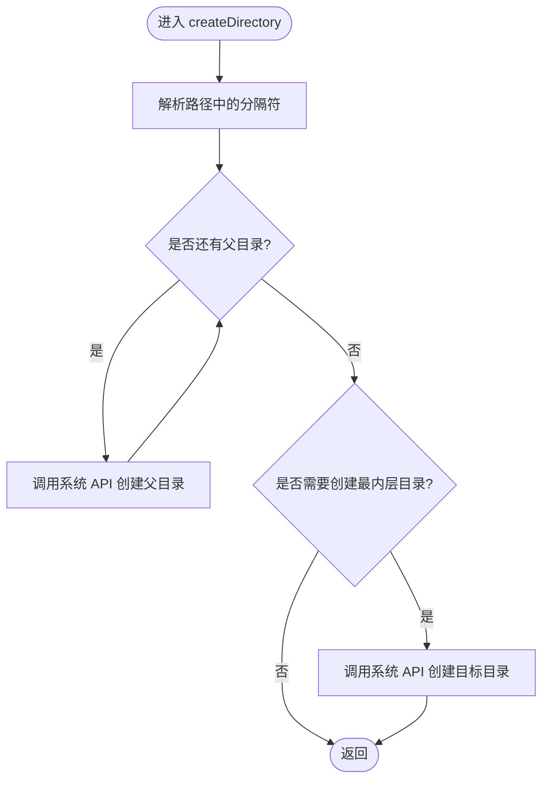

# 跨平台兼容性

<cite>
**本文引用的文件**   
- [CMakeLists.txt](file://CMakeLists.txt)
- [config.h.in](file://src/lib/config.h.in)
- [platform/CMakeLists.txt](file://src/lib/platform/CMakeLists.txt)
- [MSWindowsUtil.cpp](file://src/lib/platform/MSWindowsUtil.cpp)
- [ArchMiscWindows.cpp](file://src/lib/arch/win32/ArchMiscWindows.cpp)
- [MSWindowsSession.cpp](file://src/lib/platform/MSWindowsSession.cpp)
- [Screen.h](file://src/lib/inputleap/Screen.h)
- [Screen.cpp](file://src/lib/inputleap/Screen.cpp)
</cite>

## 目录
1. [简介](#简介)
2. [项目结构](#项目结构)
3. [核心组件](#核心组件)
4. [架构总览](#架构总览)
5. [详细组件分析](#详细组件分析)
6. [依赖关系分析](#依赖关系分析)
7. [性能考量](#性能考量)
8. [故障排查指南](#故障排查指南)
9. [结论](#结论)
10. [附录](#附录)

## 简介
本文件聚焦 Input Leap 的跨平台兼容性设计与实现，围绕平台抽象层、条件编译与运行时适配机制展开，覆盖文件系统路径处理、线程模型、网络编程等关键差异点。同时梳理构建系统的跨平台配置、依赖管理与编译选项，并提供新平台移植指南、兼容性测试策略、性能基准对比建议以及平台特定优化与最佳实践。

## 项目结构
Input Leap 采用“平台无关逻辑 + 平台相关实现”的分层组织方式：
- 顶层 CMake 负责检测系统、选择平台特性、生成配置头并链接平台库。
- src/lib/platform 提供各平台的屏幕、剪贴板、会话、工具等实现。
- src/lib/inputleap 提供平台无关的业务逻辑（如 Screen 类），通过 IPlatformScreen 接口调用平台实现。
- src/lib/arch 提供底层架构相关的辅助实现（例如 Windows 进程枚举）。

图表来源
- [CMakeLists.txt:18-247](file://CMakeLists.txt#L18-L247)
- [platform/CMakeLists.txt:17-74](file://src/lib/platform/CMakeLists.txt#L17-L74)
- [config.h.in:1-42](file://src/lib/config.h.in#L1-L42)

章节来源
- [CMakeLists.txt:18-247](file://CMakeLists.txt#L18-L247)
- [platform/CMakeLists.txt:17-74](file://src/lib/platform/CMakeLists.txt#L17-L74)
- [config.h.in:1-42](file://src/lib/config.h.in#L1-L42)

## 核心组件
- 平台无关的屏幕抽象：Screen 类封装了主/从屏切换、事件合成、剪贴板同步、屏幕保护控制等通用流程，并通过 IPlatformScreen 委托平台实现。
- 平台相关实现：针对 Windows、macOS、X11、libei 分别提供具体实现，由 CMake 按目标平台与开关聚合到 platform 静态库中。
- 配置与宏：CMake 在 UNIX 下探测可用 API 并将结果写入 config.h；在 Windows 下通过 /D 定义宏启用相应功能。

章节来源
- [Screen.h:39-346](file://src/lib/inputleap/Screen.h#L39-L346)
- [Screen.cpp:483-541](file://src/lib/inputleap/Screen.cpp#L483-L541)
- [platform/CMakeLists.txt:17-74](file://src/lib/platform/CMakeLists.txt#L17-L74)
- [CMakeLists.txt:91-247](file://CMakeLists.txt#L91-L247)
- [config.h.in:1-42](file://src/lib/config.h.in#L1-L42)

## 架构总览
下图展示了从应用入口到平台抽象层的调用链与平台分支：

图表来源
- [Screen.h:39-346](file://src/lib/inputleap/Screen.h#L39-L346)
- [platform/CMakeLists.txt:17-74](file://src/lib/platform/CMakeLists.txt#L17-L74)

## 详细组件分析

### 平台抽象层设计原则与实现策略
- 接口隔离：平台无关逻辑集中在 inputleap 命名空间内，通过 IPlatformScreen 暴露最小必要能力，屏蔽平台差异。
- 条件编译：使用 CMake 生成的宏（如 SYSAPI_UNIX/WIN32、WINAPI_CARBON/XWINDOWS/LIBEI）和源码级 #ifdef 组合，确保只编译当前平台所需代码。
- 运行时适配：对可选能力（如 libportal 函数存在性、libei 序列号参数）进行符号检查，并在运行时根据能力分支执行。

章节来源
- [CMakeLists.txt:91-247](file://CMakeLists.txt#L91-L247)
- [config.h.in:1-42](file://src/lib/config.h.in#L1-L42)
- [platform/CMakeLists.txt:17-74](file://src/lib/platform/CMakeLists.txt#L17-L74)

### 条件编译与平台检测
- UNIX 分支：
  - 探测 sys/socket.h、sys/utsname.h、getpwuid_r、pthread 等，设置 SELECT/ACCEPT 类型宏，生成 config.h。
  - 非 Apple 的 UNIX 需要 pkg-config，并根据开关启用 X11 或 libei（二者至少其一）。
  - macOS 额外链接 ScreenSaver、IOKit、ApplicationServices、Foundation、Carbon 等框架。
- Windows 分支：
  - 定义 SYSAPI_WIN32、WINAPI_MSWINDOWS 等宏，链接 Wtsapi32、Userenv、Wininet、comsuppw、Shlwapi 等系统库。
- GUI 与 Qt：
  - 支持 Qt5/Qt6，自动定位部署工具（windeployqt/macdeployqt），并设置 RPATH 等打包信息。

章节来源
- [CMakeLists.txt:91-247](file://CMakeLists.txt#L91-L247)
- [CMakeLists.txt:289-322](file://CMakeLists.txt#L289-L322)

### 运行时适配机制
- libportal/libei 能力探测：
  - 通过 check_symbol_exists 与源编译检查判断 xdp_session_connect_to_eis、xdp_portal_create_remote_desktop_session_full、xdp_input_capture_session_connect_to_eis 及枚举值是否存在，将结果写入 config.h，供源码分支使用。
- 线程与网络：
  - 使用 Threads 模块统一 pthread，设置 select/accept 参数类型宏，保证在不同 UNIX 变体上可编译。

章节来源
- [CMakeLists.txt:172-202](file://CMakeLists.txt#L172-L202)
- [CMakeLists.txt:106-116](file://CMakeLists.txt#L106-L116)
- [config.h.in:31-42](file://src/lib/config.h.in#L31-L42)

### 不同操作系统间的功能差异与解决方案
- 文件系统路径与目录创建
  - Windows 侧提供 createDirectory 包装，递归创建父目录；注释指出未来可迁移至 std::filesystem。
  - 其他平台可使用标准库或 gulrak-filesystem（可通过 INPUTLEAP_USE_GULRAK_FILESYSTEM 启用）。
- 线程模型
  - UNIX 使用 pthread，Windows 使用原生线程 API；上层通过统一的线程抽象（Threads 模块）隐藏差异。
- 网络编程
  - UNIX 使用 POSIX socket/select/accept，类型宏由 CMake 探测后注入；Windows 使用 Winsock（由系统库间接提供）。
- 桌面与会话
  - Windows 使用 User32/GDI 相关 API 获取活动桌面名称、遍历进程等；macOS 使用 Carbon/Aqua 框架；X11 使用 Xlib/XRandr/XTest 等。

章节来源
- [MSWindowsUtil.cpp:61-81](file://src/lib/platform/MSWindowsUtil.cpp#L61-L81)
- [ArchMiscWindows.cpp:490-526](file://src/lib/arch/win32/ArchMiscWindows.cpp#L490-L526)
- [MSWindowsSession.cpp:161-198](file://src/lib/platform/MSWindowsSession.cpp#L161-L198)
- [CMakeLists.txt:106-116](file://CMakeLists.txt#L106-L116)
- [CMakeLists.txt:162-196](file://CMakeLists.txt#L162-L196)

### 构建系统的跨平台配置、依赖管理与编译选项
- 顶层开关
  - INPUTLEAP_BUILD_GUI、INPUTLEAP_BUILD_TESTS、INPUTLEAP_BUILD_X11、INPUTLEAP_BUILD_LIBEI、INPUTLEAP_BUILD_GULRAK_FILESYSTEM。
- 编译器与标准
  - Qt6 使用 C++17，Qt5 使用 C++14；UNIX 默认开启 -Wformat；Windows 开启并行编译与调试信息。
- 依赖发现
  - OpenSSL（要求 1.1.1+）、pkg-config、X11 系列、libei、glib、xkbcommon、libportal、Avahi（dns_sd.h）。
- 安装与打包
  - macOS Bundle、RPM 元数据、Windows Installer（Wix/Inno）。

章节来源
- [CMakeLists.txt:21-45](file://CMakeLists.txt#L21-L45)
- [CMakeLists.txt:65-89](file://CMakeLists.txt#L65-L89)
- [CMakeLists.txt:254-258](file://CMakeLists.txt#L254-L258)
- [CMakeLists.txt:289-322](file://CMakeLists.txt#L289-L322)

### 新平台移植指南
- 步骤概览
  1) 在顶层 CMake 中添加平台分支，定义 SYSAPI_* 与 WINAPI_* 宏，链接必要的系统库。
  2) 在 src/lib/platform/CMakeLists.txt 中新增平台文件收集规则（GLOB），并按需设置 SKIP_UNITY_BUILD_INCLUSION（如 .mm/.swift 等）。
  3) 在 config.h.in 中增加新的探测项（如新 API 存在性），并在 CMake 中用 check_* 宏写入。
  4) 为平台无关的 IScreen/IPlatformScreen 提供对应实现，遵循现有接口契约。
  5) 添加平台特定的资源与安装脚本（如包管理器清单、图标、描述文件）。
- 注意事项
  - 保持接口稳定，避免在平台无关层引入平台细节。
  - 对可选能力进行符号/编译期检查，避免硬依赖。
  - 谨慎处理字符编码与路径分隔符，优先使用跨平台库（如 gulrak-filesystem）。

章节来源
- [CMakeLists.txt:91-247](file://CMakeLists.txt#L91-L247)
- [platform/CMakeLists.txt:17-74](file://src/lib/platform/CMakeLists.txt#L17-L74)
- [config.h.in:1-42](file://src/lib/config.h.in#L1-L42)

### 兼容性测试策略
- 单元测试
  - 针对平台无关逻辑（如输入合成、剪贴板协议）编写 gtest 用例，确保跨平台一致性。
- 集成测试
  - 针对平台相关子系统（如屏幕状态、剪贴板、锁屏）编写平台测试，分别在 Windows、macOS、X11 环境运行。
- 持续集成
  - 在多平台矩阵（Windows/macOS/Linux 多发行版）上执行构建与测试，捕获平台差异问题。

章节来源
- [CMakeLists.txt:339-341](file://CMakeLists.txt#L339-L341)

### 性能基准对比
- 建议指标
  - 事件端到端延迟（键盘/鼠标）、CPU 占用、内存峰值、网络吞吐。
- 基线与环境
  - 固定硬件与 OS 版本，关闭不必要的后台服务，使用相同配置与负载场景。
- 对比维度
  - 不同平台间同一操作的耗时分布；同一平台不同后端（X11 vs libei）的差异。
- 自动化
  - 将基准纳入 CI，记录趋势并告警异常波动。

[本节为通用指导，不直接分析具体文件]

## 依赖关系分析
- 顶层 CMake 决定平台分支与宏定义，驱动 platform 子库的文件收集与链接。
- platform 库依赖 client/io/net/ipc/synlib 等基础库，并在 UNIX 下链接系统库与第三方库。
- 平台无关的 Screen 通过 IPlatformScreen 解耦平台实现。

图表来源
- [CMakeLists.txt:91-247](file://CMakeLists.txt#L91-L247)
- [platform/CMakeLists.txt:62-74](file://src/lib/platform/CMakeLists.txt#L62-L74)
- [Screen.h:39-346](file://src/lib/inputleap/Screen.h#L39-L346)

章节来源
- [CMakeLists.txt:91-247](file://CMakeLists.txt#L91-L247)
- [platform/CMakeLists.txt:62-74](file://src/lib/platform/CMakeLists.txt#L62-L74)
- [Screen.h:39-346](file://src/lib/inputleap/Screen.h#L39-L346)

## 性能考量
- 减少不必要的系统调用：批量处理事件、合并剪贴板更新。
- 避免阻塞 UI 线程：将长耗时操作放入工作线程。
- 合理选择后端：在 Wayland 环境下优先 libei/libportal；在 X11 环境使用 XTest 以获得更低延迟。
- 日志级别控制：生产环境降低日志开销。

[本节为通用指导，不直接分析具体文件]

## 故障排查指南
- 构建失败
  - UNIX 缺少 pkg-config 或 dns_sd.h：检查依赖安装与路径配置。
  - 未启用 X11 或 libei：确保至少启用其一。
- 运行时错误
  - Windows 进程枚举失败：检查权限与快照 API 返回值。
  - 活动桌面名获取失败：检查用户会话与桌面对象访问权限。
- 常见问题定位
  - 查看平台相关日志输出，结合错误码转换为可读字符串。

章节来源
- [CMakeLists.txt:135-146](file://CMakeLists.txt#L135-L146)
- [CMakeLists.txt:198-202](file://CMakeLists.txt#L198-L202)
- [CMakeLists.txt:225-228](file://CMakeLists.txt#L225-L228)
- [MSWindowsSession.cpp:161-198](file://src/lib/platform/MSWindowsSession.cpp#L161-L198)

## 结论
Input Leap 通过清晰的接口分层、严格的条件编译与完善的运行时能力探测，实现了在 Windows、macOS、X11 与 libei 上的良好兼容。构建系统提供了灵活的开关与依赖管理，便于在新平台上快速扩展。建议在后续迭代中逐步迁移到现代 C++ 文件系统与更细粒度的性能监控，以提升可维护性与稳定性。

[本节为总结性内容，不直接分析具体文件]

## 附录

### 平台相关流程图（以 Windows 目录创建为例）

图表来源
- [MSWindowsUtil.cpp:61-81](file://src/lib/platform/MSWindowsUtil.cpp#L61-L81)