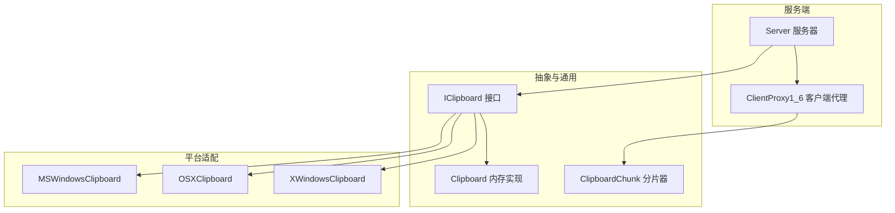
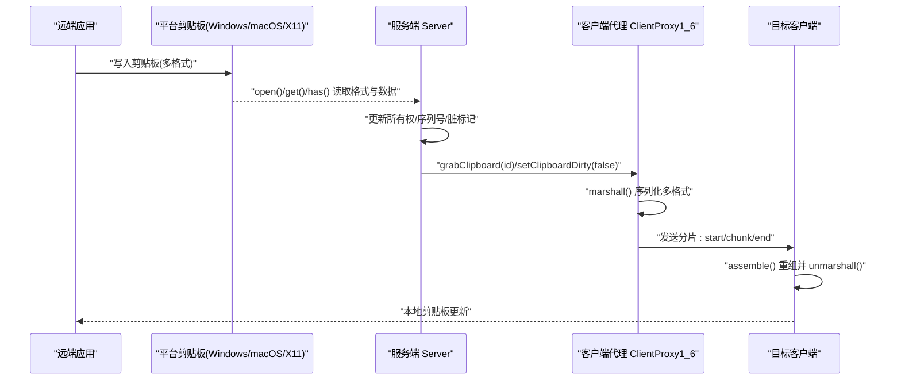
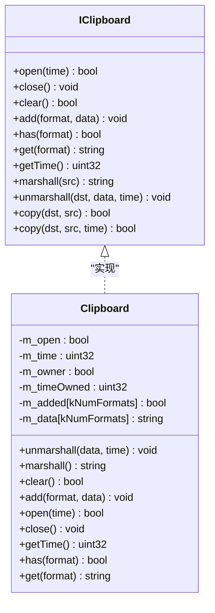
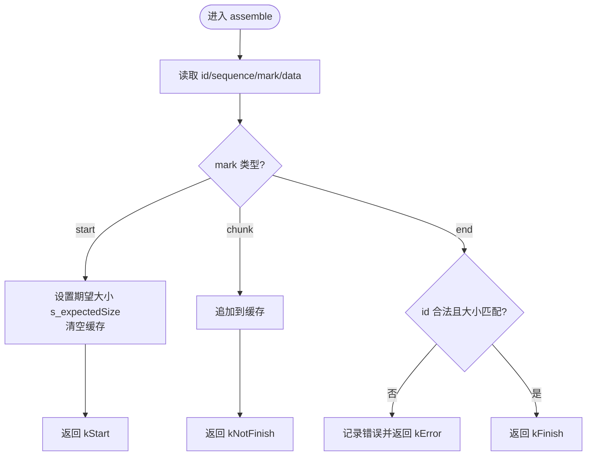
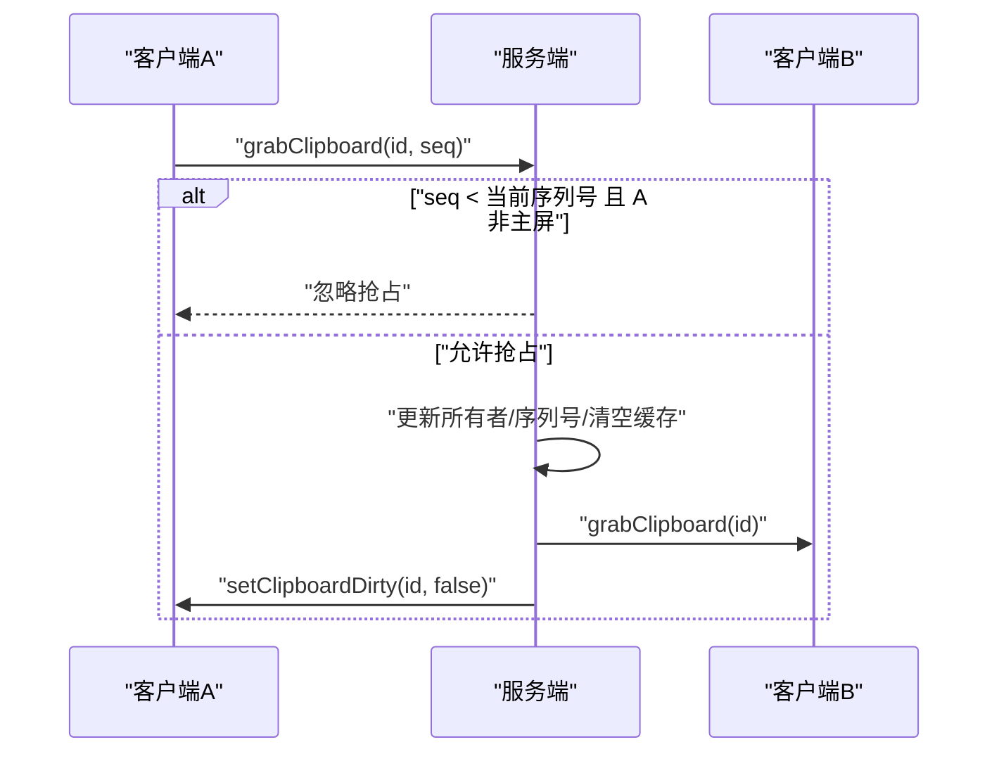
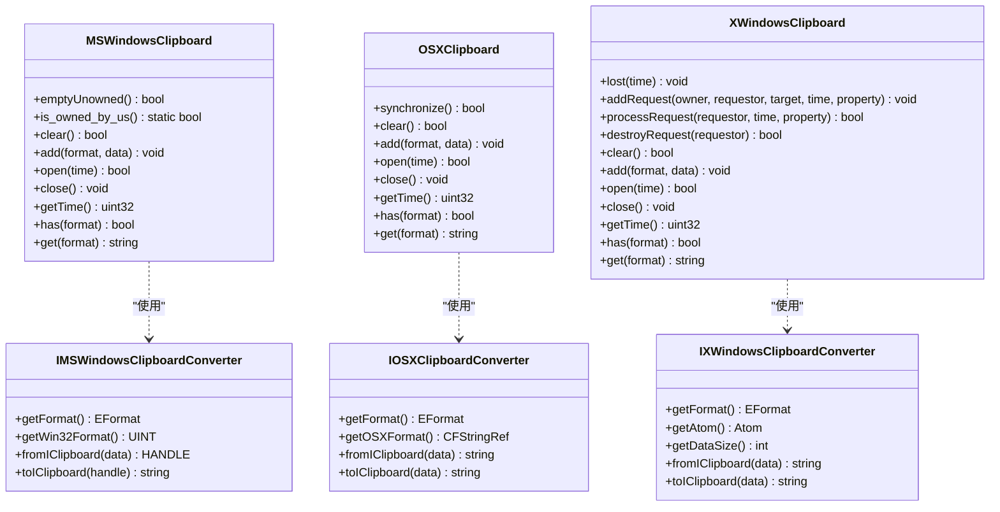
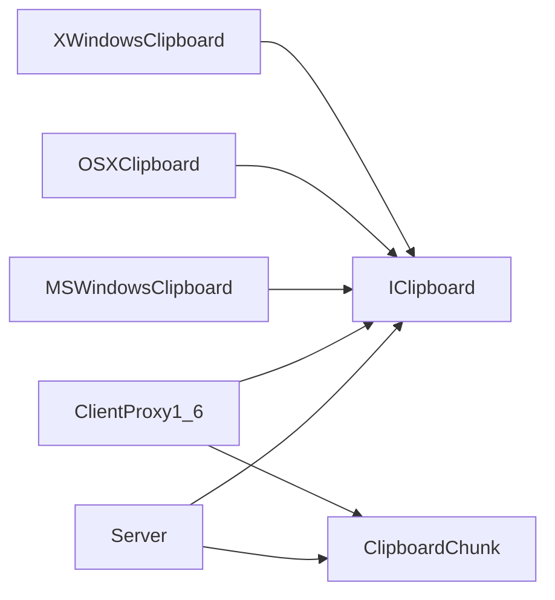

# 剪贴板同步机制

<cite>
**本文引用的文件**   
- [IClipboard.h](file://src/lib/inputleap/IClipboard.h)
- [IClipboard.cpp](file://src/lib/inputleap/IClipboard.cpp)
- [Clipboard.h](file://src/lib/inputleap/Clipboard.h)
- [ClipboardChunk.h](file://src/lib/inputleap/ClipboardChunk.h)
- [ClipboardChunk.cpp](file://src/lib/inputleap/ClipboardChunk.cpp)
- [ClientProxy1_6.cpp](file://src/lib/server/ClientProxy1_6.cpp)
- [Server.cpp](file://src/lib/server/Server.cpp)
- [MSWindowsClipboard.h](file://src/lib/platform/MSWindowsClipboard.h)
- [OSXClipboard.h](file://src/lib/platform/OSXClipboard.h)
- [XWindowsClipboard.h](file://src/lib/platform/XWindowsClipboard.h)
- [XWindowsClipboard.cpp](file://src/lib/platform/XWindowsClipboard.cpp)
- [ClipboardTests.cpp](file://src/test/unittests/inputleap/ClipboardTests.cpp)
</cite>

## 目录
1. [简介](#简介)
2. [项目结构](#项目结构)
3. [核心组件](#核心组件)
4. [架构总览](#架构总览)
5. [详细组件分析](#详细组件分析)
6. [依赖关系分析](#依赖关系分析)
7. [性能考虑](#性能考虑)
8. [故障排除指南](#故障排除指南)
9. [结论](#结论)
10. [附录](#附录)

## 简介
本文件系统性阐述 Input Leap 的剪贴板同步机制，覆盖数据捕获、格式检测与传输、多格式内容（文本、HTML、图片）处理策略、冲突解决与版本控制、跨平台 API 差异与优化、配置与安全考量，以及常见问题的排查方法。文档面向不同技术背景的读者，提供从高层架构到代码级实现的渐进式说明，并辅以图示帮助理解。

## 项目结构
剪贴板相关代码主要分布在以下层次：
- 抽象接口与内存实现：定义统一剪贴板接口、序列化/反序列化与拷贝工具
- 网络分片传输：将大体积剪贴板数据拆分为起始、数据块、结束三段进行可靠传输
- 服务端协调：维护各客户端剪贴板所有权、序列号与脏标记，广播抢占事件
- 平台适配层：Windows、macOS、X11 的具体实现及格式转换器

图表来源
- [IClipboard.h:26-178](file://src/lib/inputleap/IClipboard.h#L26-L178)
- [Clipboard.h:25-76](file://src/lib/inputleap/Clipboard.h#L25-L76)
- [ClipboardChunk.h:27-53](file://src/lib/inputleap/ClipboardChunk.h#L27-L53)
- [ClientProxy1_6.cpp:454-480](file://src/lib/server/ClientProxy1_6.cpp#L454-L480)
- [Server.cpp:1180-1215](file://src/lib/server/Server.cpp#L1180-L1215)
- [MSWindowsClipboard.h:35-88](file://src/lib/platform/MSWindowsClipboard.h#L35-L88)
- [OSXClipboard.h:32-56](file://src/lib/platform/OSXClipboard.h#L32-L56)
- [XWindowsClipboard.h:36-98](file://src/lib/platform/XWindowsClipboard.h#L36-L98)

章节来源
- [IClipboard.h:26-178](file://src/lib/inputleap/IClipboard.h#L26-L178)
- [Clipboard.h:25-76](file://src/lib/inputleap/Clipboard.h#L25-L76)
- [ClipboardChunk.h:27-53](file://src/lib/inputleap/ClipboardChunk.h#L27-L53)
- [ClientProxy1_6.cpp:454-480](file://src/lib/server/ClientProxy1_6.cpp#L454-L480)
- [Server.cpp:1180-1215](file://src/lib/server/Server.cpp#L1180-L1215)
- [MSWindowsClipboard.h:35-88](file://src/lib/platform/MSWindowsClipboard.h#L35-L88)
- [OSXClipboard.h:32-56](file://src/lib/platform/OSXClipboard.h#L32-L56)
- [XWindowsClipboard.h:36-98](file://src/lib/platform/XWindowsClipboard.h#L36-L98)

## 核心组件
- 剪贴板抽象接口 IClipboard
  - 定义统一的 open/close/add/get/has/clear 等生命周期与数据访问方法
  - 支持多种标准格式：文本、HTML、位图、PNG、JPEG、TIFF、WebP
  - 提供 marshall/unmarshall/copy 静态工具用于序列化、反序列化与跨实例拷贝
- 内存剪贴板 Clipboard
  - 基于内存存储的多格式容器，配合 IClipboard 工具完成编解码与拷贝
- 网络分片传输 ClipboardChunk
  - 将剪贴板数据按“开始-数据块-结束”三段协议拆分与组装，校验期望大小，保障完整性
- 服务端协调 Server 与 ClientProxy1_6
  - 维护每个剪贴板 ID 的所有权、序列号与脏标记；处理抢占与变更通知
- 平台适配 MSWindowsClipboard / OSXClipboard / XWindowsClipboard
  - 分别对接 Windows、macOS、X11 系统剪贴板，并通过转换器在平台格式与内部 EFormat 之间转换

章节来源
- [IClipboard.h:26-178](file://src/lib/inputleap/IClipboard.h#L26-L178)
- [IClipboard.cpp:25-165](file://src/lib/inputleap/IClipboard.cpp#L25-L165)
- [Clipboard.h:25-76](file://src/lib/inputleap/Clipboard.h#L25-L76)
- [ClipboardChunk.h:27-53](file://src/lib/inputleap/ClipboardChunk.h#L27-L53)
- [ClipboardChunk.cpp:62-98](file://src/lib/inputleap/ClipboardChunk.cpp#L62-L98)
- [ClientProxy1_6.cpp:454-480](file://src/lib/server/ClientProxy1_6.cpp#L454-L480)
- [Server.cpp:1180-1215](file://src/lib/server/Server.cpp#L1180-L1215)
- [MSWindowsClipboard.h:35-88](file://src/lib/platform/MSWindowsClipboard.h#L35-L88)
- [OSXClipboard.h:32-56](file://src/lib/platform/OSXClipboard.h#L32-L56)
- [XWindowsClipboard.h:36-98](file://src/lib/platform/XWindowsClipboard.h#L36-L98)

## 架构总览
下图展示一次典型的跨机剪贴板同步流程：远端应用写入剪贴板 → 本地平台适配层读取 → 服务端聚合与分发 → 目标客户端接收并落盘。

图表来源
- [Server.cpp:1180-1215](file://src/lib/server/Server.cpp#L1180-L1215)
- [ClientProxy1_6.cpp:454-480](file://src/lib/server/ClientProxy1_6.cpp#L454-L480)
- [IClipboard.cpp:64-119](file://src/lib/inputleap/IClipboard.cpp#L64-L119)
- [ClipboardChunk.cpp:62-98](file://src/lib/inputleap/ClipboardChunk.cpp#L62-L98)

## 详细组件分析

### 抽象接口与内存实现（IClipboard 与 Clipboard）
- 设计要点
  - 统一格式枚举 EFormat，包含文本、HTML、位图及多种图像格式
  - marshall/unmarshall 以固定二进制布局编码：先写格式数量，再循环写入格式ID、长度与数据
  - copy 工具在两个任意具体剪贴板间复制所有可用格式，并传递时间戳
- 复杂度
  - marshall/unmarshall 为 O(F + Σn_i)，F 为格式数，n_i 为第 i 个格式的数据长度
  - copy 遍历所有已知格式，O(F)
- 错误处理
  - 对未知或越界格式进行跳过/忽略，保证健壮性

图表来源
- [IClipboard.h:26-178](file://src/lib/inputleap/IClipboard.h#L26-L178)
- [IClipboard.cpp:25-165](file://src/lib/inputleap/IClipboard.cpp#L25-L165)
- [Clipboard.h:25-76](file://src/lib/inputleap/Clipboard.h#L25-L76)

章节来源
- [IClipboard.h:26-178](file://src/lib/inputleap/IClipboard.h#L26-L178)
- [IClipboard.cpp:25-165](file://src/lib/inputleap/IClipboard.cpp#L25-L165)
- [Clipboard.h:25-76](file://src/lib/inputleap/Clipboard.h#L25-L76)
- [ClipboardTests.cpp:236-265](file://src/test/unittests/inputleap/ClipboardTests.cpp#L236-L265)
- [ClipboardTests.cpp:352-384](file://src/test/unittests/inputleap/ClipboardTests.cpp#L352-L384)
- [ClipboardTests.cpp:386-399](file://src/test/unittests/inputleap/ClipboardTests.cpp#L386-L399)

### 网络分片传输（ClipboardChunk）
- 协议语义
  - start：携带期望总大小，接收方清空缓存
  - chunk：追加数据块
  - end：校验 id 范围与累计大小是否匹配，成功则返回完成
- 健壮性
  - 对非法 id 与大小不一致进行错误返回，避免损坏数据污染本地剪贴板

图表来源
- [ClipboardChunk.cpp:62-98](file://src/lib/inputleap/ClipboardChunk.cpp#L62-L98)
- [ClipboardChunk.h:27-53](file://src/lib/inputleap/ClipboardChunk.h#L27-L53)

章节来源
- [ClipboardChunk.cpp:62-98](file://src/lib/inputleap/ClipboardChunk.cpp#L62-L98)
- [ClipboardChunk.h:27-53](file://src/lib/inputleap/ClipboardChunk.h#L27-L53)

### 服务端协调与冲突解决（Server 与 ClientProxy1_6）
- 所有权与序列号
  - 非主屏客户端抢占时，若其序列号小于当前全局序列号则忽略，防止旧数据覆盖新数据
  - 主屏始终允许抢占，确保用户交互优先
- 脏标记与传播
  - 抢占成功后清空本地缓存并重新序列化，向其他客户端广播 grab，向抢占者置 dirty=false
- 接收与通知
  - 客户端代理接收分片后，组装并反序列化，更新序列号，触发 CLIPBOARD_CHANGED 事件

图表来源
- [Server.cpp:1180-1215](file://src/lib/server/Server.cpp#L1180-L1215)
- [ClientProxy1_6.cpp:454-480](file://src/lib/server/ClientProxy1_6.cpp#L454-L480)

章节来源
- [Server.cpp:1180-1215](file://src/lib/server/Server.cpp#L1180-L1215)
- [ClientProxy1_6.cpp:454-480](file://src/lib/server/ClientProxy1_6.cpp#L454-L480)

### 平台适配层差异与转换器
- Windows
  - 通过 IMSWindowsClipboardConverter 将内部 EFormat 与 Win32 剪贴板格式互转
  - 支持 emptyUnowned 以模拟外部应用写入，避免回环同步
- macOS
  - 使用 IOSXClipboardConverter 在 Carbon Scrapbook 与内部格式间转换
  - 提供 synchronize 以主动同步系统剪贴板状态
- X11
  - 复杂选择协议与 INCR 增量传输，内部维护请求队列、属性读写与 Motif 兼容
  - 提供 addRequest/processRequest/destroyRequest 管理异步选择请求

图表来源
- [MSWindowsClipboard.h:35-88](file://src/lib/platform/MSWindowsClipboard.h#L35-L88)
- [OSXClipboard.h:32-56](file://src/lib/platform/OSXClipboard.h#L32-56)
- [XWindowsClipboard.h:36-98](file://src/lib/platform/XWindowsClipboard.h#L36-98)
- [XWindowsClipboard.cpp:240-270](file://src/lib/platform/XWindowsClipboard.cpp#L240-L270)
- [XWindowsClipboard.cpp:1116-1145](file://src/lib/platform/XWindowsClipboard.cpp#L1116-L1145)

章节来源
- [MSWindowsClipboard.h:35-88](file://src/lib/platform/MSWindowsClipboard.h#L35-L88)
- [OSXClipboard.h:32-56](file://src/lib/platform/OSXClipboard.h#L32-56)
- [XWindowsClipboard.h:36-98](file://src/lib/platform/XWindowsClipboard.h#L36-98)
- [XWindowsClipboard.cpp:240-270](file://src/lib/platform/XWindowsClipboard.cpp#L240-L270)
- [XWindowsClipboard.cpp:1116-1145](file://src/lib/platform/XWindowsClipboard.cpp#L1116-L1145)

## 依赖关系分析
- 模块耦合
  - Server 依赖 IClipboard 抽象与 ClipboardChunk 分片器
  - ClientProxy1_6 依赖 ClipboardChunk 组装与 IClipboard 序列化
  - 平台适配层仅依赖 IClipboard 接口，保持低耦合
- 外部依赖
  - Windows GDI/GUI、macOS Carbon、X11/Xlib 等系统 API
- 潜在环路
  - 通过接口隔离避免了直接循环依赖

图表来源
- [Server.cpp:1180-1215](file://src/lib/server/Server.cpp#L1180-L1215)
- [ClientProxy1_6.cpp:454-480](file://src/lib/server/ClientProxy1_6.cpp#L454-L480)
- [IClipboard.h:26-178](file://src/lib/inputleap/IClipboard.h#L26-L178)
- [ClipboardChunk.h:27-53](file://src/lib/inputleap/ClipboardChunk.h#L27-L53)
- [MSWindowsClipboard.h:35-88](file://src/lib/platform/MSWindowsClipboard.h#L35-L88)
- [OSXClipboard.h:32-56](file://src/lib/platform/OSXClipboard.h#L32-56)
- [XWindowsClipboard.h:36-98](file://src/lib/platform/XWindowsClipboard.h#L36-L98)

章节来源
- [Server.cpp:1180-1215](file://src/lib/server/Server.cpp#L1180-L1215)
- [ClientProxy1_6.cpp:454-480](file://src/lib/server/ClientProxy1_6.cpp#L454-L480)
- [IClipboard.h:26-178](file://src/lib/inputleap/IClipboard.h#L26-L178)
- [ClipboardChunk.h:27-53](file://src/lib/inputleap/ClipboardChunk.h#L27-L53)
- [MSWindowsClipboard.h:35-88](file://src/lib/platform/MSWindowsClipboard.h#L35-L88)
- [OSXClipboard.h:32-56](file://src/lib/platform/OSXClipboard.h#L32-56)
- [XWindowsClipboard.h:36-98](file://src/lib/platform/XWindowsClipboard.h#L36-L98)

## 性能考虑
- 分片传输
  - 采用 start/chunk/end 三段协议，避免单次超大消息阻塞；接收端累积缓存并在结束时一次性反序列化
- 序列化开销
  - marshall 顺序遍历格式数组，适合格式数量有限的场景；对于大量自定义格式可考虑按需序列化
- 平台侧优化
  - X11 使用 INCR 增量传输与属性分页，减少一次性拷贝压力
  - Windows 使用 GlobalAlloc 分配句柄，避免频繁堆分配
- 内存与带宽
  - 建议结合 GUI 中的“最大剪贴板共享大小”限制，防止异常大对象导致内存峰值与带宽拥塞

[本节为通用指导，不直接分析具体文件]

## 故障排除指南
- 现象：剪贴板内容未同步或显示乱码
  - 检查 start/chunk/end 是否完整到达，确认 assemble 返回值是否为 kFinish
  - 核对期望大小与实际大小是否一致，避免数据损坏
- 现象：频繁抢占导致内容抖动
  - 关注服务端序列号比较逻辑，确认抢占者的 sequence 是否大于等于当前值
  - 主屏抢占优先级更高，需合理设置客户端抢占策略
- 现象：X11 下获取失败或超时
  - 检查 addRequest/processRequest/destroyRequest 调用链是否正确
  - 观察 INCR 流程与属性读写日志，定位响应窗口或目标类型问题
- 现象：图片格式丢失
  - 确认平台转换器是否注册对应 EFormat 与平台格式映射
  - 验证 marshall/unmarshall 中格式枚举是否被正确解析

章节来源
- [ClipboardChunk.cpp:62-98](file://src/lib/inputleap/ClipboardChunk.cpp#L62-L98)
- [Server.cpp:1180-1215](file://src/lib/server/Server.cpp#L1180-L1215)
- [XWindowsClipboard.cpp:240-270](file://src/lib/platform/XWindowsClipboard.cpp#L240-L270)
- [XWindowsClipboard.cpp:1116-1145](file://src/lib/platform/XWindowsClipboard.cpp#L1116-L1145)

## 结论
Input Leap 的剪贴板同步机制以 IClipboard 抽象为核心，结合 ClipboardChunk 的分片传输与服务端的序列号/所有权协调，实现了跨平台、多格式的可靠同步。平台适配层通过转换器桥接系统剪贴板与内部格式，兼顾了功能性与性能。通过合理的配置与排障手段，可在多主机环境中获得稳定一致的剪贴板体验。

[本节为总结性内容，不直接分析具体文件]

## 附录

### 配置选项与安全考虑
- 最大共享大小
  - GUI 提供“最大剪贴板共享大小”输入框，单位为字节，用于限制单条剪贴板数据的上限，降低内存与带宽风险
- 安全建议
  - 在网络不可信环境下，建议启用端到端加密通道，避免剪贴板明文泄露
  - 对超大对象进行阈值拦截与告警，防止恶意注入

章节来源
- [ServerConfigDialog.ui:419-452](file://src/gui/src/ServerConfigDialog.ui#L419-L452)

### 实际使用场景与最佳实践
- 文本与 HTML 混合粘贴
  - 同时写入 kText 与 kHTML，确保目标应用能根据能力选择合适格式
- 图片粘贴
  - 优先提供 PNG/JPEG/TIFF/WebP 等现代格式，必要时附带 BMP 兼容旧应用
- 大对象处理
  - 利用分片传输特性，避免一次性加载；在接收端合并后再反序列化
- 抢占策略
  - 主屏优先抢占，非主屏需比较序列号，避免覆盖最新内容

章节来源
- [ClipboardTests.cpp:352-384](file://src/test/unittests/inputleap/ClipboardTests.cpp#L352-L384)
- [ClipboardTests.cpp:386-399](file://src/test/unittests/inputleap/ClipboardTests.cpp#L386-L399)
- [IClipboard.cpp:64-119](file://src/lib/inputleap/IClipboard.cpp#L64-L119)
- [ClipboardChunk.cpp:62-98](file://src/lib/inputleap/ClipboardChunk.cpp#L62-L98)
- [Server.cpp:1180-1215](file://src/lib/server/Server.cpp#L1180-L1215)