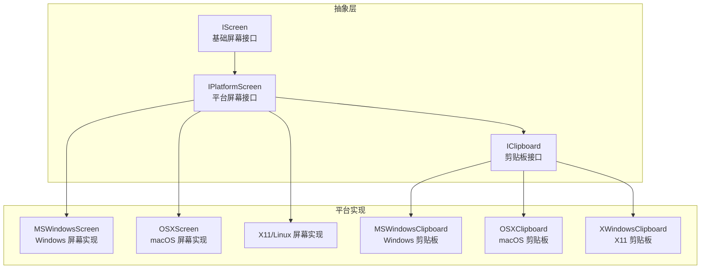
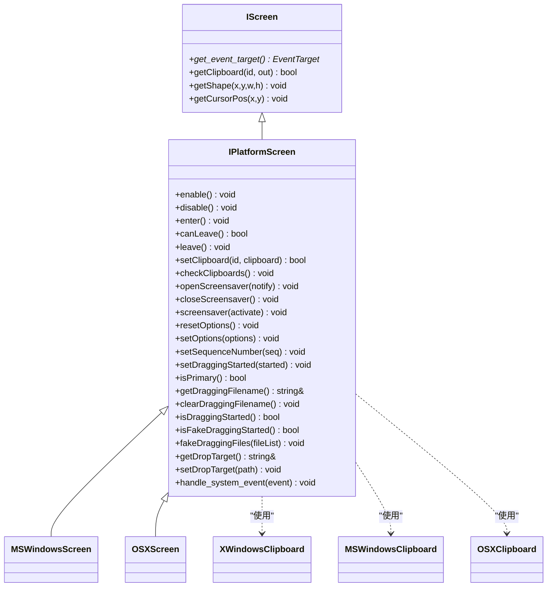
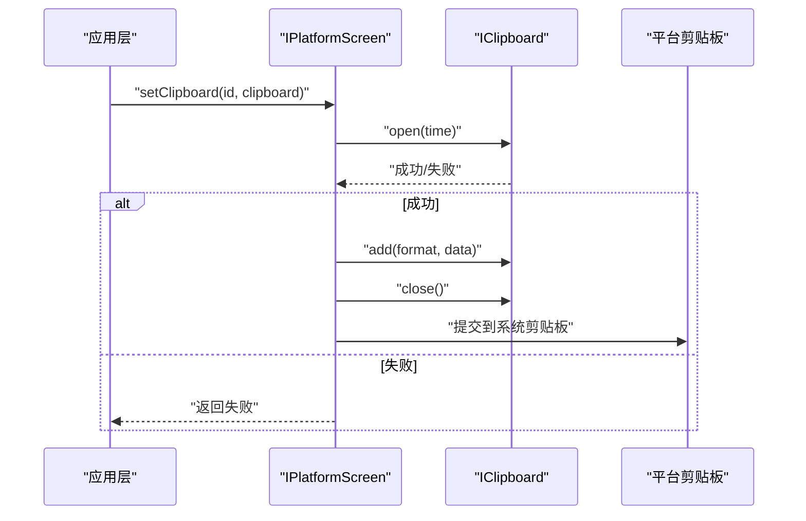
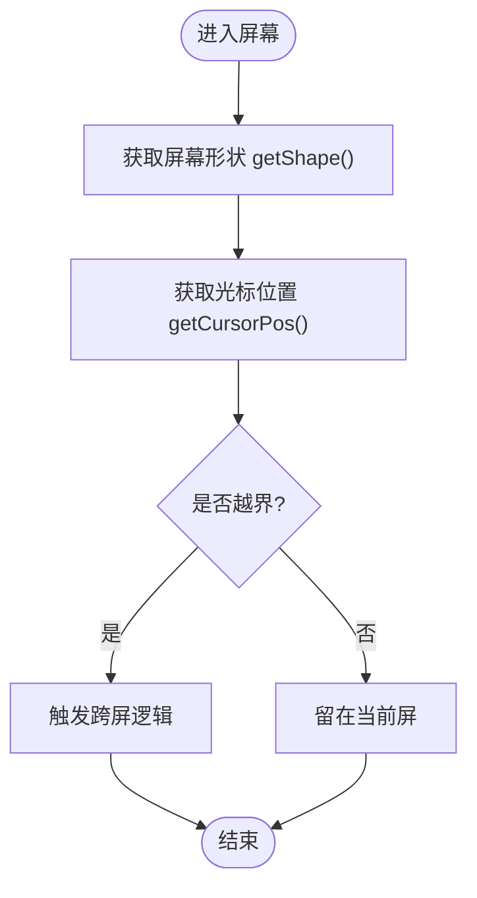
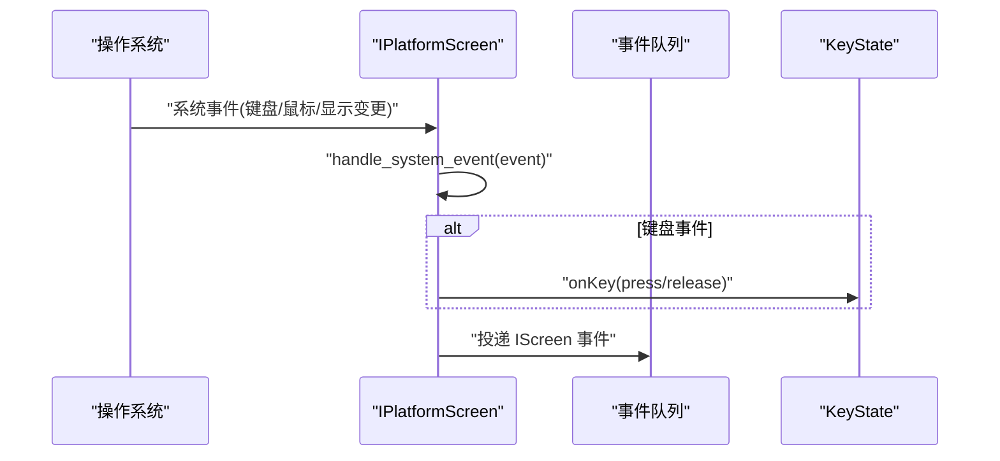
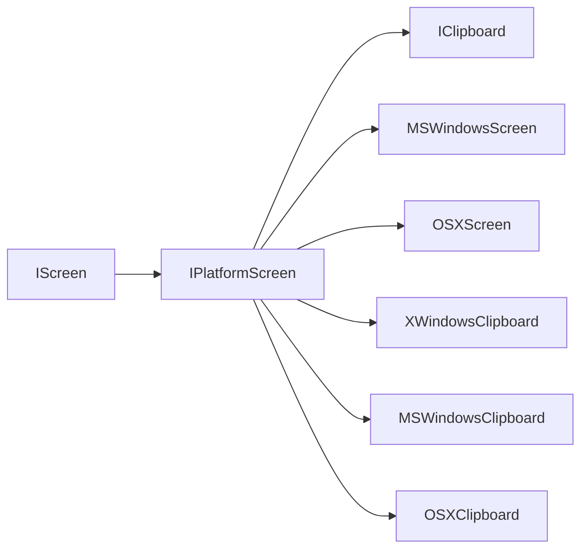

# 平台抽象层适配

<cite>
**本文引用的文件**   
- [IPlatformScreen.h](file://src/lib/inputleap/IPlatformScreen.h)
- [IScreen.h](file://src/lib/inputleap/IScreen.h)
- [IClipboard.h](file://src/lib/inputleap/IClipboard.h)
- [MSWindowsScreen.h](file://src/lib/platform/MSWindowsScreen.h)
- [OSXScreen.h](file://src/lib/platform/OSXScreen.h)
- [XWindowsClipboard.h](file://src/lib/platform/XWindowsClipboard.h)
- [MSWindowsClipboard.h](file://src/lib/platform/MSWindowsClipboard.h)
- [OSXClipboard.h](file://src/lib/platform/OSXClipboard.h)
</cite>

## 目录
1. [简介](#简介)
2. [项目结构](#项目结构)
3. [核心组件](#核心组件)
4. [架构总览](#架构总览)
5. [详细组件分析](#详细组件分析)
6. [依赖关系分析](#依赖关系分析)
7. [性能考虑](#性能考虑)
8. [故障排查指南](#故障排查指南)
9. [结论](#结论)
10. [附录：新平台适配开发指南](#附录新平台适配开发指南)

## 简介
本文件面向希望为 Input Leap 新增或维护平台抽象层的开发者，聚焦 IPlatformScreen 接口的设计理念与跨平台抽象策略，系统阐述 Windows、macOS 和 Linux 在输入捕获、屏幕坐标转换、剪贴板操作等方面的实现差异，并给出平台特定的优化与兼容性处理方案。文末提供新平台适配的开发指南（必需系统 API、权限要求、测试方法）以及调试技巧与常见问题解决方案。

## 项目结构
Input Leap 的平台相关能力集中在 src/lib/platform 与 src/lib/inputleap 两个层次：
- src/lib/inputleap：定义跨平台的抽象接口（如 IScreen、IPlatformScreen、IClipboard），屏蔽平台差异，供上层逻辑统一调用。
- src/lib/platform：各平台的具体实现（Windows、macOS、Linux/X11），负责与操作系统 API 交互，完成输入事件捕获、屏幕几何与光标位置查询、剪贴板读写等。

图表来源
- [IPlatformScreen.h:1-188](file://src/lib/inputleap/IPlatformScreen.h#L1-L188)
- [IScreen.h:1-76](file://src/lib/inputleap/IScreen.h#L1-L76)
- [IClipboard.h:1-178](file://src/lib/inputleap/IClipboard.h#L1-L178)
- [MSWindowsScreen.h](file://src/lib/platform/MSWindowsScreen.h)
- [OSXScreen.h](file://src/lib/platform/OSXScreen.h)
- [XWindowsClipboard.h](file://src/lib/platform/XWindowsClipboard.h)
- [MSWindowsClipboard.h](file://src/lib/platform/MSWindowsClipboard.h)
- [OSXClipboard.h](file://src/lib/platform/OSXClipboard.h)

章节来源
- [IPlatformScreen.h:1-188](file://src/lib/inputleap/IPlatformScreen.h#L1-L188)
- [IScreen.h:1-76](file://src/lib/inputleap/IScreen.h#L1-L76)
- [IClipboard.h:1-178](file://src/lib/inputleap/IClipboard.h#L1-L178)

## 核心组件
本节从接口契约角度梳理 IPlatformScreen 及其依赖的 IScreen、IClipboard，明确跨平台抽象的职责边界。

- IPlatformScreen
  - 职责：统一封装“主屏/副屏”生命周期（enable/disable/enter/leave）、系统事件处理（handle_system_event）、剪贴板同步（setClipboard/checkClipboards）、屏幕保护控制（openScreensaver/closeScreensaver/screensaver）、选项重置与设置（resetOptions/setOptions）、拖拽状态管理（setDraggingStarted/isDraggingStarted/fakeDraggingFiles 等）。
  - 设计要点：通过组合 IScreen/IPrimaryScreen/ISecondaryScreen/IKeyState 的能力，将平台无关的屏幕行为与平台相关的系统调用解耦；所有事件目标由 get_event_target() 返回，确保事件路由一致。

- IScreen
  - 职责：提供屏幕形状（getShape）、光标位置（getCursorPos）、剪贴板读取（getClipboard）与事件目标（get_event_target）等基础访问器。
  - 设计要点：作为最底层屏幕抽象，仅暴露必要的只读/查询能力，避免侵入平台细节。

- IClipboard
  - 职责：定义剪贴板的打开/关闭、清空、添加数据、格式检测与读取（open/close/clear/add/has/get），并提供序列化/反序列化与拷贝工具（marshall/unmarshall/copy）。
  - 设计要点：以 EFormat 枚举统一文本、HTML、位图及多种图像格式，屏蔽平台差异；时间戳用于去重与一致性校验。

章节来源
- [IPlatformScreen.h:31-185](file://src/lib/inputleap/IPlatformScreen.h#L31-L185)
- [IScreen.h:28-73](file://src/lib/inputleap/IScreen.h#L28-L73)
- [IClipboard.h:26-175](file://src/lib/inputleap/IClipboard.h#L26-L175)

## 架构总览
下图展示 IPlatformScreen 与各平台实现的继承关系，以及与剪贴板接口的协作方式。

图表来源
- [IPlatformScreen.h:31-185](file://src/lib/inputleap/IPlatformScreen.h#L31-L185)
- [IScreen.h:28-73](file://src/lib/inputleap/IScreen.h#L28-L73)
- [MSWindowsScreen.h](file://src/lib/platform/MSWindowsScreen.h)
- [OSXScreen.h](file://src/lib/platform/OSXScreen.h)
- [XWindowsClipboard.h](file://src/lib/platform/XWindowsClipboard.h)
- [MSWindowsClipboard.h](file://src/lib/platform/MSWindowsClipboard.h)
- [OSXClipboard.h](file://src/lib/platform/OSXClipboard.h)

## 详细组件分析

### IPlatformScreen 设计理念与跨平台抽象策略
- 单一职责与分层：IPlatformScreen 聚合了屏幕生命周期、系统事件、剪贴板、屏幕保护、选项与拖拽等多类职责，但通过组合 IScreen/IKeyState 等接口保持职责清晰，避免直接耦合平台 API。
- 事件驱动：通过 handle_system_event 接收系统事件，再按平台特性转换为 IScreen 事件模型，保证上层对事件流的一致性消费。
- 主/副屏差异化：通过 isPrimary 区分主屏与副屏，主屏需安装全局钩子/监听，副屏侧重事件合成与隐藏光标等行为。
- 剪贴板一致性：通过 setClipboard/checkClipboards 与序列号机制，保障多端剪贴板同步的幂等性与顺序性。

章节来源
- [IPlatformScreen.h:31-185](file://src/lib/inputleap/IPlatformScreen.h#L31-L185)
- [IScreen.h:28-73](file://src/lib/inputleap/IScreen.h#L28-L73)

### 剪贴板抽象与平台实现
- 抽象层：IClipboard 定义了统一的打开/关闭、清空、写入、读取流程，并以 EFormat 规范文本、HTML、位图与多种图像格式，同时提供 marshall/unmarshall/copy 工具函数，便于网络传输与本地复制。
- 平台差异：
  - Windows：MSWindowsClipboard 利用 Win32 剪贴板 API，注意 UTF-16 编码与元数据（如 HTML 片段）的兼容处理。
  - macOS：OSXClipboard 基于 Cocoa/AppKit，遵循 NSPasteboard 语义，注意富文本与图片格式的转换。
  - Linux/X11：XWindowsClipboard 基于 Xlib/XCB，需处理 CLIPBOARD/PRIMARY/SECONDARY 多个选择器与 UTF-8 编码。
- 同步策略：IPlatformScreen::setClipboard 负责将本地剪贴板内容推送至远端；checkClipboards 作为兜底轮询，弥补系统通知不可靠的情况。

图表来源
- [IPlatformScreen.h:81-93](file://src/lib/inputleap/IPlatformScreen.h#L81-L93)
- [IClipboard.h:95-135](file://src/lib/inputleap/IClipboard.h#L95-L135)
- [MSWindowsClipboard.h](file://src/lib/platform/MSWindowsClipboard.h)
- [OSXClipboard.h](file://src/lib/platform/OSXClipboard.h)
- [XWindowsClipboard.h](file://src/lib/platform/XWindowsClipboard.h)

章节来源
- [IClipboard.h:26-175](file://src/lib/inputleap/IClipboard.h#L26-L175)
- [IPlatformScreen.h:81-93](file://src/lib/inputleap/IPlatformScreen.h#L81-L93)

### 屏幕坐标与光标定位
- 屏幕形状：IScreen::getShape 返回左上角坐标与宽高，用于构建多显示器拓扑与鼠标越界判断。
- 光标位置：IScreen::getCursorPos 获取当前光标位置，配合屏幕形状进行跨屏移动计算。
- 平台差异：
  - Windows：通常使用 GetSystemMetrics/EnumDisplayMonitors 与 GetCursorPos。
  - macOS：使用 NSScreen/CGDisplay 与 CGGetLocalEventsState 等 API。
  - Linux/X11：使用 Xinerama/XRandr 与 XWarpPointer/XQueryPointer。

图表来源
- [IScreen.h:58-70](file://src/lib/inputleap/IScreen.h#L58-L70)

章节来源
- [IScreen.h:58-70](file://src/lib/inputleap/IScreen.h#L58-L70)

### 系统事件处理与键盘状态
- 事件入口：IPlatformScreen::handle_system_event 负责注册系统事件处理器，并将平台事件映射为 IScreen 事件。
- 键盘状态：主屏需在按键按下/释放时更新 KeyState（不包含重复键），并在键盘映射变化时调用 updateKeyMap。
- 事件目标：所有事件的目标应来自 get_event_target()，确保事件路由正确。

图表来源
- [IPlatformScreen.h:162-184](file://src/lib/inputleap/IPlatformScreen.h#L162-L184)

章节来源
- [IPlatformScreen.h:162-184](file://src/lib/inputleap/IPlatformScreen.h#L162-L184)

### 屏幕保护控制
- openScreensaver(notify)：可选择开启通知模式（上报激活/停用）或直接禁用屏幕保护。
- closeScreensaver()：恢复之前状态或停止通知。
- screensaver(activate)：强制激活或停用屏幕保护。

章节来源
- [IPlatformScreen.h:95-117](file://src/lib/inputleap/IPlatformScreen.h#L95-L117)

### 选项与拖拽
- 选项：resetOptions 重置默认值；setOptions 增量更新未知选项将被忽略。
- 拖拽：setDraggingStarted/isDraggingStarted/isFakeDraggingStarted 管理拖拽状态；fakeDraggingFiles 模拟拖拽文件列表；getDropTarget/setDropTarget 管理拖放目标路径。

章节来源
- [IPlatformScreen.h:119-161](file://src/lib/inputleap/IPlatformScreen.h#L119-L161)

## 依赖关系分析
- 组件内聚与耦合：
  - IPlatformScreen 高内聚地封装平台屏幕能力，低耦合于 IScreen/IKeyState/IClipboard。
  - 平台实现（MSWindowsScreen、OSXScreen）仅依赖抽象接口，降低与具体系统 API 的直接耦合度。
- 外部依赖：
  - Windows：Win32 API（剪贴板、显示、输入钩子）。
  - macOS：Cocoa/AppKit/Quartz（NSPasteboard、NSScreen、CGEvent）。
  - Linux/X11：Xlib/XCB/Xinerama/XRandr（选择器、显示信息、指针）。
- 潜在循环依赖：抽象层不依赖平台实现，平台实现依赖抽象层，无循环依赖风险。

图表来源
- [IPlatformScreen.h:31-185](file://src/lib/inputleap/IPlatformScreen.h#L31-L185)
- [IScreen.h:28-73](file://src/lib/inputleap/IScreen.h#L28-L73)
- [IClipboard.h:26-175](file://src/lib/inputleap/IClipboard.h#L26-L175)
- [MSWindowsScreen.h](file://src/lib/platform/MSWindowsScreen.h)
- [OSXScreen.h](file://src/lib/platform/OSXScreen.h)
- [XWindowsClipboard.h](file://src/lib/platform/XWindowsClipboard.h)
- [MSWindowsClipboard.h](file://src/lib/platform/MSWindowsClipboard.h)
- [OSXClipboard.h](file://src/lib/platform/OSXClipboard.h)

章节来源
- [IPlatformScreen.h:31-185](file://src/lib/inputleap/IPlatformScreen.h#L31-L185)
- [IScreen.h:28-73](file://src/lib/inputleap/IScreen.h#L28-L73)
- [IClipboard.h:26-175](file://src/lib/inputleap/IClipboard.h#L26-L175)

## 性能考虑
- 事件节流与批处理：在高频率输入场景下，合并相近事件以减少 UI 与网络开销。
- 剪贴板缓存与去重：结合序列号与时间戳，避免重复同步；对大对象（图片）采用懒加载与压缩。
- 显示信息查询缓存：屏幕拓扑与 DPI 变化较少，可缓存结果并在显示配置变更时失效。
- 线程安全：事件处理与剪贴板访问需加锁或使用消息队列，避免竞态条件。

## 故障排查指南
- 剪贴板不同步
  - 现象：远端未收到最新剪贴板内容。
  - 排查：检查 setClipboard 返回值与 checkClipboards 轮询是否生效；确认 EFormat 与编码（UTF-8/UTF-16）一致；验证序列号递增。
  - 参考：[IPlatformScreen.h:81-93](file://src/lib/inputleap/IPlatformScreen.h#L81-L93)、[IClipboard.h:95-135](file://src/lib/inputleap/IClipboard.h#L95-L135)
- 跨屏移动异常
  - 现象：鼠标越界后无法切换屏幕。
  - 排查：核对 getShape 与 getCursorPos 返回值；确认屏幕拓扑配置；检查事件目标是否为 get_event_target()。
  - 参考：[IScreen.h:58-70](file://src/lib/inputleap/IScreen.h#L58-L70)、[IPlatformScreen.h:162-184](file://src/lib/inputleap/IPlatformScreen.h#L162-L184)
- 键盘映射不一致
  - 现象：按键输出错误。
  - 排查：确认主屏 onKey 调用时机（不含重复键）；在键盘映射变化时调用 updateKeyMap。
  - 参考：[IPlatformScreen.h:162-184](file://src/lib/inputleap/IPlatformScreen.h#L162-L184)
- 屏幕保护控制无效
  - 现象：openScreensaver/screensaver 未生效。
  - 排查：检查平台权限（如 macOS 辅助功能权限）；确认 notify 模式是否正确上报激活/停用事件。
  - 参考：[IPlatformScreen.h:95-117](file://src/lib/inputleap/IPlatformScreen.h#L95-L117)

章节来源
- [IPlatformScreen.h:81-117](file://src/lib/inputleap/IPlatformScreen.h#L81-L117)
- [IScreen.h:58-70](file://src/lib/inputleap/IScreen.h#L58-L70)
- [IClipboard.h:95-135](file://src/lib/inputleap/IClipboard.h#L95-L135)

## 结论
IPlatformScreen 通过清晰的接口契约与组合式抽象，有效屏蔽了 Windows、macOS 与 Linux 的差异，使上层业务无需关心平台细节即可实现跨屏输入共享。配合 IClipboard 的统一剪贴板模型与 IScreen 的基础屏幕能力，系统具备良好的可扩展性与可维护性。针对新平台接入，建议严格遵循接口契约，完善权限与兼容性处理，并通过单元测试与集成测试覆盖关键路径。

## 附录：新平台适配开发指南
- 必需的系统 API
  - 输入捕获：全局键盘/鼠标钩子或事件监听。
  - 屏幕信息：显示器枚举、分辨率与布局查询、DPI 感知。
  - 光标控制：获取与设置光标位置、隐藏/显示光标。
  - 剪贴板：打开/关闭、清空、写入、读取，支持文本、HTML、位图与常见图像格式。
  - 屏幕保护：启用/禁用、激活/停用、事件上报。
- 权限要求
  - 无障碍/辅助功能权限（macOS）。
  - 输入监控与全局钩子权限（Windows）。
  - X11 访问权限与选择器访问（Linux）。
- 实现步骤
  - 新建平台屏幕类，继承 IPlatformScreen，实现 enable/disable/enter/leave/canLeave 等生命周期方法。
  - 实现 handle_system_event，注册系统事件处理器，并将事件映射为 IScreen 事件。
  - 实现 getShape/getCursorPos/getClipboard 等 IScreen 访问器。
  - 实现 setClipboard/checkClipboards 与 IClipboard 平台实现对接。
  - 实现 openScreensaver/closeScreensaver/screensaver 与 resetOptions/setOptions。
  - 实现拖拽相关方法与序列号管理。
- 测试方法
  - 单元测试：模拟系统事件，验证事件路由与 KeyState 更新。
  - 集成测试：多显示器拓扑、跨屏移动、剪贴板同步、屏幕保护控制。
  - 兼容性测试：不同 DPI、多语言键盘布局、第三方软件干扰。
- 调试技巧
  - 日志：记录事件类型、参数、序列号与时间戳。
  - 断点：在 handle_system_event 与 setClipboard 处断点，观察调用链。
  - 抓包：网络层抓包验证事件与剪贴板数据序列化/反序列化。
  - 平台工具：Windows 的 Spy++/API Monitor，macOS 的 Console/Instruments，Linux 的 xev/Xephyr。