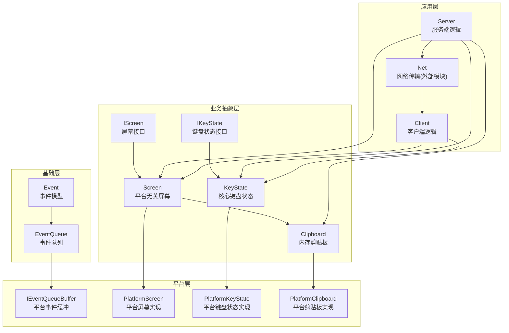
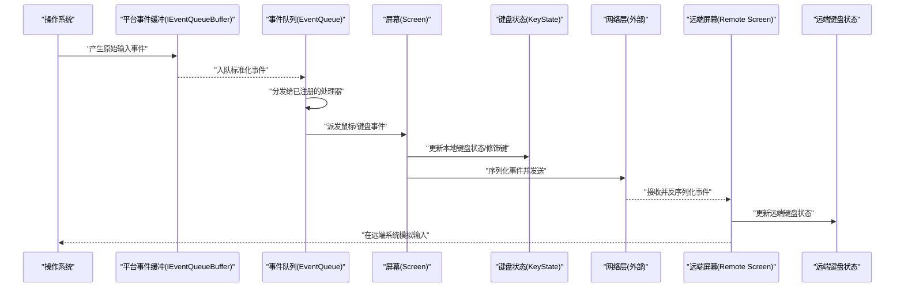
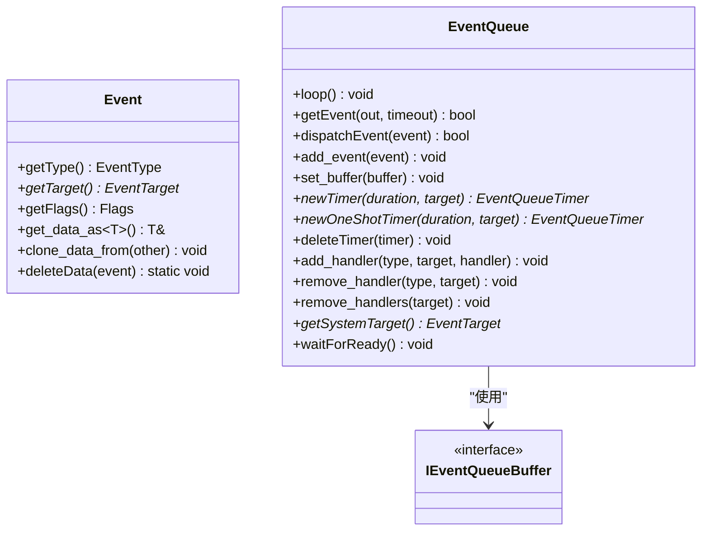
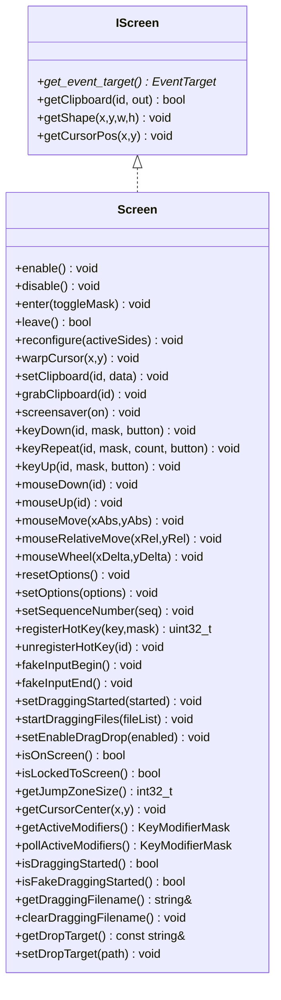
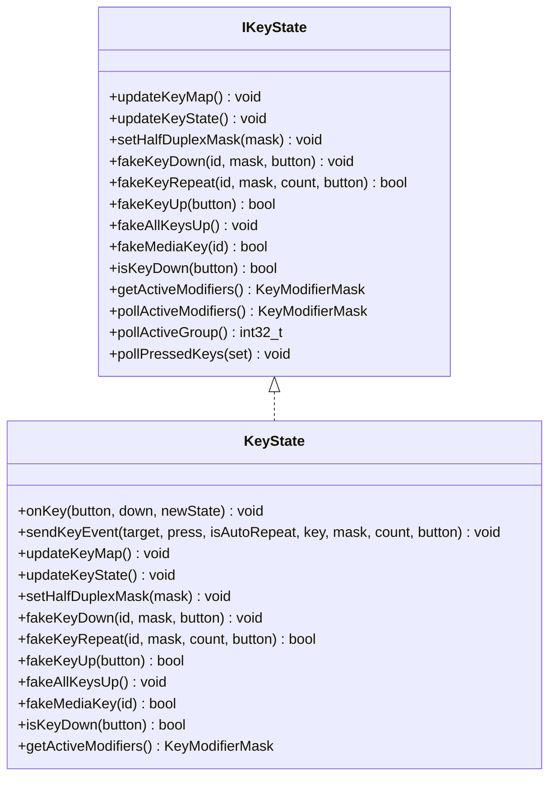
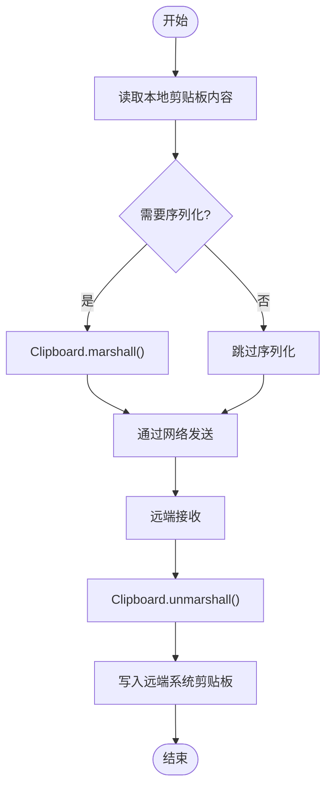
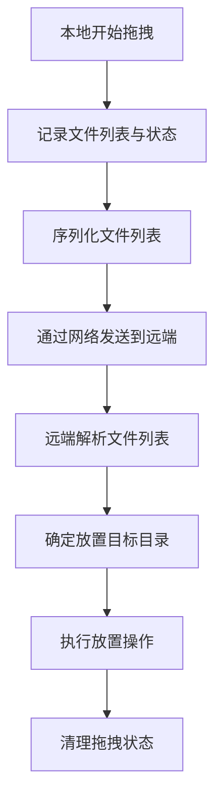
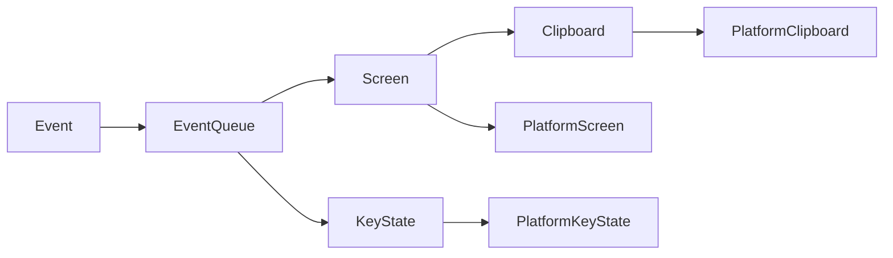

# 数据流与事件处理

<cite>
**本文引用的文件**
- [Event.h](file://src/lib/base/Event.h)
- [EventQueue.h](file://src/lib/base/EventQueue.h)
- [IScreen.h](file://src/lib/inputleap/IScreen.h)
- [Screen.h](file://src/lib/inputleap/Screen.h)
- [Clipboard.h](file://src/lib/inputleap/Clipboard.h)
- [IKeyState.h](file://src/lib/inputleap/IKeyState.h)
- [KeyState.h](file://src/lib/inputleap/KeyState.h)
</cite>

## 目录
1. [简介](#简介)
2. [项目结构](#项目结构)
3. [核心组件](#核心组件)
4. [架构总览](#架构总览)
5. [详细组件分析](#详细组件分析)
6. [依赖关系分析](#依赖关系分析)
7. [性能考虑](#性能考虑)
8. [故障排查指南](#故障排查指南)
9. [结论](#结论)
10. [附录](#附录)

## 简介
本文件聚焦 Input Leap 的数据流与事件处理，围绕输入事件的捕获、标准化、序列化/反序列化、网络传输与模拟的完整链路展开。文档同时覆盖剪贴板同步机制、文件拖拽处理流程以及键盘状态维护策略，并通过数据流图展示事件在各组件间的流转过程，最后给出性能优化与调试技巧建议。

## 项目结构
Input Leap 的事件与数据流主要分布在以下层次：
- 基础层（base）：定义通用事件模型与事件队列，提供跨平台的事件分发与计时器能力。
- 业务抽象层（inputleap）：定义屏幕、剪贴板、键盘状态等核心抽象，屏蔽平台差异。
- 平台层（platform）：实现具体平台的屏幕、剪贴板、键盘状态与事件缓冲。
- 应用层（server/client/gui）：组合上述抽象完成服务器/客户端逻辑与用户界面。

图表来源
- [Event.h:1-153](file://src/lib/base/Event.h#L1-L153)
- [EventQueue.h:1-135](file://src/lib/base/EventQueue.h#L1-L135)
- [IScreen.h:1-76](file://src/lib/inputleap/IScreen.h#L1-L76)
- [Screen.h:1-346](file://src/lib/inputleap/Screen.h#L1-L346)
- [IKeyState.h:1-188](file://src/lib/inputleap/IKeyState.h#L1-L188)
- [KeyState.h:1-228](file://src/lib/inputleap/KeyState.h#L1-L228)
- [Clipboard.h:1-76](file://src/lib/inputleap/Clipboard.h#L1-L76)

章节来源
- [Event.h:1-153](file://src/lib/base/Event.h#L1-L153)
- [EventQueue.h:1-135](file://src/lib/base/EventQueue.h#L1-L135)
- [IScreen.h:1-76](file://src/lib/inputleap/IScreen.h#L1-L76)
- [Screen.h:1-346](file://src/lib/inputleap/Screen.h#L1-L346)
- [IKeyState.h:1-188](file://src/lib/inputleap/IKeyState.h#L1-L188)
- [KeyState.h:1-228](file://src/lib/inputleap/KeyState.h#L1-L228)
- [Clipboard.h:1-76](file://src/lib/inputleap/Clipboard.h#L1-L76)

## 核心组件
- 事件模型 Event：封装事件类型、目标、数据与标志位，支持可移动语义与数据克隆。
- 事件队列 EventQueue：线程安全的事件循环、处理器注册、定时器管理与平台缓冲解耦。
- 屏幕抽象 IScreen/Screen：统一屏幕操作（形状、光标、剪贴板、热键、拖拽、合成输入），并桥接平台实现。
- 键盘状态 IKeyState/KeyState：维护按键按下计数、修饰键状态、映射表与合成按键序列。
- 剪贴板 Clipboard：内存中多格式存储，提供序列化/反序列化接口用于跨进程/网络传输。

章节来源
- [Event.h:1-153](file://src/lib/base/Event.h#L1-L153)
- [EventQueue.h:1-135](file://src/lib/base/EventQueue.h#L1-L135)
- [IScreen.h:1-76](file://src/lib/inputleap/IScreen.h#L1-L76)
- [Screen.h:1-346](file://src/lib/inputleap/Screen.h#L1-L346)
- [IKeyState.h:1-188](file://src/lib/inputleap/IKeyState.h#L1-L188)
- [KeyState.h:1-228](file://src/lib/inputleap/KeyState.h#L1-L228)
- [Clipboard.h:1-76](file://src/lib/inputleap/Clipboard.h#L1-L76)

## 架构总览
下图展示了从平台输入到网络传输再到远端模拟的整体数据流。

图表来源
- [EventQueue.h:1-135](file://src/lib/base/EventQueue.h#L1-L135)
- [Screen.h:1-346](file://src/lib/inputleap/Screen.h#L1-L346)
- [KeyState.h:1-228](file://src/lib/inputleap/KeyState.h#L1-L228)

## 详细组件分析

### 事件模型与队列
- Event 数据结构包含类型、目标、数据指针与标志位；通过模板化 EventData 承载具体事件负载，并提供 clone 与 deleteData 管理生命周期。
- EventQueue 提供 loop/getEvent/dispatchEvent/add_event 等接口，内部维护处理器表、保存事件表、定时器堆与平台缓冲；通过 set_buffer 注入平台相关的事件缓冲实现，从而将平台细节与跨平台调度解耦。

图表来源
- [Event.h:1-153](file://src/lib/base/Event.h#L1-L153)
- [EventQueue.h:1-135](file://src/lib/base/EventQueue.h#L1-L135)

章节来源
- [Event.h:1-153](file://src/lib/base/Event.h#L1-L153)
- [EventQueue.h:1-135](file://src/lib/base/EventQueue.h#L1-L135)

### 屏幕抽象与合成输入
- IScreen 定义了获取事件目标、剪贴板访问、屏幕形状与光标位置等通用能力。
- Screen 作为平台无关屏幕，负责：
  - 激活/停用、进入/离开屏幕的生命周期管理
  - 合成输入：keyDown/keyRepeat/keyUp、mouseDown/mouseUp/mouseMove/mouseRelativeMove/mouseWheel
  - 剪贴板设置与抓取、屏幕保护控制、全局热键注册
  - 拖拽状态与文件列表管理、假输入过滤（避免回环）
  - 选项重置与配置变更响应

图表来源
- [IScreen.h:1-76](file://src/lib/inputleap/IScreen.h#L1-L76)
- [Screen.h:1-346](file://src/lib/inputleap/Screen.h#L1-L346)

章节来源
- [IScreen.h:1-76](file://src/lib/inputleap/IScreen.h#L1-L76)
- [Screen.h:1-346](file://src/lib/inputleap/Screen.h#L1-L346)

### 键盘状态维护策略
- IKeyState 定义了更新键映射、更新物理状态、半双工修饰键掩码、伪造按键（按下/重复/释放）、媒体键、查询当前修饰键与按下键集合等能力。
- KeyState 维护：
  - 当前修饰键状态与活动修饰键集合
  - 每个物理键的按下计数与“合成键”计数，区分本地按下与远程合成
  - 服务器侧键映射（本地键到服务器键的对应）
  - 通过 sendKeyEvent/fakeKeys 等内部方法生成按键序列，结合 KeyMap 进行映射与别名/组合键扩展

图表来源
- [IKeyState.h:1-188](file://src/lib/inputleap/IKeyState.h#L1-L188)
- [KeyState.h:1-228](file://src/lib/inputleap/KeyState.h#L1-L228)

章节来源
- [IKeyState.h:1-188](file://src/lib/inputleap/IKeyState.h#L1-L188)
- [KeyState.h:1-228](file://src/lib/inputleap/KeyState.h#L1-L228)

### 剪贴板同步机制
- Clipboard 在内存中按格式存储数据，并提供 marshall/unmarshall 接口以进行序列化/反序列化，便于跨进程或网络传输。
- Screen 暴露 setClipboard/grabClipboard 等方法，驱动平台剪贴板实现与序列化的调用点。

图表来源
- [Clipboard.h:1-76](file://src/lib/inputleap/Clipboard.h#L1-L76)
- [Screen.h:1-346](file://src/lib/inputleap/Screen.h#L1-L346)

章节来源
- [Clipboard.h:1-76](file://src/lib/inputleap/Clipboard.h#L1-L76)
- [Screen.h:1-346](file://src/lib/inputleap/Screen.h#L1-L346)

### 文件拖拽处理流程
- Screen 提供 setDraggingStarted/startDraggingFiles/isDraggingStarted/isFakeDraggingStarted/getDraggingFilename/clearDraggingFilename/setDropTarget 等接口，用于协调本地与远端的拖拽状态与目标目录。
- 典型流程：
  - 本地开始拖拽：记录文件列表与状态
  - 传输至远端：序列化文件路径列表
  - 远端应用：根据目标目录执行放置操作
  - 清理状态：拖拽结束后清除文件名与目标目录

图表来源
- [Screen.h:1-346](file://src/lib/inputleap/Screen.h#L1-L346)

章节来源
- [Screen.h:1-346](file://src/lib/inputleap/Screen.h#L1-L346)

## 依赖关系分析
- 事件模型与队列为所有上层组件提供统一的异步事件通道。
- Screen 依赖 IEventQueue 进行事件派发，依赖平台屏幕实现进行底层输入输出。
- KeyState 依赖 KeyMap 进行键映射与别名/组合键扩展，并通过事件队列上报合成事件。
- Clipboard 作为纯内存载体，被 Screen 与平台剪贴板实现共同使用。

图表来源
- [Event.h:1-153](file://src/lib/base/Event.h#L1-L153)
- [EventQueue.h:1-135](file://src/lib/base/EventQueue.h#L1-L135)
- [Screen.h:1-346](file://src/lib/inputleap/Screen.h#L1-L346)
- [KeyState.h:1-228](file://src/lib/inputleap/KeyState.h#L1-L228)
- [Clipboard.h:1-76](file://src/lib/inputleap/Clipboard.h#L1-L76)

章节来源
- [Event.h:1-153](file://src/lib/base/Event.h#L1-L153)
- [EventQueue.h:1-135](file://src/lib/base/EventQueue.h#L1-L135)
- [Screen.h:1-346](file://src/lib/inputleap/Screen.h#L1-L346)
- [KeyState.h:1-228](file://src/lib/inputleap/KeyState.h#L1-L228)
- [Clipboard.h:1-76](file://src/lib/inputleap/Clipboard.h#L1-L76)

## 性能考虑
- 事件批处理与节流：在高频率输入场景下，尽量合并相近事件以减少网络包数量与 CPU 上下文切换开销。
- 序列化优化：对剪贴板大对象（如图片）采用压缩或分块传输，避免阻塞主事件循环。
- 事件队列优先级：利用 EventQueue 的定时器与优先级机制，确保关键事件（如鼠标移动）低延迟。
- 平台缓冲解耦：通过 IEventQueueBuffer 将平台采集与调度分离，便于在不同平台上选择更高效的采集策略。
- 键盘状态去抖：合理维护合成键计数与修饰键状态，避免重复发送相同状态的按键事件。

[本节为通用指导，不直接分析具体文件]

## 故障排查指南
- 事件未到达处理器：检查 EventQueue 是否已正确 set_buffer，确认 add_handler 注册的目标与类型是否正确。
- 键盘状态不一致：核对本地与合成的按键计数，确认 half-duplex 掩码设置是否符合预期。
- 剪贴板不同步：验证 marshall/unmarshall 的格式一致性，检查序列号与所有权时间戳是否冲突。
- 拖拽失败：确认文件列表序列化完整性与远端目标目录权限，检查拖拽状态清理是否及时。

章节来源
- [EventQueue.h:1-135](file://src/lib/base/EventQueue.h#L1-L135)
- [KeyState.h:1-228](file://src/lib/inputleap/KeyState.h#L1-L228)
- [Clipboard.h:1-76](file://src/lib/inputleap/Clipboard.h#L1-L76)
- [Screen.h:1-346](file://src/lib/inputleap/Screen.h#L1-L346)

## 结论
Input Leap 通过清晰的分层设计与解耦的事件队列，实现了从平台输入到网络传输再到远端模拟的完整数据流。Screen 与 KeyState 提供了强大的合成输入与状态管理能力，Clipboard 则支撑了跨设备的剪贴板同步。遵循本文的性能与排障建议，可进一步提升系统的稳定性与用户体验。

[本节为总结性内容，不直接分析具体文件]

## 附录
- 术语说明：
  - 事件：描述一次输入动作的抽象，包括类型、目标、数据与标志位。
  - 合成输入：由程序生成的输入事件，用于在远端系统模拟真实输入。
  - 半双工修饰键：在按下与释放时行为不对称的修饰键，需特殊处理。
- 参考接口路径：
  - 事件模型与队列：[Event.h](file://src/lib/base/Event.h), [EventQueue.h](file://src/lib/base/EventQueue.h)
  - 屏幕抽象与合成输入：[IScreen.h](file://src/lib/inputleap/IScreen.h), [Screen.h](file://src/lib/inputleap/Screen.h)
  - 键盘状态：[IKeyState.h](file://src/lib/inputleap/IKeyState.h), [KeyState.h](file://src/lib/inputleap/KeyState.h)
  - 剪贴板：[Clipboard.h](file://src/lib/inputleap/Clipboard.h)