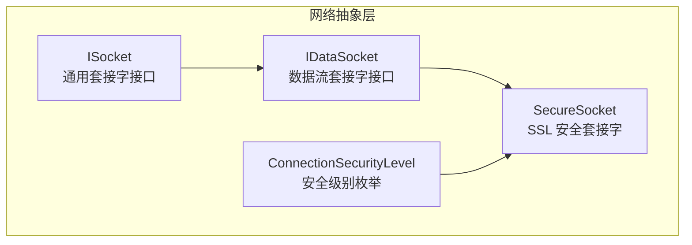
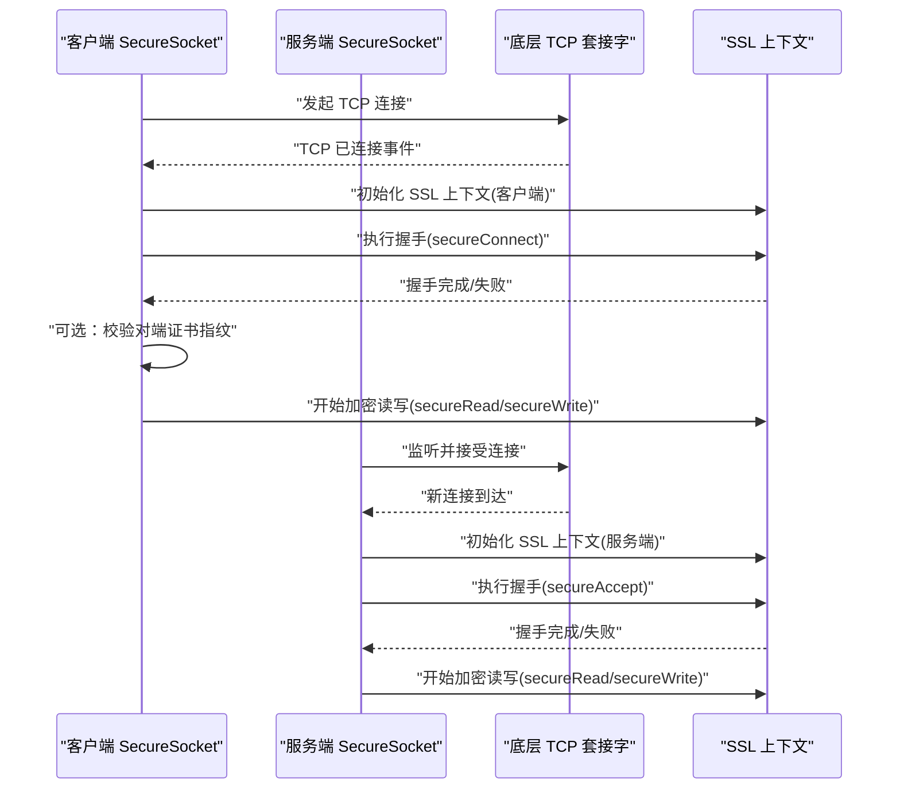
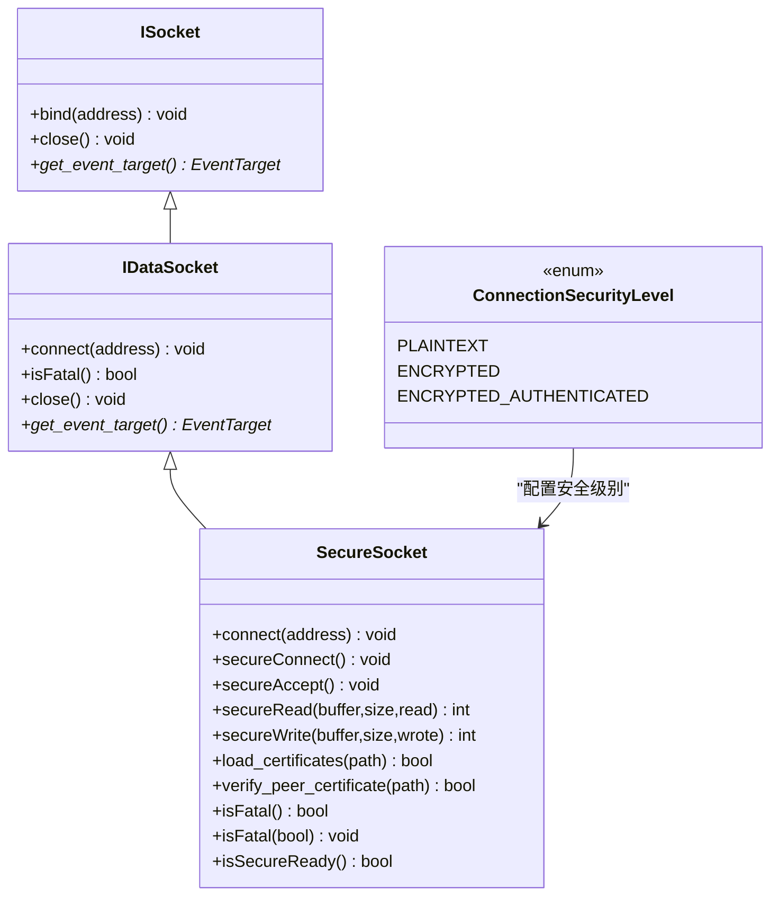
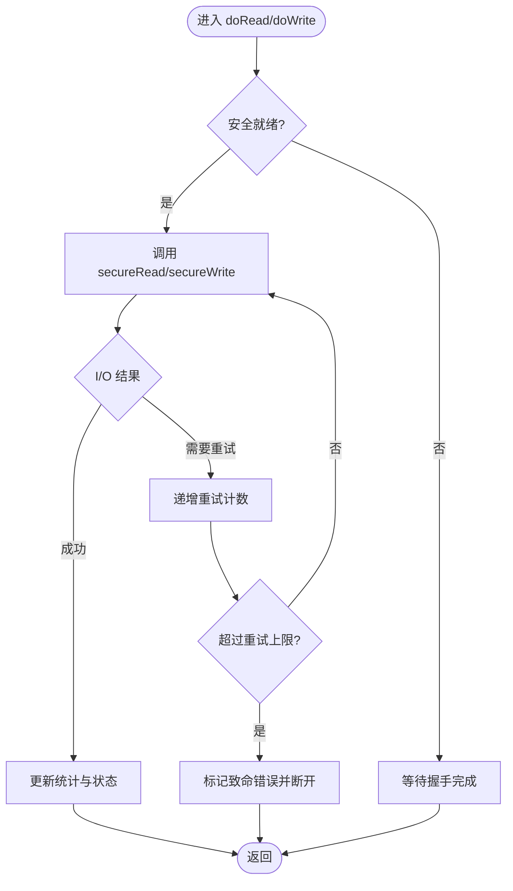
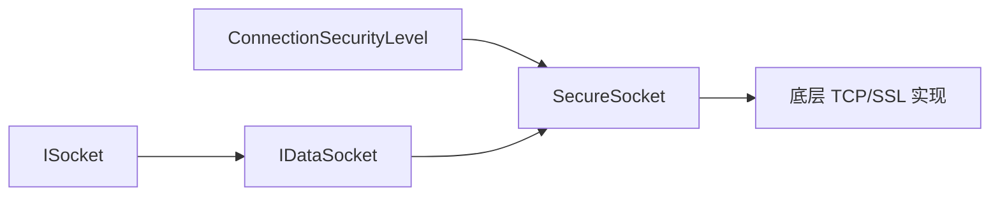

# 网络数据传输协议

<cite>
**本文引用的文件**   
- [ISocket.h](file://src/lib/net/ISocket.h)
- [IDataSocket.h](file://src/lib/net/IDataSocket.h)
- [SecureSocket.h](file://src/lib/net/SecureSocket.h)
- [ConnectionSecurityLevel.h](file://src/lib/net/ConnectionSecurityLevel.h)
</cite>

## 目录
1. [简介](#简介)
2. [项目结构](#项目结构)
3. [核心组件](#核心组件)
4. [架构总览](#架构总览)
5. [详细组件分析](#详细组件分析)
6. [依赖关系分析](#依赖关系分析)
7. [性能考虑](#性能考虑)
8. [故障诊断指南](#故障诊断指南)
9. [结论](#结论)
10. [附录](#附录)

## 简介
本文件面向 Input Leap 的网络数据传输协议，聚焦 TCP 连接的建立与维护、数据包的序列化与反序列化、SSL/TLS 加密通信、以及网络性能监控与优化。文档以代码级视角梳理关键接口与实现要点，并辅以图示帮助理解连接生命周期、安全握手流程与读写路径。

## 项目结构
Input Leap 的网络层位于 src/lib/net，提供统一的套接字抽象、数据流接口与安全封装：
- ISocket：通用套接字接口（绑定、关闭、事件目标）
- IDataSocket：全双工数据流套接字接口（连接、致命错误状态）
- SecureSocket：基于 SSL 的安全传输封装，继承自 TCPSocket
- ConnectionSecurityLevel：连接安全级别枚举（明文、加密、加密且认证）

图表来源
- [ISocket.h:1-65](file://src/lib/net/ISocket.h#L1-L65)
- [IDataSocket.h:1-70](file://src/lib/net/IDataSocket.h#L1-L70)
- [SecureSocket.h:1-114](file://src/lib/net/SecureSocket.h#L1-L114)
- [ConnectionSecurityLevel.h:1-25](file://src/lib/net/ConnectionSecurityLevel.h#L1-L25)

章节来源
- [ISocket.h:1-65](file://src/lib/net/ISocket.h#L1-L65)
- [IDataSocket.h:1-70](file://src/lib/net/IDataSocket.h#L1-L70)
- [SecureSocket.h:1-114](file://src/lib/net/SecureSocket.h#L1-L114)
- [ConnectionSecurityLevel.h:1-25](file://src/lib/net/ConnectionSecurityLevel.h#L1-L25)

## 核心组件
- ISocket
  - 职责：定义所有套接字的公共能力（bind、close、获取事件目标）。
  - 关键点：事件目标用于将底层 I/O 事件上抛给上层处理。
- IDataSocket
  - 职责：扩展为可连接的数据流套接字，支持异步 connect 与致命错误判断。
  - 关键点：connect 返回后立即进行，成功或失败通过事件通知；isFatal 标识不可恢复错误。
- SecureSocket
  - 职责：在 TCP 之上叠加 SSL/TLS，负责握手、证书校验、加解密读写。
  - 关键点：维护安全就绪标志、致命错误标志、重试计数；提供 secureConnect/secureAccept、secureRead/secureWrite、证书加载与对端指纹验证等能力。
- ConnectionSecurityLevel
  - 职责：描述连接安全策略（明文、加密、加密且认证）。

章节来源
- [ISocket.h:1-65](file://src/lib/net/ISocket.h#L1-L65)
- [IDataSocket.h:1-70](file://src/lib/net/IDataSocket.h#L1-L70)
- [SecureSocket.h:1-114](file://src/lib/net/SecureSocket.h#L1-L114)
- [ConnectionSecurityLevel.h:1-25](file://src/lib/net/ConnectionSecurityLevel.h#L1-L25)

## 架构总览
下图展示客户端与服务端在建立 TCP 与 TLS 连接时的交互顺序，包括握手、证书校验与后续加解密读写。

图表来源
- [SecureSocket.h:1-114](file://src/lib/net/SecureSocket.h#L1-L114)
- [IDataSocket.h:1-70](file://src/lib/net/IDataSocket.h#L1-L70)

## 详细组件分析

### 类关系与职责

图表来源
- [ISocket.h:1-65](file://src/lib/net/ISocket.h#L1-L65)
- [IDataSocket.h:1-70](file://src/lib/net/IDataSocket.h#L1-L70)
- [SecureSocket.h:1-114](file://src/lib/net/SecureSocket.h#L1-L114)
- [ConnectionSecurityLevel.h:1-25](file://src/lib/net/ConnectionSecurityLevel.h#L1-L25)

章节来源
- [ISocket.h:1-65](file://src/lib/net/ISocket.h#L1-L65)
- [IDataSocket.h:1-70](file://src/lib/net/IDataSocket.h#L1-L70)
- [SecureSocket.h:1-114](file://src/lib/net/SecureSocket.h#L1-L114)
- [ConnectionSecurityLevel.h:1-25](file://src/lib/net/ConnectionSecurityLevel.h#L1-L25)

### TCP 连接建立与维护机制
- 连接建立
  - 使用 IDataSocket::connect 发起非阻塞连接，成功后触发“已连接”事件；失败则触发“连接失败”事件。
  - 在 SecureSocket 中，TCP 连接成功后进入 SSL 握手阶段（secureConnect/secureAccept），完成后标记安全就绪。
- 连接维护
  - isFatal 用于指示是否发生不可恢复错误，上层据此决定是否重连或释放资源。
  - SecureSocket 内部维护多个重试计数器（accept/connect/read/write），配合多路复用器 Job 的 serviceConnect/serviceAccept 控制重试与退避。
- 连接池管理
  - 当前接口未暴露显式连接池 API；连接池通常由上层管理器统一创建、复用与回收。建议在上层按角色（主通道/心跳通道）与用途（事件/剪贴板）划分连接，结合空闲超时与最大连接数限制进行管理。
- 重连策略
  - 当 isFatal 为真或握手失败时，应触发指数退避重连；若为临时性错误（如网络抖动），采用有限次快速重试后降级到指数退避。
  - 建议在重连前清理 SSL 上下文与缓冲区，避免状态污染。
- 错误处理
  - 区分致命与非致命错误：致命错误直接上报并终止连接；非致命错误记录日志并尝试恢复。
  - 握手阶段的错误需区分证书问题、协议不匹配与网络异常，分别采取不同处理策略。

章节来源
- [IDataSocket.h:1-70](file://src/lib/net/IDataSocket.h#L1-L70)
- [SecureSocket.h:1-114](file://src/lib/net/SecureSocket.h#L1-L114)

### 数据包序列化与反序列化
- 设计原则
  - 事件驱动：底层 I/O 事件经 ISocket 的事件目标上抛，上层根据事件类型分发到对应处理器。
  - 流式传输：IDataSocket 提供统一的读/写接口，上层在其上实现自定义帧格式（长度前缀+类型+负载）。
- 编码格式建议
  - 头部：固定长度的帧头（包含版本、消息类型、负载长度、序列号）。
  - 负载：事件数据的紧凑二进制编码（优先使用定长字段与变长整型编码）。
  - 校验：可选 CRC 或 HMAC（在 TLS 启用时，HMAC 可由应用层额外签名增强完整性）。
- 网络传输优化
  - 批量发送：合并小事件以减少系统调用开销。
  - 零拷贝：尽量使用缓冲区的连续内存块进行 writev/聚合写入。
  - 背压控制：当对端读取缓慢时，暂停上游事件采集，避免队列膨胀。
- 反序列化流程
  - 从输入流读取固定长度帧头，解析出负载长度与类型。
  - 按类型分派到相应解码器，校验长度与边界，构造领域对象。
  - 将对象入队至事件队列，交由业务线程处理。

[本节为概念性说明，不直接分析具体文件]

### SSL/TLS 加密通信实现
- 安全级别
  - ConnectionSecurityLevel 提供三种模式：明文、加密、加密且认证。SecureSocket 根据级别选择是否进行证书校验。
- 握手流程
  - 客户端：initContext(server=false) → secureConnect → verify_peer_certificate（可选）→ 安全就绪。
  - 服务端：initContext(server=true) → secureAccept → 安全就绪。
- 证书与密钥
  - load_certificates：加载本地证书与私钥，供服务端握手使用。
  - verify_peer_certificate：校验对端证书指纹，防止中间人攻击。
- 安全配置
  - 建议强制使用 ENCRYPTED 或 ENCRYPTED_AUTHENTICATED，禁用弱密码套件与过时协议版本。
  - 定期轮换证书与私钥，最小化权限范围。
- 错误处理
  - 握手失败时记录详细错误信息，区分证书链不完整、指纹不匹配、协议不兼容等情况。
  - 对于临时性握手错误（如 I/O 重试），遵循重试策略；对于证书相关错误，立即终止连接。

章节来源
- [ConnectionSecurityLevel.h:1-25](file://src/lib/net/ConnectionSecurityLevel.h#L1-L25)
- [SecureSocket.h:1-114](file://src/lib/net/SecureSocket.h#L1-L114)

### 读写路径与重试逻辑

图表来源
- [SecureSocket.h:1-114](file://src/lib/net/SecureSocket.h#L1-L114)

章节来源
- [SecureSocket.h:1-114](file://src/lib/net/SecureSocket.h#L1-L114)

## 依赖关系分析
- 耦合关系
  - SecureSocket 依赖 TCPSocket（平台无关 TCP 实现）与 SSL 上下文，同时受 ConnectionSecurityLevel 控制行为。
  - IDataSocket 作为数据流抽象，被上层事件总线与业务模块依赖。
- 外部依赖
  - 操作系统网络栈与 SSL 库（例如 OpenSSL 或等效实现）。
- 潜在循环依赖
  - 当前接口层次清晰，未见循环依赖迹象；上层应避免直接依赖 SecureSocket 的内部成员，仅通过公开接口交互。

图表来源
- [ISocket.h:1-65](file://src/lib/net/ISocket.h#L1-L65)
- [IDataSocket.h:1-70](file://src/lib/net/IDataSocket.h#L1-L70)
- [SecureSocket.h:1-114](file://src/lib/net/SecureSocket.h#L1-L114)
- [ConnectionSecurityLevel.h:1-25](file://src/lib/net/ConnectionSecurityLevel.h#L1-L25)

章节来源
- [ISocket.h:1-65](file://src/lib/net/ISocket.h#L1-L65)
- [IDataSocket.h:1-70](file://src/lib/net/IDataSocket.h#L1-L70)
- [SecureSocket.h:1-114](file://src/lib/net/SecureSocket.h#L1-L114)
- [ConnectionSecurityLevel.h:1-25](file://src/lib/net/ConnectionSecurityLevel.h#L1-L25)

## 性能考虑
- 带宽优化
  - 使用帧聚合减少小包数量；合理设置写缓冲大小，避免频繁系统调用。
  - 在 TLS 模式下，注意握手与记录层的开销，必要时启用会话复用。
- 延迟处理
  - 对键盘事件采用低延迟路径，鼠标移动事件可适当节流与合并。
  - 引入背压机制，防止上游生产者过快导致内存增长。
- 监控指标
  - 连接成功率、握手耗时、读写吞吐、丢包率、重连次数、平均往返时延。
  - 在 SecureSocket 中增加统计钩子，汇总各阶段耗时与错误码分布。

[本节为通用指导，不直接分析具体文件]

## 故障诊断指南
- 常见问题定位
  - 连接失败：检查地址解析、防火墙规则、端口占用与对端服务状态。
  - 握手失败：核对证书链、指纹、协议版本与密码套件兼容性。
  - 读写异常：关注 isFatal 标志与重试计数，排查对端崩溃或网络中断。
- 诊断工具建议
  - 抓包分析：使用 Wireshark 捕获 TCP 与 TLS 流量，观察握手与记录层细节。
  - 日志增强：在握手与 I/O 关键路径输出结构化日志（含时间戳、错误码、重试次数）。
  - 健康检查：周期性发送轻量心跳，检测链路存活与端到端延迟。
- 恢复策略
  - 对临时性错误采用指数退避；对证书错误立即告警并停止自动重连。
  - 提供手动重连入口与回滚选项，便于运维干预。

[本节为通用指导，不直接分析具体文件]

## 结论
Input Leap 的网络层通过清晰的抽象（ISocket/IDataSocket）与安全封装（SecureSocket）实现了可扩展的 TCP 与 TLS 传输能力。结合安全级别配置、证书校验与重试策略，可在保证安全性的前提下提供稳定高效的跨设备输入共享体验。建议在上层完善连接池、帧编解码与监控体系，进一步提升可靠性与可观测性。

[本节为总结性内容，不直接分析具体文件]

## 附录
- 术语
  - 致命错误：不可恢复的错误，需终止连接并清理资源。
  - 安全就绪：TLS 握手完成，可进行加解密读写。
  - 背压：下游处理能力不足时，上游主动降速以避免拥塞。

[本节为补充说明，不直接分析具体文件]