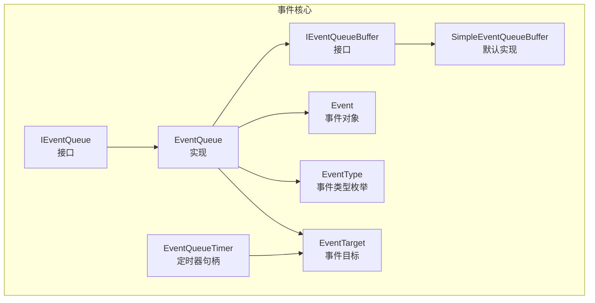
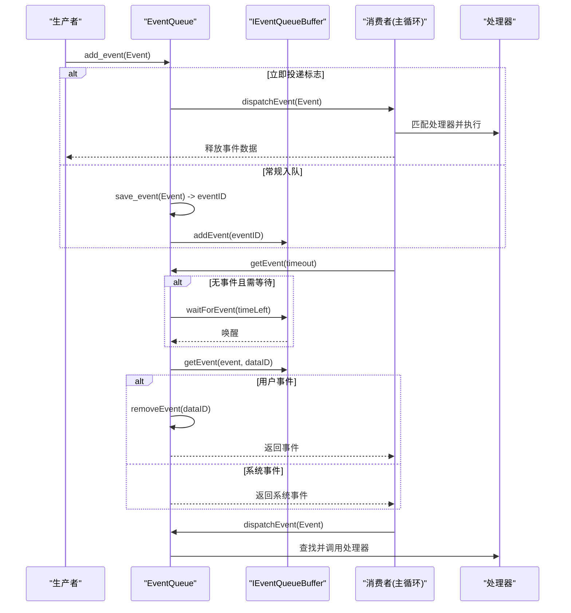
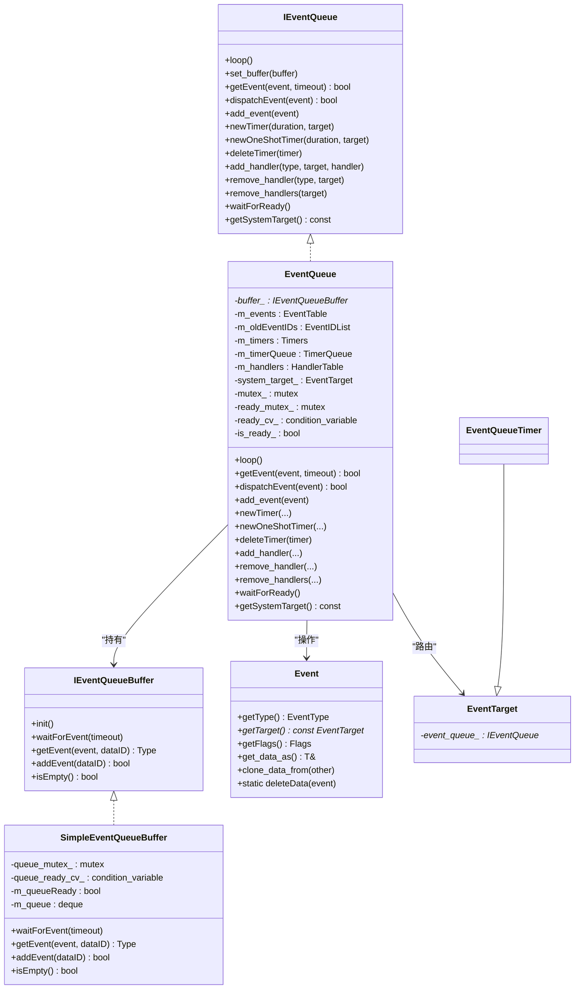
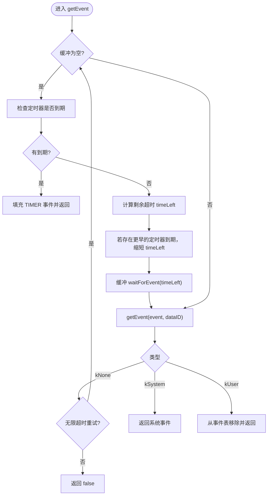
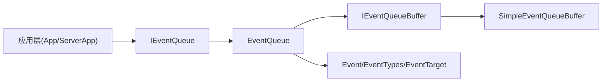

# 输入事件处理机制

<cite>
**本文引用的文件**   
- [EventQueue.h](file://src/lib/base/EventQueue.h)
- [EventQueue.cpp](file://src/lib/base/EventQueue.cpp)
- [IEventQueue.h](file://src/lib/base/IEventQueue.h)
- [IEventQueueBuffer.h](file://src/lib/base/IEventQueueBuffer.h)
- [SimpleEventQueueBuffer.h](file://src/lib/base/SimpleEventQueueBuffer.h)
- [SimpleEventQueueBuffer.cpp](file://src/lib/base/SimpleEventQueueBuffer.cpp)
- [Event.h](file://src/lib/base/Event.h)
- [EventTypes.h](file://src/lib/base/EventTypes.h)
- [EventTarget.h](file://src/lib/base/EventTarget.h)
- [EventQueueTimer.h](file://src/lib/base/EventQueueTimer.h)
- [ServerApp.cpp](file://src/lib/inputleap/ServerApp.cpp)
- [App.cpp](file://src/lib/inputleap/App.cpp)
- [TestEventQueue.cpp](file://src/test/global/TestEventQueue.cpp)
</cite>

## 目录
1. [简介](#简介)
2. [项目结构](#项目结构)
3. [核心组件](#核心组件)
4. [架构总览](#架构总览)
5. [详细组件分析](#详细组件分析)
6. [依赖关系分析](#依赖关系分析)
7. [性能考虑](#性能考虑)
8. [故障排查指南](#故障排查指南)
9. [结论](#结论)
10. [附录](#附录)

## 简介
本文件系统性梳理 Input Leap 的输入事件处理机制，重点围绕 EventQueue 的核心架构展开，包括：
- 事件队列的管理与分发机制
- 定时器系统（周期与一次性）
- 事件的创建、存储、获取与处理流程
- 事件类型定义、事件目标绑定与处理器注册
- 生命周期管理、内存优化策略与线程安全实现
- 自定义事件处理器、定时器使用与系统事件处理的实践示例
- 性能调优建议与调试技巧

## 项目结构
事件子系统位于 src/lib/base 下，采用“平台无关核心 + 平台相关缓冲”的分层设计：
- IEventQueue/IEventQueueBuffer：抽象接口
- EventQueue：跨平台事件循环、调度、定时器与处理器路由
- SimpleEventQueueBuffer：默认内存缓冲实现（可替换为平台特定实现）
- Event/EventTypes/EventTarget：事件模型与目标对象
- EventQueueTimer：定时器句柄，继承自事件目标

图表来源
- [EventQueue.h:42-132](file://src/lib/base/EventQueue.h#L42-L132)
- [IEventQueue.h:37-172](file://src/lib/base/IEventQueue.h#L37-L172)
- [IEventQueueBuffer.h:30-83](file://src/lib/base/IEventQueueBuffer.h#L30-L83)
- [SimpleEventQueueBuffer.h:32-51](file://src/lib/base/SimpleEventQueueBuffer.h#L32-L51)
- [Event.h:60-150](file://src/lib/base/Event.h#L60-L150)
- [EventTypes.h:24-288](file://src/lib/base/EventTypes.h#L24-L288)
- [EventTarget.h:29-41](file://src/lib/base/EventTarget.h#L29-L41)
- [EventQueueTimer.h:24-27](file://src/lib/base/EventQueueTimer.h#L24-L27)

章节来源
- [EventQueue.h:42-132](file://src/lib/base/EventQueue.h#L42-L132)
- [IEventQueue.h:37-172](file://src/lib/base/IEventQueue.h#L37-L172)
- [IEventQueueBuffer.h:30-83](file://src/lib/base/IEventQueueBuffer.h#L30-L83)
- [SimpleEventQueueBuffer.h:32-51](file://src/lib/base/SimpleEventQueueBuffer.h#L32-L51)
- [Event.h:60-150](file://src/lib/base/Event.h#L60-L150)
- [EventTypes.h:24-288](file://src/lib/base/EventTypes.h#L24-L288)
- [EventTarget.h:29-41](file://src/lib/base/EventTarget.h#L29-L41)
- [EventQueueTimer.h:24-27](file://src/lib/base/EventQueueTimer.h#L24-L27)

## 核心组件
- IEventQueue：定义事件循环、事件入队/出队、定时器创建/销毁、处理器注册/注销等统一接口。
- EventQueue：具体实现，负责：
  - 事件缓冲切换与事件持久化表（按 ID 保存用户事件数据）
  - 定时器优先级队列与时间推进
  - 处理器映射（按目标+类型查找）
  - 线程安全的等待与就绪通知
- IEventQueueBuffer：平台无关的事件缓冲接口，支持阻塞等待与事件取用。
- SimpleEventQueueBuffer：基于条件变量与双端队列的默认缓冲实现。
- Event/EventTypes/EventTarget：事件载体、类型系统与事件目标基类。
- EventQueueTimer：定时器句柄，作为事件目标参与分发。

章节来源
- [IEventQueue.h:37-172](file://src/lib/base/IEventQueue.h#L37-L172)
- [EventQueue.h:42-132](file://src/lib/base/EventQueue.h#L42-L132)
- [IEventQueueBuffer.h:30-83](file://src/lib/base/IEventQueueBuffer.h#L30-L83)
- [SimpleEventQueueBuffer.h:32-51](file://src/lib/base/SimpleEventQueueBuffer.h#L32-L51)
- [Event.h:60-150](file://src/lib/base/Event.h#L60-L150)
- [EventTypes.h:24-288](file://src/lib/base/EventTypes.h#L24-L288)
- [EventTarget.h:29-41](file://src/lib/base/EventTarget.h#L29-L41)
- [EventQueueTimer.h:24-27](file://src/lib/base/EventQueueTimer.h#L24-L27)

## 架构总览
事件从生产者到消费者的完整路径如下：
- 生产者通过 add_event 将事件入队；若标记立即投递则直接分发并释放数据
- 非立即投递时，事件数据保存在内部表，仅向缓冲写入一个 dataID
- 消费者在 loop/getEvent 中等待缓冲事件或定时器到期
- 定时器由优先级队列驱动，到期后生成 TIMER 事件并携带 TimerEvent
- dispatchEvent 根据事件目标与类型查找处理器并调用

图表来源
- [EventQueue.cpp:188-225](file://src/lib/base/EventQueue.cpp#L188-L225)
- [EventQueue.cpp:110-167](file://src/lib/base/EventQueue.cpp#L110-L167)
- [EventQueue.cpp:170-186](file://src/lib/base/EventQueue.cpp#L170-L186)
- [IEventQueueBuffer.h:47-74](file://src/lib/base/IEventQueueBuffer.h#L47-L74)

## 详细组件分析

### EventQueue 核心实现
- 事件入队与存储
  - 过滤非法类型（UNKNOWN/SYSTEM/TIMER）
  - 若设置 kDeliverImmediately，直接分发并释放数据
  - 否则保存到内部表 m_events，复用旧 ID，仅向缓冲写入 dataID
- 事件获取与超时控制
  - 优先检查定时器是否到期
  - 计算剩余超时 timeLeft，必要时缩短为下一个定时器到期时间
  - 调用缓冲的 waitForEvent 阻塞等待
  - 取回事件后区分系统事件与用户事件，用户事件需从表中移除并返回
- 事件分发
  - 先按目标+类型精确匹配处理器
  - 未命中则尝试 UNKNOWN 通配处理器
- 定时器系统
  - newTimer/newOneShotTimer 创建定时器并加入优先级队列
  - hasTimerExpired 周期性推进时间，弹出已到期项，构造 TIMER 事件
  - 非一次性定时器重置并重新入队
- 处理器注册与生命周期
  - add_handler 校验目标所属队列一致性，建立映射
  - remove_handler/remove_handlers 清理映射并复位目标关联
  - 析构时清空所有目标的 event_queue_ 指针，避免悬挂引用
- 线程安全与就绪同步
  - 关键数据结构访问均加锁
  - ready_cv_/is_ready_ 用于 waitForReady 等待初始化完成

图表来源
- [EventQueue.h:42-132](file://src/lib/base/EventQueue.h#L42-L132)
- [IEventQueue.h:37-172](file://src/lib/base/IEventQueue.h#L37-L172)
- [IEventQueueBuffer.h:30-83](file://src/lib/base/IEventQueueBuffer.h#L30-L83)
- [SimpleEventQueueBuffer.h:32-51](file://src/lib/base/SimpleEventQueueBuffer.h#L32-L51)
- [Event.h:60-150](file://src/lib/base/Event.h#L60-L150)
- [EventTarget.h:29-41](file://src/lib/base/EventTarget.h#L29-L41)
- [EventQueueTimer.h:24-27](file://src/lib/base/EventQueueTimer.h#L24-L27)

章节来源
- [EventQueue.cpp:188-225](file://src/lib/base/EventQueue.cpp#L188-L225)
- [EventQueue.cpp:110-167](file://src/lib/base/EventQueue.cpp#L110-L167)
- [EventQueue.cpp:170-186](file://src/lib/base/EventQueue.cpp#L170-L186)
- [EventQueue.cpp:227-280](file://src/lib/base/EventQueue.cpp#L227-L280)
- [EventQueue.cpp:282-346](file://src/lib/base/EventQueue.cpp#L282-L346)
- [EventQueue.cpp:348-383](file://src/lib/base/EventQueue.cpp#L348-L383)
- [EventQueue.cpp:386-440](file://src/lib/base/EventQueue.cpp#L386-L440)
- [EventQueue.cpp:447-455](file://src/lib/base/EventQueue.cpp#L447-L455)
- [EventQueue.cpp:461-521](file://src/lib/base/EventQueue.cpp#L461-L521)

### 事件类型与数据模型
- EventType：涵盖系统、网络、屏幕、剪贴板、IPC、定时器等多种事件类型
- Event：不可拷贝、可移动，包含类型、目标、数据与标志位；提供模板方法以强类型访问数据
- EventDataBase/EventData：通用数据包装器，支持克隆与类型安全访问
- EventTarget：事件目标基类，维护与其绑定的 IEventQueue 指针，确保处理器注册合法性

章节来源
- [EventTypes.h:24-288](file://src/lib/base/EventTypes.h#L24-L288)
- [Event.h:32-150](file://src/lib/base/Event.h#L32-L150)
- [EventTarget.h:29-41](file://src/lib/base/EventTarget.h#L29-L41)

### 事件缓冲与平台适配
- IEventQueueBuffer：定义 init/waitForEvent/getEvent/addEvent/isEmpty 等接口
- SimpleEventQueueBuffer：基于条件变量的内存缓冲，支持多生产者/单消费者场景
- 平台特定实现（如 Windows/macOS/X11）遵循同一接口，EventQueue 通过 set_buffer 注入

章节来源
- [IEventQueueBuffer.h:30-83](file://src/lib/base/IEventQueueBuffer.h#L30-L83)
- [SimpleEventQueueBuffer.cpp:26-83](file://src/lib/base/SimpleEventQueueBuffer.cpp#L26-L83)

### 定时器系统
- 周期定时器 newTimer：到期后重复触发，TimerEvent.m_count 表示累计次数
- 一次性定时器 newOneShotTimer：触发一次后自动移除
- 删除定时器 deleteTimer：从队列与集合中移除，防止再次触发
- 时间推进：hasTimerExpired 使用 Stopwatch 累计时间，对优先级队列逐项递减，顶部<=0 即到期

图表来源
- [EventQueue.cpp:110-167](file://src/lib/base/EventQueue.cpp#L110-L167)
- [EventQueue.cpp:386-440](file://src/lib/base/EventQueue.cpp#L386-L440)

章节来源
- [EventQueue.cpp:227-280](file://src/lib/base/EventQueue.cpp#L227-L280)
- [EventQueue.cpp:386-440](file://src/lib/base/EventQueue.cpp#L386-L440)
- [EventQueue.cpp:461-521](file://src/lib/base/EventQueue.cpp#L461-L521)

### 处理器注册与分发
- 注册：add_handler 校验目标归属，建立 (target,type)->handler 映射
- 分发：dispatchEvent 先精确匹配，再回退到 UNKNOWN 通配处理器
- 注销：remove_handler/remove_handlers 清理映射并复位目标关联

章节来源
- [EventQueue.cpp:282-346](file://src/lib/base/EventQueue.cpp#L282-L346)
- [EventQueue.cpp:170-186](file://src/lib/base/EventQueue.cpp#L170-L186)

### 生命周期与线程安全
- 构造函数：安装信号中断处理，注入默认缓冲
- 析构：卸载信号处理，清空目标指向的 event_queue_
- 就绪等待：waitForReady 使用条件变量等待缓冲初始化完成
- 并发：关键路径均加互斥锁保护；缓冲区实现也具备自身同步原语

章节来源
- [EventQueue.cpp:40-55](file://src/lib/base/EventQueue.cpp#L40-L55)
- [EventQueue.cpp:447-455](file://src/lib/base/EventQueue.cpp#L447-L455)
- [SimpleEventQueueBuffer.cpp:36-83](file://src/lib/base/SimpleEventQueueBuffer.cpp#L36-L83)

### 使用示例与实践指引
- 创建自定义事件处理器
  - 选择目标对象（继承 EventTarget 或使用 EventQueueTimer）
  - 调用 add_handler 注册对应 EventType 的处理函数
  - 参考：[ServerApp.cpp:318-328](file://src/lib/inputleap/ServerApp.cpp#L318-L328)
- 使用定时器
  - 周期定时器：newTimer(duration, target)，在回调中读取 TimerEvent.m_count
  - 一次性定时器：newOneShotTimer(duration, target)
  - 使用完毕后 remove_handler 并 deleteTimer
  - 参考：[TestEventQueue.cpp:34-48](file://src/test/global/TestEventQueue.cpp#L34-L48)
- 处理系统事件
  - 通过 getSystemTarget 获取系统目标并注册处理器
  - 参考：[EventQueue.h:60](file://src/lib/base/EventQueue.h#L60)
- 主循环运行
  - 调用 loop 直到收到 QUIT 事件退出
  - 参考：[App.cpp:228-237](file://src/lib/inputleap/App.cpp#L228-L237)

章节来源
- [ServerApp.cpp:318-328](file://src/lib/inputleap/ServerApp.cpp#L318-L328)
- [TestEventQueue.cpp:27-48](file://src/test/global/TestEventQueue.cpp#L27-L48)
- [EventQueue.h:60](file://src/lib/base/EventQueue.h#L60)
- [App.cpp:228-237](file://src/lib/inputleap/App.cpp#L228-L237)

## 依赖关系分析
- EventQueue 依赖：
  - IEventQueueBuffer 及其实现（默认 SimpleEventQueueBuffer）
  - Event/EventTypes/EventTarget 模型
  - 平台 Arch 设施（信号、条件变量等）
- 上层应用（ServerApp/App）通过 IEventQueue 接口交互，不感知底层缓冲细节

图表来源
- [EventQueue.h:42-132](file://src/lib/base/EventQueue.h#L42-L132)
- [IEventQueue.h:37-172](file://src/lib/base/IEventQueue.h#L37-L172)
- [IEventQueueBuffer.h:30-83](file://src/lib/base/IEventQueueBuffer.h#L30-L83)
- [SimpleEventQueueBuffer.h:32-51](file://src/lib/base/SimpleEventQueueBuffer.h#L32-L51)
- [Event.h:60-150](file://src/lib/base/Event.h#L60-L150)
- [EventTypes.h:24-288](file://src/lib/base/EventTypes.h#L24-L288)
- [EventTarget.h:29-41](file://src/lib/base/EventTarget.h#L29-L41)

章节来源
- [EventQueue.h:42-132](file://src/lib/base/EventQueue.h#L42-L132)
- [IEventQueue.h:37-172](file://src/lib/base/IEventQueue.h#L37-L172)
- [IEventQueueBuffer.h:30-83](file://src/lib/base/IEventQueueBuffer.h#L30-L83)
- [SimpleEventQueueBuffer.h:32-51](file://src/lib/base/SimpleEventQueueBuffer.h#L32-L51)
- [Event.h:60-150](file://src/lib/base/Event.h#L60-L150)
- [EventTypes.h:24-288](file://src/lib/base/EventTypes.h#L24-L288)
- [EventTarget.h:29-41](file://src/lib/base/EventTarget.h#L29-L41)

## 性能考虑
- 事件数据零拷贝与复用
  - 用户事件数据保存在内部表，仅传递 dataID，减少跨缓冲复制
  - 旧 ID 回收池 m_oldEventIDs 降低分配开销
- 定时器精度与批量推进
  - 使用 Stopwatch 累计时间，批量递减优先级队列元素，避免频繁重排
  - 将最短定时器到期时间作为等待上限，提高响应性
- 处理器查找成本
  - 两级映射（目标->类型->处理器），平均 O(log N) 查找；热点目标可考虑局部缓存
- 缓冲实现选择
  - 高吞吐场景可替换为平台特定缓冲（如 OS 消息泵），以降低上下文切换
- 立即投递标志
  - 对低延迟事件设置 kDeliverImmediately，绕过队列与锁，但需谨慎避免长耗时处理

[本节为通用指导，无需代码来源]

## 故障排查指南
- 事件未触发
  - 确认 add_handler 的目标属于当前 EventQueue，否则抛出异常
  - 检查是否正确调用 loop 并处理 QUIT 事件
  - 参考：[EventQueue.cpp:282-292](file://src/lib/base/EventQueue.cpp#L282-L292)
- 定时器不工作
  - 确认 duration > 0，且在循环中未被提前 deleteTimer
  - 检查 TimerEvent.m_count 是否符合预期
  - 参考：[EventQueue.cpp:227-261](file://src/lib/base/EventQueue.cpp#L227-L261)
- 死锁或卡顿
  - 避免在处理器中长时间阻塞；必要时拆分任务并通过 add_event 异步派发
  - 检查缓冲区 waitForEvent 的超时参数是否合理
  - 参考：[EventQueue.cpp:110-167](file://src/lib/base/EventQueue.cpp#L110-L167)
- 资源泄漏
  - 确保每个 newTimer/deleteTimer 成对出现
  - 确保 remove_handler/remove_handlers 在对象销毁前调用
  - 参考：[EventQueue.cpp:263-280](file://src/lib/base/EventQueue.cpp#L263-L280)

章节来源
- [EventQueue.cpp:282-292](file://src/lib/base/EventQueue.cpp#L282-L292)
- [EventQueue.cpp:227-261](file://src/lib/base/EventQueue.cpp#L227-L261)
- [EventQueue.cpp:110-167](file://src/lib/base/EventQueue.cpp#L110-L167)
- [EventQueue.cpp:263-280](file://src/lib/base/EventQueue.cpp#L263-L280)

## 结论
Input Leap 的事件系统以 EventQueue 为核心，结合平台无关的缓冲接口与灵活的处理器路由，实现了高效、可扩展的事件处理框架。其定时器系统、内存复用策略与线程安全保障使其适用于高性能桌面共享场景。通过合理的缓冲替换与处理器设计，可在不同平台上获得更优的性能与响应特性。

[本节为总结性内容，无需代码来源]

## 附录
- 常用事件类型速查
  - 系统与控制：QUIT、SYSTEM、TIMER
  - 网络与 IPC：STREAM_*、IPC_*、DATA_SOCKET_*、LISTEN_SOCKET_*、SOCKET_*
  - 客户端/服务器：CLIENT_*、SERVER_*
  - 屏幕与输入：PRIMARY_SCREEN_*、KEY_STATE_*、SCREEN_*
  - 剪贴板与文件：CLIPBOARD_*、FILE_*
  - 参考：[EventTypes.h:24-288](file://src/lib/base/EventTypes.h#L24-L288)

章节来源
- [EventTypes.h:24-288](file://src/lib/base/EventTypes.h#L24-L288)