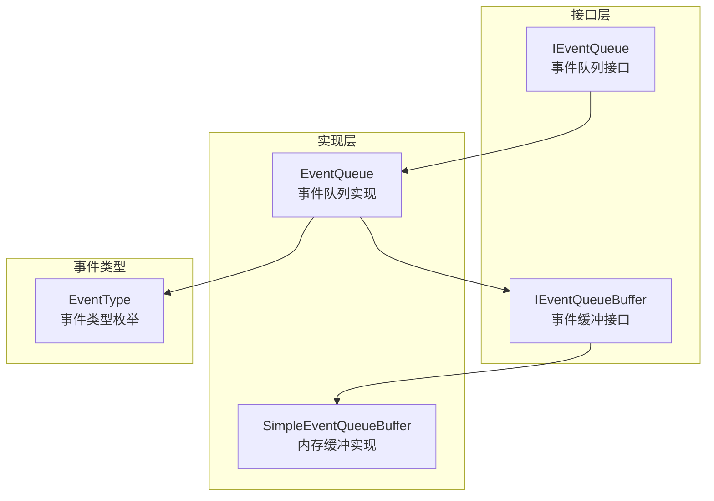
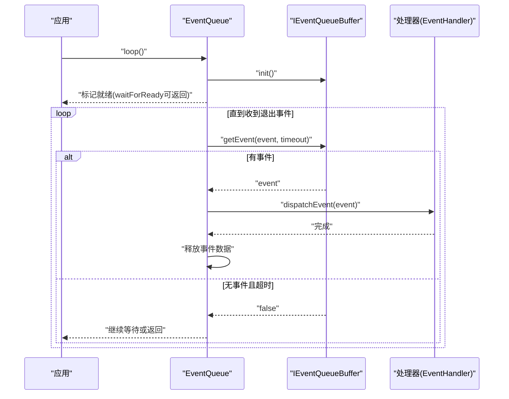
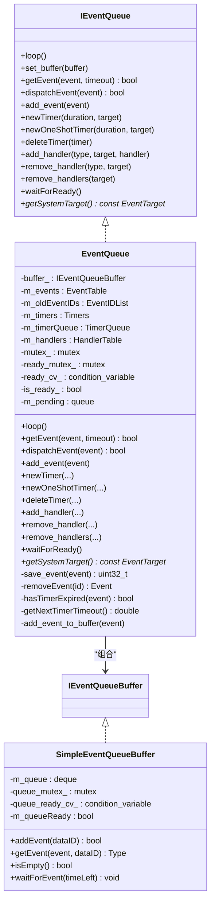
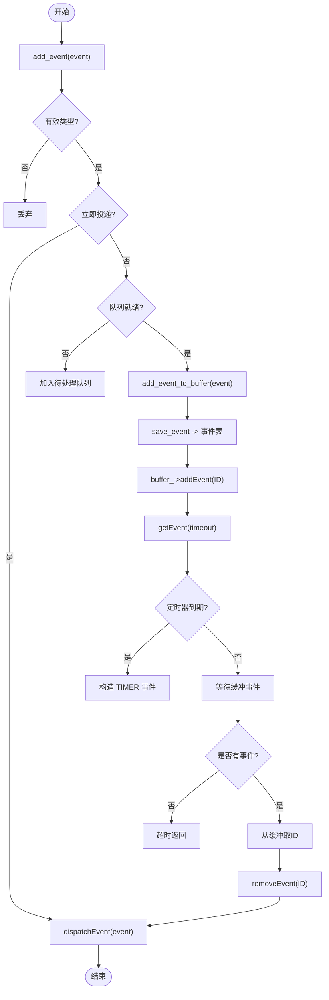
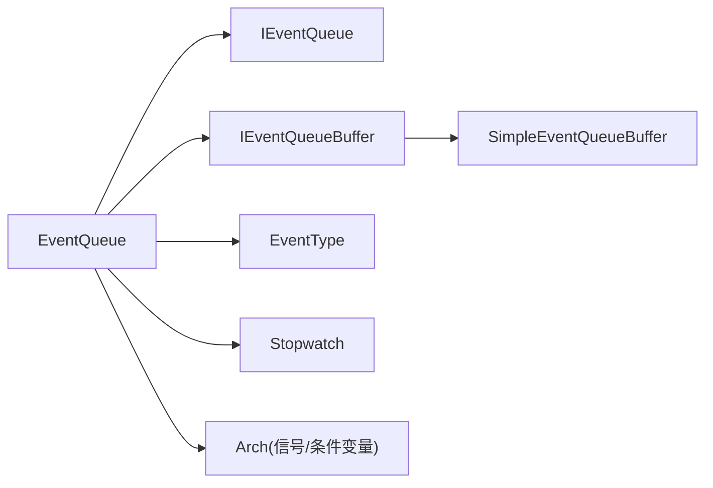

# 事件驱动模型

<cite>
**本文引用的文件**   
- [IEventQueue.h](file://src/lib/base/IEventQueue.h)
- [EventQueue.h](file://src/lib/base/EventQueue.h)
- [EventQueue.cpp](file://src/lib/base/EventQueue.cpp)
- [EventTypes.h](file://src/lib/base/EventTypes.h)
- [SimpleEventQueueBuffer.cpp](file://src/lib/base/SimpleEventQueueBuffer.cpp)
- [IEventQueueBuffer.h](file://src/lib/base/IEventQueueBuffer.h)
</cite>

## 目录
1. [简介](#简介)
2. [项目结构](#项目结构)
3. [核心组件](#核心组件)
4. [架构总览](#架构总览)
5. [详细组件分析](#详细组件分析)
6. [依赖关系分析](#依赖关系分析)
7. [性能考量](#性能考量)
8. [故障排查指南](#故障排查指南)
9. [结论](#结论)
10. [附录](#附录)

## 简介
本文件系统化阐述 Input Leap 的事件驱动模型，围绕 IEventQueue 接口设计与 EventQueue 实现展开，覆盖事件类型定义、事件注册与分发机制、事件生命周期管理、线程安全与异步处理模式，并结合服务器端与客户端在网络通信、用户输入和系统状态变化中的使用方式给出流程图与代码示例路径。

## 项目结构
事件驱动相关代码位于基础库 base 层，采用“接口 + 实现 + 平台无关缓冲”的分层设计：
- 接口层：IEventQueue 定义事件队列的通用能力（循环、入队、出队、分发、定时器、处理器注册等）。
- 实现层：EventQueue 提供跨平台的通用逻辑，包括事件表、处理器表、定时器优先级队列、等待与超时控制等。
- 缓冲层：IEventQueueBuffer 抽象底层事件缓冲；SimpleEventQueueBuffer 提供基于内存队列的默认实现。
- 事件类型：EventType 枚举集中定义所有事件种类，贯穿网络、屏幕、剪贴板、计时器等子系统。

图表来源
- [IEventQueue.h:30-172](file://src/lib/base/IEventQueue.h#L30-L172)
- [EventQueue.h:37-132](file://src/lib/base/EventQueue.h#L37-L132)
- [EventQueue.cpp:57-81](file://src/lib/base/EventQueue.cpp#L57-L81)
- [SimpleEventQueueBuffer.cpp:52-73](file://src/lib/base/SimpleEventQueueBuffer.cpp#L52-L73)
- [EventTypes.h:24-288](file://src/lib/base/EventTypes.h#L24-L288)

章节来源
- [IEventQueue.h:30-172](file://src/lib/base/IEventQueue.h#L30-L172)
- [EventQueue.h:37-132](file://src/lib/base/EventQueue.h#L37-L132)
- [EventQueue.cpp:57-81](file://src/lib/base/EventQueue.cpp#L57-L81)
- [SimpleEventQueueBuffer.cpp:52-73](file://src/lib/base/SimpleEventQueueBuffer.cpp#L52-L73)
- [EventTypes.h:24-288](file://src/lib/base/EventTypes.h#L24-L288)

## 核心组件
- IEventQueue 接口
  - 提供 loop() 主循环、getEvent()/add_event() 阻塞式取/放事件、dispatchEvent() 分发、定时器 newTimer/newOneShotTimer/deleteTimer、处理器 add_handler/remove_handler/remove_handlers、waitForReady() 就绪同步、getSystemTarget() 系统目标等。
- EventQueue 实现
  - 维护事件表（保存事件数据并分配 ID）、处理器表（按目标+类型映射到回调）、定时器优先级队列（最小堆）与时间戳、缓冲对象（IEventQueueBuffer），以及互斥锁与条件变量保证线程安全。
- SimpleEventQueueBuffer 默认缓冲
  - 基于内存双向队列，支持 addEvent/getEvent/isEmpty/waitForEvent，内部用互斥量与条件变量实现生产者-消费者同步。
- EventType 事件类型
  - 统一描述网络、屏幕、剪贴板、文件传输、系统休眠唤醒、IPC 等事件类别。

章节来源
- [IEventQueue.h:39-172](file://src/lib/base/IEventQueue.h#L39-L172)
- [EventQueue.h:43-132](file://src/lib/base/EventQueue.h#L43-L132)
- [EventQueue.cpp:110-167](file://src/lib/base/EventQueue.cpp#L110-L167)
- [SimpleEventQueueBuffer.cpp:52-73](file://src/lib/base/SimpleEventQueueBuffer.cpp#L52-L73)
- [EventTypes.h:24-288](file://src/lib/base/EventTypes.h#L24-L288)

## 架构总览
事件驱动主循环由 EventQueue::loop 驱动，负责初始化缓冲、标记就绪、将启动前积压事件转入缓冲、然后持续从缓冲取出事件并分发给对应处理器。

图表来源
- [EventQueue.cpp:57-81](file://src/lib/base/EventQueue.cpp#L57-L81)
- [EventQueue.cpp:110-167](file://src/lib/base/EventQueue.cpp#L110-L167)
- [EventQueue.cpp:169-186](file://src/lib/base/EventQueue.cpp#L169-L186)

章节来源
- [EventQueue.cpp:57-81](file://src/lib/base/EventQueue.cpp#L57-L81)
- [EventQueue.cpp:110-167](file://src/lib/base/EventQueue.cpp#L110-L167)
- [EventQueue.cpp:169-186](file://src/lib/base/EventQueue.cpp#L169-L186)

## 详细组件分析

### IEventQueue 接口设计
- 职责边界
  - 屏蔽底层缓冲差异，向上暴露统一的“入队/出队/分发/定时器/处理器注册”API。
- 关键方法
  - loop(): 阻塞主循环直至收到退出事件。
  - getEvent(Event&, double timeout): 阻塞获取下一个事件，支持超时。
  - dispatchEvent(const Event&): 根据事件目标与类型查找处理器并调用。
  - add_event(Event&&)/add_event(type,target,data,flags): 入队，支持立即投递标志。
  - newTimer/newOneShotTimer/deleteTimer: 周期/一次性定时器创建与销毁。
  - add_handler/remove_handler/remove_handlers: 处理器注册与注销。
  - waitForReady(): 等待队列进入可用状态。
  - getSystemTarget(): 获取系统事件的目标对象。

章节来源
- [IEventQueue.h:39-172](file://src/lib/base/IEventQueue.h#L39-L172)

### EventQueue 实现原理
- 数据结构
  - 事件表：以 uint32_t 为键保存 Event，避免拷贝，便于跨缓冲传递。
  - 处理器表：按 EventTarget* -> (EventType -> shared_ptr<EventHandler>) 两级映射。
  - 定时器：集合 + 优先级队列，按剩余时间排序，支持一次性与周期性。
  - 缓冲：通过 IEventQueueBuffer 抽象，默认 SimpleEventQueueBuffer。
- 线程安全
  - 全局互斥量保护事件表、处理器表、定时器集合与队列操作。
  - 条件变量用于等待缓冲事件与就绪信号。
- 事件生命周期
  - 入队：add_event 过滤无效类型，若设置立即投递则直接分发；否则在就绪后写入缓冲。
  - 存储：save_event 分配/复用 ID，存入事件表。
  - 出队：getEvent 优先检查定时器是否到期；否则等待缓冲事件；用户事件按 ID 从事件表移除并返回。
  - 分发：dispatchEvent 先匹配精确类型处理器，再回退到 UNKNOWN 处理器。
  - 释放：分发完成后由调用方释放事件数据。
- 定时器机制
  - hasTimerExpired 对优先级队列中所有定时器进行时间推进，若顶部已到期则构造 TIMER 事件并重置（非一次性）。
  - getNextTimerTimeout 计算下一次等待时长，结合外部超时参数决定 wait 时长。

图表来源
- [IEventQueue.h:39-172](file://src/lib/base/IEventQueue.h#L39-L172)
- [EventQueue.h:43-132](file://src/lib/base/EventQueue.h#L43-L132)
- [EventQueue.cpp:110-167](file://src/lib/base/EventQueue.cpp#L110-L167)
- [SimpleEventQueueBuffer.cpp:52-73](file://src/lib/base/SimpleEventQueueBuffer.cpp#L52-L73)

章节来源
- [EventQueue.h:43-132](file://src/lib/base/EventQueue.h#L43-L132)
- [EventQueue.cpp:110-167](file://src/lib/base/EventQueue.cpp#L110-L167)
- [EventQueue.cpp:169-186](file://src/lib/base/EventQueue.cpp#L169-L186)
- [EventQueue.cpp:188-225](file://src/lib/base/EventQueue.cpp#L188-L225)
- [EventQueue.cpp:227-280](file://src/lib/base/EventQueue.cpp#L227-L280)
- [EventQueue.cpp:282-346](file://src/lib/base/EventQueue.cpp#L282-L346)
- [EventQueue.cpp:348-383](file://src/lib/base/EventQueue.cpp#L348-L383)
- [EventQueue.cpp:385-440](file://src/lib/base/EventQueue.cpp#L385-L440)
- [SimpleEventQueueBuffer.cpp:52-73](file://src/lib/base/SimpleEventQueueBuffer.cpp#L52-L73)

### 事件类型定义（EventType）
- 分类概览
  - 网络与连接：DATA_SOCKET_CONNECTED、SOCKET_DISCONNECTED、CLIENT_LISTENER_*、CLIENT_PROXY_* 等。
  - 屏幕与输入：PRIMARY_SCREEN_*、KEY_STATE_*、SCREEN_* 等。
  - 剪贴板与文件：CLIPBOARD_*、FILE_*。
  - 系统与定时器：SYSTEM、TIMER、QUIT。
- 用途
  - 作为处理器注册与分发的索引键，配合 EventTarget 实现细粒度路由。

章节来源
- [EventTypes.h:24-288](file://src/lib/base/EventTypes.h#L24-L288)

### 事件注册机制
- 注册流程
  - add_handler(type, target, handler)：校验 target 所属队列，建立 target->type->handler 映射。
  - remove_handler/remove_handlers：删除指定类型或全部处理器，清理空条目并复位 target 的 event_queue_ 指针。
- 分发算法
  - dispatchEvent：先查找 type 精确处理器，未命中则回退至 UNKNOWN 处理器。
- 注意事项
  - 同一 target 只能绑定到同一个 EventQueue，跨队列注册会抛出异常。

章节来源
- [EventQueue.cpp:282-346](file://src/lib/base/EventQueue.cpp#L282-L346)
- [EventQueue.cpp:169-186](file://src/lib/base/EventQueue.cpp#L169-L186)

### 事件分发算法与异步处理模式
- 分发顺序
  - 精确匹配 > 未知类型回退。
- 异步模式
  - 生产者在任意线程 add_event，EventQueue 在独立主循环线程 getEvent/dispatchEvent，解耦 IO 与业务处理。
  - 支持 kDeliverImmediately 标志即时分发（谨慎使用，避免重入风险）。

章节来源
- [EventQueue.cpp:169-186](file://src/lib/base/EventQueue.cpp#L169-L186)
- [EventQueue.cpp:188-210](file://src/lib/base/EventQueue.cpp#L188-L210)

### 事件生命周期管理与线程安全
- 生命周期
  - 入队：add_event -> save_event -> buffer_->addEvent。
  - 等待：getEvent 先检查定时器，再等待缓冲事件。
  - 出队：从缓冲取 ID，再从事件表移除并返回。
  - 分发：dispatchEvent 调用处理器。
  - 释放：调用方 Event::deleteData 释放数据。
- 线程安全
  - 互斥量保护共享数据结构；条件变量协调等待与通知。
  - 就绪信号：loop 初始化缓冲后标记 is_ready_ 并通知 waitForReady。

图表来源
- [EventQueue.cpp:188-225](file://src/lib/base/EventQueue.cpp#L188-L225)
- [EventQueue.cpp:110-167](file://src/lib/base/EventQueue.cpp#L110-L167)
- [EventQueue.cpp:348-383](file://src/lib/base/EventQueue.cpp#L348-L383)
- [EventQueue.cpp:385-440](file://src/lib/base/EventQueue.cpp#L385-L440)

章节来源
- [EventQueue.cpp:188-225](file://src/lib/base/EventQueue.cpp#L188-L225)
- [EventQueue.cpp:110-167](file://src/lib/base/EventQueue.cpp#L110-L167)
- [EventQueue.cpp:348-383](file://src/lib/base/EventQueue.cpp#L348-L383)
- [EventQueue.cpp:385-440](file://src/lib/base/EventQueue.cpp#L385-L440)

### 服务器端与客户端的使用模式
- 服务器端
  - 监听与接受：监听套接字产生 CLIENT_LISTENER_ACCEPTED/CONNECTED 等事件，服务端处理器建立客户端代理并注册相应处理器。
  - 协议握手：CLIENT_PROXY_READY 表示初始握手完成，后续转发输入/剪贴板等事件。
  - 错误与断开：SOCKET_DISCONNECTED、SERVER_ERROR 等事件触发重连或资源清理。
- 客户端
  - 连接与重连：DATA_SOCKET_CONNECTION_FAILED 触发重试策略；成功连接后接收 SERVER_* 控制事件。
  - 输入采集：本地屏幕事件（按键、鼠标、滚轮）封装为 PRIMARY_SCREEN_* 事件，经网络发送到远端。
  - 系统状态：SCREEN_SUSPEND/RESUME 用于暂停/恢复输入采集与发送。

说明：以上为基于 EventType 的分类与常见用法总结，具体实现细节请参考各模块中对 EventType 的使用。

章节来源
- [EventTypes.h:24-288](file://src/lib/base/EventTypes.h#L24-L288)

### 常见事件处理模式与代码示例路径
- 注册处理器
  - 参考路径：[EventQueue.cpp:282-292](file://src/lib/base/EventQueue.cpp#L282-L292)
- 入队普通事件
  - 参考路径：[EventQueue.cpp:188-210](file://src/lib/base/EventQueue.cpp#L188-L210)
- 立即投递事件
  - 参考路径：[EventQueue.cpp:201-204](file://src/lib/base/EventQueue.cpp#L201-L204)
- 定时器使用
  - 创建周期定时器：[EventQueue.cpp:227-243](file://src/lib/base/EventQueue.cpp#L227-L243)
  - 创建一次性定时器：[EventQueue.cpp:245-261](file://src/lib/base/EventQueue.cpp#L245-L261)
  - 销毁定时器：[EventQueue.cpp:263-280](file://src/lib/base/EventQueue.cpp#L263-L280)
  - 定时器到期处理：[EventQueue.cpp:385-425](file://src/lib/base/EventQueue.cpp#L385-L425)
- 主循环与分发
  - 主循环：[EventQueue.cpp:57-81](file://src/lib/base/EventQueue.cpp#L57-L81)
  - 分发逻辑：[EventQueue.cpp:169-186](file://src/lib/base/EventQueue.cpp#L169-L186)

## 依赖关系分析
- 耦合与内聚
  - EventQueue 与 IEventQueue 松耦合，通过接口替换缓冲实现，提升可测试性与可扩展性。
  - 处理器表与事件表分离，降低分发路径复杂度。
- 外部依赖
  - Arch 信号处理：中断/终止信号注入 QUIT 事件，确保进程退出可控。
  - Stopwatch：高精度时间测量，支撑定时器倒计时与超时计算。
  - Log/XBase：调试日志与平台辅助。

图表来源
- [EventQueue.cpp:40-45](file://src/lib/base/EventQueue.cpp#L40-L45)
- [EventQueue.cpp:110-167](file://src/lib/base/EventQueue.cpp#L110-L167)
- [EventQueue.cpp:385-440](file://src/lib/base/EventQueue.cpp#L385-L440)
- [SimpleEventQueueBuffer.cpp:52-73](file://src/lib/base/SimpleEventQueueBuffer.cpp#L52-L73)

章节来源
- [EventQueue.cpp:40-45](file://src/lib/base/EventQueue.cpp#L40-L45)
- [EventQueue.cpp:110-167](file://src/lib/base/EventQueue.cpp#L110-L167)
- [EventQueue.cpp:385-440](file://src/lib/base/EventQueue.cpp#L385-L440)
- [SimpleEventQueueBuffer.cpp:52-73](file://src/lib/base/SimpleEventQueueBuffer.cpp#L52-L73)

## 性能考量
- 事件表 ID 复用：通过 m_oldEventIDs 回收已删除事件的 ID，减少整数分配与哈希冲突。
- 定时器批量推进：hasTimerExpired 对全量定时器做线性递减，适合定时器数量不大的场景；若规模增大可考虑增量更新或分段堆优化。
- 缓冲层选择：SimpleEventQueueBuffer 使用双向队列与条件变量，开销低；在高吞吐场景可替换为零拷贝或环形缓冲实现。
- 超时合并：getEvent 将外部超时与最近定时器到期时间取较小值，减少不必要的唤醒。
- 立即投递慎用：kDeliverImmediately 会绕过缓冲直接分发，可能引入重入与锁竞争，建议仅在必要时使用。

## 故障排查指南
- 队列未就绪
  - waitForReady 会在 10 秒内等待就绪，若失败抛出运行时异常，需检查 loop 是否被正确启动。
  - 参考路径：[EventQueue.cpp:447-455](file://src/lib/base/EventQueue.cpp#L447-L455)
- 处理器注册错误
  - 将 EventTarget 注册到错误的 EventQueue 会抛出异常，确认 target 归属。
  - 参考路径：[EventQueue.cpp:282-292](file://src/lib/base/EventQueue.cpp#L282-L292)、[EventQueue.cpp:315-331](file://src/lib/base/EventQueue.cpp#L315-L331)
- 事件丢失或重复
  - 检查 add_event 是否传入无效类型（UNKNOWN/SYSTEM/TIMER 会被丢弃）。
  - 检查 set_buffer 切换缓冲时旧事件被清空的行为。
  - 参考路径：[EventQueue.cpp:188-210](file://src/lib/base/EventQueue.cpp#L188-L210)、[EventQueue.cpp:83-108](file://src/lib/base/EventQueue.cpp#L83-L108)
- 定时器不触发
  - 确认定时器未被 deleteTimer 提前销毁；检查 getNextTimerTimeout 返回值与外部超时设置。
  - 参考路径：[EventQueue.cpp:227-280](file://src/lib/base/EventQueue.cpp#L227-L280)、[EventQueue.cpp:427-440](file://src/lib/base/EventQueue.cpp#L427-L440)

章节来源
- [EventQueue.cpp:447-455](file://src/lib/base/EventQueue.cpp#L447-L455)
- [EventQueue.cpp:282-292](file://src/lib/base/EventQueue.cpp#L282-L292)
- [EventQueue.cpp:315-331](file://src/lib/base/EventQueue.cpp#L315-L331)
- [EventQueue.cpp:188-210](file://src/lib/base/EventQueue.cpp#L188-L210)
- [EventQueue.cpp:83-108](file://src/lib/base/EventQueue.cpp#L83-L108)
- [EventQueue.cpp:227-280](file://src/lib/base/EventQueue.cpp#L227-L280)
- [EventQueue.cpp:427-440](file://src/lib/base/EventQueue.cpp#L427-L440)

## 结论
Input Leap 的事件驱动模型以 IEventQueue 为抽象边界，EventQueue 提供跨平台通用实现，并通过 IEventQueueBuffer 抽象缓冲层，实现了高内聚、低耦合的事件总线。其线程安全、定时器与超时控制、处理器路由与回退机制共同构成了稳定可靠的事件处理基础设施，适用于服务器端与客户端的网络通信、用户输入与系统状态变化的异步编排。

## 附录
- 常用 API 速查
  - 入队：add_event(Event&&) / add_event(EventType, EventTarget*, EventDataBase*, Flags)
  - 出队：getEvent(Event&, double timeout = -1.0)
  - 分发：dispatchEvent(const Event&)
  - 定时器：newTimer / newOneShotTimer / deleteTimer
  - 处理器：add_handler / remove_handler / remove_handlers
  - 就绪：waitForReady / getSystemTarget
- 典型流程图
  - 主循环与分发序列图见“架构总览”。
  - 事件生命周期流程图见“事件生命周期管理与线程安全”。