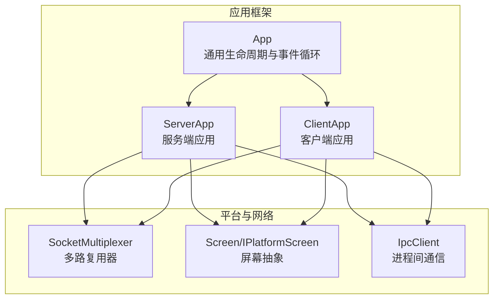
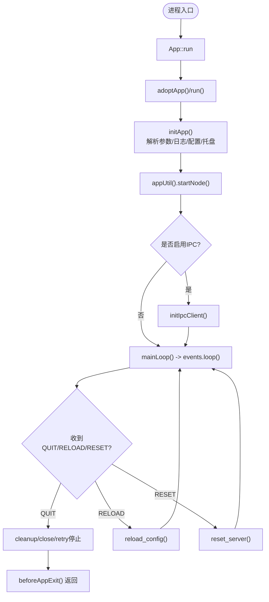
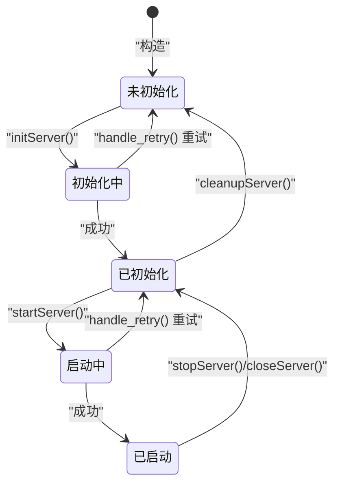
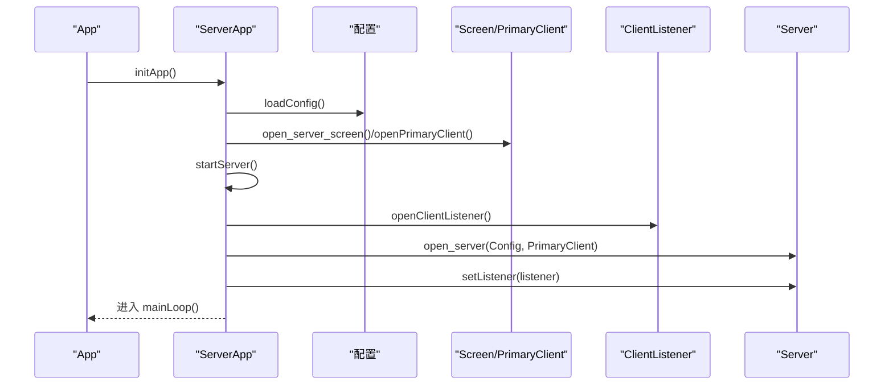
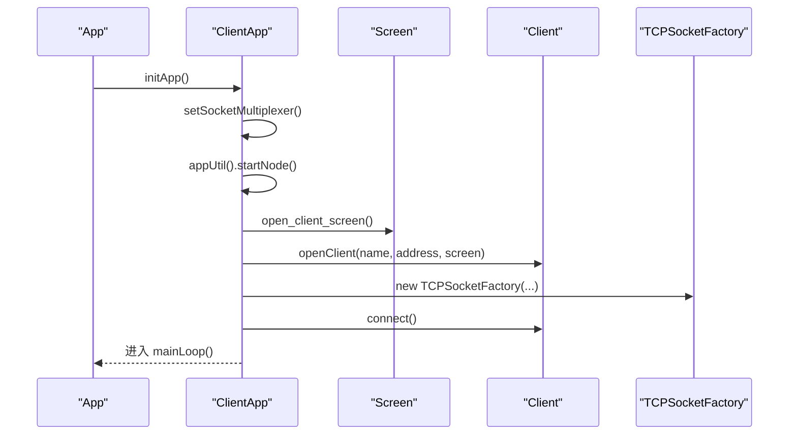
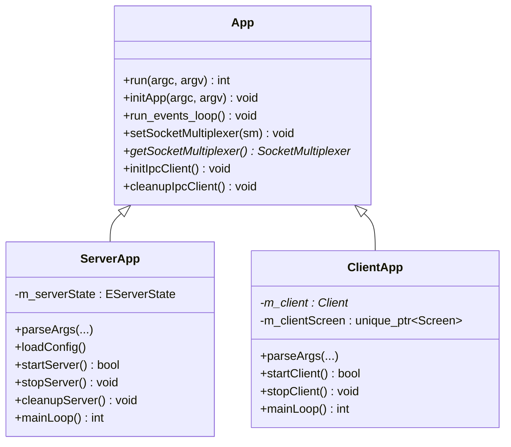

# 应用生命周期管理

<cite>
**本文引用的文件**   
- [App.h](file://src/lib/inputleap/App.h)
- [App.cpp](file://src/lib/inputleap/App.cpp)
- [ServerApp.h](file://src/lib/inputleap/ServerApp.h)
- [ServerApp.cpp](file://src/lib/inputleap/ServerApp.cpp)
- [ClientApp.h](file://src/lib/inputleap\ClientApp.h)
- [ClientApp.cpp](file://src/lib/inputleap\ClientApp.cpp)
</cite>

## 目录
1. [简介](#简介)
2. [项目结构](#项目结构)
3. [核心组件](#核心组件)
4. [架构总览](#架构总览)
5. [详细组件分析](#详细组件分析)
6. [依赖关系分析](#依赖关系分析)
7. [性能考虑](#性能考虑)
8. [故障排查指南](#故障排查指南)
9. [结论](#结论)
10. [附录](#附录)

## 简介
本文件聚焦 Input Leap 的应用生命周期管理，围绕 App 基类与 ServerApp/ClientApp 的具体实现，系统阐述：
- 初始化、启动、运行、关闭四个阶段的流程
- 参数解析与配置加载顺序
- 资源分配与清理策略
- 异常处理、错误恢复与优雅关闭
- 状态机与时序图，帮助开发者全面理解并扩展生命周期行为

## 项目结构
Input Leap 将通用应用框架抽象在 App 基类中，ServerApp 与 ClientApp 分别负责服务端与客户端的特定逻辑。关键文件位于 src/lib/inputleap 下。



图表来源
- [App.h:43-122](file://src/lib/inputleap/App.h#L43-L122)
- [ServerApp.h:48-117](file://src/lib/inputleap/ServerApp.h#L48-L117)
- [ClientApp.h:31-85](file://src/lib/inputleap\ClientApp.h#L31-L85)

章节来源
- [App.h:43-122](file://src/lib/inputleap/App.h#L43-L122)
- [ServerApp.h:48-117](file://src/lib/inputleap/ServerApp.h#L48-L117)
- [ClientApp.h:31-85](file://src/lib/inputleap\ClientApp.h#L31-L85)

## 核心组件
- App 基类
  - 提供 run、initApp、run_events_loop、IPC 客户端生命周期等通用能力
  - 维护事件队列、任务栏接收器、日志输出、平台工具集等
- ServerApp
  - 定义服务端状态机 EServerState，管理监听、连接、主屏、重试与热重载
- ClientApp
  - 管理到远端服务器的连接、重连策略、本地屏幕与状态更新

章节来源
- [App.h:43-122](file://src/lib/inputleap/App.h#L43-L122)
- [App.cpp:84-124](file://src/lib/inputleap/App.cpp#L84-L124)
- [ServerApp.h:36-117](file://src/lib/inputleap/ServerApp.h#L36-L117)
- [ClientApp.h:31-85](file://src/lib/inputleap\ClientApp.h#L31-L85)

## 架构总览
下图展示从进程入口到运行期的关键调用链与职责划分。

```mermaid
sequenceDiagram
participant Main as "进程入口"
participant App as "App : : run"
participant Util as "ArchUtil.run"
participant Srv as "ServerApp/ClientApp"
participant Loop as "事件循环"
Main->>App : 构造并调用 run(argc, argv)
App->>Util : adoptApp()/run()
Util-->>Srv : 回调 standardStartup/runInner/foregroundStartup
Srv->>Srv : initApp(解析参数/设置日志/加载配置)
Srv->>Srv : startNode()
Srv->>Loop : mainLoop() -> events.loop()
Note over Srv,Loop : 运行期事件驱动连接/断开/屏幕事件
Loop-->>Srv : QUIT/RELOAD/RESET 等事件
Srv->>Srv : cleanup/close/retry
Srv-->>Util : beforeAppExit()
Util-->>Main : 返回退出码
```

图表来源
- [App.cpp:84-124](file://src/lib/inputleap/App.cpp#L84-L124)
- [ServerApp.cpp:707-795](file://src/lib/inputleap/ServerApp.cpp#L707-L795)
- [ClientApp.cpp:417-465](file://src/lib/inputleap\ClientApp.cpp#L417-L465)

## 详细组件分析

### App 基类：通用生命周期
- 初始化阶段
  - parseArgs：由子类实现，解析通用与平台相关参数
  - setupFileLogging：根据 --log 启用文件日志
  - loadConfig：由子类实现；App 仅负责调用
  - 托盘与缓冲日志：若未禁用托盘，则创建 BufferedLogOutputter 与任务栏接收器
- 启动阶段
  - appUtil().startNode()：平台节点启动（如守护进程化、Cocoa 集成等）
  - IPC 客户端：按需初始化，用于外部控制（如关机、重启）
- 运行阶段
  - run_events_loop：进入事件循环；macOS 上协调 Cocoa 主循环
- 关闭阶段
  - 移除事件处理器、停止服务、清理 IPC、更新状态、记录日志



图表来源
- [App.cpp:158-199](file://src/lib/inputleap/App.cpp#L158-L199)
- [App.cpp:201-237](file://src/lib/inputleap/App.cpp#L201-L237)
- [ServerApp.cpp:707-795](file://src/lib/inputleap/ServerApp.cpp#L707-L795)
- [ClientApp.cpp:417-465](file://src/lib/inputleap\ClientApp.cpp#L417-L465)

章节来源
- [App.h:43-122](file://src/lib/inputleap/App.h#L43-L122)
- [App.cpp:158-199](file://src/lib/inputleap/App.cpp#L158-L199)
- [App.cpp:201-237](file://src/lib/inputleap/App.cpp#L201-L237)

### ServerApp：服务端状态机与流程
- 状态机
  - kUninitialized → kInitializing → kInitialized → kStarting → kStarted
  - 支持失败重试（定时器 + handle_retry），以及挂起/恢复（suspend/resume）
- 参数解析
  - 解析 --address、--config、平台后端选项等；必要时解析监听地址并 resolve
- 配置加载顺序
  - 显式 --config 优先
  - 否则按优先级尝试：用户 profile 目录下的 input-leap.sgc/.input-leap.conf，再回退到系统配置目录
  - 加载失败时输出提示并以配置错误码退出
- 资源管理
  - 主屏 Screen、PrimaryClient、ClientListener、Server 对象的生命周期严格受控
  - 关闭时等待客户端断开或超时，避免悬挂
- 运行期
  - 注册信号与事件：HUP 热重载、强制重连、重置服务器
  - 无客户端时更新状态；屏幕切换可执行脚本（X11）
- 优雅关闭
  - 停止监听、关闭 Server、清理 PrimaryClient 与 Screen、重置状态



图表来源
- [ServerApp.h:36-43](file://src/lib/inputleap/ServerApp.h#L36-L43)
- [ServerApp.cpp:454-504](file://src/lib/inputleap/ServerApp.cpp#L454-L504)
- [ServerApp.cpp:532-598](file://src/lib/inputleap/ServerApp.cpp#L532-L598)
- [ServerApp.cpp:364-404](file://src/lib/inputleap/ServerApp.cpp#L364-L404)

章节来源
- [ServerApp.h:36-117](file://src/lib/inputleap/ServerApp.h#L36-L117)
- [ServerApp.cpp:88-110](file://src/lib/inputleap/ServerApp.cpp#L88-L110)
- [ServerApp.cpp:196-282](file://src/lib/inputleap/ServerApp.cpp#L196-L282)
- [ServerApp.cpp:364-404](file://src/lib/inputleap/ServerApp.cpp#L364-L404)
- [ServerApp.cpp:454-504](file://src/lib/inputleap/ServerApp.cpp#L454-L504)
- [ServerApp.cpp:532-598](file://src/lib/inputleap/ServerApp.cpp#L532-L598)
- [ServerApp.cpp:707-795](file://src/lib/inputleap/ServerApp.cpp#L707-L795)

#### 服务端启动时序


图表来源
- [ServerApp.cpp:196-282](file://src/lib/inputleap/ServerApp.cpp#L196-L282)
- [ServerApp.cpp:506-520](file://src/lib/inputleap/ServerApp.cpp#L506-L520)
- [ServerApp.cpp:532-598](file://src/lib/inputleap/ServerApp.cpp#L532-L598)
- [ServerApp.cpp:640-673](file://src/lib/inputleap/ServerApp.cpp#L640-L673)

### ClientApp：客户端连接与重连
- 参数解析
  - 解析 --name、--display、--use-x11/--use-ei、--yscroll 等；解析服务器地址并 resolve
- 启动流程
  - 创建 SocketMultiplexer、启动节点、按需初始化 IPC
  - 打开本地屏幕、创建 Client、连接服务器
- 重连策略
  - 失败或断开后，若允许重启，则使用定时器延迟重试；否则退出
- 资源管理
  - 关闭时移除事件处理器、销毁 Client、释放屏幕



图表来源
- [ClientApp.cpp:82-110](file://src/lib/inputleap\ClientApp.cpp#L82-L110)
- [ClientApp.cpp:237-247](file://src/lib/inputleap\ClientApp.cpp#L237-L247)
- [ClientApp.cpp:312-337](file://src/lib/inputleap\ClientApp.cpp#L312-L337)
- [ClientApp.cpp:417-465](file://src/lib/inputleap\ClientApp.cpp#L417-L465)

章节来源
- [ClientApp.h:31-85](file://src/lib/inputleap\ClientApp.h#L31-L85)
- [ClientApp.cpp:82-110](file://src/lib/inputleap\ClientApp.cpp#L82-L110)
- [ClientApp.cpp:237-247](file://src/lib/inputleap\ClientApp.cpp#L237-L247)
- [ClientApp.cpp:312-337](file://src/lib/inputleap\ClientApp.cpp#L312-L337)
- [ClientApp.cpp:417-465](file://src/lib/inputleap\ClientApp.cpp#L417-L465)

## 依赖关系分析
- 低耦合高内聚
  - App 通过虚函数与工厂指针解耦具体应用类型
  - ServerApp/ClientApp 各自封装平台屏幕与网络栈细节
- 关键依赖
  - EventQueue/EventQueueTimer：统一事件与定时调度
  - SocketMultiplexer：跨平台网络多路复用
  - IpcClient：外部控制通道（关机、重连、重置）
  - PlatformScreen：屏蔽平台差异（Windows/X11/Cocoa/EI）



图表来源
- [App.h:43-122](file://src/lib/inputleap/App.h#L43-L122)
- [ServerApp.h:48-117](file://src/lib/inputleap/ServerApp.h#L48-L117)
- [ClientApp.h:31-85](file://src/lib/inputleap\ClientApp.h#L31-L85)

章节来源
- [App.h:43-122](file://src/lib/inputleap/App.h#L43-L122)
- [ServerApp.h:48-117](file://src/lib/inputleap/ServerApp.h#L48-L117)
- [ClientApp.h:31-85](file://src/lib/inputleap\ClientApp.h#L31-L85)

## 性能考虑
- 日志过滤与缓冲
  - 通过日志级别过滤减少控制台输出开销；托盘模式下使用缓冲日志输出器提升 UI 响应
- 事件循环与多路复用
  - 使用 SocketMultiplexer 集中处理网络 IO，避免多线程竞争
- 重试退避
  - 服务端/客户端均支持可配置的重试间隔，避免雪崩式重连
- 平台特性
  - macOS 下分离事件循环与 Cocoa 主循环，避免阻塞

[本节为通用指导，不直接分析具体文件]

## 故障排查指南
- 常见异常与处理
  - 屏幕不可用/打开失败：记录警告/严重错误，必要时触发重试或退出
  - 地址冲突/端口占用：捕获并提示，支持自动重试
  - 配置读取失败：输出调试信息，按路径优先级继续尝试
- 优雅关闭
  - 服务端：等待客户端断开或超时，确保资源释放
  - 客户端：移除事件处理器、关闭连接、释放屏幕
- IPC 控制
  - 收到关机消息时向事件队列注入 QUIT，触发正常退出流程

章节来源
- [ServerApp.cpp:454-504](file://src/lib/inputleap/ServerApp.cpp#L454-L504)
- [ServerApp.cpp:532-598](file://src/lib/inputleap/ServerApp.cpp#L532-L598)
- [ClientApp.cpp:380-405](file://src/lib/inputleap\ClientApp.cpp#L380-L405)
- [App.cpp:219-226](file://src/lib/inputleap/App.cpp#L219-L226)

## 结论
App 基类提供了稳定、可扩展的生命周期骨架；ServerApp 与 ClientApp 在此基础上实现了面向服务端与客户端的差异化流程。通过清晰的状态机、事件驱动模型与完善的异常/重试机制，系统在复杂环境下具备较强的鲁棒性与可维护性。

[本节为总结，不直接分析具体文件]

## 附录
- 术语
  - 主屏：服务端侧代表本机输入输出的屏幕抽象
  - 监听：服务端接受客户端连接的入口
  - 重连：客户端在失败或断开后的自动恢复机制
- 最佳实践
  - 在子类中尽量保持析构与清理对称，避免悬挂引用
  - 对可能失败的步骤（屏幕、网络、配置）采用可重试策略
  - 通过事件而非直接线程同步进行跨模块通信

[本节为概念性内容，不直接分析具体文件]