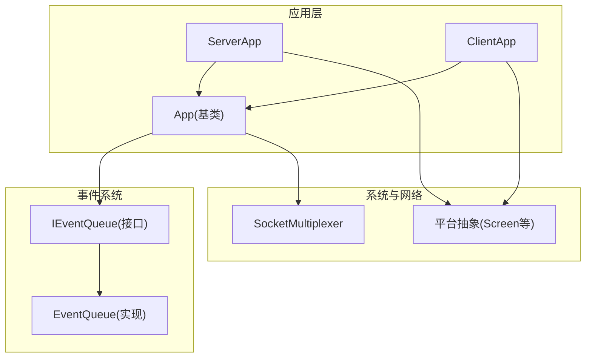
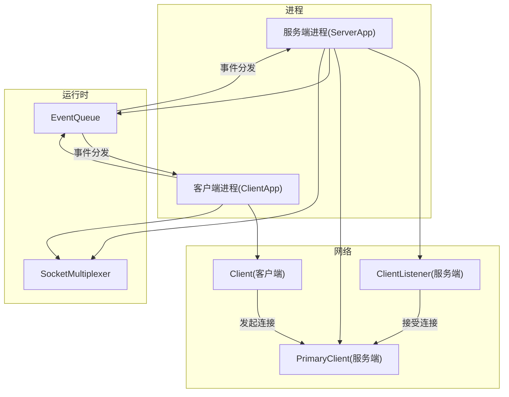
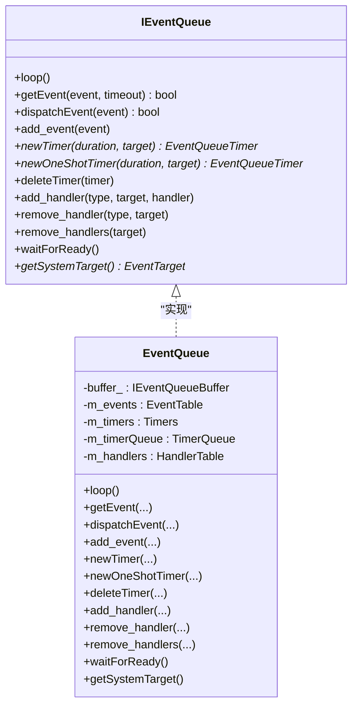
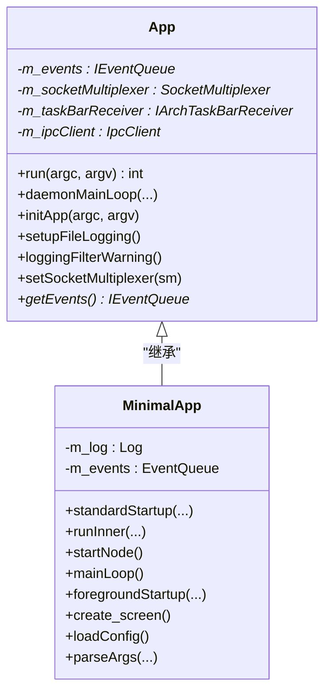
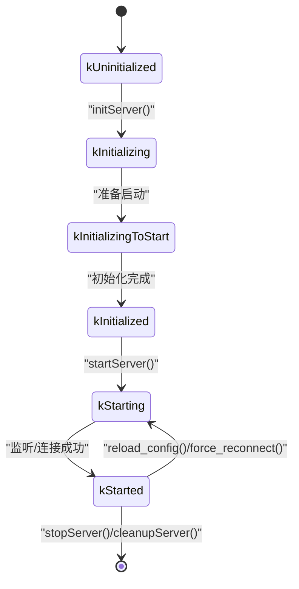
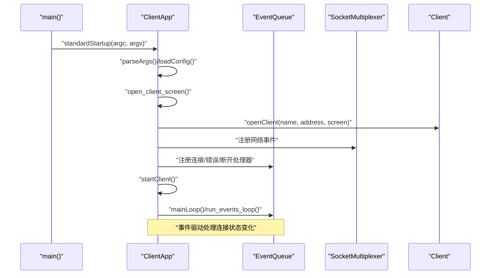
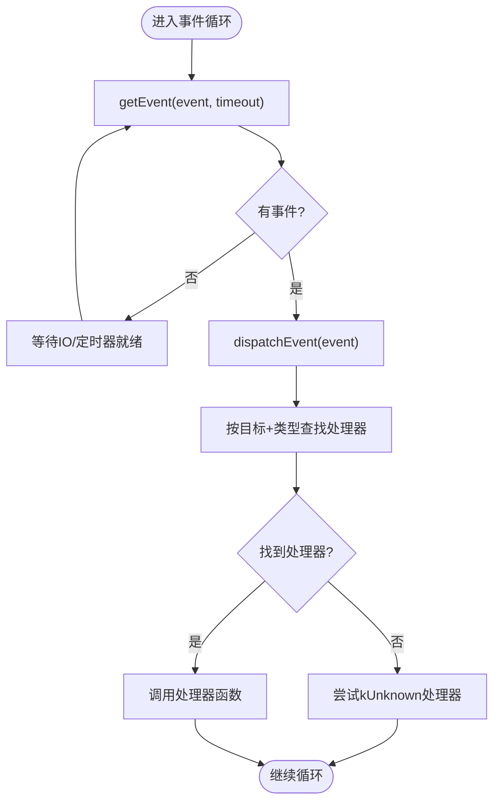
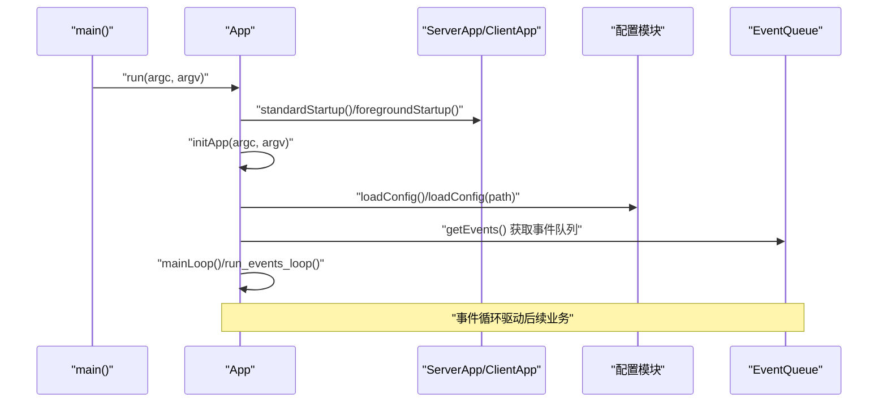
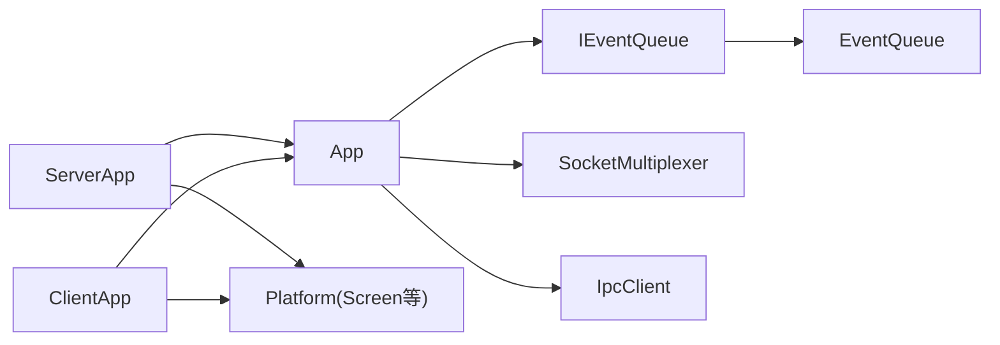

# 核心架构设计

<cite>
**本文引用的文件**   
- [App.h](file://src/lib/inputleap/App.h)
- [ServerApp.h](file://src/lib/inputleap/ServerApp.h)
- [ClientApp.h](file://src/lib/inputleap/ClientApp.h)
- [IEventQueue.h](file://src/lib/base/IEventQueue.h)
- [EventQueue.h](file://src/lib/base/EventQueue.h)
</cite>

## 目录
1. [引言](#引言)
2. [项目结构](#项目结构)
3. [核心组件](#核心组件)
4. [架构总览](#架构总览)
5. [详细组件分析](#详细组件分析)
6. [依赖关系分析](#依赖关系分析)
7. [性能考量](#性能考量)
8. [故障排查指南](#故障排查指南)
9. [结论](#结论)
10. [附录](#附录)

## 引言
本文件面向开发者，系统化阐述 Input Leap 的核心架构设计。重点覆盖：
- 客户端-服务器架构模式与职责划分
- ServerApp 与 ClientApp 的生命周期管理、状态机设计与事件驱动模型
- IEventQueue 事件队列的实现原理（事件类型、分发机制、异步处理）
- 应用启动流程、配置加载顺序与资源管理策略
- 架构图展示组件依赖与数据流向

## 项目结构
Input Leap 采用分层与模块化组织方式：
- 应用层：ServerApp、ClientApp 分别实现服务端与客户端的启动、配置、连接与主循环
- 基础框架层：App 提供通用生命周期、参数解析、日志、IPC 与 Socket 复用器集成
- 事件系统：IEventQueue 抽象 + EventQueue 平台无关实现，配合平台相关缓冲实现
- 网络与平台：通过 SocketMultiplexer 与各平台 Screen 抽象协作

图表来源
- [App.h:43-122](file://src/lib/inputleap/App.h#L43-L122)
- [ServerApp.h:48-117](file://src/lib/inputleap/ServerApp.h#L48-L117)
- [ClientApp.h:31-85](file://src/lib/inputleap/ClientApp.h#L31-L85)
- [IEventQueue.h:37-172](file://src/lib/base/IEventQueue.h#L37-L172)
- [EventQueue.h:42-132](file://src/lib/base/EventQueue.h#L42-L132)

章节来源
- [App.h:43-122](file://src/lib/inputleap/App.h#L43-L122)
- [ServerApp.h:48-117](file://src/lib/inputleap/ServerApp.h#L48-L117)
- [ClientApp.h:31-85](file://src/lib/inputleap/ClientApp.h#L31-L85)
- [IEventQueue.h:37-172](file://src/lib/base/IEventQueue.h#L37-L172)
- [EventQueue.h:42-132](file://src/lib/base/EventQueue.h#L42-L132)

## 核心组件
- App 基类
  - 统一入口 run()、initApp()、mainLoop()、startNode() 等
  - 负责参数解析、日志初始化、IPC 客户端、Socket 复用器注入
  - 暴露 getEvents() 获取事件队列指针，供上层调度
- ServerApp
  - 维护服务端状态机 EServerState，控制初始化、启动、停止、重连
  - 管理监听器、PrimaryClient、Server 实例与屏幕对象
  - 提供 reload_config、force_reconnect、reset_server 等运维能力
- ClientApp
  - 维护客户端连接生命周期，包含重试定时器与断线恢复
  - 管理 Client 与本地 Screen 的打开/关闭
- IEventQueue / EventQueue
  - 定义事件队列接口：loop、getEvent、dispatchEvent、add_event、newTimer/newOneShotTimer/deleteTimer、add_handler/remove_handler 等
  - EventQueue 提供线程安全的事件表、处理器映射、定时器堆与缓冲层

章节来源
- [App.h:43-122](file://src/lib/inputleap/App.h#L43-L122)
- [ServerApp.h:36-117](file://src/lib/inputleap/ServerApp.h#L36-L117)
- [ClientApp.h:31-85](file://src/lib/inputleap/ClientApp.h#L31-L85)
- [IEventQueue.h:37-172](file://src/lib/base/IEventQueue.h#L37-L172)
- [EventQueue.h:42-132](file://src/lib/base/EventQueue.h#L42-L132)

## 架构总览
下图展示了客户端-服务器模式下的关键组件交互与数据流：应用层通过事件循环驱动业务逻辑；服务端监听并接收客户端连接，客户端主动连接服务端；事件队列作为统一的异步消息总线。

图表来源
- [ServerApp.h:48-117](file://src/lib/inputleap/ServerApp.h#L48-L117)
- [ClientApp.h:31-85](file://src/lib/inputleap/ClientApp.h#L31-L85)
- [App.h:95-122](file://src/lib/inputleap/App.h#L95-L122)
- [IEventQueue.h:37-172](file://src/lib/base/IEventQueue.h#L37-L172)
- [EventQueue.h:42-132](file://src/lib/base/EventQueue.h#L42-L132)

## 详细组件分析

### 事件队列 IEventQueue 与 EventQueue
- 接口职责
  - loop(): 阻塞式事件循环，直到退出事件
  - getEvent(): 取事件（可超时），用于外部主循环
  - dispatchEvent(): 按目标与类型查找处理器并调用
  - add_event(): 入队事件
  - newTimer/newOneShotTimer/deleteTimer(): 定时任务管理
  - add_handler/remove_handler/remove_handlers(): 处理器注册与注销
  - waitForReady(): 等待队列就绪
- 内部要点
  - 线程安全：使用互斥量保护事件表、处理器表与定时器集合
  - 定时器：最小堆优先队列，支持重复与一次性定时器，避免堆积
  - 缓冲层：通过 set_buffer 替换底层缓冲，解耦平台差异
  - 处理器表：按 EventTarget -> EventType -> Handler 三级索引，快速定位

图表来源
- [IEventQueue.h:37-172](file://src/lib/base/IEventQueue.h#L37-L172)
- [EventQueue.h:42-132](file://src/lib/base/EventQueue.h#L42-L132)

章节来源
- [IEventQueue.h:37-172](file://src/lib/base/IEventQueue.h#L37-L172)
- [EventQueue.h:42-132](file://src/lib/base/EventQueue.h#L42-L132)

### 应用基类 App 与 MinimalApp
- 职责
  - initApp(): 解析参数、设置文件日志、加载配置
  - run(): 标准入口，封装前台/守护进程模式
  - mainLoop()/run_events_loop(): 事件循环与 Socket 复用器协同
  - IPC 集成：initIpcClient/cleanupIpcClient、handle_ipc_message
  - 资源：持有 IEventQueue、SocketMultiplexer、TaskBarReceiver 等
- MinimalApp
  - 提供最小化运行环境：内置 Log、EventQueue、Screen 创建等默认行为

图表来源
- [App.h:43-146](file://src/lib/inputleap/App.h#L43-L146)

章节来源
- [App.h:43-146](file://src/lib/inputleap/App.h#L43-L146)

### 服务端 ServerApp 与状态机
- 状态机 EServerState
  - kUninitialized -> kInitializing -> kInitializingToStart -> kInitialized -> kStarting -> kStarted
  - 由 startServer/initServer/reload_config 等方法驱动状态迁移
- 关键成员
  - server_、server_screen_、m_primaryClient、m_listener、m_timer、listen_address_
- 主要流程
  - parseArgs/help: 解析服务端参数与帮助信息
  - loadConfig/reload_config: 加载或重载配置
  - open_server/open_client_listener/openPrimaryClient: 建立监听与主客户端
  - handle_retry/handle_no_clients: 无客户端时的重试与提示
  - stopServer/closeServer/closeClientListener: 优雅关闭

图表来源
- [ServerApp.h:36-117](file://src/lib/inputleap/ServerApp.h#L36-L117)

章节来源
- [ServerApp.h:36-117](file://src/lib/inputleap/ServerApp.h#L36-L117)

### 客户端 ClientApp 与连接管理
- 职责
  - foregroundStartup/standardStartup/runInner: 客户端启动流程
  - open_client_screen/startClient/stopClient: 打开本地屏幕、建立/断开连接
  - scheduleClientRestart/handle_client_restart: 失败重试退避
  - handle_client_connected/disconnected/failed: 连接状态回调
- 关键成员
  - m_client、m_clientScreen、m_serverAddress

图表来源
- [ClientApp.h:31-85](file://src/lib/inputleap/ClientApp.h#L31-L85)
- [App.h:95-122](file://src/lib/inputleap/App.h#L95-L122)

章节来源
- [ClientApp.h:31-85](file://src/lib/inputleap/ClientApp.h#L31-L85)
- [App.h:95-122](file://src/lib/inputleap/App.h#L95-L122)

### 事件驱动模型与异步处理
- 事件类型与目标
  - 事件携带 EventType 与 EventTarget，处理器按“目标+类型”注册
  - 系统事件可通过 getSystemTarget() 获取系统级目标
- 分发机制
  - dispatchEvent() 在 HandlerTable 中查找处理器并调用
  - 未找到具体处理器时回退到 kUnknown 处理器
- 异步处理
  - 定时器事件通过 TimerEvent 携带计数，避免堆积
  - 外部主循环可使用 getEvent(timeout) 拉取事件，结合 SocketMultiplexer 进行 IO 多路复用

图表来源
- [IEventQueue.h:37-172](file://src/lib/base/IEventQueue.h#L37-L172)
- [EventQueue.h:42-132](file://src/lib/base/EventQueue.h#L42-L132)

章节来源
- [IEventQueue.h:37-172](file://src/lib/base/IEventQueue.h#L37-L172)
- [EventQueue.h:42-132](file://src/lib/base/EventQueue.h#L42-L132)

### 应用启动流程与配置加载顺序
- 启动路径
  - App::run() 统一入口，区分前台/守护进程模式
  - App::initApp() 解析参数、设置文件日志、加载配置
  - ServerApp/ClientApp 各自实现 standardStartup/foregroundStartup/runInner
- 配置加载
  - App::loadConfig()/loadConfig(pathname) 为虚函数，子类按需实现
  - ServerApp 提供 reload_config() 支持热重载
- 资源管理
  - 通过 unique_ptr 管理 Server/Screen/Client 等资源
  - 使用 deleteTimer 及时释放定时器，避免泄漏
  - SocketMultiplexer 由 App 注入，统一管理 IO 事件

图表来源
- [App.h:60-100](file://src/lib/inputleap/App.h#L60-L100)
- [ServerApp.h:69-96](file://src/lib/inputleap/ServerApp.h#L69-L96)
- [ClientApp.h:52-73](file://src/lib/inputleap/ClientApp.h#L52-L73)

章节来源
- [App.h:60-100](file://src/lib/inputleap/App.h#L60-L100)
- [ServerApp.h:69-96](file://src/lib/inputleap/ServerApp.h#L69-L96)
- [ClientApp.h:52-73](file://src/lib/inputleap/ClientApp.h#L52-L73)

## 依赖关系分析
- 组件耦合
  - ServerApp/ClientApp 均依赖 App 提供的公共能力（事件队列、IPC、Socket 复用器）
  - App 依赖 IEventQueue 抽象，实际由 EventQueue 提供
  - 平台相关能力通过 Screen 抽象与平台缓冲层隔离
- 外部依赖
  - SocketMultiplexer 用于 IO 多路复用
  - IpcClient 用于进程间通信
  - 平台 TaskBarReceiver 用于托盘图标等系统集成

图表来源
- [App.h:95-122](file://src/lib/inputleap/App.h#L95-L122)
- [ServerApp.h:48-117](file://src/lib/inputleap/ServerApp.h#L48-L117)
- [ClientApp.h:31-85](file://src/lib/inputleap/ClientApp.h#L31-L85)
- [IEventQueue.h:37-172](file://src/lib/base/IEventQueue.h#L37-L172)
- [EventQueue.h:42-132](file://src/lib/base/EventQueue.h#L42-L132)

章节来源
- [App.h:95-122](file://src/lib/inputleap/App.h#L95-L122)
- [ServerApp.h:48-117](file://src/lib/inputleap/ServerApp.h#L48-L117)
- [ClientApp.h:31-85](file://src/lib/inputleap/ClientApp.h#L31-L85)
- [IEventQueue.h:37-172](file://src/lib/base/IEventQueue.h#L37-L172)
- [EventQueue.h:42-132](file://src/lib/base/EventQueue.h#L42-L132)

## 性能考量
- 事件循环
  - 使用 getEvent(timeout) 与 SocketMultiplexer 结合，减少忙轮询
  - 定时器采用最小堆，保证 O(log n) 插入与弹出
- 内存与资源
  - 使用 unique_ptr 管理长生命周期对象，避免手动释放
  - 删除定时器与处理器，防止悬挂引用与内存泄漏
- 并发与锁
  - 事件表、处理器表与定时器集合受互斥量保护，注意临界区粒度
- 网络
  - 合理设置重试退避时间，避免风暴式重连

[本节为通用指导，不直接分析具体文件]

## 故障排查指南
- 常见问题定位
  - 连接失败：检查 ClientApp 的重试定时器与 nextRestartTimeout 计算
  - 配置未生效：确认 ServerApp 的 loadConfig/reload_config 是否被正确调用
  - 事件未触发：核查 add_handler 的目标与类型是否正确，是否存在 remove_handlers 提前清理
- 调试建议
  - 启用文件日志与调试级别，观察启动与事件分发轨迹
  - 使用 getEvents() 获取事件队列，打印关键事件类型与目标

章节来源
- [ClientApp.h:58-73](file://src/lib/inputleap/ClientApp.h#L58-L73)
- [ServerApp.h:69-96](file://src/lib/inputleap/ServerApp.h#L69-L96)
- [IEventQueue.h:133-152](file://src/lib/base/IEventQueue.h#L133-L152)

## 结论
Input Leap 以 App 为统一基类，ServerApp/ClientApp 分别实现服务端与客户端的职责。事件队列作为核心异步基础设施，支撑起连接管理、配置加载与系统集成的完整生命周期。通过清晰的状态机与事件驱动模型，系统具备良好的可扩展性与可维护性。

[本节为总结性内容，不直接分析具体文件]

## 附录
- 术语
  - 事件目标(EventTarget)：事件分发的接收者标识
  - 事件类型(EventType)：事件的分类，用于处理器路由
  - 定时器(Timer)：周期性或一次性触发的计时器
- 最佳实践
  - 始终在析构或退出路径上删除定时器与处理器
  - 使用 unique_ptr 管理动态分配的资源
  - 将平台相关逻辑下沉至平台缓冲层与 Screen 抽象

[本节为概念性内容，不直接分析具体文件]