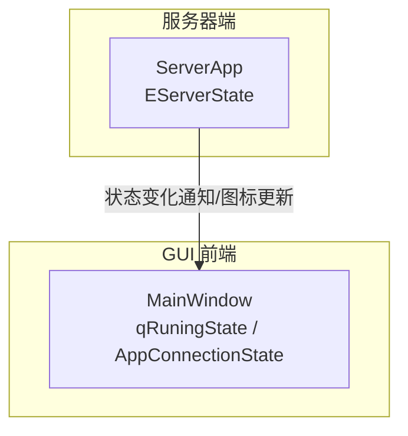
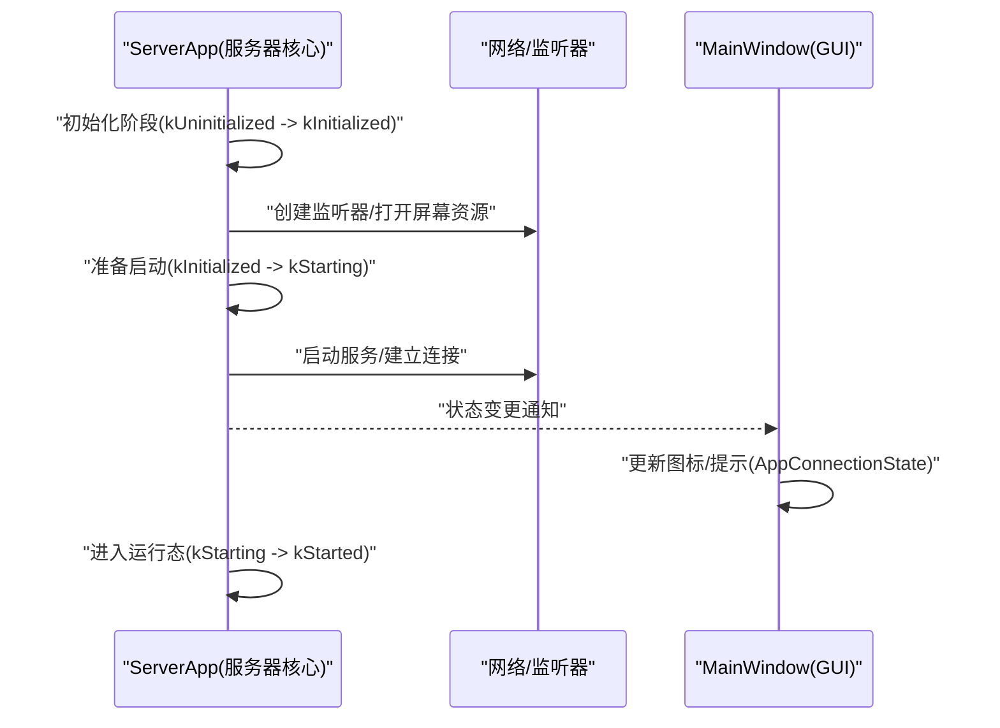
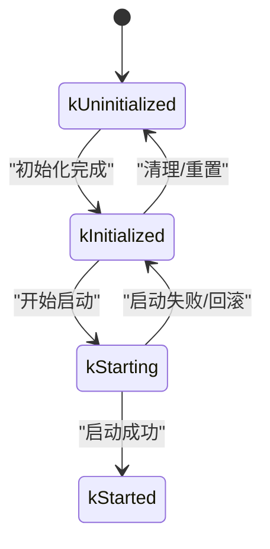
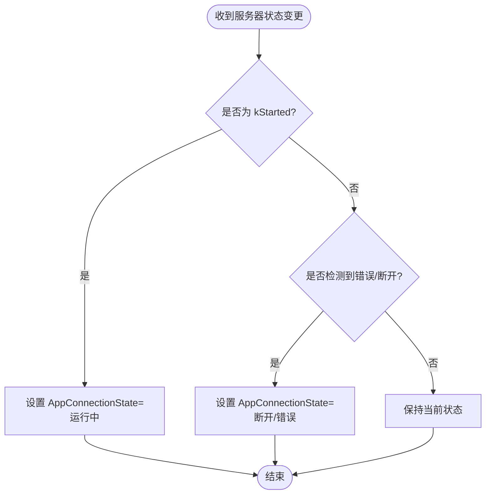
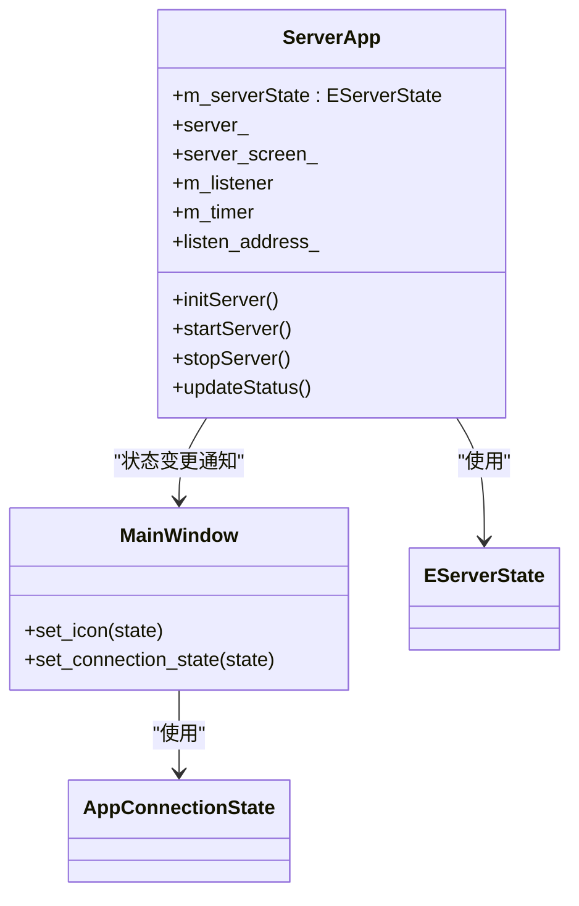

# 状态机设计

<cite>
**本文引用的文件**   
- [ServerApp.h](file://src/lib/inputleap/ServerApp.h)
- [MainWindow.h](file://src/gui/src/MainWindow.h)
- [AppConnectionState.h](file://src/gui/src/AppConnectionState.h)
</cite>

## 目录
1. [简介](#简介)
2. [项目结构](#项目结构)
3. [核心组件](#核心组件)
4. [架构总览](#架构总览)
5. [详细组件分析](#详细组件分析)
6. [依赖关系分析](#依赖关系分析)
7. [性能考虑](#性能考虑)
8. [故障诊断指南](#故障诊断指南)
9. [结论](#结论)

## 简介
本文件聚焦 Input Leap 的状态机设计，围绕服务器端与客户端（GUI）的连接运行状态进行系统化说明。文档涵盖：
- 服务器端状态定义与职责（kUninitialized、kInitialized、kStarting、kStarted 等）
- 状态转换条件与触发事件
- 原子性保证、并发访问控制与一致性维护策略
- 状态转换图、转换规则表与错误状态处理策略
- 状态调试方法与故障诊断指南

## 项目结构
与状态机直接相关的代码主要位于以下位置：
- 服务器端应用层状态枚举与生命周期方法声明：[ServerApp.h](file://src/lib/inputleap/ServerApp.h)
- GUI 主窗口运行状态与连接状态展示：[MainWindow.h](file://src/gui/src/MainWindow.h)、[AppConnectionState.h](file://src/gui/src/AppConnectionState.h)

图表来源
- [ServerApp.h:36-43](file://src/lib/inputleap/ServerApp.h#L36-L43)
- [MainWindow.h:79-80](file://src/gui/src/MainWindow.h#L79-L80)
- [AppConnectionState.h:19](file://src/gui/src/AppConnectionState.h#L19)

章节来源
- [ServerApp.h:36-43](file://src/lib/inputleap/ServerApp.h#L36-L43)
- [MainWindow.h:79-80](file://src/gui/src/MainWindow.h#L79-L80)
- [AppConnectionState.h:19](file://src/gui/src/AppConnectionState.h#L19)

## 核心组件
- 服务器端状态枚举 EServerState
  - 包含 kUninitialized、kInitialized、kStarting、kStarted 等关键状态，用于描述服务器从初始化到启动运行的完整生命周期。
- GUI 运行状态 qRuningState 与连接状态 AppConnectionState
  - 负责在界面层反映当前连接/运行状况，并驱动图标与提示的更新。

章节来源
- [ServerApp.h:36-43](file://src/lib/inputleap/ServerApp.h#L36-L43)
- [MainWindow.h:79-80](file://src/gui/src/MainWindow.h#L79-L80)
- [AppConnectionState.h:19](file://src/gui/src/AppConnectionState.h#L19)

## 架构总览
下图展示了服务器端状态机与 GUI 显示层的交互关系。服务器端通过内部状态机管理自身生命周期；GUI 根据连接状态更新 UI 表现。

图表来源
- [ServerApp.h:36-43](file://src/lib/inputleap/ServerApp.h#L36-L43)
- [MainWindow.h:79-80](file://src/gui/src/MainWindow.h#L79-L80)
- [AppConnectionState.h:19](file://src/gui/src/AppConnectionState.h#L19)

## 详细组件分析

### 服务器端状态机（EServerState）
- 状态定义与职责
  - kUninitialized：尚未完成任何初始化工作，资源未分配。
  - kInitialized：已完成基础初始化（如配置加载、平台资源准备），但尚未开始对外提供服务。
  - kStarting：正在执行启动流程（如创建监听器、建立连接、启动线程等）。
  - kStarted：已完全启动并可正常对外提供服务。
- 典型转换路径
  - kUninitialized → kInitialized：完成初始化后进入。
  - kInitialized → kStarting：开始启动流程。
  - kStarting → kStarted：启动成功。
  - 异常分支：在任一阶段发生错误时，应回退至安全状态或终止流程（见“错误状态处理策略”）。

图表来源
- [ServerApp.h:36-43](file://src/lib/inputleap/ServerApp.h#L36-L43)

章节来源
- [ServerApp.h:36-43](file://src/lib/inputleap/ServerApp.h#L36-L43)

### GUI 运行状态（qRuningState / AppConnectionState）
- 作用
  - 将底层连接/运行状态映射为 UI 可见的图标与提示，便于用户理解当前行为。
- 与服务器状态的协作
  - 当服务器状态由 kStarting 变为 kStarted 时，GUI 应将连接状态切换为“已连接/运行中”，并更新任务栏图标。
  - 若出现连接中断或启动失败，GUI 应回退到“断开/错误”状态。

图表来源
- [MainWindow.h:79-80](file://src/gui/src/MainWindow.h#L79-L80)
- [AppConnectionState.h:19](file://src/gui/src/AppConnectionState.h#L19)

章节来源
- [MainWindow.h:79-80](file://src/gui/src/MainWindow.h#L79-L80)
- [AppConnectionState.h:19](file://src/gui/src/AppConnectionState.h#L19)

### 状态转换规则表
- 合法转换
  - kUninitialized → kInitialized：初始化完成
  - kInitialized → kStarting：开始启动
  - kStarting → kStarted：启动成功
  - kStarting → kInitialized：启动失败，回滚到可恢复状态
  - kInitialized → kUninitialized：清理/重置
- 非法转换
  - 从 kStarted 直接回到 kUninitialized（应先回滚到 kInitialized 再清理）
  - 重复进入同一状态（需幂等处理）

章节来源
- [ServerApp.h:36-43](file://src/lib/inputleap/ServerApp.h#L36-L43)

### 错误状态处理策略
- 启动失败
  - 从 kStarting 回滚到 kInitialized，释放已分配资源，记录错误日志，必要时触发重试机制。
- 运行时异常
  - 若服务在 kStarted 状态下发生不可恢复错误，先过渡到 kInitialized（停止服务、关闭监听），再进行清理。
- 幂等性与去抖
  - 对重复的“启动/停止”请求进行幂等处理，避免并发导致的竞态。

章节来源
- [ServerApp.h:36-43](file://src/lib/inputleap/ServerApp.h#L36-L43)

## 依赖关系分析
- 耦合关系
  - ServerApp 持有服务器实例、屏幕对象、监听器、定时器与网络地址等资源，状态机贯穿这些资源的生命周期管理。
- 外部依赖
  - 平台相关资源（屏幕、输入捕获）、网络监听与连接、事件队列与计时器等。
- 可能的循环依赖
  - 应避免 GUI 与服务器核心之间的强双向依赖，采用事件/回调解耦。

图表来源
- [ServerApp.h:36-43](file://src/lib/inputleap/ServerApp.h#L36-L43)
- [MainWindow.h:79-80](file://src/gui/src/MainWindow.h#L79-L80)
- [AppConnectionState.h:19](file://src/gui/src/AppConnectionState.h#L19)

章节来源
- [ServerApp.h:36-43](file://src/lib/inputleap/ServerApp.h#L36-L43)
- [MainWindow.h:79-80](file://src/gui/src/MainWindow.h#L79-L80)
- [AppConnectionState.h:19](file://src/gui/src/AppConnectionState.h#L19)

## 性能考虑
- 状态检查与更新应尽量轻量，避免阻塞主循环。
- 状态变更通知采用事件/消息队列异步派发，减少锁竞争。
- 对频繁触发的状态转换（如重连）做去抖与合并，降低抖动开销。

## 故障诊断指南
- 常见症状与定位
  - 卡在 kStarting：检查监听器创建、端口占用、证书/权限问题。
  - 无法进入 kStarted：确认网络连接、防火墙、服务端配置。
  - GUI 图标不更新：核对状态变更通知链路是否正确。
- 建议的诊断步骤
  - 打印当前 EServerState 与 AppConnectionState，观察转换序列是否符合预期。
  - 在关键转换点添加日志（进入/退出、异常分支）。
  - 复现问题时抓取最小化配置与网络抓包，辅助定位。
- 恢复策略
  - 自动重试：在 kStarting 失败后短暂等待并重试，限制最大次数。
  - 优雅降级：在部分功能不可用时，仍保持基本监控与提示。

章节来源
- [ServerApp.h:36-43](file://src/lib/inputleap/ServerApp.h#L36-L43)
- [MainWindow.h:79-80](file://src/gui/src/MainWindow.h#L79-L80)
- [AppConnectionState.h:19](file://src/gui/src/AppConnectionState.h#L19)

## 结论
Input Leap 的状态机以清晰的阶段划分与严格的转换规则保障系统稳定性。通过服务器端 EServerState 与 GUI 侧 AppConnectionState 的协同，既保证了核心生命周期的可控性，也提供了良好的用户体验反馈。建议在实现中强化幂等性、并发安全与可观测性，以提升整体健壮性与可维护性。