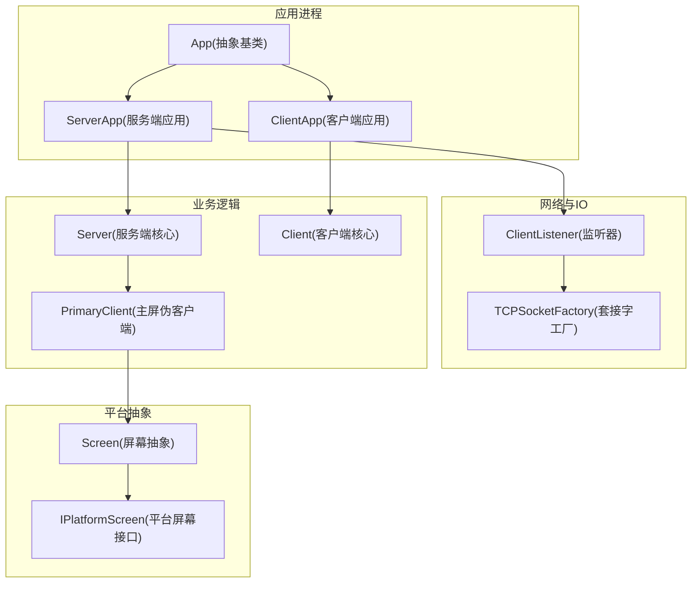
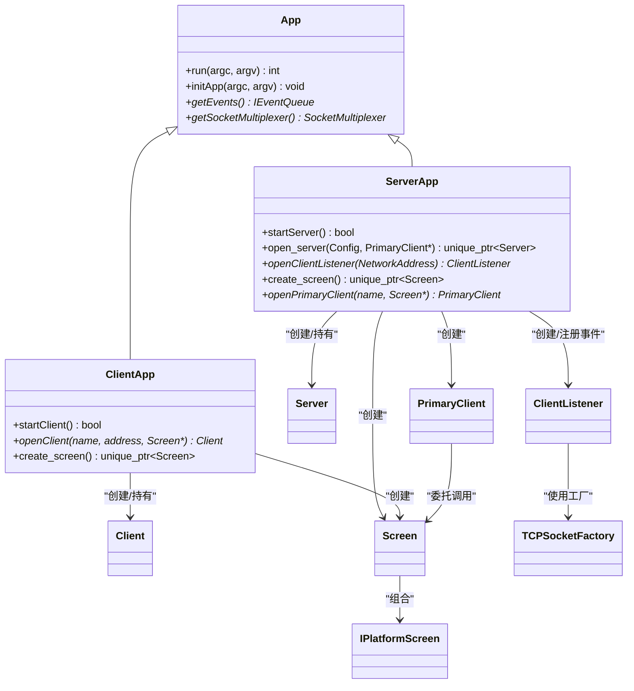
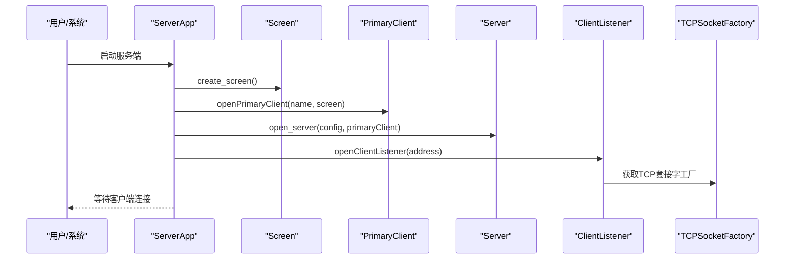
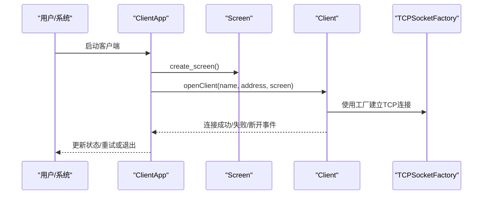
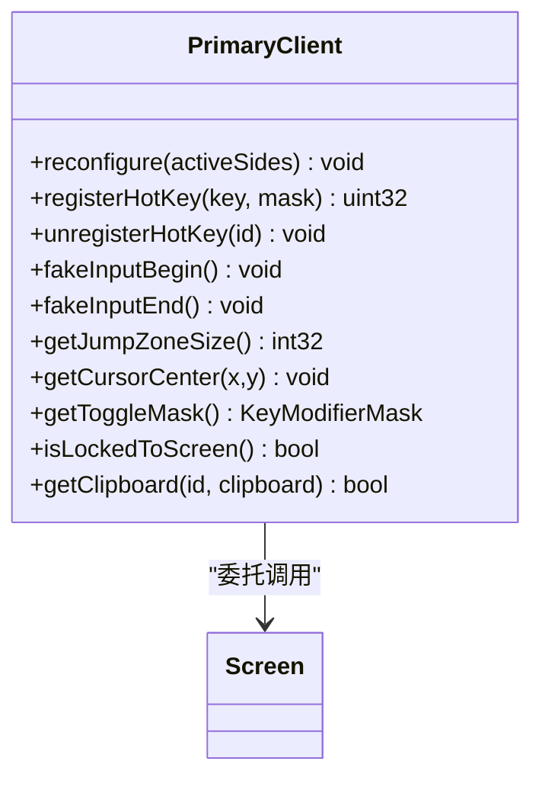
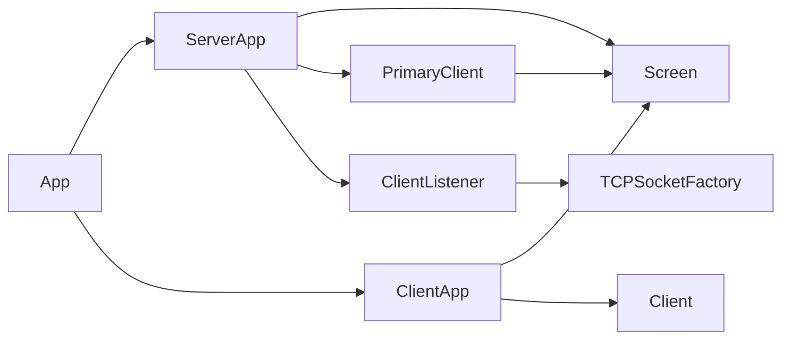

# 组件架构关系

<cite>
**本文引用的文件**   
- [App.h](file://src/lib/inputleap/App.h)
- [ServerApp.h](file://src/lib/inputleap/ServerApp.h)
- [ServerApp.cpp](file://src/lib/inputleap/ServerApp.cpp)
- [ClientApp.h](file://src/lib/inputleap/ClientApp.h)
- [ClientApp.cpp](file://src/lib/inputleap/ClientApp.cpp)
- [PrimaryClient.h](file://src/lib/server/PrimaryClient.h)
- [PrimaryClient.cpp](file://src/lib/server/PrimaryClient.cpp)
</cite>

## 目录
1. [简介](#简介)
2. [项目结构](#项目结构)
3. [核心组件](#核心组件)
4. [架构总览](#架构总览)
5. [详细组件分析](#详细组件分析)
6. [依赖关系分析](#依赖关系分析)
7. [性能与扩展性](#性能与扩展性)
8. [故障排查指南](#故障排查指南)
9. [结论](#结论)
10. [附录：扩展与自定义开发规范](#附录：扩展与自定义开发规范)

## 简介
本文件聚焦 Input Leap 的组件架构关系，围绕 ServerApp、ClientApp、Server、Client、Screen 等核心组件的职责划分与依赖关系进行深入解析。文档同时阐述组件间通信协议、数据流向与控制流传递，说明工厂模式与依赖注入的使用方式，并给出架构图、依赖关系图与交互序列图，最后提供组件扩展与自定义开发规范。

## 项目结构
Input Leap 的核心运行时位于 src/lib/inputleap 与 src/lib/server 等目录中。应用层通过 App 抽象基类统一生命周期管理，ServerApp 与 ClientApp 分别实现服务端与客户端的具体行为；Server 负责连接管理与事件转发，Client 负责发起连接与收发事件；Screen 抽象平台输入输出能力，PrimaryClient 将本地屏幕作为“伪客户端”接入到服务器逻辑中。

图表来源
- [App.h:43-122](file://src/lib/inputleap/App.h#L43-L122)
- [ServerApp.h:48-117](file://src/lib/inputleap/ServerApp.h#L48-L117)
- [ServerApp.cpp:640-673](file://src/lib/inputleap/ServerApp.cpp#L640-L673)
- [ClientApp.h:31-85](file://src/lib/inputleap/ClientApp.h#L31-L85)
- [ClientApp.cpp:312-337](file://src/lib/inputleap/ClientApp.cpp#L312-L337)
- [PrimaryClient.h:29-43](file://src/lib/server/PrimaryClient.h#L29-L43)
- [PrimaryClient.cpp:27-106](file://src/lib/server/PrimaryClient.cpp#L27-L106)

章节来源
- [App.h:43-122](file://src/lib/inputleap/App.h#L43-L122)
- [ServerApp.h:48-117](file://src/lib/inputleap/ServerApp.h#L48-L117)
- [ClientApp.h:31-85](file://src/lib/inputleap/ClientApp.h#L31-L85)

## 核心组件
- App：统一的进程级生命周期、参数解析、日志、IPC、事件循环与 Socket 复用器管理。ServerApp 与 ClientApp 继承自 App，复用通用能力。
- ServerApp：服务端应用入口，负责创建本地 Screen、构造 PrimaryClient、启动 Server、监听客户端连接、处理重连与状态机。
- ClientApp：客户端应用入口，负责创建本地 Screen、构造 Client、连接远端 Server、处理连接失败与自动重启。
- Server：服务端核心，维护与多个 Client 的连接，转发输入事件与剪贴板等数据。
- Client：客户端核心，负责建立与服务端的 TCP 连接，发送本地输入事件，接收远端输入事件并投递到本地 Screen。
- Screen：平台无关的屏幕抽象，封装鼠标、键盘、剪贴板、热键等能力，具体由 IPlatformScreen 实现。
- PrimaryClient：将本地屏幕包装为“伪客户端”，使本地屏幕能参与 Server 的多客户端模型。

章节来源
- [App.h:43-122](file://src/lib/inputleap/App.h#L43-L122)
- [ServerApp.h:48-117](file://src/lib/inputleap/ServerApp.h#L48-L117)
- [ClientApp.h:31-85](file://src/lib/inputleap/ClientApp.h#L31-L85)
- [PrimaryClient.h:29-43](file://src/lib/server/PrimaryClient.h#L29-L43)
- [PrimaryClient.cpp:27-106](file://src/lib/server/PrimaryClient.cpp#L27-L106)

## 架构总览
下图展示服务端与客户端在进程内的主要对象关系与职责边界。ServerApp 与 ClientApp 通过工厂与依赖注入的方式创建底层 IO 与平台能力，并通过事件队列进行松耦合通信。

图表来源
- [App.h:43-122](file://src/lib/inputleap/App.h#L43-L122)
- [ServerApp.h:48-117](file://src/lib/inputleap/ServerApp.h#L48-L117)
- [ServerApp.cpp:600-673](file://src/lib/inputleap/ServerApp.cpp#L600-L673)
- [ClientApp.h:31-85](file://src/lib/inputleap/ClientApp.h#L31-L85)
- [ClientApp.cpp:312-337](file://src/lib/inputleap/ClientApp.cpp#L312-L337)
- [PrimaryClient.h:29-43](file://src/lib/server/PrimaryClient.h#L29-L43)
- [PrimaryClient.cpp:27-106](file://src/lib/server/PrimaryClient.cpp#L27-L106)

## 详细组件分析

### ServerApp 分析
- 职责
  - 解析服务端参数、加载配置、初始化本地 Screen 与 PrimaryClient。
  - 启动 Server，创建并注册 ClientListener，处理客户端连接事件。
  - 管理服务端状态机（未初始化/初始化/启动中/已启动），支持重试与挂起恢复。
- 关键流程
  - 创建本地 Screen：优先创建平台实现，可选包裹日志包装器，再构造 Screen。
  - 打开 PrimaryClient：以本地屏幕名称与 Screen 指针构造，作为“主屏客户端”。
  - 打开 Server：传入配置、PrimaryClient、本地 Screen、事件队列与参数。
  - 打开 ClientListener：根据是否启用加密与证书校验设置安全级别，使用 TCPSocketFactory 创建底层套接字。
- 错误与恢复
  - 监听端口占用或异常时记录日志并进入重试流程（可配置）。
  - 屏幕错误触发退出事件。
  - 挂起/恢复时停止/重启服务。

图表来源
- [ServerApp.cpp:600-673](file://src/lib/inputleap/ServerApp.cpp#L600-L673)
- [ServerApp.h:86-111](file://src/lib/inputleap/ServerApp.h#L86-L111)

章节来源
- [ServerApp.cpp:367-404](file://src/lib/inputleap/ServerApp.cpp#L367-L404)
- [ServerApp.cpp:600-673](file://src/lib/inputleap/ServerApp.cpp#L600-L673)
- [ServerApp.h:86-111](file://src/lib/inputleap/ServerApp.h#L86-L111)

### ClientApp 分析
- 职责
  - 解析客户端参数、创建本地 Screen、构造 Client 并连接到指定 Server。
  - 处理连接成功、失败与断开事件，支持自动重启策略。
- 关键流程
  - 打开 Client：传入事件队列、屏幕名、目标地址、TCPSocketFactory、本地 Screen 与参数。
  - 注册客户端事件处理器：连接成功、连接失败、断开。
  - 断线后根据是否可重启决定是否安排定时器重试。
- 错误与恢复
  - 连接失败时更新状态并可触发退出或重试。
  - 内存分配失败时清理资源并抛出异常。

图表来源
- [ClientApp.cpp:312-337](file://src/lib/inputleap/ClientApp.cpp#L312-L337)
- [ClientApp.h:67-85](file://src/lib/inputleap/ClientApp.h#L67-L85)

章节来源
- [ClientApp.cpp:301-346](file://src/lib/inputleap/ClientApp.cpp#L301-L346)
- [ClientApp.h:67-85](file://src/lib/inputleap/ClientApp.h#L67-L85)

### PrimaryClient 分析
- 职责
  - 将本地屏幕包装为“伪客户端”，使其能够被 Server 当作普通客户端处理。
  - 转发热键注册/注销、假输入开始/结束、跳转区域大小、光标中心、切换掩码、锁定状态、剪贴板访问等调用至底层 Screen。
- 设计要点
  - 基于 BaseClientProxy 实现，屏蔽本地屏幕细节，向上提供标准客户端接口。
  - 通过引用 Screen 指针完成所有平台相关操作。

图表来源
- [PrimaryClient.h:29-43](file://src/lib/server/PrimaryClient.h#L29-L43)
- [PrimaryClient.cpp:27-106](file://src/lib/server/PrimaryClient.cpp#L27-L106)

章节来源
- [PrimaryClient.cpp:27-106](file://src/lib/server/PrimaryClient.cpp#L27-L106)

### Screen 与 IPlatformScreen
- Screen 是平台无关的屏幕抽象，封装了输入事件采集、热键、剪贴板、光标位置等能力。
- IPlatformScreen 是平台特定实现的接口，Screen 内部组合该接口以适配不同操作系统。
- 在 ServerApp 中，Screen 可通过日志包装器增强调试能力。

章节来源
- [ServerApp.cpp:600-607](file://src/lib/inputleap/ServerApp.cpp#L600-L607)

## 依赖关系分析
- 继承与多态
  - ServerApp 与 ClientApp 均继承自 App，复用生命周期与事件循环。
- 组合与工厂
  - ServerApp 使用 TCPSocketFactory 创建底层套接字；ClientListener 依赖该工厂。
  - Screen 组合 IPlatformScreen 以屏蔽平台差异。
- 事件驱动
  - 组件间通过 IEventQueue 的事件类型进行解耦，如 CLIENT_LISTENER_CONNECTED、CLIENT_CONNECTED、SERVER_DISCONNECTED 等。
- 安全与加密
  - 服务端监听器根据参数选择明文、加密或加密认证的安全级别。

图表来源
- [App.h:43-122](file://src/lib/inputleap/App.h#L43-L122)
- [ServerApp.h:48-117](file://src/lib/inputleap/ServerApp.h#L48-L117)
- [ServerApp.cpp:640-673](file://src/lib/inputleap/ServerApp.cpp#L640-L673)
- [ClientApp.h:31-85](file://src/lib/inputleap/ClientApp.h#L31-L85)
- [ClientApp.cpp:312-337](file://src/lib/inputleap/ClientApp.cpp#L312-L337)
- [PrimaryClient.h:29-43](file://src/lib/server/PrimaryClient.h#L29-L43)

章节来源
- [ServerApp.cpp:640-673](file://src/lib/inputleap/ServerApp.cpp#L640-L673)
- [ClientApp.cpp:312-337](file://src/lib/inputleap/ClientApp.cpp#L312-L337)

## 性能与扩展性
- 事件循环与复用
  - 通过 SocketMultiplexer 统一管理网络 IO，减少线程切换开销。
- 日志与调试
  - Screen 可选择日志包装器，便于定位问题但可能带来额外开销。
- 安全级别
  - 按需启用加密与证书校验，平衡安全性与性能。
- 可扩展点
  - 平台屏幕：实现 IPlatformScreen 以适配新平台。
  - 传输层：替换 TCPSocketFactory 以支持其他传输机制。
  - 客户端/服务端：通过事件钩子扩展行为（如屏幕切换脚本）。

[本节为通用指导，不直接分析具体文件]

## 故障排查指南
- 监听端口占用
  - 现象：无法监听客户端连接，提示端口占用。
  - 处理：检查端口冲突，调整监听地址或关闭占用进程。
- 连接失败与断线
  - 现象：客户端连接失败或频繁断开。
  - 处理：确认网络连通性与防火墙规则，检查加密与证书配置，启用自动重启策略。
- 屏幕错误
  - 现象：屏幕相关错误导致退出。
  - 处理：查看日志，确认平台驱动权限与可用性。
- 重试与恢复
  - 现象：服务启动失败后自动重试。
  - 处理：观察重试间隔与次数，必要时调整参数。

章节来源
- [ServerApp.cpp:568-598](file://src/lib/inputleap/ServerApp.cpp#L568-L598)
- [ServerApp.cpp:616-638](file://src/lib/inputleap/ServerApp.cpp#L616-L638)
- [ClientApp.cpp:301-346](file://src/lib/inputleap/ClientApp.cpp#L301-L346)

## 结论
Input Leap 采用清晰的层次化架构：App 提供通用生命周期与基础设施，ServerApp 与 ClientApp 分别实现服务端与客户端的业务编排，Server 与 Client 负责网络与事件转发，Screen 抽象平台能力，PrimaryClient 将本地屏幕纳入统一模型。通过工厂模式与依赖注入降低耦合，借助事件队列实现松耦合通信，整体具备良好的可测试性与可扩展性。

[本节为总结性内容，不直接分析具体文件]

## 附录：扩展与自定义开发规范
- 新增平台屏幕
  - 实现 IPlatformScreen 接口，并在 create_platform_screen 中返回实例。
  - 在 Screen 构造时传入平台实现，必要时添加日志包装器。
- 自定义传输层
  - 实现新的 SocketFactory 并替换 TCPSocketFactory，确保与事件队列集成。
- 扩展服务端行为
  - 在 ServerApp 中注册新的事件处理器，响应 SERVER_SCREEN_SWITCHED 等事件。
  - 如需执行外部脚本，参考现有回调模式。
- 客户端自动重启
  - 利用 scheduleClientRestart 与 nextRestartTimeout 控制退避策略。
- 安全配置
  - 根据需求选择 ConnectionSecurityLevel，必要时启用客户端证书校验。

章节来源
- [ServerApp.cpp:600-673](file://src/lib/inputleap/ServerApp.cpp#L600-L673)
- [ClientApp.cpp:312-337](file://src/lib/inputleap/ClientApp.cpp#L312-L337)
- [ServerApp.h:86-111](file://src/lib/inputleap/ServerApp.h#L86-L111)
- [ClientApp.h:67-85](file://src/lib/inputleap/ClientApp.h#L67-L85)