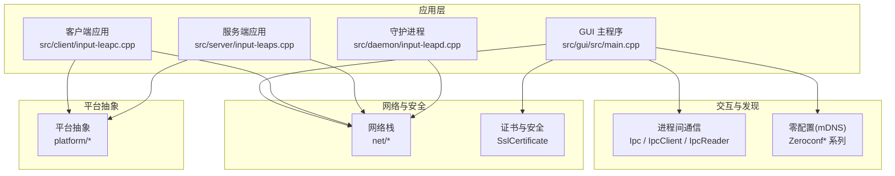
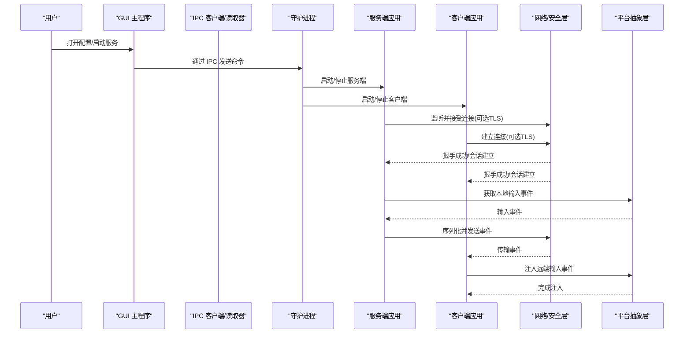
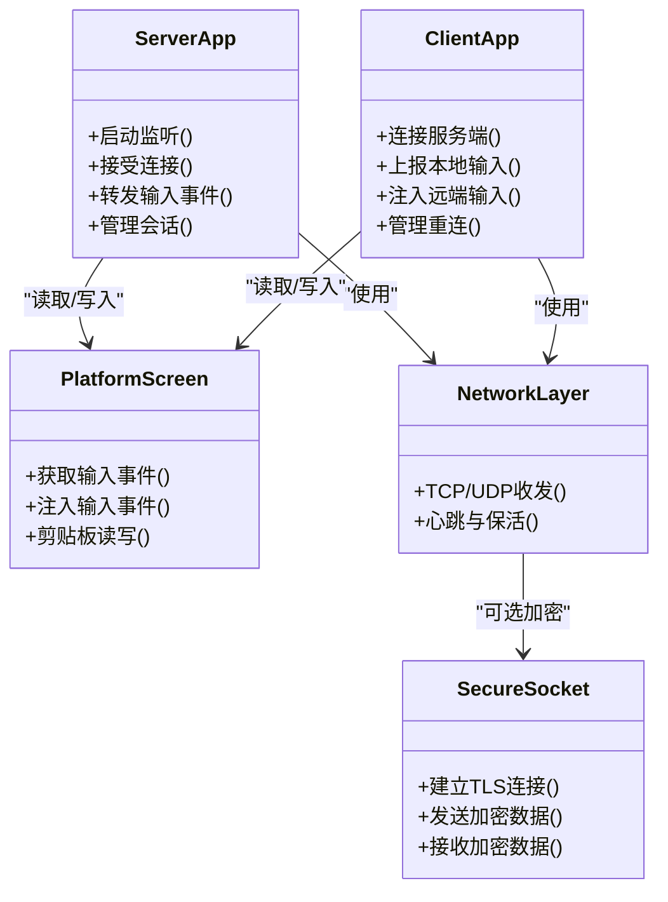
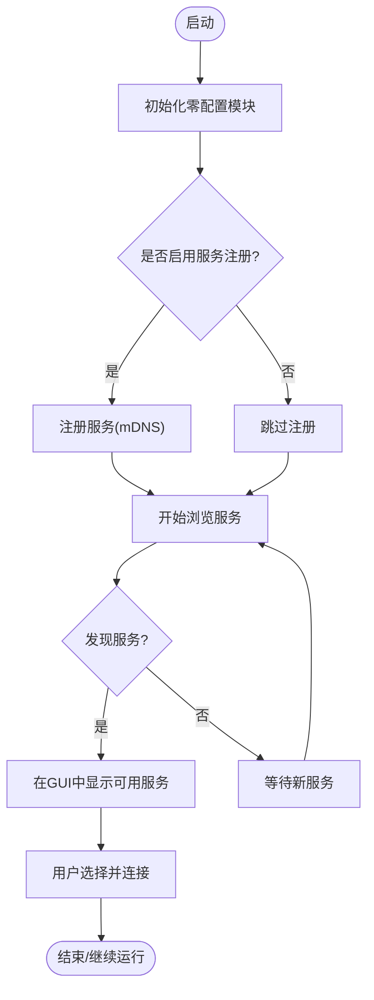
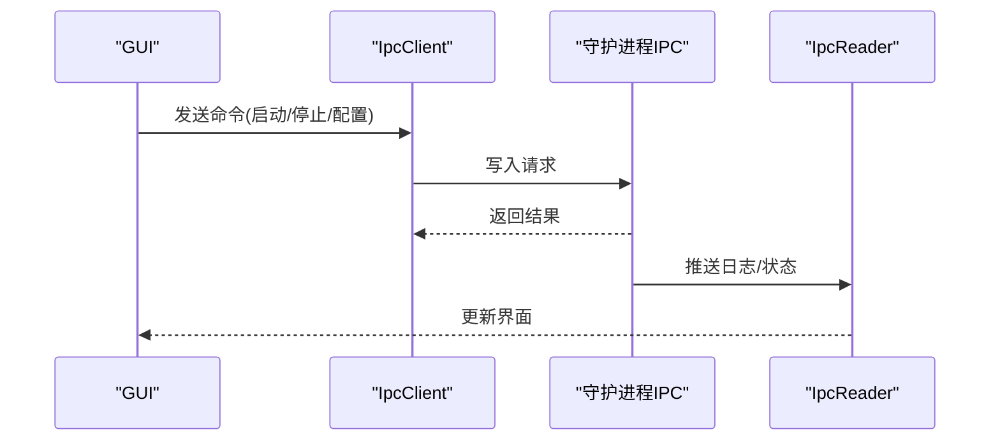
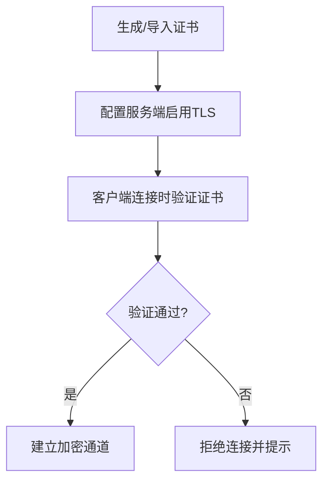
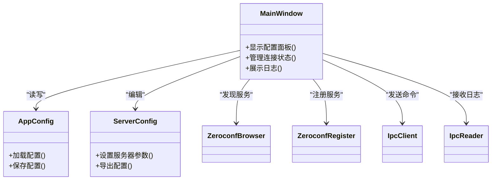
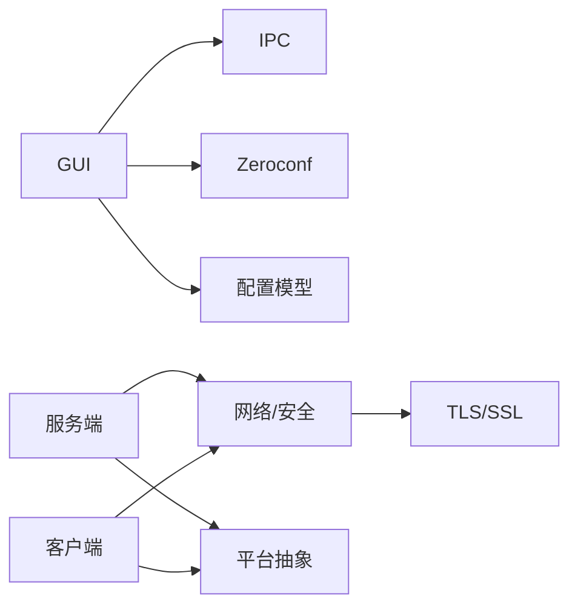

# 系统架构

<cite>
**本文引用的文件**   
- [README.md](file://README.md)
- [src/client/input-leapc.cpp](file://src/client/input-leapc.cpp)
- [src/server/input-leaps.cpp](file://src/server/input-leaps.cpp)
- [src/daemon/input-leapd.cpp](file://src/daemon/input-leapd.cpp)
- [src/gui/src/main.cpp](file://src/gui/src/main.cpp)
- [src/gui/src/Ipc.h](file://src/gui/src/Ipc.h)
- [src/gui/src/IpcClient.h](file://src/gui/src/IpcClient.h)
- [src/gui/src/IpcReader.h](file://src/gui/src/IpcReader.h)
- [src/gui/src/ZeroconfBrowser.h](file://src/gui/src/ZeroconfBrowser.h)
- [src/gui/src/ZeroconfRegister.h](file://src/gui/src/ZeroconfRegister.h)
- [src/gui/src/ZeroconfServer.h](file://src/gui/src/ZeroconfServer.h)
- [src/gui/src/ZeroconfService.h](file://src/gui/src/ZeroconfService.h)
- [src/gui/src/ZeroconfThread.h](file://src/gui/src/ZeroconfThread.h)
- [src/gui/src/SslCertificate.h](file://src/gui/src/SslCertificate.h)
- [src/gui/src/AppConfig.h](file://src/gui/src/AppConfig.h)
- [src/gui/src/ServerConfig.h](file://src/gui/src/ServerConfig.h)
- [src/gui/src/MainWindow.h](file://src/gui/src/MainWindow.h)
</cite>

## 目录
1. [简介](#简介)
2. [项目结构](#项目结构)
3. [核心组件](#核心组件)
4. [架构总览](#架构总览)
5. [详细组件分析](#详细组件分析)
6. [依赖关系分析](#依赖关系分析)
7. [性能考量](#性能考量)
8. [故障排查指南](#故障排查指南)
9. [结论](#结论)
10. [附录](#附录)

## 简介
Input Leap 是一款跨平台的“软件 KVM”工具，允许用户使用一套键盘与鼠标控制多台计算机。其设计目标包括：
- 可靠性与易用性：开箱即用、配置简单
- 跨平台兼容：Windows、macOS、Linux、FreeBSD、OpenBSD 等
- 透明协作：问题追踪与开发过程公开

在运行模式上，支持“服务器 + 客户端”的 C/S 架构，并提供图形化配置界面与后台守护进程。网络通信具备安全能力（SSL/TLS），并支持通过零配置（Bonjour/mDNS）进行自动发现与服务注册。

本节为总体介绍，不直接分析具体源码文件。

## 项目结构
仓库采用分层与按职责划分的组织方式：
- src/client：客户端可执行程序入口与平台相关集成
- src/server：服务端可执行程序入口与平台相关集成
- src/daemon：守护进程入口（用于后台服务）
- src/gui：基于 Qt 的图形界面，负责配置、连接管理、零配置、IPC 等
- src/lib：共享库（包含基础库、网络、平台抽象、输入输出、线程模型等）
- src/test：单元测试、集成测试与 Mock

图表来源
- [src/gui/src/main.cpp](file://src/gui/src/main.cpp)
- [src/client/input-leapc.cpp](file://src/client/input-leapc.cpp)
- [src/server/input-leaps.cpp](file://src/server/input-leaps.cpp)
- [src/daemon/input-leapd.cpp](file://src/daemon/input-leapd.cpp)
- [src/gui/src/Ipc.h](file://src/gui/src/Ipc.h)
- [src/gui/src/IpcClient.h](file://src/gui/src/IpcClient.h)
- [src/gui/src/IpcReader.h](file://src/gui/src/IpcReader.h)
- [src/gui/src/ZeroconfBrowser.h](file://src/gui/src/ZeroconfBrowser.h)
- [src/gui/src/ZeroconfRegister.h](file://src/gui/src/ZeroconfRegister.h)
- [src/gui/src/ZeroconfServer.h](file://src/gui/src/ZeroconfServer.h)
- [src/gui/src/ZeroconfService.h](file://src/gui/src/ZeroconfService.h)
- [src/gui/src/ZeroconfThread.h](file://src/gui/src/ZeroconfThread.h)
- [src/gui/src/SslCertificate.h](file://src/gui/src/SslCertificate.h)

章节来源
- [README.md:1-157](file://README.md#L1-L157)

## 核心组件
- ServerApp（服务端应用）
  - 职责：监听端口、接受客户端连接、转发输入事件、管理剪贴板共享、处理多客户端会话。
  - 关键实现位置：服务端入口与平台集成位于服务端模块中。
- ClientApp（客户端应用）
  - 职责：连接到服务端、上报本地输入事件、接收远端输入事件并注入到本机。
  - 关键实现位置：客户端入口与平台集成位于客户端模块中。
- PlatformScreen（平台屏幕抽象）
  - 职责：屏蔽操作系统差异，提供统一的屏幕/输入/剪贴板接口，供上层逻辑调用。
  - 关键实现位置：平台抽象层。
- SecureSocket（安全套接字）
  - 职责：封装 TLS/SSL 加密通道，确保输入与剪贴板数据的安全传输。
  - 关键实现位置：网络与安全模块。
- GUI 与配置
  - 职责：可视化配置服务器布局、管理连接、展示状态、辅助诊断。
  - 关键实现位置：GUI 主程序与对话框、配置模型。
- 零配置（mDNS/Bonjour）
  - 职责：自动发现与注册服务，简化用户连接流程。
  - 关键实现位置：Zeroconf* 系列组件。
- 进程间通信（IPC）
  - 职责：GUI 与后台进程之间的消息传递，如日志、命令下发、状态同步。
  - 关键实现位置：Ipc / IpcClient / IpcReader。

章节来源
- [src/server/input-leaps.cpp](file://src/server/input-leaps.cpp)
- [src/client/input-leapc.cpp](file://src/client/input-leapc.cpp)
- [src/gui/src/Ipc.h](file://src/gui/src/Ipc.h)
- [src/gui/src/IpcClient.h](file://src/gui/src/IpcClient.h)
- [src/gui/src/IpcReader.h](file://src/gui/src/IpcReader.h)
- [src/gui/src/ZeroconfBrowser.h](file://src/gui/src/ZeroconfBrowser.h)
- [src/gui/src/ZeroconfRegister.h](file://src/gui/src/ZeroconfRegister.h)
- [src/gui/src/ZeroconfServer.h](file://src/gui/src/ZeroconfServer.h)
- [src/gui/src/ZeroconfService.h](file://src/gui/src/ZeroconfService.h)
- [src/gui/src/ZeroconfThread.h](file://src/gui/src/ZeroconfThread.h)
- [src/gui/src/SslCertificate.h](file://src/gui/src/SslCertificate.h)

## 架构总览
Input Leap 采用“客户端-服务器 + 图形配置 + 守护进程”的分层架构：
- 表现层（GUI）：负责配置、连接管理与用户交互
- 业务层（Server/Client）：负责事件路由、协议编解码、会话管理
- 平台抽象层（Platform）：屏蔽 OS 差异，统一输入/屏幕/剪贴板访问
- 网络与安全层（Net/SecureSocket）：提供可靠、安全的传输通道
- 发现与协作层（Zeroconf）：提供自动发现与注册能力
- 进程内通信（IPC）：GUI 与后台进程之间的高效消息通道

图表来源
- [src/gui/src/main.cpp](file://src/gui/src/main.cpp)
- [src/gui/src/Ipc.h](file://src/gui/src/Ipc.h)
- [src/gui/src/IpcClient.h](file://src/gui/src/IpcClient.h)
- [src/gui/src/IpcReader.h](file://src/gui/src/IpcReader.h)
- [src/daemon/input-leapd.cpp](file://src/daemon/input-leapd.cpp)
- [src/server/input-leaps.cpp](file://src/server/input-leaps.cpp)
- [src/client/input-leapc.cpp](file://src/client/input-leapc.cpp)

## 详细组件分析

### 客户端-服务器架构与事件驱动模型
- 事件驱动
  - 服务端监听输入事件，将其序列化为网络消息；客户端接收后反序列化为本地事件并注入。
  - 异步处理：网络 I/O 与事件分发通常采用非阻塞或事件循环机制，避免阻塞 UI 与主线程。
- 跨平台抽象
  - PlatformScreen 提供统一接口，屏蔽 Windows/macOS/Linux 的差异，使上层逻辑无需关心平台细节。
- 安全传输
  - SecureSocket 封装 TLS，保证输入与剪贴板数据的机密性与完整性。

图表来源
- [src/server/input-leaps.cpp](file://src/server/input-leaps.cpp)
- [src/client/input-leapc.cpp](file://src/client/input-leapc.cpp)
- [src/gui/src/SslCertificate.h](file://src/gui/src/SslCertificate.h)

章节来源
- [src/server/input-leaps.cpp](file://src/server/input-leaps.cpp)
- [src/client/input-leapc.cpp](file://src/client/input-leapc.cpp)
- [src/gui/src/SslCertificate.h](file://src/gui/src/SslCertificate.h)

### 零配置（mDNS/Bonjour）自动发现与注册
- 功能要点
  - 自动发现：扫描局域网中的 Input Leap 服务
  - 服务注册：将自身服务以 mDNS 广播出去
  - 线程模型：独立线程执行发现/注册任务，避免阻塞 UI
- 组件关系
  - ZeroconfBrowser：浏览/发现服务
  - ZeroconfRegister：注册服务
  - ZeroconfServer/Service：服务描述与生命周期管理
  - ZeroconfThread：后台线程调度

图表来源
- [src/gui/src/ZeroconfBrowser.h](file://src/gui/src/ZeroconfBrowser.h)
- [src/gui/src/ZeroconfRegister.h](file://src/gui/src/ZeroconfRegister.h)
- [src/gui/src/ZeroconfServer.h](file://src/gui/src/ZeroconfServer.h)
- [src/gui/src/ZeroconfService.h](file://src/gui/src/ZeroconfService.h)
- [src/gui/src/ZeroconfThread.h](file://src/gui/src/ZeroconfThread.h)

章节来源
- [src/gui/src/ZeroconfBrowser.h](file://src/gui/src/ZeroconfBrowser.h)
- [src/gui/src/ZeroconfRegister.h](file://src/gui/src/ZeroconfRegister.h)
- [src/gui/src/ZeroconfServer.h](file://src/gui/src/ZeroconfServer.h)
- [src/gui/src/ZeroconfService.h](file://src/gui/src/ZeroconfService.h)
- [src/gui/src/ZeroconfThread.h](file://src/gui/src/ZeroconfThread.h)

### 进程间通信（IPC）
- 角色划分
  - GUI 作为 IPC 客户端，向守护进程发送命令（启动/停止、配置更新）
  - 守护进程作为 IPC 服务端，协调后台服务进程
  - IpcReader 负责读取守护进程的日志或状态推送
- 典型流程

图表来源
- [src/gui/src/Ipc.h](file://src/gui/src/Ipc.h)
- [src/gui/src/IpcClient.h](file://src/gui/src/IpcClient.h)
- [src/gui/src/IpcReader.h](file://src/gui/src/IpcReader.h)
- [src/daemon/input-leapd.cpp](file://src/daemon/input-leapd.cpp)

章节来源
- [src/gui/src/Ipc.h](file://src/gui/src/Ipc.h)
- [src/gui/src/IpcClient.h](file://src/gui/src/IpcClient.h)
- [src/gui/src/IpcReader.h](file://src/gui/src/IpcReader.h)
- [src/daemon/input-leapd.cpp](file://src/daemon/input-leapd.cpp)

### 安全与证书管理
- 证书生成与管理
  - GUI 提供证书创建、导入与验证能力
  - 服务端/客户端在建立连接时可选择启用 TLS
- 安全策略
  - 指纹校验、证书链验证、最小权限原则

图表来源
- [src/gui/src/SslCertificate.h](file://src/gui/src/SslCertificate.h)

章节来源
- [src/gui/src/SslCertificate.h](file://src/gui/src/SslCertificate.h)

### GUI 与配置管理
- 主要职责
  - 配置服务器布局、屏幕名称、IP 地址
  - 管理连接状态、展示日志
  - 与守护进程和零配置模块交互
- 关键类
  - MainWindow：主窗口与全局状态
  - AppConfig/ServerConfig：配置模型与持久化
  - Zeroconf*：自动发现与注册
  - Ipc*：与守护进程通信

图表来源
- [src/gui/src/MainWindow.h](file://src/gui/src/MainWindow.h)
- [src/gui/src/AppConfig.h](file://src/gui/src/AppConfig.h)
- [src/gui/src/ServerConfig.h](file://src/gui/src/ServerConfig.h)
- [src/gui/src/ZeroconfBrowser.h](file://src/gui/src/ZeroconfBrowser.h)
- [src/gui/src/ZeroconfRegister.h](file://src/gui/src/ZeroconfRegister.h)
- [src/gui/src/IpcClient.h](file://src/gui/src/IpcClient.h)
- [src/gui/src/IpcReader.h](file://src/gui/src/IpcReader.h)

章节来源
- [src/gui/src/MainWindow.h](file://src/gui/src/MainWindow.h)
- [src/gui/src/AppConfig.h](file://src/gui/src/AppConfig.h)
- [src/gui/src/ServerConfig.h](file://src/gui/src/ServerConfig.h)
- [src/gui/src/ZeroconfBrowser.h](file://src/gui/src/ZeroconfBrowser.h)
- [src/gui/src/ZeroconfRegister.h](file://src/gui/src/ZeroconfRegister.h)
- [src/gui/src/IpcClient.h](file://src/gui/src/IpcClient.h)
- [src/gui/src/IpcReader.h](file://src/gui/src/IpcReader.h)

## 依赖关系分析
- 组件耦合
  - GUI 对 IPC 与 Zeroconf 存在较强依赖，便于用户操作与自动化发现
  - Server/Client 对网络与安全层有强依赖，对平台抽象层有稳定接口依赖
- 外部依赖
  - 零配置依赖系统 mDNS/Bonjour 支持
  - 安全依赖 OpenSSL 或平台提供的 TLS 实现
- 潜在循环依赖
  - 建议通过接口隔离与事件总线降低 GUI 与业务层的耦合

图表来源
- [src/gui/src/main.cpp](file://src/gui/src/main.cpp)
- [src/gui/src/Ipc.h](file://src/gui/src/Ipc.h)
- [src/gui/src/ZeroconfBrowser.h](file://src/gui/src/ZeroconfBrowser.h)
- [src/server/input-leaps.cpp](file://src/server/input-leaps.cpp)
- [src/client/input-leapc.cpp](file://src/client/input-leapc.cpp)
- [src/gui/src/SslCertificate.h](file://src/gui/src/SslCertificate.h)

章节来源
- [src/gui/src/main.cpp](file://src/gui/src/main.cpp)
- [src/gui/src/Ipc.h](file://src/gui/src/Ipc.h)
- [src/gui/src/ZeroconfBrowser.h](file://src/gui/src/ZeroconfBrowser.h)
- [src/server/input-leaps.cpp](file://src/server/input-leaps.cpp)
- [src/client/input-leapc.cpp](file://src/client/input-leapc.cpp)
- [src/gui/src/SslCertificate.h](file://src/gui/src/SslCertificate.h)

## 性能考量
- 事件批处理与节流
  - 在高频率输入场景下，合并相近事件以减少网络负载
- 异步 I/O 与事件循环
  - 使用非阻塞 socket 与事件驱动模型，避免阻塞 UI 与主线程
- 连接池与会话复用
  - 合理管理连接生命周期，减少频繁握手开销
- 压缩与编码优化
  - 对剪贴板等大体积数据进行压缩与增量传输
- 资源限制与背压
  - 当网络拥塞时，对输入事件进行限速或丢弃低优先级事件

[本节为通用指导，不直接分析具体源码文件]

## 故障排查指南
- 常见问题定位
  - 连接失败：检查防火墙、端口占用、证书有效性
  - 输入无响应：确认平台输入权限、事件注入权限
  - 剪贴板不同步：检查平台剪贴板支持（例如 Linux/Wayland 的限制）
- 日志与诊断
  - 通过 GUI 查看实时日志
  - 使用守护进程日志定位后台问题
  - 开启调试模式捕获网络包与事件流

章节来源
- [README.md:103-157](file://README.md#L103-L157)
- [src/gui/src/IpcReader.h](file://src/gui/src/IpcReader.h)
- [src/daemon/input-leapd.cpp](file://src/daemon/input-leapd.cpp)

## 结论
Input Leap 通过清晰的分层架构与职责分离，实现了跨平台的“软件 KVM”能力。其核心优势在于：
- 模块化设计：GUI、守护进程、服务端、客户端、平台抽象、网络与安全各司其职
- 事件驱动与异步处理：提升响应性与可扩展性
- 安全与易用并重：TLS 加密与零配置自动发现简化部署
- 扩展点明确：平台抽象层与网络层为新增平台与新协议提供良好支撑

对于架构师与高级开发者，建议在以下方面持续优化：
- 进一步解耦 GUI 与业务层，引入事件总线
- 完善性能监控与指标采集
- 增强错误恢复与自愈能力（断线重连、回退策略）

[本节为总结性内容，不直接分析具体源码文件]

## 附录
- 术语
  - 零配置（mDNS/Bonjour）：局域网服务自动发现与注册
  - 平台抽象层：屏蔽操作系统差异的统一接口层
  - 事件驱动：以事件为中心的消息传递与处理模型
- 参考
  - README 中的 FAQ 与使用说明

[本节为补充信息，不直接分析具体源码文件]