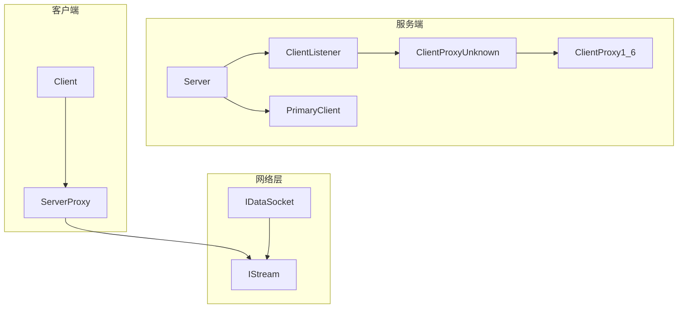
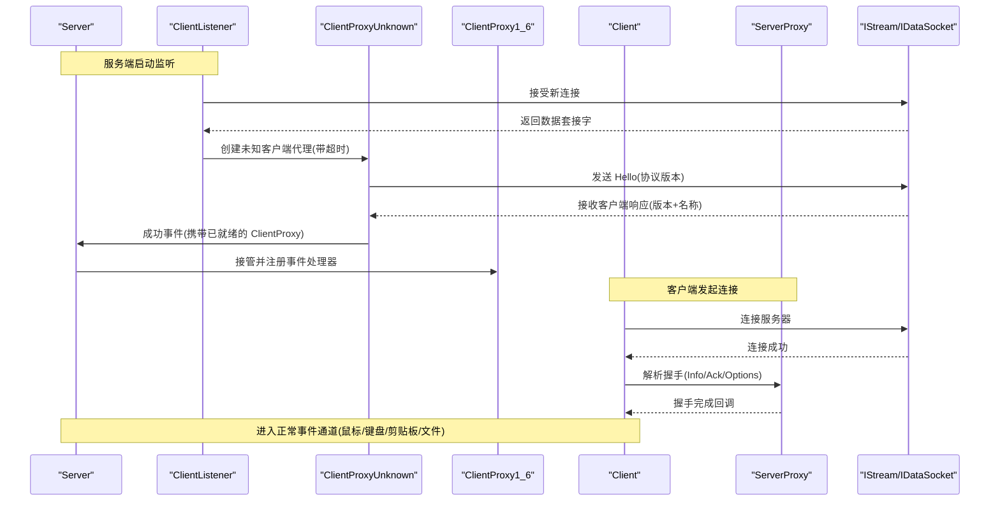
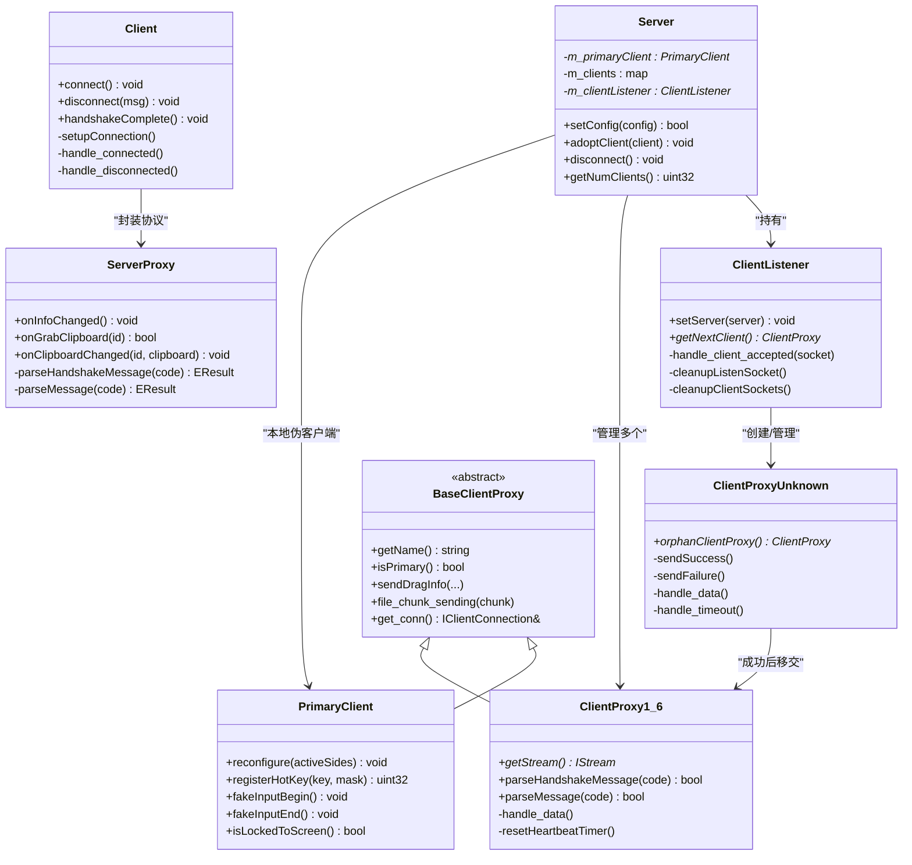
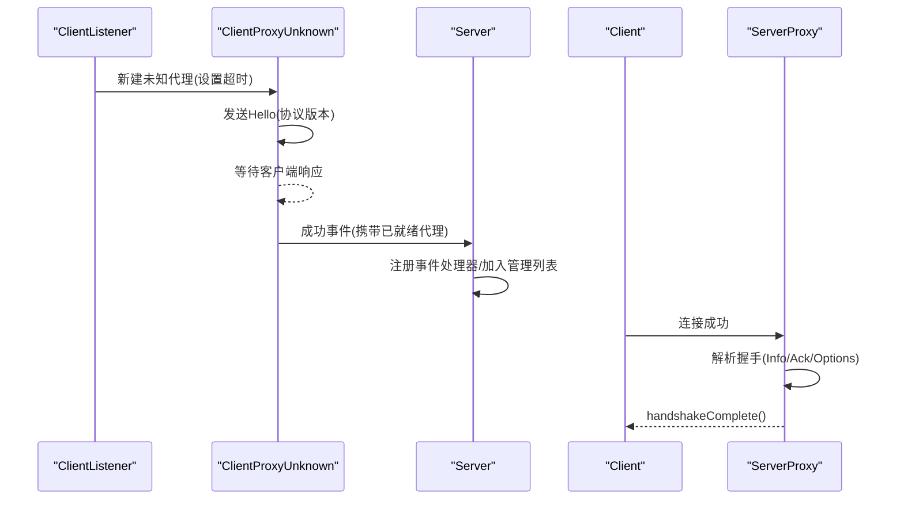
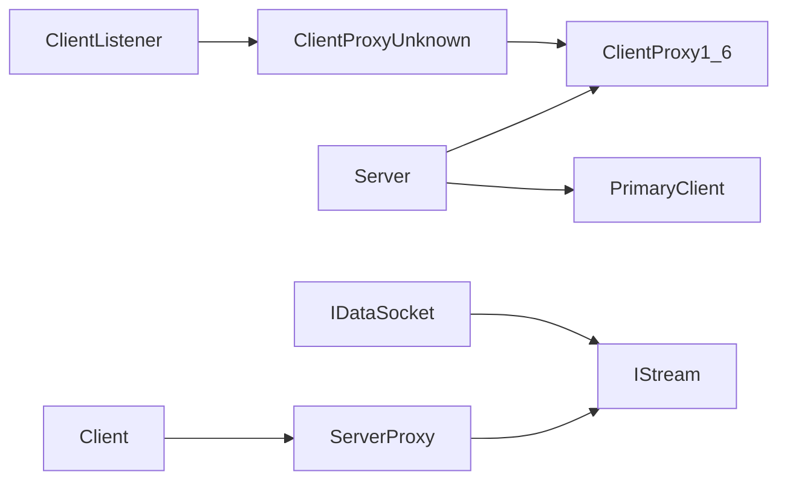

# 组件设计与交互

<cite>
**本文引用的文件**   
- [Server.h](file://src/lib/server/Server.h)
- [Client.h](file://src/lib/client/Client.h)
- [PrimaryClient.h](file://src/lib/server/PrimaryClient.h)
- [ClientListener.h](file://src/lib/server/ClientListener.h)
- [BaseClientProxy.h](file://src/lib/server/BaseClientProxy.h)
- [ClientProxy1_6.h](file://src/lib/server/ClientProxy1_6.h)
- [ClientProxyUnknown.h](file://src/lib/server/ClientProxyUnknown.h)
- [ServerProxy.h](file://src/lib/client/ServerProxy.h)
- [protocol_types.h](file://src/lib/inputleap/protocol_types.h)
- [IDataSocket.h](file://src/lib/net/IDataSocket.h)
- [IStream.h](file://src/lib/io/IStream.h)
</cite>

## 目录
1. [简介](#简介)
2. [项目结构](#项目结构)
3. [核心组件](#核心组件)
4. [架构总览](#架构总览)
5. [详细组件分析](#详细组件分析)
6. [依赖关系分析](#依赖关系分析)
7. [性能与扩展性](#性能与扩展性)
8. [故障排查指南](#故障排查指南)
9. [结论](#结论)

## 简介
本文件聚焦 Input Leap 的组件设计与交互，围绕 Server、Client、PrimaryClient 和 ClientListener 四大核心组件展开，系统阐述其职责划分、协作关系、通信协议、消息传递机制、错误处理策略、连接建立过程、会话管理与资源清理机制。文档包含类图与时序图以直观展示交互流程，并提供扩展点与自定义实现指导原则，帮助读者快速理解并安全扩展系统。

## 项目结构
Input Leap 的核心网络与输入共享逻辑位于 src/lib 下：
- server：服务端主循环、客户端代理、监听器、本地“伪客户端”（PrimaryClient）等
- client：客户端主循环、与服务端通信的代理（ServerProxy）等
- inputleap：公共类型与协议常量定义
- net/io：网络套接字与流抽象接口

图表来源
- [Server.h:49-486](file://src/lib/server/Server.h#L49-L486)
- [ClientListener.h:38-91](file://src/lib/server/ClientListener.h#L38-L91)
- [ClientProxy1_6.h:32-125](file://src/lib/server/ClientProxy1_6.h#L32-L125)
- [ClientProxyUnknown.h:33-78](file://src/lib/server/ClientProxyUnknown.h#L33-L78)
- [PrimaryClient.h:35-159](file://src/lib/server/PrimaryClient.h#L35-L159)
- [Client.h:40-220](file://src/lib/client/Client.h#L40-L220)
- [ServerProxy.h:39-136](file://src/lib/client/ServerProxy.h#L39-L136)
- [IDataSocket.h:40-69](file://src/lib/net/IDataSocket.h#L40-L69)
- [IStream.h:43-82](file://src/lib/io/IStream.h#L43-L82)

章节来源
- [Server.h:49-486](file://src/lib/server/Server.h#L49-L486)
- [Client.h:40-220](file://src/lib/client/Client.h#L40-L220)
- [PrimaryClient.h:35-159](file://src/lib/server/PrimaryClient.h#L35-L159)
- [ClientListener.h:38-91](file://src/lib/server/ClientListener.h#L38-L91)
- [ClientProxy1_6.h:32-125](file://src/lib/server/ClientProxy1_6.h#L32-L125)
- [ClientProxyUnknown.h:33-78](file://src/lib/server/ClientProxyUnknown.h#L33-L78)
- [ServerProxy.h:39-136](file://src/lib/client/ServerProxy.h#L39-L136)
- [IDataSocket.h:40-69](file://src/lib/net/IDataSocket.h#L40-L69)
- [IStream.h:43-82](file://src/lib/io/IStream.h#L43-L82)

## 核心组件
- Server：服务端主控制器，管理所有客户端（含 PrimaryClient），负责事件分发、屏幕切换、剪贴板同步、文件传输、广播键盘等。
- Client：客户端主控制器，负责连接服务器、握手、心跳、事件转发、文件传输等。
- PrimaryClient：将本地屏幕作为“伪客户端”，使本地输入可被统一调度，支持热键注册、跳区配置、假输入屏蔽等。
- ClientListener：服务端监听器，接受新连接、完成未知客户端握手、创建具体版本代理并移交至 Server。

章节来源
- [Server.h:49-486](file://src/lib/server/Server.h#L49-L486)
- [Client.h:40-220](file://src/lib/client/Client.h#L40-L220)
- [PrimaryClient.h:35-159](file://src/lib/server/PrimaryClient.h#L35-L159)
- [ClientListener.h:38-91](file://src/lib/server/ClientListener.h#L38-L91)

## 架构总览
下图展示了服务端与客户端之间的整体交互：服务端通过 ClientListener 接受连接，使用 ClientProxyUnknown 进行初始握手与版本协商，成功后实例化 ClientProxy1_6；客户端通过 ServerProxy 与服务器交换消息，最终由 Server 与 Client 分别驱动事件与状态机。

图表来源
- [ClientListener.h:38-91](file://src/lib/server/ClientListener.h#L38-L91)
- [ClientProxyUnknown.h:33-78](file://src/lib/server/ClientProxyUnknown.h#L33-L78)
- [ClientProxy1_6.h:32-125](file://src/lib/server/ClientProxy1_6.h#L32-L125)
- [Server.h:49-486](file://src/lib/server/Server.h#L49-L486)
- [Client.h:40-220](file://src/lib/client/Client.h#L40-L220)
- [ServerProxy.h:39-136](file://src/lib/client/ServerProxy.h#L39-L136)
- [IDataSocket.h:40-69](file://src/lib/net/IDataSocket.h#L40-L69)
- [IStream.h:43-82](file://src/lib/io/IStream.h#L43-L82)

## 详细组件分析

### 组件关系图（代码级）

图表来源
- [Server.h:49-486](file://src/lib/server/Server.h#L49-L486)
- [ClientListener.h:38-91](file://src/lib/server/ClientListener.h#L38-L91)
- [ClientProxyUnknown.h:33-78](file://src/lib/server/ClientProxyUnknown.h#L33-L78)
- [ClientProxy1_6.h:32-125](file://src/lib/server/ClientProxy1_6.h#L32-L125)
- [PrimaryClient.h:35-159](file://src/lib/server/PrimaryClient.h#L35-L159)
- [Client.h:40-220](file://src/lib/client/Client.h#L40-L220)
- [ServerProxy.h:39-136](file://src/lib/client/ServerProxy.h#L39-L136)
- [BaseClientProxy.h:31-78](file://src/lib/server/BaseClientProxy.h#L31-L78)

章节来源
- [Server.h:49-486](file://src/lib/server/Server.h#L49-L486)
- [ClientListener.h:38-91](file://src/lib/server/ClientListener.h#L38-L91)
- [ClientProxyUnknown.h:33-78](file://src/lib/server/ClientProxyUnknown.h#L33-L78)
- [ClientProxy1_6.h:32-125](file://src/lib/server/ClientProxy1_6.h#L32-L125)
- [PrimaryClient.h:35-159](file://src/lib/server/PrimaryClient.h#L35-L159)
- [Client.h:40-220](file://src/lib/client/Client.h#L40-L220)
- [ServerProxy.h:39-136](file://src/lib/client/ServerProxy.h#L39-L136)
- [BaseClientProxy.h:31-78](file://src/lib/server/BaseClientProxy.h#L31-L78)

### 连接建立与会话管理（时序）
- 服务端侧：
  - ClientListener 接受连接后，构造 ClientProxyUnknown，设置超时计时器，发送 Hello 消息等待客户端响应。
  - 收到客户端版本与名称后，根据兼容性选择具体代理（如 ClientProxy1_6），并在握手完成后触发“就绪”事件，交由 Server 接管。
- 客户端侧：
  - Client 通过 IDataSocket 发起连接，成功后由 ServerProxy 解析握手序列（Info/Ack/Options），完成后回调 Client::handshakeComplete。
- 会话维持：
  - 服务端使用心跳定时器检测对端存活；客户端在收到 KeepAlive 时回显并重置本地闹钟。
  - 双方均维护重连/重试策略（客户端应用层）。

图表来源
- [ClientListener.h:38-91](file://src/lib/server/ClientListener.h#L38-L91)
- [ClientProxyUnknown.h:33-78](file://src/lib/server/ClientProxyUnknown.h#L33-L78)
- [ClientProxy1_6.h:32-125](file://src/lib/server/ClientProxy1_6.h#L32-L125)
- [Server.h:49-486](file://src/lib/server/Server.h#L49-L486)
- [Client.h:40-220](file://src/lib/client/Client.h#L40-L220)
- [ServerProxy.h:39-136](file://src/lib/client/ServerProxy.h#L39-L136)

章节来源
- [ClientListener.h:38-91](file://src/lib/server/ClientListener.h#L38-L91)
- [ClientProxyUnknown.h:33-78](file://src/lib/server/ClientProxyUnknown.h#L33-L78)
- [ClientProxy1_6.h:32-125](file://src/lib/server/ClientProxy1_6.h#L32-L125)
- [Server.h:49-486](file://src/lib/server/Server.h#L49-L486)
- [Client.h:40-220](file://src/lib/client/Client.h#L40-L220)
- [ServerProxy.h:39-136](file://src/lib/client/ServerProxy.h#L39-L136)

### 通信协议与消息传递机制
- 握手阶段：
  - 服务端主动发送 Hello（包含支持的协议主/次版本号）。
  - 客户端回复包含自身版本与名称；服务端据此选择兼容的代理实现。
- 正常运行阶段：
  - 基于固定长度消息码（4字节）+ 参数体，按方向区分消息类别（如 D/C 前缀）。
  - 支持信息同步（Info/Ack）、选项设置（SetOptions/ResetOptions）、KeepAlive、关闭（Close）、错误（Incompatible/Busy/...）等。
- 事件通道：
  - 鼠标/键盘/滚轮/剪贴板/屏幕保护/拖拽信息等事件经 IStream 双向传输，两端各自转换为平台事件或远程调用。

章节来源
- [protocol_types.h:66-121](file://src/lib/inputleap/protocol_types.h#L66-L121)
- [ClientProxy1_6.h:32-125](file://src/lib/server/ClientProxy1_6.h#L32-L125)
- [ServerProxy.h:39-136](file://src/lib/client/ServerProxy.h#L39-L136)

### 错误处理策略
- 握手期：
  - 版本不兼容：服务端返回 Incompatible 错误，客户端断开。
  - 协议错误/行为异常：服务端记录警告并断开。
  - 超时未响应：未知代理触发失败事件。
- 运行期：
  - 无效消息/解析异常：立即断开连接。
  - 写错误/读错误：触发输出错误或断开事件，上层清理资源。
  - 心跳超时：服务端判定对端失联并断开。
- 客户端重连：
  - 应用层根据是否可重启策略，安排定时重试或退出。

章节来源
- [ClientProxyUnknown.h:33-78](file://src/lib/server/ClientProxyUnknown.h#L33-L78)
- [ClientProxy1_6.h:32-125](file://src/lib/server/ClientProxy1_6.h#L32-L125)
- [ServerProxy.h:39-136](file://src/lib/client/ServerProxy.h#L39-L136)
- [Client.h:40-220](file://src/lib/client/Client.h#L40-L220)

### 资源清理与生命周期
- 服务端：
  - 旧连接延迟挂断队列，确保优雅退出。
  - 从内部集合移除客户端、停止相关定时器、释放线程与缓冲区。
- 客户端：
  - 清理流、套接字、定时器、文件传输线程与缓冲。
  - 握手未完成时的安全销毁路径。
- 监听器：
  - 关闭监听套接字、清理待处理与新连接集合。

章节来源
- [Server.h:49-486](file://src/lib/server/Server.h#L49-L486)
- [Client.h:40-220](file://src/lib/client/Client.h#L40-L220)
- [ClientListener.h:38-91](file://src/lib/server/ClientListener.h#L38-L91)

### 扩展点与自定义实现指导
- 新增协议版本：
  - 参考 ClientProxy1_6 的模式，实现新的 ClientProxyX_Y，重写握手与消息解析方法，并在握手阶段按版本路由到对应实现。
- 自定义输入过滤/转发：
  - 在 Server 的事件处理链中插入过滤器（例如键盘广播、相对移动、锁屏等），遵循现有事件命名与参数约定。
- 自定义网络后端：
  - 实现 ISocketFactory/IDataSocket/IStream 接口，替换底层网络栈，保持事件模型不变。
- 自定义监听策略：
  - 扩展 ClientListener 的连接接受与认证流程，可在握手前注入鉴权或白名单校验。

章节来源
- [ClientProxy1_6.h:32-125](file://src/lib/server/ClientProxy1_6.h#L32-L125)
- [Server.h:49-486](file://src/lib/server/Server.h#L49-L486)
- [IDataSocket.h:40-69](file://src/lib/net/IDataSocket.h#L40-L69)
- [IStream.h:43-82](file://src/lib/io/IStream.h#L43-L82)
- [ClientListener.h:38-91](file://src/lib/server/ClientListener.h#L38-L91)

## 依赖关系分析
- 松耦合设计：
  - Server 仅依赖抽象接口（IClient、EventTarget、IStream 等），便于替换实现。
  - 客户端与服务端通过协议常量解耦，版本协商保证向前兼容。
- 关键依赖链：
  - ClientListener -> ClientProxyUnknown -> ClientProxy1_6 -> Server
  - Client -> ServerProxy -> IStream -> IDataSocket
- 潜在风险：
  - 若新增协议字段需同时更新两端解析器与序列化逻辑。
  - 心跳与超时参数需保持一致以避免误判。

图表来源
- [Server.h:49-486](file://src/lib/server/Server.h#L49-L486)
- [ClientListener.h:38-91](file://src/lib/server/ClientListener.h#L38-L91)
- [ClientProxyUnknown.h:33-78](file://src/lib/server/ClientProxyUnknown.h#L33-L78)
- [ClientProxy1_6.h:32-125](file://src/lib/server/ClientProxy1_6.h#L32-L125)
- [Client.h:40-220](file://src/lib/client/Client.h#L40-L220)
- [ServerProxy.h:39-136](file://src/lib/client/ServerProxy.h#L39-L136)
- [IDataSocket.h:40-69](file://src/lib/net/IDataSocket.h#L40-L69)
- [IStream.h:43-82](file://src/lib/io/IStream.h#L43-L82)

章节来源
- [Server.h:49-486](file://src/lib/server/Server.h#L49-L486)
- [ClientListener.h:38-91](file://src/lib/server/ClientListener.h#L38-L91)
- [ClientProxyUnknown.h:33-78](file://src/lib/server/ClientProxyUnknown.h#L33-L78)
- [ClientProxy1_6.h:32-125](file://src/lib/server/ClientProxy1_6.h#L32-L125)
- [Client.h:40-220](file://src/lib/client/Client.h#L40-L220)
- [ServerProxy.h:39-136](file://src/lib/client/ServerProxy.h#L39-L136)
- [IDataSocket.h:40-69](file://src/lib/net/IDataSocket.h#L40-L69)
- [IStream.h:43-82](file://src/lib/io/IStream.h#L43-L82)

## 性能与扩展性
- 事件压缩：
  - 客户端可对鼠标移动进行压缩以减少带宽占用。
- 心跳与保活：
  - 合理设置心跳间隔与告警阈值，平衡实时性与开销。
- 文件传输：
  - 分块传输与后台线程写入，避免阻塞主事件循环。
- 可扩展性：
  - 通过插件式代理与网络抽象，支持多协议版本与不同平台后端。

[本节为通用指导，无需源码引用]

## 故障排查指南
- 连接失败：
  - 检查地址与端口可达性、防火墙与安全组策略。
  - 查看客户端重试策略与日志中的失败原因。
- 握手失败：
  - 确认两端协议版本兼容；关注 Incompatible/Busy 错误。
- 频繁断开：
  - 调整心跳与超时参数；检查网络抖动与丢包。
- 资源泄漏：
  - 确保所有定时器、线程、套接字与缓冲区在异常路径上正确释放。

章节来源
- [Client.h:40-220](file://src/lib/client/Client.h#L40-L220)
- [ServerProxy.h:39-136](file://src/lib/client/ServerProxy.h#L39-L136)
- [ClientProxyUnknown.h:33-78](file://src/lib/server/ClientProxyUnknown.h#L33-L78)
- [ClientProxy1_6.h:32-125](file://src/lib/server/ClientProxy1_6.h#L32-L125)

## 结论
Input Leap 采用清晰的分层与代理模式，Server/Client 通过协议常量与事件模型解耦，ClientListener 与 ClientProxyUnknown 负责连接与握手，ClientProxy1_6 承载运行时协议解析。该设计具备良好的可扩展性与健壮的错误处理机制，适合在多平台环境下稳定运行并持续演进。