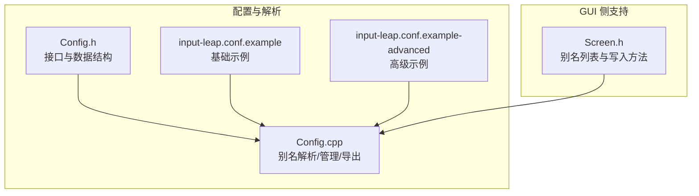
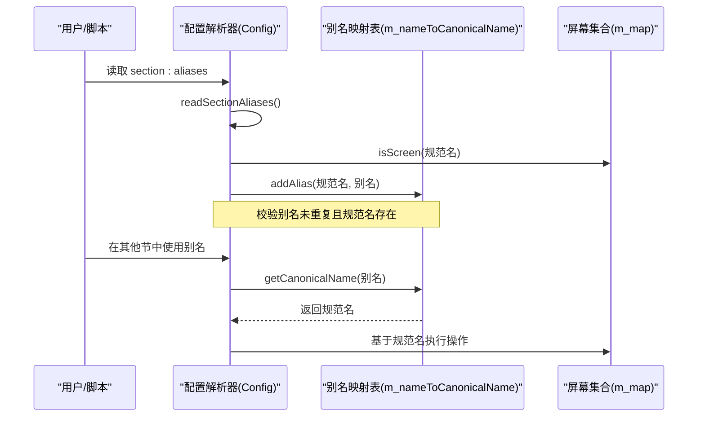
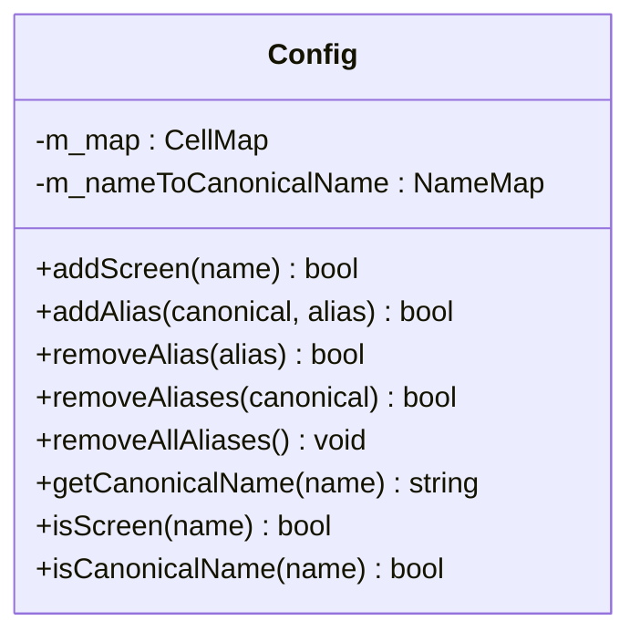
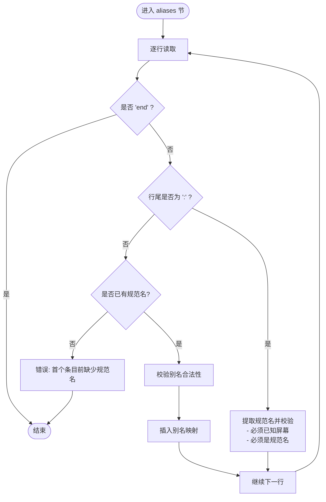
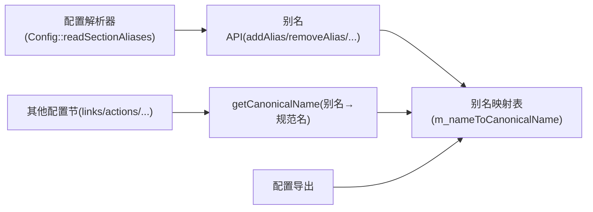

# 别名配置参数

<cite>
**本文引用的文件**   
- [Config.h](file://src/lib/server/Config.h)
- [Config.cpp](file://src/lib/server/Config.cpp)
- [input-leap.conf.example](file://doc/input-leap.conf.example)
- [input-leap.conf.example-advanced](file://doc/input-leap.conf.example-advanced)
- [Screen.h](file://src/gui/src/Screen.h)
</cite>

## 目录
1. [简介](#简介)
2. [项目结构](#项目结构)
3. [核心组件](#核心组件)
4. [架构总览](#架构总览)
5. [详细组件分析](#详细组件分析)
6. [依赖关系分析](#依赖关系分析)
7. [性能与复杂度](#性能与复杂度)
8. [故障排查指南](#故障排查指南)
9. [结论](#结论)
10. [附录：最佳实践与命名规范](#附录最佳实践与命名规范)

## 简介
本文件聚焦于 Input Leap 配置文件中的“别名（aliases）”功能，系统说明如何在 aliases 节中为屏幕定义多个名称引用、解析与使用规则、优先级与冲突处理，以及该功能在整体配置中的作用与优势。文档同时提供高级用法思路与示例路径，帮助读者构建可维护、可扩展的别名体系。

## 项目结构
与别名相关的实现主要位于服务器配置模块与 GUI 模型层，配置文件示例位于 doc 目录。

图示来源
- [Config.h:52-61](file://src/lib/server/Config.h#L52-L61)
- [Config.cpp:966-1006](file://src/lib/server/Config.cpp#L966-L1006)
- [input-leap.conf.example:33-37](file://doc/input-leap.conf.example#L33-L37)
- [input-leap.conf.example-advanced:43-49](file://doc/input-leap.conf.example-advanced#L43-L49)
- [Screen.h:66-67](file://src/gui/src/Screen.h#L66-L67)

章节来源
- [Config.h:52-61](file://src/lib/server/Config.h#L52-L61)
- [Config.cpp:966-1006](file://src/lib/server/Config.cpp#L966-L1006)
- [input-leap.conf.example:33-37](file://doc/input-leap.conf.example#L33-L37)
- [input-leap.conf.example-advanced:43-49](file://doc/input-leap.conf.example-advanced#L43-L49)
- [Screen.h:66-67](file://src/gui/src/Screen.h#L66-L67)

## 核心组件
- 配置类 Config：负责屏幕名与别名的统一命名空间、别名增删改查、别名到规范名的映射、以及别名节的解析与导出。
- 配置文件示例：展示 aliases 节的语法与典型用法。
- GUI 模型 Screen：提供别名集合与写入别名节的方法，便于图形界面生成配置。

章节来源
- [Config.h:52-61](file://src/lib/server/Config.h#L52-L61)
- [Config.h:214-242](file://src/lib/server/Config.h#L214-L242)
- [Config.cpp:140-207](file://src/lib/server/Config.cpp#L140-L207)
- [Config.cpp:966-1006](file://src/lib/server/Config.cpp#L966-L1006)
- [input-leap.conf.example:33-37](file://doc/input-leap.conf.example#L33-L37)
- [input-leap.conf.example-advanced:43-49](file://doc/input-leap.conf.example-advanced#L43-L49)
- [Screen.h:47-81](file://src/gui/src/Screen.h#L47-L81)

## 架构总览
别名机制的核心是“规范名（canonical name）+ 别名（alias）”的双向映射。所有对屏幕名的访问都会先通过别名表解析为规范名，再参与后续逻辑（如链接、动作等）。

图示来源
- [Config.cpp:966-1006](file://src/lib/server/Config.cpp#L966-L1006)
- [Config.cpp:140-156](file://src/lib/server/Config.cpp#L140-L156)
- [Config.cpp:425-435](file://src/lib/server/Config.cpp#L425-L435)

## 详细组件分析

### 别名数据模型与命名空间
- 命名空间：屏幕名与别名共享同一命名空间，必须唯一；大小写保留但比较时忽略大小写。
- 映射结构：内部维护从任意名称（含别名）到规范名的映射表，用于快速解析。
- 关键能力：
  - 添加/删除别名
  - 批量移除某规范名下的全部别名
  - 清空并重建别名映射（将规范名自映射回自身）
  - 获取规范名（别名→规范名）

图示来源
- [Config.h:187-242](file://src/lib/server/Config.h#L187-L242)
- [Config.h:340-351](file://src/lib/server/Config.h#L340-L351)
- [Config.cpp:140-207](file://src/lib/server/Config.cpp#L140-L207)
- [Config.cpp:425-435](file://src/lib/server/Config.cpp#L425-L435)

章节来源
- [Config.h:52-61](file://src/lib/server/Config.h#L52-L61)
- [Config.h:187-242](file://src/lib/server/Config.h#L187-L242)
- [Config.h:340-351](file://src/lib/server/Config.h#L340-L351)
- [Config.cpp:140-207](file://src/lib/server/Config.cpp#L140-L207)
- [Config.cpp:425-435](file://src/lib/server/Config.cpp#L425-L435)

### 别名节解析流程
- 入口：section: aliases
- 规则：
  - 首行必须是“规范名:”，且该名称必须在 screens 节已声明，且不能是别名本身。
  - 其后每行为一个别名，需满足屏幕名合法性检查。
  - 若别名已存在或规范名未知，则报错。
- 输出：当存在非自映射的别名时，导出时会重新生成 aliases 节。

图示来源
- [Config.cpp:966-1006](file://src/lib/server/Config.cpp#L966-L1006)

章节来源
- [Config.cpp:966-1006](file://src/lib/server/Config.cpp#L966-L1006)

### 别名使用位置与优先级
- 使用位置：除 addScreen 外，别名可在任何需要屏幕名的地方使用（例如 links、actions 等）。
- 优先级：别名与规范名共享命名空间，全局唯一；不存在“覆盖优先级”，一旦冲突即拒绝加载。
- 解析顺序：解析 aliases 节时，会先确保当前块头是规范名，再逐个注册别名；其他节引用别名时，会通过 getCanonicalName 解析为规范名后再参与计算。

章节来源
- [Config.h:214-222](file://src/lib/server/Config.h#L214-L222)
- [Config.cpp:425-435](file://src/lib/server/Config.cpp#L425-L435)
- [Config.cpp:966-1006](file://src/lib/server/Config.cpp#L966-L1006)

### 别名导出与一致性
- 当存在别名时，导出配置会生成 aliases 节，按规范名分组列出其别名。
- 导出逻辑仅包含非自映射的别名，避免冗余。

章节来源
- [Config.cpp:1757-1781](file://src/lib/server/Config.cpp#L1757-L1781)

### GUI 侧别名支持
- GUI 的 Screen 对象维护别名列表，并提供写入别名节的方法，便于从界面生成配置。

章节来源
- [Screen.h:47-81](file://src/gui/src/Screen.h#L47-L81)
- [Screen.h:66-67](file://src/gui/src/Screen.h#L66-L67)

## 依赖关系分析
- Config 对外暴露别名 API，并在多处通过 getCanonicalName 进行名称归一化。
- 解析器在 aliases 节中调用 addAlias 完成注册，并在导出时遍历映射表生成别名节。
- GUI 的 Screen 与底层别名概念一致，但主要用于生成/编辑配置。

图示来源
- [Config.cpp:966-1006](file://src/lib/server/Config.cpp#L966-L1006)
- [Config.cpp:140-156](file://src/lib/server/Config.cpp#L140-L156)
- [Config.cpp:425-435](file://src/lib/server/Config.cpp#L425-L435)
- [Config.cpp:1757-1781](file://src/lib/server/Config.cpp#L1757-L1781)

章节来源
- [Config.cpp:966-1006](file://src/lib/server/Config.cpp#L966-L1006)
- [Config.cpp:140-156](file://src/lib/server/Config.cpp#L140-L156)
- [Config.cpp:425-435](file://src/lib/server/Config.cpp#L425-L435)
- [Config.cpp:1757-1781](file://src/lib/server/Config.cpp#L1757-L1781)

## 性能与复杂度
- 查找与插入：别名映射表采用大小写不敏感键的映射容器，平均时间复杂度近似 O(log N)。
- 解析阶段：每个别名一次查找与一次插入，整体线性于别名数量。
- 运行时：别名解析为 O(log N)，对热点路径影响较小。

[本节为通用性能讨论，无需具体文件分析]

## 故障排查指南
常见错误与定位要点：
- “未知屏幕名”：在 aliases 节头部使用了未在 screens 节声明的名称。
- “此处不能使用屏幕名别名”：别名节头部要求必须是规范名，不允许以别名作为块头。
- “无效的屏幕别名”：别名不符合屏幕名合法字符集。
- “别名已被使用”：别名在全局命名空间中与其他别名或规范名冲突。

建议排查步骤：
- 确认 screens 节已正确定义所有规范名。
- 检查 aliases 节头部是否为规范名，且未被用作别名。
- 检查别名是否符合命名规范且不与其他名称冲突。
- 查看导出配置中的 aliases 节是否与预期一致。

章节来源
- [Config.cpp:966-1006](file://src/lib/server/Config.cpp#L966-L1006)

## 结论
别名机制为 Input Leap 提供了灵活而安全的屏幕名抽象层。通过统一的命名空间与严格的冲突检测，别名既简化了跨平台主机名差异带来的配置负担，又保证了配置的一致性与可维护性。配合 GUI 与导出能力，别名成为大型多屏拓扑配置的重要基石。

[本节为总结性内容，无需具体文件分析]

## 附录：最佳实践与命名规范

- 命名规范
  - 使用小写字母、数字、下划线和点号（域名风格），避免特殊字符。
  - 保持语义清晰，如按用途或区域划分（例如 dev-laptop、office-desktop）。
  - 避免与现有规范名或别名冲突。

- 组织方式
  - 将同一物理主机的多种网络名集中到一个规范名下，减少重复。
  - 为不同环境（开发/测试/生产）分别维护别名集合，便于切换。

- 使用建议
  - 在 links 与 actions 中尽量使用别名，提升可读性与迁移便利性。
  - 定期导出配置并审查 aliases 节，清理废弃别名。

- 高级用法思路（动态/条件别名）
  - 动态别名：结合外部脚本或启动参数，根据运行环境（如主机名、域、IP）生成不同的别名映射，再注入到配置中。
  - 条件别名：利用输入过滤的条件与动作（如 connect 条件、switchToScreen 动作）在不同连接状态下选择不同别名策略，实现“同机多名、按需生效”。
  - 注意：这些属于组合式高级用法，需结合输入过滤与运行时状态共同实现。

示例参考路径
- 基础别名示例：[input-leap.conf.example:33-37](file://doc/input-leap.conf.example#L33-L37)
- 高级别名示例（主机全名到逻辑名映射）：[input-leap.conf.example-advanced:43-49](file://doc/input-leap.conf.example-advanced#L43-L49)

章节来源
- [input-leap.conf.example:33-37](file://doc/input-leap.conf.example#L33-L37)
- [input-leap.conf.example-advanced:43-49](file://doc/input-leap.conf.example-advanced#L43-L49)