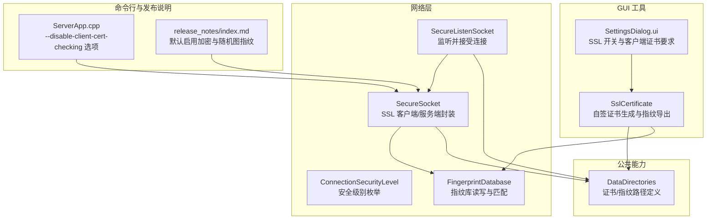
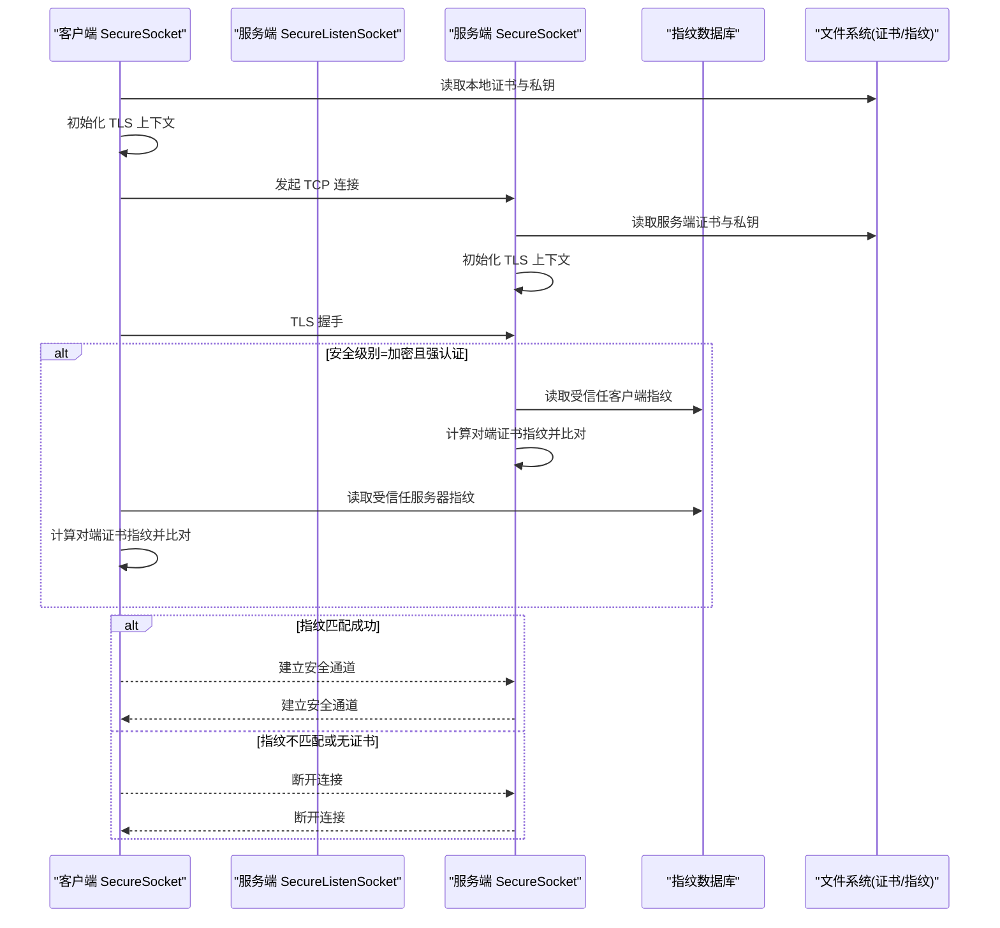
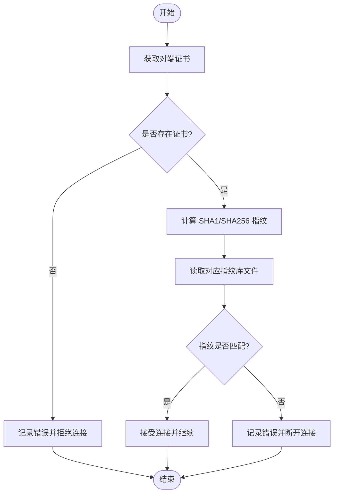
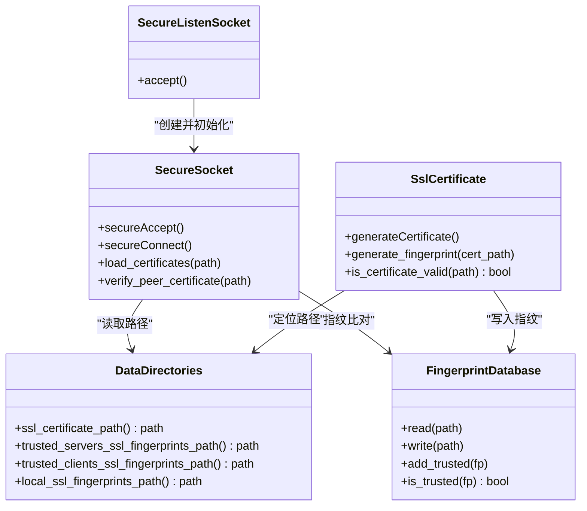

# 安全配置参数

<cite>
**本文引用的文件**   
- [SecureSocket.h](file://src/lib/net/SecureSocket.h)
- [SecureSocket.cpp](file://src/lib/net/SecureSocket.cpp)
- [SecureListenSocket.cpp](file://src/lib/net/SecureListenSocket.cpp)
- [ConnectionSecurityLevel.h](file://src/lib/net/ConnectionSecurityLevel.h)
- [FingerprintDatabase.h](file://src/lib/net/FingerprintDatabase.h)
- [FingerprintDatabase.cpp](file://src/lib/net/FingerprintDatabase.cpp)
- [DataDirectories.h](file://src/lib/common/DataDirectories.h)
- [DataDirectories_static.cpp](file://src/lib/common/DataDirectories_static.cpp)
- [SslCertificate.h](file://src/gui/src/SslCertificate.h)
- [SslCertificate.cpp](file://src/gui/src/SslCertificate.cpp)
- [SettingsDialog.ui](file://src/gui/src/SettingsDialog.ui)
- [ServerApp.cpp](file://src/lib/inputleap/ServerApp.cpp)
- [index.md](file://doc/release_notes/index.md)
</cite>

## 目录
1. [简介](#简介)
2. [项目结构](#项目结构)
3. [核心组件](#核心组件)
4. [架构总览](#架构总览)
5. [详细组件分析](#详细组件分析)
6. [依赖关系分析](#依赖关系分析)
7. [性能与安全权衡](#性能与安全权衡)
8. [故障排查指南](#故障排查指南)
9. [结论](#结论)
10. [附录：企业部署与合规建议](#附录企业部署与合规建议)

## 简介
本文件聚焦 Input Leap 的安全配置参数，围绕 SSL/TLS 加密、证书管理、指纹验证、连接安全级别、认证机制与访问控制等主题进行系统化说明。文档同时提供最佳实践、常见威胁防护策略以及企业环境下的部署示例与合规性要点，帮助读者在保障通信机密性与完整性的前提下，正确启用并运维安全功能。

## 项目结构
与安全相关的代码主要分布在网络层（SSL/TLS 握手、证书加载、指纹校验）、GUI 工具（证书生成与指纹导出）以及数据目录管理（证书与指纹文件路径）。下图概览了关键模块及其交互关系。

图示来源
- [SecureSocket.h:1-114](file://src/lib/net/SecureSocket.h#L1-L114)
- [SecureSocket.cpp:316-533](file://src/lib/net/SecureSocket.cpp#L316-L533)
- [SecureListenSocket.cpp:34-71](file://src/lib/net/SecureListenSocket.cpp#L34-L71)
- [ConnectionSecurityLevel.h:1-24](file://src/lib/net/ConnectionSecurityLevel.h#L1-L24)
- [FingerprintDatabase.h:1-51](file://src/lib/net/FingerprintDatabase.h#L1-L51)
- [FingerprintDatabase.cpp:1-136](file://src/lib/net/FingerprintDatabase.cpp#L1-L136)
- [DataDirectories.h:1-51](file://src/lib/common/DataDirectories.h#L1-L51)
- [DataDirectories_static.cpp:1-56](file://src/lib/common/DataDirectories_static.cpp#L1-L56)
- [SslCertificate.h:1-44](file://src/gui/src/SslCertificate.h#L1-L44)
- [SslCertificate.cpp:1-127](file://src/gui/src/SslCertificate.cpp#L1-L127)
- [SettingsDialog.ui:164-207](file://src/gui/src/SettingsDialog.ui#L164-L207)
- [ServerApp.cpp:128-161](file://src/lib/inputleap/ServerApp.cpp#L128-L161)
- [index.md:202-233](file://doc/release_notes/index.md#L202-L233)

章节来源
- [SecureSocket.h:1-114](file://src/lib/net/SecureSocket.h#L1-L114)
- [SecureSocket.cpp:316-533](file://src/lib/net/SecureSocket.cpp#L316-L533)
- [SecureListenSocket.cpp:34-71](file://src/lib/net/SecureListenSocket.cpp#L34-L71)
- [ConnectionSecurityLevel.h:1-24](file://src/lib/net/ConnectionSecurityLevel.h#L1-L24)
- [FingerprintDatabase.h:1-51](file://src/lib/net/FingerprintDatabase.h#L1-L51)
- [FingerprintDatabase.cpp:1-136](file://src/lib/net/FingerprintDatabase.cpp#L1-L136)
- [DataDirectories.h:1-51](file://src/lib/common/DataDirectories.h#L1-L51)
- [DataDirectories_static.cpp:1-56](file://src/lib/common/DataDirectories_static.cpp#L1-L56)
- [SslCertificate.h:1-44](file://src/gui/src/SslCertificate.h#L1-L44)
- [SslCertificate.cpp:1-127](file://src/gui/src/SslCertificate.cpp#L1-L127)
- [SettingsDialog.ui:164-207](file://src/gui/src/SettingsDialog.ui#L164-L207)
- [ServerApp.cpp:128-161](file://src/lib/inputleap/ServerApp.cpp#L128-L161)
- [index.md:202-233](file://doc/release_notes/index.md#L202-L233)

## 核心组件
- 连接安全级别
  - 支持明文、仅加密、加密且强认证三种模式，用于控制是否强制对端证书指纹校验。
- 安全套接字
  - 负责 TLS 上下文初始化、证书加载、握手、重试与错误处理；在“加密且强认证”模式下执行对端证书指纹比对。
- 指纹数据库
  - 以 v2 格式存储算法与指纹数据，支持读取、写入、去重与信任判断。
- 数据目录
  - 集中定义证书与指纹文件的默认路径，包括本地指纹、受信任服务器指纹、受信任客户端指纹及证书文件。
- GUI 证书工具
  - 自动生成自签名证书与对应指纹，并对证书有效性进行基本检查（如公钥类型与长度）。
- 设置界面
  - 提供“启用 SSL”和“要求客户端证书”的可视化开关，影响运行时的安全行为。
- 命令行选项
  - 提供禁用客户端证书检查的兼容选项（已标记为弃用），以及默认启用加密的变更说明。

章节来源
- [ConnectionSecurityLevel.h:1-24](file://src/lib/net/ConnectionSecurityLevel.h#L1-L24)
- [SecureSocket.h:1-114](file://src/lib/net/SecureSocket.h#L1-L114)
- [SecureSocket.cpp:316-533](file://src/lib/net/SecureSocket.cpp#L316-L533)
- [FingerprintDatabase.h:1-51](file://src/lib/net/FingerprintDatabase.h#L1-L51)
- [FingerprintDatabase.cpp:1-136](file://src/lib/net/FingerprintDatabase.cpp#L1-L136)
- [DataDirectories.h:1-51](file://src/lib/common/DataDirectories.h#L1-L51)
- [DataDirectories_static.cpp:1-56](file://src/lib/common/DataDirectories_static.cpp#L1-L56)
- [SslCertificate.h:1-44](file://src/gui/src/SslCertificate.h#L1-L44)
- [SslCertificate.cpp:1-127](file://src/gui/src/SslCertificate.cpp#L1-L127)
- [SettingsDialog.ui:164-207](file://src/gui/src/SettingsDialog.ui#L164-L207)
- [ServerApp.cpp:128-161](file://src/lib/inputleap/ServerApp.cpp#L128-L161)
- [index.md:202-233](file://doc/release_notes/index.md#L202-L233)

## 架构总览
下图展示了客户端与服务端在启用 SSL 与指纹校验时的典型交互流程，包括证书加载、TLS 握手、指纹比对与结果处理。

图示来源
- [SecureSocket.cpp:316-533](file://src/lib/net/SecureSocket.cpp#L316-L533)
- [SecureListenSocket.cpp:34-71](file://src/lib/net/SecureListenSocket.cpp#L34-L71)
- [FingerprintDatabase.cpp:1-136](file://src/lib/net/FingerprintDatabase.cpp#L1-L136)
- [DataDirectories_static.cpp:1-56](file://src/lib/common/DataDirectories_static.cpp#L1-L56)

## 详细组件分析

### 连接安全级别与行为
- 安全级别枚举
  - 明文：不进行加密与认证。
  - 仅加密：启用 TLS，但不强制对端证书指纹校验。
  - 加密且强认证：启用 TLS，并在握手后强制校验对端证书指纹。
- 行为差异
  - 当选择“加密且强认证”时，服务端会读取“受信任客户端指纹”，客户端会读取“受信任服务器指纹”，并进行 SHA1/SHA256 指纹比对。

章节来源
- [ConnectionSecurityLevel.h:1-24](file://src/lib/net/ConnectionSecurityLevel.h#L1-L24)
- [SecureSocket.cpp:448-468](file://src/lib/net/SecureSocket.cpp#L448-L468)
- [SecureSocket.cpp:522-533](file://src/lib/net/SecureSocket.cpp#L522-L533)

### 证书加载与 TLS 初始化
- 证书与私钥加载
  - 从 PEM 文件加载证书与私钥，并进行私钥一致性校验。
- TLS 上下文创建
  - 初始化 OpenSSL 库、创建 SSL 上下文与实例，绑定底层 socket。
- 错误处理
  - 对加载失败、握手失败等情况记录日志并返回相应状态，必要时触发重试或断开。

章节来源
- [SecureSocket.cpp:319-354](file://src/lib/net/SecureSocket.cpp#L319-L354)
- [SecureSocket.cpp:361-419](file://src/lib/net/SecureSocket.cpp#L361-L419)
- [SecureSocket.cpp:421-481](file://src/lib/net/SecureSocket.cpp#L421-L481)
- [SecureSocket.cpp:483-533](file://src/lib/net/SecureSocket.cpp#L483-L533)

### 指纹验证流程
- 对端证书获取
  - 从 TLS 会话中提取对端证书信息并记录主题信息。
- 指纹计算
  - 分别计算 SHA1 与 SHA256 指纹，输出到日志以便人工核对。
- 信任库比对
  - 根据角色（客户端/服务端）读取对应的指纹库文件，若存在条目则进行匹配；若不匹配则断开连接。
- 指纹库格式
  - 支持 v2 格式（包含算法与十六进制数据），也兼容旧版 v1 行格式。

图示来源
- [SecureSocket.cpp:656-697](file://src/lib/net/SecureSocket.cpp#L656-L697)
- [FingerprintDatabase.cpp:26-70](file://src/lib/net/FingerprintDatabase.cpp#L26-L70)
- [FingerprintDatabase.cpp:91-133](file://src/lib/net/FingerprintDatabase.cpp#L91-L133)

章节来源
- [SecureSocket.cpp:656-697](file://src/lib/net/SecureSocket.cpp#L656-L697)
- [FingerprintDatabase.cpp:1-136](file://src/lib/net/FingerprintDatabase.cpp#L1-L136)

### 证书管理与指纹生成（GUI）
- 自签名证书生成
  - 若不存在或无效，自动创建目录并生成 PEM 格式的自签名证书。
- 指纹导出
  - 基于当前证书生成 SHA1/SHA256 指纹，写入本地指纹库文件。
- 证书有效性检查
  - 检查证书可读、可解析、包含有效公钥、公钥类型为 RSA/DSA、密钥长度不小于 2048 位。

章节来源
- [SslCertificate.cpp:39-84](file://src/gui/src/SslCertificate.cpp#L39-L84)
- [SslCertificate.cpp:86-126](file://src/gui/src/SslCertificate.cpp#L86-L126)

### 数据目录与默认路径
- 证书文件
  - 默认位于用户配置目录下的 SSL 子目录中，文件名为固定名称。
- 指纹文件
  - 本地指纹、受信任服务器指纹、受信任客户端指纹均位于同一指纹目录内，文件名固定。
- 迁移与兼容
  - 启动时会尝试将旧版本中的 SSL 目录复制到新位置，确保平滑升级。

章节来源
- [DataDirectories.h:36-44](file://src/lib/common/DataDirectories.h#L36-L44)
- [DataDirectories_static.cpp:26-56](file://src/lib/common/DataDirectories_static.cpp#L26-L56)
- [DataDirectoriesCommon.cpp:32-62](file://src/lib/common/DataDirectoriesCommon.cpp#L32-L62)

### 设置界面与命令行开关
- GUI 开关
  - “启用 SSL”：开启加密通道。
  - “要求客户端证书”：在服务端侧强化认证，结合指纹库实现强认证。
- 命令行选项
  - 提供“禁用客户端证书检查”的兼容选项（已弃用），便于历史场景过渡。
- 默认行为变更
  - 新版本默认启用加密，并提供显式禁用选项；同时支持随机图指纹显示，便于人工比对。

章节来源
- [SettingsDialog.ui:164-207](file://src/gui/src/SettingsDialog.ui#L164-L207)
- [ServerApp.cpp:128-161](file://src/lib/inputleap/ServerApp.cpp#L128-L161)
- [index.md:202-233](file://doc/release_notes/index.md#L202-L233)

## 依赖关系分析
- 组件耦合
  - SecureSocket 依赖 DataDirectories 获取证书与指纹路径，依赖 FingerprintDatabase 完成指纹比对。
  - SecureListenSocket 在 accept 流程中调用 SecureSocket 的证书加载与握手逻辑。
  - GUI 的 SslCertificate 通过 DataDirectories 定位路径，并通过 FingerprintDatabase 写入指纹。
- 外部依赖
  - 使用 OpenSSL 进行证书解析、指纹计算与 TLS 握手。
- 潜在循环依赖
  - 当前设计未见明显循环依赖；各模块职责清晰，依赖方向单一。

图示来源
- [SecureSocket.h:1-114](file://src/lib/net/SecureSocket.h#L1-L114)
- [SecureListenSocket.cpp:34-71](file://src/lib/net/SecureListenSocket.cpp#L34-L71)
- [FingerprintDatabase.h:1-51](file://src/lib/net/FingerprintDatabase.h#L1-L51)
- [DataDirectories.h:1-51](file://src/lib/common/DataDirectories.h#L1-L51)
- [SslCertificate.h:1-44](file://src/gui/src/SslCertificate.h#L1-L44)

章节来源
- [SecureSocket.h:1-114](file://src/lib/net/SecureSocket.h#L1-L114)
- [SecureListenSocket.cpp:34-71](file://src/lib/net/SecureListenSocket.cpp#L34-L71)
- [FingerprintDatabase.h:1-51](file://src/lib/net/FingerprintDatabase.h#L1-L51)
- [DataDirectories.h:1-51](file://src/lib/common/DataDirectories.h#L1-L51)
- [SslCertificate.h:1-44](file://src/gui/src/SslCertificate.h#L1-L44)

## 性能与安全权衡
- 指纹比对开销
  - 每次握手后进行指纹计算与列表查找，开销较小；指纹库规模较小时几乎可忽略。
- 证书加载成本
  - 仅在握手阶段加载证书与私钥，避免重复 IO；合理缓存可降低延迟。
- 重试与退避
  - 握手失败时采用重试与短暂休眠，避免雪崩效应，提升稳定性。
- 加密强度
  - 建议使用现代密码套件与足够长度的密钥（≥2048 位），以提升安全性与兼容性。

[本节为通用指导，无需源码引用]

## 故障排查指南
- 常见问题
  - 证书未指定或路径不存在：检查配置文件或 GUI 设置是否正确指向证书文件。
  - 私钥不匹配或不可用：确认 PEM 文件中证书与私钥一致，权限正确。
  - 指纹不匹配：核对受信任指纹库文件内容，确保与对端证书指纹一致。
  - 握手失败或频繁重试：检查网络连通性、防火墙规则与系统时间同步。
- 诊断线索
  - 查看日志中的“peer fingerprint (SHA1/SHA256)”与“fingerprint_db_path”提示，快速定位问题。
  - 使用 GUI 的“生成指纹”功能重新导出指纹，确保与对端一致。

章节来源
- [SecureSocket.cpp:319-354](file://src/lib/net/SecureSocket.cpp#L319-L354)
- [SecureSocket.cpp:656-697](file://src/lib/net/SecureSocket.cpp#L656-L697)
- [SslCertificate.cpp:39-84](file://src/gui/src/SslCertificate.cpp#L39-L84)

## 结论
Input Leap 的安全体系围绕“可选加密 + 可选强认证”展开，通过灵活的连接安全级别与指纹库机制，兼顾易用性与安全性。在企业环境中，推荐启用“加密且强认证”，配合严格的证书与指纹管理流程，以满足更高的合规与审计要求。

[本节为总结性内容，无需源码引用]

## 附录：企业部署与合规建议
- 证书管理
  - 使用内部 CA 签发证书，定期轮换与吊销；确保证书链完整、有效期可控。
  - 将证书与私钥存放于受限目录，限制进程与用户访问权限。
- 指纹库治理
  - 维护受信任服务器与客户端指纹清单，纳入配置管理与变更审批流程。
  - 使用 v2 格式，避免遗留 v1 格式带来的兼容风险。
- 访问控制
  - 结合“要求客户端证书”与指纹校验，实现双向强认证；在网络层实施最小权限原则。
- 合规性
  - 遵循组织安全基线，启用强密码套件与足够密钥长度；保留握手与指纹比对日志以供审计。
  - 参考发布说明中的安全修复与默认行为变更，确保生产环境符合最新安全标准。

章节来源
- [DataDirectories_static.cpp:26-56](file://src/lib/common/DataDirectories_static.cpp#L26-L56)
- [FingerprintDatabase.cpp:91-133](file://src/lib/net/FingerprintDatabase.cpp#L91-L133)
- [index.md:202-233](file://doc/release_notes/index.md#L202-L233)