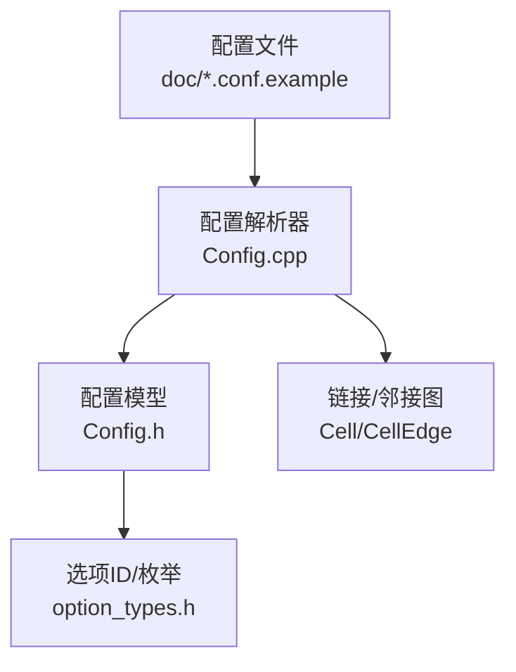
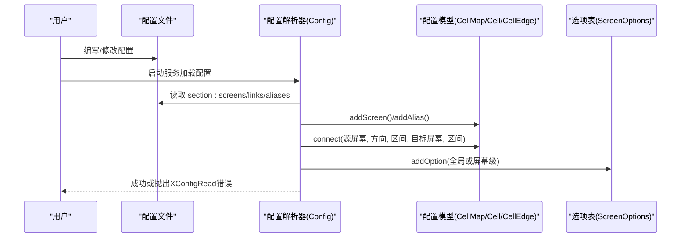
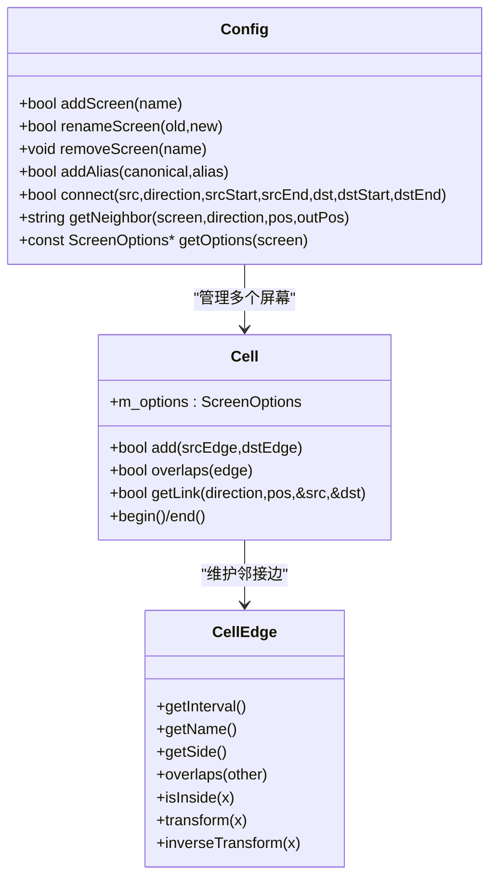
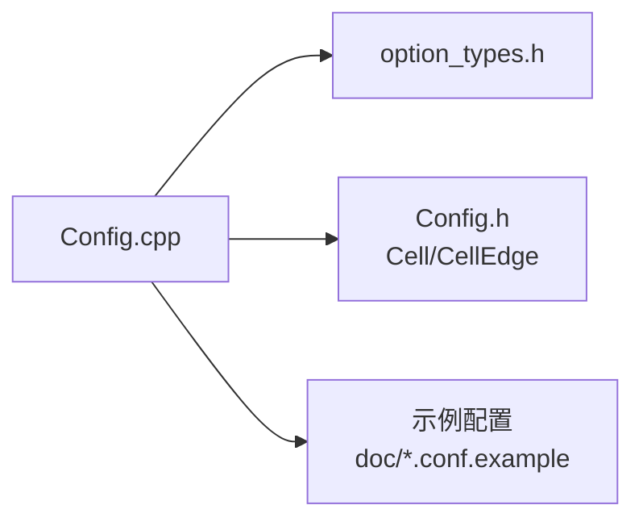

# 屏幕配置参数

<cite>
**本文引用的文件**   
- [Config.h](file://src/lib/server/Config.h)
- [Config.cpp](file://src/lib/server/Config.cpp)
- [option_types.h](file://src/lib/inputleap/option_types.h)
- [input-leap.conf.example](file://doc/input-leap.conf.example)
- [input-leap.conf.example-basic](file://doc/input-leap.conf.example-basic)
- [input-leap.conf.example-advanced](file://doc/input-leap.conf.example-advanced)
</cite>

## 目录
1. [简介](#简介)
2. [项目结构](#项目结构)
3. [核心组件](#核心组件)
4. [架构总览](#架构总览)
5. [详细组件分析](#详细组件分析)
6. [依赖关系分析](#依赖关系分析)
7. [性能与行为特性](#性能与行为特性)
8. [故障排查指南](#故障排查指南)
9. [结论](#结论)
10. [附录：语法与示例](#附录语法与示例)

## 简介
本文件聚焦于 Input Leap 的“屏幕配置”能力，系统梳理 screens 节及其相关 links、aliases 节的参数含义、类型与用法，解释屏幕名称定义、屏幕属性设置、屏幕间相对位置（right/left/up/down）与区间连接等。文档同时提供语法格式、最佳实践、多屏布局示例与常见问题解决方案，帮助读者快速搭建稳定可靠的多机共享输入环境。

## 项目结构
与屏幕配置直接相关的实现与示例主要位于以下位置：
- 配置解析与数据结构：src/lib/server/Config.{h,cpp}
- 选项标识与枚举：src/lib/inputleap/option_types.h
- 配置示例：doc/input-leap.conf.example*

图表来源
- [Config.cpp:680-780](file://src/lib/server/Config.cpp#L680-L780)
- [Config.cpp:782-891](file://src/lib/server/Config.cpp#L782-L891)
- [Config.cpp:893-964](file://src/lib/server/Config.cpp#L893-L964)
- [Config.h:62-146](file://src/lib/server/Config.h#L62-L146)
- [option_types.h:46-101](file://src/lib/inputleap/option_types.h#L46-L101)

章节来源
- [Config.h:62-146](file://src/lib/server/Config.h#L62-L146)
- [Config.cpp:680-780](file://src/lib/server/Config.cpp#L680-L780)
- [Config.cpp:782-891](file://src/lib/server/Config.cpp#L782-L891)
- [Config.cpp:893-964](file://src/lib/server/Config.cpp#L893-L964)
- [option_types.h:46-101](file://src/lib/inputleap/option_types.h#L46-L101)

## 核心组件
- 配置读取上下文与解析器：负责逐行解析 section、键值对、区间参数、方向词等，并抛出可读的错误信息。
- 配置模型：维护屏幕集合、别名映射、邻接边（Cell/CellEdge）、全局与屏幕级选项。
- 选项体系：以 OptionID 标识各项开关与数值型参数，支持布尔、整数、修饰键、角落组合等。

章节来源
- [Config.h:472-513](file://src/lib/server/Config.h#L472-L513)
- [Config.h:62-146](file://src/lib/server/Config.h#L62-L146)
- [option_types.h:46-101](file://src/lib/inputleap/option_types.h#L46-L101)

## 架构总览
下图展示了从配置文件到内存模型的解析流程，以及关键的数据结构关系。

图表来源
- [Config.cpp:782-891](file://src/lib/server/Config.cpp#L782-L891)
- [Config.cpp:893-964](file://src/lib/server/Config.cpp#L893-L964)
- [Config.cpp:680-780](file://src/lib/server/Config.cpp#L680-L780)
- [Config.h:115-146](file://src/lib/server/Config.h#L115-L146)

## 详细组件分析

### 1) screens 节：屏幕名称与屏幕级属性
- 作用：声明逻辑屏幕名，并为每个屏幕设置可选属性。
- 基本语法：
  - 每行一个屏幕名并以冒号结尾，如 screenName:
  - 在屏幕名下缩进书写 key=value 形式的属性
- 支持的屏幕级属性（key → 类型/说明）：
  - halfDuplexCapsLock: 布尔
  - halfDuplexNumLock: 布尔
  - halfDuplexScrollLock: 布尔
  - shift/ctrl/alt/altgr/meta/super: 修饰键映射（字符串，具体映射规则由解析器处理）
  - xtestIsXineramaUnaware: 布尔
  - switchCorners: 角落组合（字符串，见下方“角落掩码”）
  - switchCornerSize: 整数（像素）
  - preserveFocus: 布尔
- 语义要点：
  - 屏幕名大小写保留但比较时忽略大小写；同一命名空间内需唯一。
  - 未知属性将导致解析错误。

章节来源
- [Config.cpp:782-891](file://src/lib/server/Config.cpp#L782-L891)
- [Config.h:58-61](file://src/lib/server/Config.h#L58-L61)

### 2) links 节：屏幕间的相对位置与区间连接
- 作用：定义屏幕之间的相邻关系与可穿越的边界区间。
- 基本语法：
  - 以屏幕名加冒号开始，随后为若干条边定义
  - 每条边的形式：direction[(s0,e0)] = target[(s1,e1)]
  - direction 取值：left/right/up/down
  - (s0,e0)、(s1,e1) 为可选区间，取值范围 0~100，且 s < e；省略时默认为整个边
- 语义要点：
  - 左侧/右侧/上方/下方分别对应 kLeft/kRight/kTop/kBottom
  - 若区间重叠会报错
  - 仅允许使用规范名（canonical name），不允许在此处使用别名

章节来源
- [Config.cpp:893-964](file://src/lib/server/Config.cpp#L893-L964)

### 3) aliases 节：屏幕别名
- 作用：将主机真实名称映射到逻辑屏幕名，便于在 screens/links 中使用易读名。
- 基本语法：
  - 以规范屏幕名加冒号开始，随后列出其别名（每行一个）
- 语义要点：
  - 别名不可重复；别名不能用于 links 节的源屏幕名

章节来源
- [Config.cpp:966-1006](file://src/lib/server/Config.cpp#L966-L1006)

### 4) 选项体系与屏幕切换行为
- 选项标识：通过 OptionID 表示，包含屏幕切换相关项与剪贴板、前台保持等。
- 屏幕切换相关选项（部分）：
  - switchCorners: 启用哪些角落触发切换（左上/右上/左下/右下）
  - switchCornerSize: 角落区域尺寸（像素）
  - switchDelay: 切换延迟（毫秒）
  - switchDoubleTap: 双击阈值（毫秒）
  - switchNeedsShift/switchNeedsControl/switchNeedsAlt: 是否需要配合修饰键
  - screenSaverSync: 与屏保同步
  - preserveFocus: 进入目标屏幕后是否保持焦点
- 角落掩码：
  - 支持左上、右上、左下、右下四个角，可用组合方式指定

章节来源
- [option_types.h:46-101](file://src/lib/inputleap/option_types.h#L46-L101)
- [Config.cpp:680-780](file://src/lib/server/Config.cpp#L680-L780)

### 5) 数据模型与邻接图
- Cell：代表一个屏幕节点，内部维护与其相邻屏幕的边集合（EdgeLinks）。
- CellEdge：描述一条边，包括方向、区间、目标屏幕名，并提供区间变换与重叠判断等方法。
- 邻接查询：
  - getNeighbor(屏幕, 方向, 位置)：返回在该方向、该位置处的邻居屏幕及对应位置
  - hasNeighbor/hasNeighbor(start,end)：判断是否存在邻居或某段区间存在邻居

图表来源
- [Config.h:62-146](file://src/lib/server/Config.h#L62-L146)
- [Config.h:115-146](file://src/lib/server/Config.h#L115-L146)

章节来源
- [Config.h:62-146](file://src/lib/server/Config.h#L62-L146)

## 依赖关系分析
- 配置解析依赖：
  - Config.cpp 依赖 option_types.h 中的选项 ID 与枚举
  - Config.cpp 构建 Cell/CellEdge 邻接图，并在 links 节中调用 connect()
- 外部交互点：
  - 网络监听地址（address）与心跳（heartbeat）属于全局选项，非屏幕级，但与运行模式相关
  - 剪贴板共享、前台保持等选项影响运行时行为

图表来源
- [Config.cpp:680-780](file://src/lib/server/Config.cpp#L680-L780)
- [Config.cpp:782-891](file://src/lib/server/Config.cpp#L782-L891)
- [Config.cpp:893-964](file://src/lib/server/Config.cpp#L893-L964)
- [option_types.h:46-101](file://src/lib/inputleap/option_types.h#L46-L101)

章节来源
- [Config.cpp:680-780](file://src/lib/server/Config.cpp#L680-L780)
- [Config.cpp:782-891](file://src/lib/server/Config.cpp#L782-L891)
- [Config.cpp:893-964](file://src/lib/server/Config.cpp#L893-L964)
- [option_types.h:46-101](file://src/lib/inputleap/option_types.h#L46-L101)

## 性能与行为特性
- 邻接查询复杂度：基于有序边集合的查找，通常接近对数时间；区间重叠检测在添加边时进行。
- 切换体验优化：
  - 合理设置 switchCornerSize 与 switchDelay，避免误触或迟钝
  - 使用 switchNeedsShift/Control/Alt 降低意外切换概率
  - preserveFocus 可在需要时保持应用焦点，减少干扰
- 剪贴板共享：
  - clipboardSharing 与 clipboardSharingSize 控制共享开关与最大条目大小，避免过大内容影响性能

[本节为通用指导，不直接分析具体文件]

## 故障排查指南
- 常见解析错误与定位：
  - “unknown argument ...”：检查 screens 节下的属性拼写是否正确
  - “unknown side ... in link”：确认 left/right/up/down 拼写正确
  - “unknown screen name ...”：确保所有屏幕已在 screens 节声明
  - “cannot use screen name alias here”：links 节必须使用规范名，别名需在 aliases 节映射
  - “overlapping range”：检查同侧区间是否重叠，调整 (s0,e0)/(s1,e1)
  - “unexpected end of ... section”：确认 section 以 end 结束
- 建议步骤：
  - 先最小化配置，逐步增加屏幕与链接，定位问题
  - 使用示例配置作为模板，对照差异逐项核对
  - 关注日志输出的行号与错误消息，快速定位

章节来源
- [Config.cpp:782-891](file://src/lib/server/Config.cpp#L782-L891)
- [Config.cpp:893-964](file://src/lib/server/Config.cpp#L893-L964)
- [Config.cpp:966-1006](file://src/lib/server/Config.cpp#L966-L1006)

## 结论
通过 screens/links/aliases 三节协同，Input Leap 提供了灵活而强大的多屏布局能力。理解屏幕名与别名、方向与区间、以及屏幕级选项的含义与约束，是构建稳定高效共享输入环境的关键。建议遵循本文提供的语法与最佳实践，结合示例配置逐步完善你的布局。

[本节为总结性内容，不直接分析具体文件]

## 附录：语法与示例

### 语法速查
- screens 节
  - 屏幕名：screenName:
  - 属性：key=value（详见“screens 节”小节）
- links 节
  - 边定义：direction[(s0,e0)] = target[(s1,e1)]
  - direction ∈ {left,right,up,down}
  - 区间(s,e)∈[0,100]，且 s<e；省略则默认全边
- aliases 节
  - canonicalName:
    - alias1
    - alias2

章节来源
- [Config.cpp:782-891](file://src/lib/server/Config.cpp#L782-L891)
- [Config.cpp:893-964](file://src/lib/server/Config.cpp#L893-L964)
- [Config.cpp:966-1006](file://src/lib/server/Config.cpp#L966-L1006)

### 多屏布局示例（参考路径）
- 基础三屏水平排列：
  - 参考：[input-leap.conf.example-basic](file://doc/input-leap.conf.example-basic)
- 带区间的高级布局（顶部/右侧拼接）：
  - 参考：[input-leap.conf.example-advanced](file://doc/input-leap.conf.example-advanced)
- 最简示例（仅声明屏幕与邻接）：
  - 参考：[input-leap.conf.example](file://doc/input-leap.conf.example)

章节来源
- [input-leap.conf.example-basic:1-40](file://doc/input-leap.conf.example-basic#L1-L40)
- [input-leap.conf.example-advanced:1-50](file://doc/input-leap.conf.example-advanced#L1-L50)
- [input-leap.conf.example:1-38](file://doc/input-leap.conf.example#L1-L38)

### 最佳实践
- 命名与别名
  - 使用简洁、稳定的逻辑屏幕名；将复杂主机名放入 aliases 节
- 邻接设计
  - 尽量对称配置左右/上下关系，避免歧义
  - 使用区间限定穿越范围，防止误入
- 切换体验
  - 根据显示器尺寸调整 switchCornerSize
  - 开启必要的修饰键要求，降低误触
  - 谨慎使用 preserveFocus，按场景取舍
- 排错策略
  - 分步验证：先 screens，再 links，最后选项
  - 利用示例配置对比差异，逐项排除

[本节为通用指导，不直接分析具体文件]