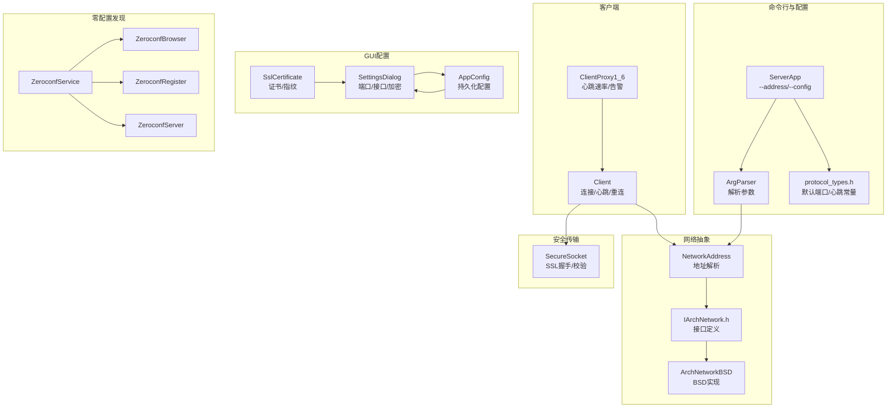
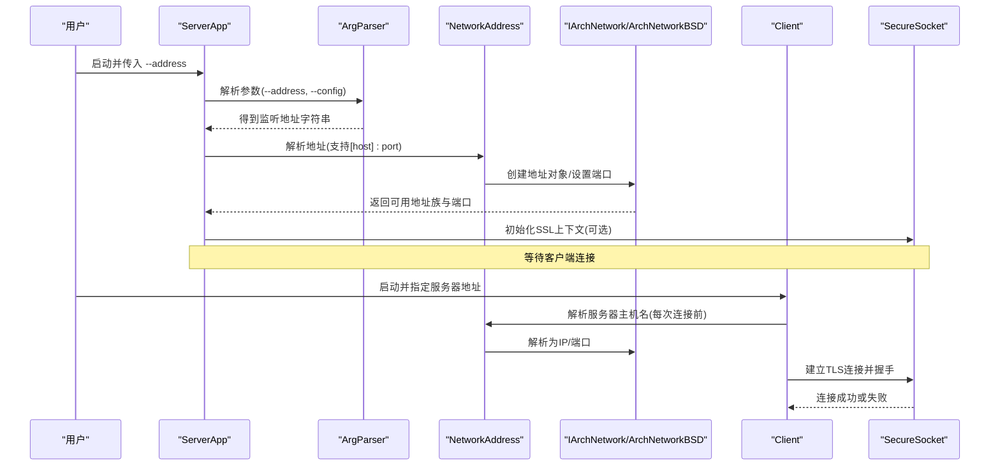
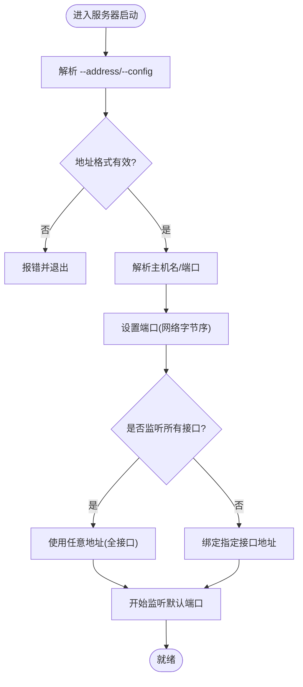
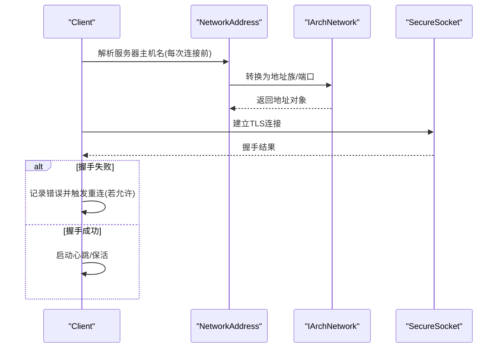
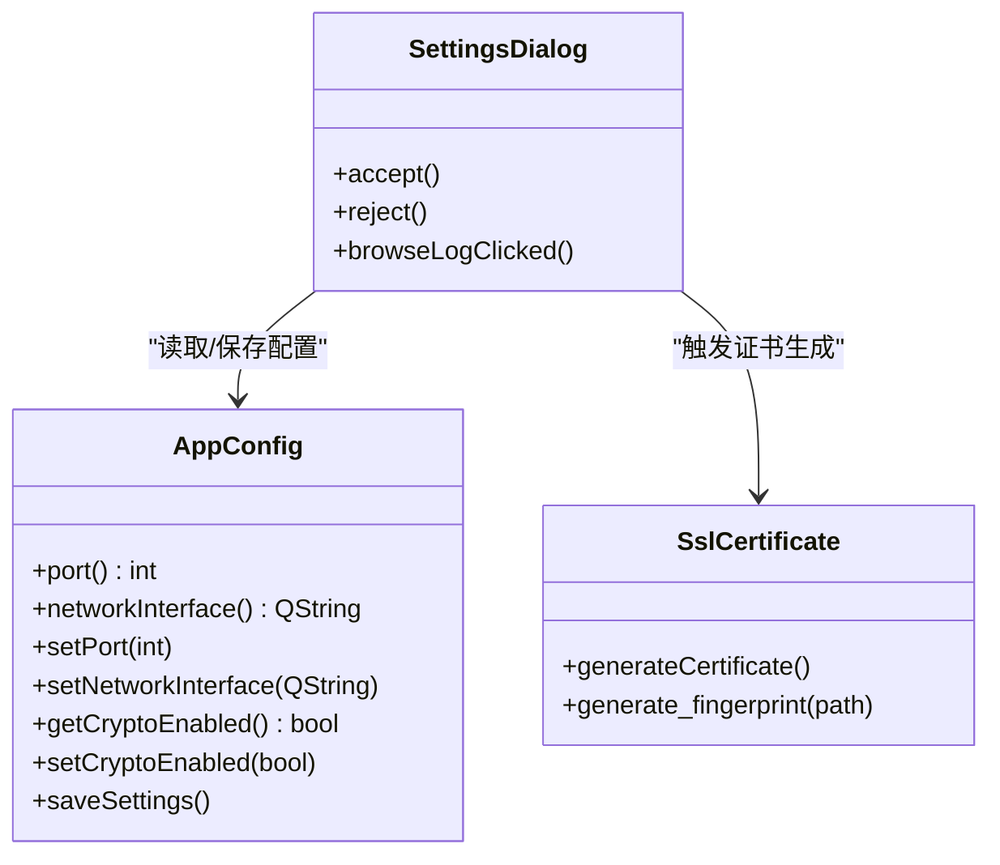
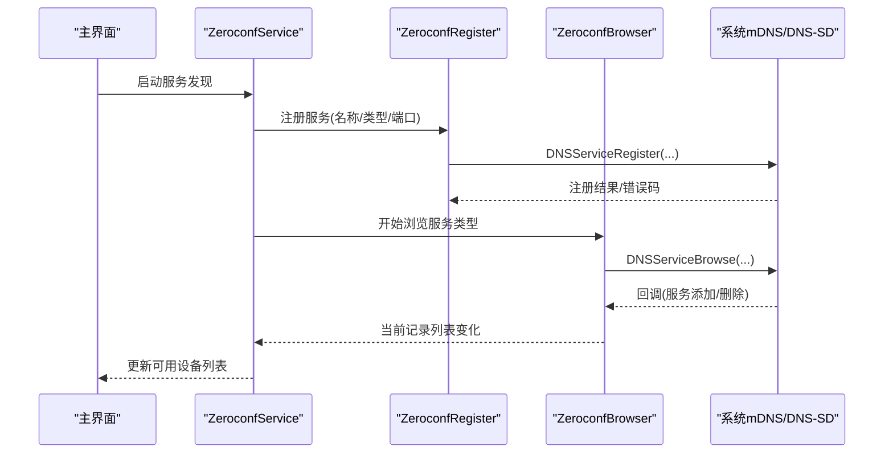
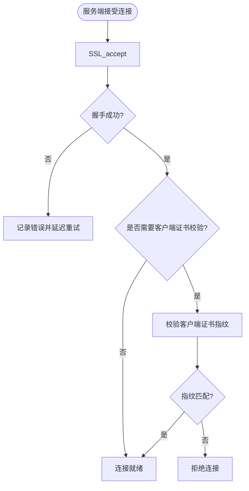
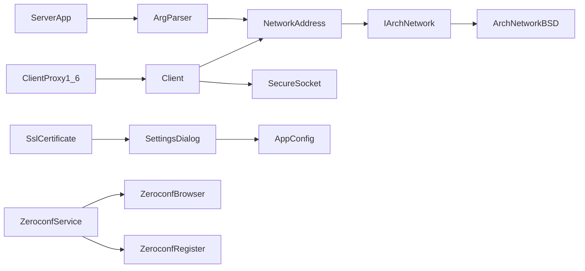

# 网络配置参数

<cite>
**本文引用的文件**   
- [ServerApp.cpp](file://src/lib/inputleap/ServerApp.cpp)
- [ArgParser.cpp](file://src/lib/inputleap/ArgParser.cpp)
- [protocol_types.h](file://src/lib/inputleap/protocol_types.h)
- [NetworkAddress.cpp](file://src/lib/net/NetworkAddress.cpp)
- [IArchNetwork.h](file://src/lib/arch/IArchNetwork.h)
- [ArchNetworkBSD.cpp](file://src/lib/arch/unix/ArchNetworkBSD.cpp)
- [Client.cpp](file://src/lib/client/Client.cpp)
- [ClientProxy1_6.cpp](file://src/lib/server/ClientProxy1_6.cpp)
- [SecureSocket.cpp](file://src/lib/net/SecureSocket.cpp)
- [SettingsDialog.cpp](file://src/gui/src/SettingsDialog.cpp)
- [AppConfig.h](file://src/gui/src/AppConfig.h)
- [AppConfig.cpp](file://src/gui/src/AppConfig.cpp)
- [ZeroconfService.h](file://src/gui/src/ZeroconfService.h)
- [ZeroconfBrowser.h](file://src/gui/src/ZeroconfBrowser.h)
- [ZeroconfBrowser.cpp](file://src/gui/src/ZeroconfBrowser.cpp)
- [ZeroconfRegister.cpp](file://src/gui/src/ZeroconfRegister.cpp)
- [ZeroconfServer.h](file://src/gui/src/ZeroconfServer.h)
- [SslCertificate.cpp](file://src/gui/src/SslCertificate.cpp)
</cite>

## 目录
1. [简介](#简介)
2. [项目结构](#项目结构)
3. [核心组件](#核心组件)
4. [架构总览](#架构总览)
5. [详细组件分析](#详细组件分析)
6. [依赖关系分析](#依赖关系分析)
7. [性能考虑](#性能考虑)
8. [故障诊断指南](#故障诊断指南)
9. [结论](#结论)
10. [附录](#附录)

## 简介
本文件聚焦 Input Leap 的网络配置参数与机制，覆盖以下方面：
- 网络接口绑定与端口设置（服务器监听地址、客户端连接目标）
- 防火墙相关注意事项（基于默认端口与常见错误码的提示）
- 零配置发现（mDNS/Bonjour）的服务广播与发现流程
- 安全与加密（SSL/TLS、证书与指纹校验）
- 连接可靠性与性能（心跳、重连策略、协议常量）
- 复杂网络环境下的配置示例与排障方法

## 项目结构
与网络配置相关的代码主要分布在以下模块：
- 命令行与服务端启动：解析 --address 等参数并加载配置
- 网络抽象层：跨平台地址族、端口操作、套接字选项
- 客户端连接：主机名解析、建立连接、心跳与重连
- GUI 配置：端口、网络接口、加密开关、证书生成
- 零配置发现：服务注册与浏览（mDNS/Bonjour）
- 安全传输：SSL 握手、证书验证与指纹管理

图表来源
- [ServerApp.cpp:128-196](file://src/lib/inputleap/ServerApp.cpp#L128-L196)
- [ArgParser.cpp:106-211](file://src/lib/inputleap/ArgParser.cpp#L106-L211)
- [protocol_types.h:37-62](file://src/lib/inputleap/protocol_types.h#L37-L62)
- [NetworkAddress.cpp:37-78](file://src/lib/net/NetworkAddress.cpp#L37-L78)
- [IArchNetwork.h:233-286](file://src/lib/arch/IArchNetwork.h#L233-L286)
- [ArchNetworkBSD.cpp:465-672](file://src/lib/arch/unix/ArchNetworkBSD.cpp#L465-L672)
- [Client.cpp:122-153](file://src/lib/client/Client.cpp#L122-L153)
- [ClientProxy1_6.cpp:132-174](file://src/lib/server/ClientProxy1_6.cpp#L132-L174)
- [SecureSocket.cpp:405-451](file://src/lib/net/SecureSocket.cpp#L405-L451)
- [SettingsDialog.cpp:1-155](file://src/gui/src/SettingsDialog.cpp#L1-L155)
- [AppConfig.h:51-145](file://src/gui/src/AppConfig.h#L51-L145)
- [AppConfig.cpp:141-191](file://src/gui/src/AppConfig.cpp#L141-L191)
- [ZeroconfService.h:33-58](file://src/gui/src/ZeroconfService.h#L33-L58)
- [ZeroconfBrowser.h:31-46](file://src/gui/src/ZeroconfBrowser.h#L31-L46)
- [ZeroconfBrowser.cpp:36-86](file://src/gui/src/ZeroconfBrowser.cpp#L36-L86)
- [ZeroconfRegister.cpp:41-93](file://src/gui/src/ZeroconfRegister.cpp#L41-L93)
- [ZeroconfServer.h:25-37](file://src/gui/src/ZeroconfServer.h#L25-L37)
- [SslCertificate.cpp:39-84](file://src/gui/src/SslCertificate.cpp#L39-L84)

章节来源
- [ServerApp.cpp:128-196](file://src/lib/inputleap/ServerApp.cpp#L128-L196)
- [ArgParser.cpp:106-211](file://src/lib/inputleap/ArgParser.cpp#L106-L211)
- [protocol_types.h:37-62](file://src/lib/inputleap/protocol_types.h#L37-L62)
- [NetworkAddress.cpp:37-78](file://src/lib/net/NetworkAddress.cpp#L37-L78)
- [IArchNetwork.h:233-286](file://src/lib/arch/IArchNetwork.h#L233-L286)
- [ArchNetworkBSD.cpp:465-672](file://src/lib/arch/unix/ArchNetworkBSD.cpp#L465-L672)
- [Client.cpp:122-153](file://src/lib/client/Client.cpp#L122-L153)
- [ClientProxy1_6.cpp:132-174](file://src/lib/server/ClientProxy1_6.cpp#L132-L174)
- [SecureSocket.cpp:405-451](file://src/lib/net/SecureSocket.cpp#L405-L451)
- [SettingsDialog.cpp:1-155](file://src/gui/src/SettingsDialog.cpp#L1-L155)
- [AppConfig.h:51-145](file://src/gui/src/AppConfig.h#L51-L145)
- [AppConfig.cpp:141-191](file://src/gui/src/AppConfig.cpp#L141-L191)
- [ZeroconfService.h:33-58](file://src/gui/src/ZeroconfService.h#L33-L58)
- [ZeroconfBrowser.h:31-46](file://src/gui/src/ZeroconfBrowser.h#L31-L46)
- [ZeroconfBrowser.cpp:36-86](file://src/gui/src/ZeroconfBrowser.cpp#L36-L86)
- [ZeroconfRegister.cpp:41-93](file://src/gui/src/ZeroconfRegister.cpp#L41-L93)
- [ZeroconfServer.h:25-37](file://src/gui/src/ZeroconfServer.h#L25-L37)
- [SslCertificate.cpp:39-84](file://src/gui/src/SslCertificate.cpp#L39-L84)

## 核心组件
- 服务器监听地址与端口
  - 通过命令行参数 --address 指定监听地址，支持 [<hostname>][:<port>] 格式；IPv6 带端口时需使用方括号。未指定时监听所有接口并使用默认端口。
  - 默认端口由协议常量定义。
- 客户端连接目标
  - 客户端在每次连接前重新解析服务器主机名，以适配动态网络变化。
- 网络抽象与端口操作
  - 提供地址族识别、端口设置/获取、地址转换等能力；BSD 实现中设置端口采用网络字节序。
- GUI 网络配置
  - 提供端口、网络接口、加密开关等可视化配置项，并持久化到应用设置。
- 零配置发现（mDNS/Bonjour）
  - 服务端可注册服务，客户端可浏览服务列表；底层使用系统 mDNS 库进行广播与发现。
- 安全传输
  - 支持 SSL/TLS 加密与认证；服务端可要求客户端证书，客户端自动校验服务端证书；GUI 支持自动生成证书与指纹。

章节来源
- [ServerApp.cpp:128-196](file://src/lib/inputleap/ServerApp.cpp#L128-L196)
- [ArgParser.cpp:106-211](file://src/lib/inputleap/ArgParser.cpp#L106-L211)
- [protocol_types.h:37-62](file://src/lib/inputleap/protocol_types.h#L37-L62)
- [Client.cpp:122-153](file://src/lib/client/Client.cpp#L122-L153)
- [IArchNetwork.h:233-286](file://src/lib/arch/IArchNetwork.h#L233-L286)
- [ArchNetworkBSD.cpp:632-672](file://src/lib/arch/unix/ArchNetworkBSD.cpp#L632-L672)
- [SettingsDialog.cpp:46-94](file://src/gui/src/SettingsDialog.cpp#L46-L94)
- [AppConfig.cpp:141-191](file://src/gui/src/AppConfig.cpp#L141-L191)
- [ZeroconfService.h:33-58](file://src/gui/src/ZeroconfService.h#L33-L58)
- [ZeroconfBrowser.cpp:36-86](file://src/gui/src/ZeroconfBrowser.cpp#L36-L86)
- [ZeroconfRegister.cpp:41-93](file://src/gui/src/ZeroconfRegister.cpp#L41-L93)
- [SecureSocket.cpp:405-451](file://src/lib/net/SecureSocket.cpp#L405-L451)
- [SslCertificate.cpp:39-84](file://src/gui/src/SslCertificate.cpp#L39-L84)

## 架构总览
下图展示从命令行参数到网络连接的关键路径，以及 GUI 配置对网络行为的影响。

图表来源
- [ServerApp.cpp:128-196](file://src/lib/inputleap/ServerApp.cpp#L128-L196)
- [ArgParser.cpp:106-211](file://src/lib/inputleap/ArgParser.cpp#L106-L211)
- [NetworkAddress.cpp:37-78](file://src/lib/net/NetworkAddress.cpp#L37-L78)
- [IArchNetwork.h:233-286](file://src/lib/arch/IArchNetwork.h#L233-L286)
- [ArchNetworkBSD.cpp:632-672](file://src/lib/arch/unix/ArchNetworkBSD.cpp#L632-L672)
- [Client.cpp:122-153](file://src/lib/client/Client.cpp#L122-L153)
- [SecureSocket.cpp:405-451](file://src/lib/net/SecureSocket.cpp#L405-L451)

## 详细组件分析

### 服务器监听地址与端口
- 参数说明
  - --address <address>：监听地址，格式为 [<hostname>][:<port>]；IPv6 带端口需加方括号；默认监听所有接口并使用默认端口。
  - --config <pathname>：指定配置文件路径。
- 默认端口
  - 协议常量定义了默认端口号。
- 地址解析与端口设置
  - NetworkAddress 支持多种地址格式解析；IArchNetwork 提供 set/get 端口与地址族判断；BSD 实现使用网络字节序设置端口。

图表来源
- [ServerApp.cpp:128-196](file://src/lib/inputleap/ServerApp.cpp#L128-L196)
- [ArgParser.cpp:106-211](file://src/lib/inputleap/ArgParser.cpp#L106-L211)
- [protocol_types.h:37-62](file://src/lib/inputleap/protocol_types.h#L37-L62)
- [NetworkAddress.cpp:37-78](file://src/lib/net/NetworkAddress.cpp#L37-L78)
- [IArchNetwork.h:233-286](file://src/lib/arch/IArchNetwork.h#L233-L286)
- [ArchNetworkBSD.cpp:632-672](file://src/lib/arch/unix/ArchNetworkBSD.cpp#L632-L672)

章节来源
- [ServerApp.cpp:128-196](file://src/lib/inputleap/ServerApp.cpp#L128-L196)
- [ArgParser.cpp:106-211](file://src/lib/inputleap/ArgParser.cpp#L106-L211)
- [protocol_types.h:37-62](file://src/lib/inputleap/protocol_types.h#L37-L62)
- [NetworkAddress.cpp:37-78](file://src/lib/net/NetworkAddress.cpp#L37-L78)
- [IArchNetwork.h:233-286](file://src/lib/arch/IArchNetwork.h#L233-L286)
- [ArchNetworkBSD.cpp:632-672](file://src/lib/arch/unix/ArchNetworkBSD.cpp#L632-L672)

### 客户端连接与重连策略
- 连接流程
  - 客户端每次连接前重新解析服务器主机名，以应对 IP 变更场景。
  - 根据地址族创建 Socket，并进行 TLS 握手。
- 心跳与保活
  - 心跳间隔与死亡阈值由协议常量定义；客户端代理维护心跳定时器与告警计时器。
- 重连策略
  - 当连接失败且允许重试时，客户端会调度定时任务进行指数退避式重试（具体退避逻辑见客户端实现）。

图表来源
- [Client.cpp:122-153](file://src/lib/client/Client.cpp#L122-L153)
- [ClientProxy1_6.cpp:132-174](file://src/lib/server/ClientProxy1_6.cpp#L132-L174)
- [protocol_types.h:37-62](file://src/lib/inputleap/protocol_types.h#L37-L62)
- [IArchNetwork.h:233-286](file://src/lib/arch/IArchNetwork.h#L233-L286)
- [SecureSocket.cpp:405-451](file://src/lib/net/SecureSocket.cpp#L405-L451)

章节来源
- [Client.cpp:122-153](file://src/lib/client/Client.cpp#L122-L153)
- [ClientProxy1_6.cpp:132-174](file://src/lib/server/ClientProxy1_6.cpp#L132-L174)
- [protocol_types.h:37-62](file://src/lib/inputleap/protocol_types.h#L37-L62)
- [SecureSocket.cpp:405-451](file://src/lib/net/SecureSocket.cpp#L405-L451)

### GUI 网络配置（端口、接口、加密）
- 配置项
  - 端口：默认值与应用设置中的键值。
  - 网络接口：用于限制监听/连接的本地接口。
  - 加密开关：启用/禁用 SSL；可选择是否要求客户端证书。
- 持久化
  - 配置保存在应用设置中，重启后生效。
- 证书与指纹
  - 支持自动生成自签名证书与计算指纹，便于首次部署与信任管理。

图表来源
- [SettingsDialog.cpp:46-94](file://src/gui/src/SettingsDialog.cpp#L46-L94)
- [AppConfig.h:51-145](file://src/gui/src/AppConfig.h#L51-L145)
- [AppConfig.cpp:141-191](file://src/gui/src/AppConfig.cpp#L141-L191)
- [SslCertificate.cpp:39-84](file://src/gui/src/SslCertificate.cpp#L39-L84)

章节来源
- [SettingsDialog.cpp:46-94](file://src/gui/src/SettingsDialog.cpp#L46-L94)
- [AppConfig.h:51-145](file://src/gui/src/AppConfig.h#L51-L145)
- [AppConfig.cpp:141-191](file://src/gui/src/AppConfig.cpp#L141-L191)
- [SslCertificate.cpp:39-84](file://src/gui/src/SslCertificate.cpp#L39-L84)

### 零配置发现（mDNS/Bonjour）
- 服务注册
  - 服务端通过 ZeroconfRegister 调用系统 DNS-SD 接口注册服务，包含服务名、类型、域名与端口。
- 服务发现
  - 客户端通过 ZeroconfBrowser 浏览指定类型的服务，接收添加/删除事件并更新本地记录列表。
- 集成点
  - ZeroconfService 协调注册与浏览，并与主界面交互显示可用设备。

图表来源
- [ZeroconfService.h:33-58](file://src/gui/src/ZeroconfService.h#L33-L58)
- [ZeroconfRegister.cpp:41-93](file://src/gui/src/ZeroconfRegister.cpp#L41-L93)
- [ZeroconfBrowser.h:31-46](file://src/gui/src/ZeroconfBrowser.h#L31-L46)
- [ZeroconfBrowser.cpp:36-86](file://src/gui/src/ZeroconfBrowser.cpp#L36-L86)
- [ZeroconfServer.h:25-37](file://src/gui/src/ZeroconfServer.h#L25-L37)

章节来源
- [ZeroconfService.h:33-58](file://src/gui/src/ZeroconfService.h#L33-L58)
- [ZeroconfRegister.cpp:41-93](file://src/gui/src/ZeroconfRegister.cpp#L41-L93)
- [ZeroconfBrowser.h:31-46](file://src/gui/src/ZeroconfBrowser.h#L31-L46)
- [ZeroconfBrowser.cpp:36-86](file://src/gui/src/ZeroconfBrowser.cpp#L36-L86)
- [ZeroconfServer.h:25-37](file://src/gui/src/ZeroconfServer.h#L25-L37)

### 安全传输（SSL/TLS）
- 握手与校验
  - 服务端接受连接后进行 SSL_accept，并在需要时校验客户端证书指纹。
  - 客户端始终校验服务端证书。
- 证书管理
  - GUI 支持生成自签名证书与指纹数据库，便于快速部署与信任管理。

图表来源
- [SecureSocket.cpp:405-451](file://src/lib/net/SecureSocket.cpp#L405-L451)
- [SslCertificate.cpp:39-84](file://src/gui/src/SslCertificate.cpp#L39-L84)

章节来源
- [SecureSocket.cpp:405-451](file://src/lib/net/SecureSocket.cpp#L405-L451)
- [SslCertificate.cpp:39-84](file://src/gui/src/SslCertificate.cpp#L39-L84)

## 依赖关系分析
- 参数解析依赖
  - ServerApp 依赖 ArgParser 解析 --address 与 --config。
- 地址与端口
  - NetworkAddress 依赖 IArchNetwork 抽象；BSD 实现负责端口字节序与地址族处理。
- 客户端与心跳
  - Client 依赖 NetworkAddress 与 SecureSocket；ClientProxy1_6 维护心跳与告警定时器。
- GUI 与配置
  - SettingsDialog 读写 AppConfig；SslCertificate 辅助证书与指纹生成。
- 零配置发现
  - ZeroconfService 组合 ZeroconfBrowser 与 ZeroconfRegister，调用系统 mDNS 库。

图表来源
- [ServerApp.cpp:128-196](file://src/lib/inputleap/ServerApp.cpp#L128-L196)
- [ArgParser.cpp:106-211](file://src/lib/inputleap/ArgParser.cpp#L106-L211)
- [NetworkAddress.cpp:37-78](file://src/lib/net/NetworkAddress.cpp#L37-L78)
- [IArchNetwork.h:233-286](file://src/lib/arch/IArchNetwork.h#L233-L286)
- [ArchNetworkBSD.cpp:632-672](file://src/lib/arch/unix/ArchNetworkBSD.cpp#L632-L672)
- [Client.cpp:122-153](file://src/lib/client/Client.cpp#L122-L153)
- [ClientProxy1_6.cpp:132-174](file://src/lib/server/ClientProxy1_6.cpp#L132-L174)
- [SecureSocket.cpp:405-451](file://src/lib/net/SecureSocket.cpp#L405-L451)
- [SettingsDialog.cpp:46-94](file://src/gui/src/SettingsDialog.cpp#L46-L94)
- [AppConfig.cpp:141-191](file://src/gui/src/AppConfig.cpp#L141-L191)
- [ZeroconfService.h:33-58](file://src/gui/src/ZeroconfService.h#L33-L58)
- [ZeroconfBrowser.cpp:36-86](file://src/gui/src/ZeroconfBrowser.cpp#L36-L86)
- [ZeroconfRegister.cpp:41-93](file://src/gui/src/ZeroconfRegister.cpp#L41-L93)

章节来源
- [ServerApp.cpp:128-196](file://src/lib/inputleap/ServerApp.cpp#L128-L196)
- [ArgParser.cpp:106-211](file://src/lib/inputleap/ArgParser.cpp#L106-L211)
- [NetworkAddress.cpp:37-78](file://src/lib/net/NetworkAddress.cpp#L37-L78)
- [IArchNetwork.h:233-286](file://src/lib/arch/IArchNetwork.h#L233-L286)
- [ArchNetworkBSD.cpp:632-672](file://src/lib/arch/unix/ArchNetworkBSD.cpp#L632-L672)
- [Client.cpp:122-153](file://src/lib/client/Client.cpp#L122-L153)
- [ClientProxy1_6.cpp:132-174](file://src/lib/server/ClientProxy1_6.cpp#L132-L174)
- [SecureSocket.cpp:405-451](file://src/lib/net/SecureSocket.cpp#L405-L451)
- [SettingsDialog.cpp:46-94](file://src/gui/src/SettingsDialog.cpp#L46-L94)
- [AppConfig.cpp:141-191](file://src/gui/src/AppConfig.cpp#L141-L191)
- [ZeroconfService.h:33-58](file://src/gui/src/ZeroconfService.h#L33-L58)
- [ZeroconfBrowser.cpp:36-86](file://src/gui/src/ZeroconfBrowser.cpp#L36-L86)
- [ZeroconfRegister.cpp:41-93](file://src/gui/src/ZeroconfRegister.cpp#L41-L93)

## 性能考虑
- 心跳与保活
  - 心跳间隔与死亡阈值由协议常量定义，合理设置可减少误断与资源占用。
- 重连策略
  - 客户端在失败时按策略重试，避免频繁重连导致拥塞。
- 带宽与延迟
  - 代码中未发现显式的带宽限制或延迟控制参数；可通过操作系统 TCP 参数与网络拓扑优化间接影响性能。
- 日志级别
  - GUI 提供日志级别配置，调试时可提升日志等级以便定位问题。

章节来源
- [protocol_types.h:37-62](file://src/lib/inputleap/protocol_types.h#L37-L62)
- [ClientProxy1_6.cpp:132-174](file://src/lib/server/ClientProxy1_6.cpp#L132-L174)
- [SettingsDialog.cpp:46-94](file://src/gui/src/SettingsDialog.cpp#L46-L94)

## 故障诊断指南
- 常见问题与可能原因
  - 端口冲突：EADDRINUSE（端口被占用）
  - 无路由/不可达：ENETUNREACH/EHOSTUNREACH
  - 连接被拒：ECONNREFUSED
  - 地址不可用：EADDRNOTAVAIL
  - 资源不足：ENOBUFS/ENOMEM
- 排查步骤
  - 确认服务器监听地址与端口是否正确（--address 与默认端口）。
  - 检查防火墙规则是否放行默认端口。
  - 验证客户端是否能解析服务器主机名并访问对应 IP/端口。
  - 启用更高日志级别，观察连接与握手过程。
  - 若启用 SSL，检查证书与指纹是否匹配。

章节来源
- [ArchNetworkBSD.cpp:757-807](file://src/lib/arch/unix/ArchNetworkBSD.cpp#L757-L807)
- [ServerApp.cpp:128-196](file://src/lib/inputleap/ServerApp.cpp#L128-L196)
- [Client.cpp:122-153](file://src/lib/client/Client.cpp#L122-L153)
- [SecureSocket.cpp:405-451](file://src/lib/net/SecureSocket.cpp#L405-L451)

## 结论
Input Leap 的网络配置围绕“监听地址与端口”“零配置发现”“安全传输”“连接可靠性”四个维度展开。通过命令行与 GUI 的双重配置方式，用户可以灵活地绑定接口、选择端口、启用加密与证书校验，并利用 mDNS/Bonjour 简化设备发现。结合心跳与重连策略，系统在复杂网络环境下具备较好的鲁棒性。对于性能调优，建议优先关注操作系统层面的网络参数与拓扑优化。

## 附录
- 常用参数速查
  - --address <address>：服务器监听地址，支持 [<hostname>][:<port>]
  - --config <pathname>：配置文件路径
  - GUI 端口：默认值与应用设置键值
  - GUI 网络接口：限制本地接口
  - GUI 加密开关：启用/禁用 SSL；可选要求客户端证书
- 默认端口
  - 由协议常量定义
- 心跳与保活
  - 心跳间隔与死亡阈值由协议常量定义

章节来源
- [ServerApp.cpp:128-196](file://src/lib/inputleap/ServerApp.cpp#L128-L196)
- [ArgParser.cpp:106-211](file://src/lib/inputleap/ArgParser.cpp#L106-L211)
- [protocol_types.h:37-62](file://src/lib/inputleap/protocol_types.h#L37-L62)
- [SettingsDialog.cpp:46-94](file://src/gui/src/SettingsDialog.cpp#L46-L94)
- [AppConfig.cpp:141-191](file://src/gui/src/AppConfig.cpp#L141-L191)