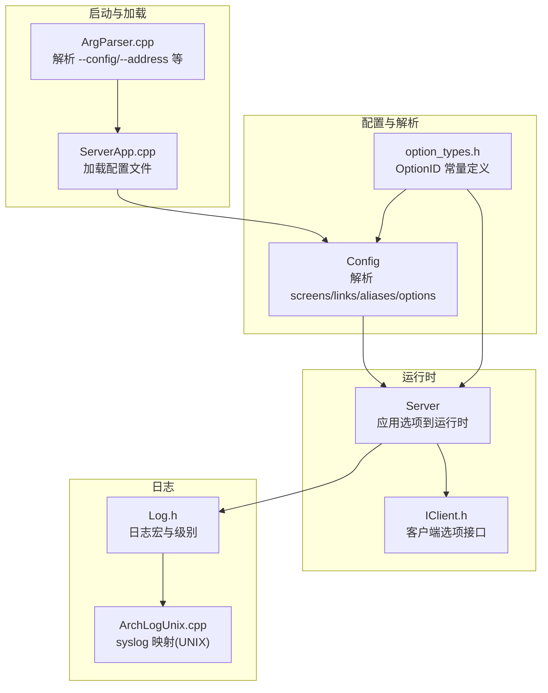
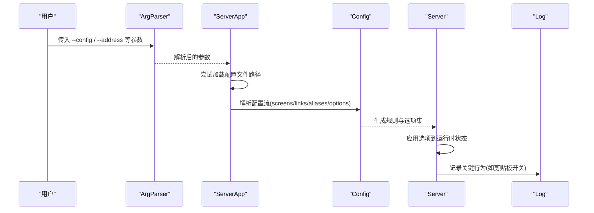
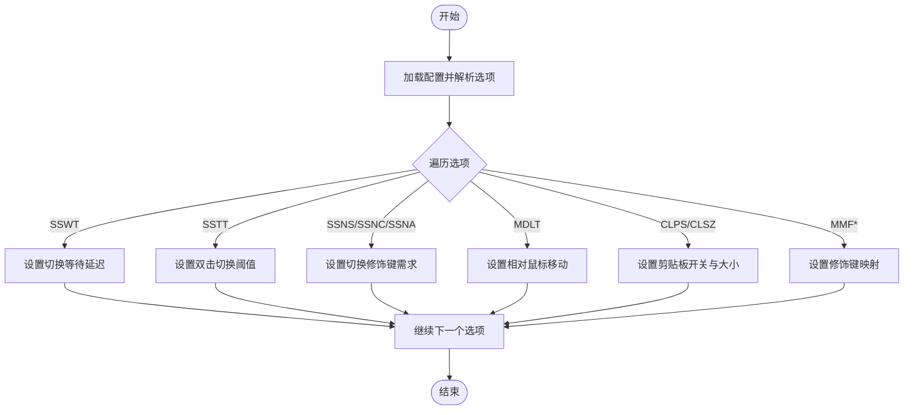
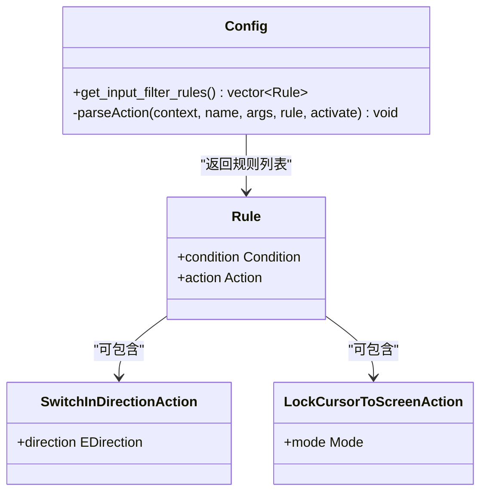
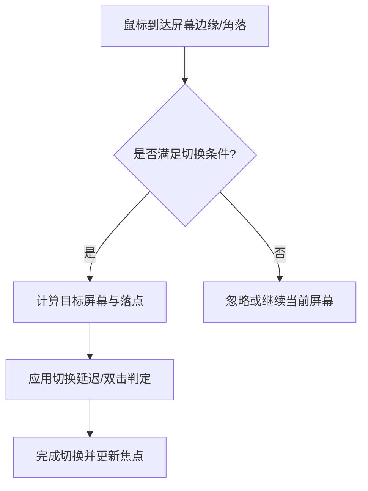
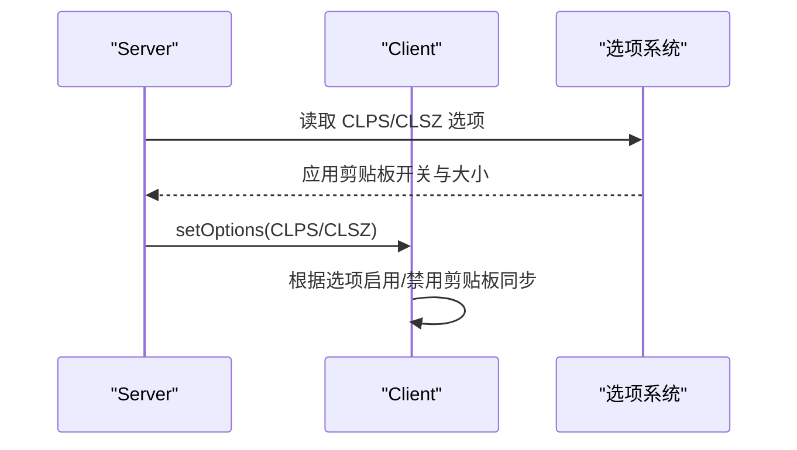
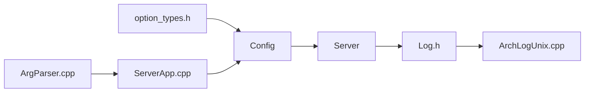

# 行为配置参数

<cite>
**本文引用的文件**   
- [README.md](file://README.md)
- [input-leap.conf.example](file://doc/input-leap.conf.example)
- [input-leap.conf.example-basic](file://doc/input-leap.conf.example-basic)
- [input-leap.conf.example-advanced](file://doc/input-leap.conf.example-advanced)
- [Config.h](file://src/lib/server/Config.h)
- [Config.cpp](file://src/lib/server/Config.cpp)
- [Server.cpp](file://src/lib/server/Server.cpp)
- [option_types.h](file://src/lib/inputleap/option_types.h)
- [ArgParser.cpp](file://src/lib/inputleap/ArgParser.cpp)
- [ServerApp.cpp](file://src/lib/inputleap/ServerApp.cpp)
- [Log.h](file://src/lib/base/Log.h)
- [ArchLogUnix.cpp](file://src/lib/arch/unix/ArchLogUnix.cpp)
- [IClient.h](file://src/lib/inputleap/IClient.h)
</cite>

## 目录
1. [简介](#简介)
2. [项目结构](#项目结构)
3. [核心组件](#核心组件)
4. [架构总览](#架构总览)
5. [详细组件分析](#详细组件分析)
6. [依赖关系分析](#依赖关系分析)
7. [性能与调优建议](#性能与调优建议)
8. [故障排查指南](#故障排查指南)
9. [结论](#结论)
10. [附录：配置示例与扩展方法](#附录配置示例与扩展方法)

## 简介
本文件聚焦于 Input Leap 的行为配置参数，围绕输入事件处理、剪贴板同步、热键与动作、屏幕切换行为、光标移动规则、键盘映射等用户交互设置进行系统化说明；同时覆盖日志级别、调试输出、性能监控等运维相关参数。文末提供不同使用场景下的调优示例与自定义行为扩展方法，帮助读者快速定位并优化实际部署中的行为表现。

## 项目结构
Input Leap 的配置解析与运行时行为由服务器端配置模块与选项系统共同驱动。关键位置包括：
- 配置解析与规则构建：Config（读取 screens/links/aliases/options/actions/rules 等）
- 选项定义与枚举：option_types.h（所有 OptionID 常量）
- 运行时应用选项：Server（将配置项应用到运行期状态）
- 命令行与配置文件加载：ArgParser、ServerApp
- 日志系统：Log.h 与各平台实现（如 ArchLogUnix）

图示来源
- [Config.h:1-200](file://src/lib/server/Config.h#L1-L200)
- [Config.cpp:1145-1193](file://src/lib/server/Config.cpp#L1145-L1193)
- [option_types.h:46-72](file://src/lib/inputleap/option_types.h#L46-L72)
- [Server.cpp:1087-1129](file://src/lib/server/Server.cpp#L1087-L1129)
- [ArgParser.cpp:106-139](file://src/lib/inputleap/ArgParser.cpp#L106-L139)
- [ServerApp.cpp:237-282](file://src/lib/inputleap/ServerApp.cpp#L237-L282)
- [Log.h:155-188](file://src/lib/base/Log.h#L155-L188)
- [ArchLogUnix.cpp:55-84](file://src/lib/arch/unix/ArchLogUnix.cpp#L55-L84)

章节来源
- [README.md:1-157](file://README.md#L1-L157)
- [Config.h:1-200](file://src/lib/server/Config.h#L1-L200)
- [option_types.h:46-72](file://src/lib/inputleap/option_types.h#L46-L72)
- [Server.cpp:1087-1129](file://src/lib/server/Server.cpp#L1087-L1129)
- [ArgParser.cpp:106-139](file://src/lib/inputleap/ArgParser.cpp#L106-L139)
- [ServerApp.cpp:237-282](file://src/lib/inputleap/ServerApp.cpp#L237-L282)
- [Log.h:155-188](file://src/lib/base/Log.h#L155-L188)
- [ArchLogUnix.cpp:55-84](file://src/lib/arch/unix/ArchLogUnix.cpp#L55-L84)

## 核心组件
- 配置模型与规则
  - Config 负责解析 screens、links、aliases、options 以及输入过滤规则（rules）和动作（actions），并提供 get_input_filter_rules() 暴露规则集合供运行时执行。
- 选项体系
  - option_types.h 定义了所有行为相关的 OptionID，例如屏幕切换延迟、双击切换、修饰键需求、相对鼠标移动、剪贴板开关与大小限制等。
- 运行时应用
  - Server 在初始化时遍历配置选项，将其映射为内部状态（如 m_switchWaitDelay、m_enableClipboard 等）。
- 启动与加载
  - ArgParser 解析命令行参数（--config、--address 等），ServerApp 负责按路径尝试加载配置文件并解析。
- 日志系统
  - Log.h 提供多级日志宏（PRINT/FATAL/ERROR/WARNING/NOTE/INFO/DEBUG*），UNIX 平台通过 syslog 输出。

章节来源
- [Config.h:309-312](file://src/lib/server/Config.h#L309-L312)
- [option_types.h:46-72](file://src/lib/inputleap/option_types.h#L46-L72)
- [Server.cpp:1087-1129](file://src/lib/server/Server.cpp#L1087-L1129)
- [ArgParser.cpp:106-139](file://src/lib/inputleap/ArgParser.cpp#L106-L139)
- [ServerApp.cpp:237-282](file://src/lib/inputleap/ServerApp.cpp#L237-L282)
- [Log.h:155-188](file://src/lib/base/Log.h#L155-L188)

## 架构总览
下图展示了从命令行与配置文件到运行时行为的端到端流程，重点体现“配置→选项→运行时”的链路。

图示来源
- [ArgParser.cpp:106-139](file://src/lib/inputleap/ArgParser.cpp#L106-L139)
- [ServerApp.cpp:237-282](file://src/lib/inputleap/ServerApp.cpp#L237-L282)
- [Config.cpp:1145-1193](file://src/lib/server/Config.cpp#L1145-L1193)
- [Server.cpp:1087-1129](file://src/lib/server/Server.cpp#L1087-L1129)
- [Log.h:155-188](file://src/lib/base/Log.h#L155-L188)

## 详细组件分析

### 选项系统与行为参数
本节梳理与行为直接相关的配置项及其作用域与含义。

- 全局与屏幕级选项
  - 支持为每个屏幕单独添加/移除/清除选项，并通过名称访问。
  - 选项以 OptionID 标识，值类型为整型或布尔标志位。

- 关键行为选项（节选）
  - 屏幕切换
    - kOptionScreenSwitchDelay：切换等待延迟（毫秒）
    - kOptionScreenSwitchTwoTap：双击切换阈值（毫秒）
    - kOptionScreenSwitchNeedsShift/Control/Alt：切换需按住修饰键
    - kOptionScreenSwitchCorners/CornSize：四角切换区域与尺寸
  - 鼠标行为
    - kOptionRelativeMouseMoves：相对鼠标移动模式
  - 剪贴板
    - kOptionClipboardSharing：是否启用剪贴板共享
    - kOptionClipboardSharingSize：剪贴板最大传输大小（<=0 表示禁用）
  - 其他
    - kOptionModifierMapForShift/Control/Alt/AltGr/Meta/Super：修饰键映射
    - kOptionHeartbeat：心跳间隔
    - kOptionScreenSaverSync：屏保同步
    - kOptionXTestXineramaUnaware：Xinerama 不感知兼容
    - kOptionScreenPreserveFocus：保持焦点策略
    - kOptionWin32KeepForeground：Windows 前台保持

- 选项应用流程
  - Server 在初始化阶段遍历配置选项，逐项更新内部状态（如 m_switchWaitDelay、m_enableClipboard 等），并在必要时记录日志。

图示来源
- [option_types.h:46-72](file://src/lib/inputleap/option_types.h#L46-L72)
- [Server.cpp:1087-1129](file://src/lib/server/Server.cpp#L1087-L1129)

章节来源
- [Config.h:285-306](file://src/lib/server/Config.h#L285-L306)
- [option_types.h:46-72](file://src/lib/inputleap/option_types.h#L46-L72)
- [Server.cpp:1087-1129](file://src/lib/server/Server.cpp#L1087-L1129)

### 输入事件处理与动作规则
- 输入过滤规则
  - Config 暴露 get_input_filter_rules()，用于获取一组规则，每条规则包含条件与动作。
- 动作类型
  - switchToScreen(direction)：向指定方向切换到目标屏幕
  - lockCursorToScreen([off|on|toggle])：锁定/解锁光标在当前屏幕
  - keyboardBroadcast(...)：键盘广播相关动作（具体语法参见解析逻辑）
- 解析入口
  - parseAction 根据动作名与参数构造对应 Action 对象，并注入到规则中。

图示来源
- [Config.h:309-312](file://src/lib/server/Config.h#L309-L312)
- [Config.cpp:1145-1193](file://src/lib/server/Config.cpp#L1145-L1193)

章节来源
- [Config.h:309-312](file://src/lib/server/Config.h#L309-L312)
- [Config.cpp:1145-1193](file://src/lib/server/Config.cpp#L1145-L1193)

### 屏幕切换行为与光标移动规则
- 切换触发方式
  - 边缘穿越：通过 links 定义屏幕间的相邻关系与区间
  - 四角切换：kOptionScreenSwitchCorners/kOptionScreenSwitchCornerSize
  - 双击切换：kOptionScreenSwitchTwoTap
  - 修饰键切换：kOptionScreenSwitchNeedsShift/Control/Alt
  - 切换延迟：kOptionScreenSwitchDelay
- 光标移动规则
  - 相对移动模式：kOptionRelativeMouseMoves
  - 锁屏动作：lockCursorToScreen(off/on/toggle)

图示来源
- [option_types.h:74-97](file://src/lib/inputleap/option_types.h#L74-L97)
- [Server.cpp:1087-1129](file://src/lib/server/Server.cpp#L1087-L1129)
- [Config.cpp:1145-1193](file://src/lib/server/Config.cpp#L1145-L1193)

章节来源
- [option_types.h:74-97](file://src/lib/inputleap/option_types.h#L74-L97)
- [Server.cpp:1087-1129](file://src/lib/server/Server.cpp#L1087-L1129)
- [Config.cpp:1145-1193](file://src/lib/server/Config.cpp#L1145-L1193)

### 剪贴板同步
- 开关与大小限制
  - kOptionClipboardSharing：控制是否启用剪贴板共享
  - kOptionClipboardSharingSize：当值 <=0 时禁用剪贴板共享
- 客户端侧行为
  - IClient 接口提供 resetOptions/setOptions 能力，允许服务端下发选项变更
  - 客户端在连接建立后会根据选项决定是否启用剪贴板同步

图示来源
- [option_types.h:70-71](file://src/lib/inputleap/option_types.h#L70-L71)
- [Server.cpp:1119-1129](file://src/lib/server/Server.cpp#L1119-L1129)
- [IClient.h:144-157](file://src/lib/inputleap/IClient.h#L144-L157)

章节来源
- [option_types.h:70-71](file://src/lib/inputleap/option_types.h#L70-L71)
- [Server.cpp:1119-1129](file://src/lib/server/Server.cpp#L1119-L1129)
- [IClient.h:144-157](file://src/lib/inputleap/IClient.h#L144-L157)

### 热键与动作绑定
- 动作解析
  - switchToScreen(direction)：支持 left/right/up/down 方向
  - lockCursorToScreen([off|on|toggle])：控制光标锁定模式
- 规则与条件
  - 通过 rules 段定义条件与动作组合，实现基于按键、鼠标、屏幕状态等的复杂行为

章节来源
- [Config.cpp:1145-1193](file://src/lib/server/Config.cpp#L1145-L1193)

### 键盘映射配置
- 修饰键映射
  - kOptionModifierMapForShift/Control/Alt/AltGr/Meta/Super：将某修饰键映射为另一修饰键，解决跨平台差异
- 半双锁键
  - kOptionHalfDuplexCapsLock/NumLock/ScrollLock：避免本地与远端同时生效导致的冲突

章节来源
- [option_types.h:48-56](file://src/lib/inputleap/option_types.h#L48-L56)
- [Config.cpp:1344-1390](file://src/lib/server/Config.cpp#L1344-L1390)

### 日志级别与调试输出
- 日志级别
  - PRINT/FATAL/ERROR/WARNING/NOTE/INFO/DEBUG/DEBUG1..5
- UNIX 平台输出
  - 通过 syslog 输出，级别映射至系统优先级
- 典型行为日志
  - 剪贴板开关、配置加载失败、连接状态等均有相应日志输出

章节来源
- [Log.h:155-188](file://src/lib/base/Log.h#L155-L188)
- [ArchLogUnix.cpp:55-84](file://src/lib/arch/unix/ArchLogUnix.cpp#L55-L84)
- [ServerApp.cpp:237-282](file://src/lib/inputleap/ServerApp.cpp#L237-L282)
- [Server.cpp:1119-1129](file://src/lib/server/Server.cpp#L1119-L1129)

## 依赖关系分析
- 配置与选项
  - Config 依赖 option_types.h 中的 OptionID 常量，用于识别与序列化选项
- 运行时应用
  - Server 依赖 option_types.h 与 Config 提供的选项集合，将配置转换为内部状态
- 启动与加载
  - ArgParser 解析命令行参数，ServerApp 负责选择并加载配置文件
- 日志
  - 各模块通过 Log.h 统一输出，UNIX 平台通过 ArchLogUnix 映射到 syslog

图示来源
- [option_types.h:46-72](file://src/lib/inputleap/option_types.h#L46-L72)
- [Config.h:1-200](file://src/lib/server/Config.h#L1-L200)
- [Server.cpp:1087-1129](file://src/lib/server/Server.cpp#L1087-L1129)
- [ArgParser.cpp:106-139](file://src/lib/inputleap/ArgParser.cpp#L106-L139)
- [ServerApp.cpp:237-282](file://src/lib/inputleap/ServerApp.cpp#L237-L282)
- [Log.h:155-188](file://src/lib/base/Log.h#L155-L188)
- [ArchLogUnix.cpp:55-84](file://src/lib/arch/unix/ArchLogUnix.cpp#L55-L84)

章节来源
- [option_types.h:46-72](file://src/lib/inputleap/option_types.h#L46-L72)
- [Config.h:1-200](file://src/lib/server/Config.h#L1-L200)
- [Server.cpp:1087-1129](file://src/lib/server/Server.cpp#L1087-L1129)
- [ArgParser.cpp:106-139](file://src/lib/inputleap/ArgParser.cpp#L106-L139)
- [ServerApp.cpp:237-282](file://src/lib/inputleap/ServerApp.cpp#L237-L282)
- [Log.h:155-188](file://src/lib/base/Log.h#L155-L188)
- [ArchLogUnix.cpp:55-84](file://src/lib/arch/unix/ArchLogUnix.cpp#L55-L84)

## 性能与调优建议
- 剪贴板
  - 若网络带宽有限或存在大文本/图片频繁同步，建议适当降低 kOptionClipboardSharingSize 或关闭 kOptionClipboardSharing
- 屏幕切换
  - 对高频误触环境，可适当增大 kOptionScreenSwitchDelay 与 kOptionScreenSwitchTwoTap，并启用修饰键需求（Shift/Control/Alt）
  - 调整四角切换区域与尺寸，减少误入角落的概率
- 鼠标移动
  - 在需要精确控制的场景，考虑开启 kOptionRelativeMouseMoves 以获得更一致的移动体验
- 日志
  - 生产环境建议仅保留 NOTE/INFO 级别，避免 DEBUG 系列造成 IO 压力

[本节为通用指导，无需源码引用]

## 故障排查指南
- 配置文件未找到或无法打开
  - 检查 --config 路径是否正确，确认 ServerApp 的加载顺序与权限
- 剪贴板未生效
  - 核对 CLPS/CLSZ 选项，确认两端均启用且大小限制合理
- 切换异常
  - 检查 links 定义与四角切换参数，确认修饰键需求与延迟设置
- 日志定位
  - 在 UNIX 平台查看 syslog 对应优先级消息；在 GUI 中查看日志窗口

章节来源
- [ServerApp.cpp:237-282](file://src/lib/inputleap/ServerApp.cpp#L237-L282)
- [Server.cpp:1119-1129](file://src/lib/server/Server.cpp#L1119-L1129)
- [Log.h:155-188](file://src/lib/base/Log.h#L155-L188)
- [ArchLogUnix.cpp:55-84](file://src/lib/arch/unix/ArchLogUnix.cpp#L55-L84)

## 结论
Input Leap 的行为由“配置→选项→运行时”的清晰链路驱动。通过合理设置屏幕切换、鼠标移动、剪贴板同步、键盘映射与动作规则，并结合日志与性能调优，可在多平台环境中获得稳定、可控的用户体验。

[本节为总结性内容，无需源码引用]

## 附录：配置示例与扩展方法

### 基础布局示例
- 三台主机横向排列，左侧 Laptop，中间 Desktop1，右侧 iMac
- 使用 aliases 将真实主机名映射为简洁逻辑名

章节来源
- [input-leap.conf.example-basic:1-40](file://doc/input-leap.conf.example-basic#L1-L40)

### 高级布局示例
- 多显示器环绕布局，支持带区间的链接与别名映射

章节来源
- [input-leap.conf.example-advanced:1-50](file://doc/input-leap.conf.example-advanced#L1-L50)

### 最小可用示例
- 仅定义 screens、links、aliases 的最小配置

章节来源
- [input-leap.conf.example:1-38](file://doc/input-leap.conf.example#L1-L38)

### 行为调优示例（概念性）
- 防误触切换：启用修饰键需求，增大切换延迟与双击阈值，缩小四角切换区域
- 低带宽剪贴板：关闭剪贴板或限制最大大小
- 高精度鼠标：开启相对移动模式

[本节为概念性示例，无需源码引用]

### 自定义行为扩展方法
- 新增动作
  - 在 Config::parseAction 中添加新动作分支，构造对应的 Action 对象并注入规则
- 新增条件
  - 在 Config::parseCondition 中添加新条件分支，结合现有条件组合实现复杂触发
- 新增选项
  - 在 option_types.h 中新增 OptionID，并在 Server 的选项应用处增加处理逻辑

章节来源
- [Config.cpp:1145-1193](file://src/lib/server/Config.cpp#L1145-L1193)
- [option_types.h:46-72](file://src/lib/inputleap/option_types.h#L46-L72)
- [Server.cpp:1087-1129](file://src/lib/server/Server.cpp#L1087-L1129)