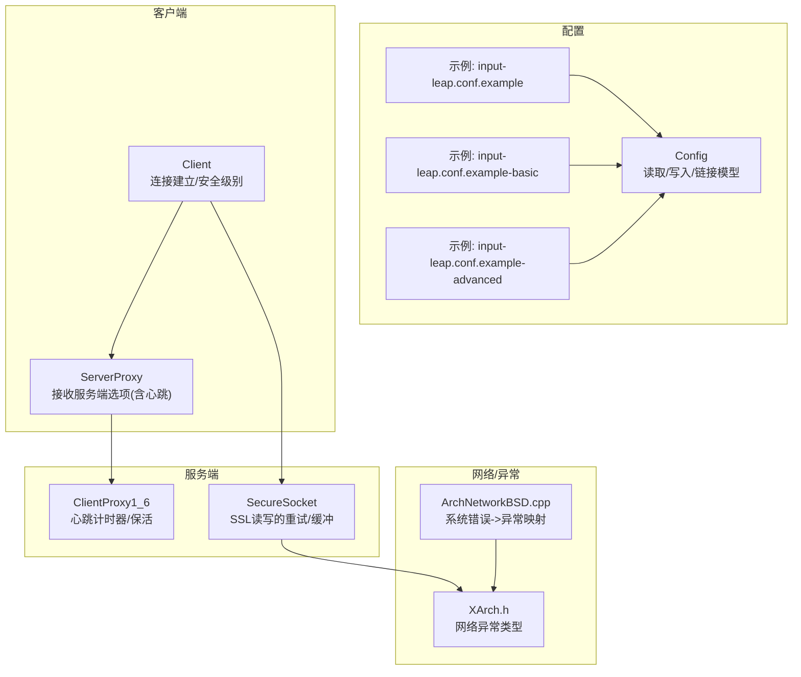
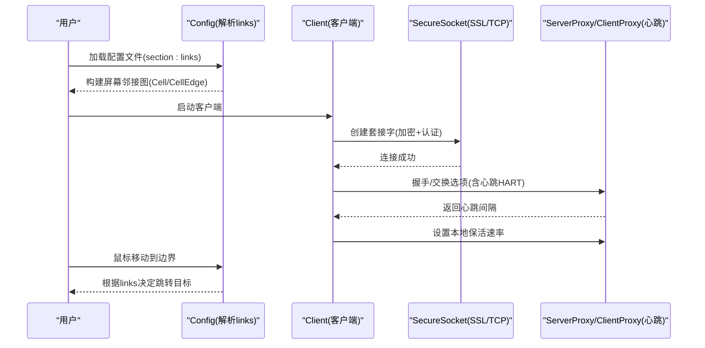
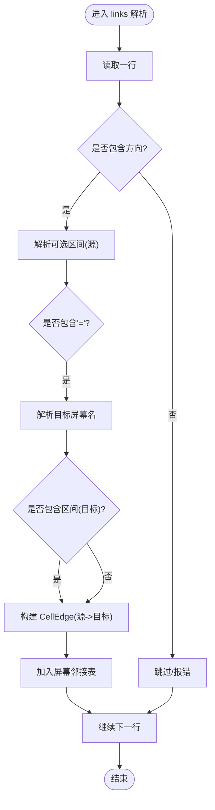
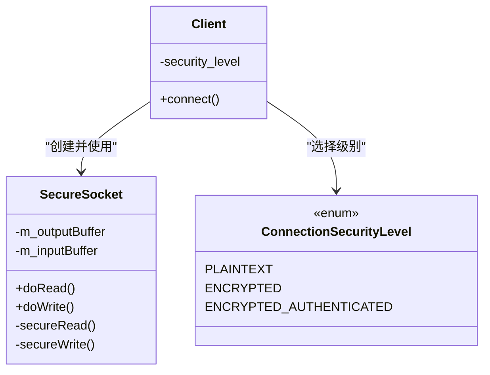
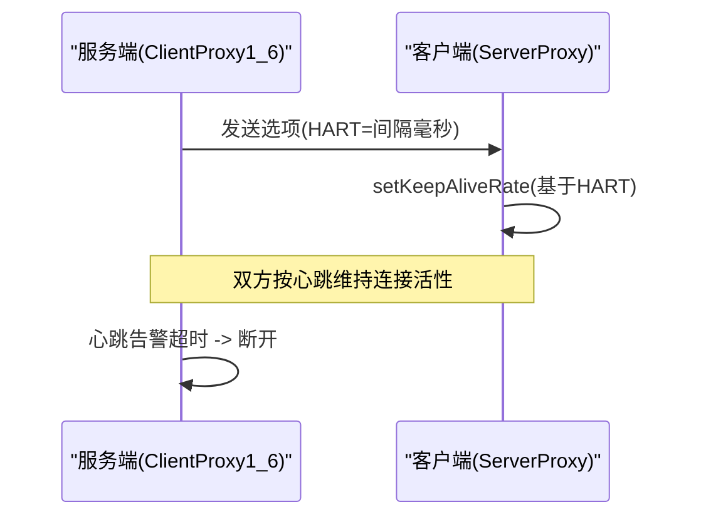
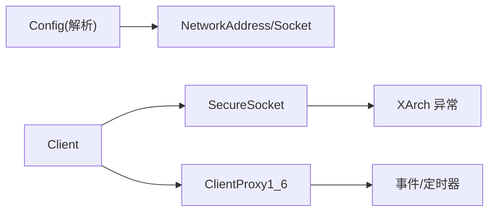

# 连接配置参数

<cite>
**本文引用的文件**   
- [Config.h](file://src/lib/server/Config.h)
- [Config.cpp](file://src/lib/server/Config.cpp)
- [input-leap.conf.example](file://doc/input-leap.conf.example)
- [input-leap.conf.example-basic](file://doc/input-leap.conf.example-basic)
- [input-leap.conf.example-advanced](file://doc/input-leap.conf.example-advanced)
- [option_types.h](file://src/lib/inputleap/option_types.h)
- [Client.cpp](file://src/lib/client/Client.cpp)
- [ServerProxy.cpp](file://src/lib/client/ServerProxy.cpp)
- [ClientProxy1_6.cpp](file://src/lib/server/ClientProxy1_6.cpp)
- [SecureSocket.cpp](file://src/lib/net/SecureSocket.cpp)
- [ConnectionSecurityLevel.h](file://src/lib/net/ConnectionSecurityLevel.h)
- [XArch.h](file://src/lib/arch/XArch.h)
- [ArchNetworkBSD.cpp](file://src/lib/arch/unix/ArchNetworkBSD.cpp)
</cite>

## 目录
1. [简介](#简介)
2. [项目结构](#项目结构)
3. [核心组件](#核心组件)
4. [架构总览](#架构总览)
5. [详细组件分析](#详细组件分析)
6. [依赖关系分析](#依赖关系分析)
7. [性能与调优](#性能与调优)
8. [故障排除指南](#故障排除指南)
9. [结论](#结论)
10. [附录：links 节语法与示例](#附录links-节语法与示例)

## 简介
本文件聚焦于 Input Leap 的“连接配置参数”，特别是配置文件中的 links 节，用于定义屏幕之间的相邻关系与跳转边界。文档将说明：
- links 节中各参数的含义与用法（方向、区间、对称与非对称连接）
- 传输协议与安全级别的选择
- 连接超时与心跳机制
- 性能相关选项（如心跳间隔、剪贴板大小等）
- 复杂网络拓扑的配置思路与排障建议

## 项目结构
与连接配置直接相关的代码与示例位于以下位置：
- 配置解析与链接模型：src/lib/server/Config.{h,cpp}
- 配置示例：doc/input-leap.conf.example*
- 客户端连接与安全级别：src/lib/client/Client.cpp, src/lib/net/ConnectionSecurityLevel.h
- 心跳与保活：src/lib/client/ServerProxy.cpp, src/lib/server/ClientProxy1_6.cpp
- 安全套接字读写与重试：src/lib/net/SecureSocket.cpp
- 错误类型与平台网络异常映射：src/lib/arch/XArch.h, src/lib/arch/unix/ArchNetworkBSD.cpp

图表来源
- [Config.cpp:1720-1805](file://src/lib/server/Config.cpp#L1720-L1805)
- [input-leap.conf.example:13-31](file://doc/input-leap.conf.example#L13-L31)
- [input-leap.conf.example-basic:19-33](file://doc/input-leap.conf.example-basic#L19-L33)
- [input-leap.conf.example-advanced:29-41](file://doc/input-leap.conf.example-advanced#L29-L41)
- [Client.cpp:122-153](file://src/lib/client/Client.cpp#L122-L153)
- [ServerProxy.cpp:804-842](file://src/lib/client/ServerProxy.cpp#L804-L842)
- [ClientProxy1_6.cpp:106-155](file://src/lib/server/ClientProxy1_6.cpp#L106-L155)
- [SecureSocket.cpp:204-249](file://src/lib/net/SecureSocket.cpp#L204-L249)
- [XArch.h:69-102](file://src/lib/arch/XArch.h#L69-L102)
- [ArchNetworkBSD.cpp:757-813](file://src/lib/arch/unix/ArchNetworkBSD.cpp#L757-L813)

章节来源
- [Config.h:62-146](file://src/lib/server/Config.h#L62-L146)
- [Config.cpp:1720-1805](file://src/lib/server/Config.cpp#L1720-L1805)
- [input-leap.conf.example:13-31](file://doc/input-leap.conf.example#L13-L31)
- [input-leap.conf.example-basic:19-33](file://doc/input-leap.conf.example-basic#L19-L33)
- [input-leap.conf.example-advanced:29-41](file://doc/input-leap.conf.example-advanced#L29-L41)

## 核心组件
- 配置模型与 links 解析
  - Config 类维护屏幕名称、别名、监听地址以及屏幕间的邻接关系（Cell/CellEdge）。
  - links 节通过“方向 + 可选区间 = 目标屏幕 + 可选区间”的形式定义跳转边。
- 客户端连接与安全
  - Client 在连接时选择安全级别；默认采用加密并认证模式。
  - SecureSocket 负责 SSL 层读写，包含重试与缓冲策略。
- 心跳与保活
  - 服务端通过 ClientProxy1_6 管理心跳定时器与告警阈值。
  - 客户端通过 ServerProxy 接收服务端下发的选项（包括心跳间隔），并更新本地保活速率。

章节来源
- [Config.h:62-146](file://src/lib/server/Config.h#L62-L146)
- [Config.cpp:210-226](file://src/lib/server/Config.cpp#L210-L226)
- [Client.cpp:122-153](file://src/lib/client/Client.cpp#L122-L153)
- [SecureSocket.cpp:204-249](file://src/lib/net/SecureSocket.cpp#L204-L249)
- [ClientProxy1_6.cpp:106-155](file://src/lib/server/ClientProxy1_6.cpp#L106-L155)
- [ServerProxy.cpp:804-842](file://src/lib/client/ServerProxy.cpp#L804-L842)

## 架构总览
下图展示了从配置到运行时连接的端到端流程，重点体现 links 如何影响屏幕跳转，以及连接建立时的安全级别与心跳协商。

图表来源
- [Config.cpp:1720-1805](file://src/lib/server/Config.cpp#L1720-L1805)
- [Client.cpp:122-153](file://src/lib/client/Client.cpp#L122-L153)
- [ServerProxy.cpp:804-842](file://src/lib/client/ServerProxy.cpp#L804-L842)
- [ClientProxy1_6.cpp:106-155](file://src/lib/server/ClientProxy1_6.cpp#L106-L155)

## 详细组件分析

### links 节：屏幕间连接关系定义
- 基本语法
  - 每行表示一条有向边：左侧为源屏幕名，右侧为目标屏幕名。
  - 可在方向后附加区间，表示仅在源屏幕该边缘的某一段范围内可跳转。
  - 同样可为目标屏幕指定区间，表示跳转到目标屏幕对应边缘的某一段范围。
- 方向与区间
  - 方向：left/right/up/down 四个方向。
  - 区间：以百分比形式给出，取值范围 0~1，左闭右开或按实现约定处理。
- 对称与非对称连接
  - 对称连接：两个屏幕互为邻居，且各自在相对方向上定义了对应的边（例如 A.right = B 且 B.left = A）。
  - 非对称连接：仅在一侧定义跳转，另一侧未定义，导致只能单向穿越。
- 多段边界
  - 同一方向可定义多个区间，形成多段跳转区域。
- 典型示例
  - 基础三屏左右布局：参考示例 basic。
  - 高级布局（部分重叠边界）：参考示例 advanced。

图表来源
- [Config.cpp:1720-1805](file://src/lib/server/Config.cpp#L1720-L1805)
- [Config.h:67-101](file://src/lib/server/Config.h#L67-L101)

章节来源
- [Config.h:62-146](file://src/lib/server/Config.h#L62-L146)
- [Config.cpp:210-226](file://src/lib/server/Config.cpp#L210-L226)
- [input-leap.conf.example:13-31](file://doc/input-leap.conf.example#L13-L31)
- [input-leap.conf.example-basic:19-33](file://doc/input-leap.conf.example-basic#L19-L33)
- [input-leap.conf.example-advanced:29-41](file://doc/input-leap.conf.example-advanced#L29-L41)

### 传输协议与安全级别
- 安全级别枚举
  - 明文、加密、加密+认证三种级别。
- 客户端默认行为
  - 客户端在连接时默认使用“加密+认证”级别，以确保通信安全与对端身份校验。
- 安全套接字实现
  - SecureSocket 封装了底层 SSL 读写，内部包含重试逻辑与缓冲区管理，保证数据可靠传输。

图表来源
- [ConnectionSecurityLevel.h:20-24](file://src/lib/net/ConnectionSecurityLevel.h#L20-L24)
- [Client.cpp:122-153](file://src/lib/client/Client.cpp#L122-L153)
- [SecureSocket.cpp:204-249](file://src/lib/net/SecureSocket.cpp#L204-L249)

章节来源
- [ConnectionSecurityLevel.h:20-24](file://src/lib/net/ConnectionSecurityLevel.h#L20-L24)
- [Client.cpp:122-153](file://src/lib/client/Client.cpp#L122-L153)
- [SecureSocket.cpp:204-249](file://src/lib/net/SecureSocket.cpp#L204-L249)

### 连接超时与心跳机制
- 心跳选项
  - 服务端通过协议选项 HART 下发心跳间隔（毫秒级单位），客户端据此设置保活速率。
- 保活与告警
  - 服务端为每个客户端维护心跳定时器与一次性告警定时器；若长时间无心跳则触发断开。
- 超时异常
  - 底层网络层将系统超时错误映射为“连接超时”异常，便于上层统一处理。

图表来源
- [ServerProxy.cpp:804-842](file://src/lib/client/ServerProxy.cpp#L804-L842)
- [ClientProxy1_6.cpp:106-155](file://src/lib/server/ClientProxy1_6.cpp#L106-L155)
- [ArchNetworkBSD.cpp:757-813](file://src/lib/arch/unix/ArchNetworkBSD.cpp#L757-L813)
- [XArch.h:69-102](file://src/lib/arch/XArch.h#L69-L102)

章节来源
- [ServerProxy.cpp:804-842](file://src/lib/client/ServerProxy.cpp#L804-L842)
- [ClientProxy1_6.cpp:106-155](file://src/lib/server/ClientProxy1_6.cpp#L106-L155)
- [ArchNetworkBSD.cpp:757-813](file://src/lib/arch/unix/ArchNetworkBSD.cpp#L757-L813)
- [XArch.h:69-102](file://src/lib/arch/XArch.h#L69-L102)

### 性能与调优要点
- 心跳间隔（HART）
  - 由服务端下发，客户端据此调整保活频率。合理设置可平衡连接稳定性与开销。
- 剪贴板共享大小（CLSZ）
  - 控制剪贴板数据传输大小上限，避免大对象占用过多带宽。
- 其他交互选项
  - 半双锁键（HDCL/HDSL/HDNL）、修饰键映射（MMFS/MMFC/MMFA/MMFG/MMFM/MMFR）、屏幕切换延迟（SSWT）等，可按场景微调以提升体验。

章节来源
- [option_types.h:46-72](file://src/lib/inputleap/option_types.h#L46-L72)
- [ServerProxy.cpp:804-842](file://src/lib/client/ServerProxy.cpp#L804-L842)

## 依赖关系分析
- 配置模块依赖
  - Config 负责解析 screens/links/aliases/options 四节，并在内存中构建屏幕邻接图。
- 运行期依赖
  - Client 基于安全级别创建 Socket，并通过 PacketStreamFilter 进行消息打包/解包。
  - 心跳由服务端定时器驱动，客户端根据选项动态调整保活速率。
- 异常与错误映射
  - 平台网络错误被映射为统一的异常类型，便于上层捕获与提示。

图表来源
- [Config.cpp:1720-1805](file://src/lib/server/Config.cpp#L1720-L1805)
- [Client.cpp:122-153](file://src/lib/client/Client.cpp#L122-L153)
- [SecureSocket.cpp:204-249](file://src/lib/net/SecureSocket.cpp#L204-L249)
- [ClientProxy1_6.cpp:106-155](file://src/lib/server/ClientProxy1_6.cpp#L106-L155)
- [XArch.h:69-102](file://src/lib/arch/XArch.h#L69-L102)

章节来源
- [Config.cpp:1720-1805](file://src/lib/server/Config.cpp#L1720-L1805)
- [Client.cpp:122-153](file://src/lib/client/Client.cpp#L122-L153)
- [SecureSocket.cpp:204-249](file://src/lib/net/SecureSocket.cpp#L204-L249)
- [ClientProxy1_6.cpp:106-155](file://src/lib/server/ClientProxy1_6.cpp#L106-L155)
- [XArch.h:69-102](file://src/lib/arch/XArch.h#L69-L102)

## 性能与调优
- 连接稳定性
  - 适当缩短心跳间隔可提高断线检测速度，但会增加网络与 CPU 开销；建议根据网络质量与环境动态调整。
- 传输效率
  - 对于大剪贴板内容，适当增大 CLSZ 可减少分片次数，但需考虑内存与带宽占用。
- 安全开销
  - 加密+认证会带来额外 CPU 消耗，建议在可信局域网内权衡安全与性能。
- 边界跳转精度
  - 使用区间定义精确的跳转带，避免误触或多重匹配导致的抖动。

[本节为通用指导，不直接分析具体文件]

## 故障排除指南
- 无法解析配置
  - 检查 section 名称、links 语法是否正确，确保方向与区间格式合法。
- 连接失败/拒绝
  - 确认服务端监听地址与端口可达，防火墙放行；查看“连接被拒绝”、“主机不可达”等异常信息。
- 频繁断线
  - 检查心跳告警是否触发；必要时调整 HART 与服务端告警阈值。
- 跳转异常
  - 核对 links 的方向与区间是否覆盖预期边界；注意对称/非对称连接差异。

章节来源
- [ArchNetworkBSD.cpp:757-813](file://src/lib/arch/unix/ArchNetworkBSD.cpp#L757-L813)
- [XArch.h:69-102](file://src/lib/arch/XArch.h#L69-L102)
- [Config.cpp:1720-1805](file://src/lib/server/Config.cpp#L1720-L1805)

## 结论
- links 节是 Input Leap 的核心配置之一，决定了屏幕间的跳转路径与边界。
- 连接安全默认采用“加密+认证”，结合心跳与告警保障连接可靠性。
- 通过合理设置心跳、剪贴板大小与边界区间，可在稳定性与性能之间取得良好平衡。

[本节为总结性内容，不直接分析具体文件]

## 附录：links 节语法与示例
- 语法要点
  - 每行形如：方向[区间] = 目标屏幕[区间]
  - 区间为 0~1 的数值范围，用于限定跳转带。
- 对称 vs 非对称
  - 对称：A.right = B 且 B.left = A
  - 非对称：仅一侧定义，如 A.right = B，但 B 未定义 left = A
- 示例参考
  - 基础三屏：见示例 basic
  - 高级多屏：见示例 advanced
  - 通用模板：见示例 example

章节来源
- [input-leap.conf.example:13-31](file://doc/input-leap.conf.example#L13-L31)
- [input-leap.conf.example-basic:19-33](file://doc/input-leap.conf.example-basic#L19-L33)
- [input-leap.conf.example-advanced:29-41](file://doc/input-leap.conf.example-advanced#L29-L41)