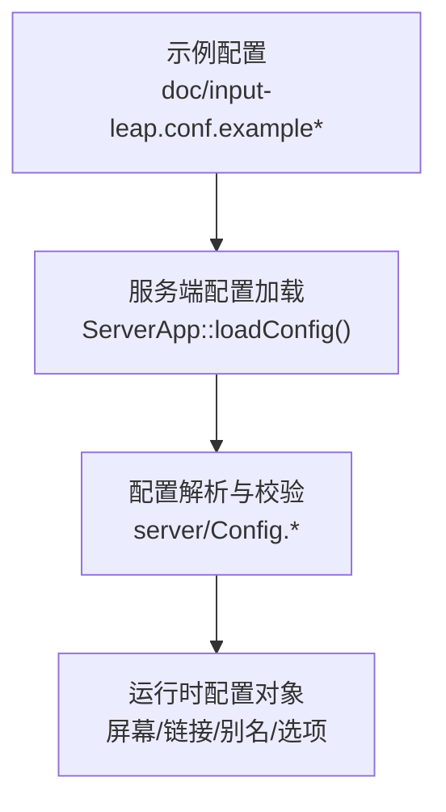
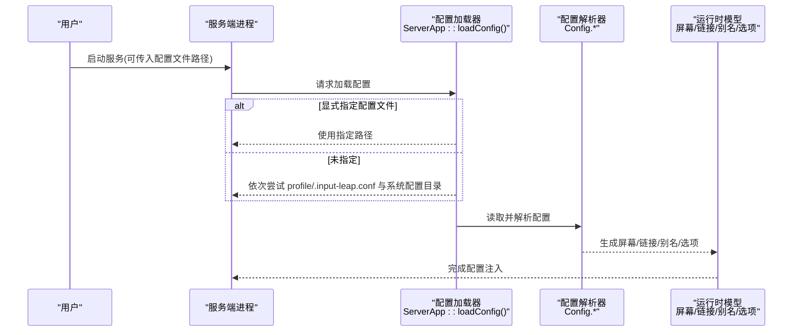
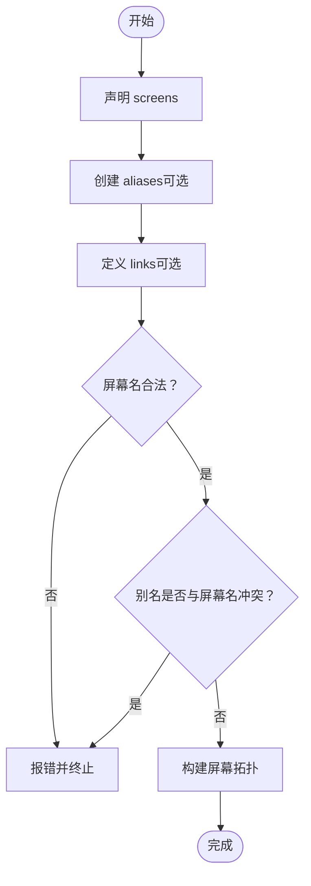

# 配置参数参考

<cite>
**本文引用的文件**   
- [Config.cpp](file://src/lib/server/Config.cpp)
- [ServerApp.cpp](file://src/lib/inputleap/ServerApp.cpp)
- [input-leap.conf.example](file://doc/input-leap.conf.example)
- [input-leap.conf.example-basic](file://doc/input-leap.conf.example-basic)
- [input-leap.conf.example-advanced](file://doc/input-leap.conf.example-advanced)
- [input-leap.conf.example-barebones](file://doc/input-leap.conf.example-barebones)
</cite>

## 目录
1. [简介](#简介)
2. [项目结构](#项目结构)
3. [核心组件](#核心组件)
4. [架构总览](#架构总览)
5. [详细组件分析](#详细组件分析)
6. [依赖关系分析](#依赖关系分析)
7. [性能与行为特性](#性能与行为特性)
8. [故障排查指南](#故障排查指南)
9. [结论](#结论)
10. [附录：参数参考表](#附录参数参考表)

## 简介
本参考文档聚焦于 Input Leap 的配置系统，系统化梳理并说明配置参数的名称、类型、默认值、取值范围与描述；按功能模块分组组织（screens、links、aliases、security、network 等）；阐明参数优先级与继承关系；提供参数验证规则与兼容性信息；并总结参数间的依赖关系与约束条件。读者无需深入源码即可理解如何编写和维护配置文件。

## 项目结构
Input Leap 的配置文件由服务端加载与解析，示例配置文件位于 doc 目录下，包含基础、进阶与极简模板，便于快速上手与扩展。

图示来源
- [ServerApp.cpp:196-238](file://src/lib/inputleap/ServerApp.cpp#L196-L238)
- [Config.cpp:1-200](file://src/lib/server/Config.cpp#L1-L200)

章节来源
- [ServerApp.cpp:196-238](file://src/lib/inputleap/ServerApp.cpp#L196-L238)
- [input-leap.conf.example](file://doc/input-leap.conf.example)
- [input-leap.conf.example-basic](file://doc/input-leap.conf.example-basic)
- [input-leap.conf.example-advanced](file://doc/input-leap.conf.example-advanced)
- [input-leap.conf.example-barebones](file://doc/input-leap.conf.example-barebones)

## 核心组件
- 配置加载器：负责定位与读取配置文件路径，支持用户指定与默认路径回退。
- 配置模型：维护屏幕、链接、别名与选项集合，并提供增删改查接口。
- 配置解析器：将文本配置转换为内部模型，并进行语法与语义校验。
- 错误处理：在解析失败时输出带行号的错误信息，便于定位问题。

章节来源
- [ServerApp.cpp:196-238](file://src/lib/inputleap/ServerApp.cpp#L196-L238)
- [Config.cpp:1-200](file://src/lib/server/Config.cpp#L1-L200)
- [Config.cpp:2232-2252](file://src/lib/server/Config.cpp#L2232-L2252)

## 架构总览
下图展示了从配置文件到运行时的关键流程：服务端启动后根据命令行或默认路径加载配置，解析为内存模型，随后用于构建屏幕拓扑与连接关系。

图示来源
- [ServerApp.cpp:196-238](file://src/lib/inputleap/ServerApp.cpp#L196-L238)
- [Config.cpp:1-200](file://src/lib/server/Config.cpp#L1-L200)

## 详细组件分析

### 模块：screens（屏幕定义）
- 作用：声明逻辑屏幕名称，作为 links 与 aliases 中的引用实体。
- 语法要点：
  - section: screens 块内每行一个屏幕名。
  - 屏幕名需满足命名规范（见“参数验证规则”）。
- 示例位置：
  - [input-leap.conf.example](file://doc/input-leap.conf.example)
  - [input-leap.conf.example-basic](file://doc/input-leap.conf.example-basic)
  - [input-leap.conf.example-advanced](file://doc/input-leap.conf.example-advanced)
  - [input-leap.conf.example-barebones](file://doc/input-leap.conf.example-barebones)

章节来源
- [input-leap.conf.example](file://doc/input-leap.conf.example)
- [input-leap.conf.example-basic](file://doc/input-leap.conf.example-basic)
- [input-leap.conf.example-advanced](file://doc/input-leap.conf.example-advanced)
- [input-leap.conf.example-barebones](file://doc/input-leap.conf.example-barebones)
- [Config.cpp:332-387](file://src/lib/server/Config.cpp#L332-L387)

### 模块：links（屏幕连接与相对位置）
- 作用：定义屏幕之间的相邻关系与边界区间，决定鼠标跨屏移动的路径与落点。
- 语法要点：
  - section: links 块内以屏幕名为键，其下声明方向与目标屏幕。
  - 方向关键字：left、right、up、top、down、bottom。
  - 可选边界区间：可在方向后附加 (start, end) 表示有效区间，数值通常为百分比形式。
  - 对称性建议：若 A 的 right = B，则 B 的 left = A，以保证双向连通。
- 示例位置：
  - [input-leap.conf.example](file://doc/input-leap.conf.example)
  - [input-leap.conf.example-advanced](file://doc/input-leap.conf.example-advanced)

章节来源
- [input-leap.conf.example](file://doc/input-leap.conf.example)
- [input-leap.conf.example-advanced](file://doc/input-leap.conf.example-advanced)
- [Config.cpp:210-258](file://src/lib/server/Config.cpp#L210-L258)

### 模块：aliases（别名映射）
- 作用：将主机实际名称映射到逻辑屏幕名，简化配置与维护。
- 语法要点：
  - section: aliases 块内以实际主机名为键，值为逻辑屏幕名。
  - 别名不得与已有屏幕名冲突。
- 示例位置：
  - [input-leap.conf.example](file://doc/input-leap.conf.example)
  - [input-leap.conf.example-basic](file://doc/input-leap.conf.example-basic)

章节来源
- [input-leap.conf.example](file://doc/input-leap.conf.example)
- [input-leap.conf.example-basic](file://doc/input-leap.conf.example-basic)
- [Config.cpp:140-195](file://src/lib/server/Config.cpp#L140-L195)

### 模块：security（安全相关）
- 现状说明：当前仓库中未发现显式的 security 配置段或参数定义。安全能力（如证书、指纹等）可能通过 GUI 或外部机制管理，不在文本配置文件中暴露。
- 建议：如需启用安全功能，请参考 GUI 设置或平台集成方式。

章节来源
- [ServerApp.cpp:196-238](file://src/lib/inputleap/ServerApp.cpp#L196-L238)

### 模块：network（网络相关）
- 现状说明：当前仓库中未发现显式的 network 配置段或参数定义。监听地址等网络参数可能在运行时通过 API 或 GUI 设置。
- 备注：代码中存在监听地址的设置接口，但未见对应的配置文件键。

章节来源
- [Config.cpp:260-264](file://src/lib/server/Config.cpp#L260-L264)

### 模块：options（通用/屏幕级选项）
- 作用：支持全局或按屏幕设置的选项键值对，具体可用选项取决于实现版本与平台。
- 语法要点：
  - 支持全局选项（无屏幕名前缀）与屏幕级选项（以屏幕名为前缀）。
  - 可通过添加、移除单个选项或清空某范围的选项。
- 示例位置：示例配置中未展示 options 用法，但接口已具备。

章节来源
- [Config.cpp:266-330](file://src/lib/server/Config.cpp#L266-L330)

## 依赖关系分析
- 屏幕名是 links 与 aliases 的基础依赖：必须先声明屏幕，再建立链接或别名。
- 别名与屏幕名的互斥：别名不得与现有屏幕名重复。
- 链接的双向一致性：虽然不强制，但推荐为每个方向建立对称链接，避免单向不可达。
- 配置加载顺序：当未显式指定配置文件时，优先加载用户 profile 下的配置文件，其次为兼容旧版隐藏文件，最后尝试系统配置目录。

图示来源
- [Config.cpp:332-387](file://src/lib/server/Config.cpp#L332-L387)
- [Config.cpp:140-195](file://src/lib/server/Config.cpp#L140-L195)
- [Config.cpp:210-258](file://src/lib/server/Config.cpp#L210-L258)

## 性能与行为特性
- 配置加载路径选择：在未显式指定配置文件时，会按固定顺序尝试多个路径，找到第一个存在的即停止。该过程对启动时间影响较小。
- 配置热重载：服务端支持在运行时重新加载配置并应用变更，便于调试与动态调整。

章节来源
- [ServerApp.cpp:196-238](file://src/lib/inputleap/ServerApp.cpp#L196-L238)

## 故障排查指南
- 常见错误：
  - 屏幕名非法：不符合命名规范会导致解析失败。
  - 别名冲突：别名与屏幕名重复会被拒绝。
  - 链接目标不存在：引用了未声明的屏幕名。
- 诊断方法：
  - 检查配置文件路径是否正确，确认是否被覆盖。
  - 查看解析错误日志，通常包含行号提示。
  - 逐步注释可疑段落，定位问题所在。

章节来源
- [Config.cpp:2232-2252](file://src/lib/server/Config.cpp#L2232-L2252)
- [Config.cpp:332-387](file://src/lib/server/Config.cpp#L332-L387)
- [Config.cpp:140-195](file://src/lib/server/Config.cpp#L140-L195)

## 结论
Input Leap 的文本配置主要围绕 screens、links、aliases 三大模块展开，辅以通用的 options 机制。命名与存在性校验严格，建议在编写配置时遵循最小化原则与对称链接约定，以提升稳定性与可维护性。对于安全与网络相关的高级参数，当前仓库未提供文本配置入口，建议结合 GUI 或平台集成方式管理。

## 附录：参数参考表

### 全局与加载相关
- 配置文件路径
  - 类型：路径字符串
  - 默认值：未显式指定时，按以下顺序查找：用户 profile 下的 input-leap.conf、用户 profile 下的 .input-leap.conf（兼容旧版）、系统配置目录下的 input-leap.conf
  - 取值范围：任意有效文件路径
  - 描述：显式指定配置文件路径；未指定时使用默认路径回退策略
  - 依赖与约束：仅服务端生效
  - 兼容性：.input-leap.conf 为历史兼容文件名
  - 章节来源
    - [ServerApp.cpp:196-238](file://src/lib/inputleap/ServerApp.cpp#L196-L238)

### 模块：screens
- 屏幕名
  - 类型：标识符（字母数字、下划线、连字符，支持域名式分段）
  - 默认值：无（必须显式声明）
  - 取值范围：符合命名规范的字符串
  - 描述：逻辑屏幕名称，供 links 与 aliases 引用
  - 依赖与约束：必须在 links 与 aliases 之前声明
  - 兼容性：大小写敏感，但内部有规范化处理
  - 章节来源
    - [input-leap.conf.example](file://doc/input-leap.conf.example)
    - [input-leap.conf.example-basic](file://doc/input-leap.conf.example-basic)
    - [input-leap.conf.example-advanced](file://doc/input-leap.conf.example-advanced)
    - [input-leap.conf.example-barebones](file://doc/input-leap.conf.example-barebones)
    - [Config.cpp:332-387](file://src/lib/server/Config.cpp#L332-L387)

### 模块：links
- 方向关键字
  - 类型：枚举
  - 默认值：无
  - 取值范围：left、right、up、top、down、bottom
  - 描述：定义屏幕相邻方向
  - 依赖与约束：目标屏幕必须已声明
  - 兼容性：top/bottom 与 up/down 语义等价
  - 章节来源
    - [input-leap.conf.example](file://doc/input-leap.conf.example)
    - [input-leap.conf.example-advanced](file://doc/input-leap.conf.example-advanced)
    - [Config.cpp:210-258](file://src/lib/server/Config.cpp#L210-L258)

- 边界区间 (start, end)
  - 类型：浮点数对
  - 默认值：无（省略时表示全边界）
  - 取值范围：通常为百分比形式的数值
  - 描述：限定跨屏的有效区间，控制鼠标进入目标屏幕的具体位置
  - 依赖与约束：仅在支持区间的方向上有效
  - 兼容性：不同平台可能有差异
  - 章节来源
    - [input-leap.conf.example-advanced](file://doc/input-leap.conf.example-advanced)
    - [Config.cpp:210-258](file://src/lib/server/Config.cpp#L210-L258)

### 模块：aliases
- 别名映射
  - 类型：键值对（实际主机名 -> 逻辑屏幕名）
  - 默认值：无
  - 取值范围：合法的主机名与已声明的屏幕名
  - 描述：将真实主机名映射到逻辑屏幕名，简化配置
  - 依赖与约束：别名不得与屏幕名重复；目标屏幕必须已声明
  - 兼容性：支持多平台主机名格式
  - 章节来源
    - [input-leap.conf.example](file://doc/input-leap.conf.example)
    - [input-leap.conf.example-basic](file://doc/input-leap.conf.example-basic)
    - [Config.cpp:140-195](file://src/lib/server/Config.cpp#L140-L195)

### 模块：security
- 状态：未在文本配置中暴露
- 说明：安全相关能力可能通过 GUI 或平台集成管理
- 章节来源
  - [ServerApp.cpp:196-238](file://src/lib/inputleap/ServerApp.cpp#L196-L238)

### 模块：network
- 状态：未在文本配置中暴露
- 说明：监听地址等参数可通过运行时接口设置
- 章节来源
  - [Config.cpp:260-264](file://src/lib/server/Config.cpp#L260-L264)

### 模块：options（通用/屏幕级选项）
- 全局选项
  - 类型：键值对（OptionID -> OptionValue）
  - 默认值：无
  - 取值范围：由实现定义的选项集合
  - 描述：作用于所有屏幕的全局配置项
  - 依赖与约束：需在配置模型中注册对应选项
  - 章节来源
    - [Config.cpp:266-330](file://src/lib/server/Config.cpp#L266-L330)

- 屏幕级选项
  - 类型：键值对（OptionID -> OptionValue），以屏幕名为前缀
  - 默认值：无
  - 取值范围：由实现定义的选项集合
  - 描述：针对特定屏幕的配置项
  - 依赖与约束：目标屏幕必须已声明
  - 章节来源
    - [Config.cpp:266-330](file://src/lib/server/Config.cpp#L266-L330)