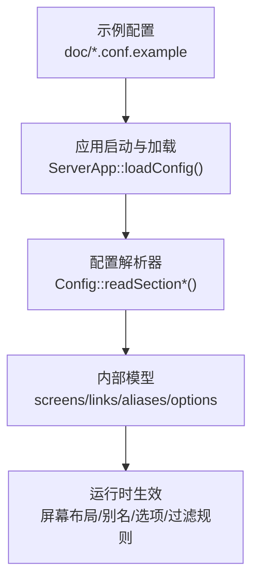
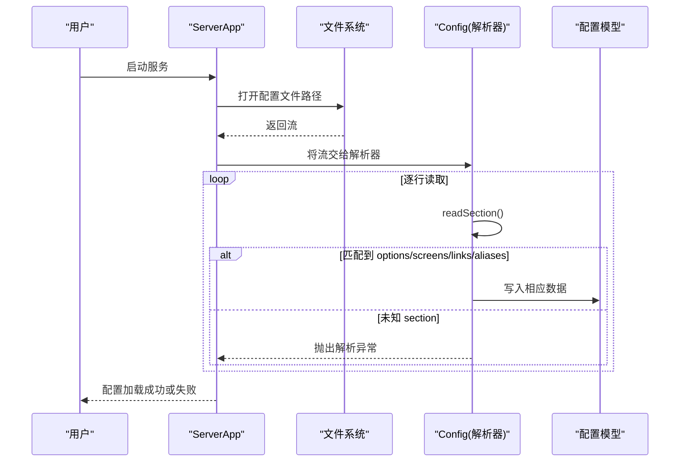
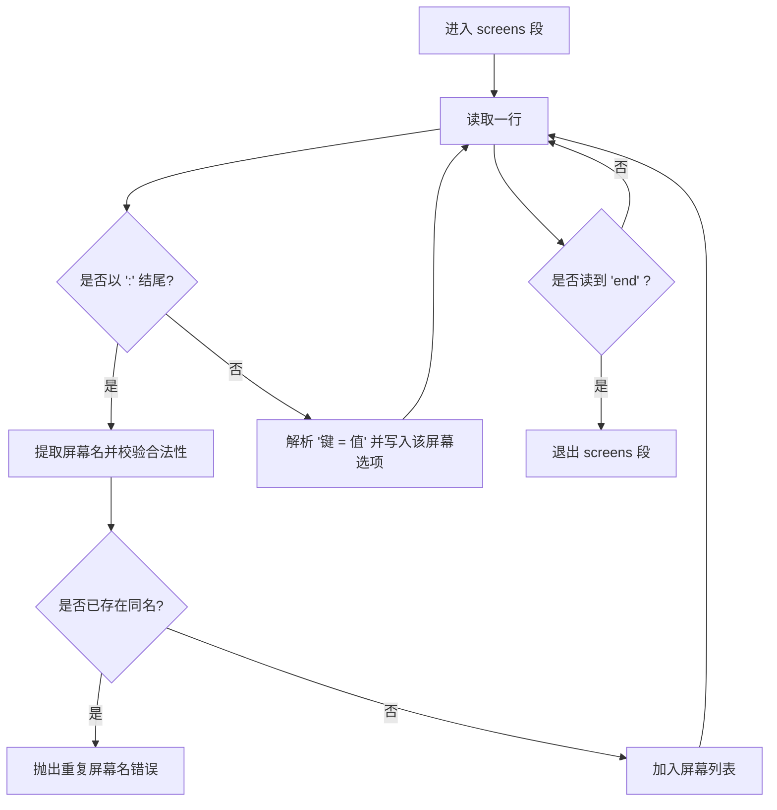
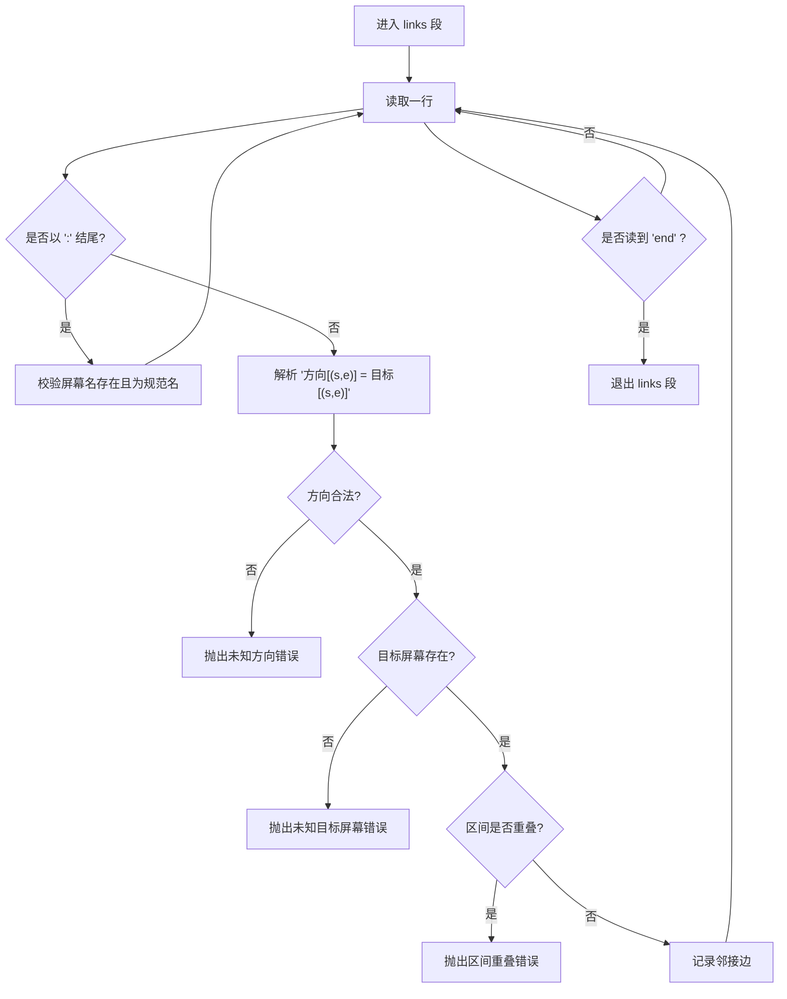
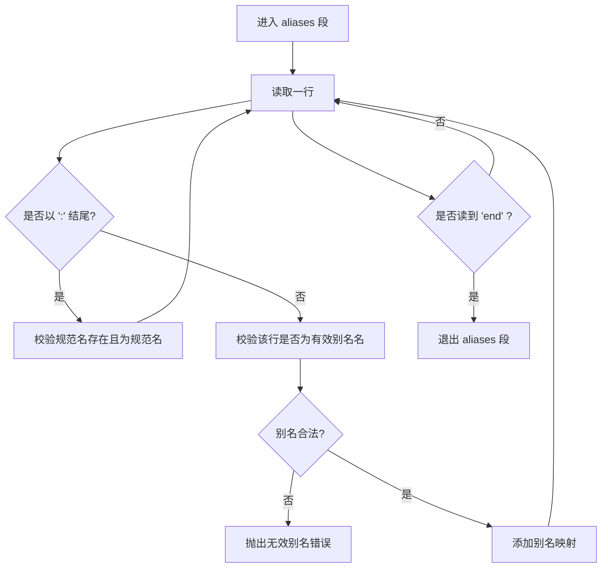
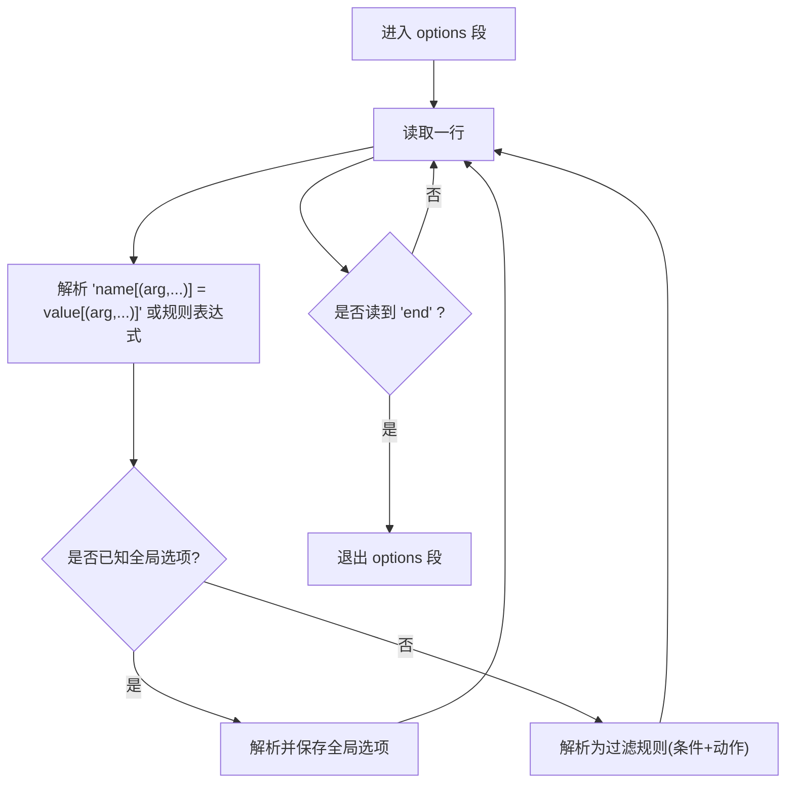
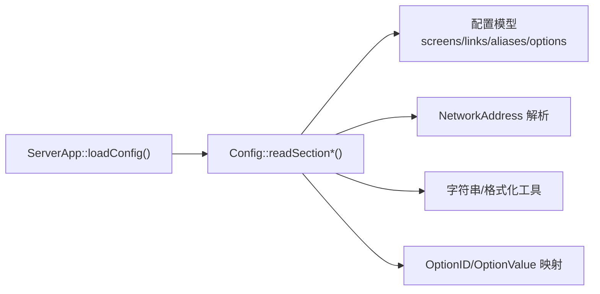

# 配置文件语法

<cite>
**本文引用的文件**   
- [Config.cpp](file://src/lib/server/Config.cpp)
- [Config.h](file://src/lib/server/Config.h)
- [ServerApp.cpp](file://src/lib/inputleap/ServerApp.cpp)
- [input-leap.conf.example](file://doc/input-leap.conf.example)
- [input-leap.conf.example-basic](file://doc/input-leap.conf.example-basic)
- [input-leap.conf.example-advanced](file://doc/input-leap.conf.example-advanced)
</cite>

## 目录
1. [简介](#简介)
2. [项目结构](#项目结构)
3. [核心组件](#核心组件)
4. [架构总览](#架构总览)
5. [详细组件分析](#详细组件分析)
6. [依赖关系分析](#依赖关系分析)
7. [性能与行为特性](#性能与行为特性)
8. [故障排查指南](#故障排查指南)
9. [结论](#结论)
10. [附录：语法速查与最佳实践](#附录语法速查与最佳实践)

## 简介
本文件为 Input Leap 的配置文件语法提供完整参考，涵盖 section 定义、参数格式、注释与缩进规则、section 结构与嵌套关系、配置项命名约定、数据类型与校验规则、错误处理与调试方法，以及语法检查工具与最佳实践建议。内容基于源码解析逻辑与示例配置文件整理而成，旨在帮助读者准确编写和维护配置文件。

## 项目结构
Input Leap 的配置文件由服务器端加载并解析，核心解析逻辑位于服务端配置模块中；示例配置文件位于文档目录，便于快速上手和对照验证。

图示来源
- [ServerApp.cpp:196-272](file://src/lib/inputleap/ServerApp.cpp#L196-L272)
- [Config.cpp:610-657](file://src/lib/server/Config.cpp#L610-L657)

章节来源
- [ServerApp.cpp:196-272](file://src/lib/inputleap/ServerApp.cpp#L196-L272)
- [Config.cpp:610-657](file://src/lib/server/Config.cpp#L610-L657)

## 核心组件
- 配置加载入口：负责查找并打开配置文件，将其交给解析器处理。
- 配置解析器：按行读取、识别 section 头、分发到对应 section 解析函数，完成键值对、链接、别名等语义解析与校验。
- 配置模型：维护屏幕名称、别名映射、相邻连接（含区间）、全局与屏幕级选项、输入过滤规则等。

章节来源
- [ServerApp.cpp:196-272](file://src/lib/inputleap/ServerApp.cpp#L196-L272)
- [Config.cpp:610-657](file://src/lib/server/Config.cpp#L610-L657)
- [Config.h:62-148](file://src/lib/server/Config.h#L62-L148)

## 架构总览
下图展示了从“配置文件”到“运行期配置对象”的关键流程。

图示来源
- [ServerApp.cpp:196-272](file://src/lib/inputleap/ServerApp.cpp#L196-L272)
- [Config.cpp:610-657](file://src/lib/server/Config.cpp#L610-L657)

## 详细组件分析

### 通用语法规则
- 文件组织
  - 使用 section 块组织配置，每个块以“section: <name>”开头，以单独一行的“end”结束。
  - 支持多段顺序出现，常见包括 screens、links、aliases、options。
- 注释
  - 以“#”开头的整行注释，可出现在任何允许语法的位置。
- 空白与缩进
  - 空格与制表符在多数位置被忽略；示例中使用缩进提升可读性，但并非强制。
- 行尾与分隔符
  - 不同 section 使用不同的分隔符（如“=”、“:”、“,”、“;”），具体见各 section 小节。
- 大小写与名称规范
  - 屏幕名比较时不区分大小写，但保留原始大小写用于显示；名称需符合域名片段规则（字母数字与下划线，分段以点号分隔）。

章节来源
- [Config.cpp:610-657](file://src/lib/server/Config.cpp#L610-L657)
- [Config.cpp:332-370](file://src/lib/server/Config.cpp#L332-L370)
- [input-leap.conf.example:1-5](file://doc/input-leap.conf.example#L1-L5)

### Section: screens
- 作用：声明所有可用的屏幕（主机）逻辑名。
- 语法要点
  - 每行一个屏幕名，末尾带冒号“:”。
  - 可在屏幕名下设置该屏幕的局部选项（键=值）。
  - 屏幕名必须唯一且合法。
- 命名约定与校验
  - 屏幕名需满足“有效名称”规则（见下方“命名约定与校验”）。
  - 重复声明会报错。
- 支持的屏幕级选项（节选）
  - halfDuplexCapsLock/halfDuplexNumLock/halfDuplexScrollLock：布尔
  - shift/ctrl/alt/altgr/meta/super：修饰键映射（字符串）
  - xtestIsXineramaUnaware：布尔
  - switchCorners：角切换开关组合（字符串集合）
  - switchCornerSize：整数
  - preserveFocus：布尔
- 示例参考
  - [input-leap.conf.example-basic](file://doc/input-leap.conf.example-basic)

图示来源
- [Config.cpp:782-891](file://src/lib/server/Config.cpp#L782-L891)

章节来源
- [Config.cpp:782-891](file://src/lib/server/Config.cpp#L782-L891)
- [input-leap.conf.example-basic:10-17](file://doc/input-leap.conf.example-basic#L10-L17)

### Section: links
- 作用：定义屏幕之间的相邻关系与过渡区间。
- 语法要点
  - 先以“屏幕名:”开启某屏幕的邻接定义块。
  - 在该块内，每行定义一条边：方向[(起始,结束)] = 目标屏幕[(起始,结束)]。
  - 方向仅支持 left/right/up/down。
  - 可选区间“(s,e)”表示百分比范围，取值[0,100]，要求 s<e；省略时表示全区间。
- 约束与校验
  - 当前屏幕必须是已在 screens 中声明的“规范名”，不允许在此处使用别名。
  - 目标屏幕必须存在。
  - 同一侧区间不能重叠。
- 示例参考
  - [input-leap.conf.example](file://doc/input-leap.conf.example)
  - [input-leap.conf.example-advanced](file://doc/input-leap.conf.example-advanced)

图示来源
- [Config.cpp:893-964](file://src/lib/server/Config.cpp#L893-L964)
- [Config.cpp:2012-2039](file://src/lib/server/Config.cpp#L2012-L2039)

章节来源
- [Config.cpp:893-964](file://src/lib/server/Config.cpp#L893-L964)
- [Config.cpp:2012-2039](file://src/lib/server/Config.cpp#L2012-L2039)
- [input-leap.conf.example:13-31](file://doc/input-leap.conf.example#L13-L31)
- [input-leap.conf.example-advanced:29-41](file://doc/input-leap.conf.example-advanced#L29-L41)

### Section: aliases
- 作用：为已在 screens 中定义的“规范名”建立别名映射，便于在其它地方使用更易读的名称。
- 语法要点
  - 以“规范名:”开启别名块。
  - 其下列出若干别名，每行一个。
- 约束与校验
  - 规范名必须在 screens 中声明且为规范名。
  - 别名必须满足“有效名称”规则。
  - 别名不可与现有屏幕名冲突。
- 示例参考
  - [input-leap.conf.example](file://doc/input-leap.conf.example)
  - [input-leap.conf.example-basic](file://doc/input-leap.conf.example-basic)

图示来源
- [Config.cpp:966-1000](file://src/lib/server/Config.cpp#L966-L1000)

章节来源
- [Config.cpp:966-1000](file://src/lib/server/Config.cpp#L966-L1000)
- [input-leap.conf.example:33-37](file://doc/input-leap.conf.example#L33-L37)
- [input-leap.conf.example-basic:35-39](file://doc/input-leap.conf.example-basic#L35-L39)

### Section: options
- 作用：定义全局选项与输入过滤规则。
- 语法要点
  - 支持两类条目：
    - 全局选项：形如 name = value 或 name(arg,...) = value[,value...]
    - 过滤规则：形如 condition(args) action(args); deactivate_action(args)
  - 条件与动作通过括号传参，逗号分隔多个参数。
  - 激活动作与停用动作用分号“;”分隔。
- 内置全局选项（节选）
  - address：监听地址（字符串）
  - heartbeat：心跳间隔（整数）
  - switchCorners：角切换开关组合（字符串集合）
  - switchCornerSize：角切换尺寸（整数）
  - switchDelay：切换延迟（整数）
  - switchDoubleTap：双击切换（整数）
  - switchNeedsShift/switchNeedsControl/switchNeedsAlt：布尔
  - screenSaverSync：布尔
  - relativeMouseMoves：布尔
  - win32KeepForeground：布尔
  - clipboardSharing：布尔
  - clipboardSharingSize：整数
- 过滤规则
  - 条件部分支持多种条件类型（例如键盘广播控制等），动作包含 on/off/toggle 等模式，并可指定目标屏幕集。
- 示例参考
  - 参见示例文件中 options 段的使用方式（若需要，可参考高级示例中的相关用法）。

图示来源
- [Config.cpp:659-780](file://src/lib/server/Config.cpp#L659-L780)

章节来源
- [Config.cpp:659-780](file://src/lib/server/Config.cpp#L659-L780)

### 命名约定与校验
- 屏幕名与别名
  - 由若干“段”组成，段之间以点号分隔；每段首尾字符为字母数字或下划线，中间可为字母数字、下划线或连字符。
  - 允许末尾带一个点号（兼容某些系统习惯）。
  - 空名非法。
- 大小写策略
  - 比较时不区分大小写，但保留原始大小写用于展示。
- 冲突检测
  - 屏幕名与别名共享命名空间，不得重复。

章节来源
- [Config.cpp:332-370](file://src/lib/server/Config.cpp#L332-L370)
- [Config.h:52-61](file://src/lib/server/Config.h#L52-L61)

### 数据类型与验证规则
- 布尔值：true/false
- 整数：十进制整数
- 字符串：直接文本
- 修饰键映射：shift/ctrl/alt/altgr/meta/super 等
- 角切换集合：none/top-left/top-right/bottom-left/bottom-right 的组合（加号拼接）
- 区间：两个 0~100 的整数，要求 start < end；省略时默认 (0,100)
- 地址：主机名或网络地址字符串，需可解析

章节来源
- [Config.cpp:1266-1414](file://src/lib/server/Config.cpp#L1266-L1414)
- [Config.cpp:2012-2039](file://src/lib/server/Config.cpp#L2012-L2039)
- [Config.cpp:681-739](file://src/lib/server/Config.cpp#L681-L739)

### 错误处理与调试
- 错误类型
  - 解析阶段抛出统一的“读取错误”异常，附带行号与上下文信息。
- 常见错误场景
  - 未知 section 名称
  - 段外数据
  - 缺失必要分隔符（如缺少“=”、“)”等）
  - 未知参数或动作
  - 未知屏幕名或别名
  - 区间重叠或区间值非法
- 调试建议
  - 逐步缩小问题范围：先最小化配置，再逐项恢复。
  - 关注错误消息中的行号提示，定位具体语句。
  - 使用示例配置作为基线进行对比。

章节来源
- [Config.cpp:2234-2252](file://src/lib/server/Config.cpp#L2234-L2252)
- [Config.cpp:610-657](file://src/lib/server/Config.cpp#L610-L657)
- [Config.cpp:681-780](file://src/lib/server/Config.cpp#L681-L780)
- [Config.cpp:893-964](file://src/lib/server/Config.cpp#L893-L964)
- [Config.cpp:966-1000](file://src/lib/server/Config.cpp#L966-L1000)

### 语法检查工具与最佳实践
- 语法检查
  - 使用官方提供的示例配置文件作为模板与对照基准。
  - 借助 GUI 配置界面生成或导出配置，减少手写错误。
- 最佳实践
  - 优先使用 screens + aliases 分离“逻辑名”与“真实主机名”，提高可读性与可移植性。
  - links 中尽量显式写出双向连接，避免遗漏导致切换异常。
  - 谨慎使用区间参数，确保左右两侧区间不重叠。
  - 合理设置全局选项（如 heartbeat、switchDelay），平衡响应性与稳定性。
  - 保持配置整洁：适当缩进、添加注释，便于团队协作与维护。

章节来源
- [input-leap.conf.example](file://doc/input-leap.conf.example)
- [input-leap.conf.example-basic](file://doc/input-leap.conf.example-basic)
- [input-leap.conf.example-advanced](file://doc/input-leap.conf.example-advanced)

## 依赖关系分析
- 加载与解析
  - ServerApp 负责选择配置文件路径并打开文件流，随后交由 Config 解析器处理。
- 解析器与模型
  - Config 解析器根据 section 名称分发到对应解析函数，填充内部模型（屏幕、别名、链接、选项、过滤规则）。
- 外部依赖
  - 网络地址解析、平台无关字符串工具、协议与选项类型定义等。

图示来源
- [ServerApp.cpp:196-272](file://src/lib/inputleap/ServerApp.cpp#L196-L272)
- [Config.cpp:610-657](file://src/lib/server/Config.cpp#L610-L657)
- [Config.h:62-148](file://src/lib/server/Config.h#L62-L148)

章节来源
- [ServerApp.cpp:196-272](file://src/lib/inputleap/ServerApp.cpp#L196-L272)
- [Config.cpp:610-657](file://src/lib/server/Config.cpp#L610-L657)
- [Config.h:62-148](file://src/lib/server/Config.h#L62-L148)

## 性能与行为特性
- 解析复杂度
  - 线性扫描逐行解析，时间复杂度近似 O(N)，N 为配置行数。
- 内存占用
  - 主要存储屏幕名、别名映射、邻接边与选项，规模通常较小。
- 行为特性
  - 名称比较不区分大小写，但保留原始大小写。
  - 链接区间采用百分比归一化，便于跨分辨率适配。

[本节为一般性讨论，无需列出具体文件来源]

## 故障排查指南
- 常见问题定位
  - “未知 section 名称”：检查 section 关键字拼写。
  - “段外数据”：确认所有配置均置于 section 块内。
  - “缺失分隔符”：补全“=”、“)”等必需符号。
  - “未知屏幕名/别名”：确认已在 screens 中声明。
  - “区间重叠/非法”：调整 links 中的区间范围。
- 调试步骤
  - 启用日志输出，观察加载路径与解析过程。
  - 使用最小可行配置复现问题，逐步增加内容定位。
  - 对比官方示例，核对语法差异。

章节来源
- [ServerApp.cpp:196-272](file://src/lib/inputleap/ServerApp.cpp#L196-L272)
- [Config.cpp:2234-2252](file://src/lib/server/Config.cpp#L2234-L2252)

## 结论
Input Leap 的配置文件采用清晰的 section 化结构，配合严格的语法与校验规则，能够稳定地表达屏幕拓扑、别名映射与运行选项。遵循本文的语法说明与最佳实践，可显著降低配置错误率并提升可维护性。

[本节为总结性内容，无需列出具体文件来源]

## 附录：语法速查与最佳实践
- 基本结构
  - section: <name> ... end
- 常用 section
  - screens：声明屏幕名与屏幕级选项
  - links：定义屏幕间相邻关系与过渡区间
  - aliases：为屏幕名建立别名
  - options：全局选项与输入过滤规则
- 关键语法
  - 注释：# 行注释
  - 键值：name = value
  - 参数：name(arg1,arg2) = value
  - 链接：direction[(s,e)] = target[(s,e)]
  - 区间：0~100 的整数，start < end
- 推荐做法
  - 使用别名隐藏复杂主机名
  - 显式双向链接，避免遗漏
  - 合理设置切换延迟与心跳
  - 保持配置可读性与一致性

[本节为概览性内容，无需列出具体文件来源]