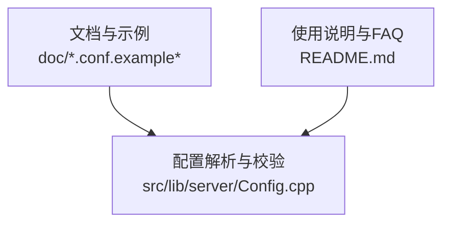
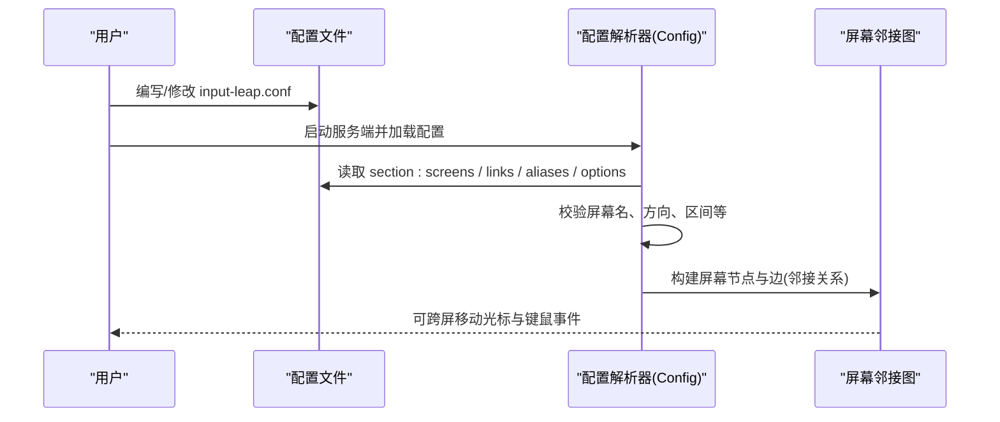
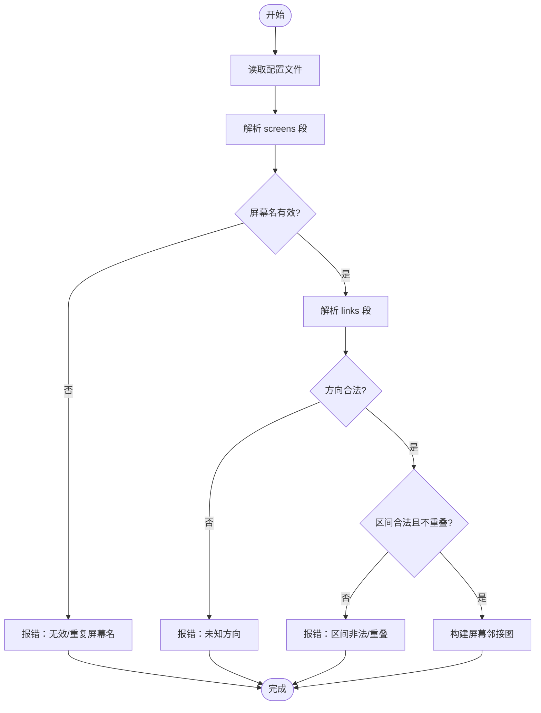
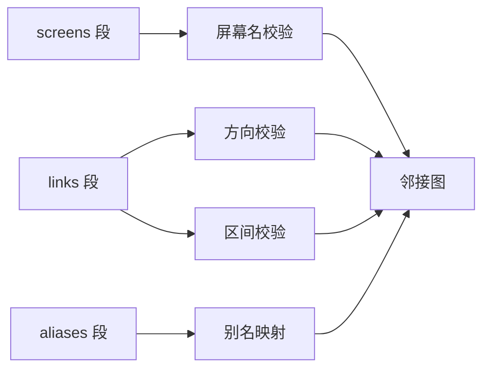

# 基础配置示例

<cite>
**本文引用的文件**   
- [doc/input-leap.conf.example-barebones](file://doc/input-leap.conf.example-barebones)
- [doc/input-leap.conf.example-basic](file://doc/input-leap.conf.example-basic)
- [doc/input-leap.conf.example](file://doc/input-leap.conf.example)
- [README.md](file://README.md)
- [src/lib/server/Config.cpp](file://src/lib/server/Config.cpp)
</cite>

## 目录
1. [简介](#简介)
2. [项目结构](#项目结构)
3. [核心组件](#核心组件)
4. [架构总览](#架构总览)
5. [详细组件分析](#详细组件分析)
6. [依赖分析](#依赖分析)
7. [性能考虑](#性能考虑)
8. [故障排查指南](#故障排查指南)
9. [结论](#结论)
10. [附录](#附录)

## 简介
本章节面向初次使用 Input Leap 的用户，提供“最小可用”的基础配置示例与说明。你将学会：
- 如何用最少的配置实现两台计算机之间的键盘鼠标共享
- screens 与 links 两部分的基本语法（屏幕名称定义、相对位置设置）
- 快速测试用的 barebones 最小化配置
- 常见配置错误及解决方法

## 项目结构
Input Leap 的配置文件示例位于 doc 目录下，包含从最简到进阶的多套模板；解析与校验逻辑在服务器端配置模块中实现。

图表来源
- [doc/input-leap.conf.example-barebones:1-18](file://doc/input-leap.conf.example-barebones#L1-L18)
- [doc/input-leap.conf.example-basic:1-40](file://doc/input-leap.conf.example-basic#L1-L40)
- [doc/input-leap.conf.example:1-38](file://doc/input-leap.conf.example#L1-L38)
- [src/lib/server/Config.cpp:626-656](file://src/lib/server/Config.cpp#L626-L656)
- [README.md:48-63](file://README.md#L48-L63)

章节来源
- [doc/input-leap.conf.example-barebones:1-18](file://doc/input-leap.conf.example-barebones#L1-L18)
- [doc/input-leap.conf.example-basic:1-40](file://doc/input-leap.conf.example-basic#L1-L40)
- [doc/input-leap.conf.example:1-38](file://doc/input-leap.conf.example#L1-L38)
- [README.md:48-63](file://README.md#L48-L63)

## 核心组件
- 配置文件由若干 section 组成，常用包括：
  - section: screens —— 声明所有参与共享的屏幕（主机）名称
  - section: links —— 定义屏幕之间的相邻关系与方向（left/right/up/down），可选区间参数
  - section: aliases —— 为屏幕名设置别名（便于映射真实主机名）
  - section: options —— 全局或屏幕级选项（如监听地址等）
- 解析器会按顺序读取各 section，并在遇到未知 section 或语法错误时抛出明确的配置读取异常。

章节来源
- [src/lib/server/Config.cpp:626-656](file://src/lib/server/Config.cpp#L626-L656)
- [src/lib/server/Config.cpp:783-891](file://src/lib/server/Config.cpp#L783-L891)
- [src/lib/server/Config.cpp:894-964](file://src/lib/server/Config.cpp#L894-L964)
- [src/lib/server/Config.cpp:967-1000](file://src/lib/server/Config.cpp#L967-L1000)

## 架构总览
下图展示了“用户编辑配置文件 → 服务端解析 → 建立屏幕邻接图”的流程。

图表来源
- [src/lib/server/Config.cpp:626-656](file://src/lib/server/Config.cpp#L626-L656)
- [src/lib/server/Config.cpp:783-891](file://src/lib/server/Config.cpp#L783-L891)
- [src/lib/server/Config.cpp:894-964](file://src/lib/server/Config.cpp#L894-L964)

## 详细组件分析

### 最简单的双机连接（barebones 最小化配置）
适用场景：快速验证两台电脑能否共享键鼠。只需定义两个屏幕，并互为左右邻居即可。

- 基本步骤
  - 在每台机器上安装并运行 Input Leap
  - 将其中一台设为服务器，另一台设为客户端
  - 在服务器上选择“使用现有配置”，并将 barebones 配置保存为 input-leap.conf
  - 根据实际物理摆放，决定 left/right 是否要互换
  - 确保屏幕名称与 GUI 显示的屏幕名一致（大小写敏感）

- 参考示例路径
  - [doc/input-leap.conf.example-barebones:1-18](file://doc/input-leap.conf.example-barebones#L1-L18)

- 关键要点
  - screens 段仅列出两个屏幕名
  - links 段让两者互为邻居（一个 left=对方，另一个 right=对方）
  - 若光标无法跨屏，尝试交换 left/right

章节来源
- [doc/input-leap.conf.example-barebones:1-18](file://doc/input-leap.conf.example-barebones#L1-L18)
- [README.md:48-63](file://README.md#L48-L63)

### screens 与 links 基本语法
- screens 段
  - 每行以“屏幕名:”的形式声明一个屏幕
  - 屏幕名需符合命名规则（见后文“常见错误”）
  - 可在屏幕名下追加属性（例如修饰键映射、切换角等），但 barebones 不需要

- links 段
  - 针对每个屏幕，声明其四个方向的邻居：left、right、up、down
  - 支持可选区间参数 (start,end)，取值范围 0~100，且 start < end；未指定时默认覆盖整条边
  - 同一侧不允许重叠区间

- 参考示例路径
  - 三机布局示例（含 up/down）：[doc/input-leap.conf.example:1-38](file://doc/input-leap.conf.example#L1-L38)
  - 带别名与更复杂布局示例：[doc/input-leap.conf.example-basic:1-40](file://doc/input-leap.conf.example-basic#L1-L40)

- 解析与校验关键点
  - 未知 section 名会被拒绝
  - 屏幕名无效或重复会报错
  - links 中方向必须为 left/right/up/down
  - 区间不合法或重叠会报错

章节来源
- [src/lib/server/Config.cpp:626-656](file://src/lib/server/Config.cpp#L626-L656)
- [src/lib/server/Config.cpp:783-891](file://src/lib/server/Config.cpp#L783-L891)
- [src/lib/server/Config.cpp:894-964](file://src/lib/server/Config.cpp#L894-L964)
- [src/lib/server/Config.cpp:2012-2039](file://src/lib/server/Config.cpp#L2012-L2039)

### 屏幕名称与别名（aliases）
- 屏幕名用于在 screens 和 links 中引用，必须唯一且符合命名规范
- aliases 可将真实主机名映射为易记的逻辑名，方便维护
- 注意：links 段中应使用主名（canonical name），而非别名

章节来源
- [doc/input-leap.conf.example-basic:35-40](file://doc/input-leap.conf.example-basic#L35-L40)
- [src/lib/server/Config.cpp:967-1000](file://src/lib/server/Config.cpp#L967-L1000)
- [src/lib/server/Config.cpp:910-916](file://src/lib/server/Config.cpp#L910-L916)

### 配置加载流程（概念性时序）

图表来源
- [src/lib/server/Config.cpp:783-891](file://src/lib/server/Config.cpp#L783-L891)
- [src/lib/server/Config.cpp:894-964](file://src/lib/server/Config.cpp#L894-L964)
- [src/lib/server/Config.cpp:2012-2039](file://src/lib/server/Config.cpp#L2012-L2039)

## 依赖分析
- 配置解析器对以下部分强依赖：
  - 屏幕名有效性检查（正则/字符集约束）
  - 链接方向集合 {left,right,up,down}
  - 区间解析与边界检查（0~100，start < end）
  - 别名映射（仅在 aliases 段生效，links 段要求主名）

图表来源
- [src/lib/server/Config.cpp:783-891](file://src/lib/server/Config.cpp#L783-L891)
- [src/lib/server/Config.cpp:894-964](file://src/lib/server/Config.cpp#L894-L964)
- [src/lib/server/Config.cpp:967-1000](file://src/lib/server/Config.cpp#L967-L1000)

章节来源
- [src/lib/server/Config.cpp:783-891](file://src/lib/server/Config.cpp#L783-L891)
- [src/lib/server/Config.cpp:894-964](file://src/lib/server/Config.cpp#L894-L964)
- [src/lib/server/Config.cpp:967-1000](file://src/lib/server/Config.cpp#L967-L1000)

## 性能考虑
- 对于 barebones 最小配置，解析开销极低，几乎无性能影响
- 当屏幕数量较多或存在大量链接时，建议保持 links 简洁，避免不必要的区间细分

## 故障排查指南
常见问题与定位方法：
- 未知 section 名
  - 现象：启动时报错提示未知 section
  - 原因：section 名称拼写错误或使用了不支持的段名
  - 解决：仅使用 screens、links、aliases、options 等已知段名
  - 相关代码位置：[src/lib/server/Config.cpp:626-656](file://src/lib/server/Config.cpp#L626-L656)

- 屏幕名无效或重复
  - 现象：报错“无效屏幕名”或“重复屏幕名”
  - 原因：屏幕名不符合命名规则或在 screens 中重复出现
  - 解决：使用字母数字、下划线与点号组成的合法名称，并确保唯一
  - 相关代码位置：[src/lib/server/Config.cpp:783-891](file://src/lib/server/Config.cpp#L783-L891)

- links 中使用别名
  - 现象：报错“此处不能使用屏幕名别名”
  - 原因：links 段要求使用主名（canonical name）
  - 解决：在 links 段改用主名，别名仅用于 aliases 段
  - 相关代码位置：[src/lib/server/Config.cpp:910-916](file://src/lib/server/Config.cpp#L910-L916)

- 未知方向或区间非法/重叠
  - 现象：报错“未知方向”、“区间非法”或“重叠区间”
  - 原因：方向不是 left/right/up/down；区间不在 0~100 或 start >= end；同侧区间重叠
  - 解决：修正方向与区间，确保 start < end 且不重叠
  - 相关代码位置：[src/lib/server/Config.cpp:894-964](file://src/lib/server/Config.cpp#L894-L964), [src/lib/server/Config.cpp:2012-2039](file://src/lib/server/Config.cpp#L2012-L2039)

- 客户端 Server IP 为空
  - 现象：客户端界面“Server IP”字段为空
  - 解决：在 options 段显式添加 serverhostname 指向服务器地址
  - 参考说明：[README.md:137-147](file://README.md#L137-L147)

章节来源
- [src/lib/server/Config.cpp:626-656](file://src/lib/server/Config.cpp#L626-L656)
- [src/lib/server/Config.cpp:783-891](file://src/lib/server/Config.cpp#L783-L891)
- [src/lib/server/Config.cpp:894-964](file://src/lib/server/Config.cpp#L894-L964)
- [src/lib/server/Config.cpp:2012-2039](file://src/lib/server/Config.cpp#L2012-L2039)
- [README.md:137-147](file://README.md#L137-L147)

## 结论
- 使用 barebones 配置可以快速验证双机共享键鼠
- 掌握 screens 与 links 的基本语法后即可扩展至多机布局
- 遇到问题时优先检查屏幕名合法性、方向与区间是否正确，以及是否在 links 中误用了别名

## 附录
- 快速上手步骤（来自 README）
  - 在所有机器上安装并运行 Input Leap
  - 将拥有键鼠的机器设为服务器
  - 在服务器 GUI 中添加屏幕，确保屏幕名与客户端显示一致（大小写敏感）
  - 在客户端输入服务器 IP 或启用自动发现，然后启动
  - 参考：[README.md:48-63](file://README.md#L48-L63)