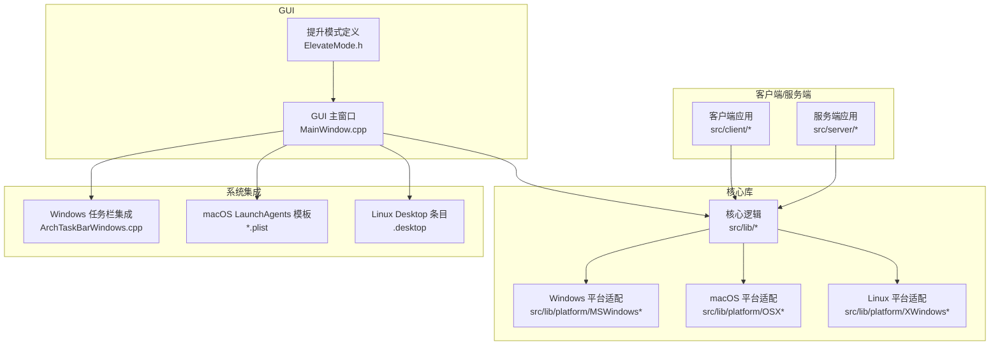
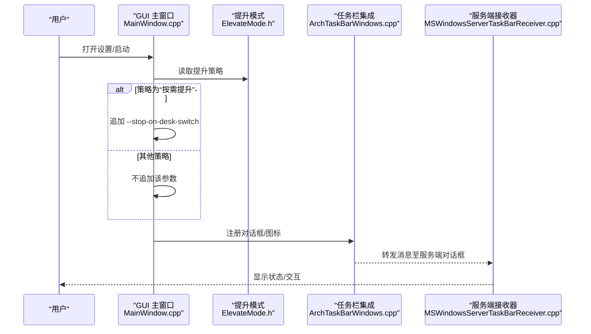
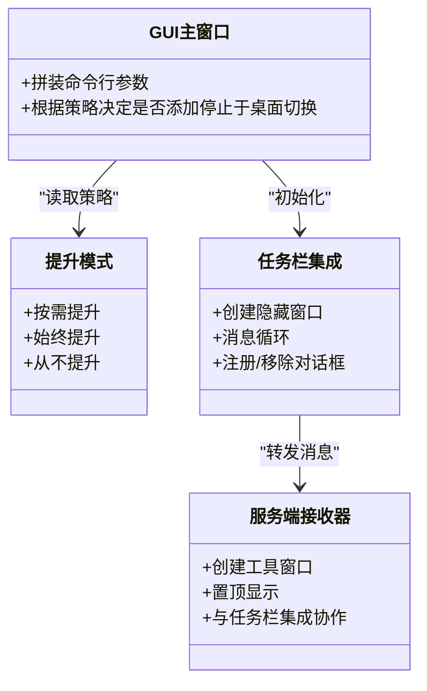
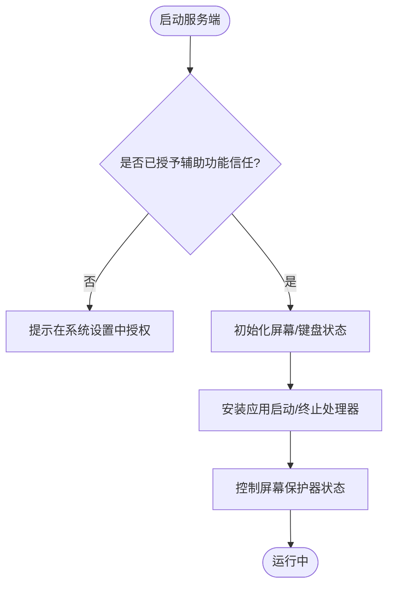
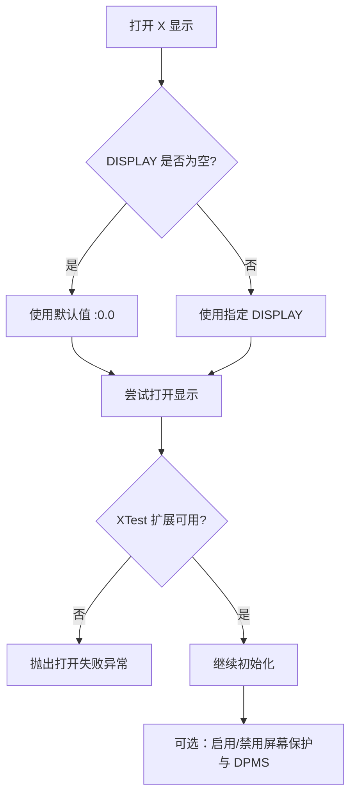
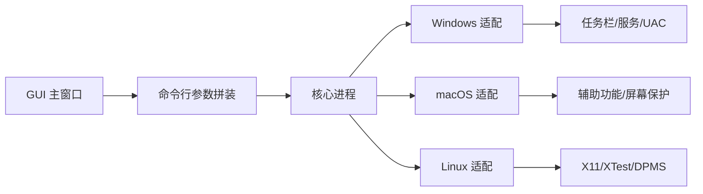

# 平台特定配置

<cite>
**本文引用的文件**   
- [README.md](file://README.md)
- [input-leap.conf.example](file://doc/input-leap.conf.example)
- [org.input-leap-foss.org.inputleaps.plist](file://doc/org.input-leap-foss.org.inputleaps.plist)
- [org.input-leap-foss.org.inputleapc.plist](file://doc/org.input-leap-foss.org.inputleapc.plist)
- [ElevateMode.h](file://src/gui/src/ElevateMode.h)
- [MainWindow.cpp](file://src/gui/src/MainWindow.cpp)
- [ArchTaskBarWindows.cpp](file://src/lib/arch/win32/ArchTaskBarWindows.cpp)
- [MSWindowsServerTaskBarReceiver.cpp](file://src/server/MSWindowsServerTaskBarReceiver.cpp)
- [MSWindowsClientTaskBarReceiver.cpp](file://src/client/MSWindowsClientTaskBarReceiver.cpp)
- [OSXScreen.mm](file://src/lib/platform/OSXScreen.mm)
- [OSXScreenSaver.cpp](file://src/lib/platform/OSXScreenSaver.cpp)
- [OSXScreenSaverControl.h](file://src/lib/platform/OSXScreenSaverControl.h)
- [XWindowsScreen.cpp](file://src/lib/platform/XWindowsScreen.cpp)
- [XWindowsScreenSaver.cpp](file://src/lib/platform/XWindowsScreenSaver.cpp)
- [XWindowsScreenSaver.h](file://src/lib/platform/XWindowsScreenSaver.h)
- [io.github.input_leap.input-leap.desktop](file://res/io.github.input_leap.input-leap.desktop)
</cite>

## 目录
1. [简介](#简介)
2. [项目结构](#项目结构)
3. [核心组件](#核心组件)
4. [架构总览](#架构总览)
5. [详细组件分析](#详细组件分析)
6. [依赖关系分析](#依赖关系分析)
7. [性能考虑](#性能考虑)
8. [故障排除指南](#故障排除指南)
9. [结论](#结论)
10. [附录](#附录)

## 简介
本文件面向 Windows、macOS、Linux 三大平台，提供 Input Leap 的特定配置示例与优化建议，涵盖：
- Windows：管理员权限（UAC）处理、系统托盘集成、桌面切换行为。
- macOS：辅助功能权限、菜单栏/启动代理集成、沙盒模式注意事项。
- Linux：X11/Wayland 兼容性、桌面环境集成、服务管理要点。
同时给出各平台的性能优化参数与常见问题的排查方法。

## 项目结构
Input Leap 在跨平台实现上采用“核心库 + 平台适配层 + GUI/守护进程”的分层组织方式：
- 核心逻辑位于 src/lib 下，包含网络、输入事件、剪贴板等通用能力。
- 平台适配层位于 src/lib/platform 与 src/lib/arch 下，分别封装 X11、macOS、Windows 的系统调用。
- GUI 与客户端/服务端入口位于 src/gui、src/client、src/server。
- 文档与示例配置位于 doc 目录；Linux 桌面集成条目位于 res。

图表来源
- [MainWindow.cpp:594-631](file://src/gui/src/MainWindow.cpp#L594-L631)
- [ElevateMode.h:20-41](file://src/gui/src/ElevateMode.h#L20-L41)
- [ArchTaskBarWindows.cpp:384-443](file://src/lib/arch/win32/ArchTaskBarWindows.cpp#L384-L443)
- [org.input-leap-foss.org.inputleaps.plist:1-23](file://doc/org.input-leap-foss.org.inputleaps.plist#L1-L23)
- [io.github.input_leap.input-leap.desktop:1-10](file://res/io.github.input_leap.input-leap.desktop#L1-L10)

章节来源
- [README.md:1-157](file://README.md#L1-L157)

## 核心组件
- 配置模型与示例
  - 配置文件示例定义了屏幕布局与链接关系，用于服务器端编排多屏拓扑。
- 平台适配
  - Windows：任务栏托盘、UAC/提升策略、服务化运行。
  - macOS：辅助功能信任检查、屏幕保护控制、LaunchAgents 自启动。
  - Linux：X11 显示连接、XTest 扩展校验、屏幕保护与 DPMS 控制、Desktop 集成。
- GUI 与进程管理
  - GUI 根据用户设置拼装命令行参数，包括是否启用拖放、加密、以及 Windows 下的 UAC 相关开关。

章节来源
- [input-leap.conf.example:1-38](file://doc/input-leap.conf.example#L1-L38)
- [MainWindow.cpp:594-631](file://src/gui/src/MainWindow.cpp#L594-L631)
- [ElevateMode.h:20-41](file://src/gui/src/ElevateMode.h#L20-L41)

## 架构总览
下图展示 GUI 如何驱动平台特定的行为（以 Windows 为例），并映射到实际源码位置。

图表来源
- [MainWindow.cpp:594-631](file://src/gui/src/MainWindow.cpp#L594-L631)
- [ElevateMode.h:20-41](file://src/gui/src/ElevateMode.h#L20-L41)
- [ArchTaskBarWindows.cpp:384-443](file://src/lib/arch/win32/ArchTaskBarWindows.cpp#L384-L443)
- [MSWindowsServerTaskBarReceiver.cpp:310-356](file://src/server/MSWindowsServerTaskBarReceiver.cpp#L310-L356)

## 详细组件分析

### Windows 平台
- 管理员权限与 UAC 处理
  - 提升模式由三态枚举决定：按需提升、始终提升、从不提升。GUI 在“按需提升”模式下会传递停止于桌面切换的参数，避免 UAC 弹窗导致的服务中断。
  - 进程守护与启动路径中设置了 UIAccess 标志，以改善 Windows 8+ 的 GUI 交互问题。
- 系统托盘集成
  - 通过独立的线程创建隐藏窗口与消息循环，负责任务栏图标与对话框的注册/移除，确保窗口置顶且不被任务栏遮挡。
- 服务化与后台运行
  - 提供安装/卸载服务的接口，支持将程序作为系统服务运行。

图表来源
- [ElevateMode.h:20-41](file://src/gui/src/ElevateMode.h#L20-L41)
- [MainWindow.cpp:594-631](file://src/gui/src/MainWindow.cpp#L594-L631)
- [ArchTaskBarWindows.cpp:384-443](file://src/lib/arch/win32/ArchTaskBarWindows.cpp#L384-L443)
- [MSWindowsServerTaskBarReceiver.cpp:310-356](file://src/server/MSWindowsServerTaskBarReceiver.cpp#L310-L356)

章节来源
- [ElevateMode.h:20-41](file://src/gui/src/ElevateMode.h#L20-L41)
- [MainWindow.cpp:594-631](file://src/gui/src/MainWindow.cpp#L594-L631)
- [ArchTaskBarWindows.cpp:384-443](file://src/lib/arch/win32/ArchTaskBarWindows.cpp#L384-L443)
- [MSWindowsServerTaskBarReceiver.cpp:310-356](file://src/server/MSWindowsServerTaskBarReceiver.cpp#L310-L356)
- [MSWindowsClientTaskBarReceiver.cpp:274-319](file://src/client/MSWindowsClientTaskBarReceiver.cpp#L274-L319)

### macOS 平台
- 辅助功能权限
  - 作为服务端时，需具备辅助功能信任；否则抛出错误提示用户在系统设置中授权。
- 菜单栏/启动代理集成
  - 提供 LaunchAgents plist 模板，可配置开机自启与服务端/客户端启动参数。
- 屏幕保护控制
  - 使用私有 API 控制屏幕保护器的运行状态，并在应用生命周期内监听启动/终止事件。

图表来源
- [OSXScreen.mm:108-122](file://src/lib/platform/OSXScreen.mm#L108-L122)
- [OSXScreenSaver.cpp:37-76](file://src/lib/platform/OSXScreenSaver.cpp#L37-L76)
- [OSXScreenSaverControl.h:24-53](file://src/lib/platform/OSXScreenSaverControl.h#L24-L53)
- [org.input-leap-foss.org.inputleaps.plist:1-23](file://doc/org.input-leap-foss.org.inputleaps.plist#L1-L23)
- [org.input-leap-foss.org.inputleapc.plist:1-21](file://doc/org.input-leap-foss.org.inputleapc.plist#L1-L21)

章节来源
- [OSXScreen.mm:108-122](file://src/lib/platform/OSXScreen.mm#L108-L122)
- [OSXScreenSaver.cpp:37-76](file://src/lib/platform/OSXScreenSaver.cpp#L37-L76)
- [OSXScreenSaverControl.h:24-53](file://src/lib/platform/OSXScreenSaverControl.h#L24-L53)
- [org.input-leap-foss.org.inputleaps.plist:1-23](file://doc/org.input-leap-foss.org.inputleaps.plist#L1-L23)
- [org.input-leap-foss.org.inputleapc.plist:1-21](file://doc/org.input-leap-foss.org.inputleapc.plist#L1-L21)

### Linux 平台
- X11/Wayland 兼容性
  - 通过环境变量或默认值选择 DISPLAY；若未启用 XTest 扩展则无法作为客户端注入事件。
  - 剪贴板共享在 Wayland 下当前不受支持。
- 桌面环境集成
  - 提供 .desktop 条目用于桌面环境菜单集成。
- 屏幕保护与电源管理
  - 支持 xscreensaver、内置 X 屏幕保护与 DPMS 三种机制，能检测激活/停用状态并动态调整。

图表来源
- [XWindowsScreen.cpp:860-886](file://src/lib/platform/XWindowsScreen.cpp#L860-L886)
- [XWindowsScreenSaver.cpp:192-251](file://src/lib/platform/XWindowsScreenSaver.cpp#L192-L251)
- [XWindowsScreenSaver.h:83-133](file://src/lib/platform/XWindowsScreenSaver.h#L83-L133)
- [io.github.input_leap.input-leap.desktop:1-10](file://res/io.github.input_leap.input-leap.desktop#L1-L10)

章节来源
- [XWindowsScreen.cpp:860-886](file://src/lib/platform/XWindowsScreen.cpp#L860-L886)
- [XWindowsScreenSaver.cpp:192-251](file://src/lib/platform/XWindowsScreenSaver.cpp#L192-L251)
- [XWindowsScreenSaver.h:83-133](file://src/lib/platform/XWindowsScreenSaver.h#L83-L133)
- [io.github.input_leap.input-leap.desktop:1-10](file://res/io.github.input_leap.input-leap.desktop#L1-L10)
- [README.md:110-157](file://README.md#L110-L157)

## 依赖关系分析
- GUI 与平台适配的耦合点
  - GUI 根据平台与用户设置生成命令行参数，影响核心进程的行为（如是否启用拖放、加密、UAC 相关）。
- 平台适配对系统能力的依赖
  - Windows：任务栏消息循环、UIAccess、服务控制管理器。
  - macOS：辅助功能信任、屏幕保护私有 API。
  - Linux：X11 显示、XTest 扩展、DPMS、xscreensaver。

图表来源
- [MainWindow.cpp:594-631](file://src/gui/src/MainWindow.cpp#L594-L631)
- [ArchTaskBarWindows.cpp:384-443](file://src/lib/arch/win32/ArchTaskBarWindows.cpp#L384-L443)
- [OSXScreen.mm:108-122](file://src/lib/platform/OSXScreen.mm#L108-L122)
- [XWindowsScreen.cpp:860-886](file://src/lib/platform/XWindowsScreen.cpp#L860-L886)

章节来源
- [MainWindow.cpp:594-631](file://src/gui/src/MainWindow.cpp#L594-L631)
- [ArchTaskBarWindows.cpp:384-443](file://src/lib/arch/win32/ArchTaskBarWindows.cpp#L384-L443)
- [OSXScreen.mm:108-122](file://src/lib/platform/OSXScreen.mm#L108-L122)
- [XWindowsScreen.cpp:860-886](file://src/lib/platform/XWindowsScreen.cpp#L860-L886)

## 性能考虑
- Windows
  - 合理选择提升模式：仅在必要时提升可减少重启开销；避免不必要的服务重启。
  - 任务栏集成使用独立线程与最小化窗口，降低主线程阻塞风险。
- macOS
  - 避免频繁切换屏幕保护控制；在需要时再启用/禁用，减少私有 API 调用开销。
- Linux
  - 在 X11 环境下确保 XTest 扩展可用；Wayland 下剪贴板不可用，应关闭相关功能以减少无效轮询。
  - 合理配置屏幕保护与 DPMS，避免频繁唤醒/休眠造成抖动。

[本节为通用指导，无需列出具体文件来源]

## 故障排除指南
- Windows
  - 现象：UAC 弹窗后服务断开或无响应。
    - 排查：确认提升模式设置为“按需提升”，并确保 GUI 传入了停止于桌面切换的参数。
  - 现象：任务栏图标不显示或对话框被遮挡。
    - 排查：检查任务栏集成是否正确注册对话框并设置置顶样式。
- macOS
  - 现象：服务端无法捕获全局输入。
    - 排查：在系统设置中授予辅助功能信任；查看启动日志中的信任检查错误信息。
  - 现象：屏幕保护无法控制。
    - 排查：确认屏幕保护控制器初始化成功，并检查应用启动/终止事件处理器是否安装。
- Linux
  - 现象：客户端无法发送键鼠事件。
    - 排查：确认 XTest 扩展可用；检查 DISPLAY 环境变量与 X 显示是否可达。
  - 现象：剪贴板共享无效。
    - 排查：确认当前会话为 X11；Wayland 下剪贴板共享不受支持。
  - 现象：屏幕保护频繁触发。
    - 排查：检查 xscreensaver/DPMS 状态，必要时禁用或调整超时。

章节来源
- [MainWindow.cpp:594-631](file://src/gui/src/MainWindow.cpp#L594-L631)
- [ArchTaskBarWindows.cpp:384-443](file://src/lib/arch/win32/ArchTaskBarWindows.cpp#L384-L443)
- [OSXScreen.mm:108-122](file://src/lib/platform/OSXScreen.mm#L108-L122)
- [OSXScreenSaver.cpp:37-76](file://src/lib/platform/OSXScreenSaver.cpp#L37-L76)
- [XWindowsScreen.cpp:860-886](file://src/lib/platform/XWindowsScreen.cpp#L860-L886)
- [XWindowsScreenSaver.cpp:192-251](file://src/lib/platform/XWindowsScreenSaver.cpp#L192-L251)
- [README.md:110-157](file://README.md#L110-L157)

## 结论
通过对 Windows、macOS、Linux 的平台适配层与 GUI 行为的梳理，可以明确：
- Windows 的关键在于 UAC 策略与任务栏集成；
- macOS 的关键在于辅助功能信任与屏幕保护控制；
- Linux 的关键在于 X11 能力与屏幕保护/DPMS 协调。
结合本文的配置示例与优化建议，可在不同平台上获得更稳定、高效的 Input Leap 体验。

[本节为总结性内容，无需列出具体文件来源]

## 附录
- 配置文件示例
  - 屏幕与链接定义参考示例文件，按拓扑关系配置屏幕名称与相邻方向。
- macOS 自启动模板
  - 将对应 plist 放入用户 LaunchAgents 目录，并根据需要修改程序路径与参数。
- Linux 桌面集成
  - 使用提供的 .desktop 条目进行菜单集成，Exec 指向可执行文件。

章节来源
- [input-leap.conf.example:1-38](file://doc/input-leap.conf.example#L1-L38)
- [org.input-leap-foss.org.inputleaps.plist:1-23](file://doc/org.input-leap-foss.org.inputleaps.plist#L1-L23)
- [org.input-leap-foss.org.inputleapc.plist:1-21](file://doc/org.input-leap-foss.org.inputleapc.plist#L1-L21)
- [io.github.input_leap.input-leap.desktop:1-10](file://res/io.github.input_leap.input-leap.desktop#L1-L10)