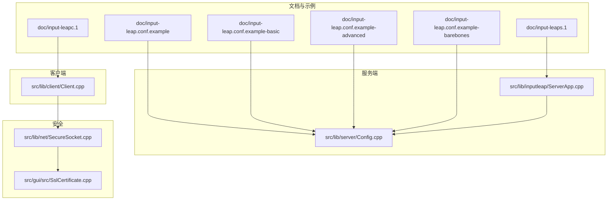
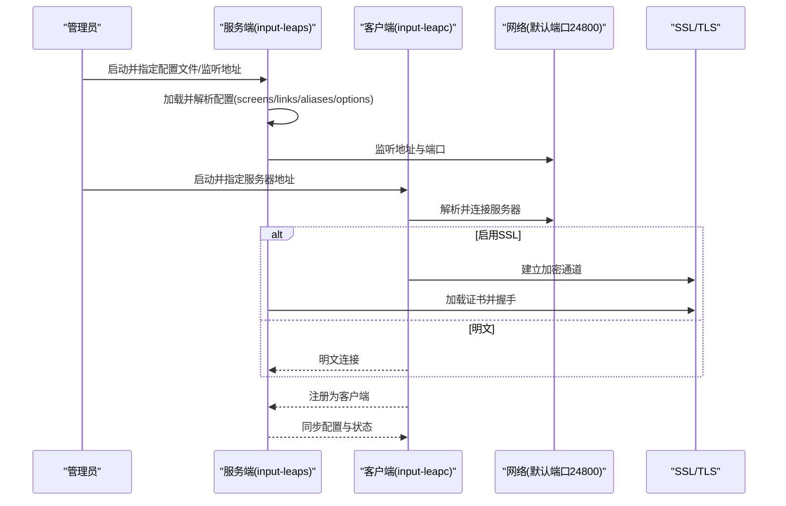
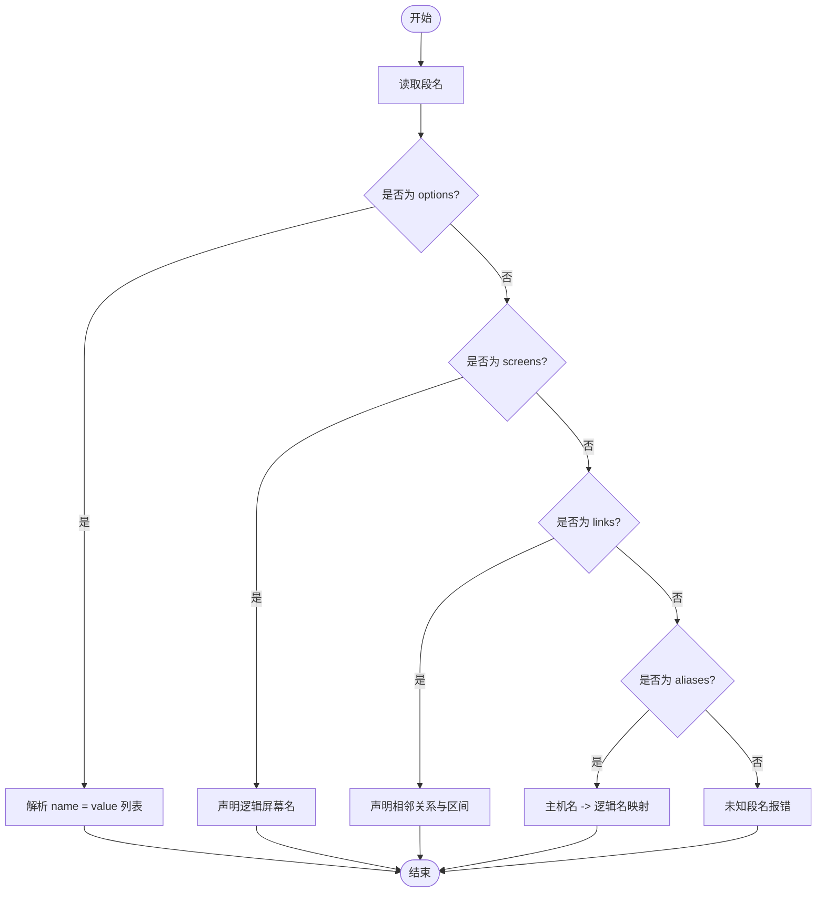
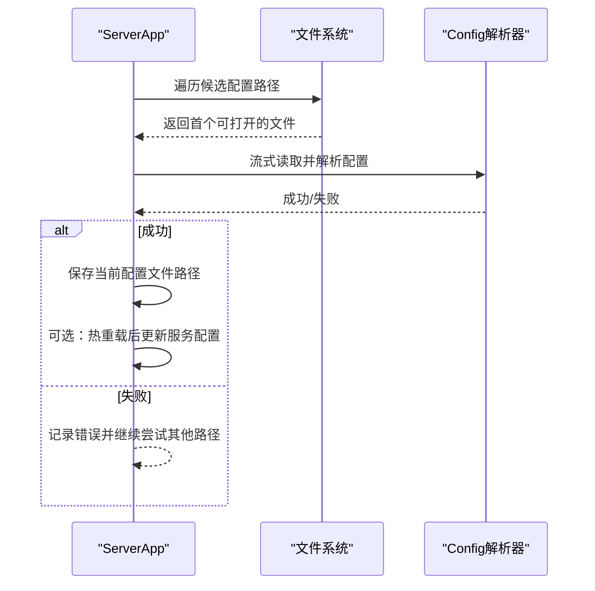
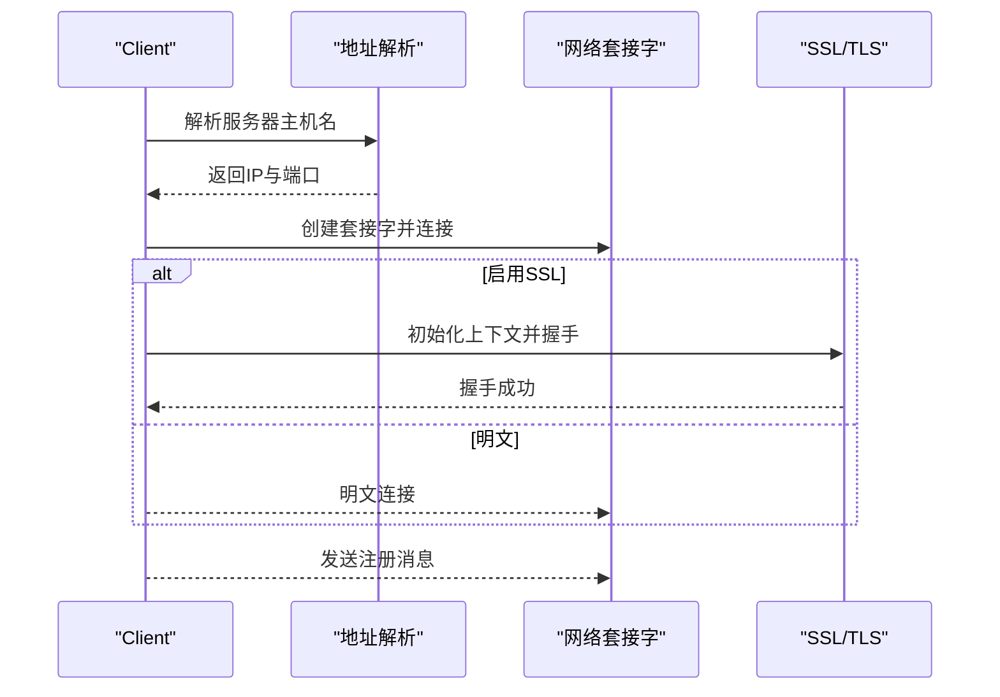
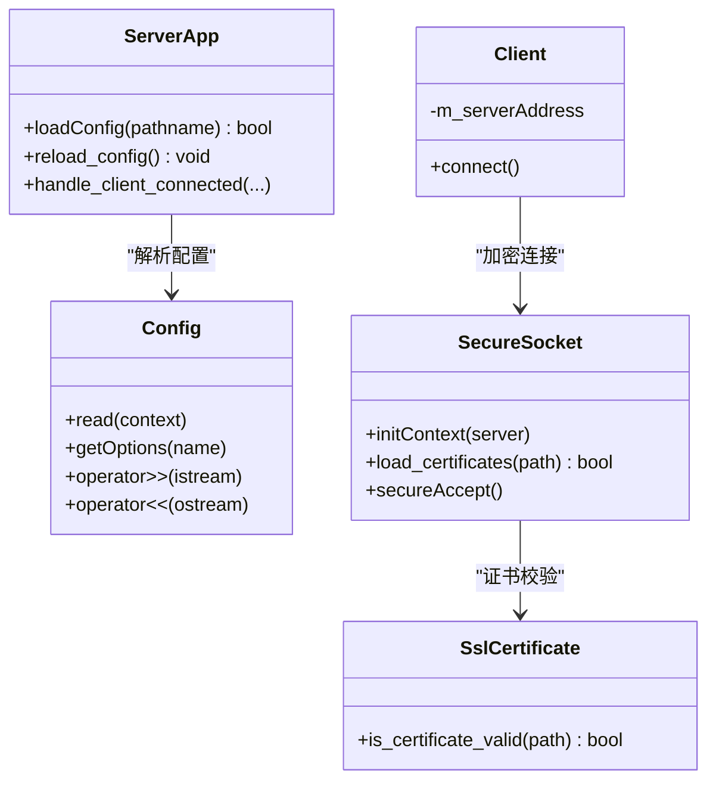

# 配置示例

<cite>
**本文引用的文件**   
- [doc/input-leap.conf.example](file://doc/input-leap.conf.example)
- [doc/input-leap.conf.example-basic](file://doc/input-leap.conf.example-basic)
- [doc/input-leap.conf.example-advanced](file://doc/input-leap.conf.example-advanced)
- [doc/input-leap.conf.example-barebones](file://doc/input-leap.conf.example-barebones)
- [doc/input-leaps.1](file://doc/input-leaps.1)
- [doc/input-leapc.1](file://doc/input-leapc.1)
- [src/lib/server/Config.cpp](file://src/lib/server/Config.cpp)
- [src/lib/inputleap/ServerApp.cpp](file://src/lib/inputleap/ServerApp.cpp)
- [src/lib/client/Client.cpp](file://src/lib/client/Client.cpp)
- [src/lib/net/SecureSocket.cpp](file://src/lib/net/SecureSocket.cpp)
- [src/gui/src/SslCertificate.cpp](file://src/gui/src/SslCertificate.cpp)
</cite>

## 目录
1. [简介](#简介)
2. [项目结构](#项目结构)
3. [核心组件](#核心组件)
4. [架构总览](#架构总览)
5. [详细组件分析](#详细组件分析)
6. [依赖关系分析](#依赖关系分析)
7. [性能考虑](#性能考虑)
8. [故障排查指南](#故障排查指南)
9. [结论](#结论)
10. [附录：常用配置模板与场景](#附录常用配置模板与场景)

## 简介
本文件面向 Input Leap 的使用者，提供从基础到复杂的多机环境配置示例与最佳实践。内容涵盖：
- 双机、多屏、主从/对等/混合部署模式
- 不同平台（Windows、macOS、Linux）的启动与服务化要点
- 安全加固（SSL/TLS、证书指纹校验）与性能优化建议
- 常见问题的定位与排障方法

## 项目结构
仓库中与“配置”直接相关的资源主要位于 doc 目录下的示例配置文件与手册页，以及 lib 层中负责解析配置、加载配置、建立连接与安全通信的核心实现。

图表来源
- [doc/input-leap.conf.example:1-38](file://doc/input-leap.conf.example#L1-L38)
- [doc/input-leap.conf.example-basic:1-40](file://doc/input-leap.conf.example-basic#L1-L40)
- [doc/input-leap.conf.example-advanced:1-50](file://doc/input-leap.conf.example-advanced#L1-L50)
- [doc/input-leap.conf.example-barebones:1-18](file://doc/input-leap.conf.example-barebones#L1-L18)
- [doc/input-leaps.1:1-85](file://doc/input-leaps.1#L1-L85)
- [doc/input-leapc.1:1-71](file://doc/input-leapc.1#L1-L71)
- [src/lib/inputleap/ServerApp.cpp:128-272](file://src/lib/inputleap/ServerApp.cpp#L128-L272)
- [src/lib/server/Config.cpp:629-657](file://src/lib/server/Config.cpp#L629-L657)
- [src/lib/client/Client.cpp:122-153](file://src/lib/client/Client.cpp#L122-L153)
- [src/lib/net/SecureSocket.cpp:316-410](file://src/lib/net/SecureSocket.cpp#L316-L410)
- [src/gui/src/SslCertificate.cpp:75-109](file://src/gui/src/SslCertificate.cpp#L75-L109)

章节来源
- [doc/input-leap.conf.example:1-38](file://doc/input-leap.conf.example#L1-L38)
- [doc/input-leap.conf.example-basic:1-40](file://doc/input-leap.conf.example-basic#L1-L40)
- [doc/input-leap.conf.example-advanced:1-50](file://doc/input-leap.conf.example-advanced#L1-L50)
- [doc/input-leap.conf.example-barebones:1-18](file://doc/input-leap.conf.example-barebones#L1-L18)
- [doc/input-leaps.1:1-85](file://doc/input-leaps.1#L1-L85)
- [doc/input-leapc.1:1-71](file://doc/input-leapc.1#L1-L71)
- [src/lib/inputleap/ServerApp.cpp:128-272](file://src/lib/inputleap/ServerApp.cpp#L128-L272)
- [src/lib/server/Config.cpp:629-657](file://src/lib/server/Config.cpp#L629-L657)
- [src/lib/client/Client.cpp:122-153](file://src/lib/client/Client.cpp#L122-L153)
- [src/lib/net/SecureSocket.cpp:316-410](file://src/lib/net/SecureSocket.cpp#L316-L410)
- [src/gui/src/SslCertificate.cpp:75-109](file://src/gui/src/SslCertificate.cpp#L75-L109)

## 核心组件
- 配置解析器：负责读取并验证 section: screens、section: links、section: aliases、section: options 等段，支持名称参数与区间参数解析。
- 服务端应用：负责查找并加载配置文件、监听地址、动态重载配置、处理客户端连接生命周期。
- 客户端应用：负责解析服务器地址、建立加密或明文连接、重试与日志输出。
- 安全模块：负责 SSL/TLS 上下文初始化、证书加载与校验、握手流程。

章节来源
- [src/lib/server/Config.cpp:629-657](file://src/lib/server/Config.cpp#L629-L657)
- [src/lib/inputleap/ServerApp.cpp:128-272](file://src/lib/inputleap/ServerApp.cpp#L128-L272)
- [src/lib/client/Client.cpp:122-153](file://src/lib/client/Client.cpp#L122-L153)
- [src/lib/net/SecureSocket.cpp:316-410](file://src/lib/net/SecureSocket.cpp#L316-L410)

## 架构总览
Input Leap 采用“服务端 + 多个客户端”的星型拓扑。服务端运行在主机上，接收来自多台客户端的输入事件；客户端将本地输入转发至服务端，由服务端统一分发到其他屏幕。

图表来源
- [doc/input-leaps.1:1-85](file://doc/input-leaps.1#L1-L85)
- [doc/input-leapc.1:1-71](file://doc/input-leapc.1#L1-L71)
- [src/lib/inputleap/ServerApp.cpp:128-272](file://src/lib/inputleap/ServerApp.cpp#L128-L272)
- [src/lib/client/Client.cpp:122-153](file://src/lib/client/Client.cpp#L122-L153)
- [src/lib/net/SecureSocket.cpp:316-410](file://src/lib/net/SecureSocket.cpp#L316-L410)

## 详细组件分析

### 配置语法与段说明
- section: screens
  - 定义逻辑屏幕名，便于在配置中使用易读的名称。
- section: links
  - 定义屏幕之间的相邻关系与过渡区间，支持方向与区间参数。
- section: aliases
  - 将真实主机名映射到逻辑屏幕名，简化配置与维护。
- section: options
  - 全局或按屏幕设置选项，如监听地址、过滤规则等。

图表来源
- [src/lib/server/Config.cpp:629-657](file://src/lib/server/Config.cpp#L629-L657)
- [src/lib/server/Config.cpp:660-678](file://src/lib/server/Config.cpp#L660-L678)

章节来源
- [src/lib/server/Config.cpp:629-657](file://src/lib/server/Config.cpp#L629-L657)
- [src/lib/server/Config.cpp:660-678](file://src/lib/server/Config.cpp#L660-L678)

### 服务端配置加载与热重载
- 启动时按优先级尝试加载用户目录或系统路径的配置文件。
- 支持通过信号触发配置热重载，无需重启进程。
- 若未找到有效配置，程序退出并提示无可用配置。

图表来源
- [src/lib/inputleap/ServerApp.cpp:237-272](file://src/lib/inputleap/ServerApp.cpp#L237-L272)
- [src/lib/inputleap/ServerApp.cpp:185-194](file://src/lib/inputleap/ServerApp.cpp#L185-L194)

章节来源
- [src/lib/inputleap/ServerApp.cpp:237-272](file://src/lib/inputleap/ServerApp.cpp#L237-L272)
- [src/lib/inputleap/ServerApp.cpp:185-194](file://src/lib/inputleap/ServerApp.cpp#L185-L194)

### 客户端连接与安全握手
- 客户端每次连接前会重新解析服务器地址，以应对网络变化。
- 默认使用加密认证级别进行连接；若启用 SSL，则完成证书加载与握手。
- 连接成功后进入事件循环，等待服务端指令与状态同步。

图表来源
- [src/lib/client/Client.cpp:122-153](file://src/lib/client/Client.cpp#L122-L153)
- [src/lib/net/SecureSocket.cpp:316-410](file://src/lib/net/SecureSocket.cpp#L316-L410)

章节来源
- [src/lib/client/Client.cpp:122-153](file://src/lib/client/Client.cpp#L122-L153)
- [src/lib/net/SecureSocket.cpp:316-410](file://src/lib/net/SecureSocket.cpp#L316-L410)

## 依赖关系分析
- 配置解析依赖于 Config 类，负责段级解析、名称合法性检查、区间参数解析。
- 服务端依赖 ServerApp 管理配置加载、监听与客户端生命周期。
- 客户端依赖 Client 进行地址解析、套接字创建与连接。
- 安全模块 SecureSocket 提供 SSL/TLS 能力，GUI 中的 SslCertificate 辅助生成与校验指纹。

图表来源
- [src/lib/server/Config.cpp:629-657](file://src/lib/server/Config.cpp#L629-L657)
- [src/lib/inputleap/ServerApp.cpp:237-272](file://src/lib/inputleap/ServerApp.cpp#L237-L272)
- [src/lib/client/Client.cpp:122-153](file://src/lib/client/Client.cpp#L122-L153)
- [src/lib/net/SecureSocket.cpp:316-410](file://src/lib/net/SecureSocket.cpp#L316-L410)
- [src/gui/src/SslCertificate.cpp:75-109](file://src/gui/src/SslCertificate.cpp#L75-L109)

章节来源
- [src/lib/server/Config.cpp:629-657](file://src/lib/server/Config.cpp#L629-L657)
- [src/lib/inputleap/ServerApp.cpp:237-272](file://src/lib/inputleap/ServerApp.cpp#L237-L272)
- [src/lib/client/Client.cpp:122-153](file://src/lib/client/Client.cpp#L122-L153)
- [src/lib/net/SecureSocket.cpp:316-410](file://src/lib/net/SecureSocket.cpp#L316-L410)
- [src/gui/src/SslCertificate.cpp:75-109](file://src/gui/src/SslCertificate.cpp#L75-L109)

## 性能考虑
- 合理设置相邻屏幕的过渡区间，避免误触导致频繁切换。
- 在大型多屏环境中，减少不必要的日志级别，降低 IO 开销。
- 启用 SSL 会带来额外 CPU 开销，建议在可信内网且对安全性要求不高时可权衡关闭；生产环境建议开启。
- 调整滚动增量与拖放行为，根据外设特性优化体验。

[本节为通用指导，不直接分析具体文件]

## 故障排查指南
- 无法加载配置文件
  - 确认配置文件路径是否被正确识别，参考服务端帮助信息中的默认路径。
  - 检查配置文件语法是否正确，尤其是段名与缩进。
- 客户端无法连接
  - 核对服务器地址与端口，确保防火墙放行默认端口。
  - 若启用 SSL，检查证书路径与权限，确保证书与私钥匹配。
- 证书相关错误
  - 使用 GUI 工具生成并校验证书指纹，确保客户端信任该指纹。
  - 查看服务端日志，定位证书加载失败的详细信息。

章节来源
- [doc/input-leaps.1:70-85](file://doc/input-leaps.1#L70-L85)
- [src/lib/inputleap/ServerApp.cpp:258-282](file://src/lib/inputleap/ServerApp.cpp#L258-L282)
- [src/lib/net/SecureSocket.cpp:316-410](file://src/lib/net/SecureSocket.cpp#L316-L410)
- [src/gui/src/SslCertificate.cpp:75-109](file://src/gui/src/SslCertificate.cpp#L75-L109)

## 结论
通过合理的配置组织与分阶段部署策略，Input Leap 可在双机到多机环境中稳定工作。结合安全加固与性能调优，能够满足从个人桌面到企业办公的不同需求。

[本节为总结性内容，不直接分析具体文件]

## 附录：常用配置模板与场景

### 基础双机配置（左右并排）
- 适用场景：两台电脑并列放置，鼠标跨屏移动。
- 关键步骤：
  - 在服务端与客户端分别声明逻辑屏幕名。
  - 在 links 段中定义 left/right 相邻关系。
  - 使用 aliases 将真实主机名映射到逻辑名，便于维护。
- 参考示例文件：
  - [doc/input-leap.conf.example-barebones:1-18](file://doc/input-leap.conf.example-barebones#L1-L18)
  - [doc/input-leap.conf.example-basic:1-40](file://doc/input-leap.conf.example-basic#L1-L40)

章节来源
- [doc/input-leap.conf.example-barebones:1-18](file://doc/input-leap.conf.example-barebones#L1-L18)
- [doc/input-leap.conf.example-basic:1-40](file://doc/input-leap.conf.example-basic#L1-L40)

### 三机布局（笔记本+两台桌面）
- 适用场景：一台笔记本与两台桌面组成 L 形或 U 形布局。
- 关键步骤：
  - 在 screens 段声明三个逻辑屏幕名。
  - 在 links 段定义 top/bottom/left/right 相邻关系，必要时使用区间参数控制过渡区域。
  - 使用 aliases 将实际主机名映射到逻辑名。
- 参考示例文件：
  - [doc/input-leap.conf.example-advanced:1-50](file://doc/input-leap.conf.example-advanced#L1-L50)

章节来源
- [doc/input-leap.conf.example-advanced:1-50](file://doc/input-leap.conf.example-advanced#L1-L50)

### 通用示例（三段式结构）
- 适用场景：任何规模的网络，强调配置的可读性与可维护性。
- 关键步骤：
  - 使用 screens 段定义所有逻辑屏幕名。
  - 使用 links 段描述相邻关系与过渡区间。
  - 使用 aliases 段进行主机名映射。
  - 使用 options 段设置全局或屏幕级选项（如监听地址）。
- 参考示例文件：
  - [doc/input-leap.conf.example:1-38](file://doc/input-leap.conf.example#L1-L38)

章节来源
- [doc/input-leap.conf.example:1-38](file://doc/input-leap.conf.example#L1-L38)

### 主从架构（单服务端 + 多客户端）
- 服务端：
  - 启动时指定监听地址与配置文件路径。
  - 如需加密，启用 SSL 并加载证书。
  - 参考命令帮助：
    - [doc/input-leaps.1:1-85](file://doc/input-leaps.1#L1-L85)
- 客户端：
  - 启动时指定服务器地址（含端口），可选择启用 SSL。
  - 参考命令帮助：
    - [doc/input-leapc.1:1-71](file://doc/input-leapc.1#L1-L71)

章节来源
- [doc/input-leaps.1:1-85](file://doc/input-leaps.1#L1-L85)
- [doc/input-leapc.1:1-71](file://doc/input-leapc.1#L1-L71)

### 对等网络（多节点互相作为服务端/客户端）
- 说明：Input Leap 原生为星型拓扑，通常不建议构建真正的对等网络。可通过脚本在不同节点间动态切换角色，但需小心配置冲突与环路。
- 建议：优先采用主从架构，配合自动发现与集中配置管理。

[本节为概念性说明，不直接分析具体文件]

### 混合环境（部分节点启用 SSL，部分明文）
- 说明：在同一网络中，可根据安全策略对不同节点启用不同的安全级别。
- 注意：
  - 客户端默认使用加密认证级别，若服务端未启用 SSL，可能握手失败。
  - 建议使用统一的证书管理与指纹校验，避免混用带来的安全隐患。
- 参考实现：
  - 客户端连接与安全握手：
    - [src/lib/client/Client.cpp:122-153](file://src/lib/client/Client.cpp#L122-L153)
    - [src/lib/net/SecureSocket.cpp:316-410](file://src/lib/net/SecureSocket.cpp#L316-L410)

章节来源
- [src/lib/client/Client.cpp:122-153](file://src/lib/client/Client.cpp#L122-L153)
- [src/lib/net/SecureSocket.cpp:316-410](file://src/lib/net/SecureSocket.cpp#L316-L410)

### 平台特定配置要点
- Windows
  - 可使用托盘图标与 GUI 进行配置与证书管理。
  - 通过命令行参数指定配置文件与监听地址。
  - 参考命令帮助：
    - [doc/input-leaps.1:1-85](file://doc/input-leaps.1#L1-L85)
    - [doc/input-leapc.1:1-71](file://doc/input-leapc.1#L1-L71)
- macOS
  - 配置文件路径与 Linux 类似，注意 .plist 服务化方式。
  - 使用 GUI 生成并校验证书指纹。
  - 参考证书工具：
    - [src/gui/src/SslCertificate.cpp:75-109](file://src/gui/src/SslCertificate.cpp#L75-L109)
- Linux
  - 推荐将配置文件放置在用户目录或系统路径，并通过 systemd 等服务管理器托管。
  - 参考默认路径：
    - [doc/input-leaps.1:70-85](file://doc/input-leaps.1#L70-L85)

章节来源
- [doc/input-leaps.1:1-85](file://doc/input-leaps.1#L1-L85)
- [doc/input-leapc.1:1-71](file://doc/input-leapc.1#L1-L71)
- [src/gui/src/SslCertificate.cpp:75-109](file://src/gui/src/SslCertificate.cpp#L75-L109)

### 安全加固模板
- 启用 SSL/TLS
  - 服务端加载证书与私钥，并进行私钥校验。
  - 客户端建立加密通道并完成握手。
  - 参考实现：
    - [src/lib/net/SecureSocket.cpp:316-410](file://src/lib/net/SecureSocket.cpp#L316-L410)
- 证书指纹校验
  - 使用 GUI 工具生成并写入受信任指纹数据库。
  - 参考实现：
    - [src/gui/src/SslCertificate.cpp:75-109](file://src/gui/src/SslCertificate.cpp#L75-L109)

章节来源
- [src/lib/net/SecureSocket.cpp:316-410](file://src/lib/net/SecureSocket.cpp#L316-L410)
- [src/gui/src/SslCertificate.cpp:75-109](file://src/gui/src/SslCertificate.cpp#L75-L109)

### 性能优化模板
- 调整相邻屏幕过渡区间，减少误触。
- 在生产环境降低日志级别，避免过多 IO。
- 在可信内网且对延迟敏感的场景，评估是否关闭 SSL。
- 根据外设特性调整滚动增量与拖放行为。

[本节为通用指导，不直接分析具体文件]