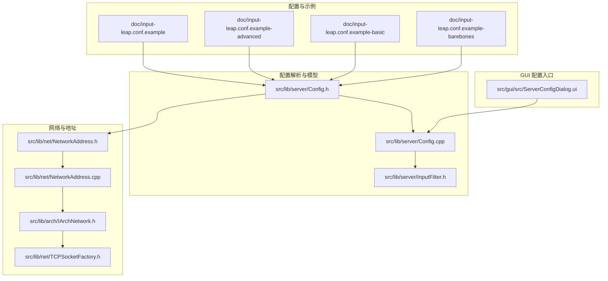
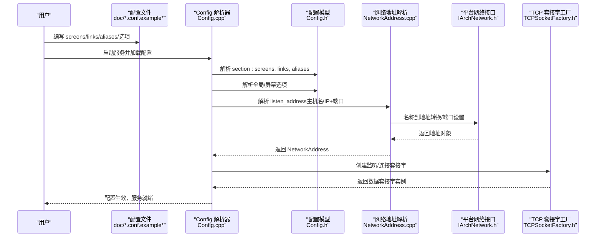
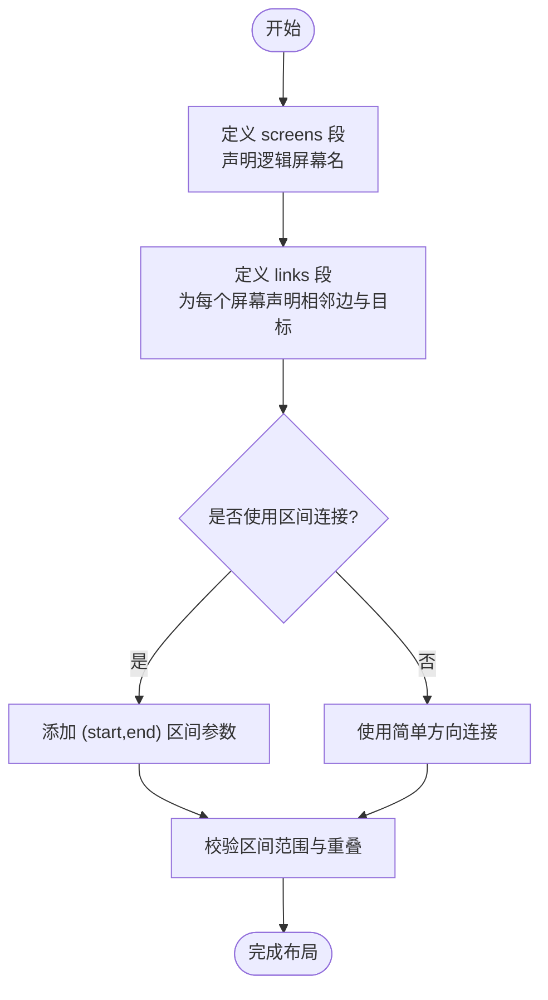
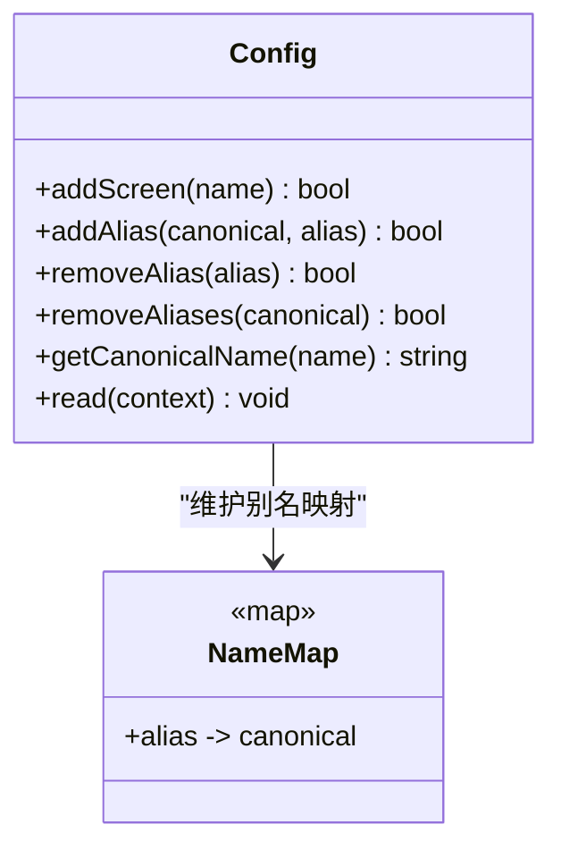
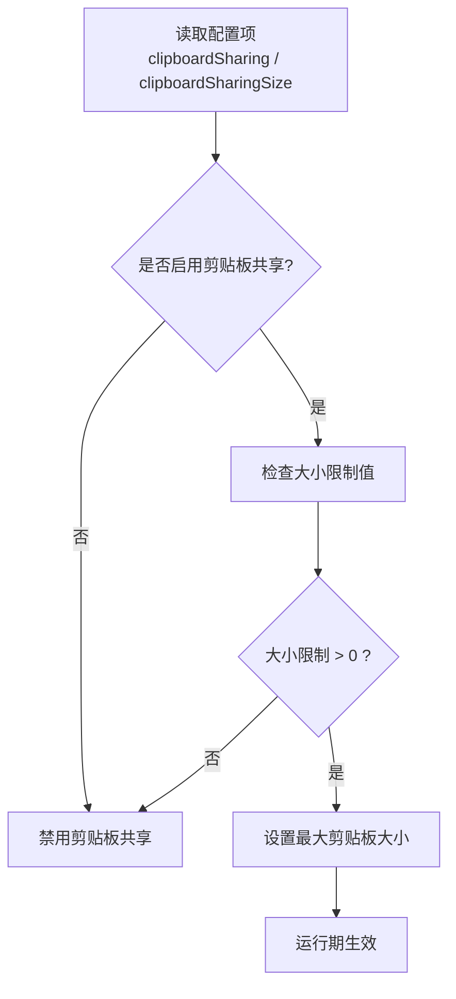
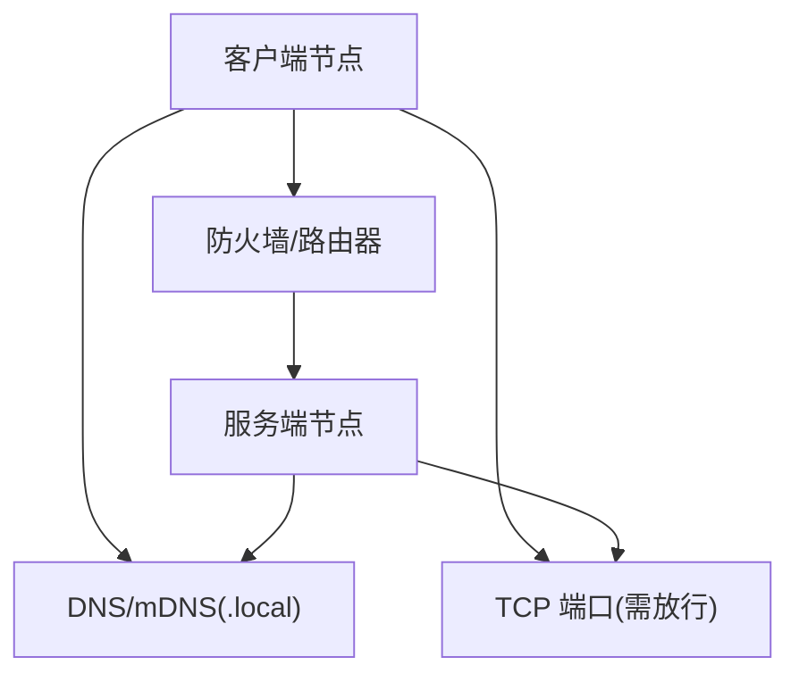
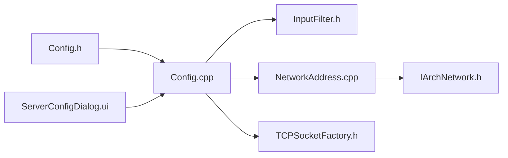

# 高级配置示例

<cite>
**本文引用的文件**
- [doc/input-leap.conf.example](file://doc/input-leap.conf.example)
- [doc/input-leap.conf.example-advanced](file://doc/input-leap.conf.example-advanced)
- [doc/input-leap.conf.example-basic](file://doc/input-leap.conf.example-basic)
- [doc/input-leap.conf.example-barebones](file://doc/input-leap.conf.example-barebones)
- [src/lib/server/Config.h](file://src/lib/server/Config.h)
- [src/lib/server/Config.cpp](file://src/lib/server/Config.cpp)
- [src/lib/server/InputFilter.h](file://src/lib/server/InputFilter.h)
- [src/lib/net/NetworkAddress.h](file://src/lib/net/NetworkAddress.h)
- [src/lib/net/NetworkAddress.cpp](file://src/lib/net/NetworkAddress.cpp)
- [src/lib/arch/IArchNetwork.h](file://src/lib/arch/IArchNetwork.h)
- [src/lib/net/TCPSocketFactory.h](file://src/lib/net/TCPSocketFactory.h)
- [src/gui/src/ServerConfigDialog.ui](file://src/gui/src/ServerConfigDialog.ui)
</cite>

## 目录
1. [简介](#简介)
2. [项目结构](#项目结构)
3. [核心组件](#核心组件)
4. [架构总览](#架构总览)
5. [详细组件分析](#详细组件分析)
6. [依赖关系分析](#依赖关系分析)
7. [性能与调优](#性能与调优)
8. [故障排查指南](#故障排查指南)
9. [结论](#结论)
10. [附录：企业级部署模板与网络拓扑建议](#附录企业级部署模板与网络拓扑建议)

## 简介
本文件面向需要复杂多机布局、别名映射、剪贴板共享、热键与性能调优的企业用户，提供 Input Leap 的高级配置示例与实践建议。内容涵盖三台及以上计算机的布局定义、aliases 别名的使用方法（含主机名映射）、高级选项（如剪贴板大小限制、屏幕切换行为等），以及针对复杂网络拓扑和防火墙环境的部署建议。

## 项目结构
Input Leap 的配置解析与运行时能力由服务端配置模块、网络抽象层与 GUI 配置界面共同支撑。关键位置如下：
- 配置示例位于 doc 目录，包含基础、进阶与极简模板
- 配置解析与别名、链接、选项处理在 src/lib/server/Config.* 中实现
- 输入过滤规则（用于热键/动作）在 src/lib/server/InputFilter.h 中定义
- 网络地址解析与平台网络接口在 src/lib/net/* 与 src/lib/arch/* 中实现
- GUI 中的“最大剪贴板共享大小”等选项通过 UI 暴露

图表来源
- [doc/input-leap.conf.example:1-38](file://doc/input-leap.conf.example#L1-L38)
- [doc/input-leap.conf.example-advanced:1-50](file://doc/input-leap.conf.example-advanced#L1-L50)
- [doc/input-leap.conf.example-basic:1-40](file://doc/input-leap.conf.example-basic#L1-L40)
- [doc/input-leap.conf.example-barebones:1-18](file://doc/input-leap.conf.example-barebones#L1-L18)
- [src/lib/server/Config.h:1-534](file://src/lib/server/Config.h#L1-L534)
- [src/lib/server/Config.cpp:1-200](file://src/lib/server/Config.cpp#L1-L200)
- [src/lib/server/InputFilter.h:296-351](file://src/lib/server/InputFilter.h#L296-L351)
- [src/lib/net/NetworkAddress.h:1-45](file://src/lib/net/NetworkAddress.h#L1-L45)
- [src/lib/net/NetworkAddress.cpp:37-78](file://src/lib/net/NetworkAddress.cpp#L37-L78)
- [src/lib/arch/IArchNetwork.h:233-286](file://src/lib/arch/IArchNetwork.h#L233-L286)
- [src/lib/net/TCPSocketFactory.h:1-48](file://src/lib/net/TCPSocketFactory.h#L1-L48)
- [src/gui/src/ServerConfigDialog.ui:419-452](file://src/gui/src/ServerConfigDialog.ui#L419-L452)

章节来源
- [doc/input-leap.conf.example:1-38](file://doc/input-leap.conf.example#L1-L38)
- [doc/input-leap.conf.example-advanced:1-50](file://doc/input-leap.conf.example-advanced#L1-L50)
- [doc/input-leap.conf.example-basic:1-40](file://doc/input-leap.conf.example-basic#L1-L40)
- [doc/input-leap.conf.example-barebones:1-18](file://doc/input-leap.conf.example-barebones#L1-L18)
- [src/lib/server/Config.h:1-534](file://src/lib/server/Config.h#L1-L534)
- [src/lib/server/Config.cpp:1-200](file://src/lib/server/Config.cpp#L1-L200)
- [src/lib/server/InputFilter.h:296-351](file://src/lib/server/InputFilter.h#L296-L351)
- [src/lib/net/NetworkAddress.h:1-45](file://src/lib/net/NetworkAddress.h#L1-L45)
- [src/lib/net/NetworkAddress.cpp:37-78](file://src/lib/net/NetworkAddress.cpp#L37-L78)
- [src/lib/arch/IArchNetwork.h:233-286](file://src/lib/arch/IArchNetwork.h#L233-L286)
- [src/lib/net/TCPSocketFactory.h:1-48](file://src/lib/net/TCPSocketFactory.h#L1-L48)
- [src/gui/src/ServerConfigDialog.ui:419-452](file://src/gui/src/ServerConfigDialog.ui#L419-L452)

## 核心组件
- 配置模型与解析器
  - Config 类负责维护屏幕名称、别名、链接、监听地址与全局/屏幕级选项；支持读取配置文件并构建内部模型。
  - 别名系统允许将真实主机名映射到逻辑屏幕名，便于跨平台与动态主机名环境下的稳定配置。
  - 链接系统支持按边缘区间建立屏幕间的跳转关系，可表达复杂的多屏拓扑。
- 输入过滤与动作
  - InputFilter 定义了条件与动作的规则体系，可用于实现热键、锁屏、开关剪贴板等行为。
- 网络与地址
  - NetworkAddress 负责解析主机名或 IP（含 IPv6 方括号形式与端口），并通过平台抽象 IArchNetwork 进行实际网络操作。
  - TCPSocketFactory 基于 ISocketFactory 创建 TCP 套接字，配合安全级别参数完成连接建立。
- GUI 配置入口
  - ServerConfigDialog.ui 暴露了“最大剪贴板共享大小”等高级选项，便于非命令行用户调整。

章节来源
- [src/lib/server/Config.h:1-534](file://src/lib/server/Config.h#L1-L534)
- [src/lib/server/Config.cpp:1-200](file://src/lib/server/Config.cpp#L1-L200)
- [src/lib/server/InputFilter.h:296-351](file://src/lib/server/InputFilter.h#L296-L351)
- [src/lib/net/NetworkAddress.h:1-45](file://src/lib/net/NetworkAddress.h#L1-L45)
- [src/lib/net/NetworkAddress.cpp:37-78](file://src/lib/net/NetworkAddress.cpp#L37-L78)
- [src/lib/arch/IArchNetwork.h:233-286](file://src/lib/arch/IArchNetwork.h#L233-L286)
- [src/lib/net/TCPSocketFactory.h:1-48](file://src/lib/net/TCPSocketFactory.h#L1-L48)
- [src/gui/src/ServerConfigDialog.ui:419-452](file://src/gui/src/ServerConfigDialog.ui#L419-L452)

## 架构总览
下图展示了从配置文件到运行时模型的解析流程，以及网络地址解析与服务器监听的关系。

图表来源
- [src/lib/server/Config.cpp:582-620](file://src/lib/server/Config.cpp#L582-L620)
- [src/lib/net/NetworkAddress.cpp:37-78](file://src/lib/net/NetworkAddress.cpp#L37-L78)
- [src/lib/arch/IArchNetwork.h:233-286](file://src/lib/arch/IArchNetwork.h#L233-L286)
- [src/lib/net/TCPSocketFactory.h:1-48](file://src/lib/net/TCPSocketFactory.h#L1-L48)

## 详细组件分析

### 多机环境与复杂布局（screens 与 links）
- screens 段定义逻辑屏幕名，links 段描述相邻屏幕之间的跳转关系，支持指定边缘区间以表达更复杂的物理布局。
- 示例参考：
  - 基础三机布局：[doc/input-leap.conf.example-basic:1-40](file://doc/input-leap.conf.example-basic#L1-L40)
  - 进阶三机布局（含区间连接）：[doc/input-leap.conf.example-advanced:1-50](file://doc/input-leap.conf.example-advanced#L1-L50)
  - 极简两机布局：[doc/input-leap.conf.example-barebones:1-18](file://doc/input-leap.conf.example-barebones#L1-L18)

图表来源
- [doc/input-leap.conf.example-basic:10-33](file://doc/input-leap.conf.example-basic#L10-L33)
- [doc/input-leap.conf.example-advanced:22-41](file://doc/input-leap.conf.example-advanced#L22-L41)
- [src/lib/server/Config.h:244-276](file://src/lib/server/Config.h#L244-L276)

章节来源
- [doc/input-leap.conf.example-basic:10-33](file://doc/input-leap.conf.example-basic#L10-L33)
- [doc/input-leap.conf.example-advanced:22-41](file://doc/input-leap.conf.example-advanced#L22-L41)
- [src/lib/server/Config.h:244-276](file://src/lib/server/Config.h#L244-L276)

### aliases 别名与主机名映射
- aliases 段将真实主机名（可能包含 .local 后缀）映射到逻辑屏幕名，使配置更具可读性与稳定性。
- 示例参考：
  - 基础别名示例：[doc/input-leap.conf.example:33-37](file://doc/input-leap.conf.example#L33-L37)
  - 进阶别名示例（macOS 主机名）：[doc/input-leap.conf.example-advanced:43-49](file://doc/input-leap.conf.example-advanced#L43-L49)
  - 基本别名说明：[doc/input-leap.conf.example-basic:35-39](file://doc/input-leap.conf.example-basic#L35-L39)

图表来源
- [src/lib/server/Config.h:215-242](file://src/lib/server/Config.h#L215-L242)
- [src/lib/server/Config.cpp:140-207](file://src/lib/server/Config.cpp#L140-L207)

章节来源
- [doc/input-leap.conf.example:33-37](file://doc/input-leap.conf.example#L33-L37)
- [doc/input-leap.conf.example-advanced:43-49](file://doc/input-leap.conf.example-advanced#L43-L49)
- [doc/input-leap.conf.example-basic:35-39](file://doc/input-leap.conf.example-basic#L35-L39)
- [src/lib/server/Config.h:215-242](file://src/lib/server/Config.h#L215-L242)
- [src/lib/server/Config.cpp:140-207](file://src/lib/server/Config.cpp#L140-L207)

### 高级选项：剪贴板共享、热键与性能调优
- 剪贴板共享
  - 可通过配置启用/禁用剪贴板共享，并可设置最大共享大小（字节）。
  - GUI 中提供“最大剪贴板共享大小”的数值输入框，便于直观调整。
  - 相关路径：
    - GUI 控件：[src/gui/src/ServerConfigDialog.ui:419-452](file://src/gui/src/ServerConfigDialog.ui#L419-L452)
    - 配置项解析与取值：[src/lib/server/Config.cpp:723-728](file://src/lib/server/Config.cpp#L723-L728)
    - 运行时应用（启用/禁用与大小限制）：[src/lib/server/Server.cpp:1119-1129](file://src/lib/server/Server.cpp#L1119-L1129)
- 热键与输入过滤
  - 通过 InputFilter 的条件与动作机制，可实现自定义热键、锁屏、开关功能等。
  - 规则结构与解析入口：
    - 规则与动作定义：[src/lib/server/InputFilter.h:296-351](file://src/lib/server/InputFilter.h#L296-L351)
    - 配置解析中的条件与动作处理：[src/lib/server/Config.cpp:742-754](file://src/lib/server/Config.cpp#L742-L754)
- 性能与交互调优
  - 相对鼠标移动、屏幕切换延迟、双击切换、半双态修饰键等选项可在配置中调整。
  - 相关解析与运行时应用：
    - 解析开关与整型选项：[src/lib/server/Config.cpp:712-728](file://src/lib/server/Config.cpp#L712-L728)
    - 运行时应用（切换延迟、相对移动、剪贴板开关/大小）：[src/lib/server/Server.cpp:1087-1129](file://src/lib/server/Server.cpp#L1087-L1129)

图表来源
- [src/lib/server/Config.cpp:723-728](file://src/lib/server/Config.cpp#L723-L728)
- [src/lib/server/Server.cpp:1119-1129](file://src/lib/server/Server.cpp#L1119-L1129)

章节来源
- [src/gui/src/ServerConfigDialog.ui:419-452](file://src/gui/src/ServerConfigDialog.ui#L419-L452)
- [src/lib/server/Config.cpp:712-728](file://src/lib/server/Config.cpp#L712-L728)
- [src/lib/server/Server.cpp:1087-1129](file://src/lib/server/Server.cpp#L1087-L1129)
- [src/lib/server/InputFilter.h:296-351](file://src/lib/server/InputFilter.h#L296-L351)

### 网络拓扑与防火墙配置建议
- 地址解析与端口
  - NetworkAddress 支持 IPv4、IPv6（方括号包裹）及可选端口；当未显式指定端口时，默认不覆盖端口。
  - 平台抽象 IArchNetwork 提供名称到地址转换、端口设置、地址族判断等能力。
  - 相关路径：
    - 地址解析：[src/lib/net/NetworkAddress.cpp:37-78](file://src/lib/net/NetworkAddress.cpp#L37-L78)
    - 平台接口：[src/lib/arch/IArchNetwork.h:233-286](file://src/lib/arch/IArchNetwork.h#L233-L286)
- 防火墙与端口策略
  - 建议在防火墙中放行 Input Leap 使用的 TCP 端口（若未在配置中显式指定，则遵循默认端口策略）。
  - 对于跨网段或多子网环境，确保各节点可达且 DNS/mDNS（.local）解析正常。
- 地址复用与绑定
  - 平台网络接口提供 setReuseAddrOnSocket 能力，有助于在 TIME_WAIT 状态下重用地址，提升重启后的可用性。

图表来源
- [src/lib/net/NetworkAddress.cpp:37-78](file://src/lib/net/NetworkAddress.cpp#L37-L78)
- [src/lib/arch/IArchNetwork.h:233-286](file://src/lib/arch/IArchNetwork.h#L233-L286)

章节来源
- [src/lib/net/NetworkAddress.cpp:37-78](file://src/lib/net/NetworkAddress.cpp#L37-L78)
- [src/lib/arch/IArchNetwork.h:233-286](file://src/lib/arch/IArchNetwork.h#L233-L286)

## 依赖关系分析
- 配置模块依赖
  - Config 依赖 InputFilter 规则体系以实现高级动作；依赖 NetworkAddress 解析监听地址；依赖平台网络接口完成底层通信。
- 网络栈依赖
  - TCPSocketFactory 基于 ISocketFactory 创建 TCP 套接字，结合安全级别参数完成连接建立。
- GUI 与配置联动
  - ServerConfigDialog.ui 暴露的选项最终写入配置模型，影响运行期行为。

图表来源
- [src/lib/server/Config.h:1-534](file://src/lib/server/Config.h#L1-L534)
- [src/lib/server/Config.cpp:1-200](file://src/lib/server/Config.cpp#L1-L200)
- [src/lib/server/InputFilter.h:296-351](file://src/lib/server/InputFilter.h#L296-L351)
- [src/lib/net/NetworkAddress.cpp:37-78](file://src/lib/net/NetworkAddress.cpp#L37-L78)
- [src/lib/arch/IArchNetwork.h:233-286](file://src/lib/arch/IArchNetwork.h#L233-L286)
- [src/lib/net/TCPSocketFactory.h:1-48](file://src/lib/net/TCPSocketFactory.h#L1-L48)
- [src/gui/src/ServerConfigDialog.ui:419-452](file://src/gui/src/ServerConfigDialog.ui#L419-L452)

章节来源
- [src/lib/server/Config.h:1-534](file://src/lib/server/Config.h#L1-L534)
- [src/lib/server/Config.cpp:1-200](file://src/lib/server/Config.cpp#L1-L200)
- [src/lib/server/InputFilter.h:296-351](file://src/lib/server/InputFilter.h#L296-L351)
- [src/lib/net/NetworkAddress.cpp:37-78](file://src/lib/net/NetworkAddress.cpp#L37-L78)
- [src/lib/arch/IArchNetwork.h:233-286](file://src/lib/arch/IArchNetwork.h#L233-L286)
- [src/lib/net/TCPSocketFactory.h:1-48](file://src/lib/net/TCPSocketFactory.h#L1-L48)
- [src/gui/src/ServerConfigDialog.ui:419-452](file://src/gui/src/ServerConfigDialog.ui#L419-L452)

## 性能与调优
- 剪贴板共享
  - 合理设置最大共享大小，避免大体积数据频繁传输导致带宽占用过高。
  - 在不需要共享剪贴板的场景下直接禁用，减少开销。
- 鼠标与键盘事件
  - 开启相对鼠标移动可减少绝对坐标换算带来的额外计算，适合特定外设或驱动环境。
  - 调整屏幕切换延迟与双击切换时间，平衡响应速度与误触概率。
- 半双态修饰键
  - 根据键盘布局与使用习惯，选择性启用 CapsLock/NumLock/ScrollLock 的半双态模式，避免按键冲突。

章节来源
- [src/lib/server/Config.cpp:712-728](file://src/lib/server/Config.cpp#L712-L728)
- [src/lib/server/Server.cpp:1087-1129](file://src/lib/server/Server.cpp#L1087-L1129)

## 故障排查指南
- 配置解析错误
  - 当配置语法不正确或出现多余参数时，解析器会抛出配置读取异常。请检查 sections、关键字拼写与参数数量。
  - 参考异常类型与上下文：[src/lib/server/Config.h:515-534](file://src/lib/server/Config.h#L515-L534)
- 别名与主机名问题
  - 确认 aliases 映射的目标为主机真实名称（包括 .local 后缀），并确保 mDNS/DNS 解析可用。
  - 参考别名管理接口：[src/lib/server/Config.cpp:140-207](file://src/lib/server/Config.cpp#L140-L207)
- 网络连接失败
  - 检查防火墙是否放行 TCP 端口；验证 IPv4/IPv6 地址格式与端口是否正确。
  - 参考地址解析与平台接口：[src/lib/net/NetworkAddress.cpp:37-78](file://src/lib/net/NetworkAddress.cpp#L37-L78)、[src/lib/arch/IArchNetwork.h:233-286](file://src/lib/arch/IArchNetwork.h#L233-L286)

章节来源
- [src/lib/server/Config.h:515-534](file://src/lib/server/Config.h#L515-L534)
- [src/lib/server/Config.cpp:140-207](file://src/lib/server/Config.cpp#L140-L207)
- [src/lib/net/NetworkAddress.cpp:37-78](file://src/lib/net/NetworkAddress.cpp#L37-L78)
- [src/lib/arch/IArchNetwork.h:233-286](file://src/lib/arch/IArchNetwork.h#L233-L286)

## 结论
通过合理使用 screens、links、aliases 与高级选项，Input Leap 能够胜任多机、复杂布局与企业级部署需求。结合网络地址解析与平台抽象，可在不同操作系统与网络环境中稳定运行。建议在生产环境中明确端口策略、启用必要的剪贴板控制与性能调优，并利用 GUI 或配置文件对行为进行细粒度定制。

## 附录：企业级部署模板与网络拓扑建议
- 企业级配置要点
  - 统一命名规范：为每台机器定义清晰的逻辑屏幕名，并在 aliases 中映射真实主机名。
  - 剪贴板策略：按需启用，设置合理的最大共享大小，避免敏感数据泄露。
  - 热键与动作：利用 InputFilter 规则实现统一的快捷键策略与锁屏行为。
  - 性能调优：根据终端设备特性调整相对鼠标移动、切换延迟与半双态修饰键。
- 网络拓扑与防火墙
  - 单播/组播：在 .local 环境下确保 mDNS 可用；跨网段建议使用静态 DNS 记录。
  - 端口策略：在防火墙中放行 Input Leap 使用的 TCP 端口；必要时启用白名单。
  - 地址复用：利用 setReuseAddrOnSocket 提升服务重启后的可用性。
- 参考示例
  - 基础三机布局与别名：[doc/input-leap.conf.example-basic:1-40](file://doc/input-leap.conf.example-basic#L1-L40)
  - 进阶三机布局与区间连接：[doc/input-leap.conf.example-advanced:1-50](file://doc/input-leap.conf.example-advanced#L1-L50)
  - 极简两机布局：[doc/input-leap.conf.example-barebones:1-18](file://doc/input-leap.conf.example-barebones#L1-L18)
  - 基础别名示例：[doc/input-leap.conf.example:1-38](file://doc/input-leap.conf.example#L1-L38)

章节来源
- [doc/input-leap.conf.example-basic:1-40](file://doc/input-leap.conf.example-basic#L1-L40)
- [doc/input-leap.conf.example-advanced:1-50](file://doc/input-leap.conf.example-advanced#L1-L50)
- [doc/input-leap.conf.example-barebones:1-18](file://doc/input-leap.conf.example-barebones#L1-L18)
- [doc/input-leap.conf.example:1-38](file://doc/input-leap.conf.example#L1-L38)