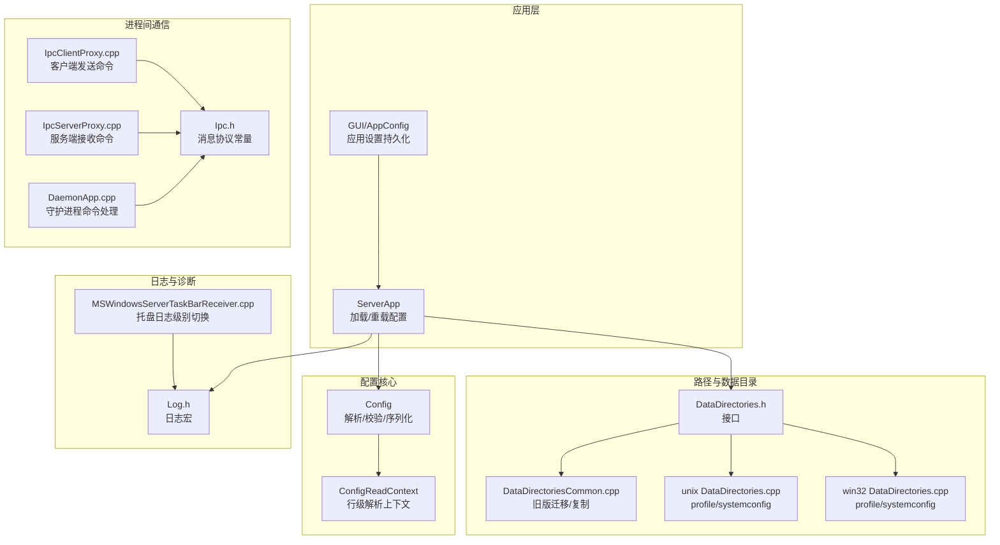
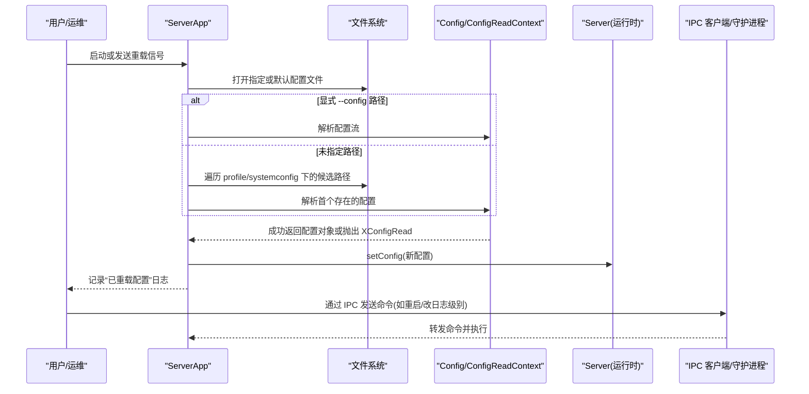
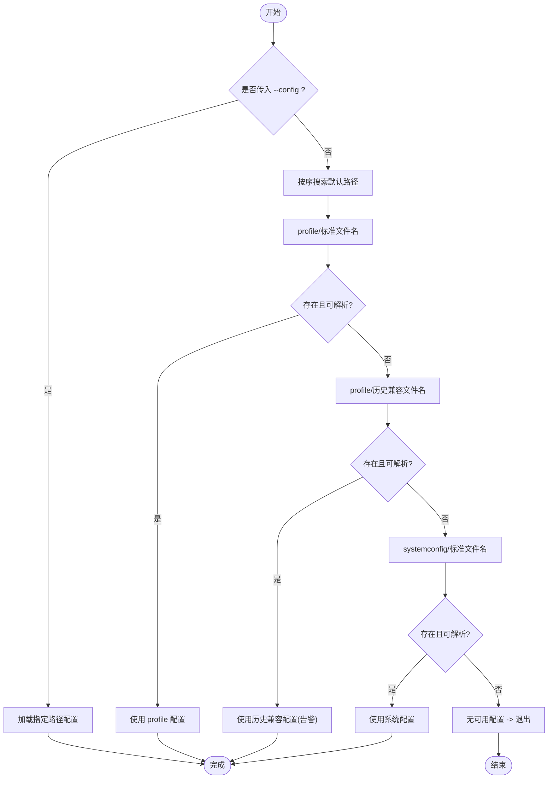
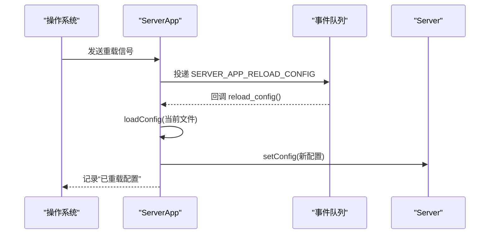
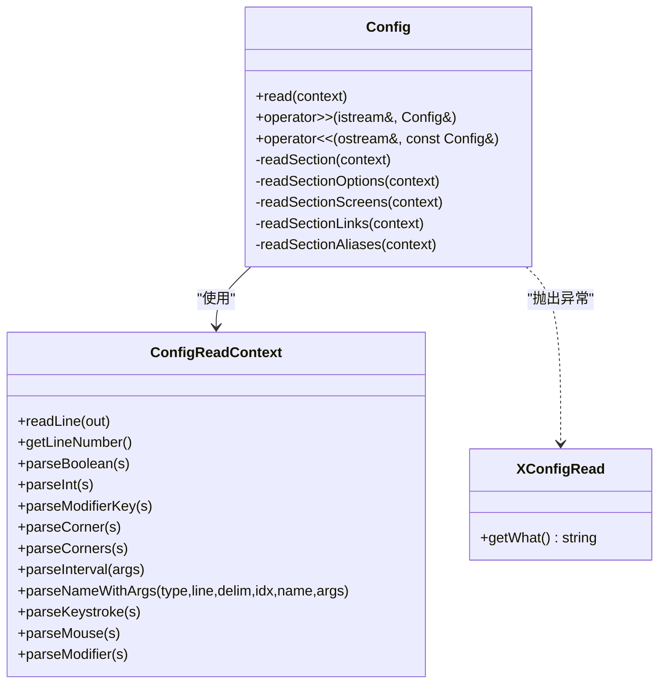
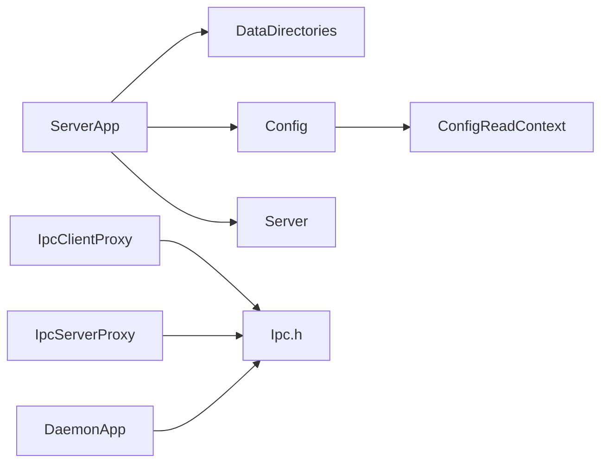

# 配置管理

<cite>
**本文引用的文件列表**
- [ServerApp.cpp](file://src/lib/inputleap/ServerApp.cpp)
- [ServerApp.h](file://src/lib/inputleap/ServerApp.h)
- [Config.h](file://src/lib/server/Config.h)
- [Config.cpp](file://src/lib/server/Config.cpp)
- [DataDirectories.h](file://src/lib/common/DataDirectories.h)
- [DataDirectoriesCommon.cpp](file://src/lib/common/DataDirectoriesCommon.cpp)
- [unix DataDirectories.cpp](file://src/lib/common/unix/DataDirectories.cpp)
- [win32 DataDirectories.cpp](file://src/lib/common/win32/DataDirectories.cpp)
- [input-leap.conf.example](file://doc/input-leap.conf.example)
- [Ipc.h](file://src/lib/ipc/Ipc.h)
- [IpcClientProxy.cpp](file://src/lib/ipc/IpcClientProxy.cpp)
- [IpcServerProxy.cpp](file://src/lib/ipc/IpcServerProxy.cpp)
- [DaemonApp.cpp](file://src/lib/inputleap/win32/DaemonApp.cpp)
- [MSWindowsServerTaskBarReceiver.cpp](file://src/server/MSWindowsServerTaskBarReceiver.cpp)
- [Log.h](file://src/lib/base/Log.h)
</cite>

## 目录
1. [简介](#简介)
2. [项目结构](#项目结构)
3. [核心组件](#核心组件)
4. [架构总览](#架构总览)
5. [详细组件分析](#详细组件分析)
6. [依赖关系分析](#依赖关系分析)
7. [性能与行为特性](#性能与行为特性)
8. [故障排查指南](#故障排查指南)
9. [结论](#结论)
10. [附录](#附录)

## 简介
本文件系统性阐述 Input Leap 的配置管理机制，覆盖以下主题：
- 配置文件加载顺序、优先级与继承规则
- 动态配置重载机制与热更新能力
- 配置解析与验证流程、错误处理策略
- 配置备份、恢复与版本迁移方法
- 配置监控与诊断工具使用方法

## 项目结构
与配置管理直接相关的代码分布在服务端应用入口、配置解析器、数据目录定位、IPC 通信以及日志输出等模块中。下图给出与“配置”相关的关键文件及其职责概览。

图表来源
- [ServerApp.cpp:178-272](file://src/lib/inputleap/ServerApp.cpp#L178-L272)
- [Config.h:468-534](file://src/lib/server/Config.h#L468-L534)
- [Config.cpp:581-657](file://src/lib/server/Config.cpp#L581-L657)
- [DataDirectories.h:24-48](file://src/lib/common/DataDirectories.h#L24-L48)
- [DataDirectoriesCommon.cpp:32-62](file://src/lib/common/DataDirectoriesCommon.cpp#L32-L62)
- [unix DataDirectories.cpp:90-132](file://src/lib/common/unix/DataDirectories.cpp#L90-L132)
- [win32 DataDirectories.cpp:37-78](file://src/lib/common/win32/DataDirectories.cpp#L37-L78)
- [Ipc.h:21-53](file://src/lib/ipc/Ipc.h#L21-L53)
- [IpcClientProxy.cpp:105-150](file://src/lib/ipc/IpcClientProxy.cpp#L105-L150)
- [IpcServerProxy.cpp:81-114](file://src/lib/ipc/IpcServerProxy.cpp#L81-L114)
- [DaemonApp.cpp:306-339](file://src/lib/inputleap/win32/DaemonApp.cpp#L306-L339)
- [MSWindowsServerTaskBarReceiver.cpp:203-237](file://src/server/MSWindowsServerTaskBarReceiver.cpp#L203-L237)
- [Log.h:155-188](file://src/lib/base/Log.h#L155-L188)

章节来源
- [ServerApp.cpp:178-272](file://src/lib/inputleap/ServerApp.cpp#L178-L272)
- [Config.h:468-534](file://src/lib/server/Config.h#L468-L534)
- [Config.cpp:581-657](file://src/lib/server/Config.cpp#L581-L657)
- [DataDirectories.h:24-48](file://src/lib/common/DataDirectories.h#L24-L48)
- [DataDirectoriesCommon.cpp:32-62](file://src/lib/common/DataDirectoriesCommon.cpp#L32-L62)
- [unix DataDirectories.cpp:90-132](file://src/lib/common/unix/DataDirectories.cpp#L90-L132)
- [win32 DataDirectories.cpp:37-78](file://src/lib/common/win32/DataDirectories.cpp#L37-L78)
- [Ipc.h:21-53](file://src/lib/ipc/Ipc.h#L21-L53)
- [IpcClientProxy.cpp:105-150](file://src/lib/ipc/IpcClientProxy.cpp#L105-L150)
- [IpcServerProxy.cpp:81-114](file://src/lib/ipc/IpcServerProxy.cpp#L81-L114)
- [DaemonApp.cpp:306-339](file://src/lib/inputleap/win32/DaemonApp.cpp#L306-L339)
- [MSWindowsServerTaskBarReceiver.cpp:203-237](file://src/server/MSWindowsServerTaskBarReceiver.cpp#L203-L237)
- [Log.h:155-188](file://src/lib/base/Log.h#L155-L188)

## 核心组件
- ServerApp：负责命令行参数解析、配置文件发现与加载、信号触发的配置重载、将新配置应用到运行中的服务实例。
- Config/ConfigReadContext：实现配置文件的流式读取、分节解析、选项与链接构建、异常抛出与格式化。
- DataDirectories：跨平台的数据目录定位（用户 profile、系统配置目录），并提供旧版数据迁移辅助。
- IPC 子系统：提供 GUI/节点与守护进程之间的命令通道，用于触发重启、调整日志级别等运维操作。
- 日志子系统：提供多级别日志输出与平台适配，便于问题定位与诊断。

章节来源
- [ServerApp.h:41-81](file://src/lib/inputleap/ServerApp.h#L41-L81)
- [ServerApp.cpp:178-272](file://src/lib/inputleap/ServerApp.cpp#L178-L272)
- [Config.h:62-466](file://src/lib/server/Config.h#L62-L466)
- [Config.cpp:581-657](file://src/lib/server/Config.cpp#L581-L657)
- [DataDirectories.h:24-48](file://src/lib/common/DataDirectories.h#L24-L48)
- [DataDirectoriesCommon.cpp:32-62](file://src/lib/common/DataDirectoriesCommon.cpp#L32-L62)
- [unix DataDirectories.cpp:90-132](file://src/lib/common/unix/DataDirectories.cpp#L90-L132)
- [win32 DataDirectories.cpp:37-78](file://src/lib/common/win32/DataDirectories.cpp#L37-L78)
- [Ipc.h:21-53](file://src/lib/ipc/Ipc.h#L21-L53)
- [IpcClientProxy.cpp:105-150](file://src/lib/ipc/IpcClientProxy.cpp#L105-L150)
- [IpcServerProxy.cpp:81-114](file://src/lib/ipc/IpcServerProxy.cpp#L81-L114)
- [DaemonApp.cpp:306-339](file://src/lib/inputleap/win32/DaemonApp.cpp#L306-L339)
- [MSWindowsServerTaskBarReceiver.cpp:203-237](file://src/server/MSWindowsServerTaskBarReceiver.cpp#L203-L237)
- [Log.h:155-188](file://src/lib/base/Log.h#L155-L188)

## 架构总览
下图展示从“配置文件发现”到“运行时生效”的端到端流程，包括默认路径搜索、解析校验、异常处理、信号驱动的热重载与配置注入。

图表来源
- [ServerApp.cpp:178-272](file://src/lib/inputleap/ServerApp.cpp#L178-L272)
- [Config.cpp:581-657](file://src/lib/server/Config.cpp#L581-L657)
- [IpcClientProxy.cpp:105-150](file://src/lib/ipc/IpcClientProxy.cpp#L105-L150)
- [IpcServerProxy.cpp:81-114](file://src/lib/ipc/IpcServerProxy.cpp#L81-L114)
- [DaemonApp.cpp:306-339](file://src/lib/inputleap/win32/DaemonApp.cpp#L306-L339)

## 详细组件分析

### 配置文件加载顺序、优先级与继承规则
- 显式优先：若命令行提供了配置文件路径，则仅加载该文件。
- 默认路径搜索（按顺序首次命中即停止）：
  1) 用户 profile 目录下的标准文件名
  2) 用户 profile 目录下的历史兼容文件名（带弃用提示）
  3) 系统配置目录下的标准文件名
- 未找到任何可用配置时，程序以配置错误退出码结束。
- 继承语义：当前实现为“单文件配置”，不存在多文件合并或覆盖；因此“继承”体现为“先找到的文件生效”。

图表来源
- [ServerApp.cpp:196-256](file://src/lib/inputleap/ServerApp.cpp#L196-L256)
- [unix DataDirectories.cpp:90-132](file://src/lib/common/unix/DataDirectories.cpp#L90-L132)
- [win32 DataDirectories.cpp:37-78](file://src/lib/common/win32/DataDirectories.cpp#L37-L78)

章节来源
- [ServerApp.cpp:196-256](file://src/lib/inputleap/ServerApp.cpp#L196-L256)
- [unix DataDirectories.cpp:90-132](file://src/lib/common/unix/DataDirectories.cpp#L90-L132)
- [win32 DataDirectories.cpp:37-78](file://src/lib/common/win32/DataDirectories.cpp#L37-L78)

### 动态配置重载与热更新
- 信号触发：注册信号处理器，收到重载信号后向事件队列投递“重载配置”事件。
- 重载流程：重新解析当前配置文件，成功后调用服务器 setConfig 注入新配置，并记录日志。
- 注意：重载不会重启进程，但会替换运行时的配置对象。

图表来源
- [ServerApp.h:66-70](file://src/lib/inputleap/ServerApp.h#L66-L70)
- [ServerApp.cpp:178-194](file://src/lib/inputleap/ServerApp.cpp#L178-L194)

章节来源
- [ServerApp.h:66-70](file://src/lib/inputleap/ServerApp.h#L66-L70)
- [ServerApp.cpp:178-194](file://src/lib/inputleap/ServerApp.cpp#L178-L194)

### 配置解析与验证流程、错误处理
- 解析入口：通过流式读取，逐段识别 section: options/screens/links/aliases。
- 解析上下文：维护行号、类型转换、键值对与区间解析。
- 错误模型：解析失败抛出 XConfigRead 异常，包含行号与错误描述；上层捕获后中止加载。
- 写入支持：可将内存配置序列化为文本格式，便于导出与对比。

图表来源
- [Config.h:468-534](file://src/lib/server/Config.h#L468-L534)
- [Config.cpp:581-657](file://src/lib/server/Config.cpp#L581-L657)

章节来源
- [Config.h:468-534](file://src/lib/server/Config.h#L468-L534)
- [Config.cpp:581-657](file://src/lib/server/Config.cpp#L581-L657)

### 配置示例与语法要点
- 示例文件展示了 screens、links、aliases 三个核心段的基本用法。
- 建议参考示例文件作为编写配置的起点。

章节来源
- [input-leap.conf.example:1-38](file://doc/input-leap.conf.example#L1-L38)

### 配置备份、恢复与版本迁移
- 旧版数据迁移：在首次访问 profile 目录时，自动检测旧版位置（例如 barrier 或旧输入目录），并将必要内容复制到新 profile 目录，确保 SSL 指纹等敏感数据不丢失。
- 备份与恢复：当前未提供内置的“一键备份/恢复”工具。建议基于 DataDirectories.profile() 返回的路径进行外部备份与恢复（例如打包整个 profile 目录）。
- 版本信息：GUI 侧维护向导版本号，用于控制引导流程，但不直接参与服务端配置文件的版本管理。

章节来源
- [DataDirectoriesCommon.cpp:32-62](file://src/lib/common/DataDirectoriesCommon.cpp#L32-L62)
- [unix DataDirectories.cpp:90-105](file://src/lib/common/unix/DataDirectories.cpp#L90-L105)
- [win32 DataDirectories.cpp:37-50](file://src/lib/common/win32/DataDirectories.cpp#L37-L50)
- [AppConfig.h:35-41](file://src/gui/src/AppConfig.h#L35-L41)

### 配置监控与诊断工具
- 日志级别动态调整：
  - Windows 托盘菜单可直接切换日志级别，便于快速定位问题。
  - 守护进程可通过 IPC 命令修改日志输出目标与级别。
- IPC 命令：
  - 客户端通过 IPC 发送命令（如重启、设置日志文件等），由守护进程执行并持久化设置。
- 日志输出：
  - 统一通过 Log 宏输出，支持控制台、系统日志等多种输出后端。

章节来源
- [MSWindowsServerTaskBarReceiver.cpp:203-237](file://src/server/MSWindowsServerTaskBarReceiver.cpp#L203-L237)
- [DaemonApp.cpp:306-339](file://src/lib/inputleap/win32/DaemonApp.cpp#L306-L339)
- [IpcClientProxy.cpp:105-150](file://src/lib/ipc/IpcClientProxy.cpp#L105-L150)
- [IpcServerProxy.cpp:81-114](file://src/lib/ipc/IpcServerProxy.cpp#L81-L114)
- [Log.h:155-188](file://src/lib/base/Log.h#L155-L188)

## 依赖关系分析
- ServerApp 依赖 DataDirectories 确定配置文件候选路径，依赖 Config 完成解析，依赖 Server 注入配置。
- Config 依赖 ConfigReadContext 进行行级解析与类型转换，并在出错时抛出 XConfigRead。
- IPC 子系统独立于配置解析，但可用于触发与配置相关的运维动作（如重启、日志级别变更）。

图表来源
- [ServerApp.cpp:178-272](file://src/lib/inputleap/ServerApp.cpp#L178-L272)
- [Config.h:468-534](file://src/lib/server/Config.h#L468-L534)
- [Ipc.h:21-53](file://src/lib/ipc/Ipc.h#L21-L53)
- [IpcClientProxy.cpp:105-150](file://src/lib/ipc/IpcClientProxy.cpp#L105-L150)
- [IpcServerProxy.cpp:81-114](file://src/lib/ipc/IpcServerProxy.cpp#L81-L114)
- [DaemonApp.cpp:306-339](file://src/lib/inputleap/win32/DaemonApp.cpp#L306-L339)

## 性能与行为特性
- 配置加载仅在启动或重载时发生，解析复杂度与配置规模线性相关。
- 默认路径搜索采用“短路”策略，找到第一个有效配置即停止，避免不必要的 I/O。
- 重载过程会创建临时配置对象，解析成功后再替换运行配置，保证原子性。

[本节为通用指导，无需特定文件引用]

## 故障排查指南
- 无法加载配置：
  - 检查是否传入了正确的 --config 路径。
  - 确认 profile 或 systemconfig 目录下是否存在合法配置文件。
  - 查看日志中关于“cannot open configuration”或“no configuration available”的记录。
- 配置解析错误：
  - 关注 XConfigRead 抛出的行号与错误信息，修正对应行的语法。
  - 参考示例文件核对 section 名称与键值格式。
- 重载无效：
  - 确认重载信号是否被正确接收并触发 reload_config。
  - 检查重载后的日志是否出现“reloaded configuration”。
- 日志级别与输出：
  - 使用托盘菜单或 IPC 命令调整日志级别，观察关键路径日志。
  - 在 Windows 下可使用托盘“复制日志”功能收集诊断信息。

章节来源
- [ServerApp.cpp:252-272](file://src/lib/inputleap/ServerApp.cpp#L252-L272)
- [Config.cpp:581-657](file://src/lib/server/Config.cpp#L581-L657)
- [MSWindowsServerTaskBarReceiver.cpp:203-237](file://src/server/MSWindowsServerTaskBarReceiver.cpp#L203-L237)
- [DaemonApp.cpp:306-339](file://src/lib/inputleap/win32/DaemonApp.cpp#L306-L339)

## 结论
Input Leap 的配置管理遵循“显式优先、默认路径短路匹配、单文件生效”的原则，具备信号驱动的热重载能力。配置解析严格、错误信息详尽，配合 IPC 与多级日志体系，可满足日常运维与问题定位需求。对于备份与迁移，建议基于 profile 目录进行外部备份，并利用内置的旧版数据迁移逻辑平滑升级。

[本节为总结性内容，无需特定文件引用]

## 附录

### 常用路径与命名约定
- 用户 profile 目录：由 DataDirectories.profile() 返回，具体位置因平台而异。
- 系统配置目录：由 DataDirectories.systemconfig() 返回，通常位于 /etc 或 ProgramData 下。
- 配置文件名：参见示例文件与默认搜索逻辑。

章节来源
- [unix DataDirectories.cpp:90-132](file://src/lib/common/unix/DataDirectories.cpp#L90-L132)
- [win32 DataDirectories.cpp:37-78](file://src/lib/common/win32/DataDirectories.cpp#L37-L78)
- [input-leap.conf.example:1-38](file://doc/input-leap.conf.example#L1-L38)