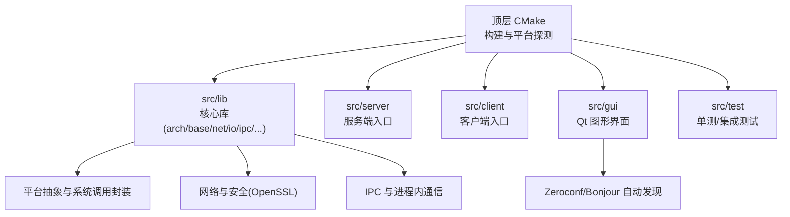
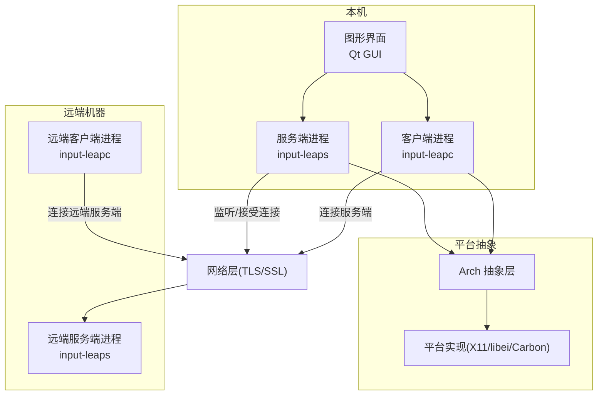
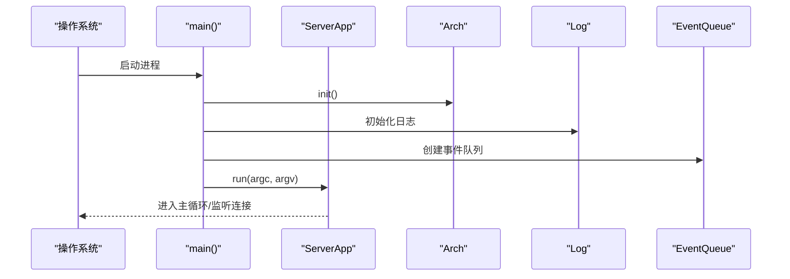
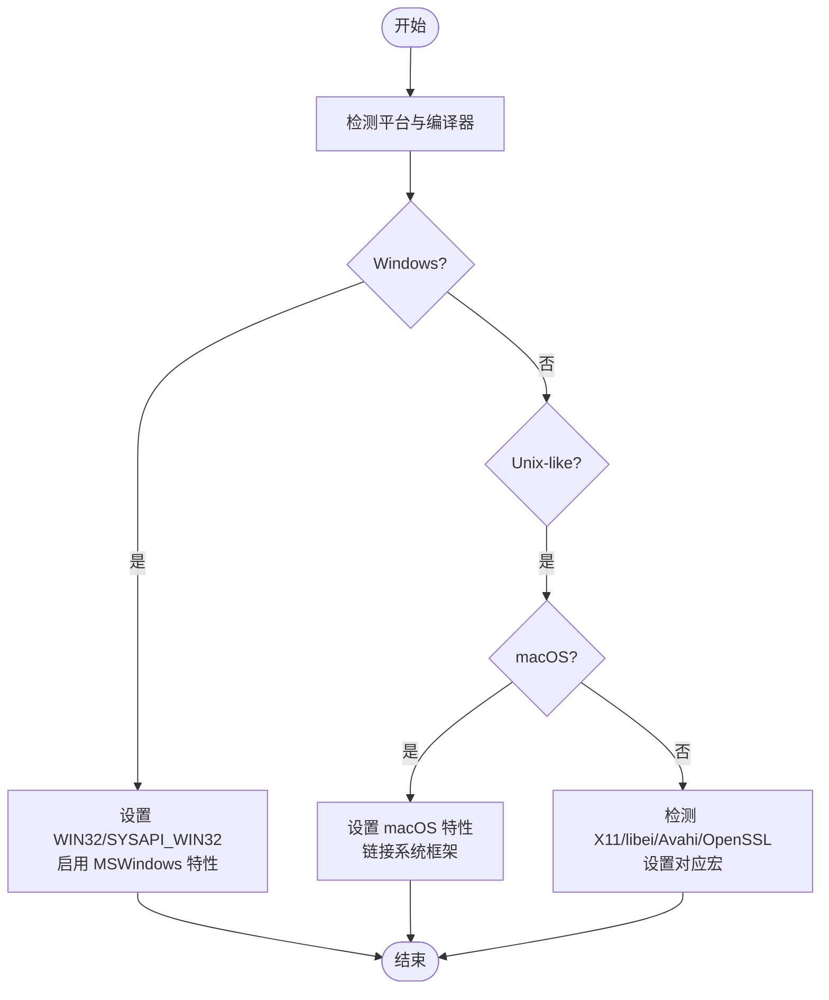
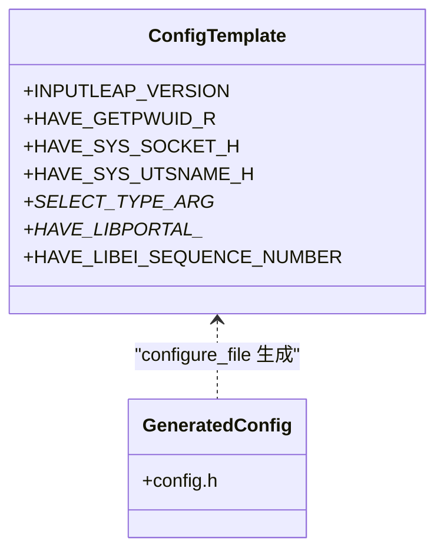
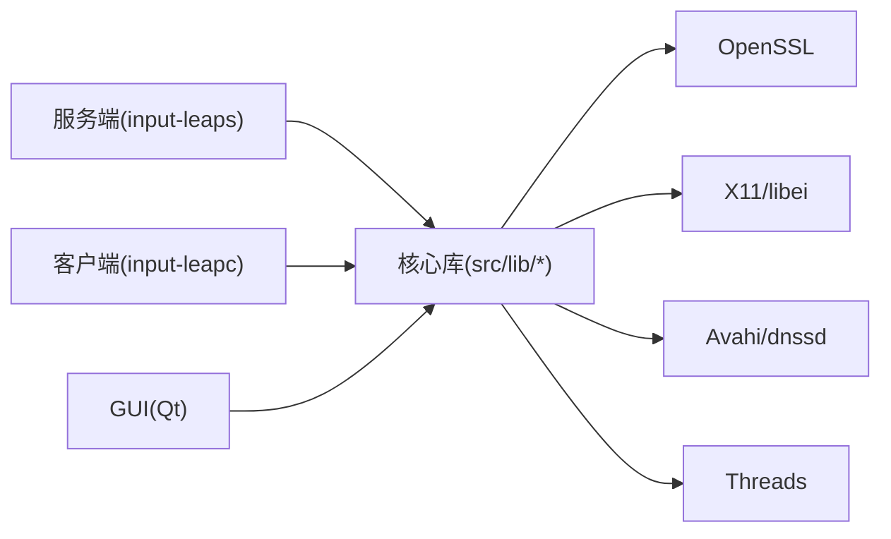

# 项目概述

<cite>
**本文引用的文件**   
- [README.md](file://README.md)
- [CMakeLists.txt](file://CMakeLists.txt)
- [src/lib/CMakeLists.txt](file://src/lib/CMakeLists.txt)
- [src/lib/config.h.in](file://src/lib/config.h.in)
- [src/server/input-leaps.cpp](file://src/server/input-leaps.cpp)
- [src/client/input-leapc.cpp](file://src/client/input-leapc.cpp)
</cite>

## 目录
1. [简介](#简介)
2. [项目结构](#项目结构)
3. [核心组件](#核心组件)
4. [架构总览](#架构总览)
5. [详细组件分析](#详细组件分析)
6. [依赖关系分析](#依赖关系分析)
7. [性能与可靠性考量](#性能与可靠性考量)
8. [故障排查指南](#故障排查指南)
9. [结论](#结论)
10. [附录](#附录)

## 简介
Input Leap 是一款软件 KVM 切换器，允许用户使用一套键盘和鼠标跨多台计算机工作。它通过“服务器-客户端”模式将输入事件从一台主机转发到另一台主机，用户只需将鼠标移动到屏幕边缘或按下特定按键即可在系统间切换焦点。该项目强调简洁、可靠与跨平台兼容，目标是解决历史版本中遇到的稳定性问题，并在多操作系统环境下提供一致体验。

- 目标与理念
  - 简洁易用：聚焦于“用一套键鼠控制多台电脑”的核心场景，避免功能膨胀。
  - 高可靠：以稳定优先，持续修复已知问题并提升健壮性。
  - 开放透明：开源协作，问题跟踪公开，社区参与度高。
  - 跨平台：支持 Windows、macOS、Linux、FreeBSD、OpenBSD。

- 与 Synergy 的区别
  - Input Leap 不兼容 Synergy，且更强调保持早期版本的简洁性与稳定性。
  - 剪贴板共享可用（注意：Linux/Wayland 下暂不支持）。

- 与其他工具的对比
  - 与 Barrier：Input Leap 由 Barrier 的活跃维护者发起的分叉，Barrier 目前被视为不再积极维护。
  - 与商业方案：Input Leap 坚持开源与免费，降低部署成本与许可风险。

- 技术栈选择
  - C++ 作为主要语言，Qt 用于图形界面（可选），OpenSSL 用于安全通信，X11 或 libei 用于 Linux 输入捕获/注入，Avahi/dnssd 用于局域网自动发现。

章节来源
- [README.md:10-46](file://README.md#L10-L46)
- [README.md:105-127](file://README.md#L105-L127)
- [README.md:148-156](file://README.md#L148-L156)

## 项目结构
仓库采用分层与模块化组织方式，顶层 CMake 负责构建配置与平台探测，源码位于 src 下，按职责划分为库层、服务端、客户端与 GUI 等子模块。

- 顶层构建
  - 使用 CMake 管理跨平台构建，启用 C++14/17，按需开启 Qt GUI、X11、libei、OpenSSL、Avahi 等特性。
  - 根据平台定义宏（如 SYSAPI_WIN32、WINAPI_MSWINDOWS、WINAPI_XWINDOWS、WINAPI_LIBEI、WINAPI_CARBON）以条件编译适配不同系统。

- 源码目录
  - src/lib：核心库，包含 arch、base、client、common、io、ipc、mt、net、platform、server、inputleap 等子模块。
  - src/server：服务端可执行入口，初始化架构、日志、事件队列，启动 ServerApp。
  - src/client：客户端可执行入口，初始化架构、日志、事件队列，启动 ClientApp。
  - src/gui：基于 Qt 的图形界面，提供可视化配置、向导、零配置发现等功能。
  - src/test：单元测试、集成测试与模拟对象。

图表来源
- [CMakeLists.txt:18-45](file://CMakeLists.txt#L18-L45)
- [CMakeLists.txt:230-247](file://CMakeLists.txt#L230-L247)
- [src/lib/CMakeLists.txt:20-30](file://src/lib/CMakeLists.txt#L20-L30)

章节来源
- [CMakeLists.txt:18-45](file://CMakeLists.txt#L18-L45)
- [CMakeLists.txt:230-247](file://CMakeLists.txt#L230-L247)
- [src/lib/CMakeLists.txt:20-30](file://src/lib/CMakeLists.txt#L20-L30)

## 核心组件
- 服务端（Server）
  - 负责监听来自客户端的连接，接收输入事件并注入到本地系统。
  - 典型入口：server_main 初始化 Arch、Log、EventQueue，然后运行 ServerApp。

- 客户端（Client）
  - 连接至服务端，将本地输入事件转发给服务端，并可同步剪贴板等状态。
  - 典型入口：client_main 初始化 Arch、Log、EventQueue，然后运行 ClientApp。

- 核心库（src/lib）
  - arch：平台抽象层，统一不同 OS 的系统能力访问。
  - base：基础工具（日志、事件队列、字符串处理等）。
  - net：网络传输与安全（TLS/SSL）。
  - io/ipc：I/O 与进程间通信。
  - platform：平台相关实现（X11、libei、Carbon 等）。
  - server/client：服务端/客户端业务逻辑。
  - inputleap：高层应用编排与配置解析。

- 图形界面（GUI）
  - 基于 Qt，提供可视化网格布局、屏幕命名、向导式配置、自动发现（Bonjour/Avahi）、证书管理等。

章节来源
- [src/server/input-leaps.cpp:34-63](file://src/server/input-leaps.cpp#L34-L63)
- [src/client/input-leapc.cpp:34-56](file://src/client/input-leapc.cpp#L34-L56)
- [src/lib/CMakeLists.txt:20-30](file://src/lib/CMakeLists.txt#L20-L30)

## 架构总览
Input Leap 采用“服务器-客户端”模型，结合平台抽象与跨平台网络/输入子系统，实现统一的键鼠共享体验。

图表来源
- [src/server/input-leaps.cpp:34-63](file://src/server/input-leaps.cpp#L34-L63)
- [src/client/input-leapc.cpp:34-56](file://src/client/input-leapc.cpp#L34-L56)
- [CMakeLists.txt:230-247](file://CMakeLists.txt#L230-L247)
- [CMakeLists.txt:162-196](file://CMakeLists.txt#L162-L196)

## 详细组件分析

### 服务端启动流程
服务端进程负责初始化平台抽象、日志与事件循环，随后进入主循环等待客户端连接并处理输入事件。

图表来源
- [src/server/input-leaps.cpp:34-63](file://src/server/input-leaps.cpp#L34-L63)

章节来源
- [src/server/input-leaps.cpp:34-63](file://src/server/input-leaps.cpp#L34-L63)

### 客户端启动流程
客户端进程与服务端类似，但侧重于建立与服务端的连接并将本地输入事件转发出去。

图表来源
- [src/client/input-leapc.cpp:34-56](file://src/client/input-leapc.cpp#L34-L56)

章节来源
- [src/client/input-leapc.cpp:34-56](file://src/client/input-leapc.cpp#L34-L56)

### 构建与平台特性开关
构建系统根据平台与选项生成配置宏，决定启用哪些平台后端与特性。

图表来源
- [CMakeLists.txt:230-247](file://CMakeLists.txt#L230-L247)
- [CMakeLists.txt:162-196](file://CMakeLists.txt#L162-L196)
- [CMakeLists.txt:117-132](file://CMakeLists.txt#L117-L132)

章节来源
- [CMakeLists.txt:162-196](file://CMakeLists.txt#L162-L196)
- [CMakeLists.txt:230-247](file://CMakeLists.txt#L230-L247)
- [CMakeLists.txt:117-132](file://CMakeLists.txt#L117-L132)

### 配置头生成
config.h.in 模板经 CMake 处理后生成 config.h，集中保存编译期检测到的平台与特性宏，供代码条件编译使用。

图表来源
- [src/lib/config.h.in:1-42](file://src/lib/config.h.in#L1-L42)
- [src/lib/CMakeLists.txt:17-18](file://src/lib/CMakeLists.txt#L17-L18)

章节来源
- [src/lib/config.h.in:1-42](file://src/lib/config.h.in#L1-L42)
- [src/lib/CMakeLists.txt:17-18](file://src/lib/CMakeLists.txt#L17-L18)

## 依赖关系分析
- 外部依赖
  - OpenSSL：加密与认证（TLS/SSL）。
  - Qt：图形界面（可选）。
  - X11 或 libei：Linux 下的输入捕获与注入。
  - Avahi/dnssd：局域网服务发现（Bonjour）。
  - Threads/pthread：多线程。
  - gtest：单元测试框架（可选）。

- 内部模块耦合
  - server/client 均依赖 arch/base/net/io/ipc/platform 等核心库。
  - GUI 依赖 Zeroconf 与 IPC 机制进行配置与状态同步。

图表来源
- [CMakeLists.txt:258-258](file://CMakeLists.txt#L258-L258)
- [CMakeLists.txt:162-196](file://CMakeLists.txt#L162-L196)
- [CMakeLists.txt:112-115](file://CMakeLists.txt#L112-L115)

章节来源
- [CMakeLists.txt:258-258](file://CMakeLists.txt#L258-L258)
- [CMakeLists.txt:162-196](file://CMakeLists.txt#L162-L196)
- [CMakeLists.txt:112-115](file://CMakeLists.txt#L112-L115)

## 性能与可靠性考量
- 事件驱动与线程模型
  - 使用事件队列与平台抽象层，减少阻塞，提高吞吐。
  - 合理划分网络 I/O、输入捕获与 UI 线程，避免互相阻塞。

- 网络与安全
  - 默认启用 TLS/SSL，保障传输安全；需平衡握手开销与延迟。
  - 连接池与重连策略对稳定性至关重要。

- 平台差异
  - Linux 下 X11 与 Wayland/libei 行为差异较大，需针对后端优化输入注入路径。
  - macOS 与 Windows 的权限与沙箱限制会影响剪贴板与输入注入性能。

- 资源管理
  - 谨慎管理 socket、文件描述符与内存分配，避免泄漏。
  - 日志级别与输出频率应可调，避免在生产环境造成额外开销。

[本节为通用指导，无需具体文件引用]

## 故障排查指南
- 常见问题定位
  - 确认服务端与客户端的“屏幕名称”完全匹配（区分大小写）。
  - 检查防火墙与端口连通性，确保 TLS 握手成功。
  - 在 Linux/Wayland 下剪贴板共享不可用属已知限制。
  - 若 Scroll Lock 激活，可能阻止鼠标跨屏切换。

- 调试建议
  - 启用详细日志，观察连接建立与事件转发过程。
  - 使用 GUI 的“自动发现”功能验证 Bonjour/Avahi 是否正常工作。
  - 在 Windows 下可通过任务栏托盘图标快速查看状态。

章节来源
- [README.md:50-67](file://README.md#L50-L67)
- [README.md:148-156](file://README.md#L148-L156)

## 结论
Input Leap 以简洁、可靠与跨平台为核心价值，通过清晰的“服务器-客户端”架构与完善的平台抽象，实现了稳定的键鼠共享体验。其开源生态与活跃的社区协作进一步提升了项目的可维护性与扩展性。对于初学者，可从 GUI 向导与示例配置入手；对于有经验的开发者，可深入核心库与平台后端，针对特定系统进行优化与定制。

[本节为总结性内容，无需具体文件引用]

## 附录
- 术语对照
  - 服务器（Server）：接收并注入输入事件的主机进程。
  - 客户端（Client）：连接至服务端并将本地输入转发的进程。
  - 屏幕名称（Screen Name）：用于标识每台机器的唯一名称，需在配置中严格匹配。
  - 自动发现（Auto-discovery）：基于 Bonjour/Avahi 的局域网设备发现机制。

- 参考文档与示例
  - 配置文件示例位于 doc 目录下，便于快速上手与高级定制。

[本节为补充信息，无需具体文件引用]